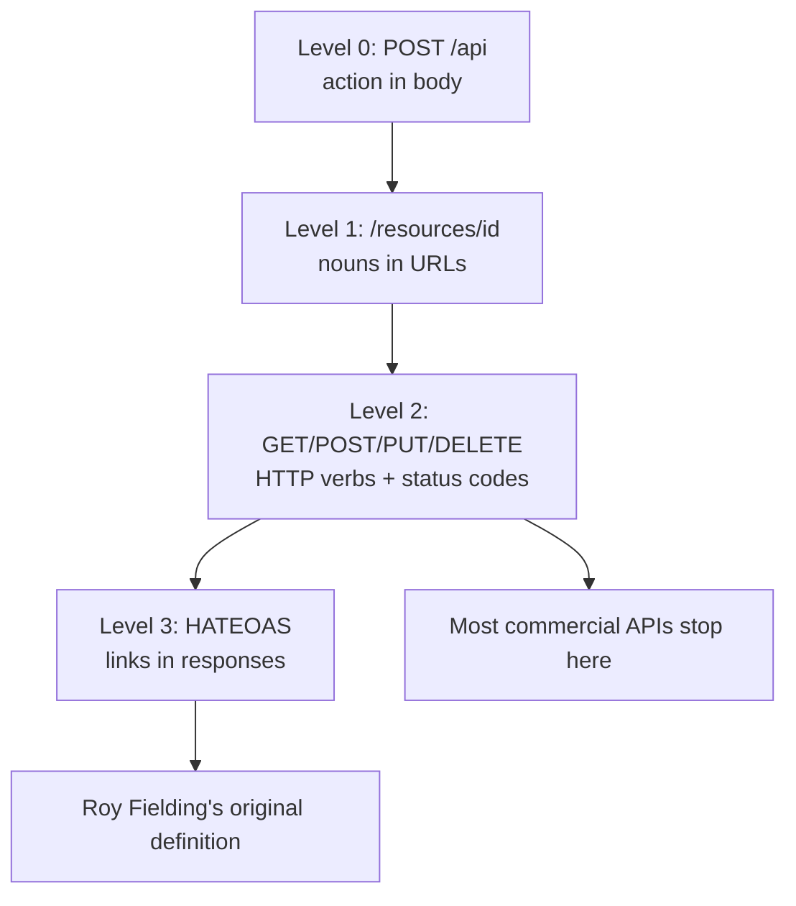

⚡ TL;DR - REST is not a standard or a protocol - it is an
architectural style with six constraints (stateless, uniform
interface, client-server, cacheable, layered system, code
on demand) defined by Roy Fielding in his 2000 dissertation,
and most "REST APIs" violate at least one constraint.

---

| #014 | Category: HTTP & APIs | Difficulty: ★☆☆ |
|:---|:---|:---|
| **Depends on:** | What REST Actually Means, HTTP Methods, URL Structure | |
| **Used by:** | RESTful API Design, Resource Design and HATEOAS, API-First Design | |
| **Related:** | Idempotency, API Versioning, API Endpoint Design | |

---

### 🔥 The Problem This Solves

**WORLD WITHOUT IT:**
In 1999, the web had no principled framework for evaluating
why one distributed system design was better than another.
CORBA, DCOM, and RPC-based systems required tight coupling
between client and server implementations. Adding a new
client type (mobile, browser, partner API consumer) required
updating every client's generated stubs. Changing a server
required coordinating with every client simultaneously.
The web was already working at global scale without these
problems - but nobody had articulated WHY it worked.

**THE BREAKING POINT:**
Roy Fielding was co-author of HTTP/1.1 and a founder of
the Apache HTTP Server project. He needed to understand
what design properties made the web scalable to millions
of clients and hundreds of servers without central
coordination. He could not advise the HTTP/1.1 design
process without a formal framework for evaluating whether
a proposed feature would improve or harm the web's
architecture.

**THE INVENTION MOMENT:**
Fielding's 2000 PhD dissertation "Architectural Styles and
the Design of Network-based Software Architectures" defined
REST (Representational State Transfer) as a set of
architectural constraints. Each constraint was derived from
studying what made the web work at scale. REST was the
name for the architectural style that the web's design
had already implemented. Fielding was not inventing a new
protocol - he was naming and formalizing what already existed.

**EVOLUTION:**
Fielding's dissertation was largely unknown until 2000.
After the Ajax revolution (2005), developers seeking an
alternative to SOAP discovered "REST" and the term became
ubiquitous - but loosely defined. Most "REST APIs" are
actually "HTTP APIs" that use JSON and follow URL
conventions but violate REST's HATEOAS constraint. Fielding
himself has written that most APIs called REST are not
actually REST. The practical industry definition of "REST"
is much looser than Fielding's original.

---

### 📘 Textbook Definition

REST (Representational State Transfer) is an architectural
style for distributed hypermedia systems, defined by Roy
Fielding in his 2000 dissertation. REST is characterized
by six architectural constraints: client-server separation,
statelessness, cacheability, uniform interface, layered
system, and code on demand (optional). These constraints
collectively produce a system with the web's desirable
properties: scalability, visibility, portability,
reliability, and performance. A system conforming to all
REST constraints is called RESTful.

---

### ⏱️ Understand It in 30 Seconds

**One line:**
REST is the set of constraints that make distributed
systems scalable without tight coupling - derived from
studying why the web works at global scale.

**One analogy:**
> The web is REST's reference implementation. A browser
> does not need to know how many servers power a website.
> Servers do not need to remember which browser made the
> last request. CDNs can cache any page without knowing
> the application. Plugins (code on demand) add capability
> without changing the protocol. Every REST constraint is
> visible in the web's design - Fielding just named them.

**One insight:**
The most violated REST constraint in practice is HATEOAS
(Hypermedia as the Engine of Application State). True REST
APIs return links to available actions in every response,
like a web page's HTML links. Almost no commercial REST
API does this - clients hard-code URLs instead. This means
most REST APIs are actually REST-like HTTP APIs, not REST
in Fielding's original sense.

---

### 🔩 First Principles Explanation

**THE SIX CONSTRAINTS:**

**1. Client-Server Separation**
- Client and server are separate, communicate only over
  the interface (API)
- Server logic can change without breaking clients
- Client UI can change without changing the server
- Effect: independent evolvability, portability

**2. Statelessness**
- Each request contains all information needed to process it
- Server stores no session state between requests
- Effect: horizontal scalability (any server can handle
  any request), visibility (each request is self-describing),
  reliability (failed requests can be retried)
- Cost: more data per request (auth token on every call)

**3. Cacheability**
- Responses must be labeled as cacheable or non-cacheable
- Caching eliminates some client-server interactions
- Effect: improved efficiency and scalability
- Mechanism: `Cache-Control`, `ETag`, `Last-Modified` headers

**4. Uniform Interface**
The most defining constraint. Four sub-constraints:

| Sub-constraint | Meaning |
|:---|:---|
| Resource identification | Resources identified by URI |
| Manipulation via representations | Resource state transferred as representations (JSON, HTML); client holds representation, not the resource |
| Self-descriptive messages | Each message carries enough information to describe how to process it (Content-Type, method semantics) |
| HATEOAS | Hypermedia as the Engine of Application State - responses include links to available next actions |

**5. Layered System**
- Client does not know whether it is connected directly
  to the server or through an intermediary (CDN, proxy,
  load balancer)
- Intermediaries can add caching, security, load balancing
- Effect: scalability and security through layers

**6. Code on Demand (optional)**
- Servers can extend client functionality by sending
  executable code (JavaScript in web browsers)
- The only optional constraint
- Effect: simplifies clients by offloading some logic to server

**THE DERIVATION:**
Each constraint adds a property and removes a design
freedom. Statelessness adds scalability but removes the
ability to maintain server-side sessions. Uniform interface
adds generality but reduces optimization opportunity for
specific cases. The net result is a system that scales to
the web's size without any of the components knowing
each other's internals.

---

### 🧪 Thought Experiment

**SETUP:**
You have a RESTful API. A client calls `GET /orders/42`
and receives the order JSON. Six months later, you want
to change the URL for all orders to `/v2/purchases/{id}`
to reflect a business name change. How do REST constraints
affect this change?

**WITH HATEOAS (full REST):**
The original response for `GET /orders/42` included:
```json
{
  "_links": {
    "self": "/orders/42",
    "cancel": "/orders/42/cancel",
    "items": "/orders/42/items"
  }
}
```
Clients discover URLs from the response, not from
hard-coded paths. You add a redirect from `/orders/42`
to `/v2/purchases/42`. Clients follow the redirect.
URL change is backward-compatible.

**WITHOUT HATEOAS (typical REST APIs):**
Clients have `/orders/{id}` hard-coded in their source
code. Changing the URL requires notifying every client
developer, providing a migration guide, maintaining both
URL patterns during a transition period, and risking that
some clients never migrate and eventually break.

**THE INSIGHT:**
HATEOAS is the constraint that makes REST APIs truly
evolvable without client coordination. It is also the
constraint that almost no commercial API implements,
because it requires clients to be hypermedia-aware rather
than URL-hard-coding. The industry chose pragmatism over
purity - and lives with the URL versioning problem
(`/v1/`, `/v2/`) as a consequence.

---

### 🧠 Mental Model / Analogy

> Think of REST constraints as the rules of a highway system.
> Client-server: cars (clients) and roads (servers) are
> separate systems that communicate through the driving
> interface. Stateless: each car's GPS makes no assumptions
> about where the road remembers it has been. Cacheable:
> maps show which roads are usually clear (cached routes).
> Uniform interface: all cars use the same driving controls
> regardless of road type. Layered: cars do not know whether
> the road is tarmac, concrete, or elevated steel. HATEOAS:
> road signs tell drivers what to do next, not just where
> they are.

Mapping:
- "Cars" → API clients (browsers, mobile apps)
- "Roads" → API servers
- "Driving interface" → HTTP methods + URLs
- "GPS without memory" → stateless requests
- "Road signs" → HATEOAS links in responses

Where this analogy breaks down: REST applies to software
communication, not physical transport. The HATEOAS equivalent
in roads would be signs saying "next: turn left OR continue
straight" embedded in every response - most APIs do not
do this; they expect clients to know the route.

---

### 📶 Gradual Depth - Five Levels

**Level 1 - What it is (anyone can understand):**
REST is a set of design rules for building web APIs. The
most important rules: use URLs to identify things ("nouns"),
use HTTP methods to describe actions ("verbs"), and make
each request complete in itself. These rules make APIs
predictable and scalable.

**Level 2 - How to use it (junior developer):**
Apply the four practical REST rules: use nouns in URLs
(`/users`, not `/getUsers`), use HTTP methods correctly
(GET to read, POST to create, PUT/PATCH to update, DELETE
to remove), return appropriate status codes, and represent
data as JSON. These are the 20% of REST that 80% of APIs use.

**Level 3 - How it works (mid-level engineer):**
REST's six constraints derive from what makes distributed
systems scalable: statelessness enables horizontal scaling
(any server handles any request), cacheability reduces
server load, uniform interface decouples client and server
evolution. The Richardson Maturity Model (RMM) defines
levels 0-3 of REST adoption: Level 0 (one URL, all POST),
Level 1 (resources as URLs), Level 2 (HTTP verbs), Level 3
(HATEOAS). Most commercial APIs reach Level 2.

**Level 4 - Why it was designed this way (senior/staff):**
Fielding derived REST from studying the web's success.
Every constraint was a response to a specific scalability
or coupling problem in distributed systems. Statelessness
prevents server-side session affinity (any server can serve
any request). Uniform interface prevents tight coupling
between client and server (client does not need to know
server internals). HATEOAS prevents URL hard-coding
(server controls navigation). The constraints trade off
immediate simplicity for long-term evolvability. Most
teams accept less evolvability in exchange for simpler
implementation - hence Level 2 REST being the industry norm.

**Level 5 - Mastery (distinguished engineer):**
The REST vs RPC debate fundamentally differs in where
the contract lives. In REST, the contract is the HTTP
protocol itself (methods, status codes, content types,
HATEOAS links) - clients navigate the API by following
the protocol, not by knowing specific URLs or operation
names. In RPC (gRPC, SOAP), the contract is the schema
file (.proto, WSDL) - clients know operation names and
message types from the schema. REST's contract is more
implicit and universally understood; RPC's contract is
more explicit and precise. REST scales in client diversity
(anyone who knows HTTP can use it); RPC scales in
operation complexity (typed, versioned, generated).
The best architectural choice depends on whether client
diversity or operation complexity is the dominant concern.

---

### ⚙️ How It Works (Mechanism)

**Richardson Maturity Model:**

```
┌──────────────────────────────────────────────────────┐
│           Richardson Maturity Model (RMM)            │
├──────────────────────────────────────────────────────┤
│                                                      │
│  Level 3 - HATEOAS (True REST)                       │
│  └─ Response includes links to available actions     │
│     {"_links": {"cancel": "/orders/42/cancel"}}      │
│                                                      │
│  Level 2 - HTTP Verbs (Industry "REST")              │
│  └─ GET /users, POST /users, DELETE /users/42        │
│     Correct status codes, JSON responses             │
│                                                      │
│  Level 1 - Resources                                 │
│  └─ /users/42 identifies a resource                  │
│     But uses POST for everything                     │
│                                                      │
│  Level 0 - One URL                                   │
│  └─ POST /api with action in body                    │
│     SOAP, XML-RPC, many legacy APIs                  │
└──────────────────────────────────────────────────────┘
```



**HATEOAS example (Level 3 REST):**

```json
GET /orders/42

{
  "id": "42",
  "status": "processing",
  "total_cents": 4999,
  "_links": {
    "self": {"href": "/orders/42"},
    "cancel": {"href": "/orders/42/cancel",
               "method": "POST"},
    "items": {"href": "/orders/42/items",
              "method": "GET"},
    "payment": {"href": "/orders/42/payment",
                "method": "GET"}
  }
}
```

Client navigates by following links - does not need to
know `/orders/42/cancel` URL in advance.

---

### 🔄 The Complete Picture - End-to-End Flow

**Statelessness in practice:**

```
WITHOUT STATELESSNESS (session-based):
  Request 1: POST /login → Server creates session_id=ABC
  Request 2: GET /orders → Must hit same server (sticky session)
  Request 3: GET /users  → Must hit same server (session data)
  Scale: all requests from one client → one server

WITH STATELESSNESS (REST):
  Request 1: GET /orders + Authorization: Bearer TOKEN
  Request 2: GET /users  + Authorization: Bearer TOKEN
  Scale: any server can handle any request (the token
  carries all auth state; any server can verify it)
```

**Six constraints → system properties:**

```
Constraint            → Property Gained
──────────────────────────────────────────
Client-Server         → Independent evolvability
Stateless             → Scalability, reliability, visibility
Cacheable             → Efficiency, performance
Uniform Interface     → Generality, decoupled evolution
Layered System        → Security, scalability
Code on Demand (opt.) → Extensibility, client simplicity
```

---

### 💻 Code Example

**Example 1 - Level 0 vs Level 2 vs Level 3 REST**

```python
# LEVEL 0: One endpoint, action in body (SOAP-style)
@app.route("/api", methods=["POST"])
def rpc():
    action = request.json["action"]
    if action == "getOrder":
        return jsonify(get_order(request.json["id"]))
    elif action == "cancelOrder":
        return jsonify(cancel_order(request.json["id"]))

# LEVEL 2: Resources + HTTP verbs + status codes
@app.route("/orders/<order_id>", methods=["GET"])
def get_order(order_id):
    order = db.orders.find(order_id)
    if not order:
        return jsonify({"error": "not found"}), 404
    return jsonify(order.to_dict()), 200

@app.route("/orders/<order_id>/cancel", methods=["POST"])
def cancel_order(order_id):
    order = db.orders.find(order_id)
    if not order:
        return jsonify({"error": "not found"}), 404
    order.cancel()
    return jsonify(order.to_dict()), 200

# LEVEL 3: HATEOAS links in response
@app.route("/orders/<order_id>", methods=["GET"])
def get_order_hateoas(order_id):
    order = db.orders.find(order_id)
    if not order:
        return jsonify({"error": "not found"}), 404

    response = order.to_dict()
    links = {"self": f"/orders/{order_id}"}

    if order.status == "processing":
        links["cancel"] = {
            "href": f"/orders/{order_id}/cancel",
            "method": "POST"
        }
    if order.status in ("processing", "shipped"):
        links["track"] = {
            "href": f"/orders/{order_id}/tracking",
            "method": "GET"
        }

    response["_links"] = links
    return jsonify(response), 200
```

---

**Example 2 - Stateless vs stateful API design**

```python
# BAD: stateful - server remembers client context
class APIServer:
    def __init__(self):
        self.active_user = {}  # server-side state!

    @app.route("/set-user/<user_id>", methods=["POST"])
    def set_context(self, user_id):
        # WRONG: state stored on server per-request
        self.active_user[request.remote_addr] = user_id
        return "", 200

    @app.route("/orders")
    def get_orders(self):
        # Depends on prior /set-user call - breaks scaling
        user_id = self.active_user[request.remote_addr]
        return jsonify(db.orders.for_user(user_id))

# GOOD: stateless - client sends all context per request
@app.route("/users/<user_id>/orders")
def get_user_orders(user_id):
    # Auth from request header - no server state needed
    token = request.headers.get("Authorization")
    current_user = verify_token(token)

    if current_user.id != int(user_id):
        return jsonify({"error": "forbidden"}), 403

    orders = db.orders.for_user(user_id)
    return jsonify(orders), 200
# Any server can handle this request - no affinity needed
```

---

### ⚖️ Comparison Table

| Aspect | REST (Level 2) | REST (Level 3 / True REST) | RPC (gRPC) |
|:---|:---|:---|:---|
| **URL discovery** | Docs or hard-coded | HATEOAS links in responses | Protobuf IDL |
| **State management** | Stateless | Stateless | Stateless |
| **Caching** | Via HTTP headers | Via HTTP headers | None built-in |
| **Client coupling** | URL patterns | Navigation from server | Generated stubs |
| **Schema** | OpenAPI (optional) | HAL/JSON-LD/Hydra | .proto (required) |
| **Used by** | Most commercial APIs | GitHub API v1, PayPal API | Google, Netflix internal |

---

### ⚠️ Common Misconceptions

| Misconception | Reality |
|:---|:---|
| REST is a standard or specification | REST is an architectural style described in a PhD dissertation. There is no REST specification to implement - only architectural constraints to follow. |
| Any HTTP API with JSON is REST | REST requires at minimum stateless, client-server, cacheable, and uniform interface. Most "REST APIs" are HTTP APIs that use REST conventions but do not implement HATEOAS. |
| REST is always better than RPC | Each is optimal for different contexts. REST excels at public APIs with diverse clients. RPC excels at typed, high-performance internal service communication. |
| REST requires HATEOAS | REST requires HATEOAS for Level 3. The industry widely uses Level 2 (HTTP verbs + resources) and calls it REST. Fielding considers this "not REST." Both positions are internally consistent. |
| REST is stateless means no sessions | REST's statelessness constraint means the server stores no session state. The client still has state (tokens, user data in the browser). OAuth tokens are client-managed state. |

---

### 🚨 Failure Modes & Diagnosis

**Session state breaks horizontal scaling**

**Symptom:** After scaling from 1 to N servers, some API
requests fail with "not logged in" despite the user having
just logged in. Consistent failures on some users, success
on others.

**Root Cause:** Session state stored in memory on individual
server instances. Load balancer routes requests to different
servers. The server that holds the session is not always
the server that receives the next request.

**Diagnostic Command / Tool:**

```bash
# Test if session is server-specific
for i in {1..10}; do
  curl -s -b "session_id=abc" \
    https://api.example.com/profile | \
    python3 -c "import json,sys; \
    d=json.load(sys.stdin); \
    print(d.get('user_id','NOT FOUND'))"
done
# If output alternates between user_id and NOT FOUND:
# session state is not shared across servers
```

**Fix:** Move session state to shared storage (Redis,
database) keyed by session ID. Or move to stateless tokens
(JWT) where all auth state is in the client-held token.

**Prevention:** Design stateless from the start. Each
request must carry all the information the server needs
to process it (token, user context) without relying on
prior requests.

---

**URL hard-coding breaks on API version change**

**Symptom:** After releasing v2 of the API with a new URL
pattern, old mobile app versions stop working. Customer
support tickets spike. Rollback is required.

**Root Cause:** Mobile clients hard-coded API endpoint URLs.
Version change required new URLs (`/v2/` prefix). No
HATEOAS - clients cannot discover new URLs from the API.

**Diagnostic Command / Tool:**

```bash
# Check how many requests still hit /v1/ after v2 launch
grep "/v1/" /var/log/nginx/access.log | \
  awk '{print $4}' | \
  cut -d: -f1 | sort | uniq -c
# High volume after v2 launch = clients still on old URLs
```

**Fix (short-term):** Add permanent redirects from v1 to v2
URLs. Fix (long-term): implement HATEOAS in the API so
clients navigate via links; or establish a stable API
versioning strategy (see API-073).

---

**Missing Cache-Control violates cacheability constraint**

**Symptom:** API response times are high despite low server
load. CDN hit rate is 0%. Every request goes to origin.
Cost is high despite relatively low user count.

**Root Cause:** API responses do not include `Cache-Control`
headers. CDN defaults to "not cacheable" for responses
without explicit caching headers. REST's cacheability
constraint requires explicit cache labeling.

**Diagnostic Command / Tool:**

```bash
# Check if responses include Cache-Control
curl -v https://api.example.com/products/42 2>&1 | \
  grep -i "cache-control"
# Empty = CDN will not cache
# "no-store" = correct for private data
# "max-age=3600" = correct for cacheable resources
```

**Fix:** Add explicit `Cache-Control` headers. Public,
rarely-changing data: `public, max-age=3600`. User-specific
data: `private, no-store`. See API-020 for complete caching
header strategy.

---

### 🔗 Related Keywords

**Prerequisites (understand these first):**
- `What REST Actually Means` - the REST constraints at
  an accessible level
- `HTTP Methods` - REST's uniform interface uses HTTP
  methods as the verb vocabulary
- `URL and URI Structure` - REST's resource identification
  sub-constraint uses URIs

**Builds On This (learn these next):**
- `RESTful API Design Patterns` - applying REST constraints
  to real API design decisions
- `REST Resource Design and HATEOAS` - deep dive into
  the HATEOAS constraint
- `API-First Design Strategy` - applying REST principles
  from the start of a project

**Alternatives / Comparisons:**
- `gRPC and Protocol Buffers` - RPC alternative: schema-first,
  typed, explicit contract vs REST's implicit HTTP contract
- `GraphQL Query Language` - query-first alternative to REST's
  resource-first model

---

### 📌 Quick Reference Card

```
┌──────────────────────────────────────────────────────────┐
│ WHAT IT IS   │ Six architectural constraints derived     │
│              │ from studying why the web scales          │
├──────────────┼───────────────────────────────────────────┤
│ PROBLEM IT   │ How to build distributed systems that     │
│ SOLVES       │ scale without tight client-server coupling│
├──────────────┼───────────────────────────────────────────┤
│ KEY INSIGHT  │ Most commercial "REST" APIs are Level 2   │
│              │ (HTTP verbs); true REST requires HATEOAS  │
├──────────────┼───────────────────────────────────────────┤
│ USE WHEN     │ Public APIs, diverse clients, standard    │
│              │ HTTP infrastructure (CDN, proxy, tools)   │
├──────────────┼───────────────────────────────────────────┤
│ AVOID WHEN   │ High-performance internal service mesh    │
│              │ where RPC contracts are preferred         │
├──────────────┼───────────────────────────────────────────┤
│ ANTI-PATTERN │ Verbs in URLs (/getUser), hard-coded URLs │
│              │ in clients, server-side session state     │
├──────────────┼───────────────────────────────────────────┤
│ TRADE-OFF    │ Evolvability (HATEOAS) vs simplicity      │
│              │ (Level 2 + URL versioning)                │
├──────────────┼───────────────────────────────────────────┤
│ ONE-LINER    │ "REST names why the web scales. Most APIs  │
│              │ implement Level 2, not all six constraints"│
├──────────────┼───────────────────────────────────────────┤
│ NEXT EXPLORE │ RESTful API Design → HATEOAS →            │
│              │ API Versioning Strategies                 │
└──────────────────────────────────────────────────────────┘
```

**If you remember only 3 things:**
1. REST has six constraints. Statelessness is the most
   important for scalability: each request must be self-
   contained, no server-side session state.
2. Most commercial REST APIs are Level 2 (resources + HTTP
   verbs + status codes). Level 3 (HATEOAS) is rare
   in practice.
3. REST is an architectural style, not a standard. There
   is no "REST specification" to conform to. The constraints
   are design guidelines, not rules enforced by any software.

---

### 💎 Transferable Wisdom

**Reusable Engineering Principle:**
Constraints enable evolution. Each REST constraint removes
a design freedom but enables a system property that would
be impossible without that constraint. Statelessness removes
the freedom to store per-client server state, but enables
any server to handle any client's request. HATEOAS removes
the freedom to hard-code URLs in clients, but enables the
server to change its URL structure without breaking clients.
The best architecture constraints are those where the
property gained is worth more than the freedom lost.

**Where else this pattern appears:**
- Immutability in functional programming: removes the
  freedom to mutate state, enables referential transparency
  and safe concurrency
- Single Responsibility Principle: removes the freedom
  to do multiple things in one class, enables independent
  testing and replacement
- Pure functions: remove side effects (freedom to call
  external services), enable testability and composability

---

### 💡 The Surprising Truth

Roy Fielding wrote a blog post in 2008, eight years after
his dissertation, complaining that the APIs being called
"REST" were not actually REST. His exact words: "I am
getting frustrated by the number of people calling any
HTTP-based interface a REST API. Today's example is the
SocialSite REST API. That is RPC. It screams RPC. There
is so much coupling on display that it should be given
an X rating." The industry adopted the word "REST" to
mean "better than SOAP" or "HTTP with JSON" - not Fielding's
original architectural definition. This is not unusual
in engineering: "agile," "microservices," and "serverless"
all have precise original definitions that the industry
adopted loosely. The lesson: always ask which definition
of a term you are using when architectural discussions
arise.

---

### ✅ Mastery Checklist

**You've mastered this when you can:**
1. **EXPLAIN** Describe the six REST constraints and the
   system property each one enables - without looking at
   notes.
2. **DEBUG** Given an API that breaks when scaled from
   1 to 3 servers (some users "lose" authentication),
   identify the REST constraint violation (stateful session)
   and propose the fix.
3. **DECIDE** Given a new internal service-to-service API,
   decide whether Level 2 REST or gRPC is more appropriate
   with explicit reasoning tied to the constraints.
4. **BUILD** Design a REST Level 3 (HATEOAS) response for
   an order resource, including relevant _links based on
   the order's current status.
5. **EXTEND** Explain the Richardson Maturity Model to
   a team deciding whether to add HATEOAS to their existing
   Level 2 API - what they gain, what it costs, and
   when it is worth the investment.

---

### 🎯 Interview Deep-Dive

**Q1: What are the six REST constraints, and which one
is most important for scalability?**

*Why they ask:* Tests depth of REST knowledge beyond
"use HTTP verbs and JSON."

*Strong answer includes:*
- Six constraints: client-server, stateless, cacheable,
  uniform interface, layered system, code on demand (optional)
- Most important for scalability: statelessness - any server
  can handle any request; no session affinity required;
  horizontal scaling is trivially possible
- Second most important for scalability: cacheability -
  reduces origin server load; CDN can handle repeated reads
- Uniform interface: prevents tight coupling; clients and
  servers can evolve independently

**Q2: What is HATEOAS and why do most commercial REST
APIs not implement it?**

*Why they ask:* Tests whether the candidate has studied
REST beyond the basics and understands real-world trade-offs.

*Strong answer includes:*
- HATEOAS: server includes links to available actions in
  every response; clients navigate via links instead of
  hard-coded URLs
- Example: order response includes `_links.cancel` with
  the URL and method for cancellation - client does not
  need to know `/orders/42/cancel`
- Why not implemented: requires hypermedia-aware clients
  that navigate links; most clients are simpler code that
  expects specific URLs; significant implementation
  complexity for the server
- Practical cost without HATEOAS: URL changes break clients;
  URL versioning (`/v1/`, `/v2/`) is the industry workaround
- Real examples: GitHub API v3 uses HATEOAS for some link
  navigation; Stripe API does not; PayPal API has partial HATEOAS

**Q3: An engineer says your API is "not truly RESTful."
How do you evaluate whether they are correct?**

*Why they ask:* Tests whether the candidate can apply
REST constraints to a real API review.

*Strong answer includes:*
- Evaluate each constraint against the API:
  1. Client-server: is the UI separated from the API logic?
  2. Stateless: does each request carry all needed state?
  3. Cacheable: are responses labeled with Cache-Control?
  4. Uniform interface: nouns in URLs, HTTP verbs, status codes,
     and HATEOAS links?
  5. Layered: can you put a CDN/proxy in front without
     changing client behavior?
  6. Code on demand: optional
- Most Level 2 APIs fail on HATEOAS (sub-constraint 4)
- Ask: does this matter for the API's specific use case?
  HATEOAS is valuable for long-lived APIs with many clients.
  Less valuable for internal APIs with few clients.
- Pragmatic answer: "It implements Level 2 REST (RMM).
  Whether it needs to implement Level 3 depends on how
  important client-server URL decoupling is for this API."
