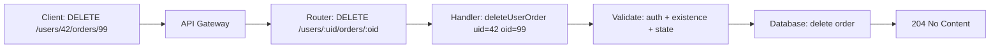

⚡ TL;DR - API endpoint design is the discipline of choosing
URL paths, HTTP methods, and response shapes that are
predictable, consistent, and client-friendly. The core rule:
URLs name resources (nouns, plural), HTTP methods name
operations (verbs), and the combination should read like
English: `DELETE /users/42` not `POST /deleteUser`.

---

| #015 | Category: HTTP & APIs | Difficulty: ★☆☆ |
|:---|:---|:---|
| **Depends on:** | HTTP Methods, URL Structure, REST Principles | |
| **Used by:** | RESTful API Design, Error Response Design, API Versioning | |
| **Related:** | Query Parameters, Pagination, Idempotency | |

---

### 🔥 The Problem This Solves

**WORLD WITHOUT IT:**
Before REST-style endpoint conventions, every API team
invented their own URL structure. One team used
`/api?action=getUser&id=42`. Another used
`/user/fetch/42`. A third used `POST /users/retrieve`
with the ID in the body. Clients integrating with multiple
APIs had to learn a new mental model for each one. There
was no way to predict how an API worked without reading
all of its documentation.

**THE BREAKING POINT:**
Enterprise teams integrating dozens of internal services
spent disproportionate time learning each service's
unique URL conventions. Client code for one service
was not transferable to another. Auto-generation of
client libraries was impossible because there was no
structural pattern to exploit.

**THE INVENTION MOMENT:**
REST's uniform interface constraint (resources as URLs,
HTTP verbs as operations) created a shared vocabulary.
Once established as an industry convention, a developer
who has never seen your API can make reasonable guesses:
`GET /orders` probably lists orders. `DELETE /orders/42`
probably deletes order 42. `POST /orders/42/cancel`
probably cancels order 42. The API became partially
self-documenting through conventions.

**EVOLUTION:**
Early "REST" APIs in 2005-2010 varied widely. By 2015,
industry-wide conventions had stabilized: plural nouns,
hierarchical paths for relationships, HTTP verbs for CRUD,
JSON responses, and OpenAPI for documentation. The
Richardson Maturity Model provided a vocabulary for
assessing API design maturity. JSON:API (2015) attempted
to standardize request/response structure beyond URLs.

---

### 📘 Textbook Definition

API endpoint design is the process of defining the URL
paths, HTTP methods, query parameters, request body
schema, and response shape for each API operation. The
dominant convention is REST-style resource-based design:
use plural nouns for collections (`/users`), hierarchical
paths for containment relationships (`/users/42/orders`),
HTTP methods for CRUD operations (GET/POST/PUT/PATCH/DELETE),
and consistent response envelopes. Good endpoint design
makes an API predictable, explorable, and consistent
across its entire surface.

---

### ⏱️ Understand It in 30 Seconds

**One line:**
URLs name things (resources). HTTP methods name actions.
Their combination is the API operation. Keep nouns
in URLs, verbs in methods.

**One analogy:**
> An API is like a filing cabinet. Resources are folders
> (files, drawers). URLs describe which drawer you open:
> `filing_cabinet/orders/42`. HTTP methods describe what
> you do: GET = read the folder, POST = add a new document,
> PUT = replace the folder's contents, PATCH = change one
> page, DELETE = remove the folder. You would not name
> the drawer `orders/getOrder42` or `orders/deleteOrder42` -
> the drawer is the resource; the action is what you do to it.

**One insight:**
The hardest endpoint design question is not naming - it
is deciding what a "resource" is. Is a user's password a
separate resource (`PATCH /users/42/password`) or an
attribute of the user (`PATCH /users/42` with `{password: ...}`)? 
Is a cancellation a resource (`POST /orders/42/cancellations`)
or a state transition (`POST /orders/42/cancel`)? There
is no universal answer. What matters is choosing one
approach and applying it consistently.

---

### 🔩 First Principles Explanation

**THE NOUN-VERB SPLIT:**

```
WRONG: Verb in URL
GET  /getUser?id=42
POST /createOrder
POST /cancelOrder/42
POST /deleteUser/42

RIGHT: Noun in URL, verb as HTTP method
GET    /users/42
POST   /orders
POST   /orders/42/cancel
DELETE /users/42
```

**RESOURCE NAMING RULES:**

| Rule | Example |
|:---|:---|
| Use plural nouns | `/users`, `/orders`, `/products` |
| Use lowercase | `/user-orders`, not `/UserOrders` |
| Use hyphens for multi-word | `/user-profiles`, not `/user_profiles` |
| Use path parameters for ID | `/users/{id}` |
| Use query parameters for filtering | `/users?status=active` |
| Hierarchy for containment | `/users/{id}/orders` |

**COLLECTION vs INDIVIDUAL vs ACTION:**

```
Collection:    GET  /orders        → list all orders
Individual:    GET  /orders/42     → get order 42
Create:        POST /orders        → create new order
Full replace:  PUT  /orders/42     → replace order 42
Partial:       PATCH /orders/42    → update fields of order 42
Delete:        DELETE /orders/42   → remove order 42
Sub-resource:  GET  /orders/42/items  → items of order 42
Action:        POST /orders/42/cancel → trigger cancellation
```

**WHY POST for actions?**
Some operations are state transitions, not CRUD. Cancelling
an order, sending an email, and approving a request are
actions without a clean CRUD mapping. Convention: use
`POST /resource/{id}/{action}`. The action is a sub-resource
or a verb. POST is correct because these operations are
not idempotent (cancelling twice has different results than
cancelling once) and not a simple state replacement.

---

### 🧪 Thought Experiment

**SETUP:**
You are designing an API for a photo-sharing app. Users
can upload photos. Photos can be tagged. Tags can be
deleted from a photo. A user can like a photo.

**DESIGN CHALLENGE:**
```
How do you model these operations as endpoints?

Option A:
POST /uploadPhoto          (verb in URL)
POST /addTag               (verb in URL)
POST /deleteTag            (verb in URL)
POST /likePhoto            (verb in URL)

Option B:
POST /photos                   (create photo)
POST /photos/42/tags           (add tag to photo)
DELETE /photos/42/tags/sunset  (remove tag from photo)
POST /photos/42/likes          (like a photo)
```

**ANALYSIS:**
Option A: No URL structure reveals relationships. Cannot
tell that tags belong to photos. Cannot generate consistent
client libraries. Every operation requires documentation.

Option B: URL hierarchy reveals containment. `DELETE
/photos/42/tags/sunset` is self-documenting. Client code
for "list tags" (`GET /photos/42/tags`) and "delete tag"
(`DELETE /photos/42/tags/sunset`) share the same URL
pattern - reduces cognitive load.

**THE DECISION:**
What should `DELETE /photos/42/likes` mean? Unlike a tag,
a "like" from the current user is the resource - not a
specific named entity. Convention: model the current user's
like as `DELETE /photos/42/likes/me` (where `me` is an
alias for the authenticated user's ID). Twitter's API
uses `DELETE /2/users/:id/liked_tweets/:tweet_id`.
Instagram used `DELETE /media/{media-id}/likes`.

---

### 🧠 Mental Model / Analogy

> Think of endpoint design as a postal address system.
> An address (`/users/42/orders/99`) uniquely identifies
> a location (a specific order belonging to a specific user).
> The postal action (GET, POST, DELETE) is what you do
> when you arrive at that address. You would never name
> an address "123 Get-Package Street" - the address
> identifies the location; the action is separate.
> Consistency in the addressing system means anyone who
> knows the conventions can navigate to any location
> without a map.

Mapping:
- "Address" → URL path
- "Street/city/country hierarchy" → resource hierarchy
- "Postal action" → HTTP method
- "Zip code" → path parameter (identifies specific instance)
- "Apartment filter" → query parameter (filters a collection)

Where this analogy breaks down: addresses are hierarchical
and physical; API resources can have many-to-many
relationships that do not fit a simple hierarchy. A
`/users/42/orders/99/products/7` path implies order 99
contains product 7, which belongs to user 42 - but what
if product 7 exists independently? The hierarchy convention
works best for clear containment relationships.

---

### 📶 Gradual Depth - Five Levels

**Level 1 - What it is (anyone can understand):**
API endpoint design is choosing the addresses (URLs) and
actions (GET, POST, DELETE) for your API. The convention
is: addresses describe things (resources), actions describe
what you do to them. `GET /users/42` means "get user 42".
`DELETE /users/42` means "delete user 42."

**Level 2 - How to use it (junior developer):**
Use plural nouns, lowercase, hyphens. Use path params for
IDs (`/users/{id}`), query params for filtering/sorting
(`/users?status=active&sort=name`). Use POST to create,
GET to read, PUT to replace, PATCH to update fields, DELETE
to remove. Model relationships as sub-resources
(`/users/42/orders`). Use `POST /resource/{id}/action`
for state transitions.

**Level 3 - How it works (mid-level engineer):**
The HTTP method + URL path is the operation identity.
Clients and infrastructure (proxies, CDNs) interpret the
method to determine caching, idempotency, and retry
behavior. GET is safe (no side effects) and cacheable.
PUT is idempotent. POST is neither safe nor idempotent.
DELETE is idempotent. These properties propagate through
the infrastructure: CDNs cache GET, not POST; HTTP clients
retry 5xx on GET, not POST. Designing endpoints correctly
means clients and infrastructure behave correctly without
additional configuration.

**Level 4 - Why it was designed this way (senior/staff):**
The consistency of REST endpoint design enables API
tooling: OpenAPI parsers, mock servers, client SDK
generators, and API gateways can all parse and process
a REST API description without understanding its business
logic. This is not possible with arbitrary URL structures.
The trade-off: enforcing REST conventions adds constraints
on the design team. Some operations do not fit cleanly
into CRUD (bulk operations, long-running jobs, complex
queries). These tension points - where REST conventions
do not map naturally to the operation - are where teams
make the most design mistakes.

**Level 5 - Mastery (distinguished engineer):**
The most important endpoint design skill is recognizing
when REST is a poor fit and choosing a different model.
GraphQL is better when clients need to specify exactly
what fields they want from multiple resources in a single
request. RPC is better for internal services with complex,
typed operations that do not map to CRUD. REST is best
for public APIs where client diversity and HTTP caching
infrastructure are valuable. Within REST, the hardest
design problem is bulk operations: REST's one-resource-per-
request model is inefficient for creating 1,000 orders
or deleting 500 records. Solutions: `POST /orders/bulk`,
`DELETE /orders?ids=1,2,3`, or async job patterns.

---

### ⚙️ How It Works (Mechanism)

**Request routing flow:**

```
Client Request:
  DELETE /users/42/orders/99

                    │
                    ▼
         API Gateway routes by method+path

                    │
                    ▼
         Application Router:
         DELETE /users/:userId/orders/:orderId
         → handler: deleteUserOrder(userId=42, orderId=99)

                    │
                    ▼
         Handler validates:
         - Auth: does current user own user 42?
         - Existence: does order 99 exist for user 42?
         - State: can order 99 be deleted? (not shipped?)
         
                    │
                    ▼
         204 No Content (success, no body needed)
```



**Standard REST CRUD pattern for /users:**

```
GET    /users          → 200 + [user list]
POST   /users          → 201 + {new user} + Location: /users/43
GET    /users/42       → 200 + {user 42}
PUT    /users/42       → 200 + {updated user} (full replace)
PATCH  /users/42       → 200 + {patched user} (partial update)
DELETE /users/42       → 204 No Content
GET    /users/999      → 404 Not Found
POST   /users          → 409 Conflict (email already exists)
```

---

### 🔄 The Complete Picture - End-to-End Flow

**Designing a photo sharing API endpoint by endpoint:**

```
Resource: Photo

COLLECTION:
GET    /photos                  → list all photos
POST   /photos                  → upload a new photo

INDIVIDUAL:
GET    /photos/42               → get photo metadata
PATCH  /photos/42               → update title/description
DELETE /photos/42               → delete photo

SUB-RESOURCE (Tags):
GET    /photos/42/tags          → list tags on photo 42
POST   /photos/42/tags          → add tag to photo 42
DELETE /photos/42/tags/sunset   → remove 'sunset' tag

SUB-RESOURCE (Likes):
GET    /photos/42/likes         → count/list of likes
POST   /photos/42/likes         → like photo 42 (current user)
DELETE /photos/42/likes/me      → unlike photo 42

ACTION (not CRUD):
POST   /photos/42/share         → share photo (triggers email)
POST   /photos/42/report        → report photo as inappropriate
```

---

### 💻 Code Example

**Example 1 - BAD endpoint design (verbs in URLs)**

```python
# BAD: verbs in URLs, inconsistent patterns

@app.route("/getUser")         # GET or POST? unclear
@app.route("/createOrder")     # POST implied but not obvious
@app.route("/cancelOrder/42")  # what method?
@app.route("/deleteUser/42")   # DELETE or POST?
@app.route("/ordersByUser/42") # inconsistent hierarchy
```

**Example 1 - GOOD endpoint design (nouns + HTTP methods)**

```python
# GOOD: nouns in URLs, HTTP methods as operations

@app.route("/users/<int:user_id>", methods=["GET"])
def get_user(user_id):
    """GET /users/42"""
    pass

@app.route("/orders", methods=["POST"])
def create_order():
    """POST /orders → 201 + {new order}"""
    pass

@app.route("/orders/<int:order_id>/cancel",
           methods=["POST"])
def cancel_order(order_id):
    """POST /orders/42/cancel → state transition"""
    pass

@app.route("/users/<int:user_id>", methods=["DELETE"])
def delete_user(user_id):
    """DELETE /users/42 → 204"""
    pass

@app.route("/users/<int:user_id>/orders",
           methods=["GET"])
def get_user_orders(user_id):
    """GET /users/42/orders → 200 + [orders]"""
    pass
```

---

**Example 2 - Filtering, sorting, pagination as query params**

```python
# GOOD: filter/sort/page as query parameters, not path params

@app.route("/orders", methods=["GET"])
def list_orders():
    """
    GET /orders                         all orders
    GET /orders?status=active           filter by status
    GET /orders?user_id=42              filter by user
    GET /orders?sort=created_at&dir=desc sort
    GET /orders?page=2&per_page=25      paginate
    GET /orders?status=active&sort=total&page=1 combined
    """
    status = request.args.get("status")
    user_id = request.args.get("user_id")
    sort = request.args.get("sort", "created_at")
    direction = request.args.get("dir", "desc")
    page = int(request.args.get("page", 1))
    per_page = min(
        int(request.args.get("per_page", 25)), 100
    )

    query = db.orders.query()
    if status:
        query = query.filter_by(status=status)
    if user_id:
        query = query.filter_by(user_id=int(user_id))

    query = query.order_by(sort, direction)
    total = query.count()
    orders = query.paginate(page, per_page)

    return jsonify({
        "data": [o.to_dict() for o in orders],
        "pagination": {
            "page": page,
            "per_page": per_page,
            "total": total,
            "total_pages": -(-total // per_page)
        }
    }), 200
```

---

**Example 3 - Modeling state transitions (actions)**

```python
# State machine: order can be: pending → confirmed →
# shipped → delivered. Can be cancelled if pending or
# confirmed.

# WRONG: using PATCH to change status (too permissive)
# PATCH /orders/42 {"status": "cancelled"}
# Nothing prevents invalid transitions like shipped → pending

# RIGHT: explicit action endpoints for state transitions
@app.route("/orders/<int:order_id>/confirm",
           methods=["POST"])
def confirm_order(order_id):
    order = db.orders.get_or_404(order_id)
    if order.status != "pending":
        return jsonify({
            "error": f"Cannot confirm order "
                     f"in status '{order.status}'"
        }), 409
    order.confirm()
    return jsonify(order.to_dict()), 200

@app.route("/orders/<int:order_id>/cancel",
           methods=["POST"])
def cancel_order(order_id):
    order = db.orders.get_or_404(order_id)
    if order.status not in ("pending", "confirmed"):
        return jsonify({
            "error": f"Cannot cancel order "
                     f"in status '{order.status}'"
        }), 409
    reason = request.json.get("reason")
    order.cancel(reason=reason)
    return jsonify(order.to_dict()), 200
```

---

### ⚖️ Comparison Table

| Design Pattern | Example | When to Use |
|:---|:---|:---|
| **Collection** | `GET /orders` | List a resource type |
| **Individual** | `GET /orders/42` | Get a specific resource |
| **Create** | `POST /orders` | Create a new resource |
| **Full replace** | `PUT /orders/42` | Replace all fields |
| **Partial update** | `PATCH /orders/42` | Update specific fields |
| **Delete** | `DELETE /orders/42` | Remove a resource |
| **Sub-resource** | `GET /orders/42/items` | Contained resources |
| **Action** | `POST /orders/42/cancel` | State transition |
| **Filter** | `GET /orders?status=active` | Query a collection |
| **Search** | `GET /orders?q=alice` | Text search |

---

### ⚠️ Common Misconceptions

| Misconception | Reality |
|:---|:---|
| GET requests cannot have a body | GET requests technically can have a body, but it is undefined behavior - most HTTP clients and servers ignore it. Use query parameters for GET filters and search, not a request body. |
| PATCH is safer than PUT because it only changes some fields | PATCH is actually more complex to implement correctly. PUT's "replace all fields" is simpler to reason about. PATCH requires the server to correctly merge the patch with the existing document and handle null vs absent key semantics. |
| Nested resources must have full hierarchy in the URL | Nesting more than 2 levels deep (`/users/42/orders/99/items/7`) becomes unwieldy. At 2+ levels, consider allowing the inner resource to be accessed directly if it has a globally unique ID: `/items/7` instead of `/users/42/orders/99/items/7`. |
| POST creates, GET reads, PUT updates, DELETE deletes | HTTP methods have idempotency and safety properties, not business semantics. POST is used for any non-idempotent operation including actions (`/cancel`, `/send`). The resource model determines the semantics, not a rigid CRUD mapping. |

---

### 🚨 Failure Modes & Diagnosis

**Inconsistent endpoint naming breaks API discoverability**

**Symptom:** New team members cannot predict API endpoint
paths. Client teams frequently ask "what's the endpoint
for X?" Different parts of the API use different conventions
(`/user` vs `/users`, `/create-order` vs `POST /orders`,
`/order/42/get` vs `GET /orders/42`).

**Root Cause:** No documented naming conventions. Different
authors applied different conventions.

**Diagnostic Command / Tool:**

```bash
# List all routes and check for consistency
flask routes 2>/dev/null | grep -v Static | \
  awk '{print $1, $2}' | sort

# Look for verb-in-URL patterns:
grep -r "@app.route" . | \
  grep -E '/(get|create|delete|update|fetch|list)' | \
  head -20
```

**Fix:** Document endpoint naming conventions and enforce
in code review. Consider OpenAPI spec as the source of
truth. An API linter (`spectral`, `redocly`) can enforce
naming rules automatically.

---

**Deep nesting causes client URL construction bugs**

**Symptom:** Client code building URLs for deeply nested
resources has bugs. `orders.42.items.7.reviews.3` is
correct, but clients sometimes construct `/reviews/3`
or `/items/7/reviews/3` - leading to authorization bypass
if the server does not validate the full hierarchy.

**Root Cause:** Deep nesting creates complex URL templates
that clients frequently get wrong. Also creates security
risks if ownership validation only checks the innermost
resource.

**Diagnostic Command / Tool:**

```bash
# Check how deep your deepest endpoint paths go
grep -r "@app.route" . | \
  awk -F'"' '{print $2}' | \
  awk -F'/' '{print NF-1, $0}' | \
  sort -n -r | head -10
```

**Fix:** For deeply nested resources, allow direct access
with a globally unique ID. Keep URL depth max 2-3 levels.
Always validate ownership at every level of the hierarchy
in the handler, not just the innermost resource.

---

### 🔗 Related Keywords

**Prerequisites (understand these first):**
- `HTTP Methods` - the verb half of the endpoint design
  noun-verb split
- `URL and URI Structure` - the path, query, and fragment
  anatomy that underpins endpoint design
- `REST Principles (Roy Fielding)` - the architectural
  philosophy behind resource-based URLs

**Builds On This (learn these next):**
- `RESTful API Design Patterns` - advanced patterns for
  relationships, bulk operations, and complex filtering
- `Error Response Design` - the error response is part
  of the endpoint's contract
- `API Versioning Strategies` - how endpoint design evolves
  over time without breaking clients

**Alternatives / Comparisons:**
- `GraphQL Query Language` - alternative where clients
  define the shape of data, not the server
- `gRPC and Protocol Buffers` - RPC alternative where
  operations are functions with typed args, not URL+method

---

### 📌 Quick Reference Card

```
┌──────────────────────────────────────────────────────────┐
│ WHAT IT IS   │ Rules for naming URLs and choosing HTTP   │
│              │ methods so APIs are predictable           │
├──────────────┼───────────────────────────────────────────┤
│ PROBLEM IT   │ Ad-hoc URL structures that require docs   │
│ SOLVES       │ to use. Conventions make APIs guessable.  │
├──────────────┼───────────────────────────────────────────┤
│ KEY INSIGHT  │ URLs name resources (nouns, plural).      │
│              │ HTTP methods name actions (verbs).        │
├──────────────┼───────────────────────────────────────────┤
│ USE WHEN     │ Designing any HTTP API. REST conventions  │
│              │ apply even in non-REST architectures.     │
├──────────────┼───────────────────────────────────────────┤
│ AVOID WHEN   │ Verbs are in your URLs. Actions are not   │
│              │ CRUD. Consider explicit action sub-paths. │
├──────────────┼───────────────────────────────────────────┤
│ ANTI-PATTERN │ /getUser, /createOrder, /deleteById,      │
│              │ mixing verbs and nouns in paths           │
├──────────────┼───────────────────────────────────────────┤
│ TRADE-OFF    │ Consistent conventions vs flexibility for │
│              │ non-CRUD operations                       │
├──────────────┼───────────────────────────────────────────┤
│ ONE-LINER    │ "Nouns in URLs, verbs as methods. State   │
│              │ transitions are POST to an action path."  │
├──────────────┼───────────────────────────────────────────┤
│ NEXT EXPLORE │ RESTful API Design → API Versioning →     │
│              │ Error Response Design                     │
└──────────────────────────────────────────────────────────┘
```

**If you remember only 3 things:**
1. URLs name resources (plural nouns). HTTP methods name
   actions. Never put verbs in URLs.
2. Use path parameters for resource identity (`/orders/42`).
   Use query parameters for filtering, sorting, and
   pagination (`?status=active&sort=date&page=2`).
3. State transitions that do not fit CRUD use
   `POST /resource/{id}/action-name` with appropriate
   409 Conflict response if the state transition is invalid.

---

### 💎 Transferable Wisdom

**Reusable Engineering Principle:**
Convention over configuration reduces cognitive load.
An API that follows conventions can be partially understood
without documentation. A filesystem that follows the
Unix hierarchy (`/etc` for config, `/var` for data,
`/tmp` for temp) is navigable without a map. A programming
language with consistent naming conventions (`snake_case`
for functions, `CamelCase` for classes) is readable by
any developer who knows the language. The value of a
convention compounds with the number of participants who
follow it. In API design: the more teams that follow the
same conventions, the less documentation each team needs
to write and the less onboarding each client developer
needs.

**Where else this pattern appears:**
- Unix filesystem hierarchy (`/etc`, `/usr`, `/var`) -
  convention for where to find configuration, binaries, data
- HTTP itself - predefined methods with defined semantics
  (GET is safe, PUT is idempotent) enable infrastructure
  to behave correctly without application-level knowledge
- SQL - `SELECT`, `INSERT`, `UPDATE`, `DELETE` as verbs;
  table names as nouns; same noun-verb split as REST

---

### 💡 The Surprising Truth

The most influential API design guide in industry practice
was not an academic paper - it was an 18-point blog post
by Vinay Sahni in 2012 ("Best Practices for a Pragmatic
RESTful API"). It became the de facto reference for REST
endpoint design across thousands of teams. The conventions
it documented (plural nouns, hyphens not underscores,
`?sort=` for sorting, `?fields=` for sparse fieldsets)
are still the industry baseline 12 years later. The
academic REST literature (Fielding's dissertation, HAL
specification, JSON:API) addressed different problems
at a higher level of abstraction - HATEOAS, media types,
response envelopes. The pragmatic blog post won in practice
because it was specific, opinionated, and immediately
actionable.

---

### ✅ Mastery Checklist

**You've mastered this when you can:**
1. **EXPLAIN** Given a list of operations (get user, create
   order, cancel shipment, list user's orders filtered by
   date), convert each to a REST endpoint without looking
   at notes.
2. **DEBUG** Given an API with inconsistent naming
   (`/getUser`, `/users/42`, `/orders/create`), identify
   the violations and propose a consistent replacement.
3. **DECIDE** Given the operation "add product to user's
   wishlist, where each user has one wishlist," decide
   whether the wishlist item is `POST /wishlists/{id}/items`
   or `POST /users/{id}/wishlist/items` or another
   structure, with explicit reasoning.
4. **BUILD** Design the full REST endpoint surface for a
   simple todo list app (users, lists, items, tags) -
   collections, individuals, sub-resources, and state
   transitions.
5. **EXTEND** Explain why `GET /orders/search` with a
   request body is problematic, and what the correct
   alternatives are for complex search queries.

---

### 🎯 Interview Deep-Dive

**Q1: How would you design REST endpoints for a blog
platform with posts, authors, comments, and tags?**

*Why they ask:* Classic endpoint design exercise that
reveals knowledge of collections, sub-resources, and
relationship modeling.

*Strong answer includes:*
- Posts: `GET/POST /posts`, `GET/PATCH/DELETE /posts/{id}`
- Authors: `GET /posts/{id}/author` (belongs-to) or
  `GET /authors/{id}` (independent)
- Comments: `GET/POST /posts/{id}/comments`,
  `GET/PATCH/DELETE /posts/{id}/comments/{cid}`
- Tags: `GET /posts/{id}/tags`, `POST /posts/{id}/tags`,
  `DELETE /posts/{id}/tags/{tag}` (tag as a value, not ID)
- Filtering: `GET /posts?author_id=42&tag=rest&status=published`
- Collections: `GET /tags` (all tags in the system)
  `GET /authors` (all authors in the system)
- Decision: whether comments and tags are accessed only
  through posts or also independently depends on use case

**Q2: You have to design an endpoint for "send password
reset email." What HTTP method and URL do you use?**

*Why they ask:* Tests ability to handle non-CRUD operations
in REST - a common real-world challenge.

*Strong answer includes:*
- There is no clean CRUD mapping for "send email"
- Option 1: `POST /users/{id}/password-reset` - triggers
  the send. Returns 202 Accepted (async). Pro: self-documenting.
  Con: implies a password-reset resource.
- Option 2: `POST /password-resets` with `{"email": "..."}`.
  A password reset request IS a resource (it has a state:
  pending/used/expired). Returns 201 Created with a reset
  token resource.
- Option 3: `POST /auth/forgot-password` - action-based,
  in an auth sub-namespace. Used by Stripe, Auth0.
- All three are reasonable. The key: the URL should not
  contain the word "send" (verb in URL). POST makes it
  clear this is a non-idempotent action.

**Q3: A mobile app client sends `DELETE /orders/42/items/7`.
What should happen if the order is in "shipped" status?**

*Why they ask:* Tests understanding that endpoint design
includes not just the URL but the state machine and error
response.

*Strong answer includes:*
- `DELETE /orders/42/items/7` should return `409 Conflict`
  if the order is already shipped (cannot modify a shipped
  order)
- Response body should explain the error: `{"error":
  "Cannot remove items from a shipped order",
  "order_status": "shipped"}`
- The handler must validate: (1) order 42 exists,
  (2) item 7 is in order 42, (3) the current user owns
  order 42, (4) order status allows item removal
- Alternative design: use explicit action endpoint
  `DELETE /orders/42/items/7` only allowed for `pending`
  orders; provide `POST /orders/42/returns` for shipped
  orders where you need a return flow instead
