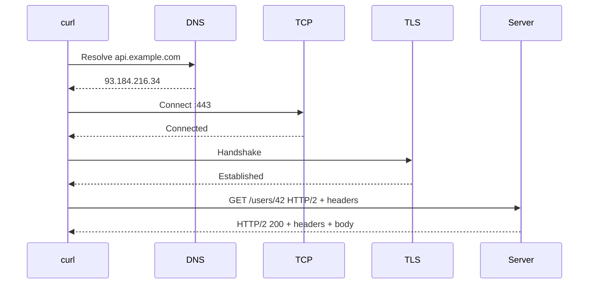

⚡ TL;DR - curl is the universal command-line HTTP client
for scripting, debugging, and CI pipelines; Postman is the
GUI tool for exploring APIs, managing collections, and
running tests with assertions; mastering both is a core
engineering skill because HTTP is the operating system
of the web, and you need a REPL to understand it.

---

| #017 | Category: HTTP & APIs | Difficulty: ★☆☆ |
|:---|:---|:---|
| **Depends on:** | HTTP Request/Response, HTTP Methods, Status Codes, Headers | |
| **Used by:** | API Observability, API Load Testing | |
| **Related:** | OpenAPI Specification, API Contract Testing, API Mocking | |

---

### 🔥 The Problem This Solves

**WORLD WITHOUT IT:**
Before standalone HTTP clients, testing an API meant
writing a small program in whatever language the developer
was using, running it, reading the output, and deleting
the test code. There was no quick way to send an arbitrary
HTTP request and see the full response - headers, body,
status code - without writing throwaway code.

**THE BREAKING POINT:**
As APIs became the integration layer between systems,
developers needed to understand exactly what requests
were being sent and what responses were being received.
Debugging integration problems required seeing the raw
HTTP exchange. Writing a test program for every debugging
question was expensive and slow.

**THE INVENTION MOMENT:**
curl (Client for URLs) was created by Daniel Stenberg in
1997. It supported multiple protocols and could be
scripted in shell. For the first time, developers could
send an HTTP request, see the full response, and script
the interaction from the command line. Postman emerged
in 2012 as a Chrome extension by Abhinav Asthana, providing
a GUI for API exploration with saved requests, environments,
and later, test assertions. Both tools gave developers
a way to interact with APIs without writing throwaway code.

**EVOLUTION:**
curl remains the universal baseline - available on every
Linux server, macOS, and Windows 10+. It is the first
tool to reach for when debugging an API issue in
production. Postman evolved from a simple GUI client to
a full API development platform with collections, mock
servers, API monitors, and team sharing. httpie emerged
as a modern, more readable curl alternative. k6 and
Gatling specialized for load testing. Bruno emerged as
an open-source, file-based Postman alternative.

---

### 📘 Textbook Definition

curl (Client URL) is a command-line tool and library for
transferring data with URLs, supporting HTTP, HTTPS, FTP,
and many other protocols. It is the standard tool for
scripting HTTP requests, inspecting API responses, and
debugging network behavior. Postman is a GUI API client
that allows developers to build, test, and document
HTTP requests organized into collections, with support
for environments (variable injection), automated test
assertions, and team collaboration. Together, they cover
the two primary contexts for API interaction: scripting
and automation (curl) vs. interactive exploration and
testing (Postman).

---

### ⏱️ Understand It in 30 Seconds

**One line:**
curl is the command-line REPL for HTTP; Postman is the
GUI IDE for APIs. Use curl for scripts and quick checks;
use Postman for exploring, documenting, and testing APIs.

**One analogy:**
> curl is the command-line terminal for HTTP - like running
> `python3 -c "print(2+2)"` for a quick calculation.
> Postman is the IDE - like PyCharm with a debugger,
> auto-complete, and test runner. Both let you run Python;
> they serve different workflows. A senior engineer knows
> both: terminal for quick work, IDE for complex work.

**One insight:**
`curl -v` is the single most useful debugging command for
any HTTP issue in production. It shows the TLS handshake,
the exact request headers sent, and the exact response
headers and body received. When an API call fails in
production and you do not know why, `curl -v` tells you
if the problem is DNS, TLS, request format, or server
response - without writing any code.

---

### 🔩 First Principles Explanation

**THE CORE curl FLAGS:**

| Flag | Meaning | Example |
|:---|:---|:---|
| `-v` | Verbose: show request and response headers | `curl -v url` |
| `-s` | Silent: suppress progress bar | `curl -s url` |
| `-i` | Include response headers in output | `curl -i url` |
| `-X` | HTTP method | `-X POST` |
| `-H` | Add request header | `-H "Content-Type: application/json"` |
| `-d` | Request body (implies POST) | `-d '{"key":"value"}'` |
| `-o` | Save response to file | `-o response.json` |
| `-w` | Output format (timing, status) | `-w "%{http_code}"` |
| `--fail` | Return non-zero exit on 4xx/5xx | Use in CI scripts |
| `--max-time` | Request timeout in seconds | `--max-time 10` |
| `--location` | Follow redirects | `-L url` |

**THE CORE POSTMAN CONCEPTS:**

| Concept | Description |
|:---|:---|
| **Request** | Single HTTP request with method, URL, headers, body |
| **Collection** | Group of related requests (one API's endpoints) |
| **Environment** | Variables for base URL, API keys, tokens |
| **Pre-request script** | JavaScript that runs before the request |
| **Tests** | JavaScript assertions that run after the response |
| **Variables** | `{{base_url}}`, `{{api_key}}` injected at runtime |
| **Mock Server** | Simulates API responses without a real server |
| **Monitor** | Runs a collection on a schedule for uptime testing |

---

### 🧪 Thought Experiment

**SETUP:**
Your app calls a payment API and gets a 400 error. The
error message is: "Invalid card number." But you are
passing the card number the user entered. What is wrong?

**STEP 1 - Reproduce with curl:**
```bash
curl -v -X POST https://payments.example.com/charges \
  -H "Authorization: Bearer sk_test_abc" \
  -H "Content-Type: application/json" \
  -d '{"amount": 4999, "card": "4111111111111111"}'
```

**WHAT curl -v REVEALS:**
The `-v` flag shows the exact request headers sent. You
discover the actual request body your app sends is:
`{"amount": 4999, "card": "4111 1111 1111 1111"}` - with
spaces. The user's input included spaces from the credit
card input formatter, and your app was not stripping them.

**INSIGHT:**
curl with `-v` and a manually constructed request bypasses
your application code and talks directly to the API. When
the manually constructed curl request succeeds but your
app's request fails, the difference is in how your code
constructs the request. This is the single most powerful
debugging technique for HTTP integration issues.

---

### 🧠 Mental Model / Analogy

> curl is like a direct-dial telephone. You pick up the
> phone, dial the number (URL), say exactly what you want
> (request), and hear exactly what the other person says
> (response). Nothing in between filters or interprets.
> Postman is like a customer service center with
> scripted call flows - you have saved scripts (collections),
> known responses to check (tests), and can run the same
> call to multiple numbers (environments: staging vs
> production).

Mapping:
- "Dialing the number" → specifying the URL
- "Saying exactly what you want" → request headers and body
- "Hearing the other person" → response headers and body
- "Saved scripts" → Postman collections
- "Multiple numbers" → Postman environments

Where this analogy breaks down: curl can also receive
streaming data, handle authentication challenges, follow
redirects, and time out - making it more capable than a
telephone conversation for debugging complex HTTP scenarios.

---

### 📶 Gradual Depth - Five Levels

**Level 1 - What it is (anyone can understand):**
curl and Postman are tools for talking to web APIs.
They let you send HTTP requests and see the full response -
what status code was returned, what headers were in the
response, and what data came back. Think of them as
test buttons for APIs.

**Level 2 - How to use it (junior developer):**
`curl -X GET https://api.example.com/users` (basic GET).
`curl -X POST -H "Content-Type: application/json" -d '{"name":"Alice"}' https://api.example.com/users` (POST with body). Use Postman to set up and save common requests with auth headers, and run them across different environments (local, staging, production) by switching the base URL variable.

**Level 3 - How it works (mid-level engineer):**
curl directly executes an HTTP request using the system's
TCP stack. `-v` shows the full TLS handshake, the HTTP
request with all headers, and the complete HTTP response.
`-w "%{http_code} %{time_total}"` outputs timing.
`--fail` makes curl exit non-zero on HTTP errors, enabling
use in CI scripts. Postman's test runner uses a JavaScript
sandbox (pm object) with assertions; the collection runner
can chain requests (extract token from response, use in
next request).

**Level 4 - Why it was designed this way (senior/staff):**
curl's design principle: composability. It is a Unix tool
that reads from stdin, writes to stdout, and can be piped
with other tools. `curl -s https://api.example.com/data |
jq '.users[] | select(.active == true)'` combines curl
with jq for ad-hoc API data processing. This is more
powerful than a GUI for scripting and CI. Postman's design
principle: discoverability. The GUI makes implicit things
(headers, auth, cookies) visible and editable. It reduces
the friction of API exploration for developers who are
not yet fluent in curl syntax.

**Level 5 - Mastery (distinguished engineer):**
At scale, curl becomes a first-class component in
reliability engineering. `curl -w` with timing fields
(`%{time_namelookup}`, `%{time_connect}`, `%{time_starttransfer}`,
`%{time_total}`) diagnoses whether latency is in DNS,
TCP connect, TLS, TTFB, or data transfer. This breakdown
is essential for root-cause analysis of latency regressions.
Postman collections become executable API specifications -
they document the API through executable examples (not
just prose), and the test assertions become the API's
behavioral contract. Postman's Newman CLI runs collections
in CI, making the collection a regression test suite.
The collection becomes the source of truth for API behavior.

---

### ⚙️ How It Works (Mechanism)

**curl -v output anatomy:**

```
$ curl -v https://api.example.com/users/42

* Trying 93.184.216.34:443...        <- DNS + TCP
* Connected to api.example.com        <- TCP established
* TLS handshake...                    <- TLS
* SSL certificate verify ok.          <- cert valid

> GET /users/42 HTTP/2                <- request line
> Host: api.example.com               <- request headers
> User-Agent: curl/8.4.0
> Accept: */*
>                                     <- end of request

< HTTP/2 200                          <- response status
< content-type: application/json      <- response headers
< cache-control: max-age=300
< content-length: 127
<                                     <- end of headers
{                                     <- response body
  "id": 42,
  "name": "Alice"
}
* Connection #0 to host left in place
```

Lines starting with `*` = connection/TLS info
Lines starting with `>` = request headers sent
Lines starting with `<` = response headers received
Lines with no prefix = response body

**curl timing breakdown:**

```
curl -s -o /dev/null -w "
DNS:    %{time_namelookup}s
TCP:    %{time_connect}s
TLS:    %{time_appconnect}s
TTFB:   %{time_starttransfer}s
Total:  %{time_total}s
" https://api.example.com/users/42
```



---

### 🔄 The Complete Picture - End-to-End Flow

**Debugging a failing API call with curl:**

```
1. User reports: "Payment fails in production"

2. Engineer reproduces with curl:
   curl -v -X POST https://api.payments.com/charges \
     -H "Authorization: Bearer sk_live_..." \
     -H "Content-Type: application/json" \
     -d '{"amount":4999,"currency":"USD","card":"4111..."}'

3. curl -v reveals the response:
   < HTTP/2 400
   < content-type: application/json
   {"error": "invalid_currency",
    "message": "Currency 'USD' not supported"}

4. Root cause found: production config has wrong currency

5. Fix: update config to use "usd" (lowercase)

6. Verify: re-run curl, get 200

Total debug time: 3 minutes
```

---

### 💻 Code Example

**Example 1 - Essential curl commands for API work**

```bash
# GET request (basic)
curl https://api.example.com/users/42

# GET with auth header
curl -H "Authorization: Bearer sk_live_abc" \
  https://api.example.com/users/42

# GET with verbose output (debug mode)
curl -v https://api.example.com/users/42

# POST with JSON body
curl -X POST \
  -H "Content-Type: application/json" \
  -H "Authorization: Bearer sk_live_abc" \
  -d '{"name": "Alice", "email": "alice@example.com"}' \
  https://api.example.com/users

# POST with body from file (cleaner for large payloads)
curl -X POST \
  -H "Content-Type: application/json" \
  -d @request.json \
  https://api.example.com/users

# PATCH (partial update)
curl -X PATCH \
  -H "Content-Type: application/json" \
  -d '{"status": "active"}' \
  https://api.example.com/users/42

# DELETE
curl -X DELETE https://api.example.com/users/42

# Show only status code (useful in scripts)
curl -o /dev/null -s -w "%{http_code}\n" \
  https://api.example.com/users/42

# Follow redirects
curl -L https://api.example.com/redirect

# Fail on 4xx/5xx (for CI use)
curl --fail https://api.example.com/health && echo "OK"
```

---

**Example 2 - curl timing for latency debugging**

```bash
# Full timing breakdown - diagnose where latency lives
curl -s -o /dev/null \
  -w "
Status:    %{http_code}
DNS:       %{time_namelookup}s
TCP:       %{time_connect}s
TLS:       %{time_appconnect}s
TTFB:      %{time_starttransfer}s
Total:     %{time_total}s
Bytes:     %{size_download} bytes
Speed:     %{speed_download} bytes/s
" https://api.example.com/users

# Interpretation guide:
# time_namelookup > 0.1s  → DNS problem
# time_connect > 0.1s      → network latency or TCP issue
# time_appconnect > 0.3s   → TLS cert or cipher issue
# time_starttransfer > 1s  → server processing slow (TTFB)
# total - starttransfer > 1s → large response body
```

---

**Example 3 - Postman test assertions (JavaScript)**

```javascript
// Postman test tab - run after response received

// Test 1: status code
pm.test("Status is 200", () => {
  pm.response.to.have.status(200);
});

// Test 2: response time
pm.test("Response under 500ms", () => {
  pm.expect(pm.response.responseTime).to.be.below(500);
});

// Test 3: response body structure
pm.test("Has required fields", () => {
  const body = pm.response.json();
  pm.expect(body).to.have.property("id");
  pm.expect(body).to.have.property("name");
  pm.expect(body.active).to.equal(true);
});

// Test 4: content type header
pm.test("Returns JSON", () => {
  pm.response.to.have.header(
    "Content-Type", "application/json"
  );
});

// Test 5: save token for next request in collection
const body = pm.response.json();
pm.environment.set("auth_token", body.token);
// Next request uses {{auth_token}} in Authorization header
```

---

**Example 4 - BAD vs GOOD curl in CI pipeline**

```bash
# BAD: curl does not fail on HTTP errors by default
#!/bin/bash
curl https://api.example.com/health
# Always exits 0 even on 503 - pipeline passes!

# GOOD: use --fail and check exit code
#!/bin/bash
if curl --fail --silent \
     --max-time 10 \
     https://api.example.com/health; then
  echo "Health check passed"
else
  echo "Health check FAILED (exit: $?)"
  exit 1
fi
```

---

### ⚖️ Comparison Table

| Tool | Interface | Best For | Not Good For |
|:---|:---|:---|:---|
| **curl** | CLI | Scripting, CI, quick debugging | Interactive exploration |
| **Postman** | GUI | API exploration, collections | Scripting, servers |
| **httpie** | CLI | Readable curl alternative | Complex auth flows |
| **Bruno** | GUI + files | Git-friendly Postman alternative | Team sync features |
| **Newman** | CLI | Running Postman collections in CI | Interactive use |
| **k6** | CLI + JS | Load testing at scale | Functional testing |
| **Insomnia** | GUI | API design + gRPC support | Load testing |

---

### ⚠️ Common Misconceptions

| Misconception | Reality |
|:---|:---|
| curl is only for simple GET requests | curl supports all HTTP methods, multipart forms, cookies, client certificates, proxies, and streaming. It is as capable as any HTTP library. |
| Postman replaces writing API tests | Postman collections are good for exploratory testing. For unit and contract tests in CI, dedicated frameworks (pytest, JUnit, Jest) are more maintainable. |
| curl's -d flag means DELETE | `-d` means "data" (request body). It implies POST if no method is specified. For DELETE, use `-X DELETE`. |
| HTTPS in curl is always verified | curl verifies TLS by default. Developers sometimes use `-k` to skip verification with self-signed certs in dev. NEVER use `-k` in production - it enables MITM attacks. |

---

### 🚨 Failure Modes & Diagnosis

**curl exits 0 despite API errors in CI pipelines**

**Symptom:** CI deployment pipeline passes the health
check step even when the API returns 503. New version
is deployed to production in a broken state.

**Root Cause:** curl exits 0 unless a network error occurs.
HTTP 4xx and 5xx are not network errors. `--fail` flag
makes curl exit non-zero on 4xx/5xx.

**Diagnostic Command / Tool:**

```bash
# Test: curl without --fail
curl -s https://api.example.com/broken-endpoint
echo "Exit code: $?"  # prints 0 even on 503

# Correct: curl with --fail
curl -sf https://api.example.com/broken-endpoint
echo "Exit code: $?"  # prints non-zero on 503
```

**Fix:**

```bash
curl --fail --silent --max-time 10 \
  https://api.example.com/health || exit 1
```

---

**TLS certificate error bypassed with -k in production**

**Symptom:** Script works in dev with `-k`. Developer copies
to production without removing it. TLS validation is
disabled; API calls succeed but are vulnerable to MITM.

**Diagnostic Command / Tool:**

```bash
# Find -k or --insecure in scripts
grep -r "\-k\b\|--insecure" ./scripts/ ./ci/
```

**Fix:** Remove `-k`. For self-signed certs in staging:
`--cacert ./staging-cert.pem` instead of disabling verify.

---

**Postman environment variables leaking sensitive data**

**Symptom:** Team Postman workspace contains production
API keys visible to all workspace members.

**Fix:** Use Postman Secret type for sensitive values.
Prefer local environments (not cloud-synced) for production
credentials. Use secrets manager in CI instead of Postman.

---

### 🔗 Related Keywords

**Prerequisites (understand these first):**
- `HTTP Request and Response Structure` - curl and Postman
  expose the raw HTTP exchange
- `HTTP Methods` - `-X GET/POST/PUT/PATCH/DELETE` is the
  primary curl flag
- `HTTP Status Codes` - interpreting the response starts
  with the status code

**Builds On This (learn these next):**
- `OpenAPI (Swagger) Specification` - Postman imports
  OpenAPI specs to generate collections automatically
- `API Observability` - curl timing complements server-side
  metrics for latency attribution
- `API Load Testing` - curl and Postman for functional
  testing; k6/Gatling for load testing

---

### 📌 Quick Reference Card

```
┌──────────────────────────────────────────────────────────┐
│ WHAT IT IS   │ curl: CLI HTTP client for scripts/debug   │
│              │ Postman: GUI API client for exploration    │
├──────────────┼───────────────────────────────────────────┤
│ PROBLEM IT   │ Send arbitrary HTTP requests and see the  │
│ SOLVES       │ full response without writing code        │
├──────────────┼───────────────────────────────────────────┤
│ KEY INSIGHT  │ curl -v is the fastest path to diagnosing │
│              │ any HTTP issue in production              │
├──────────────┼───────────────────────────────────────────┤
│ USE WHEN     │ curl: CI, scripts, server debugging       │
│              │ Postman: exploring APIs, team work        │
├──────────────┼───────────────────────────────────────────┤
│ AVOID WHEN   │ curl -k in production (disables TLS)      │
│              │ Postman for production secrets (cloud sync)│
├──────────────┼───────────────────────────────────────────┤
│ ANTI-PATTERN │ No --fail in CI scripts, -k in production,│
│              │ production keys in shared Postman workspace│
├──────────────┼───────────────────────────────────────────┤
│ TRADE-OFF    │ curl: composable + scriptable vs syntax   │
│              │ Postman: easy exploration vs cloud data   │
├──────────────┼───────────────────────────────────────────┤
│ ONE-LINER    │ "curl -v for every HTTP mystery. --fail   │
│              │ in every CI script. Postman for team APIs."│
├──────────────┼───────────────────────────────────────────┤
│ NEXT EXPLORE │ OpenAPI Spec → API Contract Testing →     │
│              │ API Load Testing (k6/Gatling)             │
└──────────────────────────────────────────────────────────┘
```

**If you remember only 3 things:**
1. `curl -v` is your first debugging tool for any HTTP
   problem. It shows every byte of the request and response.
2. Always use `--fail` in CI scripts. Without it, curl exits
   0 on 404 and 503 - health checks pass when they should not.
3. Never use `-k` (skip TLS) in production. It disables
   certificate validation and exposes you to MITM attacks.

---

### 💎 Transferable Wisdom

**Reusable Engineering Principle:**
Observability tools are not optional extras - they are
required for debugging. The reason `curl -v` is so
powerful is that it makes the HTTP exchange completely
visible: every request header, every response header,
TLS handshake status, and timing. Systems that hide their
internals are harder to debug. The curl design philosophy
(show everything with `-v`, script with pipes) mirrors
the Unix philosophy: tools that expose their full behavior
compose better than tools that hide it. When building
APIs: invest in observability (request/response logging,
distributed tracing) because your users will debug their
integrations exactly the way you debug yours.

**Where else this pattern appears:**
- `tcpdump` / `Wireshark`: network packet inspection -
  the `-v` of the network layer
- `strace`: system call tracing - the `-v` of the OS layer
- `git diff`: from summary to full detail
- Database `EXPLAIN ANALYZE`: makes the query execution
  plan visible, equivalent to curl's timing breakdown

---

### 💡 The Surprising Truth

curl is used in more places than most developers realize.
It is embedded in iOS (libcurl is on every iPhone), used
in PlayStation consoles, NASA space missions, and medical
devices. Daniel Stenberg, who has maintained curl since
1998, works on it largely alone. curl has had over 400
security advisories - not because it is insecure, but
because it is so widely used and carefully audited that
every issue is found and fixed. For comparison, less-used
software has fewer reported CVEs because fewer people are
looking, not because it has fewer bugs.

---

### ✅ Mastery Checklist

**You've mastered this when you can:**
1. **EXPLAIN** Given a failing API integration, describe
   the exact curl command you would run first and what
   information it provides that application logs do not.
2. **DEBUG** Use `curl -v` to diagnose whether a 400 error
   is caused by a missing header, wrong content type, or
   malformed JSON body.
3. **DECIDE** Explain when to use curl vs Postman vs httpie
   vs k6 for a specific debugging or testing task.
4. **BUILD** Write a CI bash script that health-checks an
   endpoint, fails on non-200, retries 3 times, and logs
   the response body on failure.
5. **EXTEND** Use `curl -w` timing fields to identify
   whether a latency spike is in DNS, TCP, TLS, server
   processing (TTFB), or data transfer.

---

### 🎯 Interview Deep-Dive

**Q1: A colleague says the API is returning errors in
production. How do you debug it?**

*Why they ask:* Tests systematic debugging methodology
and practical HTTP knowledge.

*Strong answer includes:*
- First: identify what error (status code) and from where
- Run `curl -v` with exact request to reproduce outside
  application code
- Compare: does curl succeed? If yes, bug is in how the
  app constructs the request. If no, bug is in server.
- Use `curl -w` timing to determine if latency or errors
- Check response body for error message detail
- If intermittent: loop to capture failure rate:
  `for i in {1..100}; do curl -s -o /dev/null -w "%{http_code}\n" url; done | sort | uniq -c`

**Q2: How would you use curl to test your API's rate
limiting?**

*Why they ask:* Tests ability to use curl beyond simple
request-response for system behavior verification.

*Strong answer includes:*
- Send rapid requests and check for 429:
  ```bash
  for i in {1..120}; do
    code=$(curl -s -o /dev/null -w "%{http_code}" \
      -H "Authorization: Bearer $KEY" \
      https://api.example.com/data)
    echo "Request $i: $code"
    [ "$code" = "429" ] && { echo "Rate limit hit"; break; }
  done
  ```
- Check `Retry-After` header: `curl -i url | grep Retry-After`
- Wait for reset window, then verify access restored

**Q3: What is the difference between curl's -v, -i, and
-s flags, and when would you use each?**

*Why they ask:* Tests precise tool knowledge.

*Strong answer includes:*
- `-v` (verbose): shows everything - TLS, request headers,
  response headers, body. Use when debugging any HTTP issue.
- `-i` (include headers): shows response headers then body.
  Use when you want both headers and body without the TLS
  and request detail that `-v` adds.
- `-s` (silent): suppresses progress meter. Use in scripts
  where progress output corrupts output parsing.
- Combining: `-sf` for silent + fail in CI scripts.
  `-sv` for everything when debugging TLS issues.
