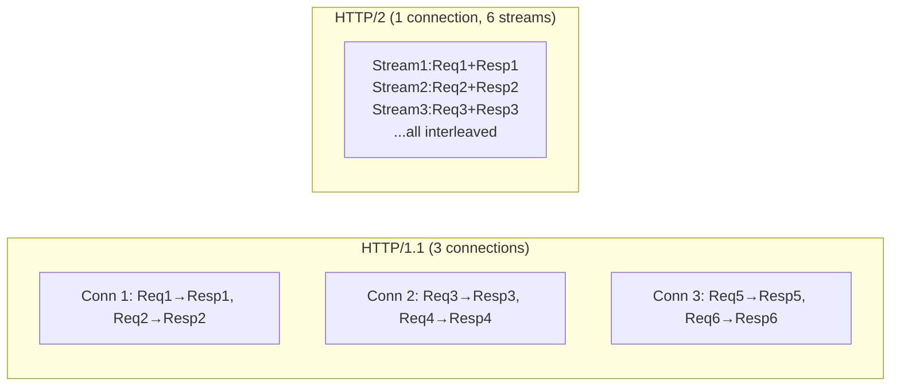

⚡ TL;DR - HTTP/2 solves HTTP/1.1's head-of-line blocking
by multiplexing multiple requests over a single TCP
connection, adds header compression (HPACK), and enables
server push; the result is measurably faster page loads
for web assets and APIs that make many small requests,
though for single large-payload APIs the improvement is
less significant.

---

| #018 | Category: HTTP & APIs | Difficulty: ★★☆ |
|:---|:---|:---|
| **Depends on:** | HTTP Request/Response, Headers, HTTP Fundamentals | |
| **Used by:** | HTTP/2 Multiplexing, HTTP/3 and QUIC, HTTP Keep-Alive | |
| **Related:** | HTTP Compression, API Ecosystem Comparison, TLS and Certificates | |

---

### 🔥 The Problem This Solves

**WORLD WITHOUT IT:**
HTTP/1.1 (1997) was designed for a web where a page had
a handful of resources. By 2010, a typical webpage made
80-100 HTTP requests (HTML, CSS, JavaScript, images,
fonts, API calls). HTTP/1.1 processed these requests
sequentially on each TCP connection. Browsers opened
6-8 parallel connections per domain to compensate. Even
so, request queuing (head-of-line blocking) caused slow
page loads.

**THE BREAKING POINT:**
Google measured that for every 100ms of additional latency,
search usage dropped 0.6%. Web performance became a
competitive and revenue concern. The HTTP/1.1 protocol
itself was the bottleneck - browsers and servers had
optimized as far as they could within the protocol's
constraints. New techniques like domain sharding (splitting
resources across multiple domains to bypass the 6-connection
limit), image sprites (combining images to reduce requests),
and CSS/JS concatenation (combining files to reduce
requests) were workarounds for protocol limitations, not
real solutions.

**THE INVENTION MOMENT:**
Google developed SPDY in 2009 as an experimental protocol
that multiplexed HTTP requests over a single TCP connection
using binary framing. SPDY measured 55% load time
reduction for high-latency connections. The IETF used
SPDY as the basis for HTTP/2 (RFC 7540, 2015). HTTP/2
retained HTTP semantics (same methods, headers, status
codes) but completely replaced the wire format with a
binary, multiplexed, compressed protocol.

**EVOLUTION:**
HTTP/2 was deployed widely by 2016-2018 (Google, Facebook,
Twitter, Cloudflare, Nginx). By 2023, ~60% of websites
use HTTP/2. However, HTTP/2 has its own head-of-line
blocking at the TCP layer (TCP packet loss causes all
HTTP/2 streams to stall). HTTP/3 (RFC 9114, 2022) solves
this by replacing TCP with QUIC (UDP-based).

---

### 📘 Textbook Definition

HTTP/1.1 (RFC 7230-7235, 1997/2014) is the text-based
HTTP protocol that uses one request-response pair per
TCP connection (or with pipelining, sequential pairs with
head-of-line blocking). HTTP/2 (RFC 7540, 2015) is the
binary, multiplexed upgrade to HTTP that runs multiple
request-response exchanges simultaneously over a single
TCP connection using streams, uses HPACK header compression
to reduce header overhead, and optionally supports server
push (server proactively sends resources the client will
need). Both HTTP/1.1 and HTTP/2 use the same HTTP
semantics (methods, headers, status codes).

---

### ⏱️ Understand It in 30 Seconds

**One line:**
HTTP/1.1 sends requests one at a time per connection;
HTTP/2 sends many requests simultaneously over one
connection - like upgrading from a single-lane road to
a multi-lane highway without changing the traffic rules.

**One analogy:**
> HTTP/1.1 is like ordering food at a restaurant where
> the waiter takes your order, delivers it, takes the
> next order, delivers it. If the kitchen is slow on one
> dish, everyone behind you waits. HTTP/2 is like an
> order system where all table orders go to the kitchen
> simultaneously, each labeled with a table number, and
> dishes come out as they are ready, in any order.

**One insight:**
HTTP/2 uses a single TCP connection to multiplex all
requests. This eliminates the need for domain sharding,
image sprites, JS/CSS concatenation, and other HTTP/1.1
workarounds. HTTP/2 actually performs worse if you keep
those optimizations - bundling JS files reduces the benefit
of multiplexing (each bundle is now a large file rather
than many small parallelizable files).

---

### 🔩 First Principles Explanation

**HTTP/1.1 PROBLEMS:**

**1. One request per connection (without pipelining)**
```
Connection 1: [Request 1 → Response 1] [Request 2 → Response 2]
Connection 2: [Request 3 → Response 3] [Request 4 → Response 4]
```
Each connection is serial. To get parallelism, browsers
open multiple connections (6-8 per domain).

**2. Head-of-line blocking (with pipelining)**
```
Connection: [Req1] [Req2] [Req3] → [Resp1] [Resp2] [Resp3]
```
Requests sent in order, responses must return in order.
If Response 1 is slow, Responses 2 and 3 wait - even if
ready.

**3. Header repetition**
Every request repeats all headers - `User-Agent`,
`Accept`, `Cookie`, `Authorization`. Headers are plain
text and not compressed. A 800-byte header repeated on
100 requests = 80KB overhead.

**HTTP/2 SOLUTIONS:**

**1. Binary framing layer**
HTTP/2 splits messages into binary frames. Each frame
has a stream ID. Frames from different requests interleave
on the same TCP connection.

**2. Multiplexing (streams)**
```
Single connection:
Stream 1: [Req1 frame] ... [Resp1 frame]
Stream 3: [Req2 frame] ... [Resp2 frame]
Stream 5: [Req3 frame] ... [Resp3 frame]
All interleaved on the same TCP connection
```
No head-of-line blocking between streams.

**3. HPACK header compression**
Headers compressed using a shared dynamic table and
Huffman coding. Common headers (`user-agent`, `content-type`)
encoded as 1-2 bytes after first appearance.
Repeated headers reference the table entry (1 byte).
Overhead drops from ~800 bytes to ~10-50 bytes for
repeated requests.

**4. Server Push (optional)**
Server can push resources (CSS, JS, images) to the
client before the client requests them - anticipating
what the HTML will reference.

---

### 🧪 Thought Experiment

**SETUP:**
An API dashboard loads 50 small endpoint responses to
build its UI (user data, permissions, recent activity,
notifications, etc.). Each response is ~2KB. On HTTP/1.1
over a high-latency connection (100ms RTT), the browser
opens 6 connections. How does HTTP/2 change this?

**HTTP/1.1 (6 connections, 100ms RTT):**
- 50 requests / 6 connections = ~9 requests per connection
- Each connection is sequential: 9 * 100ms = ~900ms minimum
- Plus server processing time
- Total: likely 1-3 seconds for all 50 responses

**HTTP/2 (1 connection, 100ms RTT):**
- 1 TCP connection established: 100ms (+ TLS: 200ms total)
- All 50 requests sent in parallel over one connection
- Server processes all requests in parallel
- All responses interleave back as they complete
- Total: ~200-300ms (one RTT for setup + server processing)

**THE INSIGHT:**
HTTP/2's multiplexing benefit is most pronounced for
APIs or pages that make many small parallel requests.
For a single large payload (100MB video download), HTTP/2
provides no multiplexing benefit - the single stream
uses the full bandwidth.

---

### 🧠 Mental Model / Analogy

> HTTP/1.1 is like a single-lane toll booth where each
> car (request) must pass through completely before the
> next car enters. Opening more lanes (connections)
> helps, but you are still limited by how many lanes
> you open. HTTP/2 is like a toll booth with electronic
> tags where all cars pass simultaneously, each tagged
> with an ID (stream ID), and the central system handles
> them all at once. You only need one physical booth
> because it handles all cars in parallel. HPACK
> compression is like having a pre-agreed codebook where
> "Toyota Camry" is just code "TC" - saving words on
> every car.

Mapping:
- "Cars" → HTTP requests
- "Toll booth lane" → TCP connection
- "Opening more lanes" → domain sharding / multiple connections
- "Electronic tags" → stream IDs in HTTP/2 binary framing
- "Codebook for car types" → HPACK header compression table

Where this analogy breaks down: in HTTP/2, a single TCP
packet loss stalls ALL streams simultaneously (TCP head-
of-line blocking), unlike physical lanes where one blocked
car only blocks its lane. HTTP/3 fixes this at the UDP layer.

---

### 📶 Gradual Depth - Five Levels

**Level 1 - What it is (anyone can understand):**
HTTP/2 is an upgrade to the web protocol that makes
websites and APIs faster. Instead of sending requests
one at a time, HTTP/2 sends many requests simultaneously
over a single connection. This is why modern websites
load faster even when they have many parts (images,
scripts, API calls).

**Level 2 - How to use it (junior developer):**
HTTP/2 is transparent for most use cases. If your server
and client both support it, they negotiate HTTP/2 during
the TLS handshake (via ALPN extension). You do not change
your API endpoints or request format. The upgrade is at
the transport layer. Check: `curl -I --http2 https://api.example.com`
- look for `HTTP/2` in the response. Nginx and most Java
servers enable HTTP/2 with a one-line config change.

**Level 3 - How it works (mid-level engineer):**
HTTP/2 replaces HTTP/1.1's text-based message format with
a binary framing layer. Each stream has a unique ID.
Requests and responses are split into HEADERS frames and
DATA frames. Frames from multiple streams are interleaved
on one TCP connection. HPACK compression uses a dynamic
table of recently seen header name-value pairs; subsequent
requests reference table entries by index instead of
repeating the full header string. Clients can set stream
priority to hint to the server that some responses are
more important (HTML before JS, for example).

**Level 4 - Why it was designed this way (senior/staff):**
HTTP/2's binary framing is the fundamental design choice
that enables multiplexing. Text framing requires delimiters
and parsing; binary framing includes an explicit length
field, making it trivial to read exactly the right number
of bytes for each frame and interleave frames from different
streams. The decision to keep HTTP semantics identical
(same methods, headers, status codes) was critical for
adoption: existing applications, proxies, and CDNs needed
no changes to understand HTTP/2 responses. The upgrade
is invisible to the application layer. HPACK's security
design is non-trivial: earlier HTTP/2 drafts used DEFLATE
header compression, which is vulnerable to CRIME attack
(compressing secret+random data reveals the secret's
length). HPACK avoids this by using a dictionary-based
approach that does not allow attacker-controlled strings
to influence compression of secret values.

**Level 5 - Mastery (distinguished engineer):**
HTTP/2 solves HTTP/1.1 head-of-line blocking but introduces
TCP head-of-line blocking as a new constraint. In HTTP/1.1
with 6 connections, a dropped packet stalls one of 6
connections (16% of streams). In HTTP/2 with 1 connection,
a dropped packet stalls all streams (100% of streams). On
high-loss networks (mobile, satellite), HTTP/2 can
outperform HTTP/1.1 for TTFB but underperform for
tail latency due to this single-connection TCP sensitivity.
HTTP/3 solves this by using QUIC (UDP with per-stream
error correction) instead of TCP. The practical implication:
HTTP/2 is a clear win over HTTP/1.1 in most cases, but
measuring the actual improvement in your specific environment
(network loss rate, request pattern, payload sizes)
is necessary for high-stakes performance decisions.

---

### ⚙️ How It Works (Mechanism)

**HTTP/1.1 vs HTTP/2 wire format:**

```
HTTP/1.1 (text-based):
┌─────────────────────────────────────┐
│GET /users HTTP/1.1\r\n              │
│Host: api.example.com\r\n            │
│Authorization: Bearer abc\r\n        │
│User-Agent: MyApp/1.0\r\n            │
│Accept: application/json\r\n         │
│\r\n                                 │
└─────────────────────────────────────┘
Size: ~200 bytes. No compression.
Sequential: must wait for response before next request.

HTTP/2 (binary framing):
┌──────┬──────┬───────┬──────────────┐
│Length│ Type │ Flags │  Stream ID   │
│ 3B   │  1B  │  1B   │     4B       │
├──────┴──────┴───────┴──────────────┤
│              Payload               │
└────────────────────────────────────┘
HEADERS frame: HPACK-compressed headers (~20-50 bytes)
DATA frame: response body
Stream ID identifies which request this frame belongs to.
Multiple streams interleave on one TCP connection.
```

**HPACK compression in action:**

```
Request 1 (full headers, added to table):
:method: GET
:path: /users
:authority: api.example.com
authorization: Bearer abc123
user-agent: MyApp/1.0
→ ~80 bytes after HPACK

Request 2 (references table, different path only):
:method: GET (table ref: 2 bytes)
:path: /orders (new: ~8 bytes)
:authority: api.example.com (table ref: 2 bytes)
authorization: Bearer abc123 (table ref: 2 bytes)
user-agent: MyApp/1.0 (table ref: 2 bytes)
→ ~16 bytes total (vs 200 bytes in HTTP/1.1)
```



---

### 🔄 The Complete Picture - End-to-End Flow

**HTTP/2 negotiation via ALPN:**

```
1. Client initiates TLS handshake
2. Client includes ALPN extension:
   "I support: h2, http/1.1"
3. Server selects h2 (if it supports HTTP/2)
4. Server includes in TLS handshake:
   "Selected protocol: h2"
5. TLS established; both sides switch to HTTP/2 framing
6. Client sends HTTP/2 SETTINGS frame (initial config)
7. Server sends HTTP/2 SETTINGS frame
8. Multiplexed requests begin
```

**Why ALPN matters for APIs:**
- HTTP/2 is negotiated during TLS, so it requires HTTPS
- Plain HTTP does not support HTTP/2 (h2c is rarely used)
- If server does not support HTTP/2, ALPN falls back to HTTP/1.1
- No code change required in most API clients/servers

---

### 💻 Code Example

**Example 1 - Detecting HTTP/2 usage with curl**

```bash
# Check if server supports HTTP/2
curl -I --http2 https://api.example.com/health

# Output for HTTP/2 server:
# HTTP/2 200
# content-type: application/json

# Output for HTTP/1.1-only server:
# HTTP/1.1 200 OK
# Content-Type: application/json

# Verbose HTTP/2 negotiation
curl -v --http2 https://api.example.com/health 2>&1 | \
  grep -E "ALPN|h2|HTTP/"

# Expected output:
# * ALPN: offering h2
# * ALPN: server accepted h2
# < HTTP/2 200
```

---

**Example 2 - Enabling HTTP/2 in Nginx**

```nginx
# nginx.conf

# BAD: HTTP/1.1 only (default without http2 directive)
server {
    listen 443 ssl;
    # No http2 directive - HTTP/1.1 only
}

# GOOD: HTTP/2 enabled
server {
    listen 443 ssl http2;  # Add 'http2' here
    
    ssl_certificate /etc/ssl/cert.pem;
    ssl_certificate_key /etc/ssl/key.pem;
    
    # ALPN is automatic when http2 is enabled
    # Clients negotiate h2 or http/1.1
}
```

---

**Example 3 - HTTP/2 in Python (httpx)**

```python
import httpx
import asyncio

# httpx supports HTTP/2 natively
async def fetch_multiple_endpoints():
    """Demonstrate HTTP/2 multiplexing benefit."""

    # HTTP/2 client: single connection, multiplexed
    async with httpx.AsyncClient(http2=True) as client:
        # All 5 requests sent simultaneously
        # over a single HTTP/2 connection
        tasks = [
            client.get("https://api.example.com/user"),
            client.get("https://api.example.com/orders"),
            client.get("https://api.example.com/products"),
            client.get("https://api.example.com/settings"),
            client.get("https://api.example.com/notifications"),
        ]
        responses = await asyncio.gather(*tasks)

    for resp in responses:
        print(f"{resp.url}: {resp.status_code} "
              f"HTTP/{resp.http_version}")

asyncio.run(fetch_multiple_endpoints())

# HTTP/1.1 with same client: 5 sequential requests
# HTTP/2: 5 multiplexed streams, responses arrive in
# parallel order, net time ≈ slowest single request
```

---

**Example 4 - Measuring HTTP/2 performance impact**

```bash
# Compare HTTP/1.1 vs HTTP/2 load time for an API

# HTTP/1.1 (force)
time for i in {1..20}; do
  curl -s -o /dev/null \
    --http1.1 https://api.example.com/data &
done; wait

# HTTP/2 (allow)
time for i in {1..20}; do
  curl -s -o /dev/null \
    --http2 https://api.example.com/data &
done; wait

# Note: for HTTP/2 benefit, the 20 curl processes still
# open separate connections (one per curl process).
# True HTTP/2 benefit is in a single client that
# multiplexes over one connection (browser, httpx, etc.)
```

---

### ⚖️ Comparison Table

| Feature | HTTP/1.1 | HTTP/2 | HTTP/3 |
|:---|:---|:---|:---|
| **Wire format** | Text | Binary | Binary (QUIC) |
| **Requests per connection** | 1 (or pipelined, serial) | Multiple (multiplexed) | Multiple (multiplexed) |
| **Head-of-line blocking** | HTTP level | TCP level | None (per-stream) |
| **Header compression** | None | HPACK | QPACK |
| **Server push** | No | Yes (rarely used) | Yes |
| **Requires TLS** | No | Effectively yes (ALPN) | Yes (QUIC requires TLS 1.3) |
| **Underlying transport** | TCP | TCP | UDP (QUIC) |
| **Deployment** | Universal | ~60% of sites (2023) | ~30% of sites (2023) |

---

### ⚠️ Common Misconceptions

| Misconception | Reality |
|:---|:---|
| HTTP/2 requires changing my API endpoints | HTTP/2 uses the same HTTP semantics (methods, headers, status codes). Your API code does not change. Only the server and client transport layer changes. |
| HTTP/2 is always faster than HTTP/1.1 | HTTP/2 is faster for latency-sensitive workloads with many small requests. For single large payloads or low-latency connections, the improvement is marginal or zero. On high-loss networks, HTTP/2's single-connection dependency can hurt tail latency. |
| HTTP/2 eliminates the need for CDNs | HTTP/2 improves performance but CDNs address different concerns: geographic proximity (data center close to user), DDoS mitigation, caching, and edge computing. HTTP/2 and CDNs are complementary. |
| Server Push improves API performance | Server Push has largely been deprecated in practice. Browsers and clients often do not implement it well. Preload hints (`Link: </style.css>; rel=preload`) are more widely supported and easier to control. |

---

### 🚨 Failure Modes & Diagnosis

**HTTP/2 not being used despite server support**

**Symptom:** Monitoring shows HTTP/1.1 connections to
an HTTP/2-enabled server. Expected performance improvement
not realized.

**Root Cause:** HTTP/2 requires TLS (ALPN negotiation).
If the client is connecting over plain HTTP (port 80),
HTTP/2 is not negotiated. Or the client library does not
support HTTP/2.

**Diagnostic Command / Tool:**

```bash
# Check protocol version of response
curl -I --http2 https://api.example.com/data | head -1
# Should show: HTTP/2 200

# Check ALPN negotiation
openssl s_client -alpn h2 -connect api.example.com:443 \
  2>&1 | grep "ALPN"
# Should show: ALPN protocol: h2
# If shows http/1.1, server does not support HTTP/2

# Verify nginx http2 directive
grep "http2" /etc/nginx/sites-enabled/*.conf
```

**Fix:** Ensure server has HTTP/2 enabled (Nginx: `http2`
directive; Apache: `mod_http2`; Java: check container
version). Ensure clients connect over HTTPS, not HTTP.

---

**HTTP/2 stream priority misconfiguration causes
critical resources to load last**

**Symptom:** API health check endpoint responds slowly
even when the server is idle. Investigation shows health
check streams are assigned low priority vs bulk API calls.

**Root Cause:** HTTP/2 stream priority allows clients to
hint that some streams are more important. If priority
weights are misconfigured or not set, the server may
process streams in order of arrival, not criticality.

**Diagnostic Command / Tool:**

```bash
# Check if server respects stream priority
# (requires HTTP/2 debugging tools like h2c or Wireshark
# with SSL keylog file)
export SSLKEYLOGFILE=/tmp/ssl-keys.log
curl --http2 https://api.example.com/health
# Analyze in Wireshark with SSLKEYLOGFILE for stream
# priority frames
```

**Fix:** For most APIs, stream priority is not a practical
concern - it matters most for browsers loading mixed
content (HTML first, then CSS, then images). For API
gateways: configure health check endpoints to use high-
priority streams.

---

### 🔗 Related Keywords

**Prerequisites (understand these first):**
- `HTTP Request and Response Structure` - HTTP/2 replaces
  the wire format but keeps the request/response model
- `Request Headers and Response Headers` - HPACK compresses
  the headers you already know from HTTP/1.1

**Builds On This (learn these next):**
- `HTTP/2 Multiplexing and Server Push` - deep dive into
  stream priority, server push implementation details
- `HTTP/3 and QUIC for APIs` - how QUIC fixes HTTP/2's
  TCP head-of-line blocking
- `HTTP Keep-Alive and Connection Reuse` - HTTP/1.1
  workaround that HTTP/2 supersedes

**Alternatives / Comparisons:**
- `HTTP Compression (gzip, brotli)` - body compression
  (separate from HPACK header compression)
- `TLS and Certificate Pinning in APIs` - HTTP/2 requires
  TLS; TLS configuration is inseparable from HTTP/2

---

### 📌 Quick Reference Card

```
┌──────────────────────────────────────────────────────────┐
│ WHAT IT IS   │ HTTP/2: binary, multiplexed replacement   │
│              │ for HTTP/1.1's text-based sequential model│
├──────────────┼───────────────────────────────────────────┤
│ PROBLEM IT   │ HTTP/1.1 head-of-line blocking: one slow  │
│ SOLVES       │ request blocks all others per connection  │
├──────────────┼───────────────────────────────────────────┤
│ KEY INSIGHT  │ HTTP/2 is most beneficial for many small  │
│              │ parallel requests (dashboard APIs, web).  │
│              │ Less benefit for single large payloads.   │
├──────────────┼───────────────────────────────────────────┤
│ USE WHEN     │ Serving web assets, dashboard APIs with   │
│              │ many parallel calls, latency-sensitive    │
├──────────────┼───────────────────────────────────────────┤
│ AVOID WHEN   │ HTTP/2 adds TCP HoL; on high-loss mobile  │
│              │ networks prefer HTTP/3 if supported       │
├──────────────┼───────────────────────────────────────────┤
│ ANTI-PATTERN │ Keeping domain sharding / JS bundling     │
│              │ optimizations designed for HTTP/1.1       │
├──────────────┼───────────────────────────────────────────┤
│ TRADE-OFF    │ Single-connection efficiency vs TCP HoL   │
│              │ on high-loss networks                     │
├──────────────┼───────────────────────────────────────────┤
│ ONE-LINER    │ "One connection, many streams. HPACK cuts  │
│              │ headers to bytes. Requires TLS (ALPN)."   │
├──────────────┼───────────────────────────────────────────┤
│ NEXT EXPLORE │ HTTP/2 Multiplexing → HTTP/3 and QUIC →   │
│              │ API Compression (gzip, brotli)            │
└──────────────────────────────────────────────────────────┘
```

**If you remember only 3 things:**
1. HTTP/2 multiplexes multiple requests over one TCP
   connection, eliminating HTTP/1.1 head-of-line blocking
   between requests.
2. HPACK compresses HTTP headers using a shared dynamic
   table. Repeated request headers shrink from ~800 bytes
   to ~10-50 bytes.
3. HTTP/2 requires TLS (effectively). It is negotiated
   during the TLS handshake via ALPN. Your API code does
   not change - only the server configuration.

---

### 💎 Transferable Wisdom

**Reusable Engineering Principle:**
Protocol upgrades succeed when they preserve backward
compatibility at the semantic level. HTTP/2 kept every
HTTP/1.1 semantic (methods, headers, status codes)
while replacing the transport representation. This meant
existing web infrastructure (proxies, CDNs, firewalls,
WAFs) could be upgraded incrementally without application
changes. Contrast with failed protocol upgrades (SPDY's
partial predecessor, early HTTP/2 drafts with breaking
semantic changes) that required too much simultaneous
change. The pattern: "change the mechanism, preserve the
interface" enables large-scale protocol migrations.

**Where else this pattern appears:**
- TLS 1.3: dropped weak cipher suites (mechanism change),
  preserved TLS API (interface preserved)
- IPv6: new addressing (mechanism), same packet forwarding
  semantics (interface)
- PostgreSQL wire protocol: binary message format updates
  with backward-compatible client library fallback

---

### 💡 The Surprising Truth

HTTP/2 Server Push - the feature most hyped during the
HTTP/2 launch as a revolutionary capability - has been
largely abandoned. Chrome removed Server Push support
in 2022, citing that real-world measurements showed it
rarely improved page load times and often wasted bandwidth
(pushing resources the client already had cached).
The theoretical benefit (server sends CSS before the
client requests it) was undermined by practical reality:
the server does not know what the client has cached, so
pushes are often redundant. The feature that actually
delivered consistent improvements was multiplexing and
HPACK compression - the boring engineering, not the
flashy new feature.

---

### ✅ Mastery Checklist

**You've mastered this when you can:**
1. **EXPLAIN** Describe HTTP/1.1 head-of-line blocking
   with a concrete example, and explain exactly how
   HTTP/2 stream multiplexing eliminates it.
2. **DEBUG** Use curl to verify whether an API endpoint
   is being served over HTTP/1.1 or HTTP/2, and diagnose
   why HTTP/2 negotiation might be failing.
3. **DECIDE** Given an API with a mix of large (10MB)
   payload downloads and small (1KB) status endpoints
   with high request rates, explain where HTTP/2 helps
   most and where it is neutral.
4. **BUILD** Enable HTTP/2 on an Nginx server and verify
   with curl that connections negotiate `h2` via ALPN.
5. **EXTEND** Explain TCP head-of-line blocking in HTTP/2,
   how it differs from HTTP/1.1 head-of-line blocking,
   and why HTTP/3 with QUIC addresses it.

---

---

### 🧠 Think About This Before We Continue

**Q1.** Your API gateway currently uses HTTP/1.1 to
communicate with 15 backend microservices. Each request
fan-out fetches 8-12 endpoints in parallel. You enable
HTTP/2 on the gateway-to-backend connections. Three weeks
later, a production engineer notices tail latency (p99)
got WORSE on 5G mobile clients even though median latency
improved. What is the likely cause, and what would you
verify first?

*Hint: Think about how TCP packet loss behavior differs
between HTTP/1.1's multiple connections and HTTP/2's
single connection, and what 5G network conditions
look like from a loss-rate perspective.*

**Q2.** You are auditing a large e-commerce platform.
Their engineering team kept all HTTP/1.1-era frontend
optimizations (CSS sprites, bundled JS/CSS, domain
sharding across 8 domains) after migrating to HTTP/2.
They report almost no improvement from the HTTP/2
migration. Explain precisely why those optimizations
are counterproductive with HTTP/2, and what the
measurable consequence of each one is on HTTP/2
stream behavior.

*Hint: Think about what multiplexing specifically
optimizes for, and how bundling or domain sharding
each defeats a different part of that optimization.*

**Q3.** [G] Build a minimal benchmark: using curl or
wrk, measure total time to fetch the same 20 URLs
sequentially vs in parallel, first forcing HTTP/1.1
then allowing HTTP/2 negotiation. What decisions do
you face in designing the test to isolate the protocol
variable from server-side processing time? What would
you expect to see on your localhost vs a remote server
with 80ms RTT?

*Hint: Consider connection reuse, TLS overhead, and
how localhost eliminates network latency (which changes
the relative benefit of multiplexing vs connection setup).*

---

### 🎯 Interview Deep-Dive

**Q1: What is head-of-line blocking in HTTP/1.1 and how
does HTTP/2 solve it?**

*Why they ask:* Foundational protocol question that
separates engineers who know HTTP from those who just
use it.

*Strong answer includes:*
- HTTP/1.1: one request-response per connection; if a
  response is slow, the next request in queue cannot
  proceed on that connection
- Browser workaround: 6-8 parallel connections per domain
  (domain sharding). Still a 6-8x parallelism cap.
- HTTP/2 solution: binary framing with stream IDs.
  Multiple request-response pairs interleave on one TCP
  connection as frames. Stream 3 getting data does not
  block stream 5.
- Remaining problem: TCP head-of-line blocking. A dropped
  TCP packet stalls all HTTP/2 streams until retransmission.
  HTTP/3 moves to QUIC (UDP) where each stream has
  independent error recovery.

**Q2: How are HTTP headers handled differently in HTTP/2
vs HTTP/1.1?**

*Why they ask:* Tests depth of HTTP/2 knowledge beyond
"it's faster."

*Strong answer includes:*
- HTTP/1.1: headers are plain text, repeated on every
  request. ~800-2000 bytes per request including cookies.
  No compression.
- HTTP/2: HPACK header compression. Shared dynamic table
  between client and server. First request sends full
  headers; subsequent requests send index references.
  Repeated headers (User-Agent, Authorization) compress
  to 1-2 bytes.
- HPACK security: specifically designed to avoid CRIME
  attack (compress+intercept attack). Uses Huffman coding
  + dictionary rather than DEFLATE.
- Practical impact: for APIs that send many requests with
  the same headers (auth token, content-type), HPACK
  reduces header overhead by ~90%.

**Q3: You are architecting a new public API. Should you
require HTTP/2 or support HTTP/1.1 as well?**

*Why they ask:* Tests practical judgment about protocol
support and backward compatibility.

*Strong answer includes:*
- Real-world recommendation: support both via ALPN (the
  default behavior). Clients negotiate HTTP/2 if supported.
- Do not require HTTP/2 exclusively: some enterprise
  clients have older HTTP libraries or firewalls that
  do not support HTTP/2.
- Practical check: ALPN negotiation is automatic; you
  enable HTTP/2 on the server and clients self-select.
  It is not a forced upgrade.
- When HTTP/2 matters most for your API: if clients make
  many parallel requests (dashboard API, paginated APIs
  with parallel page loads). Less important for single
  large payload APIs.
- Caveat: HTTP/2 requires HTTPS. If any clients are on
  HTTP, HTTP/2 is not available for them.
