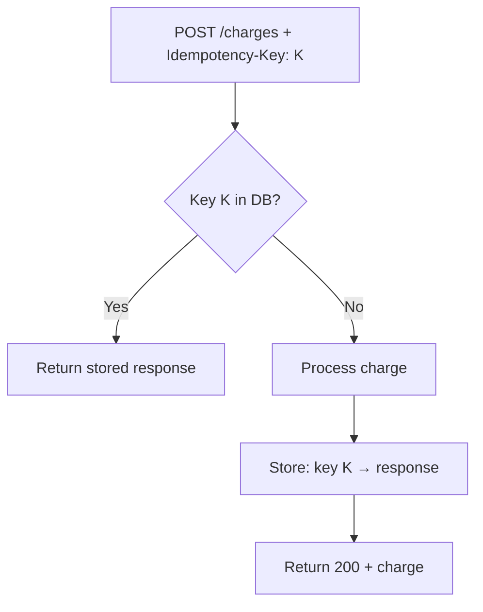

⚡ TL;DR - RESTful API design patterns are recurring
solutions to common design problems: how to paginate
collections, handle bulk operations, model state transitions,
version APIs, return consistent errors, and design sub-resources -
learning these patterns prevents the most common API
design mistakes that create breaking changes and client
confusion later.

---

| #019 | Category: HTTP & APIs | Difficulty: ★★☆ |
|:---|:---|:---|
| **Depends on:** | REST Principles, Endpoint Design, HTTP Methods, JSON | |
| **Used by:** | REST Resource Design and HATEOAS, Error Response Design, API Versioning, API-First Design | |
| **Related:** | Pagination, Idempotency, Content Negotiation, Batch Requests | |

---

### 🔥 The Problem This Solves

**WORLD WITHOUT IT:**
Every REST API team that has not studied these patterns
invents solutions to the same problems. One team uses
`?page=2&size=25` for pagination, another uses
`?offset=50&limit=25`, a third uses `?cursor=eyJpZCI6NTB9`.
One team puts error details in `{error: "message"}`,
another in `{message: "...", code: 422}`, a third in
`{errors: [{field: "email", message: "invalid"}]}`. Clients
integrating with multiple internal APIs have to learn
a different response schema for each one.

**THE BREAKING POINT:**
As organizations grow from one API to dozens of APIs across
teams, the lack of patterns creates real costs: client
library maintenance (each API has a different SDK),
onboarding time (developers must learn each API's
conventions), and integration bugs (developers assume
one API's pagination pattern works on another).

**THE INVENTION MOMENT:**
Through painful iteration, the industry converged on
patterns for the most common API design challenges. These
were documented and popularized through blog posts (Stripe
API documentation, GitHub API), books (RESTful Web APIs
by Richardson and Amundsen), and specifications (JSON:API,
RFC 7807 Problem Details). The patterns are not a
specification - they are the accumulated solutions of
thousands of API teams.

---

### 📘 Textbook Definition

RESTful API design patterns are established solutions
to recurring challenges in HTTP API design. Core patterns
include: resource naming and relationship modeling (nouns,
hierarchy, actions), pagination of large collections
(offset, cursor, keyset), consistent error responses
(RFC 7807 Problem Details), idempotency for safe retries,
API versioning strategies (URL, header, content negotiation),
sub-resource modeling for containment and relationships,
filtering and sorting of collections, and handling bulk
operations. These patterns improve consistency, client
predictability, and long-term maintainability.

---

### ⏱️ Understand It in 30 Seconds

**One line:**
API design patterns are the solved problems of your
next API: how to paginate, how to error, how to version,
how to model relationships - known solutions to prevent
you from reinventing broken wheels.

**One analogy:**
> Design patterns in APIs are like building codes in
> construction. They do not prevent creativity, but they
> specify proven solutions to recurring problems: where
> to put load-bearing walls, how to wire electrical outlets,
> how to size drainage pipes. A building that ignores
> building codes works fine at first, then surprises you
> with failures later. An API that ignores design patterns
> works fine at first, then breaks clients when it needs
> to change.

**One insight:**
The most expensive API design mistake is not getting the
URL right - it is not planning for change. Every API that
ever existed needed to change after clients started using it.
Patterns like URL versioning (`/v1/`), cursor pagination
(stable under concurrent writes), and idempotency keys
(safe retry) exist specifically to handle change without
breaking clients. The cost of skipping them is paid when
the API grows.

---

### 🔩 First Principles Explanation

**PATTERN 1 - Collection Responses: Consistent Envelope**

```json
// WRONG: bare array (cannot add pagination later)
GET /users
[{"id": 1, "name": "Alice"}, {"id": 2, "name": "Bob"}]

// GOOD: envelope with metadata
GET /users
{
  "data": [
    {"id": 1, "name": "Alice"},
    {"id": 2, "name": "Bob"}
  ],
  "pagination": {
    "total": 1250,
    "page": 1,
    "per_page": 25,
    "next_cursor": "eyJpZCI6MjV9"
  }
}
```

Why: bare arrays cannot be extended without breaking
clients. Once you ship a bare array, adding pagination
metadata breaks every client that expects an array.

---

**PATTERN 2 - Pagination: Three Strategies**

| Strategy | Use When | Trade-off |
|:---|:---|:---|
| **Offset/Limit** | Simple cases, read-heavy, consistent data | Simple to implement; breaks under concurrent inserts (items shift) |
| **Cursor/Keyset** | Feed-style data, concurrent writes, large datasets | Stable under writes; opaque cursor; cannot jump to arbitrary page |
| **Page Number** | User-facing paging UI (show page 3 of 50) | Intuitive; same as offset but with different param names |

**Cursor pagination example:**
```
GET /orders?limit=25
→ {"data": [...], "next_cursor": "eyJpZCI6MjV9"}

GET /orders?limit=25&cursor=eyJpZCI6MjV9
→ {"data": [...], "next_cursor": "eyJpZCI6NTB9"}
```

Cursor encodes the last seen record position (ID or
timestamp). Query: `WHERE id > :last_seen LIMIT 25`.
Stable because it is not affected by new insertions.

---

**PATTERN 3 - Error Responses: RFC 7807 Problem Details**

```json
// WRONG: inconsistent ad-hoc error format
{"error": "Invalid email address"}

// BETTER: RFC 7807 Problem Details
HTTP/1.1 422 Unprocessable Entity
Content-Type: application/problem+json

{
  "type": "https://api.example.com/errors/validation",
  "title": "Validation Error",
  "status": 422,
  "detail": "One or more fields failed validation",
  "errors": [
    {"field": "email",
     "message": "Invalid email format"},
    {"field": "phone",
     "message": "Phone number required"}
  ]
}
```

---

**PATTERN 4 - Idempotency Keys**

```
POST /charges
Idempotency-Key: 550e8400-e29b-41d4-a716-446655440000

{
  "amount": 4999,
  "currency": "usd",
  "card": "tok_visa"
}
```

If the same key is used again (network retry), server
returns the same response without creating a duplicate
charge. Key stored in DB with request fingerprint.
TTL: 24 hours to 7 days. Stripe pioneered this pattern.

---

**PATTERN 5 - Filtering, Sorting, Sparse Fieldsets**

```
# Filter by multiple criteria
GET /orders?status=active&created_after=2024-01-01

# Sort by multiple fields
GET /orders?sort=created_at:desc,total:asc

# Sparse fieldsets (return only needed fields)
GET /users?fields=id,name,email
# Returns: [{"id":1,"name":"Alice","email":"..."}]
# Omits: address, phone, profile_image, preferences
```

Sparse fieldsets reduce response size and avoid sending
sensitive fields the client did not request.

---

**PATTERN 6 - Sub-Resource Relationships**

```
# Containment (order OWNS items):
GET /orders/42/items         → items inside order 42
POST /orders/42/items        → add item to order 42
DELETE /orders/42/items/7    → remove item 7 from order 42

# Association (user HAS MANY tags):
GET /users/42/tags           → tags of user 42
POST /users/42/tags          → add tag to user 42
DELETE /users/42/tags/99     → remove association

# But: if tags have independent existence:
GET /tags/99                 → tag 99 directly
GET /tags?user_id=42         → tags for user (via filter)
```

Rule: use hierarchy for containment. Use filters for
M:N associations where both sides have independent identity.

---

### 🧪 Thought Experiment

**SETUP:**
You design `GET /transactions` for a fintech API.
Your first version returns a bare JSON array.
6 months later, you have 100 clients.
Now you need to add pagination (dataset is 10 million rows).

**WITH BARE ARRAY (wrong first choice):**
```json
// Current response - 100 clients depend on this shape:
[{"id": 1, "amount": 100}, {"id": 2, "amount": 200}]

// New response needed - breaks all existing clients:
{
  "data": [{"id": 1, "amount": 100}],
  "pagination": {"total": 10000000, ...}
}
```

All 100 clients break - they iterate over the top-level
array; now they get an object. You need a major version
bump (`/v2/transactions`) and a migration period.

**WITH ENVELOPE (correct first choice):**
```json
// Original response:
{"data": [{"id": 1}, {"id": 2}]}

// Extended with pagination - backward compatible:
{
  "data": [{"id": 1}, {"id": 2}],
  "pagination": {"total": 10000000, ...}
}
```

All existing clients still work: they already access
`response.data` as the array. New clients use
`response.pagination`. No breaking change. No version bump.

**THE INSIGHT:**
Design for extension from the start. An envelope response
does not cost anything and prevents an entire class of
breaking changes.

---

### 🧠 Mental Model / Analogy

> API design patterns are like contract templates in law.
> You do not write contracts from scratch every time -
> you start with a standard template for a lease, a
> service agreement, or a purchase order, then fill in
> the specific terms. The template captures the lessons
> from thousands of disputes about what needs to be
> explicit. An API design pattern is the equivalent template
> for common API problems: this is how pagination works,
> this is how errors work, this is how versioning works.
> Use the template; customize the business terms.

Mapping:
- "Contract template" → API design pattern
- "Standard lease terms" → RFC 7807, cursor pagination
- "Customizing the business terms" → your specific fields,
  domain names, validation rules

Where this analogy breaks down: legal templates are rigid
for good reason (disputes). API patterns should be
understood well enough to adapt when a specific domain
genuinely requires a different approach. The pattern is
a starting point, not a straitjacket.

---

### 📶 Gradual Depth - Five Levels

**Level 1 - What it is (anyone can understand):**
API design patterns are proven solutions to common API
problems that teams have encountered and solved repeatedly.
Using them means your API will behave in ways that
developers already know how to handle, reducing the time
to integrate.

**Level 2 - How to use it (junior developer):**
Apply the five core patterns: envelope all collections
(`{"data": [...], "pagination": {...}}`), use RFC 7807
for errors, implement idempotency keys on POST endpoints
that create or charge, use cursor pagination for large
datasets, and version via URL prefix (`/v1/`).

**Level 3 - How it works (mid-level engineer):**
Patterns solve specific client needs. Envelope responses
allow metadata addition without breaking client array
iteration. Cursor pagination gives a stable position in
the dataset that is unaffected by concurrent writes.
Idempotency keys allow safe retry by client network
libraries. RFC 7807 errors allow client error handling
code to be reused across different error types because
the structure is consistent.

**Level 4 - Why it was designed this way (senior/staff):**
The patterns that survive are those that solve problems
at two levels: client correctness (cursor pagination
prevents duplicate/missing items during concurrent writes;
idempotency prevents duplicate charges) and operational
maintainability (envelope responses allow adding fields
without versioning; URL versioning allows both versions
to coexist during migration). The patterns that fail are
those that optimize for developer aesthetics (bare arrays
"look cleaner") without considering the operational lifecycle.
Any API that will be changed after clients start using it
(which is all APIs) needs patterns designed for evolution.

**Level 5 - Mastery (distinguished engineer):**
The hardest design pattern problem is not picking a
pattern - it is recognizing when the standard pattern
breaks down. Cursor pagination fails for sorted queries
where the sort key changes (a "likes count" sort: items
move between pages as likes accumulate). Offset pagination
is fine for data that rarely changes. Idempotency keys
create a bottleneck at the uniqueness check if the API
is called at very high rate; at extreme scale, idempotency
keys must be shard-keyed. Envelope responses create
overhead for internal high-throughput APIs where the
extra JSON parsing cost is significant. Pattern
knowledge = knowing both what the pattern solves AND
what it costs.

---

### ⚙️ How It Works (Mechanism)

**Cursor pagination mechanism:**

```
Table: orders (id, created_at, ...)
Index: (created_at DESC, id DESC)  ← stable sort

Page 1:
  SELECT * FROM orders
  ORDER BY created_at DESC, id DESC
  LIMIT 25
  → last row: created_at=2024-01-15, id=42
  → cursor = base64({"created_at":"2024-01-15","id":42})

Page 2:
  SELECT * FROM orders
  WHERE (created_at, id) < ('2024-01-15', 42)
  ORDER BY created_at DESC, id DESC
  LIMIT 25
  
Why stable: new inserts have newer created_at, appear
before page 1. They do not shift existing rows, so
cursor position for page 2 is still valid.
```

**Idempotency key mechanism:**

```
Client sends:
  POST /charges
  Idempotency-Key: abc-123
  {amount: 4999}

Server flow:
  1. Check: does key 'abc-123' exist in idempotency_keys?
  2. No → process charge, store result with key, TTL=24h
  3. Return 200 with charge result

Client retries (same key):
  POST /charges
  Idempotency-Key: abc-123
  {amount: 4999}

Server flow:
  1. Check: does key 'abc-123' exist? YES
  2. Return stored result (charge not created again)
  3. Return 200 with original charge result
```



---

### 🔄 The Complete Picture - End-to-End Flow

**Complete REST API for an order resource, all patterns:**

```
COLLECTION:
GET /v1/orders?status=active&sort=created_at:desc
              &limit=25&cursor=eyJpZCI6NTB9
              &fields=id,status,total,created_at

Response:
{
  "data": [
    {"id": 75, "status": "active", "total": 4999,
     "created_at": "2024-01-15T10:00:00Z"},
    ...
  ],
  "pagination": {
    "limit": 25,
    "next_cursor": "eyJpZCI6NTB9",
    "has_more": true
  }
}

CREATE (with idempotency):
POST /v1/orders
Idempotency-Key: client-uuid-here

{
  "items": [{"product_id": "p_123", "quantity": 2}],
  "shipping_address_id": "addr_456"
}

Response 201:
{
  "data": {
    "id": 76,
    "status": "pending",
    ...
  }
}

ERROR (RFC 7807):
HTTP/1.1 422 Unprocessable Entity
Content-Type: application/problem+json
{
  "type": "https://api.example.com/errors/validation",
  "title": "Validation Failed",
  "status": 422,
  "errors": [
    {"field": "items", "message": "At least one item required"}
  ]
}
```

---

### 💻 Code Example

**Example 1 - BAD vs GOOD collection response**

```python
# BAD: bare array - cannot extend without breaking clients
@app.route("/orders")
def list_orders_bad():
    orders = db.orders.all()
    return jsonify([o.to_dict() for o in orders])  # BAD

# GOOD: envelope - extensible without breaking clients
@app.route("/v1/orders")
def list_orders_good():
    limit = min(int(request.args.get("limit", 25)), 100)
    cursor = request.args.get("cursor")
    status = request.args.get("status")

    query = db.orders.query()
    if status:
        query = query.filter_by(status=status)
    if cursor:
        # Decode cursor: {"id": 50}
        import base64, json
        last_id = json.loads(
            base64.b64decode(cursor)
        )["id"]
        query = query.filter(db.Order.id > last_id)

    orders = query.order_by("id").limit(limit + 1).all()
    has_more = len(orders) > limit
    orders = orders[:limit]

    next_cursor = None
    if has_more and orders:
        import base64, json
        next_cursor = base64.b64encode(
            json.dumps({"id": orders[-1].id}).encode()
        ).decode()

    return jsonify({
        "data": [o.to_dict() for o in orders],
        "pagination": {
            "limit": limit,
            "has_more": has_more,
            "next_cursor": next_cursor
        }
    })
```

---

**Example 2 - Idempotency key implementation**

```python
import hashlib
import redis
from datetime import datetime, timedelta

r = redis.Redis()

def with_idempotency(handler_fn):
    """Decorator: makes a POST endpoint idempotent."""
    @wraps(handler_fn)
    def wrapped(*args, **kwargs):
        key = request.headers.get("Idempotency-Key")
        if not key:
            return handler_fn(*args, **kwargs)

        # Validate key format (UUID recommended)
        cache_key = f"idem:{key}"
        cached = r.get(cache_key)

        if cached:
            # Return stored response without processing
            stored = json.loads(cached)
            return jsonify(stored["body"]), stored["status"]

        # Process the request
        response = handler_fn(*args, **kwargs)
        response_data, status_code = response

        # Store for 24 hours
        r.setex(cache_key, 86400, json.dumps({
            "body": response_data.get_json(),
            "status": status_code
        }))
        return response

    return wrapped

@app.route("/v1/charges", methods=["POST"])
@with_idempotency
def create_charge():
    data = request.json
    charge = payment_service.create(
        amount=data["amount"],
        currency=data.get("currency", "usd")
    )
    return jsonify(charge.to_dict()), 201
```

---

**Example 3 - RFC 7807 error responses**

```python
from flask import jsonify

def problem_response(
    type_url: str,
    title: str,
    status: int,
    detail: str = None,
    **extra
) -> tuple:
    """Return RFC 7807 Problem Details response."""
    body = {
        "type": type_url,
        "title": title,
        "status": status,
    }
    if detail:
        body["detail"] = detail
    body.update(extra)

    response = jsonify(body)
    response.content_type = "application/problem+json"
    return response, status

# Usage:
@app.errorhandler(404)
def not_found(e):
    return problem_response(
        type_url="https://api.example.com/errors/not-found",
        title="Resource Not Found",
        status=404,
        detail=f"The requested resource does not exist"
    )

@app.errorhandler(422)
def validation_error(e):
    return problem_response(
        type_url="https://api.example.com/errors/validation",
        title="Validation Failed",
        status=422,
        errors=e.validation_errors  # field-level errors
    )
```

---

### ⚖️ Comparison Table

| Pattern | Options | Recommended | When to Deviate |
|:---|:---|:---|:---|
| **Pagination** | Offset, Cursor, Page | Cursor for large/concurrent data | Offset for small, static datasets |
| **Error format** | Ad-hoc, RFC 7807 | RFC 7807 | Internal APIs where brevity matters |
| **Collection shape** | Bare array, Envelope | Envelope always | Never - bare arrays break on extension |
| **Versioning** | URL (`/v1/`), Header, Accept | URL versioning for public APIs | Header for APIs with one client type |
| **Idempotency** | None, Idempotency-Key header | Idempotency-Key for writes | Read-only APIs do not need it |

---

### ⚠️ Common Misconceptions

| Misconception | Reality |
|:---|:---|
| Bare arrays are simpler and fine for small APIs | Small APIs grow. A bare array that starts as 10 items eventually needs pagination. Adding the envelope later is a breaking change. The cost of envelope upfront is zero; the cost of adding it later is a version bump. |
| Cursor pagination prevents all pagination bugs | Cursor pagination prevents the "items shift on insert" bug. But if your sort column can change value (e.g., a "popularity score" that updates in real-time), cursor pagination still has issues. Immutable columns (ID, created_at) are the safest cursor basis. |
| Idempotency keys are only for payment APIs | Any API where retries could cause duplicate side effects needs idempotency. Creating records, sending emails, triggering workflows, reserving inventory - all benefit from idempotency keys. |
| RFC 7807 is overkill for simple APIs | RFC 7807 is four JSON fields (`type`, `title`, `status`, `detail`). It is not complex. The benefit: error handling code is reusable across all endpoints because the structure is consistent. |

---

### 🚨 Failure Modes & Diagnosis

**Offset pagination returns duplicates under concurrent writes**

**Symptom:** Paginated export job shows the same record
twice across pages. Records that were inserted during
pagination appear in an earlier page AND a later page
due to row shifting.

**Root Cause:** `OFFSET 25 LIMIT 25` skips 25 rows at
query time. If a row is inserted before row 25 during
pagination, all existing rows shift, and row 25 of
the second page was row 24 of the first page.

**Diagnostic Command / Tool:**

```sql
-- Reproduce offset drift:
-- Session 1: start pagination
SELECT id FROM orders ORDER BY created_at LIMIT 25;
-- Last id: 25

-- Session 2: insert new order (created_at = NOW)
INSERT INTO orders (...);

-- Session 1: next page
SELECT id FROM orders ORDER BY created_at OFFSET 25 LIMIT 25;
-- Row 1 of second page may be same as last row of first page
```

**Fix:** Switch to keyset pagination:
```sql
-- Stable: reference last seen row
SELECT id FROM orders
WHERE (created_at, id) < (:last_created_at, :last_id)
ORDER BY created_at DESC, id DESC
LIMIT 25;
```

---

**Missing idempotency on charge endpoint causes
double billing**

**Symptom:** Customer charged twice. Payment processor
shows two successful charge events within seconds.
Client logs show one request with a network timeout,
followed by a retry.

**Root Cause:** Payment API does not support idempotency
keys. Client network timeout causes client to retry.
Server processed both requests.

**Diagnostic Command / Tool:**

```bash
# Check if endpoint accepts Idempotency-Key header
curl -v -X POST https://api.example.com/charges \
  -H "Idempotency-Key: test-key-001" \
  -H "Content-Type: application/json" \
  -d '{"amount": 100}'

# If response does not include X-Idempotency-Key-Replay
# or similar, server likely ignores the key
```

**Fix:** Implement idempotency key handling as shown in
the code examples. Store key+result in Redis with 24h TTL.
Return same result for duplicate key without reprocessing.

---

### 🔗 Related Keywords

**Prerequisites (understand these first):**
- `REST Principles (Roy Fielding)` - the constraints
  that RESTful patterns implement
- `API Endpoint Design Basics` - the noun-verb basics
  that patterns build on
- `HTTP Methods` and `HTTP Status Codes` - patterns use
  correct methods and status codes

**Builds On This (learn these next):**
- `Pagination Patterns (Cursor, Offset, Page)` - deep
  dive into cursor mechanics, keyset queries
- `Error Response Design` - complete RFC 7807 implementation
  with extension fields
- `Idempotency in APIs` - full idempotency key lifecycle,
  distributed deduplication

---

### 📌 Quick Reference Card

```
┌──────────────────────────────────────────────────────────┐
│ WHAT IT IS   │ Proven solutions to recurring API design  │
│              │ problems: pagination, errors, versioning  │
├──────────────┼───────────────────────────────────────────┤
│ PROBLEM IT   │ Every team reinvents broken solutions to  │
│ SOLVES       │ the same problems. Patterns prevent this. │
├──────────────┼───────────────────────────────────────────┤
│ KEY INSIGHT  │ Envelope responses cost nothing; bare     │
│              │ arrays cost a version bump when you grow  │
├──────────────┼───────────────────────────────────────────┤
│ USE WHEN     │ Designing any API that will have clients  │
│              │ and will change over time (all APIs)      │
├──────────────┼───────────────────────────────────────────┤
│ AVOID WHEN   │ No absolute avoidance - but understand    │
│              │ trade-offs before deviating from patterns │
├──────────────┼───────────────────────────────────────────┤
│ ANTI-PATTERN │ Bare array responses, no error structure, │
│              │ offset pagination for large/live datasets │
├──────────────┼───────────────────────────────────────────┤
│ TRADE-OFF    │ Pattern consistency vs domain specificity │
│              │ for unusual operations                    │
├──────────────┼───────────────────────────────────────────┤
│ ONE-LINER    │ "Envelope collections, cursor-paginate,   │
│              │ RFC 7807 errors, idempotency keys."       │
├──────────────┼───────────────────────────────────────────┤
│ NEXT EXPLORE │ Pagination Patterns → Error Design →      │
│              │ API Versioning Strategies                 │
└──────────────────────────────────────────────────────────┘
```

**If you remember only 3 things:**
1. Always wrap collection responses in an envelope
   (`{"data": [...], "pagination": {...}}`). Bare arrays
   cannot be extended without breaking clients.
2. Use cursor pagination (keyset) for large or actively
   written datasets. Offset pagination causes duplicate/
   missing items under concurrent writes.
3. Implement idempotency keys on any POST endpoint that
   creates resources or triggers side effects. Network
   retries will otherwise cause duplicates.

---

### 💎 Transferable Wisdom

**Reusable Engineering Principle:**
Design for the lifecycle of the system, not just its
initial state. Every pattern in this entry exists because
something that "works fine at launch" fails as the system
grows: bare arrays fail when pagination is needed; offset
pagination fails under write concurrency; missing
idempotency fails on network retries; missing version
strategy fails when breaking changes are needed. The cost
of applying a pattern at launch is small (one extra
JSON key, one extra header, one extra index). The cost
of adding the pattern retroactively is a version bump
and a migration period for all clients. Patterns are
cheap upfront and expensive to add later.

**Where else this pattern appears:**
- Database schema design: adding a `created_at` column
  upfront is free; adding it after millions of rows exist
  requires a migration
- Protocol versioning: HTTP's `Version: 1.1` in the
  first line allows future version negotiation
- Configuration files: wrapping in `{"config": {...}}`
  allows adding metadata keys later without breaking parsers

---

### 💡 The Surprising Truth

The most influential API design guide in existence, Stripe's
API documentation, was not written by an API design
committee or standards body - it was written by Patrick
Collison and the early Stripe team and published in 2011.
Their decisions (plural nouns, snake_case fields, error
objects with `code` and `message`, Idempotency-Key header,
live/test key prefixes) became the de facto template
for thousands of payment and SaaS APIs that followed.
Stripe's API has kept backward compatibility for 12+
years - API keys from 2011 still work today. The design
choices that enabled this longevity were not particularly
original: they were careful applications of REST patterns
with extreme discipline about backward compatibility.
The surprise: API quality compounds. A well-designed
API in 2011 still generates trust and revenue in 2025.

---

### ✅ Mastery Checklist

**You've mastered this when you can:**
1. **EXPLAIN** Why bare array responses are a design
   mistake even for small APIs, with a specific scenario
   showing how adding pagination later causes a breaking
   change.
2. **DEBUG** Given a paginated export job that produces
   duplicate records under write concurrency, identify
   the offset pagination root cause and implement the
   cursor pagination fix.
3. **DECIDE** Given an API for a social feed (high write
   concurrency, sort by recency), choose between offset
   and cursor pagination with explicit reasons.
4. **BUILD** Implement RFC 7807 error responses with
   field-level validation errors for a registration
   endpoint with email, password, and phone fields.
5. **EXTEND** Design an idempotency key implementation
   for a charge API that handles: duplicate key detection,
   TTL, concurrent requests with the same key (race
   condition), and key expiry.

---

### 🎯 Interview Deep-Dive

**Q1: You are building a public API for an event log
that receives 10,000 inserts per second. Clients need
to paginate through recent events. What pagination
strategy do you use and why?**

*Why they ask:* Tests practical pagination knowledge
under realistic constraints.

*Strong answer includes:*
- Offset pagination: fatal for this use case. 10,000
  inserts/second means offset drifts constantly.
  A client paginating through 100 pages will see
  duplicates and skipped records.
- Cursor pagination with keyset: `WHERE id > :last_id
  ORDER BY id LIMIT 100`. Stable regardless of concurrent
  inserts because new inserts have higher IDs.
- Implementation: encode `{id: last_seen_id}` as the cursor
  (base64 or opaque token). Client passes cursor in next
  request. If cursor is missing, start from latest.
- Edge case: if the client wants to poll for NEW events
  since their last check, this is not pagination - it is
  change tracking. Different pattern: `GET /events?since_id=999`
  (forward pagination from a known point).

**Q2: Design an error response format for a REST API
that must support field-level validation errors.**

*Why they ask:* Tests knowledge of error response patterns
and RFC 7807.

*Strong answer includes:*
- RFC 7807 Problem Details as the base format:
  `type`, `title`, `status`, `detail`
- Extension: `errors` array with field-level details:
  ```json
  {
    "type": "https://api.example.com/errors/validation",
    "title": "Validation Failed",
    "status": 422,
    "errors": [
      {"field": "email", "message": "Invalid format"},
      {"field": "password",
       "message": "Minimum 8 characters required"}
    ]
  }
  ```
- Content-Type: `application/problem+json`
- Why RFC 7807: standardized structure means client error
  handling code is reusable across all endpoints. Clients
  do not need to parse different error formats per endpoint.
- Important: return all validation errors at once, not
  just the first one. Clients should not need multiple
  round-trips to discover all errors.

**Q3: When would you not use cursor pagination?**

*Why they ask:* Tests that the candidate understands
patterns deeply enough to know when to deviate.

*Strong answer includes:*
- Cursor pagination assumes a stable, immutable sort key.
  If sorting by a mutable field (e.g., "popularity score"
  that changes frequently), the cursor position becomes
  invalid as items move in the sort order.
- For mutable sort keys: use a snapshot approach (capture
  the sorted list at query time, paginate through the
  snapshot with offset into the snapshot ID list).
- Also: cursor pagination cannot jump to an arbitrary
  page number ("show page 47 of 200"). For user-facing
  paging with "go to page N", offset or explicit page
  number pagination is required.
- For small, static datasets (< 1000 rows, rarely changes):
  offset pagination is fine and simpler to implement.
  Cursor complexity is only justified when the dataset
  grows or has concurrent writes.
