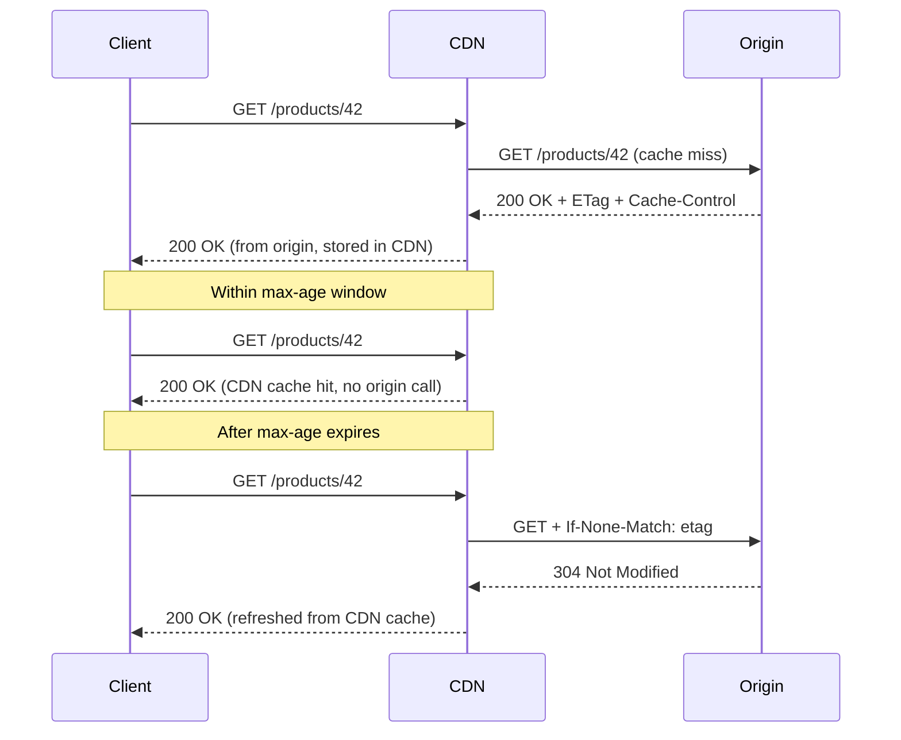

⚡ TL;DR - HTTP caching uses `Cache-Control` to declare
how long a response is fresh, `ETag` to fingerprint
resource versions for conditional revalidation, and
`Last-Modified` for time-based revalidation - together
eliminating redundant server round-trips and dramatically
reducing API latency and origin load.

---

| #020 | Category: HTTP & APIs | Difficulty: ★★☆ |
|:---|:---|:---|
| **Depends on:** | Request Headers, HTTP Methods, Status Codes | |
| **Used by:** | HTTP/2 Multiplexing, API Gateway, HTTP Keep-Alive | |
| **Related:** | HTTP Compression, HTTP/1.1 vs HTTP/2, API Rate Limiting | |

---

### 🔥 The Problem This Solves

**WORLD WITHOUT IT:**
Without caching, every HTTP request hits the origin server.
A product catalog page that 10,000 users view per minute
triggers 10,000 database queries per minute for data that
changes only once per hour. The database is under continuous
pressure for reads that could be served from memory.
Every user experiences the full origin latency (50-200ms)
even when the response has not changed since their last visit.

**THE BREAKING POINT:**
Web scale makes origin-only serving economically and
technically impossible. Amazon measured that 100ms of
additional latency reduces sales by 1%. Netflix serves
billions of requests per day - without caching, this would
require orders of magnitude more compute. Twitter's API
receives millions of GET requests per second for tweet
content that does not change once published.

**THE INVENTION MOMENT:**
HTTP/1.0 had a simple `Expires` header (absolute date).
HTTP/1.1 (1997) introduced the comprehensive caching
framework: `Cache-Control` (relative freshness), `ETag`
(content fingerprint for conditional requests), `Vary`
(cache keying on request headers). Together these allow
three caching strategies: (1) serve from cache until
expiry, (2) revalidate with a conditional request that
returns 304 if unchanged, (3) bypass cache for private
or sensitive data.

---

### 📘 Textbook Definition

HTTP caching is the mechanism by which HTTP responses
are stored and reused to reduce latency and server load.
`Cache-Control` directives specify how and for how long
a response can be cached (`max-age`, `no-cache`,
`no-store`, `private`, `public`). `ETag` is an opaque
identifier for a specific version of a resource; clients
send `If-None-Match: {etag}` on subsequent requests, and
servers return `304 Not Modified` if the resource has
not changed. `Last-Modified` is a timestamp-based
alternative to ETag; clients send `If-Modified-Since`
for revalidation. Cache layers include browser cache,
reverse proxy cache (Nginx, Varnish), CDN, and API gateway.

---

### ⏱️ Understand It in 30 Seconds

**One line:**
`Cache-Control: max-age=3600` says "serve this from cache
for one hour"; `ETag` says "here is the version fingerprint
- ask me before you use it again"; `304 Not Modified`
says "your cached version is still current, no body needed."

**One analogy:**
> HTTP caching is like a library reserve system. When you
> borrow a book (response), the library stamps it with
> a "valid until" date (Cache-Control max-age). Before
> the date, you can re-read without returning to the
> library. On the expiry date, you bring it back to
> check if there is a newer edition (conditional request).
> If the edition is unchanged (304 Not Modified), the
> librarian says "still current - keep it." If there is
> a new edition, the librarian gives you the new version.

**One insight:**
`Cache-Control: no-cache` does NOT mean "do not cache."
It means "you must revalidate before using the cached
copy." The response IS cached, but every use requires
a conditional request (If-None-Match). `no-store` means
"do not cache at all." This is the most common caching
header misconception in production.

---

### 🔩 First Principles Explanation

**CACHE-CONTROL DIRECTIVES:**

| Directive | Meaning |
|:---|:---|
| `max-age=N` | Cache for N seconds (relative to response time) |
| `s-maxage=N` | Override max-age for shared caches (CDN) only |
| `no-cache` | Cache but revalidate before every use |
| `no-store` | Do not cache at all (sensitive data) |
| `private` | Only browser can cache; CDN must not |
| `public` | Any cache (CDN, proxy) may cache |
| `must-revalidate` | After expiry, must revalidate; no stale serving |
| `stale-while-revalidate=N` | Serve stale for N seconds while fetching fresh |
| `immutable` | Content will never change; never revalidate |

**THREE CACHING STRATEGIES:**

**1. Cache until expiry (freshness model)**
```
Response: Cache-Control: public, max-age=3600
→ Cache serves without server contact for 1 hour
→ After 1 hour: fetch fresh copy
```

**2. Conditional revalidation with ETag**
```
Response:  ETag: "abc123"
           Cache-Control: no-cache

Next req:  If-None-Match: "abc123"
Server:    304 Not Modified  ← resource unchanged
       OR  200 OK + new body + new ETag ← resource changed
```

**3. Conditional revalidation with Last-Modified**
```
Response:  Last-Modified: Mon, 15 Jan 2024 10:00:00 GMT
           Cache-Control: no-cache

Next req:  If-Modified-Since: Mon, 15 Jan 2024 10:00:00 GMT
Server:    304 Not Modified
       OR  200 OK + new body + new timestamp
```

**WHEN TO USE WHICH:**

| Use Case | Headers |
|:---|:---|
| Static assets with hash in URL | `Cache-Control: public, max-age=31536000, immutable` |
| API response, public, hourly updates | `Cache-Control: public, max-age=3600` |
| API response, user-specific | `Cache-Control: private, no-store` |
| Large resource, revalidate cheaply | `Cache-Control: no-cache` + `ETag` |
| Auth tokens, payments, PII | `Cache-Control: no-store` |

---

### 🧪 Thought Experiment

**SETUP:**
Your API serves `GET /products/42` - a product listing
that changes about once per day. The endpoint receives
50,000 requests per hour. Without caching, every request
hits the database.

**SCENARIO A - max-age with 1-hour TTL:**
```
Cache-Control: public, max-age=3600
ETag: "prod-42-v7"
```
- CDN caches the response
- First request from any user hits origin
- Next 49,999 requests within the hour served from CDN
- CDN hit rate: ~99.998%
- Cost: response may be up to 1 hour stale

**SCENARIO B - no-cache with ETag:**
```
Cache-Control: no-cache
ETag: "prod-42-v7"
```
- Every request sends If-None-Match: "prod-42-v7"
- Server checks ETag match (O(1) DB lookup)
- 304 Not Modified if unchanged (tiny response, no body)
- 200 OK with full body only when product changes
- Benefit: always current; cost: server round-trip on
  every request (but cheap: just an ETag comparison)

**THE INSIGHT:**
`max-age` optimizes for CDN efficiency (no server contact).
`no-cache` + ETag optimizes for consistency (always current)
while avoiding full body retransmission. Choose based on
staleness tolerance: financial data → `no-cache` + ETag;
product catalog → `max-age=3600`; CSS with hash in
filename → `immutable`.

---

### 🧠 Mental Model / Analogy

> Cache-Control is the freshness stamp on a food container.
> `max-age=3600` = "use by in 1 hour - no need to check."
> `no-cache` = "always check before eating - may still be
> fresh." `no-store` = "do not put in the fridge - consume
> immediately and discard." ETag is the batch number:
> when you return to the store (revalidation), you tell
> the clerk your batch number. If they have the same batch
> (304), your supply is current. If there is a new batch
> (200), they give you the new product.

Mapping:
- "Freshness stamp" → Cache-Control header
- "Use by in 1 hour" → max-age=3600
- "Always check before eating" → no-cache
- "Do not refrigerate" → no-store
- "Batch number" → ETag value
- "Telling the clerk the batch number" → If-None-Match
- "Same batch, still good" → 304 Not Modified

---

### 📶 Gradual Depth - Five Levels

**Level 1 - What it is (anyone can understand):**
HTTP caching means saving a server's response so you do not
have to ask the server again. `Cache-Control: max-age=3600`
tells browsers and CDNs "save this for one hour." ETag is
a fingerprint: the browser asks "has this changed since I
last got it?" and the server says "no" with a tiny response
instead of the whole data.

**Level 2 - How to use it (junior developer):**
Add `Cache-Control: public, max-age=3600` to publicly
cacheable responses. Add `Cache-Control: private, no-store`
to user-specific or sensitive responses. Add ETag to
expensive-to-compute but rarely-changing responses.
Never use caching headers on auth, payment, or sensitive
endpoints.

**Level 3 - How it works (mid-level engineer):**
Browser and CDN cache keyed on URL (and headers, via `Vary`).
On request: if fresh (within max-age) → serve from cache.
If stale but cached → send `If-None-Match: {etag}`. If
304 → refresh TTL, serve from cache. ETag is typically
a hash of response body or database version field.
`Vary: Accept-Encoding` tells CDN to store compressed
and uncompressed versions separately.

**Level 4 - Why it was designed this way (senior/staff):**
HTTP caching is a distributed system: browser cache,
shared proxy, CDN, API gateway - each layer independently
caches responses. `public` vs `private` controls which
layers participate. `s-maxage` allows different TTL for
CDN vs browser. The design is pull-based: caches decide
based on headers; origin does not push invalidations
(except via CDN PURGE API). Pull-based scales infinitely
(no coordination). The cost: invalidation is eventual.

**Level 5 - Mastery (distinguished engineer):**
HTTP cache invalidation is one of the hardest distributed
systems problems. Three mechanisms: (1) TTL expiry
(eventual, TTL gap), (2) URL versioning (hashed filenames,
instantly invalidated by URL change), (3) CDN purge
(immediate but expensive). The combination at scale:
immutable assets with hashed URLs, conservative `max-age`
(60-300s for public API data), ETags for revalidation
without body retransmission, CDN purge on significant
data changes. ETag generation is a design choice: DB
`updated_at` timestamp is simple; hash of response body
is precise but CPU-intensive at scale.

---

### ⚙️ How It Works (Mechanism)

**HTTP caching flow:**

```
First Request:
  GET /products/42
  ← 200 OK
    Cache-Control: public, max-age=3600
    ETag: "prod42-v7"
    {product data}
  Client stores: {url, body, etag, expires=now+3600s}

Second Request (within 3600s):
  GET /products/42
  ← 200 OK (from cache, no server contact)

Third Request (after 3600s, stale):
  GET /products/42
  If-None-Match: "prod42-v7"
  ← 304 Not Modified (no body)
    Cache-Control: public, max-age=3600
  Client: expires=now+3600s (refreshed)

Product Updated:
  GET /products/42
  If-None-Match: "prod42-v7"
  ← 200 OK
    ETag: "prod42-v8"
    {new product data}
```



---

### 🔄 The Complete Picture - End-to-End Flow

**Cache-Control strategy by resource type:**

```
Static assets (JS/CSS with content hash in URL):
  Cache-Control: public, max-age=31536000, immutable
  → URL changes when content changes; no revalidation

API: public product catalog (hourly updates):
  Cache-Control: public, max-age=3600
  ETag: "{hash of product data}"
  → stale up to 1 hour; ETag for revalidation

API: user dashboard (user-specific):
  Cache-Control: private, no-store
  → CDN must not cache; browser must not store

API: search results (vary by encoding):
  Cache-Control: public, max-age=300
  Vary: Accept-Encoding
  → CDN caches per Accept-Encoding value

Sensitive endpoints (auth, payments, PII):
  Cache-Control: no-store
  Pragma: no-cache (HTTP/1.0 compatibility)
```

---

### 💻 Code Example

**Example 1 - ETag caching in Flask**

```python
from flask import jsonify, make_response, request
import hashlib, json

@app.route("/api/v1/products/<int:product_id>")
def get_product(product_id):
    product = db.products.get(product_id)
    if not product:
        return jsonify({"error": "not found"}), 404

    product_json = json.dumps(
        product.to_dict(), sort_keys=True
    )
    etag = (
        f'"{hashlib.md5(product_json.encode()).hexdigest()}"'
    )

    client_etag = request.headers.get("If-None-Match")
    if client_etag == etag:
        resp = make_response("", 304)
        resp.headers["ETag"] = etag
        resp.headers["Cache-Control"] = \
            "public, max-age=3600"
        return resp

    resp = make_response(
        jsonify(product.to_dict()), 200
    )
    resp.headers["ETag"] = etag
    resp.headers["Cache-Control"] = \
        "public, max-age=3600"
    return resp
```

---

**Example 2 - BAD: Leaking user data into shared cache**

```python
# BAD: no Cache-Control on user-specific endpoint
@app.route("/api/users/<user_id>/orders")
def get_user_orders_bad(user_id):
    orders = db.orders.for_user(user_id)
    # CDN caches this! User A's orders may be
    # served to User B requesting the same URL
    return jsonify([o.to_dict() for o in orders])

# GOOD: explicit private + no-store
@app.route("/api/v1/users/<user_id>/orders")
def get_user_orders_good(user_id):
    orders = db.orders.for_user(user_id)
    resp = make_response(
        jsonify([o.to_dict() for o in orders]), 200
    )
    resp.headers["Cache-Control"] = "private, no-store"
    return resp
```

---

**Example 3 - Verifying caching with curl**

```bash
# Step 1: get initial response and note ETag
curl -I https://api.example.com/products/42
# cache-control: public, max-age=3600
# etag: "prod42-v7"

# Step 2: conditional request - resource unchanged
curl -I -H 'If-None-Match: "prod42-v7"' \
  https://api.example.com/products/42
# HTTP/2 304 (no body - saves ~1240 bytes)

# Step 3: check CDN cache hit
curl -I https://api.example.com/products/42
# x-cache: HIT  ← served from CDN
# age: 247      ← seconds since CDN cached it
```

---

### ⚖️ Comparison Table

| Header | Mechanism | Client Sends | Returns | Best For |
|:---|:---|:---|:---|:---|
| `max-age=N` | TTL freshness | Nothing until stale | 200 after TTL | Slowly changing public data |
| `ETag` | Content fingerprint | `If-None-Match` | 304 or 200 | Large, accurate invalidation |
| `Last-Modified` | Timestamp | `If-Modified-Since` | 304 or 200 | ETag unavailable |
| `no-cache` | Always revalidate | ETag or timestamp | 304 or 200 | Must be current, body reuse OK |
| `no-store` | Never cache | - | - | Sensitive / personal data |

---

### ⚠️ Common Misconceptions

| Misconception | Reality |
|:---|:---|
| `no-cache` means "do not cache" | `no-cache` means "cache but always revalidate before use." The response IS stored. `no-store` means "do not cache at all." |
| ETag should be the database primary key | ETag identifies the VERSION of the resource. Same product ID with different data has different ETags. Use content hash or timestamp. |
| CDNs ignore `private` | Standards-compliant CDNs (Cloudflare, CloudFront, Fastly) respect `Cache-Control: private`. Verify with `curl -I` via CDN. |
| 304 responses have a body | 304 responses MUST NOT have a body. The client uses its cached copy. A 304 with a body is a protocol error. |

---

### 🚨 Failure Modes & Diagnosis

**User data served from CDN to wrong user (security incident)**

**Symptom:** User A sees User B's order history.

**Root Cause:** User-specific endpoint missing
`Cache-Control: private`. CDN caches and shares the
response.

**Diagnostic Command / Tool:**

```bash
curl -I https://api.example.com/users/42/orders
# MUST see: cache-control: private, no-store
# DANGER if: cache-control: public or header missing

curl -I -H "X-Cache-Debug: 1" \
  https://api.example.com/users/42/orders
# x-cache: HIT = CDN served it (should never happen)
```

**Fix:** Add `Cache-Control: private, no-store` to all
user-specific endpoints. Audit all routes for missing
Cache-Control. Purge CDN cache immediately.

---

**Stale API responses after data update**

**Symptom:** User updates profile, refreshes, sees old
data. Different CDN edge nodes show different data.

**Root Cause:** `max-age=3600` on mutable resource. CDN
continues serving stale after a write.

**Fix options:**
1. Reduce max-age for frequently changing data
2. CDN purge API on write operations
3. Switch to `no-cache` + ETag (always revalidate)

---

**no-cache on sensitive data still in browser cache**

**Symptom:** Payment confirmation accessible from browser
cache on a shared computer.

**Root Cause:** `no-cache` stores the response. On shared
computer, stored response is accessible.

**Fix:** Use `Cache-Control: no-store` for all payment,
auth, and sensitive personal data responses.

---

### 🔗 Related Keywords

**Prerequisites (understand these first):**
- `Request Headers and Response Headers` - Cache-Control,
  ETag, Last-Modified are all HTTP headers
- `HTTP Methods` - only GET/HEAD responses are typically
  cached
- `HTTP Status Codes` - 304 Not Modified is the key
  caching status code

**Builds On This (learn these next):**
- `HTTP/2 Multiplexing` - HTTP/2 + caching for fast APIs
- `HTTP Compression (gzip, brotli)` - complementary:
  reduce bytes transferred
- `API Rate Limiting` - caching reduces origin hit rate,
  relaxing rate limit pressure

---

### 📌 Quick Reference Card

```
┌──────────────────────────────────────────────────────────┐
│ WHAT IT IS   │ HTTP headers declaring how long and where │
│              │ responses may be cached                   │
├──────────────┼───────────────────────────────────────────┤
│ PROBLEM IT   │ Every request hitting origin is slow and  │
│ SOLVES       │ expensive for data that rarely changes    │
├──────────────┼───────────────────────────────────────────┤
│ KEY INSIGHT  │ no-cache ≠ do not cache. It means cache + │
│              │ revalidate. Use no-store for secrets.     │
├──────────────┼───────────────────────────────────────────┤
│ USE WHEN     │ Public, non-sensitive API responses that  │
│              │ are read far more often than they change  │
├──────────────┼───────────────────────────────────────────┤
│ AVOID WHEN   │ User-specific data, PII, auth, payments   │
│              │ → use no-store                            │
├──────────────┼───────────────────────────────────────────┤
│ ANTI-PATTERN │ Missing Cache-Control: private on user-   │
│              │ specific data (CDN may cache and share it)│
├──────────────┼───────────────────────────────────────────┤
│ TRADE-OFF    │ Cache efficiency (max-age) vs consistency │
│              │ (no-cache + ETag)                         │
├──────────────┼───────────────────────────────────────────┤
│ ONE-LINER    │ "no-store for secrets. max-age for public.│
│              │ ETag for large expensive responses."      │
├──────────────┼───────────────────────────────────────────┤
│ NEXT EXPLORE │ HTTP Compression → HTTP/2 Multiplexing    │
└──────────────────────────────────────────────────────────┘
```

**If you remember only 3 things:**
1. `no-cache` ≠ do not cache. Use `no-store` for data
   that must never be stored (auth, payments, PII).
2. Missing `Cache-Control: private` on user-specific
   endpoints can cause CDNs to serve one user's data
   to another. This is a security incident.
3. ETag enables efficient conditional requests: 304 Not
   Modified (no body) when unchanged, 200 with new body
   when changed.

---

### 💎 Transferable Wisdom

**Reusable Engineering Principle:**
Caching is always a trade-off between efficiency and
consistency. The question is: what is the acceptable
staleness for this data? Financial transactions: 0 seconds.
Product catalog: 3600 seconds. Static JS bundle: 31,536,000
seconds (with URL versioning). The worst outcomes: user-
specific data cached publicly (security incident), or
public product catalog with `no-store` (performance waste).

**Where else this pattern applies:**
- CPU cache hierarchy (L1/L2/L3): same trade-off, with
  TTL replaced by eviction policies
- DNS TTL: how long to cache DNS records before re-resolving
- Database query result caching: Redis cache invalidated
  on write

---

### 💡 The Surprising Truth

The `no-cache` naming is considered one of the worst API
naming decisions in HTTP history. RFC 7234 even notes the
name is "perhaps unfortunate." `Pragma: no-cache`
(HTTP/1.0) was the original workaround, and
`Cache-Control: no-cache` was its proper replacement -
but the misleading name stuck. Developers add `no-cache`
to sensitive endpoints thinking caching is disabled, but
the browser still stores the response body. This
misunderstanding has caused security incidents where
sensitive data was accessible from browser cache on
shared computers. The correct directive for "never store
this" has always been `no-store`.

---

### ✅ Mastery Checklist

**You've mastered this when you can:**
1. **EXPLAIN** Describe the difference between `no-cache`
   and `no-store` with a concrete example for each.
2. **DEBUG** Given a report that users see another user's
   data, trace the root cause to missing
   `Cache-Control: private` and specify the fix.
3. **DECIDE** For each endpoint type - public product
   image, user notification count, public product
   description, payment receipt - choose the correct
   Cache-Control header.
4. **BUILD** Implement ETag-based conditional caching on
   a Flask endpoint: generate ETag from hash, return 304
   on match, 200 with new ETag on mismatch.
5. **EXTEND** Explain `stale-while-revalidate` and how it
   improves perceived performance without sacrificing
   eventual consistency.

---

### 🎯 Interview Deep-Dive

**Q1: What is the difference between Cache-Control:
no-cache and no-store?**

*Why they ask:* The most common caching misconception.
Tests whether the candidate has read the spec or learned
from production incidents.

*Strong answer includes:*
- `no-cache`: response IS stored; client MUST revalidate
  before every use via If-None-Match/If-Modified-Since.
  304 → use cached copy. 200 → replace cached copy.
- `no-store`: MUST NOT be stored anywhere - not browser,
  not CDN, not proxy. Use for passwords, tokens, payments.
- Common mistake: using `no-cache` on sensitive data
  thinking caching is disabled. Response is still stored.
  `no-store` is the correct directive.

**Q2: How would you design HTTP caching for a public API
serving product catalog data that changes once per day?**

*Why they ask:* Tests ability to apply caching strategy
to a realistic use case.

*Strong answer includes:*
- `Cache-Control: public, max-age=3600` (1 hour - acceptable
  staleness for catalog browsing)
- ETag for conditional revalidation after TTL
- CDN handles most requests; origin gets revalidation
  hits every 1 hour per cached URL
- For same-day updates: CDN purge on product update events
- `Vary: Accept-Encoding` if serving gzip/brotli

**Q3: What is an ETag and how does it enable conditional
requests?**

*Why they ask:* Tests understanding of the ETag + 304
mechanism, a core HTTP caching pattern.

*Strong answer includes:*
- ETag: opaque identifier for a specific version of a
  resource (hash of body, DB version, or updated_at)
- Flow: server returns `ETag: "abc123"`. Client sends
  `If-None-Match: "abc123"` on next request. If ETag
  matches → 304 Not Modified (no body). If changed →
  200 with new body and new ETag.
- Efficiency: 304 has no body. For 1MB responses, saves
  ~1MB per revalidation when resource is unchanged.
- Weak vs strong: `W/"abc123"` = semantically equivalent
  but not byte-identical; `"abc123"` = byte-identical.
