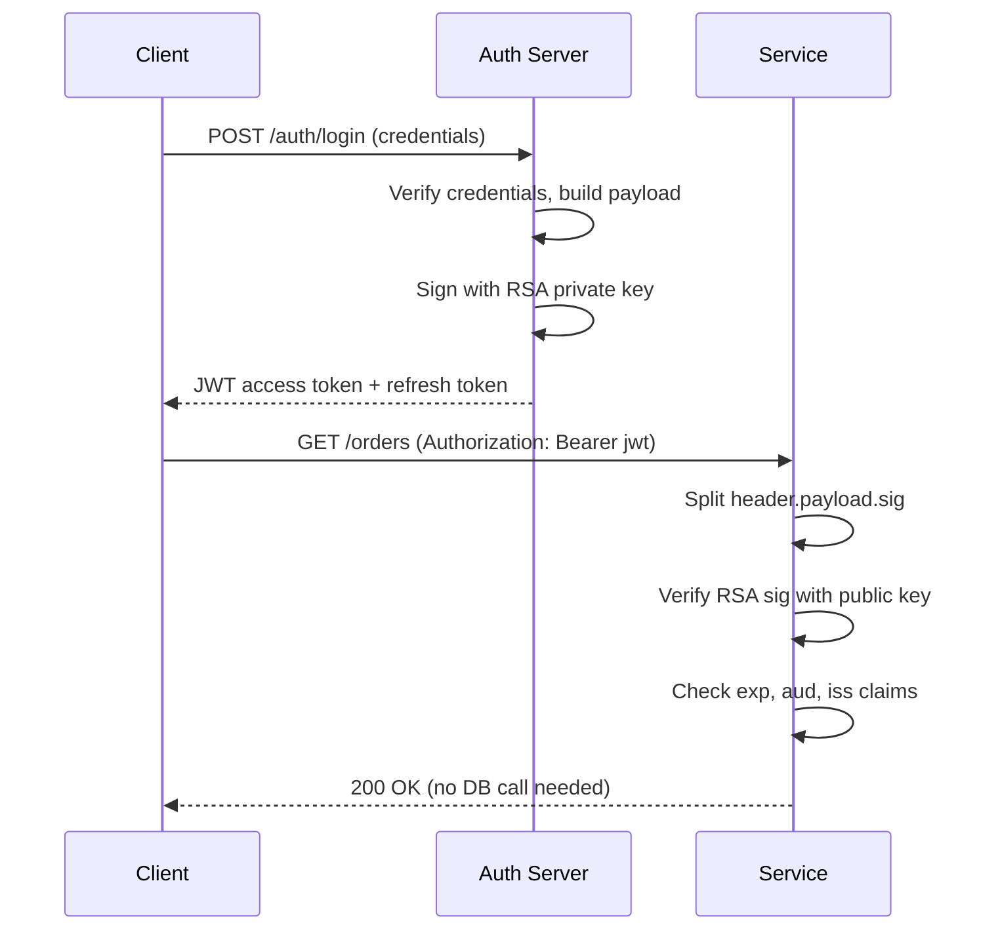

⚡ TL;DR - JWT (JSON Web Token) is a compact, signed
token format: three base64url-encoded segments separated
by dots (header.payload.signature). The server signs
the payload with a secret or private key; any server
with the key can verify the token without a database
lookup, enabling stateless authentication at scale.

---

| #023 | Category: HTTP & APIs | Difficulty: ★★★ |
|:---|:---|:---|
| **Depends on:** | Authentication Schemes, HTTP Status Codes | |
| **Used by:** | OAuth 2.0 Flows, JWT Security, OWASP API Top 10 | |
| **Related:** | API Key Auth, Authentication Schemes, TLS in APIs | |

---

### 🔥 The Problem This Solves

**WORLD WITHOUT IT:**
Before JWT, web apps used server-side sessions: user logs
in, server creates a session in memory or database, stores
a session ID in a cookie. Every request requires a DB
lookup: find session by ID, load user data. This creates
a scaling problem: sessions are stored on one server (or
in a shared Redis). Horizontal scaling requires session
affinity (sticky sessions) or a shared session store.
Sticky sessions prevent load balancing. Shared session
store adds latency and a single point of failure.

**THE BREAKING POINT:**
Microservices made this worse: Service A creates a session,
Service B needs to validate it → shared DB or internal
session sync required. Cross-domain authentication (SPA
+ API on different domains) blocked cookies from working
naturally.

**THE INVENTION MOMENT:**
JWT (RFC 7519, 2015) encodes the user identity and claims
directly in the token. The token is cryptographically
signed. Any server with the verification key can validate
the token and extract claims - no database lookup. The
database lookup moves to session creation time only,
not per-request. This enables stateless, scalable
authentication.

---

### 📘 Textbook Definition

JWT (JSON Web Token, RFC 7519) is a compact, URL-safe
token format consisting of three base64url-encoded parts
separated by periods: `header.payload.signature`.
The **header** declares the token type and signing
algorithm (HS256, RS256, ES256). The **payload** contains
claims: standardized claims (`iss`, `sub`, `aud`, `exp`,
`iat`, `jti`) and custom claims (user roles, scopes).
The **signature** is computed over `base64url(header) + "."
+ base64url(payload)` using the algorithm declared in
the header. For symmetric algorithms (HS256), the same
secret both signs and verifies. For asymmetric (RS256,
ES256), the private key signs and the public key verifies.
The server validates by recomputing the signature and
comparing; a valid signature proves the payload was not
tampered with.

---

### ⏱️ Understand It in 30 Seconds

**One line:**
A JWT is a tamper-proof signed JSON blob you carry with
you: the server can read your identity and permissions
from it without asking a database.

**One analogy:**
> A JWT is like a government-issued passport. It contains
> your identity and claims (name, nationality, expiry).
> Any border officer worldwide can verify it by checking
> the cryptographic seal (signature) without calling
> headquarters (database lookup). If anyone tampers with
> the data, the seal breaks (signature validation fails).

**One insight:**
The payload of a JWT is NOT encrypted - it is base64url
encoded (reversible). Anyone can decode and read the
payload without the secret. The secret is only needed
to VERIFY or CREATE the signature. Never put sensitive
data (passwords, SSN, credit card numbers) in a JWT
payload.

---

### 🔩 First Principles Explanation

**JWT STRUCTURE:**
```
eyJhbGciOiJIUzI1NiIsInR5cCI6IkpXVCJ9
.eyJzdWIiOiJ1c2VyMTIzIiwibmFtZSI6IkFsaWNlIiwi
  ZXhwIjoxNzA2MDAwMDAwLCJzY29wZSI6Im9yZGVyczpyZWFkIn0
.SflKxwRJSMeKKF2QT4fwpMeJf36POk6yJV_adQssw5c

Part 1 (Header):
{"alg":"HS256","typ":"JWT"}

Part 2 (Payload):
{
  "sub": "user123",     ← subject (user ID)
  "name": "Alice",      ← custom claim
  "exp": 1706000000,    ← expiry (Unix timestamp)
  "iat": 1705996400,    ← issued at
  "scope": "orders:read" ← permission scope
}

Part 3 (Signature):
HMAC-SHA256(
  base64url(header) + "." + base64url(payload),
  secret_key
)
```

**STANDARD CLAIMS (registered):**

| Claim | Meaning | Required? |
|:---|:---|:---|
| `iss` | Issuer - who created the token | Recommended |
| `sub` | Subject - who the token is about | Recommended |
| `aud` | Audience - intended recipient | Security critical |
| `exp` | Expiry time (Unix timestamp) | Always include |
| `iat` | Issued at time | Always include |
| `nbf` | Not before - token invalid before this | Optional |
| `jti` | JWT ID - unique token identifier | Revocation use |

**SIGNING ALGORITHMS:**

| Algorithm | Type | Key | Use Case |
|:---|:---|:---|:---|
| HS256 | Symmetric HMAC | Shared secret | Single service |
| RS256 | Asymmetric RSA | Private/public pair | Multiple services |
| ES256 | Asymmetric ECDSA | Private/public pair | Mobile, compact |

**RS256 vs HS256 - the critical difference:**
```
HS256: same key signs AND verifies
→ Every service that verifies must have the secret
→ Any service with the key can ALSO forge tokens
→ Secret leakage from one service compromises all

RS256: private key signs, public key verifies
→ Only auth server has private key
→ All services have public key (can verify, not forge)
→ Public key can be published openly (JWKS endpoint)
→ Recommended for multi-service architectures
```

---

### 🧪 Thought Experiment

**SCENARIO: Microservices JWT validation**

Three services: API Gateway, Order Service, Inventory Service.
Auth Server issues RS256 JWTs.

**Option A - HS256:**
- All three services need the signing secret
- Any of the three can forge tokens
- Secret rotation requires updating all services simultaneously
- Service compromise → entire auth system compromised

**Option B - RS256:**
- Auth Server keeps the RSA private key
- All three services download the public key from
  `https://auth.example.com/.well-known/jwks.json`
- Services can verify but not forge tokens
- Key rotation: publish new public key to JWKS; services
  auto-refresh (JWKS caching with periodic refresh)
- Service compromise: attacker gets public key (useless)

**The Choice:**
For any multi-service architecture: always RS256 or ES256.
HS256 only for single-service or fully-controlled
environments where you can guarantee the secret stays
on exactly one service.

---

### 🧠 Mental Model / Analogy

> JWT is like a diplomatic dispatch pouch. The sending
> embassy (auth server) seals the pouch with a wax seal
> (signature). Any receiving embassy (service) can verify
> the seal using the known embassy stamp pattern (public
> key), but only the sending embassy has the stamp that
> makes valid seals (private key). If the seal is valid,
> the contents are trusted. If broken, the pouch was
> tampered with. The contents of the pouch can be read
> by anyone who opens it (payload is public) - so you
> do not put national secrets in the pouch, only
> communication credentials.

Key mappings:
- "Sending embassy" → auth server
- "Wax seal" → JWT signature
- "Verifying the seal" → JWT verification (public key)
- "Only the stamp makes valid seals" → private key
- "Contents readable by all" → payload is not encrypted
- "No state radioed to HQ" → no DB lookup needed

---

### 📶 Gradual Depth - Five Levels

**Level 1 - What it is (anyone can understand):**
A JWT is a ticket you get after logging in. It has your
user info (name, permissions) baked into it, and a
cryptographic seal so no one can tamper with it. You
show the ticket at every API call, and the API can
trust it without calling home to check a database.

**Level 2 - How to use it (junior developer):**
After login, store the JWT (often in memory for SPAs,
or httpOnly cookie for web apps). Send it in every
API request: `Authorization: Bearer <jwt>`. Check the
`exp` claim to know when to refresh. Never decode a JWT
without verifying the signature first. Never put passwords
or sensitive PII in the payload - the payload is base64
(readable, not encrypted).

**Level 3 - How it works (mid-level engineer):**
Server receives `Authorization: Bearer <jwt>`. Split
on '.'. Decode header to get algorithm. Recompute
signature from header.payload using the key. Compare
to the provided signature. If match: payload is trusted.
Extract `exp` → check current time (reject if expired).
Extract `aud` → verify it matches this service. Extract
`sub` → user identity. Extract claims (roles, scopes)
→ authorization check.

**Level 4 - Why it was designed this way (senior/staff):**
JWTs are stateless by design. The auth decision moves
from "DB lookup per request" to "crypto verification per
request." Crypto (SHA-256 HMAC) is CPU-bound but ~1ms;
DB lookup is I/O-bound and variable (1-50ms). At 10,000
req/s, this eliminates 10,000 DB reads/s. The trade-off:
stateless tokens cannot be revoked before expiry (the DB
that would record revocation is the DB we wanted to
eliminate). Solutions: (1) short expiry (15 min) + refresh
tokens; (2) revocation list (adds the DB lookup back,
for urgent revocation); (3) jti claim blacklist checked
only at elevated-risk paths.

**Level 5 - Mastery (distinguished engineer):**
JWT security rests entirely on algorithm enforcement.
The `alg: none` attack (pre-2015): set algorithm to
"none", remove the signature, libraries that trusted
the header would accept the forgery. The algorithm
confusion attack (HS256 vs RS256): sign a token with
the RS256 public key using HS256, send to a server that
expects RS256 - if the library reads the `alg` header
blindly, it verifies the HS256 signature using the
PUBLIC key as the "secret" → always valid, token forgery.
Defense: ALWAYS hardcode the expected algorithm in your
verification call. NEVER let the token header specify
the algorithm. Production JWT libraries (python-jose,
jsonwebtoken with `algorithms` param) must enforce this.

---

### ⚙️ How It Works (Mechanism)

**JWT creation and verification:**

```
Creation (auth server):
  1. Build header: {"alg":"RS256","typ":"JWT"}
  2. Build payload: {"sub":"user1","exp":now+3600,...}
  3. Encode: b64url(header) + "." + b64url(payload)
  4. Sign: RSA-SHA256(encoded_string, private_key)
  5. Append: encoded_string + "." + b64url(signature)

Verification (any service with public key):
  1. Split token on '.'
  2. Decode header → check algorithm = "RS256"
     (HARDCODED in code, not from header!)
  3. Verify signature:
     RSA-SHA256_verify(
       header + "." + payload,
       signature,
       public_key
     )
  4. If valid: decode payload (trusted now)
  5. Check exp > current time
  6. Check aud matches this service
  7. Extract sub (user ID) and claims
```



---

### 🔄 The Complete Picture - End-to-End Flow

**JWKS endpoint for public key distribution:**

```python
from flask import Flask, jsonify
from jwcrypto import jwt, jwk
import json

# Load RSA key pair (generated once, stored securely)
with open("private_key.pem", "rb") as f:
    private_key = jwk.JWK.from_pem(f.read())

@app.route("/.well-known/jwks.json")
def jwks():
    """Public key endpoint for services to fetch."""
    public_key = private_key.export_public(as_dict=True)
    return jsonify({"keys": [public_key]})

@app.route("/auth/token", methods=["POST"])
def issue_token():
    user = authenticate_request(request)
    token = jwt.JWT(
        header={"alg": "RS256"},
        claims={
            "sub": str(user.id),
            "iss": "https://auth.example.com",
            "aud": "https://api.example.com",
            "exp": int(time()) + 3600,
            "iat": int(time()),
            "scope": user.scopes
        }
    )
    token.make_signed_token(private_key)
    return jsonify({
        "access_token": token.serialize(),
        "token_type": "Bearer",
        "expires_in": 3600
    })
```

---

### 💻 Code Example

**Example 1 - BAD: Algorithm confusion vulnerability**

```python
import jwt  # PyJWT

# BAD: trusting the algorithm from the token header
def verify_token_bad(token, public_key):
    # Attacker sets header alg=HS256, signs with
    # the public key as the HMAC secret → valid!
    header = jwt.get_unverified_header(token)
    return jwt.decode(
        token,
        public_key,
        algorithms=[header["alg"]]  # NEVER do this
    )

# GOOD: hardcode the expected algorithm
def verify_token_good(token, public_key):
    return jwt.decode(
        token,
        public_key,
        algorithms=["RS256"],  # hardcoded; never from token
        audience="https://api.example.com",
        issuer="https://auth.example.com"
    )
```

---

**Example 2 - BAD: Sensitive data in JWT payload**

```python
# BAD: PII and credentials in token (base64 = readable)
payload = {
    "sub": "user123",
    "email": "alice@example.com",
    "password": "hunter2",       # NEVER
    "credit_card": "4111-...",   # NEVER
    "ssn": "123-45-6789"         # NEVER
}

# GOOD: minimal claims only
payload = {
    "sub": "user123",   # user ID for DB lookup if needed
    "exp": now + 3600,
    "iat": now,
    "scope": "orders:read orders:write",  # permissions
    "iss": "https://auth.example.com",
    "aud": "https://api.example.com"
}
# Look up email, profile etc from DB using sub when needed
```

---

**Example 3 - Decode token for debugging**

```bash
# Decode JWT without verifying (for debugging only)
token="eyJhbGciOiJSUzI1NiIsInR5cCI6IkpXVCJ9\
.eyJzdWIiOiJ1c2VyMTIzIiwiZXhwIjoxNzA2MDAwMDAwfQ.SIG"

# Extract and decode header
echo $token | cut -d'.' -f1 | \
  python3 -c "
import sys, base64, json
data = sys.stdin.read().strip()
padded = data + '=='*(4-len(data)%4)
print(json.dumps(json.loads(base64.urlsafe_b64decode(padded)), indent=2))
"
# {"alg": "RS256", "typ": "JWT"}

# Extract and decode payload
echo $token | cut -d'.' -f2 | \
  python3 -c "
import sys, base64, json, datetime
data = sys.stdin.read().strip()
padded = data + '=='*(4-len(data)%4)
p = json.loads(base64.urlsafe_b64decode(padded))
if 'exp' in p:
    p['exp_human'] = str(datetime.datetime.utcfromtimestamp(p['exp']))
print(json.dumps(p, indent=2))
"
# {"sub": "user123", "exp": 1706000000, "exp_human": "2024-01-23 04:53:20"}
```

---

### ⚖️ Comparison Table

| Feature | JWT (Stateless) | Opaque Token (Stateful) |
|:---|:---|:---|
| DB lookup per request | No (verify signature) | Yes (token store) |
| Revocation | Hard (wait for expiry) | Easy (delete from store) |
| Payload readable | Yes (base64 only) | No (opaque) |
| Token size | Larger (JSON claims) | Small (random ID) |
| Multi-service | Excellent (verify with public key) | Needs shared token store |
| Logout | Accept short-expiry window | Immediate |

---

### ⚠️ Common Misconceptions

| Misconception | Reality |
|:---|:---|
| JWT payload is encrypted | JWT payload is base64url ENCODED (reversible), not encrypted. Anyone can decode and read the payload without any key. Sensitive data must never go in a JWT payload unless the entire token is encrypted (JWE, not JWS). |
| Algorithm can be safely read from the token | The algorithm confusion attack exploits reading `alg` from the token header. ALWAYS hardcode the expected algorithm in verification code. Never accept `alg: none`. |
| JWT prevents session hijacking | A stolen JWT is as dangerous as a stolen session cookie. The defense is short expiry, HTTPS (no interception), `httpOnly` cookies (no XSS access), and token binding. |
| RS256 is always better than HS256 | RS256 is better for multi-service; HS256 is simpler for single-service. The critical factor is whether multiple independent parties need to verify the token. |

---

### 🚨 Failure Modes & Diagnosis

**Algorithm confusion attack (`alg: none` or HS256 vs RS256)**

**Symptom:** Attacker can authenticate as any user by
forging JWT tokens. Security incident.

**Root Cause:** Server reads algorithm from token header
and uses it for verification → attacker controls the
algorithm → algorithm confusion.

**Diagnostic:**
```python
# Check if your code reads alg from token:
header = jwt.get_unverified_header(token)
jwt.decode(token, key, algorithms=[header["alg"]])
# ^^ VULNERABLE ^^

# Safe version:
jwt.decode(token, key, algorithms=["RS256"])
# ^^ algorithm hardcoded ^^
```

**Fix:** Hardcode the expected algorithm. Enable JWT
library's strict mode. Test with a `none` algorithm token
and verify it is rejected.

---

**JWT revocation after account compromise**

**Symptom:** Attacker stole a JWT. Token is valid for
another 55 minutes (expires in 1 hour, issued 5 min ago).
No way to revoke it immediately.

**Options:**
1. Short expiry (15 min): attacker has 15-minute max window
2. `jti` blacklist: store compromised token IDs in Redis,
   check on each request (adds DB lookup, reduces scale benefit)
3. Rotate signing key: invalidates ALL tokens (nuclear
   option, only for breach scenarios)
4. Opaque refresh token revocation: revoke refresh token
   so new access tokens cannot be issued

---

### 🔗 Related Keywords

**Prerequisites (understand these first):**
- `Authentication Schemes` - JWT is a Bearer token format
- `HTTP Status Codes` - 401/403 for JWT validation failures

**Builds On This (learn these next):**
- `OAuth 2.0 Flows` - OAuth issues JWTs as access tokens
- `JWT Security` - algorithm confusion, weak secrets,
  expiry bypass attacks

---

### 📌 Quick Reference Card

```
┌──────────────────────────────────────────────────────────┐
│ WHAT IT IS   │ Signed, self-contained token (header.     │
│              │ payload.signature) for stateless auth     │
├──────────────┼───────────────────────────────────────────┤
│ PROBLEM IT   │ Server-side sessions don't scale across   │
│ SOLVES       │ multiple services or horizontal scaling   │
├──────────────┼───────────────────────────────────────────┤
│ KEY INSIGHT  │ Payload is base64url encoded, NOT         │
│              │ encrypted. Anyone can read it. Never      │
│              │ put passwords or PII in JWT payload.      │
├──────────────┼───────────────────────────────────────────┤
│ USE WHEN     │ Multiple services need to verify identity │
│              │ without shared session store              │
├──────────────┼───────────────────────────────────────────┤
│ AVOID WHEN   │ Immediate revocation required (theft,     │
│              │ logout) → use opaque tokens instead       │
├──────────────┼───────────────────────────────────────────┤
│ SECURITY     │ Hardcode algorithm (never from token).    │
│ RULES        │ Always check exp + aud + iss.             │
│              │ Use RS256/ES256 for multi-service.        │
├──────────────┼───────────────────────────────────────────┤
│ TRADE-OFF    │ Stateless (no DB lookup, hard revocation) │
│              │ vs Stateful (DB lookup, easy revocation)  │
├──────────────┼───────────────────────────────────────────┤
│ ONE-LINER    │ "Signed passport: readable by all,        │
│              │ forgeable by none (with right key)."      │
├──────────────┼───────────────────────────────────────────┤
│ NEXT EXPLORE │ OAuth 2.0 Flows → JWT Security Attacks    │
└──────────────────────────────────────────────────────────┘
```

**If you remember only 3 things:**
1. JWT payload is base64url ENCODED, not encrypted.
   Anyone can decode and read it. Never put passwords,
   SSN, or sensitive PII in a JWT.
2. ALWAYS hardcode the expected algorithm in JWT
   verification. Never trust the `alg` claim from the
   token - this is the algorithm confusion attack.
3. JWTs are hard to revoke. Use short expiry (15-60 min)
   + refresh tokens. For immediate revocation, use
   opaque tokens with a database.

---

### 💎 Transferable Wisdom

**Reusable Engineering Principle:**
JWT demonstrates the "move state to the edge" pattern:
instead of server-side session state (centralized), the
state (user identity, permissions) lives in the token
(distributed). This is the same pattern as: URL-encoded
state in REST (no server state), distributed configuration
in etcd (state at edge), CDN-cached HTML (state at edge
of network). The trade-off is always the same: consistency
and invalidation become harder when state is distributed.

**Where else this pattern applies:**
- AWS presigned URLs: JWT-like signed URL with expiry,
  no session lookup needed
- Kubernetes service account tokens: JWT format, validated
  by API server without external call
- Macaroons (Google): hierarchical delegation tokens,
  JWT conceptual extension

---

### 💡 The Surprising Truth

The three-part "header.payload.signature" design of JWT
was deliberately chosen to be URL-safe (base64url, not
base64). The dot separator and base64url encoding mean
a JWT can appear in a URL query string, an HTTP header,
a cookie, and a JSON value - all without escaping.
This flexibility is intentional: the JOSE working group
designed JWT to work in every HTTP transport context.
The downside of this flexibility became the `alg: none`
security disaster: the spec initially allowed the
algorithm field to be `none` (unsecured token), and
dozens of libraries implemented it faithfully, creating
a trivially exploitable vulnerability that affected
nearly every JWT library before 2015.

---

### ✅ Mastery Checklist

**You've mastered this when you can:**
1. **DECODE** Given a JWT string, decode the header and
   payload manually using base64url decoding and identify
   the algorithm, subject, expiry, and audience claims.
2. **EXPLAIN** Describe the algorithm confusion attack
   and why hardcoding the expected algorithm is the fix.
3. **CHOOSE** Decide between RS256 and HS256 given a
   specific architecture (single service vs multiple
   services).
4. **BUILD** Implement JWT validation with explicit
   algorithm, expiry, and audience checks; return correct
   401/403 for each failure mode.
5. **COMPARE** Explain when to use JWT vs opaque tokens
   considering revocation requirements.

---

### 🎯 Interview Deep-Dive

**Q1: What is a JWT and how does it work?**

*Why they ask:* Most common auth interview question.
Tests token structure and stateless verification.

*Strong answer includes:*
- Three parts: header (algorithm + type), payload
  (claims: sub, exp, iat, aud, iss, scope), signature
  (HMAC or RSA over header.payload).
- Signature prevents tampering: change one bit of the
  payload → signature mismatch → rejected.
- Verification: recompute signature from header.payload
  using the key; compare to provided signature; if match,
  payload is trusted. Then check exp, aud, iss.
- No DB lookup needed (stateless). Any service with the
  verification key can validate independently.
- Payload is base64url encoded (readable, not encrypted).

**Q2: What is the algorithm confusion attack on JWT?**

*Why they ask:* Common JWT security question; tests
whether candidate understands why algorithms must
be hardcoded.

*Strong answer includes:*
- Attack: an RS256 server has a public key. Attacker
  constructs a JWT with `alg: HS256` in the header.
  Signs the token using the PUBLIC key as the HMAC
  secret. Sends to server.
- Vulnerable server reads `alg` from header → verifies
  with HS256 using the public key as the secret. The
  public key is known. The signature is valid. Authentication
  bypassed.
- Defense: hardcode `algorithms=["RS256"]` in the
  verification call. Never read the algorithm from the
  token. Reject `alg: none`.

**Q3: How would you handle JWT revocation in a production
system?**

*Why they ask:* Tests understanding of JWT's fundamental
trade-off (stateless = hard revocation).

*Strong answer includes:*
- JWT's design intent: no revocation (stateless). Token
  is valid until expiry.
- Short expiry (15-30 min) + refresh token pattern:
  access token has 15-min window; refresh token is opaque
  and revocable. Effective for most use cases.
- `jti` blacklist: store revoked token IDs in Redis;
  check on each request. Adds latency (Redis lookup);
  requires cleanup of expired entries.
- Key rotation: change signing key → all existing tokens
  invalid. Nuclear option for breach scenarios.
- For high-security (banking, health): opaque tokens with
  instant DB revocation. Accept the latency cost.
