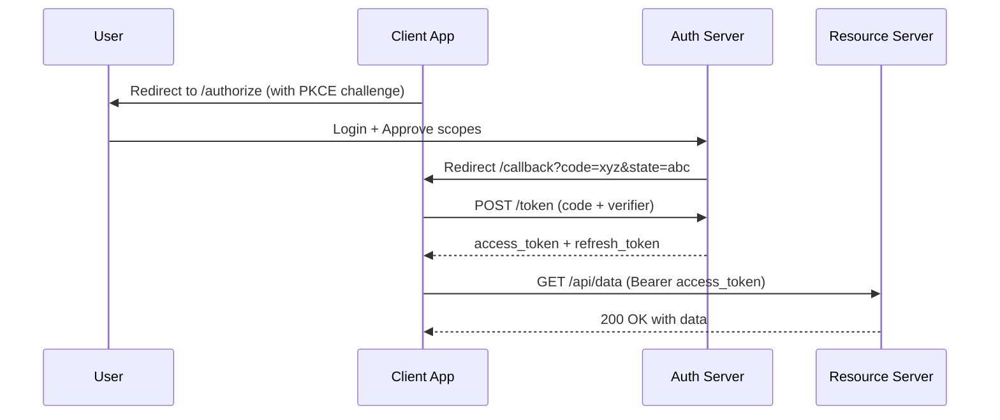

⚡ TL;DR - OAuth 2.0 is a delegation protocol: a user
grants a third-party application limited access to their
resources without sharing their password. Four flows
cover different client types; Authorization Code + PKCE
is the modern standard for user-facing apps; Client
Credentials is for machine-to-machine; Implicit and
Resource Owner Password flows are deprecated.

---

| #024 | Category: HTTP & APIs | Difficulty: ★★★ |
|:---|:---|:---|
| **Depends on:** | Authentication Schemes, JWT | |
| **Used by:** | OAuth 2.0 Security Best Practices, OWASP API Top 10 | |
| **Related:** | JWT, API Key Auth, Authentication Schemes | |

---

### 🔥 The Problem This Solves

**WORLD WITHOUT IT:**
Before OAuth: "Login with Google" meant you typed your
Google password into a third-party app. The app sent
your password to Google. The app stored your password.
If the app was compromised, Google had your password.
If you wanted to revoke access, you had to change your
Google password (revoking all apps simultaneously).
No granularity, no revocation, total credential exposure.

**THE BREAKING POINT:**
The rise of platform APIs (Twitter, Facebook, Google)
required delegation without credential sharing. A mobile
app needed to post tweets on your behalf. A calendar app
needed to read your Google Calendar. These apps cannot
be trusted with your full account credentials.

**THE INVENTION MOMENT:**
OAuth 2.0 (RFC 6749, 2012) separates authentication
("who are you") from authorization ("what can this app
do on your behalf"). The user authenticates with the
authorization server (Google, GitHub, your own IdP).
The authorization server issues a scoped, short-lived
access token to the third-party app. The app uses the
token, not the password. The token can be revoked without
changing the password.

---

### 📘 Textbook Definition

OAuth 2.0 (RFC 6749) is an authorization framework that
enables third-party applications to obtain limited access
to HTTP services on behalf of a resource owner. Key roles:
**Resource Owner** (user), **Client** (third-party app),
**Authorization Server** (issues tokens; e.g., Google
Identity), **Resource Server** (API using tokens; e.g.,
Google Contacts API). Four grant types: **Authorization
Code** (server-side apps), **Authorization Code + PKCE**
(SPAs, mobile; modern standard), **Client Credentials**
(machine-to-machine), **Device Code** (TVs, CLI tools).
The **Implicit** and **Resource Owner Password Credentials**
flows are deprecated in OAuth 2.1.

---

### ⏱️ Understand It in 30 Seconds

**One line:**
OAuth lets a user say "this app can read my emails for
the next hour" without giving the app their email password.

**One analogy:**
> OAuth is a hotel valet key. Your car (resource) has
> a master key (your password) that opens everything.
> The valet key (OAuth token) only starts the engine
> and opens the driver door - it cannot open the trunk
> or the glove box. You can take the valet key back
> without changing the master key. You give it only
> to the valet (third-party app), not to strangers.

**One insight:**
OAuth 2.0 is an AUTHORIZATION framework, not an
authentication protocol. It answers "can this app access
this resource?" not "who is this user?" OpenID Connect
(OIDC) extends OAuth 2.0 with identity: it adds the
`id_token` (a JWT about the user) to answer "who is this?"
Using OAuth tokens alone for login is an anti-pattern.

---

### 🔩 First Principles Explanation

**FOUR FLOWS - WHEN TO USE WHICH:**

**1. Authorization Code + PKCE (modern standard):**
```
For: SPAs, mobile apps, any public client
     (where client secret cannot be kept secret)

Flow:
  1. App generates code_verifier (random 43-128 chars)
     and code_challenge = SHA256(code_verifier)
  2. Redirect user to:
     /authorize?response_type=code
       &client_id=app123
       &redirect_uri=https://app/callback
       &scope=read:email
       &state=random_csrf_token
       &code_challenge=base64url(SHA256(verifier))
       &code_challenge_method=S256
  3. User logs in at auth server, approves
  4. Auth server redirects to callback with ?code=...&state=...
  5. App verifies state matches; exchanges code:
     POST /token
     code=..., code_verifier=..., grant_type=authorization_code
  6. Gets: access_token, refresh_token, id_token
```

**Why PKCE?**
```
Without PKCE: authorization code can be stolen by
malicious app on same device (URL scheme hijack)
With PKCE: code alone is useless without code_verifier;
attacker cannot exchange the code
```

**2. Client Credentials (machine-to-machine):**
```
For: server-to-server; no user involved;
     service A calls service B

POST /token
  grant_type=client_credentials
  client_id=service-a
  client_secret=secret
  scope=data:read

Response: {"access_token":"...", "expires_in":3600}
```

**3. Device Code (TV, CLI):**
```
For: devices without browser (smart TV, IoT, CLI)

1. Device: POST /device/code → device_code, user_code
2. Device: shows user_code + verification_uri to user
3. User: visits verification_uri on phone/laptop,
         enters user_code, approves
4. Device: polls POST /token until user approves
5. Device: receives access_token
```

**DEPRECATED (avoid):**
- **Implicit**: access token in URL fragment; no refresh
  token; replaced by Auth Code + PKCE
- **Resource Owner Password**: user gives credentials
  directly to client app; defeats OAuth's purpose;
  forbidden in OAuth 2.1

---

### 🧪 Thought Experiment

**SCENARIO: GitHub OAuth App**

A CI/CD tool needs to read your GitHub repos.

**WITHOUT OAUTH:**
- You give the CI tool your GitHub password
- CI tool stores your password
- CI tool can do anything with your account (delete repos)
- If CI tool is hacked, your GitHub is compromised
- Revocation requires changing your GitHub password

**WITH OAUTH (Auth Code + PKCE):**
- CI tool redirects to GitHub OAuth
- You authorize scope `repo:read` only
- GitHub issues short-lived token scoped to `repo:read`
- CI tool stores the token (not your password)
- If token leaked: attacker can only read repos, not write
- Revocation: delete token in GitHub settings, no
  password change needed

---

### 🧠 Mental Model / Analogy

> OAuth is a power of attorney system. You grant limited
> authority to an agent (third-party app) to act on your
> behalf for specific actions (scopes) for a limited time
> (token expiry). The authorization server is the notary
> who certifies the power of attorney. The resource server
> honors the certified document without needing to call you.
>
> The key properties:
> - Scoped: agent can only do what you authorized
> - Time-limited: the document expires
> - Revocable: you can revoke it at any time
> - No password sharing: the notary (auth server)
>   handles authentication

---

### 📶 Gradual Depth - Five Levels

**Level 1 - What it is (anyone can understand):**
OAuth lets you say to a website "you can read my Google
Contacts for the next hour" without giving the website
your Google password. The website gets a temporary key
that only opens the door you said it could open.

**Level 2 - How to use it (junior developer):**
For a web app that needs to sign in users with Google:
use Authorization Code + PKCE. Use a battle-tested
library (python-oauthlib, Spring Security OAuth, Passport.js).
For a backend service calling another service: use Client
Credentials. Never implement the Implicit or Password flows.

**Level 3 - How it works (mid-level engineer):**
Auth Code + PKCE flow: generate state (CSRF token) and
PKCE challenge. Redirect to auth server. Handle callback:
validate state, exchange code + verifier for tokens.
Store access token (short-lived) and refresh token
(long-lived, httpOnly cookie or secure storage). On
expiry, use refresh token to get new access token.
Refresh token rotation: each use invalidates the old
refresh token and issues a new one.

**Level 4 - Why it was designed this way (senior/staff):**
Authorization Code flow uses a short-lived code that is
exchanged for a token server-side. This ensures the token
is never in the browser URL (unlike Implicit). PKCE
replaces client_secret for public clients: a client secret
in a mobile app or SPA is not secret (anyone can extract
it from the app). PKCE binds the token exchange to the
originating request using a cryptographic verifier that
was never transmitted before the exchange. The state
parameter is a CSRF token: prevents attackers from
crafting a redirect to steal the code.

**Level 5 - Mastery (distinguished engineer):**
OAuth 2.0 is a framework (not a protocol), and this
flexibility is its strength and its danger. The spec
allows unsafe configurations: Implicit flow, ROPC flow,
missing state parameter, open redirects in redirect_uri.
OAuth 2.1 (draft) codifies best practices into the spec
itself: PKCE required, Implicit deprecated, ROPC
deprecated, redirect_uri exact match required. Production
OAuth: (1) validate redirect_uri exactly against a
registered allowlist (open redirect attack vector);
(2) use refresh token rotation (detect theft if old
refresh token is used); (3) short access token expiry
(15 min) + longer refresh token expiry (30 days with
activity); (4) PKCE for all public clients; (5) store
refresh tokens in httpOnly cookies (not localStorage).

---

### ⚙️ How It Works (Mechanism)

**Authorization Code + PKCE:**

```
CLIENT                  AUTH SERVER         RESOURCE SERVER

Generate:
  verifier = random(32 bytes)
  challenge = b64url(SHA256(verifier))
  state = random(16 bytes)

  ─────── GET /authorize?code_challenge=..
          &state=...&scope=read ──────────>
                  [User logs in, approves]
  <──── redirect to /callback?code=...&state=... ─────

Validate state. Exchange code:
  ─────── POST /token (code, verifier) ───>
  <────── {access_token, refresh_token} ──

  ─────── GET /api/data
          Authorization: Bearer access_token ──────────>
  <──────────── 200 OK with data ─────────────────────
```



---

### 🔄 The Complete Picture - End-to-End Flow

**Client Credentials for service-to-service:**

```python
import httpx
import time

class ServiceCredentials:
    """Token cache for client_credentials flow."""
    def __init__(self, token_url, client_id, secret):
        self.token_url = token_url
        self.client_id = client_id
        self.secret = secret
        self._token = None
        self._expires_at = 0

    def get_token(self):
        if time.time() < self._expires_at - 30:
            return self._token  # still fresh
        resp = httpx.post(
            self.token_url,
            data={
                "grant_type": "client_credentials",
                "client_id": self.client_id,
                "client_secret": self.secret,
                "scope": "inventory:read"
            }
        )
        resp.raise_for_status()
        data = resp.json()
        self._token = data["access_token"]
        self._expires_at = time.time() + data["expires_in"]
        return self._token

creds = ServiceCredentials(
    "https://auth.example.com/token",
    "inventory-service",
    "secret"
)

resp = httpx.get(
    "https://api.example.com/inventory",
    headers={"Authorization": f"Bearer {creds.get_token()}"}
)
```

---

### 💻 Code Example

**Example 1 - BAD: Implicit Flow (deprecated)**

```javascript
// BAD: Implicit flow - access token in URL fragment
// URL: /callback#access_token=eyJ...&token_type=bearer
// Token in browser history, server logs, Referer headers
// No refresh token; cannot revoke; deprecated in OAuth 2.1
const params = new URLSearchParams(
  window.location.hash.substring(1)
);
const token = params.get("access_token"); // AVOID

// GOOD: Authorization Code + PKCE (no token in URL)
// Token is exchanged server-side; never in URL
const { code, state } = getQueryParams();
const tokens = await exchangeCodeForTokens(code, verifier);
```

---

**Example 2 - PKCE verifier and challenge generation**

```python
import secrets, hashlib, base64

def generate_pkce():
    """Generate PKCE code_verifier and code_challenge."""
    # RFC 7636: verifier must be 43-128 chars,
    # unreserved characters
    verifier = base64.urlsafe_b64encode(
        secrets.token_bytes(32)
    ).rstrip(b"=").decode()

    # challenge = BASE64URL(SHA256(verifier))
    digest = hashlib.sha256(verifier.encode()).digest()
    challenge = base64.urlsafe_b64encode(
        digest
    ).rstrip(b"=").decode()

    return verifier, challenge

verifier, challenge = generate_pkce()
# verifier: 43-char string (sent only at token exchange)
# challenge: 43-char SHA256 hash (sent in /authorize URL)
```

---

**Example 3 - Validate state parameter to prevent CSRF**

```python
import secrets
from flask import session, request, abort

@app.route("/login")
def login():
    state = secrets.token_urlsafe(16)
    session["oauth_state"] = state
    # Include state in authorization URL
    return redirect(
        f"{AUTH_URL}?state={state}&..."
    )

@app.route("/callback")
def callback():
    returned_state = request.args.get("state")
    expected_state = session.pop("oauth_state", None)

    # CSRF check: state must match what we sent
    if not returned_state or returned_state != expected_state:
        abort(400, "State mismatch: CSRF attempt")

    code = request.args.get("code")
    # Exchange code for tokens
    tokens = exchange_code(code, verifier)
    return redirect("/dashboard")
```

---

### ⚖️ Comparison Table

| Flow | Client Type | User Involved | Secret Required | Status |
|:---|:---|:---|:---|:---|
| Auth Code + PKCE | SPA, Mobile, Web | Yes | No (PKCE replaces) | Current standard |
| Client Credentials | Server-to-server | No | Yes | Current standard |
| Device Code | TV, CLI, IoT | Yes | No | Current standard |
| Auth Code (no PKCE) | Confidential web app | Yes | Yes | Acceptable for server-side |
| Implicit | SPA (old) | Yes | No | Deprecated (OAuth 2.1) |
| ROPC (Password) | First-party only | Yes | Yes | Deprecated (OAuth 2.1) |

---

### ⚠️ Common Misconceptions

| Misconception | Reality |
|:---|:---|
| OAuth is an authentication protocol | OAuth is an AUTHORIZATION framework. It does not prove who the user is. OpenID Connect (OIDC) extends OAuth with authentication via the `id_token`. Using an OAuth access token for login = anti-pattern. |
| Client Credentials is for users | Client Credentials is for machine-to-machine (no user). If a user is involved, use Authorization Code + PKCE. |
| PKCE replaces client_secret for confidential clients | PKCE is for public clients (SPA, mobile) where a secret cannot be kept secret. Confidential server-side clients still use client_secret AND can optionally use PKCE for defense in depth. |
| Implicit flow is simpler so it is fine for SPAs | Implicit flow is deprecated (OAuth 2.1) because tokens end up in browser history and Referer headers. Auth Code + PKCE is equally simple with modern libraries and significantly more secure. |

---

### 🚨 Failure Modes & Diagnosis

**Open redirect attack via redirect_uri manipulation**

**Symptom:** Attacker redirects victim's authorization
code to attacker's server.

**Root Cause:** Server validates redirect_uri with
prefix match or wildcard, not exact match. Attacker
registers `https://legit.example.com.evil.com/cb`.

**Diagnostic:**
```bash
# Test open redirect: craft URL with attacker redirect_uri
curl -I "https://auth.example.com/authorize\
?redirect_uri=https://evil.com/steal&client_id=app"
# If redirects to evil.com: VULNERABLE
# Should: 400 Bad Request (not registered redirect_uri)
```

**Fix:** Exact-match redirect_uri against registered list.
Never use prefix match or wildcard.

---

**Refresh token theft - token reuse attack**

**Symptom:** User receives "session expired" even though
they did not log out. Attacker is using a stolen refresh
token.

**Root Cause:** Refresh token stolen (XSS, network
interception). No rotation or rotation not enforced.

**Fix:** Implement refresh token rotation: each use
invalidates the old token and issues a new one. If an
old token is presented again (used once, reused =
stolen), revoke the entire token family. Alert the user.

---

### 🔗 Related Keywords

**Prerequisites (understand these first):**
- `Authentication Schemes` - Bearer token is how OAuth
  access tokens are sent
- `JWT` - OAuth often issues JWT access tokens

**Builds On This (learn these next):**
- `OAuth 2.0 Security Best Practices` - PKCE, state,
  redirect_uri, refresh rotation in depth
- `JWT Security` - access tokens are often JWTs with
  their own security requirements

---

### 📌 Quick Reference Card

```
┌──────────────────────────────────────────────────────────┐
│ WHAT IT IS   │ Authorization framework: delegate limited │
│              │ resource access without sharing passwords │
├──────────────┼───────────────────────────────────────────┤
│ PROBLEM IT   │ Third-party apps needed access to user    │
│ SOLVES       │ resources without holding user passwords  │
├──────────────┼───────────────────────────────────────────┤
│ KEY INSIGHT  │ OAuth is AUTHORIZATION (can this app act  │
│              │ on your behalf?), not AUTHENTICATION      │
│              │ (who are you?). Use OIDC for login.       │
├──────────────┼───────────────────────────────────────────┤
│ USE WHEN     │ User apps: Auth Code + PKCE               │
│              │ Machine-to-machine: Client Credentials    │
├──────────────┼───────────────────────────────────────────┤
│ AVOID        │ Implicit flow (deprecated)                │
│ PATTERNS     │ Resource Owner Password (deprecated)      │
│              │ prefix/wildcard redirect_uri matching     │
├──────────────┼───────────────────────────────────────────┤
│ SECURITY     │ Exact redirect_uri match; state for CSRF; │
│ RULES        │ PKCE for public clients; refresh rotation │
├──────────────┼───────────────────────────────────────────┤
│ TRADE-OFF    │ Complexity (multi-step flow) vs security  │
│              │ (no password sharing, scoped access)      │
├──────────────┼───────────────────────────────────────────┤
│ ONE-LINER    │ "Valet key: opens the engine only,        │
│              │ not the trunk."                           │
├──────────────┼───────────────────────────────────────────┤
│ NEXT EXPLORE │ OAuth 2.0 Security → JWT Security         │
└──────────────────────────────────────────────────────────┘
```

**If you remember only 3 things:**
1. OAuth 2.0 is AUTHORIZATION, not authentication. Use
   OpenID Connect (OIDC) for identity. Using an OAuth
   token for "who is logged in" is a security anti-pattern.
2. Authorization Code + PKCE is the modern standard for
   any user-facing app. Implicit and ROPC flows are
   deprecated.
3. Always validate redirect_uri with exact match. Prefix
   or wildcard matching enables open redirect attacks
   that steal authorization codes.

---

### 💎 Transferable Wisdom

**Reusable Engineering Principle:**
OAuth is an example of the "principle of least privilege"
applied to API access: scopes ensure apps get exactly
the access they need, nothing more. The same principle
applies to: AWS IAM policies (least privilege), SQL
row-level security (user sees only their rows), Kubernetes
RBAC (service account can only list pods, not delete).
The design question is always: what is the minimum
privilege needed for this use case?

**Where else this pattern applies:**
- AWS STS AssumeRole: temporary scoped credentials
  (same delegation model as OAuth)
- Google Workload Identity Federation: OAuth-style
  credential delegation for cloud workloads
- Kubernetes service account tokens: scoped access
  within a cluster

---

### 💡 The Surprising Truth

OAuth 2.0 has no single "OAuth 2.0 implementation" -
it is a framework with multiple flows and many optional
features. Two systems can both claim "OAuth 2.0 compliance"
and be completely incompatible. Google's OAuth, GitHub's
OAuth, and Salesforce's OAuth all behave differently in
subtle ways (different token endpoint behavior, different
scope handling, different error codes). This is why
OpenID Connect (OIDC) exists: it specifies a concrete
protocol on top of OAuth 2.0 with standardized discovery
(`.well-known/openid-configuration`), standard claims,
and standard ID token format - making interoperability
possible.

---

### ✅ Mastery Checklist

**You've mastered this when you can:**
1. **CHOOSE** Select the correct OAuth 2.0 flow for:
   (a) user login in a React SPA, (b) service-to-service
   API call, (c) CLI tool requiring user authorization.
2. **IMPLEMENT** Generate PKCE verifier and challenge;
   validate the state parameter in the callback; exchange
   code + verifier for tokens.
3. **EXPLAIN** Why OAuth is authorization and not
   authentication, and how OIDC extends OAuth for login.
4. **DIAGNOSE** Identify the open redirect vulnerability
   in redirect_uri validation and specify the fix.
5. **COMPARE** Explain refresh token rotation and how
   it detects token theft.

---

### 🎯 Interview Deep-Dive

**Q1: Explain the OAuth 2.0 Authorization Code + PKCE flow.**

*Why they ask:* Most common OAuth question. Tests
end-to-end flow knowledge.

*Strong answer includes:*
- Client generates verifier (random) and challenge
  (SHA256 of verifier).
- Redirects user to auth server with challenge + state.
- User authenticates, approves scopes.
- Auth server redirects to callback with authorization code.
- Client validates state (CSRF check).
- Client exchanges code + verifier for tokens.
- Auth server verifies that SHA256(verifier) matches
  stored challenge → only the originating client can
  exchange the code.
- Returns access_token (short-lived) and refresh_token.

**Q2: What is PKCE and why does it exist?**

*Why they ask:* Tests understanding of why classic
Auth Code flow was insufficient for public clients.

*Strong answer includes:*
- Problem: SPA/mobile apps cannot keep client_secret
  secret (it is in the code bundle or APK, extractable).
- Classic Auth Code uses client_secret at token exchange
  to prove the requester is the legitimate client.
- PKCE alternative: bind the token exchange to the
  original authorization request using a one-time
  cryptographic challenge, without needing a secret
  that persists in the app.
- Specifically: code_verifier is generated per-request,
  never stored beyond one exchange; challenge is derived
  via SHA256 (one-way); attacker who intercepts the code
  cannot exchange it without the verifier.

**Q3: Distinguish OAuth 2.0 from OpenID Connect.**

*Why they ask:* Common confusion; tests precise knowledge.

*Strong answer includes:*
- OAuth 2.0: authorization framework. Answers "can app
  access resource X on behalf of user?" Returns
  access_token (for resource servers).
- OpenID Connect: authentication layer on top of OAuth 2.0.
  Answers "who is this user?" Returns id_token (JWT with
  user identity claims: sub, email, name).
- Using OAuth access token for login = anti-pattern:
  access token is for resource access, not identity
  proof. Attacker can obtain a valid access token for
  your service via a different mechanism.
- OIDC adds: /userinfo endpoint, standard claims (sub,
  email, profile), discovery endpoint
  (/.well-known/openid-configuration).
