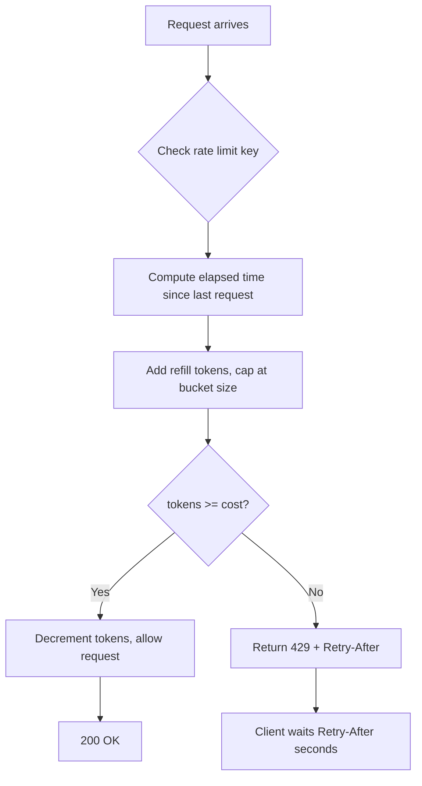

⚡ TL;DR - API rate limiting controls how many requests
a client can make in a time window, protecting the server
from overload and abuse; the four main algorithms are
Fixed Window, Sliding Window, Token Bucket, and Leaky
Bucket - each with different burst tolerance and fairness
trade-offs; `429 Too Many Requests` is the response, with
`Retry-After` telling the client when to try again.

---

| #025 | Category: HTTP & APIs | Difficulty: ★★☆ |
|:---|:---|:---|
| **Depends on:** | HTTP Status Codes, HTTP Request/Response | |
| **Used by:** | API Throttling and Quota, API Gateway Rate Limiting | |
| **Related:** | HTTP Caching, API Retry and Backoff, Circuit Breaker | |

---

### 🔥 The Problem This Solves

**WORLD WITHOUT IT:**
An API without rate limiting is open to: (1) accidental
client bugs (infinite retry loops hitting your server
100x/second), (2) intentional abuse (credential stuffing,
scraping, DDoS), (3) noisy neighbor (one client consuming
all available capacity, starving other clients), (4) cost
amplification (API calls triggering expensive downstream
operations - ML inference, database queries).

**THE BREAKING POINT:**
Twitter's early API had no rate limiting. Bot operators
wrote scripts that polled every endpoint continuously.
During high-profile events, third-party apps overwhelmed
the API. The Fail Whale (HTTP 503 page) became iconic.
Rate limiting was introduced in 2009 and became a
fundamental design requirement for public APIs.

**THE INVENTION MOMENT:**
Rate limiting is not one algorithm - it is a family of
algorithms with different properties. The choice matters:
Fixed Window is simplest but allows burst attacks at
window boundaries. Sliding Window is smoother but more
expensive. Token Bucket allows controlled bursting.
Leaky Bucket enforces constant output rate. Each solves
a different version of the problem.

---

### 📘 Textbook Definition

API rate limiting restricts the number of requests a
client can make within a defined time window. The
identifying unit is typically a client identifier:
API key, user ID, IP address, or OAuth client ID.
When the limit is exceeded, the server returns `429 Too
Many Requests` with `Retry-After` (seconds to wait) or
`X-RateLimit-Reset` (Unix timestamp of window reset).
Four algorithms: **Fixed Window** (count per fixed period,
simple), **Sliding Window** (count over a rolling period,
smoother), **Token Bucket** (token refill rate, allows
burst), **Leaky Bucket** (constant drain rate, no burst).
Rate limits can be applied at different granularities:
per IP, per API key, per user, per endpoint, per service.

---

### ⏱️ Understand It in 30 Seconds

**One line:**
Rate limiting says "you get N requests per time window;
exceed it and you get `429 Too Many Requests` until the
window resets."

**One analogy:**
> Rate limiting is like a tollbooth with a prepaid card.
> Your card allows 100 trips per day. Once used, the
> gate stays closed until midnight (window reset).
> Token Bucket variant: unused trips accumulate (up to
> a burst limit), so steady low-traffic users can
> occasionally burst.

**One insight:**
The `Retry-After` response header is as important as
the `429` itself. Without it, well-behaved clients must
guess when to retry. Clients that exponentially backoff
without `Retry-After` create burst storms when all
clients retry simultaneously after the same window resets.

---

### 🔩 First Principles Explanation

**FOUR ALGORITHMS:**

**1. Fixed Window:**
```
Window: 1 minute, Limit: 100 requests

00:00 → counter = 0
00:01 → request 1: counter = 1
...
00:30 → request 100: counter = 100
00:31 → request 101: counter = 100 → 429
01:00 → counter resets to 0 (new window)

PROBLEM: "double burst" at window boundary
  00:59 → 100 requests (end of window 1)
  01:00 → 100 requests (start of window 2)
  = 200 requests in 2 seconds, despite "100/min" limit
```

**2. Sliding Window:**
```
Window: 1 minute, Limit: 100 requests

At 00:45: count requests from 00:45-01:45 (rolling)
→ No double burst at boundaries
→ More expensive: store timestamps of each request
   or use a pre-computed sliding sum
```

**3. Token Bucket:**
```
Bucket: 100 tokens, Refill: 10 tokens/second

Request arrives: consume 1 token
No tokens: 429
Tokens refill continuously at rate
→ Allows burst up to bucket size
→ Steady-state rate: refill rate (10 req/s)

Redis implementation:
  DECR tokens_<client>
  (background refill job or computed on read)
```

**4. Leaky Bucket:**
```
Queue with constant drain rate
Requests enqueue; processing at fixed rate
Queue full → 429

→ Constant output regardless of input burst
→ Used for smoothing request rates to downstream
→ Less common for API rate limiting; more for
  traffic shaping
```

**RESPONSE HEADERS:**
```
HTTP/1.1 429 Too Many Requests
X-RateLimit-Limit: 100
X-RateLimit-Remaining: 0
X-RateLimit-Reset: 1706000060  (Unix timestamp)
Retry-After: 47               (seconds to wait)
```

---

### 🧪 Thought Experiment

**SCENARIO: GitHub API rate limits**

GitHub API limits:
- Unauthenticated: 60 requests/hour per IP
- Authenticated: 5,000 requests/hour per user
- Search API: 10 requests/minute

**Why different limits?**
- IP-based limit for unauthenticated: can identify
  clients but not users; lower limit to prevent scraping
- User-based limit for authenticated: credit specific
  user; higher limit enables real use cases
- Endpoint-specific limit for Search: Search is 10x
  more expensive than regular API; different resource

**What happens at 5,000 req/hour?**
- 429 with `X-RateLimit-Remaining: 0`
- `X-RateLimit-Reset: <next_hour_timestamp>`
- Smart GitHub clients cache `X-RateLimit-Remaining`
  and delay requests proactively before hitting 429

**BURST PATTERN ANALYSIS:**
- Fixed Window: CI jobs starting on the hour → burst storm
- Token Bucket: CI jobs spread across the hour → graceful

---

### 🧠 Mental Model / Analogy

> Token Bucket is like a frequent flyer miles account.
> Miles accumulate at a constant rate. You can spend
> more miles on one flight (burst) if you have saved up.
> The bucket has a maximum (you cannot accumulate
> unlimited miles - there is a cap). Small frequent
> trips spend as you go. Big trips require saving up.
> The airline (server) defines how fast miles accumulate
> and the bucket size (burst limit).

> Fixed Window is like a monthly cell phone data plan.
> 10GB/month. Use 5GB on day 1 → you have used half
> for the entire month. On the 1st of next month,
> the counter resets. A cellular attack: use 10GB in
> the last minutes of month 1, then 10GB in the first
> minutes of month 2 = 20GB in 2 minutes.

---

### 📶 Gradual Depth - Five Levels

**Level 1 - What it is (anyone can understand):**
Rate limiting is a speed limit for API calls. Instead
of miles per hour, it is requests per minute. Go over
the limit, the server says "slow down" (429 Too Many
Requests) and tells you how long to wait.

**Level 2 - How to use it (junior developer):**
When your API returns 429, wait the number of seconds
in `Retry-After` before retrying. Cache the
`X-RateLimit-Remaining` header and proactively slow
down before hitting the limit. Use exponential backoff
with jitter if `Retry-After` is not provided.

**Level 3 - How it works (mid-level engineer):**
Implement with Redis. Fixed Window: `INCR rate:key`
with `EXPIRE` if new key. Check value against limit.
Token Bucket: store last-refill timestamp + current
tokens; on each request, compute elapsed time, add
refill tokens, subtract 1, cap at bucket size. Sliding
Window: use a sorted set of timestamps (ZADD), remove
expired entries, count remaining, check against limit.

**Level 4 - Why it was designed this way (senior/staff):**
Rate limiting granularity is a business decision:
per-IP limits stop anonymous abuse but punish shared
NAT (entire office gets one limit). Per-user/key limits
are fair but require authentication. Per-endpoint limits
address differential resource cost. At scale, local rate
limiting (per server) is inconsistent (one server may
have a different count than another). Centralized rate
limiting (Redis) is consistent but adds a network hop.
Approximate distributed rate limiting (each server tracks
locally, sync periodically) is a trade-off.

**Level 5 - Mastery (distinguished engineer):**
Stripe's rate limiting design: per-customer rate limits
with Token Bucket, implemented in Redis with Lua scripts
for atomicity. Lua script runs `EVAL` so the read-modify-
write is atomic (no race condition between check and
decrement). Rate limits are tiered: start at a base
limit, elevated for trusted API keys. Burst handling:
if a customer has a legitimate burst need (Black Friday),
they can request temporary limit elevation. The limit
increase is scoped (hours, not permanent). Key insight:
rate limits are both a security control (abuse) and
a capacity guarantee (SLA). Design for both.

---

### ⚙️ How It Works (Mechanism)

**Token Bucket in Redis with Lua (atomic):**

```lua
-- rate_limit.lua
-- KEYS[1]: key (e.g., "rate:user:123")
-- ARGV[1]: bucket_capacity
-- ARGV[2]: refill_rate (tokens per second)
-- ARGV[3]: current_time (Unix seconds)
-- ARGV[4]: cost (tokens this request consumes)

local key = KEYS[1]
local capacity = tonumber(ARGV[1])
local rate = tonumber(ARGV[2])
local now = tonumber(ARGV[3])
local cost = tonumber(ARGV[4])

local data = redis.call("HMGET", key, "tokens", "ts")
local tokens = tonumber(data[1]) or capacity
local ts = tonumber(data[2]) or now

-- Compute refilled tokens since last request
local elapsed = math.max(0, now - ts)
tokens = math.min(capacity, tokens + (elapsed * rate))

if tokens < cost then
    -- Insufficient tokens: compute wait time
    local wait = math.ceil((cost - tokens) / rate)
    return {0, wait}  -- denied, retry after wait seconds
end

tokens = tokens - cost
redis.call("HMSET", key, "tokens", tokens, "ts", now)
redis.call("EXPIRE", key, math.ceil(capacity / rate) + 1)
return {1, 0}  -- allowed, no wait
```



---

### 🔄 The Complete Picture - End-to-End Flow

**Rate limit middleware in FastAPI:**

```python
from fastapi import FastAPI, Request
from fastapi.responses import JSONResponse
import redis.asyncio as aioredis
import time

app = FastAPI()
redis_client = aioredis.from_url("redis://localhost")

RATE_LIMIT_SCRIPT = """..."""  # Lua script from above

async def check_rate_limit(
    client_id: str,
    capacity: int = 100,
    rate: float = 1.0  # tokens/second
) -> tuple[bool, int]:
    """Returns (allowed, retry_after_seconds)."""
    result = await redis_client.eval(
        RATE_LIMIT_SCRIPT,
        1,  # number of keys
        f"rate:{client_id}",
        capacity,
        rate,
        int(time.time()),
        1  # cost per request
    )
    return bool(result[0]), result[1]

@app.middleware("http")
async def rate_limit_middleware(request: Request, call_next):
    # Identify client: prefer API key, fall back to IP
    client_id = (
        request.headers.get("X-Api-Key")
        or request.client.host
    )
    allowed, retry_after = await check_rate_limit(
        client_id
    )
    if not allowed:
        return JSONResponse(
            status_code=429,
            content={"error": "rate_limit_exceeded"},
            headers={
                "Retry-After": str(retry_after),
                "X-RateLimit-Limit": "100",
                "X-RateLimit-Remaining": "0"
            }
        )
    response = await call_next(request)
    return response
```

---

### 💻 Code Example

**Example 1 - BAD: Fixed Window race condition**

```python
# BAD: non-atomic check-then-set (race condition)
def check_rate_limit_bad(key, limit, window):
    count = redis.get(key) or 0   # READ
    if int(count) >= limit:
        return False
    redis.incr(key)               # WRITE
    redis.expire(key, window)
    # RACE: two requests can both pass the check
    # before either increments the counter
    return True

# GOOD: atomic increment with Lua or pipeline
def check_rate_limit_good(key, limit, window):
    with redis.pipeline() as pipe:
        pipe.incr(key)
        pipe.expire(key, window)
        result = pipe.execute()
    count = result[0]
    if count == 1:
        # First request in this window: TTL already set
        pass
    return count <= limit
```

---

**Example 2 - Client-side: respect Retry-After**

```python
import requests, time

def api_call_with_rate_limit(url, headers, max_retries=3):
    for attempt in range(max_retries):
        resp = requests.get(url, headers=headers)
        if resp.status_code == 429:
            retry_after = int(
                resp.headers.get("Retry-After", 60)
            )
            # Add 1s buffer; real systems add jitter
            time.sleep(retry_after + 1)
            continue
        resp.raise_for_status()
        return resp.json()
    raise Exception("Rate limit exceeded, max retries hit")
```

---

**Example 3 - Observability: log and alert on rate limiting**

```bash
# Check rate limit 429 rate in nginx logs
awk '$9 == "429"' /var/log/nginx/access.log | \
  awk '{print $7}' | sort | uniq -c | sort -rn | head -10
# Top endpoints hitting 429 - identifies abuse or bugs

# Alert if 429 rate > 5% of total requests
total=$(awk 'END{print NR}' /var/log/nginx/access.log)
rate=$(awk '$9 == "429"' /var/log/nginx/access.log | wc -l)
echo "scale=2; $rate / $total * 100" | bc
# > 5.00 → alert
```

---

### ⚖️ Comparison Table

| Algorithm | Burst Allowed | Implementation | Fairness at Boundary |
|:---|:---|:---|:---|
| Fixed Window | Yes (2x at boundary) | Simplest (INCR + EXPIRE) | Poor |
| Sliding Window | No burst at boundary | Moderate (sorted set) | Good |
| Token Bucket | Yes (controlled) | Moderate (HMSET + Lua) | Good |
| Leaky Bucket | No (queue drains at fixed rate) | Complex | Excellent |

---

### ⚠️ Common Misconceptions

| Misconception | Reality |
|:---|:---|
| Rate limiting protects only from DDoS | Rate limiting protects from: DDoS, accidental bugs (infinite loops), noisy neighbors, credential stuffing, scraping. It is as much about fairness and availability as security. |
| Per-IP rate limiting is sufficient | NAT means thousands of users can share one IP (corporate office, university). Per-IP limits can unfairly block legitimate users sharing an IP. API key or user-ID rate limiting is fairer. |
| 429 responses should not include body | RFC 6585 recommends including a human-readable explanation and `Retry-After`. Well-designed 429 responses enable clients to handle rate limits gracefully. |
| Fixed Window is always bad | Fixed Window is acceptable for many use cases. The double-burst problem only matters when attackers deliberately exploit it. For most legitimate use cases, Fixed Window is simpler and sufficient. |

---

### 🚨 Failure Modes & Diagnosis

**Thundering herd at window reset**

**Symptom:** Massive spike in requests at window reset
time (e.g., top of each minute). Server CPU spikes
periodically.

**Root Cause:** Fixed Window rate limiting. All clients
that hit the limit wait for window reset. When window
resets, all retry simultaneously.

**Diagnostic:**
```bash
# Check request rate over time
awk '{print $4}' /var/log/nginx/access.log | \
  cut -d: -f2,3 | sort | uniq -c
# Pattern: low rate, spike at :00, low, spike at :01 etc
```

**Fix:**
1. Switch to Token Bucket (spread out recovery)
2. Add jitter to `Retry-After` (randomize reset time)
3. Return `Retry-After: <random_within_window>` instead
   of exact reset time

---

**Rate limit state lost (Redis restart)**

**Symptom:** After Redis restart or failover, rate limits
are reset. Brief window of unlimited requests.

**Root Cause:** Rate limit state lives only in Redis memory.
Restart clears all keys.

**Fix:**
1. Redis persistence (AOF) to recover state after restart
2. Short window rate limits (1 min) accept brief state loss
3. Redis Sentinel/Cluster for HA (no single-node restarts)
4. Design rate limit to "fail open" briefly rather than
   block all traffic during Redis unavailability

---

### 🔗 Related Keywords

**Prerequisites (understand these first):**
- `HTTP Status Codes` - 429 is the rate limit response
- `HTTP Request and Response` - `Retry-After` and
  `X-RateLimit-*` headers

**Builds On This (learn these next):**
- `API Throttling and Quota` - per-plan quota management
- `API Gateway Rate Limiting` - rate limiting at the
  gateway layer
- `API Retry and Backoff` - client-side response to 429

---

### 📌 Quick Reference Card

```
┌──────────────────────────────────────────────────────────┐
│ WHAT IT IS   │ Controls requests per time window;        │
│              │ 429 on excess with Retry-After            │
├──────────────┼───────────────────────────────────────────┤
│ PROBLEM IT   │ Abuse, noisy neighbors, accidental bugs,  │
│ SOLVES       │ DDoS, cost amplification                  │
├──────────────┼───────────────────────────────────────────┤
│ KEY INSIGHT  │ Retry-After is as important as 429.       │
│              │ Without it, clients guess and create      │
│              │ thundering herd storms.                   │
├──────────────┼───────────────────────────────────────────┤
│ USE WHEN     │ Any API that can be called repeatedly,    │
│              │ especially public or partner APIs         │
├──────────────┼───────────────────────────────────────────┤
│ ALGORITHMS   │ Fixed Window: simple; Sliding Window:     │
│              │ smooth; Token Bucket: burst-friendly;     │
│              │ Leaky Bucket: constant rate              │
├──────────────┼───────────────────────────────────────────┤
│ ANTI-PATTERN │ Non-atomic check-then-increment (race     │
│              │ condition); per-IP only (NAT problem)     │
├──────────────┼───────────────────────────────────────────┤
│ TRADE-OFF    │ Strictness (fair limits) vs availability  │
│              │ (clients blocked during spikes)           │
├──────────────┼───────────────────────────────────────────┤
│ ONE-LINER    │ "100 requests per minute, then 429 with   │
│              │ Retry-After: 47."                         │
├──────────────┼───────────────────────────────────────────┤
│ NEXT EXPLORE │ API Retry/Backoff → Circuit Breaker →     │
│              │ API Gateway Rate Limiting                 │
└──────────────────────────────────────────────────────────┘
```

**If you remember only 3 things:**
1. Always return `Retry-After` with 429. Without it,
   clients guess, creating thundering herds when the
   window resets.
2. Fixed Window allows double-burst at window boundaries
   (2x limit in 2 seconds). Token Bucket prevents this
   and allows controlled burst accumulation.
3. Use atomic operations (Redis Lua scripts or pipelines)
   for rate limit counters. A non-atomic check-then-
   increment has a race condition that defeats the limit.

---

### 💎 Transferable Wisdom

**Reusable Engineering Principle:**
Token Bucket is the flow control algorithm that appears
everywhere: TCP congestion control (each segment costs
a token), CPU scheduler time slices, API rate limiting,
stream processing throughput limits. The same parameters
appear in every context: bucket capacity (burst tolerance),
refill rate (sustained throughput), cost per operation
(weight). When you understand Token Bucket in one context,
you understand it in all contexts.

**Where else this pattern applies:**
- TCP congestion window: packet transmission rate limited
  by window size (Token Bucket analog)
- AWS API Gateway usage plans: per-API-key rate + burst
  settings use Token Bucket
- Kubernetes HorizontalPodAutoscaler: scale-up rate
  limited to prevent thrashing (Leaky Bucket analog)

---

### 💡 The Surprising Truth

The `Retry-After` HTTP header is one of the most
under-used headers in API design. RFC 2616 specified it
in 1999 alongside the `503 Service Unavailable` status.
RFC 6585 added `429 Too Many Requests` in 2012 and
specified `Retry-After` for rate limit responses. Despite
25 years of spec existence, the majority of APIs that
return 429 do not include `Retry-After`. The practical
impact: clients implementing exponential backoff without
`Retry-After` will retry at random intervals, often
creating a "retry storm" - when the window resets, all
clients that were waiting retry simultaneously, potentially
causing the next window to be immediately exhausted
as well.

---

### ✅ Mastery Checklist

**You've mastered this when you can:**
1. **EXPLAIN** Describe the double-burst problem with
   Fixed Window rate limiting and how Token Bucket
   solves it.
2. **BUILD** Implement Token Bucket rate limiting in
   Redis using an atomic Lua script that returns the
   allowed/denied decision and retry-after seconds.
3. **DEBUG** Identify a thundering herd caused by
   synchronized window resets and propose a fix using
   jitter.
4. **DESIGN** Choose between per-IP, per-user, and
   per-API-key rate limiting for a specific scenario;
   justify the choice.
5. **DIAGNOSE** Using nginx log analysis, identify which
   API endpoints are hitting rate limits and the top
   clients causing limits.

---

### 🎯 Interview Deep-Dive

**Q1: Design a rate limiter that allows 100 requests
per minute per user.**

*Why they ask:* Classic system design question. Tests
algorithm knowledge and implementation awareness.

*Strong answer includes:*
- Algorithm choice: Token Bucket (allows burst, fair
  to steady-state users) or Sliding Window (no burst
  at boundaries).
- Storage: Redis (atomic operations, TTL for cleanup).
- Token Bucket implementation: store (tokens, last_ts)
  per user key. On request: compute elapsed time, refill
  tokens (100/60 per second = 1.67/s), check if >= 1,
  decrement. Atomic with Lua script to avoid race.
- Response: 200 with `X-RateLimit-Remaining`, or 429
  with `Retry-After`.
- Scale concern: Redis single node can handle ~100k ops/s.
  For higher scale: Redis Cluster or local approximate
  rate limiting with periodic sync.

**Q2: What is the thundering herd problem in rate limiting
and how do you mitigate it?**

*Why they ask:* Tests understanding of second-order effects
in distributed systems.

*Strong answer includes:*
- Problem: Fixed Window rate limiting resets at a fixed
  time. All clients that were rate-limited simultaneously
  retry at the reset moment → burst storm.
- Severity: if 10,000 clients were all waiting for window
  reset, they all fire requests at T=00:01:00. This may
  immediately exhaust the next window too.
- Mitigations: (1) Token Bucket / Sliding Window instead
  of Fixed Window (no hard reset time); (2) Add random
  jitter to `Retry-After` (e.g., reset_time + random(0,10)
  seconds); (3) Client-side exponential backoff with
  jitter instead of synchronizing to server reset.

**Q3: Why is per-IP rate limiting insufficient for
public APIs?**

*Why they ask:* Tests real-world understanding of
production concerns.

*Strong answer includes:*
- NAT: thousands of users in a corporate office or
  university share one public IP. A rate limit of
  60 req/min per IP = 60 req/min for 5,000 people.
  Any active user would trigger rate limits for everyone.
- Dynamic IP: residential ISPs reassign IPs frequently.
  A rate limit on IP A may hit different users across
  time.
- VPN/proxy: all traffic through a VPN exit appears
  as one IP.
- Better: rate limit by API key (authenticated requests)
  or user ID. Use IP-based limits only for unauthenticated
  requests (with generous limits) and as an anti-abuse
  secondary control.
