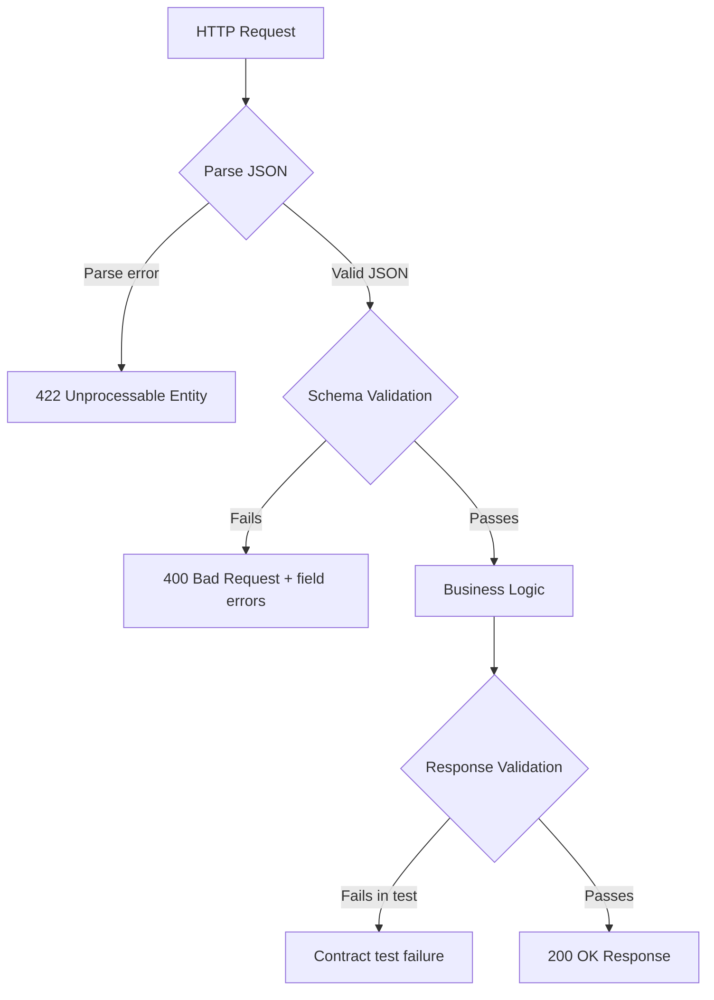

⚡ TL;DR - Request validation rejects malformed or
malicious input at the API boundary before it reaches
business logic or the database; response validation
ensures clients receive data conforming to the contract;
both are enforced via JSON Schema, OpenAPI, or framework
validators - failing either returns `400 Bad Request`
(client error, fixable by client) or `500 Internal Server
Error` (server violated its own contract).

---

| #026 | Category: HTTP & APIs | Difficulty: ★★☆ |
|:---|:---|:---|
| **Depends on:** | Request Headers, Response Bodies, JSON as Data Format | |
| **Used by:** | OpenAPI Specification, API Contract Testing, OWASP Top 10 | |
| **Related:** | Error Response Design, Content Negotiation, API Endpoint Design | |

---

### 🔥 The Problem This Solves

**WORLD WITHOUT IT:**
An API without request validation trusts the client to
send correct data. In practice: clients send strings where
numbers are expected (crashes), missing required fields
(NullPointerException), negative values for quantity
(negative charges), strings 10,000 characters long
(buffer overflows, slow regex), SQL fragments in name
fields (SQL injection), and `null` where `not null` is
assumed. Every field that reaches business logic without
validation is an attack surface.

**THE BREAKING POINT:**
OWASP API Security Top 10 includes "Improper Input
Validation" as a top category. The classic PHP vulnerability:
`$name = $_POST["name"]; $db->query("SELECT * FROM users
WHERE name = '$name'")`. A name of `'; DROP TABLE users--`
destroys the database. Input validation and parameterized
queries are the defense.

**THE INVENTION MOMENT:**
JSON Schema (2019), OpenAPI (2016), and framework-level
validators (Pydantic, Jakarta Bean Validation, Yup)
formalize validation as declarative schema. Instead of
writing imperative checks for every field, developers
declare the contract once. The validator enforces it
automatically, returns structured error messages, and
produces API documentation as a side effect.

---

### 📘 Textbook Definition

Request validation is the process of verifying that an
incoming HTTP request conforms to the API's expected
contract before processing it. This includes: correct
content type (`Content-Type: application/json`), required
fields present, field types match (string, number,
boolean), value constraints satisfied (min, max, pattern,
enum), and business rule constraints (consistent
cross-field relationships). Response validation verifies
that server responses conform to the declared schema
before being sent to the client. Both are typically
declared in OpenAPI/JSON Schema and enforced at the
framework level. Invalid requests return `400 Bad Request`
with a structured error body identifying the invalid fields.

---

### ⏱️ Understand It in 30 Seconds

**One line:**
Validation is the gatekeeper: it checks every request
against the declared schema before any business logic
runs, rejecting malformed or malicious input early and
loudly.

**One analogy:**
> Request validation is like airport security screening.
> Every passenger (request) goes through the same
> checkpoint before boarding (reaching business logic).
> Rules are explicit: no liquids over 100ml (string max
> length), valid ID required (required fields), no
> prohibited items (pattern validation). Failing the check
> at the gate (400 Bad Request) is far better than
> discovering the problem in the air (production crash
> or security breach).

**One insight:**
Validation is a security boundary, not just a UX
convenience. The boundary principle: validate at every
system entry point where trust changes. An internal
service calling another internal service still needs
validation because the internal service may have a bug
or be compromised.

---

### 🔩 First Principles Explanation

**WHAT TO VALIDATE:**

**1. Request validation checks:**
```
Structural:
  - Content-Type header present and correct
  - Request body is valid JSON (parse error)
  - Required fields are present
  - No unexpected extra fields (strict mode)

Type:
  - String fields are strings (not number/boolean)
  - Numeric fields are numbers
  - Arrays are arrays, not single values

Constraint:
  - String length: minLength, maxLength
  - Number range: minimum, maximum
  - Pattern: email format, UUID format, phone regex
  - Enum: status must be one of ["active","inactive"]
  - Cross-field: end_date > start_date

Business:
  - user_id exists in database
  - quantity > 0 (business rule)
```

**2. Response validation checks (contract testing):**
```
  - Required fields present in response
  - Deprecated fields not added back
  - Types match schema (no string where number expected)
  - Enum values within declared set
```

**3. JSON Schema example:**
```json
{
  "$schema": "https://json-schema.org/draft/2020-12/schema",
  "type": "object",
  "required": ["name", "email", "quantity"],
  "additionalProperties": false,
  "properties": {
    "name": {
      "type": "string",
      "minLength": 1,
      "maxLength": 100
    },
    "email": {
      "type": "string",
      "format": "email"
    },
    "quantity": {
      "type": "integer",
      "minimum": 1,
      "maximum": 1000
    },
    "status": {
      "type": "string",
      "enum": ["pending", "active", "cancelled"]
    }
  }
}
```

---

### 🧪 Thought Experiment

**SCENARIO: Order submission API without validation**

```
POST /api/v1/orders
{"product_id": "'; DROP TABLE orders--",
 "quantity": -999,
 "email": "not-an-email",
 "notes": "X".repeat(1000000)}
```

**What happens without validation:**
1. `product_id` with SQL injection → if using string
   interpolation in SQL: database data loss
2. `quantity: -999` → order total = -$999 (customer
   gets refunded $999 by "ordering")
3. `email: "not-an-email"` → email delivery fails
   silently, no customer confirmation sent
4. `notes` with 1M characters → application OOM,
   server crash, or slow regex DoS

**With validation (Pydantic / FastAPI):**
```
400 Bad Request
{
  "detail": [
    {"loc": ["body","product_id"],"type":"string_pattern_mismatch"},
    {"loc": ["body","quantity"],"msg":"ensure >= 1","type":"value_error"},
    {"loc": ["body","email"],"msg":"invalid email","type":"value_error"},
    {"loc": ["body","notes"],"msg":"max 1000 chars","type":"value_error"}
  ]
}
```
→ All four errors caught before reaching any business logic.

---

### 🧠 Mental Model / Analogy

> Validation is the immune system of an API. The immune
> system screens every substance entering the body for
> known threat patterns (validation rules). Most inputs
> pass quickly (healthy cells). Suspicious inputs are
> quarantined before they can cause damage (400 rejection).
> The immune system does not know every possible attack
> - it validates against known patterns. Validation is
> not a complete security solution (you still need auth,
> parameterized queries, rate limiting) but it is the
> first and most cost-effective defense line.

Key mappings:
- "Immune system" → validation layer
- "Scanning for patterns" → schema validation rules
- "Quarantine" → 400 Bad Request response
- "Not a complete solution" → validation + auth + parameterized
  queries + rate limiting in depth

---

### 📶 Gradual Depth - Five Levels

**Level 1 - What it is (anyone can understand):**
Before your API processes a request, it checks that the
data makes sense: required fields are there, numbers are
numbers, emails look like emails, strings are not
10,000 characters long. If the data fails the check,
the API rejects it with an explanation. This prevents
crashes and security problems.

**Level 2 - How to use it (junior developer):**
Use your framework's validation decorator or model.
FastAPI/Pydantic: define a `BaseModel` with field types
and constraints; FastAPI validates automatically.
Express: use `express-validator` or `zod`. Spring: use
Jakarta Bean Validation annotations (`@NotNull`,
`@Min(1)`, `@Email`). Let the framework handle the 400
response generation; do not write manual field-checking
code for each endpoint.

**Level 3 - How it works (mid-level engineer):**
Framework validators work in two stages: parse (is this
valid JSON?) and validate (does it match the schema?).
JSON Schema validators traverse the schema and input
simultaneously. Errors are collected per-field with
location (JSON path) and reason. The framework serializes
errors into a 400 response body. Response validation
("outbound validation") is done in contract tests, not
on every production response (too expensive), except
for critical APIs.

**Level 4 - Why it was designed this way (senior/staff):**
Validation at the API boundary follows the "trust nothing
outside your boundary" principle. The boundary is where
trust level changes: from untrusted external clients to
trusted internal business logic. Validation should be
the first thing that runs after parsing - before auth
(to prevent DoS via processing large unauthenticated
bodies), except for endpoints where auth is cheap and
validation is expensive. The design question: fail fast
(return all errors at once) vs fail on first (stop at
first error). Fail fast is better UX (client fixes all
errors in one round trip). Fail on first is simpler to
implement.

**Level 5 - Mastery (distinguished engineer):**
Validation has two threat models: (1) accidental errors
(client bug, API misuse) - caught by type/constraint
validation; (2) intentional attacks (injection, mass
assignment, parameter pollution) - caught by strict
validation + allowlist (not blocklist) approach.
`additionalProperties: false` in JSON Schema is critical:
it rejects fields not in the schema. Without it, a client
can send extra fields that may be processed by business
logic unexpectedly (mass assignment: `{"role": "admin"}`
alongside a legitimate payload). In Python/Pydantic:
`model_config = ConfigDict(extra="forbid")`.
In Spring: `@JsonIgnoreProperties(allowSetters=false)`.

---

### ⚙️ How It Works (Mechanism)

**Validation pipeline in FastAPI:**

```
HTTP Request
    │
    ▼
Parse body (JSON) ──► 422 Unprocessable Entity if malformed JSON
    │
    ▼
Pydantic model validation
  ├── Type coercion/check
  ├── Field constraint check (min/max/pattern)
  └── Custom validator (@field_validator)
    │
    ▼ If invalid:
    ├── 422 response with field-level error detail
    ▼ If valid:
Business logic (handler function receives typed model)
    │
    ▼
Response (typed via response_model=)
    │
    ▼ Pydantic serialization:
    ├── Exclude None fields (optional)
    ├── Alias fields (snake_case → camelCase)
    └── Enforce response schema
    ▼
HTTP Response
```



---

### 🔄 The Complete Picture - End-to-End Flow

**FastAPI/Pydantic validation with custom validators:**

```python
from fastapi import FastAPI
from pydantic import (
    BaseModel, EmailStr, field_validator,
    model_validator, ConfigDict
)
from decimal import Decimal
from datetime import date

app = FastAPI()

class OrderRequest(BaseModel):
    model_config = ConfigDict(extra="forbid")  # no extra fields

    product_id: str  # UUID format
    quantity: int
    email: EmailStr
    discount_pct: float = 0.0
    start_date: date
    end_date: date
    notes: str = ""

    @field_validator("product_id")
    @classmethod
    def validate_product_id(cls, v):
        import re
        if not re.match(
            r'^[0-9a-f]{8}-[0-9a-f]{4}-[0-9a-f]{4}'
            r'-[0-9a-f]{4}-[0-9a-f]{12}$', v
        ):
            raise ValueError("must be a valid UUID")
        return v

    @field_validator("quantity")
    @classmethod
    def validate_quantity(cls, v):
        if v < 1:
            raise ValueError("must be at least 1")
        if v > 10000:
            raise ValueError("exceeds maximum of 10000")
        return v

    @field_validator("notes")
    @classmethod
    def validate_notes(cls, v):
        if len(v) > 1000:
            raise ValueError("max 1000 characters")
        return v

    @model_validator(mode="after")
    def validate_date_range(self):
        if self.end_date <= self.start_date:
            raise ValueError("end_date must be after start_date")
        return self


@app.post("/api/v1/orders", status_code=201)
def create_order(order: OrderRequest):
    # All fields guaranteed valid by Pydantic
    return {"id": "new-order-id", "status": "pending"}
```

---

### 💻 Code Example

**Example 1 - BAD: Manual imperative validation**

```python
# BAD: manual validation - verbose, incomplete, error-prone
@app.post("/api/v1/orders")
def create_order_bad():
    data = request.get_json()
    if data is None:
        return {"error": "invalid JSON"}, 400
    if "product_id" not in data:
        return {"error": "missing product_id"}, 400
    if not isinstance(data["quantity"], int):
        return {"error": "quantity must be integer"}, 400
    # ... 20 more checks, easy to forget one
    # No cross-field validation
    # No structured error format
    return process_order(data)

# GOOD: declarative Pydantic model handles all validation
class OrderRequest(BaseModel):
    product_id: str
    quantity: int = Field(ge=1, le=10000)
    email: EmailStr

@app.post("/api/v1/orders")
def create_order_good(order: OrderRequest):
    # Invalid requests never reach here
    return process_order(order)
```

---

**Example 2 - Structured validation errors**

```python
# BAD: generic error message (client cannot fix)
return {"error": "invalid input"}, 400

# GOOD: field-level errors (client knows exactly what to fix)
return {
    "type": "validation_error",
    "title": "Request validation failed",
    "status": 400,
    "errors": [
        {
            "field": "quantity",
            "message": "must be at least 1",
            "value": -5
        },
        {
            "field": "email",
            "message": "invalid email format",
            "value": "not-an-email"
        }
    ]
}, 400
```

---

**Example 3 - Mass assignment prevention**

```python
# BAD: mass assignment vulnerability
# POST {"name":"Alice","role":"admin"} → sets role!
class UserUpdate(BaseModel):
    name: str
    email: str
    # role not declared, but:
    model_config = ConfigDict(extra="allow")  # DANGER

# GOOD: extra="forbid" blocks undeclared fields
class UserUpdate(BaseModel):
    name: str
    email: str
    model_config = ConfigDict(extra="forbid")
    # POST {"name":"Alice","role":"admin"} → 422 error
```

---

### ⚖️ Comparison Table

| Approach | Verbosity | Completeness | Schema Generation | Type Safety |
|:---|:---|:---|:---|:---|
| Manual imperative checks | High | Often incomplete | No | No |
| JSON Schema validation | Medium | Complete | Yes | Partial |
| Pydantic (Python) | Low | Complete | Yes (OpenAPI) | Yes |
| Jakarta Bean Validation (Java) | Low | Complete | Yes (OpenAPI) | Yes |
| Zod (TypeScript) | Low | Complete | With plugins | Yes |

---

### ⚠️ Common Misconceptions

| Misconception | Reality |
|:---|:---|
| Validation replaces parameterized queries | Validation and parameterized queries are complementary, not alternatives. Validation rejects obviously invalid input. Parameterized queries prevent SQL injection even for valid-looking input. Both are required. |
| Returning all validation errors in one response is hard | Modern frameworks (Pydantic, Spring Bean Validation, Zod) collect all validation errors and return them in one response by default. Write the schema once; the framework handles error aggregation. |
| Response validation should run on every production request | Response validation is expensive and adds latency. Use it in contract tests (CI), not production middleware. Exception: security-sensitive responses (PII, financial data) may warrant production schema enforcement. |
| `additionalProperties: true` is safer because it is permissive | Permissive validation (`extra="allow"`) enables mass assignment vulnerabilities. `additionalProperties: false` is the secure default: reject unknown fields at the boundary. |

---

### 🚨 Failure Modes & Diagnosis

**Mass assignment vulnerability**

**Symptom:** Client sends `{"role": "admin"}` in a user
profile update, and the user's role is elevated.

**Root Cause:** API model accepts additional properties.
User-controlled input modifies security-sensitive fields.

**Diagnostic:**
```bash
# Test for mass assignment
curl -X PATCH https://api.example.com/users/me \
  -H "Authorization: Bearer token" \
  -H "Content-Type: application/json" \
  -d '{"name":"Alice","role":"admin","is_verified":true}'

# Should receive 422 Unknown field: role, is_verified
# If 200 OK: mass assignment is present
```

**Fix:** Set `extra="forbid"` (Pydantic) or `@JsonIgnoreProperties`
(Spring). Explicitly list all allowed update fields.

---

**Validation bypassed for authenticated endpoints**

**Symptom:** Internal API receives malformed data from
a trusted service. NullPointerException in production.

**Root Cause:** Developers assume internal callers are
trusted and skip validation for internal endpoints.
Bug in the internal service sends malformed data.

**Fix:** Validate at every trust boundary, including
internal service-to-service calls. The caller may have
a bug or be compromised. Defense in depth: validate
incoming data regardless of source.

---

### 🔗 Related Keywords

**Prerequisites (understand these first):**
- `Request Headers` - Content-Type validation
- `JSON as API Data Format` - JSON parsing precedes
  schema validation
- `HTTP Response Body` - 400/422 error structure

**Builds On This (learn these next):**
- `OpenAPI Specification` - schema declaration generates
  validation rules
- `API Contract Testing` - response validation in CI
- `Error Response Design` - structured 400 error bodies

---

### 📌 Quick Reference Card

```
┌──────────────────────────────────────────────────────────┐
│ WHAT IT IS   │ Schema-based enforcement of API input and │
│              │ output contracts at the request boundary  │
├──────────────┼───────────────────────────────────────────┤
│ PROBLEM IT   │ Invalid input causes crashes, SQL         │
│ SOLVES       │ injection, negative charges, and DoS      │
├──────────────┼───────────────────────────────────────────┤
│ KEY INSIGHT  │ additionalProperties: false prevents mass │
│              │ assignment. Use it as the default, not    │
│              │ the exception.                            │
├──────────────┼───────────────────────────────────────────┤
│ USE WHEN     │ Every API endpoint that accepts input     │
│              │ (all of them)                             │
├──────────────┼───────────────────────────────────────────┤
│ SECURITY     │ extra="forbid"; allowlist fields;         │
│ RULES        │ parameterized queries (in addition);      │
│              │ validate internal service calls too       │
├──────────────┼───────────────────────────────────────────┤
│ ANTI-PATTERN │ Manual field-by-field validation;         │
│              │ generic "invalid input" error messages;   │
│              │ trusting internal callers implicitly      │
├──────────────┼───────────────────────────────────────────┤
│ TRADE-OFF    │ Strict validation (more secure, may break │
│              │ legitimate edge cases) vs permissive      │
│              │ (flexible, larger attack surface)         │
├──────────────┼───────────────────────────────────────────┤
│ ONE-LINER    │ "Validate early, validate strictly, return│
│              │ structured field-level errors."           │
├──────────────┼───────────────────────────────────────────┤
│ NEXT EXPLORE │ OpenAPI Specification → Contract Testing  │
└──────────────────────────────────────────────────────────┘
```

**If you remember only 3 things:**
1. Use `additionalProperties: false` (JSON Schema) or
   `extra="forbid"` (Pydantic). This prevents mass
   assignment where attackers elevate privileges by
   sending unexpected fields.
2. Return field-level structured errors (not "invalid
   input"). Clients need to know exactly which field
   failed and why to fix the request.
3. Validate at every trust boundary - including internal
   service calls. Internal callers have bugs too.

---

### 💎 Transferable Wisdom

**Reusable Engineering Principle:**
The "validate at the boundary, trust inside" principle
is the foundation of secure system design. Once data
passes the validation gate, inner components can trust
it and avoid re-validating. This is the same pattern
as: OS system call validation (kernel trusts valid
syscall arguments), database constraint checks (trust
data that satisfies constraints), and protocol parsing
(TLS trust after handshake). The cost of validation
is concentrated at the boundary; the benefit is that
all interior code is simplified.

**Where else this pattern applies:**
- Database constraints (NOT NULL, CHECK): second line
  of validation if API layer misses something
- Type systems (TypeScript, Java): compile-time boundary
  validation
- Protocol parsers: TLS, HTTP/2 framing validation

---

### 💡 The Surprising Truth

JSON Schema's `additionalProperties: false` is disabled
by default. The JSON Schema specification authors chose
permissive-by-default as the standard, because schema
evolution (adding new fields) would break strict validators.
This is the opposite of the secure-by-default principle.
The result: most hand-written JSON Schema schemas silently
accept extra fields, enabling mass assignment. Every major
validation library (Pydantic, Yup, Zod) requires explicit
opt-in to strict mode. Production security requires knowing
this default and explicitly opting in to strict validation.

---

### ✅ Mastery Checklist

**You've mastered this when you can:**
1. **IDENTIFY** Spot a mass assignment vulnerability in
   a Pydantic model and add the fix (`extra="forbid"`).
2. **BUILD** Define a JSON Schema for an order endpoint
   with type, minimum, maximum, pattern, and enum
   constraints.
3. **DEBUG** Given a 422 validation error response,
   identify which field failed and why from the error
   detail array.
4. **EXPLAIN** Why validation is a security boundary
   (not just UX) and why internal API calls also need
   validation.
5. **DESIGN** Structure a 400 validation error response
   body that allows a client to fix all errors in one
   round trip.

---

### 🎯 Interview Deep-Dive

**Q1: What is mass assignment and how do you prevent it?**

*Why they ask:* Tests security awareness of API input
handling.

*Strong answer includes:*
- Mass assignment: client sends extra fields in a request
  body that the server processes unexpectedly. Classic
  example: `{"name":"Alice","role":"admin"}` in a profile
  update sets `role` to "admin" if the model accepts
  additional properties.
- Prevention: declare exact allowed fields in the model
  and reject additional fields. In Pydantic:
  `model_config = ConfigDict(extra="forbid")`. In Spring:
  do not use `@RequestBody Map<String, Object>`.
- Also: use separate request models for create vs update
  vs partial update - each with only the fields that
  operation permits.

**Q2: What is the difference between 400 and 422
in request validation?**

*Why they ask:* Tests precise HTTP knowledge.

*Strong answer includes:*
- 400 Bad Request: general client error. The request
  is syntactically malformed. Could be a missing header,
  invalid JSON syntax (not parseable), or wrong content type.
- 422 Unprocessable Entity (RFC 4918, WebDAV; now used
  broadly): the request is syntactically valid (parseable
  JSON) but semantically invalid (fields don't meet schema
  constraints). FastAPI uses 422 for Pydantic validation
  errors.
- In practice: many APIs use 400 for both. The distinction
  matters for client error handling: 400 suggests a
  protocol error; 422 suggests the client should fix
  field values.

**Q3: How would you validate cross-field constraints
in a REST API request?**

*Why they ask:* Tests understanding beyond simple type
validation.

*Strong answer includes:*
- Example: `end_date` must be after `start_date`.
  Neither field alone is invalid; only the combination is.
- Implementation in Pydantic: `@model_validator(mode="after")`
  decorator on the model class. Receives the full model
  after individual field validation.
- Implementation in Spring: implement `Validator` interface
  and add `BindingResult.rejectValue()` for cross-field
  errors.
- In JSON Schema: use `if/then/else` or custom keywords.
  Limited support; cross-field constraints are better
  handled in application code.
- Return field-level errors for both fields involved
  in the violation; not just a generic message.
