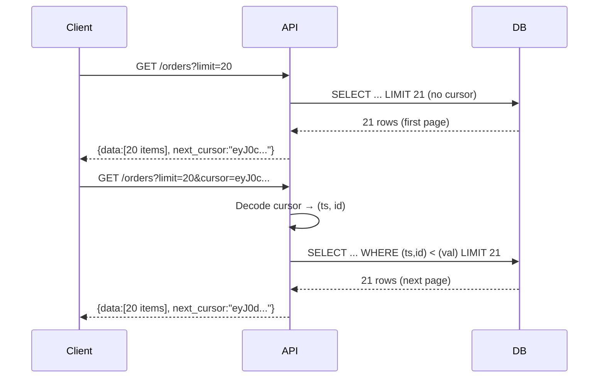

⚡ TL;DR - Pagination controls how large collections are
returned in manageable pages; Offset/Page pagination is
simple but breaks under concurrent inserts and is slow
on deep pages; Cursor/Keyset pagination is stable and
O(1) regardless of page depth but cannot jump to
arbitrary pages; choose based on whether the client
needs random access or sequential scrolling.

---

| #027 | Category: HTTP & APIs | Difficulty: ★★☆ |
|:---|:---|:---|
| **Depends on:** | HTTP Response Body, API Endpoint Design | |
| **Used by:** | Partial Responses, Long-Running Operations | |
| **Related:** | RESTful API Design Patterns, Error Response Design, HATEOAS | |

---

### 🔥 The Problem This Solves

**WORLD WITHOUT IT:**
An API that returns all records in one response is an
invitation to failure. `GET /api/users` returning all
10 million users as a single JSON array: 500MB response,
5 minutes to generate, API gateway timeout, client OOM.
Even modest datasets (10,000 records) cause slow responses
and high memory usage.

**THE BREAKING POINT:**
Real-time collaborative data (social feed, notifications,
live orders) breaks offset pagination: if 10 new items
are inserted at the top between page 1 and page 2 fetch,
page 2's items are shifted - the user sees duplicates
(items that were on page 1 now appear on page 2 as well).
This "pagination drift" is invisible to users but causes
data integrity issues in data pipelines.

**THE INVENTION MOMENT:**
Two solutions emerged: (1) Cursor-based pagination (used
by Twitter, Facebook, Stripe) returns an opaque token
representing the position in the result set - new inserts
do not shift existing cursors. (2) Keyset pagination
uses actual column values (`WHERE id > last_seen_id`) -
it is stable, indexed, and scales to billions of rows.

---

### 📘 Textbook Definition

Pagination divides large result sets into sequential
pages for API responses. **Offset pagination**:
`?limit=20&offset=40` skips N rows and returns M.
Simple but: deep offsets are slow (`OFFSET 1000000`
requires the database to scan and discard 1M rows),
and data shifts during concurrent writes cause duplicate
or skipped items. **Page-number pagination**:
`?page=3&page_size=20` is offset pagination with a more
user-friendly interface. **Cursor pagination**:
`?limit=20&cursor=eyJpZCI6MTAwfQ==` encodes the position
as an opaque token; the next page starts after the
cursor's position; new data does not shift cursors.
**Keyset pagination**: `?limit=20&after_id=100` uses a
sortable column value directly; the query uses an indexed
WHERE clause instead of OFFSET, giving O(1) query time
regardless of page depth.

---

### ⏱️ Understand It in 30 Seconds

**One line:**
Offset pagination is like skipping pages in a book
(slow, breaks if chapters are added mid-read); cursor
pagination is like using a bookmark (stays valid
regardless of new content).

**One analogy:**
> Fetching next page in a social feed:
> Offset = "Show me posts 21-40." But while you read
> posts 1-20, three new posts appeared at the top.
> Posts 21-40 are now shifted; you see post 18 again
> as the first post on page 2.
>
> Cursor = "Show me posts after post ID 1234." New posts
> at the top do not matter - you always continue from
> the same position in the ordered set.

**One insight:**
Cursor/keyset pagination makes an implicit promise:
the cursor must be opaque to the client (a base64-encoded
JSON or HMAC-protected token). If clients can construct
cursors arbitrarily, they can use the cursor mechanism
as an unintended range query. Opaque cursors preserve
the API's ability to change the underlying sort/filter
strategy.

---

### 🔩 First Principles Explanation

**OFFSET PAGINATION:**
```
SQL: SELECT * FROM orders
     ORDER BY created_at DESC
     LIMIT 20 OFFSET 40;

Problems:
1. Deep offset: OFFSET 1000000 = scan and discard
   1M rows, slow (O(N) scan)
2. Drift: concurrent inserts shift rows; client
   may see duplicates or miss rows
3. Total count: COUNT(*) is expensive on large tables

API design:
  GET /api/orders?limit=20&offset=40
  Response:
  {
    "data": [...20 items...],
    "total": 15000,       ← expensive COUNT(*)
    "limit": 20,
    "offset": 40,
    "next_offset": 60     ← simple to implement
  }
```

**CURSOR/KEYSET PAGINATION:**
```
SQL (after cursor decodes to id=1234, ts="2024-01-15"):
  SELECT * FROM orders
  WHERE (created_at, id) < ('2024-01-15', 1234)
  ORDER BY created_at DESC, id DESC
  LIMIT 20;

Requires composite index on (created_at DESC, id DESC)

Advantages:
1. Always O(log N) via index seek (no OFFSET scan)
2. Stable: concurrent inserts do not shift cursors
3. Works at any depth (page 1M is same speed as page 1)

Limitations:
1. Cannot jump to arbitrary page (no "go to page 50")
2. Cursor carries sort info; changing sort order
   invalidates cursors
3. Total count not available (use estimate or omit)

API design:
  GET /api/orders?limit=20&cursor=eyJ0cyI6...
  Response:
  {
    "data": [...20 items...],
    "next_cursor": "eyJ0cyI6...",  ← null if last page
    "has_more": true
  }
```

**CURSOR ENCODING:**
```python
import base64, json, hmac, hashlib

def encode_cursor(last_item: dict, secret: str) -> str:
    """Encode cursor with HMAC to prevent tampering."""
    payload = json.dumps({
        "id": last_item["id"],
        "ts": last_item["created_at"].isoformat()
    })
    sig = hmac.new(
        secret.encode(), payload.encode(), hashlib.sha256
    ).hexdigest()[:16]
    return base64.urlsafe_b64encode(
        f"{payload}:{sig}".encode()
    ).decode()
```

---

### 🧪 Thought Experiment

**SCENARIO: Twitter feed pagination**

Twitter feed has 500M new tweets per day. Users scroll
their feed sequentially. Rarely jump to a specific page.

**Offset approach:**
- `GET /timeline?offset=500000&limit=20`
- Database scans 500,000 rows before returning 20
- At 500M tweets/day, after 1 day: OFFSET 43,200,000
  for users who have been active for 24 hours
- Query time: O(N), hundreds of milliseconds at depth
- Drift: new tweets shift all offsets, user sees
  duplicates when scrolling

**Cursor approach (Twitter's actual design):**
- `GET /timeline?cursor=1706000000_12345`
  (conceptually: tweets before timestamp T and ID I)
- SQL: `WHERE (tweet_id < ?) ORDER BY tweet_id DESC`
- Index seek: O(log N), sub-millisecond at any depth
- Stable: new tweets do not shift existing cursors
- Can fetch 500M rows deep in same time as page 1

**The choice:**
Cursor/keyset for sequential scrolling workloads with
live data. Offset only for: admin interfaces with random
access, small datasets (<10K rows), or when total count
is required.

---

### 🧠 Mental Model / Analogy

> Offset pagination is like searching a sorted stack of
> physical papers by counting from the top. To get
> papers 1001-1020, you count 1000 papers first. If
> someone adds papers to the top while you count, your
> position shifts.
>
> Cursor pagination is like having a sticky bookmark
> that you place after the last paper you read. When
> you return, you open exactly where your bookmark is,
> regardless of how many papers were added on top.

---

### 📶 Gradual Depth - Five Levels

**Level 1 - What it is (anyone can understand):**
Pagination means "show me the data in small chunks."
Offset pagination says "skip the first 40 records, show
me the next 20." Cursor pagination says "show me the
20 records that come after record #1234." Cursor is
better for large datasets because it is faster and
does not get confused when new records are added.

**Level 2 - How to use it (junior developer):**
Use cursor pagination for any production API with more
than 1,000 records or concurrent write workloads. Use
offset only for admin interfaces with random access
needs. Return `next_cursor` (null if last page) and
`has_more` boolean. Include a `limit` parameter with
a max (e.g., max=100 to prevent fetching 1M records).

**Level 3 - How it works (mid-level engineer):**
Keyset query: `WHERE (sort_col, id) < (last_sort_val,
last_id)` with composite index `(sort_col DESC, id DESC)`.
The row tuple comparison is the key: it correctly handles
ties in `sort_col` by using `id` as a tiebreaker. Cursor
encodes both values (opaque base64). Server decodes on
next request. Important: cursor must be scoped to the
same filter/sort; changing filters invalidates cursors.

**Level 4 - Why it was designed this way (senior/staff):**
The "cursor" abstraction hides the implementation from
the client. The cursor could encode an ID, a timestamp,
a composite key, or a Redis set position. By keeping
it opaque, the server can change the underlying
implementation (e.g., from Redis sorted set to DB keyset)
without breaking clients. HATEOAS (hypermedia) extends
this: the response includes the full URL for the next
page (`next: "https://api.example.com/orders?cursor=..."`)
so clients never need to construct URLs.

**Level 5 - Mastery (distinguished engineer):**
Keyset pagination has a subtle challenge: bidirectional
pagination (next page AND previous page). `previous_cursor`
requires reversing the sort: `WHERE (sort_col, id) >
(last_sort_val, last_id) ORDER BY sort_col ASC, id ASC
LIMIT 20` then reverse the result array. This requires
two composite indexes: `(sort_col DESC, id DESC)` and
`(sort_col ASC, id ASC)` or a covering index that works
both ways. At Facebook/Twitter scale, pagination is
further complicated by sharding: the global cursor must
encode not just row position but shard routing information.
Distributed cursors with fan-out queries (query N shards,
merge results) require ordering tokens that work across
shard boundaries.

---

### ⚙️ How It Works (Mechanism)

**Keyset pagination query:**

```sql
-- Index: CREATE INDEX idx_orders_ts_id
--        ON orders (created_at DESC, id DESC);

-- First page (no cursor)
SELECT id, user_id, total, created_at
FROM orders
WHERE user_id = 42
ORDER BY created_at DESC, id DESC
LIMIT 21;  -- fetch 21, return 20; if 21st exists → has_more

-- Next page (cursor decoded to: ts='2024-01-15', id=1234)
SELECT id, user_id, total, created_at
FROM orders
WHERE user_id = 42
  AND (created_at, id) < ('2024-01-15 10:00:00', 1234)
ORDER BY created_at DESC, id DESC
LIMIT 21;
```



---

### 🔄 The Complete Picture - End-to-End Flow

**Production cursor pagination in FastAPI:**

```python
from fastapi import FastAPI, Query
from pydantic import BaseModel
import base64, json
from typing import Optional

app = FastAPI()

class OrdersResponse(BaseModel):
    data: list[dict]
    next_cursor: Optional[str]
    has_more: bool

def encode_cursor(ts: str, item_id: int) -> str:
    payload = json.dumps({"ts": ts, "id": item_id})
    return base64.urlsafe_b64encode(
        payload.encode()
    ).decode()

def decode_cursor(cursor: str) -> dict:
    try:
        decoded = base64.urlsafe_b64decode(
            cursor.encode()
        )
        return json.loads(decoded)
    except Exception:
        raise ValueError("invalid cursor")

@app.get("/api/v1/orders")
def get_orders(
    limit: int = Query(default=20, ge=1, le=100),
    cursor: Optional[str] = None
):
    limit_plus = limit + 1  # fetch one extra to detect more
    if cursor:
        pos = decode_cursor(cursor)
        rows = db.execute(
            """SELECT id, user_id, total, created_at
               FROM orders
               WHERE (created_at, id) < (%s, %s)
               ORDER BY created_at DESC, id DESC
               LIMIT %s""",
            (pos["ts"], pos["id"], limit_plus)
        )
    else:
        rows = db.execute(
            """SELECT id, user_id, total, created_at
               FROM orders
               ORDER BY created_at DESC, id DESC
               LIMIT %s""",
            (limit_plus,)
        )

    has_more = len(rows) > limit
    items = rows[:limit]
    next_cur = None
    if has_more:
        last = items[-1]
        next_cur = encode_cursor(
            str(last["created_at"]), last["id"]
        )

    return OrdersResponse(
        data=items,
        next_cursor=next_cur,
        has_more=has_more
    )
```

---

### 💻 Code Example

**Example 1 - BAD: Offset with total count**

```python
# BAD: COUNT(*) is expensive; OFFSET is slow at depth
@app.get("/api/orders")
def get_orders_bad(page: int = 1, page_size: int = 20):
    offset = (page - 1) * page_size
    # COUNT(*) full table scan on large tables
    total = db.execute(
        "SELECT COUNT(*) FROM orders"
    ).scalar()
    rows = db.execute(
        "SELECT * FROM orders "
        "ORDER BY created_at DESC "
        f"LIMIT {page_size} OFFSET {offset}"  # slow deep
    ).fetchall()
    return {
        "data": rows,
        "total": total,   # expensive
        "page": page,
        "total_pages": (total + page_size - 1) // page_size
    }

# GOOD: cursor-based, no COUNT(*), O(log N) at any depth
@app.get("/api/v1/orders")
def get_orders_good(
    limit: int = 20,
    cursor: Optional[str] = None
):
    # ... keyset query from above
    return {"data": items, "next_cursor": next_cur}
```

---

**Example 2 - Pagination drift illustration**

```python
# SCENARIO: Offset pagination drift
# Page 1: items [10,9,8,7,6,5,4,3,2,1] (offset=0, limit=5)
#   Returns: [10,9,8,7,6]
#
# New item 11 inserted at top
#
# Page 2 (offset=5): items [11,10,9,8,7,6,5,4,3,2,1]
#   Returns: [6,5,4,3,2]
#   Item 6 returned TWICE! (was in page 1 and page 2)
#
# With cursor (after item 6, id=6):
# Page 2: WHERE id < 6 ORDER BY id DESC LIMIT 5
#   Returns: [5,4,3,2,1]
#   Insert of item 11 has no effect. Correct result.
```

---

**Example 3 - HATEOAS pagination links**

```python
# Return full URLs for next/prev pages
# Client never needs to construct cursor URLs
def build_pagination_response(items, next_cursor, request):
    base_url = str(request.url).split("?")[0]
    return {
        "data": items,
        "links": {
            "self": str(request.url),
            "next": (
                f"{base_url}?cursor={next_cursor}"
                if next_cursor else None
            )
        },
        "has_more": next_cursor is not None
    }
```

---

### ⚖️ Comparison Table

| Feature | Offset/Page | Cursor/Keyset |
|:---|:---|:---|
| Random page access | Yes (go to page 50) | No |
| Stable under inserts | No (drift) | Yes |
| Deep page performance | O(N) - slow | O(log N) - fast |
| Total count support | Yes (expensive) | No |
| Implementation complexity | Low | Moderate |
| Sort order flexibility | Any | Fixed (cursor encodes sort) |

---

### ⚠️ Common Misconceptions

| Misconception | Reality |
|:---|:---|
| Cursor and keyset pagination are different things | Cursor pagination is the API pattern (opaque token). Keyset pagination is the SQL implementation (WHERE clause on indexed key). They are complementary; cursor is the external API contract; keyset is the DB query strategy. |
| Offset pagination is only slow for very large tables | Offset pagination is slow at deep offsets regardless of table size. `OFFSET 100000` on a 200,000-row table still requires scanning 100,000 rows. The threshold where it becomes noticeable is typically around OFFSET 10,000+. |
| Cursor tokens can be shared between users | Cursor tokens encode position in a sorted result set. If the query includes user-specific filters, a cursor from User A's query may be invalid or return wrong results for User B. Cursors are scoped to the same query parameters. |

---

### 🚨 Failure Modes & Diagnosis

**Missing index on sort column causes slow pagination**

**Symptom:** Page 1 is fast (100ms). Page 10 is slow
(2000ms). Page 100 times out.

**Root Cause:** No index on the sort column used in
keyset pagination. Full table scan to find the cursor
position.

**Diagnostic:**
```sql
-- Check index usage
EXPLAIN SELECT id, created_at FROM orders
WHERE (created_at, id) < ('2024-01-15', 1234)
ORDER BY created_at DESC, id DESC
LIMIT 21;

-- Look for: Index Scan on idx_orders_ts_id
-- BAD if: Seq Scan (full table scan)
```

**Fix:** Create composite index matching the WHERE and
ORDER BY: `CREATE INDEX idx_orders_ts_id ON orders
(created_at DESC, id DESC);`

---

**Cursor decoded by client enables range query bypass**

**Symptom:** Client constructs cursors with arbitrary
IDs, accessing records outside their permission scope.

**Root Cause:** Cursor is a plain base64-encoded JSON.
Client decodes it, constructs a cursor with a different
user's last record ID, and fetches another user's data.

**Fix:** HMAC-sign the cursor: include a hash of
(payload + server_secret). Verify on decode.
Invalid or tampered cursors return 400.

---

### 🔗 Related Keywords

**Prerequisites (understand these first):**
- `HTTP Response Body` - pagination wraps data in an
  envelope object
- `API Endpoint Design` - query parameters for
  pagination (`limit`, `cursor`, `offset`)

**Builds On This (learn these next):**
- `Partial Responses (Sparse Fieldsets)` - combine
  with pagination for efficient data transfer
- `Long-Running API Operations` - pagination for
  async job result retrieval

---

### 📌 Quick Reference Card

```
┌──────────────────────────────────────────────────────────┐
│ WHAT IT IS   │ Controls how large collections are split  │
│              │ into manageable pages                     │
├──────────────┼───────────────────────────────────────────┤
│ PROBLEM IT   │ Returning all records is slow, expensive, │
│ SOLVES       │ and causes OOM; offset drifts under writes│
├──────────────┼───────────────────────────────────────────┤
│ KEY INSIGHT  │ Cursor/keyset is O(log N) at any depth;   │
│              │ offset is O(N) - they are not equivalent  │
├──────────────┼───────────────────────────────────────────┤
│ USE WHEN     │ Cursor: feeds, events, logs, any live data│
│              │ Offset: admin UI, random access, small data│
├──────────────┼───────────────────────────────────────────┤
│ ANTI-PATTERN │ COUNT(*) for total pages (expensive);     │
│              │ transparent cursor encoding (HMAC it)     │
├──────────────┼───────────────────────────────────────────┤
│ TRADE-OFF    │ Offset: random access + total count vs    │
│              │ Cursor: stability + scale                 │
├──────────────┼───────────────────────────────────────────┤
│ ONE-LINER    │ "Cursor = bookmark; offset = page count   │
│              │ from the top (slow and shifts)."          │
├──────────────┼───────────────────────────────────────────┤
│ NEXT EXPLORE │ Partial Responses → HATEOAS → Webhooks    │
└──────────────────────────────────────────────────────────┘
```

**If you remember only 3 things:**
1. Offset pagination is O(N) at depth and drifts under
   concurrent writes. Cursor/keyset is O(log N) at any
   depth and is stable under inserts.
2. Fetch `limit + 1` rows. If you get `limit + 1`,
   `has_more = true` and return only `limit` items.
   This tells the client there is a next page without
   an expensive COUNT(*).
3. HMAC-sign cursor tokens. Opaque base64 cursors that
   clients can decode and tamper with are a security
   risk.

---

### 💎 Transferable Wisdom

**Reusable Engineering Principle:**
Keyset pagination is a special case of the "seek method"
in database query optimization: instead of asking the
database to skip N rows (O(N)), you seek directly to
the last seen position using an indexed column (O(log N)).
The same principle applies to: database range scans
(use indexed WHERE instead of OFFSET), log streaming
(bookmark by timestamp + sequence number), event sourcing
(replay from event ID instead of offset).

**Where else this pattern applies:**
- Kafka consumer groups: offset in topic/partition
  (position-based, equivalent to keyset)
- Elasticsearch search_after: cursor pagination for
  large result sets
- Database CDC (Change Data Capture): binlog position
  as cursor for change replication

---

### 💡 The Surprising Truth

Virtually every SQL database tutorial teaches `LIMIT N
OFFSET M` as the standard pagination approach. This is
the wrong default for production systems with large
datasets. The PostgreSQL documentation itself notes that
"`OFFSET` does not prevent the server from computing the
rows it is skipping." At OFFSET 1,000,000, the database
reads and discards 1 million rows before returning your
20 results - no index optimization can fix this. Twitter,
Facebook, Stripe, GitHub, and Slack all use cursor-based
pagination in their public APIs. The web development
community has been teaching the wrong default for decades.

---

### ✅ Mastery Checklist

**You've mastered this when you can:**
1. **EXPLAIN** Describe the "pagination drift" problem
   with offset pagination and why cursor pagination is
   immune to it.
2. **IMPLEMENT** Write the SQL for keyset pagination with
   a composite key and the matching index definition.
3. **DIAGNOSE** Identify a missing index on a pagination
   sort column via EXPLAIN and write the fix.
4. **SECURE** Implement HMAC-signed cursor encoding and
   explain why transparent base64 cursors are a risk.
5. **DECIDE** Given a use case (admin interface vs social
   feed), choose between offset and cursor pagination
   with justification.

---

### 🎯 Interview Deep-Dive

**Q1: What are the trade-offs between offset and cursor
pagination?**

*Why they ask:* Tests API design knowledge and
database query understanding.

*Strong answer includes:*
- Offset: simple, supports random page access and total
  count. Slow at depth (O(N) scan). Drifts under concurrent
  inserts (duplicates or skips). Works for small datasets.
- Cursor/keyset: O(log N) at any depth via indexed seek.
  Stable under inserts. Cannot jump to arbitrary page.
  No total count (omit or estimate). Best for large,
  live datasets.
- Drift example: page 1 returns rows [10-6]. New row
  inserted. Page 2 with offset=5 returns rows [7-3] -
  row 6 was already seen. Or if inserting at the bottom,
  row 6 is skipped entirely.

**Q2: How would you implement cursor pagination in SQL?**

*Why they ask:* Tests concrete implementation knowledge.

*Strong answer includes:*
- Composite keyset WHERE: `WHERE (created_at, id) <
  (last_ts, last_id) ORDER BY created_at DESC, id DESC`.
- Composite index to match: `CREATE INDEX ON orders
  (created_at DESC, id DESC)`.
- Composite key comparison handles ties in `created_at`
  by using `id` as tiebreaker.
- Fetch `LIMIT + 1` rows. If count equals `limit + 1`,
  `has_more = true`, return only `limit` rows.
- Encode last row's `(created_at, id)` as the next cursor.

**Q3: How would you prevent cursor token manipulation
by clients?**

*Why they ask:* Tests security awareness in API design.

*Strong answer includes:*
- Risk: base64 cursor is transparent. Client decodes,
  modifies the ID to a different user's record, sends
  it back. Server uses the cursor in a WHERE clause and
  returns other users' data.
- Defense: HMAC-sign the cursor payload.
  `sig = HMAC-SHA256(payload, server_secret)`.
  Include sig in encoded cursor. On decode: verify sig
  before using values.
- Additional: scope cursor to user ID or query parameters
  in the signed payload. A cursor from one query context
  is invalid for a different context.
