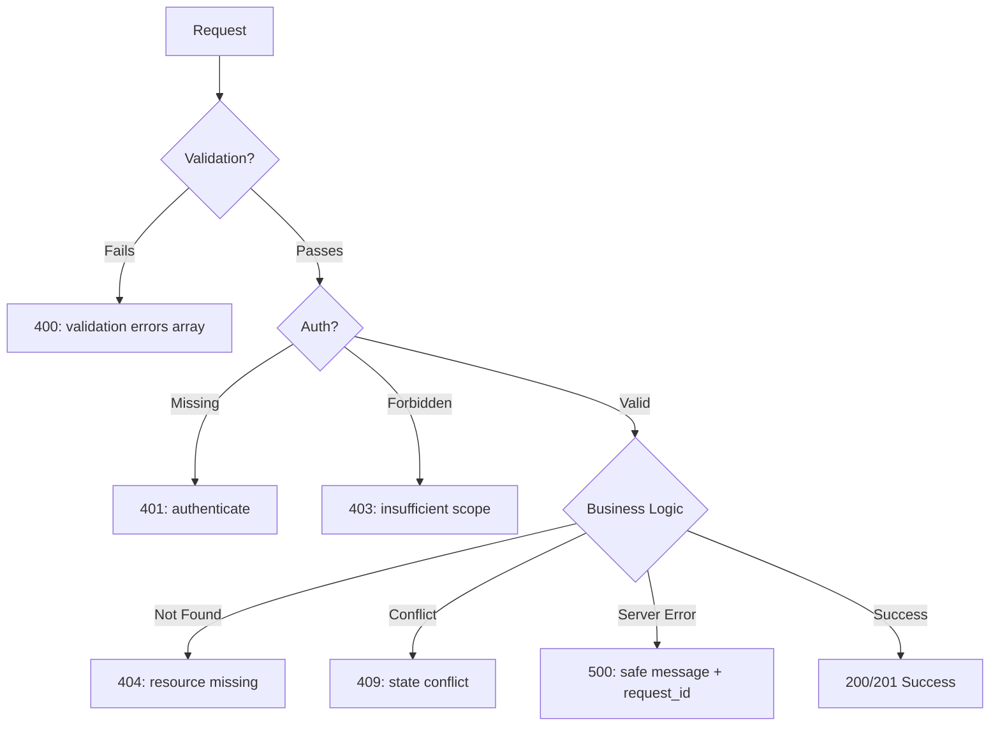

⚡ TL;DR - Error response design determines how an API
communicates failure; RFC 7807 Problem Details is the
modern standard: `type`, `title`, `status`, `detail`,
and optional `errors` for field-level validation; the
critical rule is: 4xx errors belong to the client (the
client must fix the request), 5xx errors belong to the
server (the client should retry later).

---

| #028 | Category: HTTP & APIs | Difficulty: ★★☆ |
|:---|:---|:---|
| **Depends on:** | HTTP Status Codes, Response Bodies, Request Validation | |
| **Used by:** | OpenAPI Specification, API Contract Testing | |
| **Related:** | Request Validation, Pagination, API Endpoint Design | |

---

### 🔥 The Problem This Solves

**WORLD WITHOUT IT:**
Early APIs returned whatever the developer thought was
useful: HTML error pages to REST clients, generic
`{"error": "something went wrong"}`, stack traces with
internal details, HTTP 200 OK with an `error` field in
the body, and HTTP 500 for all errors (validation errors,
not-found, auth failures, all 500). Client developers
had to read source code to understand what went wrong.
Automated error handling was impossible.

**THE BREAKING POINT:**
Inconsistent error formats across microservices made
API gateway error routing impossible. An API gateway
routing to 15 backend services receives 15 different
error formats. The gateway cannot identify whether a
504 is a backend timeout or a gateway timeout without
inspecting each body differently.

**THE INVENTION MOMENT:**
RFC 7807 (2016, "Problem Details for HTTP APIs") defines
a standard JSON error format. Five fields: `type` (URI
identifying the problem type), `title` (human-readable),
`status` (HTTP status code), `detail` (instance-specific
explanation), `instance` (URI of the specific occurrence).
Additional fields for validation errors, rate limits, etc.

---

### 📘 Textbook Definition

Error response design defines the structure and semantics
of HTTP error responses. The HTTP status code is the
primary signal: 4xx (client error, the client should
fix the request), 5xx (server error, the client can
retry). The body provides actionable details. RFC 7807
defines `application/problem+json` as the MIME type
and specifies: `type` (URI for problem category, links
to docs), `title` (brief description), `status` (mirrors
HTTP status code), `detail` (specific description of
this occurrence), and `instance` (URI of the specific
error occurrence). Extended with `errors` array for
validation failures (multiple field errors).

---

### ⏱️ Understand It in 30 Seconds

**One line:**
Error responses tell the client: what went wrong (type),
how to describe it (title), the HTTP status (status),
exactly what happened (detail), and for validation errors,
which specific fields are wrong (errors array).

**One analogy:**
> Error responses are like rejection letters. A bad
> rejection: "We cannot process your application."
> A good rejection: "Your application for Product X
> was rejected for the following reasons: (1) field
> 'quantity' must be at least 1 (submitted: -5), (2)
> field 'email' must be a valid email address (submitted:
> 'not-email'). Please resubmit with corrections."
> The second letter tells you exactly what to fix.

**One insight:**
Never return 5xx for client errors. If a client sends
`quantity: -5`, the server should return 400 (client's
fault) not 500 (server's fault). Returning 500 for client
errors breaks retry logic: automated clients retry 5xx
errors (hoping the server recovers), flooding the API
with identical invalid requests.

---

### 🔩 First Principles Explanation

**RFC 7807 FORMAT:**
```json
Content-Type: application/problem+json

{
  "type": "https://api.example.com/errors/validation",
  "title": "Request Validation Failed",
  "status": 400,
  "detail": "The request body contains 2 validation errors.",
  "instance": "/api/v1/orders/validate#2024-01-15T10:00:00Z",
  "errors": [
    {
      "field": "quantity",
      "message": "must be at least 1",
      "value": -5,
      "code": "MIN_VALUE"
    },
    {
      "field": "email",
      "message": "invalid email format",
      "value": "not-an-email",
      "code": "INVALID_FORMAT"
    }
  ]
}
```

**HTTP STATUS CODE MAPPING:**

| Status | Meaning | Client Action |
|:---|:---|:---|
| 400 Bad Request | Malformed request (syntax, type error) | Fix the request |
| 401 Unauthorized | Missing or invalid auth | Authenticate |
| 403 Forbidden | Auth valid, insufficient permission | Request access |
| 404 Not Found | Resource does not exist | Stop requesting |
| 409 Conflict | State conflict (duplicate, concurrent) | Resolve conflict |
| 410 Gone | Resource permanently deleted | Remove from client |
| 422 Unprocessable | Valid syntax, invalid semantics | Fix field values |
| 429 Too Many Requests | Rate limit exceeded | Wait and retry |
| 500 Internal Server Error | Unexpected server failure | Retry later |
| 503 Service Unavailable | Server temporarily down | Retry after delay |
| 504 Gateway Timeout | Upstream timeout | Retry later |

**WHAT TO INCLUDE IN ERRORS:**
```
Include:
  - type: URI to documentation page for this error type
  - title: brief, consistent for this error type
  - status: mirrors HTTP status code (helps if body-only parsing)
  - detail: specific to this occurrence (NOT a template)
  - errors[]: field-level validation errors
  - request_id: trace ID for support/debugging
  - retry_after: seconds to wait (for 429, 503)

Exclude (security):
  - Stack traces
  - SQL error messages (reveals schema)
  - Internal server file paths
  - Database connection strings
  - Third-party API keys or credentials
  - Internal IP addresses
```

---

### 🧪 Thought Experiment

**SCENARIO: Stripe error design**

Stripe's API is studied as a gold standard for error
design. Three key characteristics:

1. **Machine-readable error codes:**
   `{"error": {"type": "invalid_request_error",
   "code": "missing_required_param",
   "param": "amount"}}`
   SDK can catch `MissingRequiredParam` specifically,
   not just generic error.

2. **User-readable message + developer message:**
   `{"message": "Your card was declined.",
   "developer_message": "card_declined: insufficient_funds"}`
   Show user-safe message in UI; log developer message.

3. **Idempotency key on retry:**
   Payment error includes `{"idempotency_key": "order-123"}`
   so retry uses the same key, preventing duplicate charges.

**Lesson:** Good error design is API design. Errors are
part of the contract. Test errors as rigorously as
success responses.

---

### 🧠 Mental Model / Analogy

> HTTP status codes are the subject line of an email.
> The error body is the email content. A good subject
> line ("400: Validation Failed") tells the reader
> the category. The body tells the story: which fields
> failed, what the received values were, what the
> expected values are, and what to do next. A bad email
> has subject "500: Error" with body "An error occurred."
> Nobody knows what happened or how to fix it.

The 4xx/5xx distinction is the most important semantic:
- 4xx = "the client broke the contract" → client should
  not retry without fixing the request
- 5xx = "the server is having trouble" → client may
  retry (with backoff)

---

### 📶 Gradual Depth - Five Levels

**Level 1 - What it is (anyone can understand):**
When an API request fails, the response should explain
why in a way both humans and programs can understand.
"400: validation error on field 'quantity'" is useful.
"500: error" is not. Good error design makes debugging
easy for developers and safe for users (no internal
details exposed).

**Level 2 - How to use it (junior developer):**
Use RFC 7807 format (`application/problem+json`) for
all error responses. Map errors to correct status codes
(400 for validation, 401 for auth, 404 for not found).
Include `errors` array with field-level details for
validation failures. Never include stack traces or
SQL errors in responses. Add `request_id` for support.

**Level 3 - How it works (mid-level engineer):**
Implement a global error handler that catches exceptions
and maps them to error responses. Validation exceptions
→ 400/422 with field errors. Auth exceptions → 401.
Database unique constraint violations → 409. Generic
exceptions → 500 with a safe message (not the exception
message). Log the full exception internally with the
same `request_id` as the response, enabling support
to correlate.

**Level 4 - Why it was designed this way (senior/staff):**
RFC 7807 uses URIs for `type` (not numeric codes) because
URIs can point to documentation. The `type` URI does not
need to be dereferenceable (you can use it as a namespace
identifier), but it should be stable and unique per
error category. The `instance` field identifies the
specific occurrence (useful for support: "please
reference instance URI when reporting this error").
Error type URIs enable API clients to switch on specific
error types without string comparison, enabling extensible
error handling.

**Level 5 - Mastery (distinguished engineer):**
Error response design is a security boundary. Information
disclosure via error responses is a common vulnerability:
SQL errors reveal schema, stack traces reveal framework
and file paths, validation errors for non-existent users
reveal whether a user exists (user enumeration). The
principle: error responses for unauthenticated requests
must be carefully sanitized. Authenticated requests can
include more detail (the user is already known). Rate
limit responses (429) must not reveal whether the limit
is per-user or per-IP (could help attackers target
specific users). Designing errors for security requires
threat modeling the information each error type reveals.

---

### ⚙️ How It Works (Mechanism)

**Global error handler in FastAPI:**

```python
from fastapi import FastAPI, Request
from fastapi.responses import JSONResponse
from pydantic import ValidationError
import uuid

app = FastAPI()

@app.exception_handler(ValidationError)
async def validation_exception_handler(
    request: Request, exc: ValidationError
):
    request_id = str(uuid.uuid4())
    errors = [
        {
            "field": ".".join(str(loc) for loc in e["loc"]),
            "message": e["msg"],
            "code": e["type"].upper()
        }
        for e in exc.errors()
    ]
    return JSONResponse(
        status_code=400,
        media_type="application/problem+json",
        content={
            "type": "https://api.example.com/errors/validation",
            "title": "Request Validation Failed",
            "status": 400,
            "detail": (
                f"The request contains {len(errors)} "
                f"validation error(s)."
            ),
            "request_id": request_id,
            "errors": errors
        }
    )

@app.exception_handler(Exception)
async def generic_exception_handler(
    request: Request, exc: Exception
):
    request_id = str(uuid.uuid4())
    # Log full exception with request_id for internal debugging
    logger.exception(
        "Unhandled exception",
        extra={"request_id": request_id}
    )
    # Return safe message; NEVER include exc details
    return JSONResponse(
        status_code=500,
        media_type="application/problem+json",
        content={
            "type": "https://api.example.com/errors/internal",
            "title": "Internal Server Error",
            "status": 500,
            "detail": (
                "An unexpected error occurred. "
                f"Reference: {request_id}"
            ),
            "request_id": request_id
        }
    )
```



---

### 🔄 The Complete Picture - End-to-End Flow

**Error hierarchy and status code assignment:**

```python
# Exception hierarchy maps to HTTP status codes
class APIError(Exception):
    status_code: int = 500
    error_type: str = "internal_error"

class ValidationError(APIError):
    status_code = 400
    error_type = "validation_error"

class AuthenticationError(APIError):
    status_code = 401
    error_type = "authentication_required"

class AuthorizationError(APIError):
    status_code = 403
    error_type = "insufficient_permissions"

class NotFoundError(APIError):
    status_code = 404
    error_type = "resource_not_found"

class ConflictError(APIError):
    status_code = 409
    error_type = "resource_conflict"

class RateLimitError(APIError):
    status_code = 429
    error_type = "rate_limit_exceeded"

    def __init__(self, retry_after: int):
        self.retry_after = retry_after
        super().__init__()
```

---

### 💻 Code Example

**Example 1 - BAD: Insecure and unhelpful error responses**

```python
# BAD: exposes internal details
@app.post("/api/users")
def create_user_bad(data: dict):
    try:
        user = db.create_user(data)
        return user
    except Exception as e:
        # DANGER: reveals stack trace, SQL error, file paths
        return {"error": str(e)}, 500
        # Could expose: "UNIQUE constraint failed: users.email"
        # Reveals schema; also returns 500 for a client error

# GOOD: safe, structured error response
@app.post("/api/v1/users")
def create_user_good(data: UserCreateRequest):
    try:
        user = db.create_user(data)
        return user, 201
    except UniqueConstraintError:
        raise ConflictError(
            "A user with this email already exists"
        )
```

---

**Example 2 - User enumeration via error response**

```python
# BAD: reveals whether user exists
@app.post("/api/login")
def login_bad(data: LoginRequest):
    user = db.get_user_by_email(data.email)
    if not user:
        return {
            "error": "User not found"  # reveals existence
        }, 404
    if not verify_password(data.password, user.password_hash):
        return {
            "error": "Wrong password"  # reveals user exists
        }, 401

# GOOD: same response for both cases (no user enumeration)
@app.post("/api/v1/login")
def login_good(data: LoginRequest):
    user = db.get_user_by_email(data.email)
    valid = (
        user and verify_password(
            data.password, user.password_hash
        )
    )
    if not valid:
        return {
            "type": "https://api.example.com/errors/auth",
            "title": "Authentication Failed",
            "status": 401,
            "detail": "Invalid credentials."
        }, 401
    return issue_token(user)
```

---

**Example 3 - 429 with Retry-After**

```python
@app.exception_handler(RateLimitError)
async def rate_limit_handler(
    request: Request, exc: RateLimitError
):
    return JSONResponse(
        status_code=429,
        media_type="application/problem+json",
        headers={"Retry-After": str(exc.retry_after)},
        content={
            "type": "https://api.example.com/errors/rate-limit",
            "title": "Too Many Requests",
            "status": 429,
            "detail": (
                f"Rate limit exceeded. "
                f"Retry after {exc.retry_after} seconds."
            ),
            "retry_after": exc.retry_after
        }
    )
```

---

### ⚖️ Comparison Table

| Error Category | Status Code | Client Action | Body Content |
|:---|:---|:---|:---|
| Validation failure | 400 or 422 | Fix fields and retry | `errors[]` with field details |
| Missing auth | 401 | Authenticate | Generic auth message |
| Insufficient scope | 403 | Request access | Permission description |
| Resource not found | 404 | Stop requesting | Resource type + ID |
| State conflict | 409 | Resolve conflict | Conflict description |
| Rate limit | 429 | Wait + retry | Retry-After seconds |
| Server error | 500 | Retry with backoff | Safe message + request_id |
| Maintenance / overload | 503 | Retry after delay | ETA if known |

---

### ⚠️ Common Misconceptions

| Misconception | Reality |
|:---|:---|
| Return 200 with error in body | Status codes convey error semantics to HTTP infrastructure (load balancers, API gateways, monitoring). `200 OK` with `{"error":"not found"}` confuses all HTTP tooling. Always use correct 4xx/5xx codes. |
| 500 is the safe default for all errors | 500 tells clients "retry later." Using 500 for validation errors causes automated clients to retry an identical (still invalid) request, multiplying invalid traffic. |
| Include full error details for debugging | Stack traces and SQL errors reveal internal architecture to attackers. Log full details internally with a request_id. Return only the request_id to the client for support correlation. |
| 401 and 403 are interchangeable | 401 = "who are you?" (unauthenticated). 403 = "I know who you are, but no." OAuth clients use 401 to trigger token refresh. Returning 403 for expired tokens breaks OAuth clients. |

---

### 🚨 Failure Modes & Diagnosis

**Stack trace exposed in production 500 response**

**Symptom:** API error responses contain Python/Java
stack traces. Internal file paths and package versions
visible to any API client.

**Root Cause:** Exception message included directly in
response body. No global error handler that sanitizes
5xx responses.

**Diagnostic:**
```bash
# Trigger a 500 and check response body
curl -X POST https://api.example.com/users \
  -d '{"name": null}' \
  -H "Content-Type: application/json"

# If response contains "Traceback", "at line", "Exception":
# stack trace is leaking
```

**Fix:** Global exception handler that maps all 5xx
to safe messages. Log full exception with a request_id.
Return only request_id in response.

---

**User enumeration via inconsistent error messages**

**Symptom:** Attacker builds a list of registered email
addresses by checking whether login returns "User not
found" vs "Wrong password."

**Root Cause:** Different error messages for non-existent
user vs wrong password reveal user existence.

**Fix:** Return identical 401 response ("Invalid
credentials") for both cases. Timing attack mitigation:
run password hash comparison even for non-existent users
(to equalize response time).

---

### 🔗 Related Keywords

**Prerequisites (understand these first):**
- `HTTP Status Codes` - the foundation of error semantics
- `HTTP Response Body` - error body structure
- `Request Validation` - validation errors are the most
  common 400 source

**Builds On This (learn these next):**
- `OpenAPI Specification` - error schema declared in API spec
- `API Contract Testing` - verify error responses match spec

---

### 📌 Quick Reference Card

```
┌──────────────────────────────────────────────────────────┐
│ WHAT IT IS   │ Standard structure for communicating API  │
│              │ failure: RFC 7807 Problem Details         │
├──────────────┼───────────────────────────────────────────┤
│ PROBLEM IT   │ Inconsistent errors make automated        │
│ SOLVES       │ handling impossible; leaked internals     │
│              │ are a security vulnerability              │
├──────────────┼───────────────────────────────────────────┤
│ KEY INSIGHT  │ 4xx = client's fault (fix the request);   │
│              │ 5xx = server's fault (retry later).       │
│              │ Never return 5xx for client errors.       │
├──────────────┼───────────────────────────────────────────┤
│ USE WHEN     │ Every API endpoint (errors are part of    │
│              │ the contract, not afterthoughts)          │
├──────────────┼───────────────────────────────────────────┤
│ SECURITY     │ No stack traces; no SQL errors; no paths; │
│ RULES        │ same message for user-not-found and wrong-│
│              │ password (prevents user enumeration)      │
├──────────────┼───────────────────────────────────────────┤
│ ANTI-PATTERN │ HTTP 200 with error in body;              │
│              │ 500 for validation errors;                │
│              │ exposing exception messages               │
├──────────────┼───────────────────────────────────────────┤
│ ONE-LINER    │ "RFC 7807: type + title + status +        │
│              │ detail + errors[]. Log full; return safe."│
├──────────────┼───────────────────────────────────────────┤
│ NEXT EXPLORE │ API Versioning → Contract Testing →       │
│              │ OpenAPI Specification                     │
└──────────────────────────────────────────────────────────┘
```

**If you remember only 3 things:**
1. Never return 5xx for client errors. 400-422 for
   client mistakes; 5xx only for server failures. Using
   5xx for validation errors causes retry storms.
2. Never include stack traces or SQL errors in API
   responses. Log internally with a request_id. Return
   only the request_id for support correlation.
3. Return the same error message for "user not found"
   and "wrong password" to prevent user enumeration
   attacks.

---

### 💎 Transferable Wisdom

**Reusable Engineering Principle:**
"Fail explicitly, not silently." Good error design is
a form of observability: structured errors let monitoring
systems categorize failures automatically. A 10% increase
in 422 responses might indicate a client API version
mismatch. A spike in 500s correlates with a deployment.
Treating errors as first-class data - structured,
documented, versioned - transforms error handling from
a debugging afterthought to a system health signal.

**Where else this pattern applies:**
- gRPC status codes: same 4xx/5xx philosophy applied to
  gRPC (INVALID_ARGUMENT = 4xx, INTERNAL = 5xx)
- Database error codes: SQLSTATE codes follow the same
  "classify by responsibility" pattern
- POSIX errno: structured error codes (ENOENT = 404,
  EACCES = 403, ETIMEDOUT = 504 analog)

---

### 💡 The Surprising Truth

HTTP 200 OK with an error in the body (sometimes called
"200 with evil") became widespread because early SOAP
web services always returned HTTP 200 (the HTTP transport
was considered a separate layer from the SOAP application
layer). This pattern leaked into JSON REST APIs, creating
APIs where every response is 200 but some contain
`{"success": false, "error": "..."}`. The consequence:
load balancers, CDNs, API gateways, and circuit breakers
all rely on HTTP status codes for health decisions.
An API that returns 200 for failures appears perfectly
healthy to infrastructure while failing its clients.
HTTP status codes are not optional decorations - they
are the protocol's health language.

---

### ✅ Mastery Checklist

**You've mastered this when you can:**
1. **MAP** Given an error scenario (validation failure,
   expired token, not found, database crash), choose
   the correct HTTP status code.
2. **BUILD** Implement a global error handler that maps
   all exceptions to RFC 7807 error responses, with
   request_id for correlation and no internal detail
   leakage.
3. **DIAGNOSE** Identify a user enumeration vulnerability
   in login error responses and specify the fix.
4. **EXPLAIN** Why returning 500 for client validation
   errors is harmful (retry storms).
5. **DESIGN** Write an error response schema in OpenAPI
   for a validation error with field-level detail array.

---

### 🎯 Interview Deep-Dive

**Q1: What is RFC 7807 and how does it improve API
error responses?**

*Why they ask:* Tests knowledge of error standardization.

*Strong answer includes:*
- RFC 7807 defines `application/problem+json` with
  five fields: `type` (URI namespace for this error class),
  `title` (stable human-readable name), `status` (mirrors
  HTTP code), `detail` (instance-specific message), and
  `instance` (optional: URI of this specific error).
- Benefits: standardized parsing across services; `type`
  URI links to documentation; extensible (add `errors[]`
  for validation, `retry_after` for 429).
- Before RFC 7807: every API team invented their own
  structure. Microservices had 15 different error formats.
  API gateways, SDKs, and monitoring tools could not
  parse errors portably.

**Q2: When should you return 401 vs 403?**

*Why they ask:* Common HTTP status confusion; tests OAuth
knowledge.

*Strong answer includes:*
- 401 Unauthorized (misleadingly named): authentication
  failure. Token is missing, expired, or invalid. Should
  include `WWW-Authenticate`. OAuth clients use 401 as
  signal to refresh the token.
- 403 Forbidden: authentication succeeded, but the
  authenticated identity does not have permission for
  this resource or action.
- Mixing them: 403 for expired tokens → OAuth clients
  do not refresh → users stuck logged out.
  401 for insufficient scope → clients unnecessarily
  refresh token that is already valid.
- Rule: 401 = "prove yourself again"; 403 = "I know
  who you are, permission denied."

**Q3: What security risks exist in API error responses?**

*Why they ask:* Tests security awareness in API design.

*Strong answer includes:*
- Information disclosure: stack traces reveal framework
  version (CVE targeting), file paths, internal package
  names. SQL error messages reveal table names, column
  names, ORM being used.
- User enumeration: different errors for "user not found"
  vs "wrong password" enable account enumeration.
  Fix: identical 401 for both cases; equalize timing
  via bcrypt even for non-existent users.
- Internal IP/network disclosure: error messages sometimes
  include internal hostnames ("Cannot connect to
  db.internal.company.com") - reveals internal topology.
- Mitigation: global exception handler that sanitizes
  5xx responses. Log full details internally. Return
  only request_id to client.
