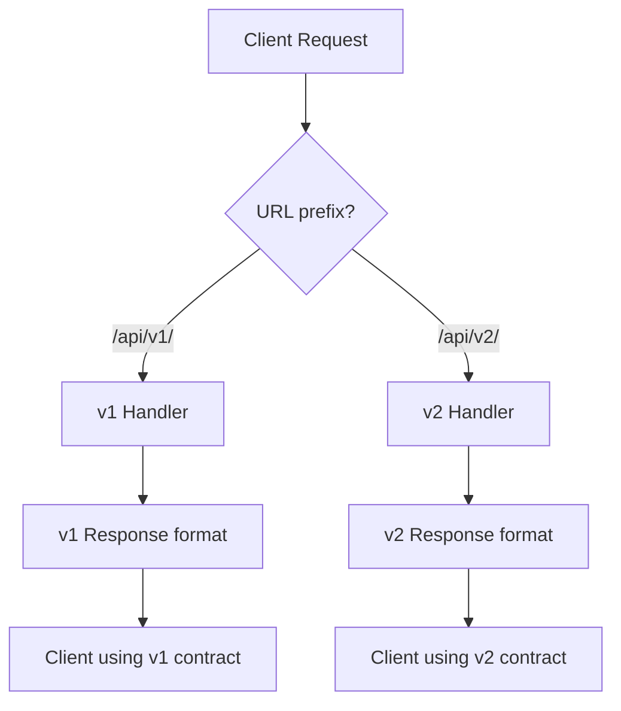

⚡ TL;DR - API versioning manages breaking changes to
the API contract; URL versioning (`/v1/`, `/v2/`) is
the most explicit and CDN-friendly; header versioning
(`Accept: application/vnd.api+json; version=2`) is
RESTfully pure but operationally complex; Stripe's date-
based versioning is the gold standard for public APIs
at scale; the real skill is minimizing breaking changes
through additive design.

---

| #029 | Category: HTTP & APIs | Difficulty: ★★★ |
|:---|:---|:---|
| **Depends on:** | API Endpoint Design, Request Headers | |
| **Used by:** | API Versioning at Scale, API Deprecation Strategy | |
| **Related:** | OpenAPI Specification, Error Response Design, REST Principles | |

---

### 🔥 The Problem This Solves

**WORLD WITHOUT IT:**
Without versioning, evolving an API means breaking all
existing clients simultaneously. A mobile app shipped
to users cannot be forced to update immediately. A B2B
integration partner may have a 6-month release cycle.
Changing a field name from `user_name` to `username`,
removing a deprecated endpoint, or adding a required
field: any of these breaks clients that deployed against
the previous contract.

**THE BREAKING POINT:**
Twitter's API v1 to v1.1 migration (2013) became a case
study in what not to do. Twitter deprecated v1 with
a 6-month warning, but millions of third-party apps were
suddenly broken. The ecosystem had grown to rely on
v1 behavior. The sudden hard cutoff caused thousands of
apps to fail simultaneously.

**THE INVENTION MOMENT:**
Stripe's versioning model (2016): every API change creates
a new version (date-based: `2024-01-15`). Customers pin
to a specific version. Their integration never breaks.
Stripe maintains all active versions simultaneously.
When a customer chooses to migrate to a newer version,
they do so explicitly. This model inverts the default:
instead of "all clients must upgrade," it is "we maintain
your version until you migrate."

---

### 📘 Textbook Definition

API versioning is the strategy for managing changes to
an API's public contract while maintaining backward
compatibility for existing clients. **Breaking changes**
include: removing fields, renaming fields, changing field
types, adding required parameters, removing endpoints,
changing HTTP status codes for existing conditions.
**Non-breaking changes** include: adding optional fields,
adding new endpoints, adding new optional query parameters,
adding enum values (if clients handle unknown values).
Versioning strategies: **URL versioning** (`/v1/users`),
**Header versioning** (`Accept: application/vnd.api+json;
version=1`), **Query parameter versioning**
(`?version=1`), **Date-based versioning** (Stripe's
`Stripe-Version: 2024-01-15`). The goal is to allow
the API to evolve while protecting existing clients.

---

### ⏱️ Understand It in 30 Seconds

**One line:**
API versioning is the contract between "I need to change
this API" and "existing clients must not break without
warning."

**One analogy:**
> API versioning is like OS backward compatibility.
> Windows applications built for Windows XP still mostly
> run on Windows 11. Microsoft maintains the API contract
> (Win32) across versions. Breaking that contract means
> millions of apps stop working. The cost of compatibility
> maintenance is accepted because the cost of breaking
> users is higher.

**One insight:**
The best versioning is no versioning: design APIs to be
additive. Add fields, do not rename them. Add optional
parameters, do not make existing ones required. Add new
endpoints, do not change existing ones. Every version
bump is a maintenance cost (multiple versions to operate,
test, document) and a migration cost (every client must
eventually update). The goal is to make version bumps
rare by designing for extensibility from the start.

---

### 🔩 First Principles Explanation

**BREAKING vs NON-BREAKING CHANGES:**
```
Breaking (require version bump):
  ✗ Remove field: {"name":"Alice"} → missing in response
  ✗ Rename field: name → full_name (client code breaks)
  ✗ Change type: "amount": 100 → "amount": "100.00"
  ✗ Add required param: ?currency= now required
  ✗ Remove endpoint: DELETE /api/v1/users/:id removed
  ✗ Change status code: 200 → 201 for creation
  ✗ Narrow enum: status=[active|inactive] removes pending

Non-breaking (safe to release without version bump):
  ✓ Add optional field: {"name":"Alice","bio":"..."} new
  ✓ Add new endpoint: POST /api/v1/users/verify new
  ✓ Add optional query param: ?include_deleted=true
  ✓ Expand enum: status adds "archived" (if clients
    handle unknown values gracefully)
  ✓ Widen type: return number as string is breaking;
    accept string where number was required: non-breaking
  ✓ Add new header: Response-Id: abc123
```

**FOUR VERSIONING STRATEGIES:**

**1. URL Versioning:**
```
GET /api/v1/users
GET /api/v2/users  ← v2 deployed alongside v1
                     v1 deprecated but still running
```
Pros: visible, cacheable by CDN, easy to route,
      zero client code change needed (just URL prefix)
Cons: "v2" is not RESTfully pure (version is not a
      resource property), multiple codebases to maintain

**2. Header Versioning:**
```
GET /api/users
Accept: application/vnd.example+json; version=2
```
Pros: RESTfully correct (URL identifies resource,
      header describes representation)
Cons: CDN cannot differentiate versions (same URL),
      harder to test in browser, less visible

**3. Query Parameter Versioning:**
```
GET /api/users?version=2
```
Pros: visible, easy to test in browser
Cons: version in URL creates caching issues if
      CDN key includes query params; not RESTful

**4. Date-based Versioning (Stripe model):**
```
Request header: Stripe-Version: 2024-01-15
Response header: Stripe-Version: 2024-01-15

Each breaking change creates a new date version.
Customers pin to a date version; they get exactly
that behavior indefinitely.
Default version: earliest stable (protects new
customers from adopting unversioned behavior).
```

---

### 🧪 Thought Experiment

**SCENARIO: Rename a field from `amount` to `total_amount`**

**Option A - Breaking change without versioning:**
```
Before: {"amount": 100}
After: {"total_amount": 100}
Impact: Every client that reads `amount` → undefined
        B2B partner scripts fail silently
        Mobile apps not yet updated → wrong calculations
```

**Option B - Additive (non-breaking transition):**
```
Phase 1: Add new field, keep old field
  {"amount": 100, "total_amount": 100}  ← both present
  Mark `amount` as deprecated in docs

Phase 2: Deprecation notice (6-12 months)
  Response header: Deprecation: true
  Documentation updated

Phase 3: Remove `amount` in v2
  GET /api/v2/orders → {"total_amount": 100}
  GET /api/v1/orders → {"amount": 100, "total_amount": 100}
  v1 EOL date announced with 6-month migration window
```

**Option B is always cheaper**: one migration cost
(client teams update once, on their schedule) vs one
incident (all clients broken simultaneously at the
cutoff).

---

### 🧠 Mental Model / Analogy

> API versioning is like publishing a book with editions.
> The 1st edition is published; readers rely on specific
> page numbers, chapter titles, and content. A 2nd edition
> adds new chapters and corrects errors (additive).
> A revised edition that rearranges chapters and renumbers
> pages breaks all existing references. When publishers
> do this, existing readers must buy the new edition to
> keep using the content. API versioning manages this:
> v1 readers keep using v1; v2 is a new edition with
> a different contract.

---

### 📶 Gradual Depth - Five Levels

**Level 1 - What it is (anyone can understand):**
When an API changes its behavior (different field names,
different rules), existing apps that use the old API
break. Versioning lets the new version (`/v2/`) and the
old version (`/v1/`) run at the same time. Apps stay on
v1 until they are updated to use v2. Nobody gets surprised.

**Level 2 - How to use it (junior developer):**
Use URL versioning (`/v1/`, `/v2/`) for REST APIs. It
is the most explicit and operational choice. Prefer
additive changes (add optional fields) to avoid version
bumps. When a breaking change is unavoidable: release
v2 alongside v1, announce deprecation of v1 with a
migration guide, give at least 6 months before removing v1.

**Level 3 - How it works (mid-level engineer):**
URL versioning at the router level: route `/v1/*` to
v1 handlers, `/v2/*` to v2 handlers. Or branch within
the same handler based on URL segment. API gateway routes
to different backend deployments per version. Consumer-
Driven Contract Tests (Pact) verify that both v1 and v2
clients can use the respective servers without breakage.

**Level 4 - Why it was designed this way (senior/staff):**
URL versioning dominates in practice despite not being
"RESTfully correct" because of operational advantages:
CDN caching (different URLs are different cache entries),
API gateway routing (different URL prefixes → different
backends), browser debugging (version visible in DevTools),
and documentation (version in URL is unambiguous). The
REST purist argument for header versioning (URL identifies
resource, not version) loses to operational practicality
in most production systems.

**Level 5 - Mastery (distinguished engineer):**
Stripe's date versioning model is the most sophisticated:
100+ version "transforms" are applied in sequence to
upgrade a request/response from its version date to
current. A request with `Stripe-Version: 2019-01-01`
is received, processed against current code, and then
the response is transformed through all changes since
2019 to produce a response matching the 2019 contract.
This requires a "time machine" of transformations. The
benefit: Stripe's internal code has ONE implementation;
versioning is handled by the transformation layer. This
is the only approach that scales to hundreds of API
changes per year without maintaining separate codebases
per version.

---

### ⚙️ How It Works (Mechanism)

**URL versioning routing in FastAPI:**

```python
from fastapi import FastAPI, APIRouter

app = FastAPI()
v1_router = APIRouter(prefix="/api/v1")
v2_router = APIRouter(prefix="/api/v2")

@v1_router.get("/users/{user_id}")
def get_user_v1(user_id: int):
    user = db.get_user(user_id)
    # v1 response format
    return {
        "user_name": user.name,  # deprecated field name
        "email": user.email
    }

@v2_router.get("/users/{user_id}")
def get_user_v2(user_id: int):
    user = db.get_user(user_id)
    # v2 response format (renamed field)
    return {
        "username": user.name,  # new field name
        "email": user.email,
        "display_name": user.display_name  # new field
    }

app.include_router(v1_router)
app.include_router(v2_router)
```



---

### 🔄 The Complete Picture - End-to-End Flow

**Deprecation response headers:**

```python
from fastapi import Request, Response
from datetime import datetime

DEPRECATED_ENDPOINTS = {
    "/api/v1/users": {
        "sunset": "2025-01-01",
        "successor": "/api/v2/users"
    }
}

@app.middleware("http")
async def add_deprecation_headers(
    request: Request, call_next
):
    response = await call_next(request)
    path = request.url.path
    if path in DEPRECATED_ENDPOINTS:
        info = DEPRECATED_ENDPOINTS[path]
        response.headers["Deprecation"] = "true"
        response.headers["Sunset"] = info["sunset"]
        response.headers["Link"] = (
            f'<{info["successor"]}>; rel="successor-version"'
        )
    return response
```

---

### 💻 Code Example

**Example 1 - BAD: Renaming a field without versioning**

```python
# BEFORE: v1 response
{"user_name": "Alice", "email": "alice@example.com"}

# BAD: field renamed without version bump
# Every client reading user_name breaks immediately
{"username": "Alice", "email": "alice@example.com"}

# GOOD: additive transition (phase 1 - both fields)
{"user_name": "Alice",   # kept for backward compat
 "username": "Alice",    # new field added
 "email": "alice@example.com"}
# Deprecation header on response
# Remove user_name only in v2, with migration guide
```

---

**Example 2 - Version negotiation with Accept header**

```python
from fastapi import Request

def get_api_version(request: Request) -> str:
    """Extract version from Accept header or URL."""
    accept = request.headers.get("Accept", "")
    # Accept: application/vnd.example+json; version=2
    if "version=2" in accept:
        return "v2"
    # Fall back to URL prefix
    if "/v2/" in str(request.url):
        return "v2"
    return "v1"

@app.get("/api/users/{user_id}")
def get_user(user_id: int, request: Request):
    version = get_api_version(request)
    user = db.get_user(user_id)
    if version == "v2":
        return format_user_v2(user)
    return format_user_v1(user)
```

---

**Example 3 - Detecting outdated client versions**

```bash
# Track v1 vs v2 usage in logs
awk '{print $7}' /var/log/nginx/access.log | \
  grep "^/api/" | cut -d'/' -f3 | sort | uniq -c
# Output:
#  1523 v1    ← clients still on v1
# 18471 v2    ← clients on v2
# → 8% of traffic still on v1

# Alert: if v1 usage > 5% after EOL notice,
# reach out to those API key owners
```

---

### ⚖️ Comparison Table

| Strategy | CDN Friendly | RESTful | Visibility | Operational Complexity |
|:---|:---|:---|:---|:---|
| URL versioning | Yes | No (purists) | High | Low |
| Header versioning | No (same URL) | Yes | Low | High |
| Query param | Partial | No | Medium | Medium |
| Date-based (Stripe) | Yes (separate endpoints) | Yes | High | Very High (transforms) |

---

### ⚠️ Common Misconceptions

| Misconception | Reality |
|:---|:---|
| Adding a new field is always safe | Adding a required field is a breaking change. Adding an optional field is safe, IF clients handle unknown fields gracefully (ignore unknowns). Strictly typed clients (generated from OpenAPI) may reject unknown fields. Test before assuming. |
| Version in URL is not RESTful | True in theory (Roy Fielding's REST). False in practice: URL versioning dominates production APIs because of operational advantages (CDN, routing, clarity). REST is a set of constraints, not religious law. |
| Just maintain v2; remove v1 quickly | Breaking clients by removing v1 faster than clients can migrate destroys trust. Stripe maintains versions for years. The migration window should be proportional to the client base size: startup → months; enterprise API → years. |
| Semantic versioning (1.0, 2.0) is the right model | SemVer works for libraries (single consumer context). APIs serve diverse clients. Date-based versioning (Stripe) or sequential integer versions are more practical for APIs because they make temporal ordering explicit. |

---

### 🚨 Failure Modes & Diagnosis

**Unannounced breaking change breaks clients**

**Symptom:** API client dashboards show 400/500 spike
immediately after a deployment. Support tickets surge.
B2B partner phones ring.

**Root Cause:** A "minor" field rename or behavior change
was released without a version bump or deprecation notice.

**Diagnostic:**
```bash
# Compare response schemas between environments
curl https://api.example.com/v1/users/1 | python3 -m json.tool
# vs
curl https://staging.api.example.com/v1/users/1 | python3 -m json.tool
# Diff the outputs - any missing or renamed fields?
```

**Fix:** Roll back immediately. Release under v2. Provide
migration guide. Never change a deployed version's contract.

---

**v1 never deprecated - accumulating technical debt**

**Symptom:** v1 still receives 40% of traffic 2 years
after v2 launch. v1 runs on different infrastructure.
Security patches must be applied twice. New features
cannot be built on v2 until v1 is migrated.

**Root Cause:** No enforcement of deprecation timeline.
Clients on v1 have no incentive to migrate.

**Fix:** (1) Track v1 API key usage; contact API key
owners with specific deadlines; (2) Gradually reduce
v1 rate limits to create migration pressure; (3) Block
new API key registration on v1; (4) Hard EOL date with
6-12 months advance notice.

---

### 🔗 Related Keywords

**Prerequisites (understand these first):**
- `API Endpoint Design` - URL structure determines
  versioning strategy
- `Request Headers` - header-based versioning

**Builds On This (learn these next):**
- `API Versioning at Scale (Stripe Strategy)` - deep
  dive into date-based versioning implementation
- `API Deprecation Strategy` - announcing and enforcing
  end-of-life

---

### 📌 Quick Reference Card

```
┌──────────────────────────────────────────────────────────┐
│ WHAT IT IS   │ Strategy for evolving APIs without        │
│              │ breaking existing clients                 │
├──────────────┼───────────────────────────────────────────┤
│ PROBLEM IT   │ Breaking changes in a deployed API break  │
│ SOLVES       │ all clients that cannot update instantly  │
├──────────────┼───────────────────────────────────────────┤
│ KEY INSIGHT  │ Best versioning is no versioning: design  │
│              │ APIs to be additive from the start        │
├──────────────┼───────────────────────────────────────────┤
│ USE WHEN     │ Any API with external consumers who       │
│              │ cannot update simultaneously              │
├──────────────┼───────────────────────────────────────────┤
│ BREAKING     │ Rename/remove fields; add required params;│
│ CHANGES      │ remove endpoints; change status codes     │
├──────────────┼───────────────────────────────────────────┤
│ NON-BREAKING │ Add optional fields; add new endpoints;   │
│ CHANGES      │ add optional query params; expand enums   │
├──────────────┼───────────────────────────────────────────┤
│ ANTI-PATTERN │ Unannounced breaking changes; never       │
│              │ deprecating old versions                  │
├──────────────┼───────────────────────────────────────────┤
│ ONE-LINER    │ "v1 and v2 run in parallel; clients       │
│              │ migrate at their pace, not yours."        │
├──────────────┼───────────────────────────────────────────┤
│ NEXT EXPLORE │ API Versioning at Scale → Deprecation     │
└──────────────────────────────────────────────────────────┘
```

**If you remember only 3 things:**
1. Design APIs to be additive: add optional fields,
   never rename/remove fields. Every version bump is
   operational cost and migration cost for clients.
2. When a breaking change is unavoidable: deploy the
   new version in parallel, announce deprecation with
   a migration guide, give at least 6 months before
   removing the old version.
3. Track usage of deprecated versions by API key.
   Contact users before hard cutoff. Surprise outages
   destroy API ecosystem trust.

---

### 💎 Transferable Wisdom

**Reusable Engineering Principle:**
"Be conservative in what you send, liberal in what you
accept" (Postel's Law / Robustness Principle). Applied
to API versioning: your server should be liberal in
accepting older client request formats (backward
compatibility) and conservative in changing what it
sends (forward compatibility). This same principle applies
to: network protocol design (TCP), data serialization
format evolution (Protobuf's backward compatibility
rules), database schema changes (additive migrations
only).

**Where else this pattern applies:**
- Protobuf backward compatibility: field numbers reserved;
  old fields kept; new fields are optional (same additive
  principle)
- Database schema migrations: ADD COLUMN is safe; DROP
  COLUMN breaks application code that references it
- OS system call stability: Linux never removes a syscall
  (same infinite backward compatibility commitment)

---

### 💡 The Surprising Truth

URL versioning (`/v1/`, `/v2/`) violates Roy Fielding's
REST dissertation. Fielding has publicly stated that
putting a version number in the URL is not RESTful because
"REST is defined by four interface constraints: resource
identification, resource manipulation through representations,
self-descriptive messages, and hypermedia as the engine
of application state." None of these principles require
versioning in the URL. Despite this, URL versioning is
by far the most widely adopted strategy in production
APIs (Stripe, GitHub, Twitter, Facebook all use URL
versioning) because the operational benefits outweigh
theoretical purity. REST is a guide, not a law.

---

### ✅ Mastery Checklist

**You've mastered this when you can:**
1. **CLASSIFY** Given a list of API changes, identify
   which are breaking changes and which are non-breaking.
2. **DESIGN** Create a deprecation plan for a v1 endpoint
   with usage tracking, timeline, migration guide, and
   enforcement strategy.
3. **BUILD** Implement URL versioning with separate routers
   and middleware that adds deprecation headers for v1
   responses.
4. **EXPLAIN** Describe Stripe's date-based versioning
   model and why it is superior for public APIs at scale.
5. **COMPARE** Choose between URL versioning and header
   versioning for a specific scenario and justify the
   trade-offs.

---

### 🎯 Interview Deep-Dive

**Q1: What are breaking vs non-breaking API changes?
Give examples of each.**

*Why they ask:* Tests practical API design knowledge.

*Strong answer includes:*
- Breaking: rename/remove field (clients read the old
  name → undefined); add required parameter (existing
  calls missing it → 400); remove endpoint (404 for
  all existing calls); change field type (string vs
  number).
- Non-breaking: add optional field (old clients ignore
  it); add new endpoint (old clients never call it);
  add optional query parameter (old calls still work
  without it).
- Gray area: expanding enum - safe if clients handle
  unknown enum values, breaking if clients treat unknown
  as an error.
- Rule: "if existing clients continue to work without
  change, it is non-breaking."

**Q2: Compare URL versioning and header versioning.
Which would you choose and why?**

*Why they ask:* Tests operational API design reasoning.

*Strong answer includes:*
- URL versioning: `/v1/`, `/v2/`. Visible, easy to
  test, CDN-friendly (different URLs = different cache
  entries), easy API gateway routing. Not "RESTfully pure."
- Header versioning: `Accept: application/vnd.api+json;
  version=2`. RESTfully correct (URL identifies resource,
  header describes representation). Not CDN-friendly
  (same URL, different representation). Harder to debug
  in browser.
- Choice: URL versioning for most production APIs.
  Operational advantages (CDN, routing, debugging)
  outweigh theoretical purity.
  Header versioning for internal APIs or when CDN caching
  by version is not needed.

**Q3: How does Stripe handle API versioning and why
is it considered a gold standard?**

*Why they ask:* Tests knowledge of advanced versioning
approaches.

*Strong answer includes:*
- Stripe uses date-based versioning: `Stripe-Version:
  2024-01-15` header. Each breaking change creates a
  new date version.
- Customers pin to a version. Their contract never changes.
  Stripe maintains all active versions indefinitely.
- Internal implementation: single codebase, "time machine"
  transformation layer. Response is generated by current
  code, then transformed back to match the pinned version.
- Why gold standard: customers can never be surprised.
  Migration happens on customer's schedule, not Stripe's.
  Each new customer defaults to the latest version.
  Stripe can ship breaking changes without breaking existing
  customers.
