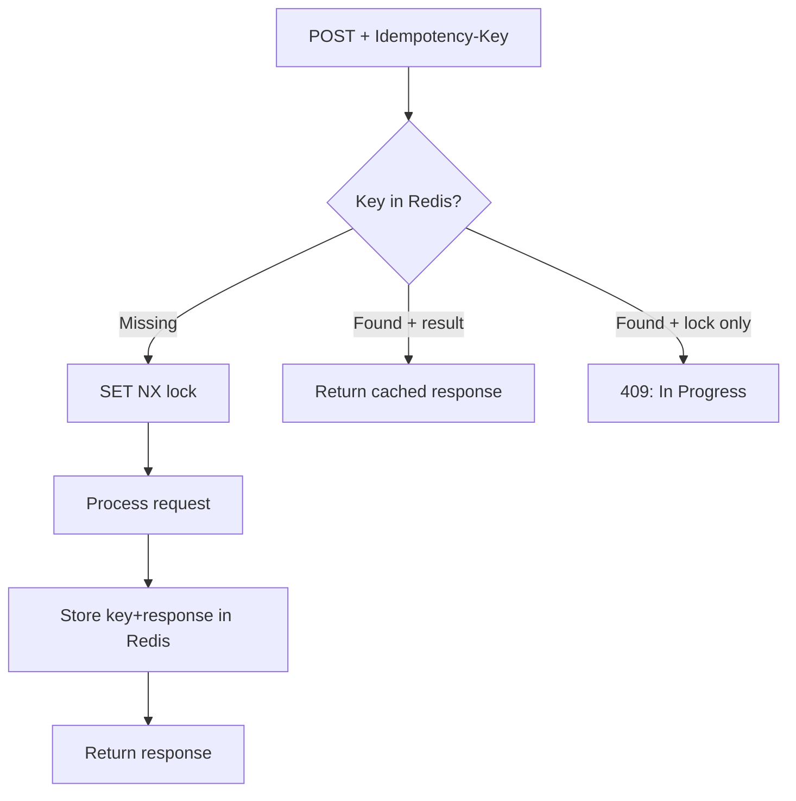

⚡ TL;DR - An API operation is idempotent if calling
it N times produces the same result as calling it once;
GET, HEAD, PUT, and DELETE are idempotent by design;
POST is not (each call creates a new resource); the
production pattern is the `Idempotency-Key` header:
the client generates a UUID per request; the server
stores the key and returns the cached response on
retries, preventing duplicate charges, double-sends,
and duplicate orders.

---

| #030 | Category: HTTP & APIs | Difficulty: ★★★ |
|:---|:---|:---|
| **Depends on:** | HTTP Methods, REST Status Codes | |
| **Used by:** | API Retry and Backoff Strategy, Long-Running Operations | |
| **Related:** | API Rate Limiting, Error Response Design, HTTP Methods | |

---

### 🔥 The Problem This Solves

**WORLD WITHOUT IT:**
A customer clicks "Pay" on an e-commerce site. The
payment request is sent to the API. The network times
out before the response returns. Did the payment go
through? The client does not know. If it retries: two
charges. If it does not retry: the order is lost. The
customer calls support. Was a refund needed? Did the
order ship?

**THE BREAKING POINT:**
Stripe processes millions of payment requests per day.
Mobile networks and internet connections are unreliable.
A request may be sent, processed by the server, and
then the connection drops before the response arrives.
Without idempotency, every timeout becomes a potential
duplicate charge. With millions of transactions, even
a 0.01% timeout rate is thousands of potential duplicate
charges per day.

**THE INVENTION MOMENT:**
Stripe introduced `Idempotency-Key` as a request header.
The client generates a UUID for each business operation
(not each retry - same UUID for all retries of the same
operation). The server stores: key → result. On retry,
the server recognizes the key and returns the stored
result without re-executing. The operation becomes safe
to retry any number of times.

---

### 📘 Textbook Definition

Idempotency (from mathematics) means: applying an
operation multiple times yields the same result as
applying it once. `f(f(x)) = f(x)`. In HTTP: an
idempotent request produces the same server state
whether made once or N times. **HTTP method idempotency
by spec:** GET (idempotent, safe), HEAD (idempotent,
safe), PUT (idempotent: sets resource to specific state),
DELETE (idempotent: resource is absent after first call;
subsequent calls also find it absent), POST (not
idempotent by default: each call creates a new resource).
**Idempotency-Key:** a client-generated unique key
(UUID4) per logical operation. The server stores the
key → response mapping. On retry with the same key,
the stored response is returned without re-processing.
Typically stored for 24-48 hours.

---

### ⏱️ Understand It in 30 Seconds

**One line:**
Idempotency means "retry safely": calling the same
operation multiple times has the same effect as calling
it once - no duplicate charges, no duplicate orders.

**One analogy:**
> Idempotency is like a light switch that reads its
> own state. A normal POST is like a button: press it
> three times, three things happen. An idempotent PUT
> is like a light switch: whether you flip it "up" once
> or five times, the light is on. The final state is
> the same. An `Idempotency-Key` POST works like: if
> you press the button and are not sure if it worked,
> you can press it again with the same "attempt ID"
> and it will check "did I already process this?" before
> doing anything.

**One insight:**
HTTP methods are idempotent by *specification* but may
not be by *implementation*. A `DELETE /users/1` that
returns 404 on the second call (user already deleted)
is still idempotent by the spec - the end state (user
does not exist) is the same. But if the server throws
500 on the second DELETE, the implementation violates
the idempotency contract. Implementation must match
the specification.

---

### 🔩 First Principles Explanation

**HTTP METHOD IDEMPOTENCY:**

```
Method  Idempotent?  Safe?  Effect
------  -----------  -----  -------
GET     Yes          Yes    Read only; no side effects
HEAD    Yes          Yes    Read only; response headers only
PUT     Yes          No     Sets resource to specific state
DELETE  Yes          No     Removes resource (absent=same)
POST    No           No     Creates new resource each call
PATCH   Varies       No     Depends on implementation
```

**PUT IS IDEMPOTENT - HOW:**
```
PUT /api/users/1
{"name": "Alice", "email": "alice@example.com"}

Call 1: user updated to {"name":"Alice","email":"alice@..."}
Call 2: user updated to {"name":"Alice","email":"alice@..."}
Call 3: user updated to {"name":"Alice","email":"alice@..."}
→ Same final state each time. Idempotent.

Contrast PATCH (increment):
PATCH /api/users/1
{"increment_login_count": 1}
Call 1: login_count = 1
Call 2: login_count = 2
Call 3: login_count = 3
→ Different state each time. NOT idempotent.
```

**IDEMPOTENCY-KEY PATTERN:**

```
Client                    Server               DB
  |                         |                  |
  |-- POST /charges ------->|                  |
  |   Idempotency-Key: xyz  |                  |
  |                         |-- Check key xyz->|
  |                         |<-- Not found --  |
  |                         |-- Process ------>|
  |                         |-- Store xyz+resp>|
  |<-- 200 {charge_id:123}--|                  |
  |                         |                  |
  | [Network error; retry]  |                  |
  |                         |                  |
  |-- POST /charges ------->|                  |
  |   Idempotency-Key: xyz  |                  |
  |                         |-- Check key xyz->|
  |                         |<-- Found! ------  |
  |<-- 200 {charge_id:123}--|  (cached response)|
  |   (same response, no    |                  |
  |    duplicate charge)    |                  |
```

---

### 🧪 Thought Experiment

**SCENARIO: Payment without idempotency**

Day at a payment processor:
- 10 million payment requests processed
- 0.05% network timeout rate = 5,000 timeouts
- Client retry policy: retry on timeout
- Without idempotency: 5,000 potential duplicate charges
- Average charge: $50 → $250,000 of duplicate charges
- Each requires manual refund → support cost
- Customer trust damage: immeasurable

**SCENARIO: Same day WITH idempotency:**
- 5,000 timeouts → 5,000 retries with same Idempotency-Key
- Server recognizes 5,000 duplicate keys → returns cached
  response, no duplicate processing
- Cost: Redis key lookup for each retry (microseconds)
- Result: Zero duplicate charges. No support tickets.

**The math is clear.** The only question is the storage
cost of idempotency keys (UUID → response mapping for
24-48 hours). At 10 million/day, that is 10M small Redis
entries → ~1-2 GB at 100-200 bytes per entry. Cheap.

---

### 🧠 Mental Model / Analogy

> Idempotency-Key is like a restaurant order ticket
> number. When you place an order, the waiter writes
> it on ticket #47. If the waiter goes away and you
> flag down another waiter and say "I placed order #47,"
> they look up #47 in the system and see it is already
> in progress. They do not place a second order. The
> ticket number is your idempotency key. Your business
> operation (the meal) happens exactly once regardless
> of how many waiters you ask.

---

### 📶 Gradual Depth - Five Levels

**Level 1 - What it is (anyone can understand):**
If you click "Pay" and the page times out, you do not
know if the payment went through. Without idempotency,
retrying charges you twice. With idempotency, retrying
safely returns the result of the first attempt without
charging again. Same as checking your bank statement
to see if the payment went through - except the API
does the checking for you automatically.

**Level 2 - How to use it (junior developer):**
For payment, order creation, or any non-reversible
POST operation: require `Idempotency-Key` header.
Client generates UUID4 per user intent (not per retry).
Server: check key in Redis before processing. If found:
return stored response. If not found: process, store
result in Redis with 24h TTL, return response.

**Level 3 - How it works (mid-level engineer):**
Atomic key reservation: use `SET key "" NX EX 3600`
(Redis SET if Not eXists). If SET returns OK: process
and store result. If SET returns nil: key exists - either
another request is in-flight (wait and retry) or result
already stored. Handle concurrent requests with the
same key: first writer wins; subsequent requests wait
for the stored result (use Redis Pub/Sub or polling).

**Level 4 - Why it was designed this way (senior/staff):**
The Idempotency-Key pattern shifts the deduplication
responsibility to the server, where it is safe. Client-
side deduplication fails because clients can be different
(different app instances, the user refreshed the browser).
Server-side deduplication fails if not atomic (two servers
can both receive the same key simultaneously and both
conclude "key not found" before either stores the result).
Redis atomic SET NX guarantees exactly-one-wins semantics.
The 24-48h TTL balances storage cost against the retry
window users expect (network retries happen in seconds;
24h covers mobile app background retries and B2B job
retries).

**Level 5 - Mastery (distinguished engineer):**
Idempotency interacts with distributed transactions.
A payment request may: (1) charge the credit card,
(2) create an order record, (3) send a confirmation
email. If step 2 fails after step 1 succeeds, a retry
with the same Idempotency-Key must not re-charge the
card. This requires the idempotency store to record
partial execution state and resume from the correct
step. Stripe solves this with a saga-like idempotency:
each step in the operation has its own idempotency
check, and the outer key tracks which steps completed.
Full saga pattern with idempotent steps = the only
correct solution for distributed non-idempotent
operations.

---

### ⚙️ How It Works (Mechanism)

**Redis-backed idempotency middleware in FastAPI:**

```python
import redis
import json
import uuid
from fastapi import FastAPI, Request, HTTPException
from fastapi.responses import JSONResponse

r = redis.Redis(host="localhost", port=6379)
TTL = 86400  # 24 hours in seconds
IDEMPOTENCY_KEY_HEADER = "Idempotency-Key"

async def idempotency_middleware(
    request: Request, call_next
):
    # Only apply to POST, PATCH (non-idempotent methods)
    if request.method not in ("POST", "PATCH"):
        return await call_next(request)

    key_header = request.headers.get(IDEMPOTENCY_KEY_HEADER)
    if not key_header:
        # Require the header for non-idempotent requests
        return JSONResponse(
            status_code=400,
            content={
                "type": "https://api.example.com/errors/validation",
                "title": "Idempotency-Key required",
                "status": 400,
                "detail": (
                    "POST requests require an "
                    "Idempotency-Key header."
                )
            }
        )

    redis_key = f"idempotency:{key_header}"

    # Atomic SET NX: first request wins
    lock_acquired = r.set(
        f"{redis_key}:lock", "processing",
        nx=True, ex=30  # 30s processing timeout
    )

    if not lock_acquired:
        # Key exists: check if result is stored
        stored = r.get(redis_key)
        if stored:
            data = json.loads(stored)
            return JSONResponse(
                status_code=data["status_code"],
                content=data["body"],
                headers={"Idempotent-Replayed": "true"}
            )
        # In-flight: return 409 Conflict
        return JSONResponse(
            status_code=409,
            content={
                "type": "https://api.example.com/errors/conflict",
                "title": "Request In Progress",
                "status": 409,
                "detail": "A request with this key is already processing."
            }
        )

    try:
        response = await call_next(request)
        # Store the result
        body = b""
        async for chunk in response.body_iterator:
            body += chunk
        r.set(
            redis_key,
            json.dumps({
                "status_code": response.status_code,
                "body": json.loads(body)
            }),
            ex=TTL
        )
        return JSONResponse(
            status_code=response.status_code,
            content=json.loads(body)
        )
    finally:
        r.delete(f"{redis_key}:lock")
```



---

### 🔄 The Complete Picture - End-to-End Flow

**Idempotency scope: what is deduplicated**

```python
# Payment service: idempotent charge creation
@app.post("/api/v1/charges")
async def create_charge(
    charge_data: ChargeRequest,
    request: Request
):
    idempotency_key = request.headers.get("Idempotency-Key")
    # Scope: key is scoped to user + operation
    # (prevents cross-user key reuse attacks)
    scoped_key = f"{current_user.id}:{idempotency_key}"

    # idempotency middleware handles lookup/storage
    # at this point: we know this is a new request

    charge = payment_processor.charge(
        amount=charge_data.amount,
        card_token=charge_data.card_token,
        idempotency_key=scoped_key  # pass to processor too
    )
    return {"charge_id": charge.id, "status": charge.status}
```

---

### 💻 Code Example

**Example 1 - BAD: Retry without idempotency causes duplication**

```python
import httpx
import time

# BAD: Retry on timeout; no idempotency key
def create_order_bad(order_data: dict) -> dict:
    for attempt in range(3):
        try:
            response = httpx.post(
                "https://api.example.com/orders",
                json=order_data,
                timeout=5.0
            )
            return response.json()
        except httpx.TimeoutException:
            time.sleep(1)
    raise Exception("Order failed after 3 retries")
    # DANGER: On timeout, server may have processed
    # the order. Retry creates a duplicate order.

# GOOD: Generate idempotency key per user intent
import uuid

def create_order_good(order_data: dict) -> dict:
    # Generate ONCE per user intent (not per retry)
    idempotency_key = str(uuid.uuid4())
    for attempt in range(3):
        try:
            response = httpx.post(
                "https://api.example.com/orders",
                json=order_data,
                headers={
                    "Idempotency-Key": idempotency_key
                },
                timeout=5.0
            )
            return response.json()
        except httpx.TimeoutException:
            time.sleep(2 ** attempt)  # exponential backoff
    raise Exception("Order failed after 3 retries")
    # SAFE: All retries use same key; server deduplicates.
```

---

**Example 2 - DELETE idempotency in practice**

```python
# DELETE should return the same result on retries
# Bad implementation:
@app.delete("/api/users/{user_id}")
def delete_user_bad(user_id: int):
    user = db.get_user(user_id)
    if not user:
        raise HTTPException(
            status_code=404, detail="User not found"
        )
    db.delete(user)
    return {"deleted": True}
# PROBLEM: Second DELETE returns 404. Client cannot
# distinguish "deleted successfully" from "never existed."
# Breaks retry logic.

# Good implementation: idempotent DELETE
@app.delete("/api/users/{user_id}")
def delete_user_good(user_id: int):
    user = db.get_user(user_id)
    if user:
        db.delete(user)
    # Return 200/204 even if already deleted
    # End state (user absent) is the same either way
    return Response(status_code=204)
```

---

### ⚖️ Comparison Table

| Approach | Idempotent? | Safe to Retry? | Use Case |
|:---|:---|:---|:---|
| GET | Yes (spec) | Yes | Reads |
| PUT | Yes (spec) | Yes | Full replacement |
| DELETE | Yes (spec, if 204 on re-delete) | Yes | Remove resource |
| POST | No (default) | No | Create resource |
| POST + Idempotency-Key | Yes (by implementation) | Yes | Payments, orders |
| PATCH (increment) | No | No | Counters, increments |
| PATCH (set) | Yes | Yes | Partial updates to specific value |

---

### ⚠️ Common Misconceptions

| Misconception | Reality |
|:---|:---|
| GET is idempotent therefore safe to retry aggressively | GET reads may trigger side effects in poor implementations (audit logging, analytics recording, cache-warming jobs). These are spec violations but exist in production. Aggressive retries can generate unexpected read load. |
| DELETE returns 404 on retry; that is correct | RFC 7231 says DELETE is idempotent. If a client retries and gets 404, it cannot distinguish "I just deleted this" from "this never existed." Best practice: return 204 on re-delete (consistent idempotent behavior). |
| Same Idempotency-Key for different operations | Idempotency-Key scopes to a single user + single operation type. A key from "create order" must not be reused for "cancel order." Scope keys per user to prevent cross-user key injection attacks. |
| Idempotency-Key solves distributed transaction problems | It prevents duplicate execution of the entry point. It does NOT solve partial failures in multi-step operations. A saga pattern is needed for distributed transactions where individual steps must each be idempotent. |

---

### 🚨 Failure Modes & Diagnosis

**Cross-user idempotency key injection**

**Symptom:** User B's request is returning User A's
cached response. User B submitted the same Idempotency-Key
as User A (e.g., constant key like "test-key").

**Root Cause:** Idempotency key not scoped to authenticated
user. Key lookup uses raw header value without user scope.

**Diagnostic:**
```bash
# Check Redis key structure
redis-cli keys "idempotency:*"
# If keys are: idempotency:test-key (not user-scoped)
# → vulnerability: different users can share keys
# Fix: key = idempotency:{user_id}:{idempotency_key_header}
```

**Fix:** Scope idempotency keys to `user_id:key` in Redis.
Return 400 if key is not a valid UUID format (prevents
trivial collision by guessing common strings).

---

**Redis down: all requests fail due to idempotency check**

**Symptom:** During Redis downtime, all POST requests
return 500. No requests processed even though the database
is healthy.

**Root Cause:** Idempotency check is a hard dependency
in the request path. Redis unavailability blocks all
non-idempotent operations.

**Fix:** Circuit breaker on idempotency Redis. Fallback
behavior: if Redis is down, still process the request
but log a warning. Accept the risk of duplicates during
Redis outage (rare) vs the certainty of complete outage
(certain). Alert on Redis unavailability immediately.

---

### 🔗 Related Keywords

**Prerequisites (understand these first):**
- `HTTP Methods (GET, POST, PUT, DELETE, PATCH)` -
  method-level idempotency by spec
- `HTTP Status Codes` - 200 vs 201 vs 204 semantics

**Builds On This (learn these next):**
- `API Retry and Backoff Strategy` - when to retry and
  how idempotency makes retries safe
- `Long-Running API Operations` - async job pattern
  that builds on idempotency

---

### 📌 Quick Reference Card

```
┌──────────────────────────────────────────────────────────┐
│ WHAT IT IS   │ Idempotent = calling N times same as      │
│              │ calling once; no duplicate side effects   │
├──────────────┼───────────────────────────────────────────┤
│ PROBLEM IT   │ Network timeouts cause retries which      │
│ SOLVES       │ cause duplicate charges/orders            │
├──────────────┼───────────────────────────────────────────┤
│ KEY INSIGHT  │ Generate Idempotency-Key ONCE per user    │
│              │ intent; reuse same key for all retries    │
├──────────────┼───────────────────────────────────────────┤
│ USE WHEN     │ POST operations that are non-reversible   │
│              │ (payments, orders, sends)                 │
├──────────────┼───────────────────────────────────────────┤
│ IDEMPOTENT   │ GET, HEAD, PUT, DELETE (if 204 on re-del) │
│ BY SPEC      │                                           │
├──────────────┼───────────────────────────────────────────┤
│ ANTI-PATTERN │ Not scoping idempotency key to user;      │
│              │ reusing same key for different operations │
├──────────────┼───────────────────────────────────────────┤
│ ONE-LINER    │ "Client generates UUID per intent;        │
│              │ server stores key→result; retry is safe." │
├──────────────┼───────────────────────────────────────────┤
│ NEXT EXPLORE │ Retry + Backoff → Long-Running Operations │
└──────────────────────────────────────────────────────────┘
```

**If you remember only 3 things:**
1. POST is not idempotent by default. For non-reversible
   POSTs (payments, orders), require an `Idempotency-Key`
   header. Store the key → response mapping in Redis.
   Return cached response on retry.
2. Generate the idempotency key ONCE per user intent.
   Reuse the same key for all retries of the same
   operation. A new key = a new operation.
3. Scope idempotency keys to the authenticated user
   (`user_id:key`) to prevent cross-user key collision
   or injection attacks.

---

### 💎 Transferable Wisdom

**Reusable Engineering Principle:**
"Design operations to be retryable from the start."
Idempotency is a superset of reliability: if an operation
is safe to retry, it is safe against network failures,
client crashes, and timeout ambiguity. This principle
applies to: message queue consumers (process at-least-once
requires idempotent handlers), database upserts (INSERT
OR REPLACE / ON CONFLICT DO UPDATE), Kubernetes
controllers (reconcile loop runs repeatedly; each run
must be idempotent), and Terraform (apply same config
multiple times, same result).

**Where else this pattern applies:**
- Kafka at-least-once delivery: consumers must be
  idempotent (same message may be delivered multiple
  times after failure)
- Terraform: idempotent infrastructure changes (apply
  N times = same state as apply once)
- Kubernetes controllers: the reconciliation loop is
  inherently idempotent (run until desired state matches
  actual state)

---

### 💡 The Surprising Truth

HTTP PUT is the most misused idempotent method. PUT
is supposed to fully replace the resource with the
request body (idempotent). PATCH is for partial updates.
But in practice, many APIs implement "PUT" as "update
only the fields I send" (which is actually PATCH
semantics). This matters because: if a client sends
`PUT /user {"name": "Alice"}` to a "partial update
PUT," it might clear the `email` field that was not
sent. The client assumed PUT would leave other fields
unchanged; the server treats it as a full replacement.
The HTTP spec is unambiguous: PUT = replace the whole
resource. Using PUT for partial updates is a contract
violation that breaks clients expecting spec-compliant
behavior.

---

### ✅ Mastery Checklist

**You've mastered this when you can:**
1. **CLASSIFY** Given a list of HTTP operations, identify
   which are idempotent by spec and which are not.
2. **BUILD** Implement a Redis-backed idempotency
   middleware for POST endpoints, including atomic SET NX,
   TTL, and in-flight request handling.
3. **SECURE** Explain why idempotency keys must be scoped
   to the authenticated user and demonstrate the attack
   that is prevented.
4. **DESIGN** Create an idempotency strategy for a
   multi-step payment saga where each step must be
   independently idempotent.
5. **DIAGNOSE** Identify whether a reported duplicate
   charge was caused by missing idempotency, key not
   scoped to user, or missing atomicity in the key check.

---

### 🎯 Interview Deep-Dive

**Q1: Which HTTP methods are idempotent and why?**

*Why they ask:* Tests HTTP fundamentals and distributed
systems reasoning.

*Strong answer includes:*
- GET, HEAD: read-only, no server state change, trivially
  idempotent.
- PUT: replaces resource with specific body. Call N times
  → same final state. Idempotent.
- DELETE: removes resource. First call removes it; second
  call finds it absent. End state is the same. Idempotent.
  Implementation note: return 204 (not 404) on re-delete
  for consistent idempotent behavior.
- POST: creates a new resource each call (or triggers
  processing). Not idempotent by default.
- PATCH: depends. `SET name=Alice` is idempotent.
  `INCREMENT login_count by 1` is not.
- Key insight: idempotency is a *contract*, not a
  guarantee. A server can violate the contract (a GET
  that has side effects). Design and test explicitly.

**Q2: How do you implement idempotency for a payment
endpoint to prevent duplicate charges?**

*Why they ask:* Tests practical distributed systems
implementation.

*Strong answer includes:*
- Require `Idempotency-Key` header (UUID4).
- Scope key to user: `user_id:idempotency_key` in Redis.
- Atomic SET NX in Redis with TTL (24-48h). First request
  acquires lock, processes, stores response.
- Second request with same key: finds stored response,
  returns it immediately without processing.
- Pass idempotency key to payment processor (e.g., Stripe
  uses it natively) for end-to-end deduplication.
- Handle in-flight: if key lock exists but result not
  stored yet, return 409 (client should retry after brief
  wait).
- Circuit breaker on Redis: fail open (process without
  idempotency) during Redis outage, alert immediately.

**Q3: What is the difference between idempotency and
safety? Why does the distinction matter?**

*Why they ask:* Tests HTTP specification depth.

*Strong answer includes:*
- Safe: no server state modification (GET, HEAD, OPTIONS).
  Safe implies the client is not responsible for side
  effects. Safe operations can be pre-fetched, cached,
  and retried freely.
- Idempotent: same result on multiple calls (GET, HEAD,
  PUT, DELETE). Idempotent does NOT mean no side effects.
  DELETE has side effects (the resource is deleted) but
  is idempotent (calling it again yields the same absent
  state).
- All safe methods are idempotent. Not all idempotent
  methods are safe.
- Why it matters: monitoring tools use safe=false to
  determine when to show a "reload" prompt vs reload
  automatically. Reverse proxies and load balancers use
  idempotent=true to determine which requests are safe
  to retry on backend failure.
