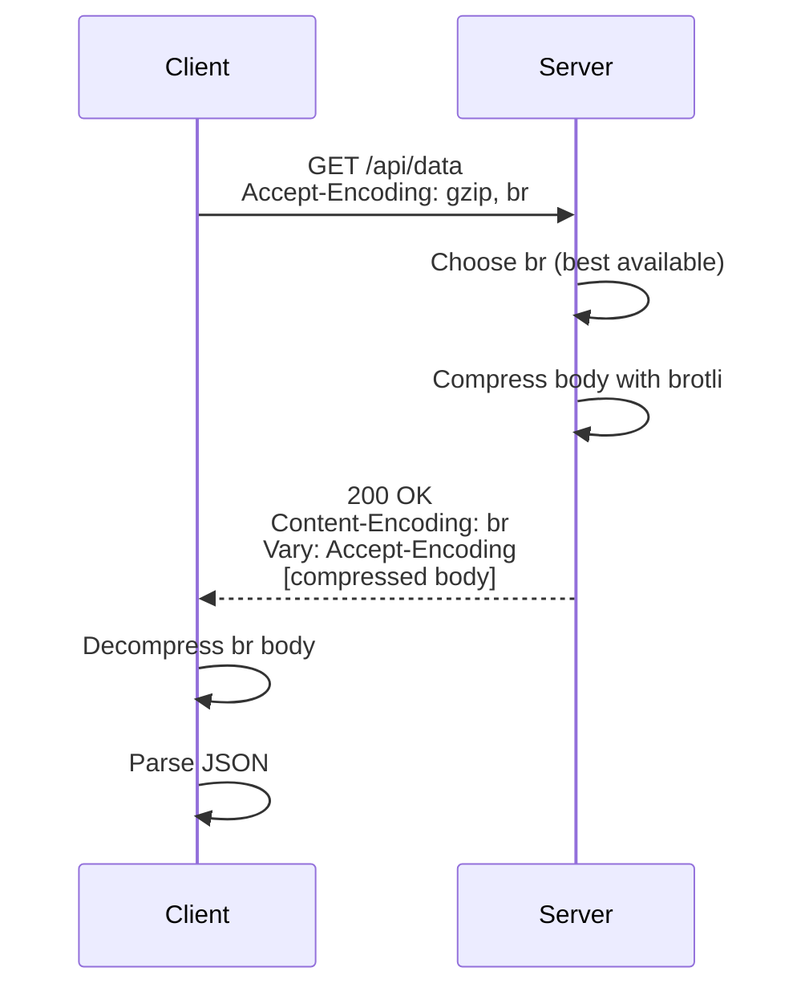

⚡ TL;DR - HTTP compression reduces response size by
encoding the body before transmission; the client
advertises support via `Accept-Encoding: gzip, br,
deflate`; the server compresses and responds with
`Content-Encoding: gzip` (or `br`); gzip is universal
(supported everywhere, ~70% size reduction); brotli
(br) compresses 15-25% better than gzip but requires
HTTPS; never compress already-compressed content
(images, video, zip files) - it makes them larger.

---

| #031 | Category: HTTP & APIs | Difficulty: ★★☆ |
|:---|:---|:---|
| **Depends on:** | HTTP Request Structure, HTTP Response Structure | |
| **Used by:** | HTTP Caching, HTTP Keep-Alive and Connection Reuse | |
| **Related:** | HTTP Caching, HTTP Request Structure, HTTP Response Structure | |

---

### 🔥 The Problem This Solves

**WORLD WITHOUT IT:**
A JSON API response for a list of users with 1,000
entries is 250 KB of text. Over a 4G mobile connection
(10 Mbps, 50ms RTT), that is 200ms of transfer time
plus latency. At 100 requests/second, bandwidth cost
is 25 MB/s of raw JSON. On slow connections (developing
markets, rural areas), uncompressed APIs are painfully
slow. CDN egress costs scale with bytes transferred.

**THE BREAKING POINT:**
Stack Overflow's analysis showed that enabling gzip
compression on their API responses reduced bandwidth
by 70% with negligible CPU cost on modern servers.
For high-traffic APIs, uncompressed responses translate
directly to CDN costs, bandwidth bills, and mobile
user abandonment.

**THE INVENTION MOMENT:**
HTTP/1.1 (RFC 2616, 1999) standardized content
negotiation for encoding: client sends `Accept-Encoding`
with supported algorithms, server compresses and
responds with `Content-Encoding`. No protocol version
upgrade needed; pure header negotiation. Brotli (2016,
RFC 7932) improved on gzip's Deflate algorithm using
a static dictionary of common web content.

---

### 📘 Textbook Definition

HTTP compression encodes the response body using a
compression algorithm before transmission. **Content
negotiation:** client advertises supported encodings
via `Accept-Encoding: gzip, br, deflate, identity`;
server selects the best supported algorithm and responds
with `Content-Encoding: gzip` (or `br`, `deflate`).
`Content-Length` reflects the compressed size.
**Algorithms:** `gzip` (DEFLATE algorithm; RFC 1952;
universal support); `br` (Brotli; RFC 7932; 15-25%
better than gzip; HTTPS-only in browsers); `deflate`
(raw DEFLATE; ambiguous implementation; avoid in
practice); `identity` (no compression). **Transfer-
Encoding vs Content-Encoding:** `Content-Encoding` is
end-to-end (client must decompress); `Transfer-Encoding`
is hop-by-hop (proxy strips before forwarding).

---

### ⏱️ Understand It in 30 Seconds

**One line:**
Compression is HTTP's zip file: send the same data in
fewer bytes; client unzips; network and CDN costs drop
60-80%.

**One analogy:**
> HTTP compression is like shipping foam peanuts in a
> vacuum bag. The foam peanuts (your JSON) take a lot
> of space when loose. Vacuum-sealed, they compress
> to 20% of their original volume. The recipient opens
> the bag, peanuts expand back, same content. The trip
> was 80% cheaper.

**One insight:**
Compression is not free: CPU is traded for bandwidth.
On modern servers (AES-NI, dedicated compression
hardware), the CPU cost is negligible for text
responses. The CPU break-even is around 1-2 KB: very
small responses compress slower than they're served
uncompressed. For JSON APIs with typical response
sizes (>10 KB), compression always wins.

---

### 🔩 First Principles Explanation

**CONTENT NEGOTIATION FLOW:**
```
Client                             Server
  |                                  |
  |-- GET /api/users --------------->|
  |   Accept-Encoding: gzip, br      |
  |                                  |
  |                                  |-- Compress body
  |<-- 200 OK -----------------------|   (gzip or br)
  |   Content-Encoding: gzip         |
  |   Content-Type: application/json |
  |   Content-Length: 4821           |
  |   [gzip-compressed body]         |
  |                                  |
  |-- Decompress body                |
  |-- Parse JSON                     |
```

**ALGORITHM COMPARISON:**
```
Algorithm  Browser  Proxy  Speed    Ratio  Notes
---------  -------  -----  -------  -----  ------
gzip       All      All    Fast     ~70%   Universal
brotli     Modern   HTTPS  Medium   ~80%   Best ratio
deflate    All      All    Fast     ~70%   Avoid (ambiguous)
identity   All      All    None     0%     No compression
zstd       Limited  No     Fastest  ~78%   Emerging (HTTP/3)

Compression ratio = % size reduction from original.
```

**WHAT COMPRESSES WELL vs POORLY:**
```
Compresses well (use compression):
  ✓ JSON (text, repetitive keys)
  ✓ HTML (text, repetitive tags)
  ✓ CSS (text)
  ✓ JavaScript (text)
  ✓ SVG (XML text)
  ✓ CSV (text)

Does NOT compress well (skip compression):
  ✗ JPEG/PNG/WebP (already compressed)
  ✗ ZIP/gzip/brotli (already compressed)
  ✗ MP4/MP3 (compressed media)
  ✗ PDF (often already compressed)
  → Compressing these INCREASES size by 0.1-5%
    due to compression headers/framing overhead
```

---

### 🧪 Thought Experiment

**SCENARIO: 100K/day API, average 200KB JSON response**

Without compression:
```
Bandwidth per day = 100,000 × 200KB = 20 GB/day
CDN egress cost (~$0.08/GB) = $1.60/day = $584/year
Mobile transfer time (10 Mbps) = ~160ms per response
```

With gzip (70% reduction → 60KB average):
```
Bandwidth per day = 100,000 × 60KB = 6 GB/day
CDN egress cost = $0.48/day = $175/year
Mobile transfer time = ~48ms per response
Savings: $409/year + faster mobile experience
CPU cost: ~1-2ms per compression on modern server
```

With brotli (80% reduction → 40KB average):
```
Bandwidth per day = 100,000 × 40KB = 4 GB/day
CDN egress cost = $0.32/day = $117/year
Mobile transfer time = ~32ms per response
Additional savings vs gzip: $58/year
CPU cost: ~3-5ms per compression
```

The CPU cost is dwarfed by bandwidth savings and
user experience improvement at any scale.

---

### 🧠 Mental Model / Analogy

> HTTP compression is like a bilingual dictionary with
> abbreviations. Instead of writing "the" every time,
> the encoder writes "1". Instead of writing `"user_id":`
> 847 times in the response, the encoder writes a short
> token. Gzip and Brotli analyze the byte stream and
> build a dictionary of recurring patterns, replacing
> long patterns with short codes. JSON is ideal for
> this because it has highly repetitive keys ("id",
> "name", "email") that compress extremely well.

---

### 📶 Gradual Depth - Five Levels

**Level 1 - What it is (anyone can understand):**
When you download a file, browsers and servers can
agree to "zip" the file before sending it and "unzip"
it on arrival. JSON APIs use this to send data faster
and cheaper. The JSON itself never changes - only the
bytes being transmitted.

**Level 2 - How to use it (junior developer):**
Enable gzip/brotli in your web server or API framework.
Check that the server returns `Content-Encoding: gzip`
for text responses. Skip compression for images and
binary files. Set a minimum size threshold (skip for
responses < 1 KB where overhead exceeds savings).

**Level 3 - How it works (mid-level engineer):**
Content negotiation: server inspects `Accept-Encoding`
header, picks best available algorithm, compresses the
response body, sets `Content-Encoding` and `Vary:
Accept-Encoding` headers. `Vary: Accept-Encoding`
is critical for CDN caching: without it, the CDN
caches the compressed response and serves it to
clients that send no Accept-Encoding (they receive
garbled binary).

**Level 4 - Why it was designed this way (senior/staff):**
`Content-Encoding` is end-to-end: the server compresses
and the final client decompresses. Any intermediate
proxy must pass the compressed data through. Contrast
with `Transfer-Encoding: chunked` which is hop-by-hop:
each proxy may unchunk and rechunk. The separation
enables proxies to cache compressed content and serve
it directly without decompression (CDN stores gzip
body, serves it as-is to gzip-capable clients).
This is why `Vary: Accept-Encoding` matters: the CDN
must store separate cache entries for gzip and non-gzip.

**Level 5 - Mastery (distinguished engineer):**
Dynamic vs static compression: dynamic compression
(compress each response at request time) uses CPU per
request; static compression (pre-compress static assets
at build time, serve the .gz file directly) has zero
runtime CPU cost. Nginx `gzip_static on` serves
`file.js.gz` if it exists, falling back to dynamic
compression. For static assets (JS bundles, CSS), pre-
compress both gzip and brotli at build time; Nginx
serves the correct variant based on Accept-Encoding.
Brotli pre-compression reduces CDN cost by 15-25%
over gzip with zero runtime CPU. For APIs, dynamic
brotli compression is appropriate since response content
is not pre-deterministic.

---

### ⚙️ How It Works (Mechanism)

**Nginx configuration for API + static assets:**

```nginx
# Dynamic compression for API responses
http {
    gzip on;
    gzip_types
        application/json
        application/javascript
        text/html
        text/css
        text/plain;
    gzip_min_length 1024;  # Skip compression < 1KB
    gzip_comp_level 6;     # Balance CPU vs ratio (1-9)
    gzip_vary on;          # Sets Vary: Accept-Encoding

    # Brotli (requires ngx_brotli module)
    brotli on;
    brotli_types application/json text/html;
    brotli_comp_level 4;   # Lower level for dynamic
    brotli_min_length 1024;

    # Static assets: serve pre-compressed if available
    gzip_static on;        # Serve .gz files directly
    # brotli_static on;    # Serve .br files directly
}
```



---

### 🔄 The Complete Picture - End-to-End Flow

**Python FastAPI with manual brotli fallback:**

```python
from fastapi import FastAPI, Request, Response
from fastapi.responses import JSONResponse
import gzip
import json

try:
    import brotli
    BROTLI_AVAILABLE = True
except ImportError:
    BROTLI_AVAILABLE = False

app = FastAPI()

def compress_response(
    data: dict,
    accept_encoding: str
) -> tuple[bytes, str]:
    """Compress data based on Accept-Encoding."""
    body = json.dumps(data).encode("utf-8")

    if "br" in accept_encoding and BROTLI_AVAILABLE:
        return brotli.compress(body), "br"
    elif "gzip" in accept_encoding:
        return gzip.compress(body), "gzip"
    else:
        return body, "identity"

@app.get("/api/large-dataset")
async def get_large_dataset(request: Request):
    accept_encoding = request.headers.get(
        "Accept-Encoding", ""
    )
    data = {"items": list(range(10000))}
    compressed_body, encoding = compress_response(
        data, accept_encoding
    )

    headers = {
        "Content-Encoding": encoding,
        "Vary": "Accept-Encoding",
        "Content-Type": "application/json"
    }
    if encoding == "identity":
        headers.pop("Content-Encoding", None)

    return Response(
        content=compressed_body,
        headers=headers,
        media_type="application/json"
    )
```

---

### 💻 Code Example

**Example 1 - BAD: Compressing already-compressed content**

```python
# BAD: Compressing all content-types including images
@app.middleware("http")
async def bad_compress_all(request, call_next):
    response = await call_next(request)
    # WRONG: compresses images, PDFs, zip files
    # Increases their size + wastes CPU
    body = await response.body()
    compressed = gzip.compress(body)
    return Response(
        content=compressed,
        headers={"Content-Encoding": "gzip"}
    )

# GOOD: Only compress text-based content types
COMPRESSIBLE_TYPES = {
    "application/json",
    "application/javascript",
    "text/html",
    "text/css",
    "text/plain",
    "image/svg+xml"
}
MIN_COMPRESS_SIZE = 1024  # bytes

@app.middleware("http")
async def smart_compress(request, call_next):
    response = await call_next(request)
    content_type = response.headers.get(
        "Content-Type", ""
    ).split(";")[0].strip()

    if content_type not in COMPRESSIBLE_TYPES:
        return response  # Skip images, zip, etc.

    body = await response.body()
    if len(body) < MIN_COMPRESS_SIZE:
        return response  # Skip tiny responses

    accept_encoding = request.headers.get(
        "Accept-Encoding", ""
    )
    if "gzip" in accept_encoding:
        compressed = gzip.compress(body, compresslevel=6)
        # Only compress if actually smaller
        if len(compressed) < len(body):
            response.headers["Content-Encoding"] = "gzip"
            response.headers["Vary"] = "Accept-Encoding"
            return Response(
                content=compressed,
                headers=dict(response.headers)
            )
    return response
```

---

**Example 2 - Diagnosing compression in production**

```bash
# Check if server is returning compressed responses
curl -v -H "Accept-Encoding: gzip, br" \
  https://api.example.com/users | wc -c
# vs
curl -v https://api.example.com/users | wc -c
# If compressed: first output should be much smaller

# Check response headers
curl -I -H "Accept-Encoding: gzip, br" \
  https://api.example.com/users
# Should see: Content-Encoding: gzip (or br)
# and: Vary: Accept-Encoding

# Measure compression ratio
curl -s -H "Accept-Encoding: gzip" \
  https://api.example.com/users > /tmp/compressed.gz
wc -c /tmp/compressed.gz
curl -s https://api.example.com/users | wc -c
# Ratio = compressed_size / uncompressed_size
```

---

### ⚖️ Comparison Table

| Algorithm | Compression Ratio | CPU Cost | Browser Support | Notes |
|:---|:---|:---|:---|:---|
| gzip | ~70% | Low | All | Universal; use as default |
| brotli | ~80% | Medium | Modern + HTTPS | Best for APIs; HTTPS only |
| deflate | ~70% | Low | All | Avoid (ambiguous implementation) |
| identity | 0% | None | All | No compression |
| zstd | ~78% | Very Low | Limited | Emerging; HTTP/3 candidate |

---

### ⚠️ Common Misconceptions

| Misconception | Reality |
|:---|:---|
| Brotli works without HTTPS | Browsers only use brotli over HTTPS. Proxies and servers can use brotli over HTTP, but browser clients will not send `br` in `Accept-Encoding` for plain HTTP requests. |
| Missing `Vary: Accept-Encoding` is a minor issue | Critical bug for CDN caching. Without `Vary: Accept-Encoding`, the CDN caches the first response variant (compressed or not) and serves it to all clients. Non-gzip clients receive binary garbage. |
| Compress everything for maximum savings | Compressing already-compressed content (JPEG, MP4, ZIP) makes it larger. The compression framing overhead (gzip header, trailer) exceeds any savings on pre-compressed data. Always check content type before compressing. |
| Dynamic compression and CDN caching conflict | They work together IF the server sets `Vary: Accept-Encoding`. The CDN stores separate cache entries for each encoding. The server's compressed response is cached once per encoding, served to all clients. |

---

### 🚨 Failure Modes & Diagnosis

**Missing `Vary: Accept-Encoding` causes CDN serving corrupted responses**

**Symptom:** Clients that send no `Accept-Encoding` (command-line tools, old clients) receive garbled binary responses for cached API endpoints. Works fine for direct server requests (cache miss), fails for CDN-cached responses (cache hit).

**Root Cause:** Server returns `Content-Encoding: gzip` without `Vary: Accept-Encoding`. CDN caches the compressed response and serves it to all clients regardless of their Accept-Encoding.

**Diagnostic:**
```bash
# Test via CDN (cache hit path)
curl -v https://cdn.example.com/api/data
# If Content-Encoding: gzip in response but your client
# didn't send Accept-Encoding: gzip → corrupted binary

# Check cache headers
curl -I https://cdn.example.com/api/data
# Look for: Vary: Accept-Encoding (should be present)
# If missing: fix server to add Vary header
```

**Fix:** Add `Vary: Accept-Encoding` to every compressed response. CDN immediately splits its cache by encoding.

---

**Double compression: proxy + server both compress**

**Symptom:** Response body is binary garbage even on
clients that support gzip. The body appears compressed
but decompression fails.

**Root Cause:** Nginx proxy is compressing the response
(adding `Content-Encoding: gzip`) AND the upstream
application server is also compressing (adding a second
`Content-Encoding: gzip`). Client decompresses once,
still has gzip-compressed data.

**Diagnostic:**
```bash
curl -v -H "Accept-Encoding: gzip" \
  https://api.example.com/data 2>&1 | grep "Content-Encoding"
# If you see multiple Content-Encoding headers or
# decompression fails → double compression

# Check if app server is also compressing:
# Disable Nginx gzip temporarily and test directly
```

**Fix:** Compress at ONE layer only. Common pattern: disable gzip in the application server (`gzip off` in FastAPI/Django), enable it at the Nginx proxy layer.

---

### 🔗 Related Keywords

**Prerequisites (understand these first):**
- `HTTP Request Structure` - Accept-Encoding header
- `HTTP Response Structure` - Content-Encoding header

**Builds On This (learn these next):**
- `HTTP Caching` - CDN caching of compressed responses
- `HTTP Keep-Alive and Connection Reuse` - connection-level optimizations

---

### 📌 Quick Reference Card

```
┌──────────────────────────────────────────────────────────┐
│ WHAT IT IS   │ Server compresses response body;          │
│              │ client decompresses. Negotiated via       │
│              │ Accept-Encoding / Content-Encoding        │
├──────────────┼───────────────────────────────────────────┤
│ PROBLEM IT   │ Large JSON responses consume bandwidth,   │
│ SOLVES       │ increase latency, raise CDN costs         │
├──────────────┼───────────────────────────────────────────┤
│ KEY INSIGHT  │ Always set Vary: Accept-Encoding or CDN   │
│              │ serves compressed data to all clients     │
├──────────────┼───────────────────────────────────────────┤
│ USE WHEN     │ Text responses > 1KB (JSON, HTML, CSS,    │
│              │ JavaScript); skip for images/binaries     │
├──────────────┼───────────────────────────────────────────┤
│ ALGORITHMS   │ gzip: universal; br: 15-25% better,       │
│              │ HTTPS only; never compress binaries       │
├──────────────┼───────────────────────────────────────────┤
│ ANTI-PATTERN │ Compressing already-compressed content;   │
│              │ forgetting Vary: Accept-Encoding for CDN  │
├──────────────┼───────────────────────────────────────────┤
│ ONE-LINER    │ "Accept-Encoding → negotiate;             │
│              │ Content-Encoding → confirmed; Vary →      │
│              │ CDN cache correctly."                     │
├──────────────┼───────────────────────────────────────────┤
│ NEXT EXPLORE │ HTTP Caching → HTTP Keep-Alive            │
└──────────────────────────────────────────────────────────┘
```

**If you remember only 3 things:**
1. Set `Vary: Accept-Encoding` on every compressed
   response. Without it, CDNs serve compressed data to
   clients that cannot decompress it.
2. Never compress already-compressed content types
   (JPEG, PNG, ZIP, MP4). It makes them larger.
3. gzip is universal; brotli gives 15-25% better
   compression but requires HTTPS for browser support.

---

### 💎 Transferable Wisdom

**Reusable Engineering Principle:**
"Negotiate capabilities, not assumptions." The Accept-
Encoding / Content-Encoding pattern is the same as
Accept-Language / Content-Language, Accept / Content-
Type. HTTP content negotiation is a general mechanism
for server-client capability discovery. The same pattern
applies to: database driver protocol negotiation (client
advertises supported auth methods), gRPC codec
negotiation, WebSocket extension negotiation (per-message
deflate), and TLS cipher suite negotiation.

**Where else this pattern applies:**
- Database wire protocols: client advertises supported
  features; server picks the best match (PostgreSQL
  startup message)
- WebSocket per-message deflate: same header negotiation
  for WebSocket frame compression
- gRPC message compression: client sends
  `grpc-accept-encoding: gzip, identity`

---

### 💡 The Surprising Truth

The `deflate` value in `Accept-Encoding: deflate` does
not mean what you think. The DEFLATE algorithm is the
core of both gzip and zlib compression. When a browser
sends `deflate` in Accept-Encoding, it expects zlib-
wrapped DEFLATE (RFC 1950). But many early server
implementations returned raw DEFLATE (RFC 1951) instead.
This ambiguity meant `deflate` never had reliable cross-
implementation support. The HTTP specification has
acknowledged this as a historical mistake. Modern
recommendation: use `gzip` or `br`, never `deflate`.
Despite being in the HTTP spec since 1999, `deflate`
is effectively deprecated due to this implementation
ambiguity.

---

### ✅ Mastery Checklist

**You've mastered this when you can:**
1. **CONFIGURE** Enable gzip and brotli compression in
   Nginx with correct content-type filtering and min-
   size thresholds.
2. **DIAGNOSE** Identify the CDN bug caused by missing
   `Vary: Accept-Encoding` and explain the fix.
3. **EXPLAIN** Why the `deflate` encoding value is
   avoided in practice despite being in the HTTP spec.
4. **MEASURE** Use curl to verify a server is returning
   compressed responses and calculate the compression
   ratio.
5. **DESIGN** Explain how static pre-compression (gzip
   + brotli at build time) reduces CDN cost with zero
   runtime CPU overhead.

---

### 🎯 Interview Deep-Dive

**Q1: How does HTTP compression work? What headers are
involved?**

*Why they ask:* Tests HTTP header and content negotiation
knowledge.

*Strong answer includes:*
- Client sends `Accept-Encoding: gzip, br, deflate`
  in request headers.
- Server compresses response body, sets `Content-Encoding:
  gzip` (or `br`), `Vary: Accept-Encoding`.
- `Content-Length` reflects compressed size.
- Client (browser or HTTP client library) automatically
  decompresses based on `Content-Encoding`.
- Key details: gzip = universal; brotli = better ratio,
  HTTPS-only in browsers; never compress binary content.

**Q2: What is `Vary: Accept-Encoding` and why is it
critical for CDN caching?**

*Why they ask:* Tests HTTP caching + CDN knowledge.

*Strong answer includes:*
- `Vary` tells CDNs which request headers to include
  in the cache key. Without `Vary: Accept-Encoding`,
  the CDN uses the URL as the sole cache key.
- Scenario: Client A sends `Accept-Encoding: gzip` →
  server returns compressed response → CDN caches it.
  Client B sends no `Accept-Encoding` → CDN returns
  the cached compressed response → Client B receives
  binary garbage.
- Fix: `Vary: Accept-Encoding` causes the CDN to store
  separate entries for gzip vs identity, serving the
  correct variant per client capability.
- Extension: `Vary: Accept-Language` for localized
  content; `Vary: Accept` for content type negotiation.

**Q3: When should you NOT use HTTP compression?**

*Why they ask:* Tests practical judgment about when to
apply optimizations.

*Strong answer includes:*
- Already-compressed content: JPEG, PNG, WebP, MP4,
  MP3, ZIP, PDF. Compression overhead (header bytes,
  CPU, slight size increase) exceeds any benefit.
- Very small responses (< 1KB): compression framing
  overhead may equal or exceed the payload savings.
  Threshold is typically 1-2 KB.
- Time-sensitive streaming: real-time price tickers
  or event streams where compression latency (buffering
  data before compressing) adds unacceptable delay.
  Solution: stream without compression or use a
  stream-compatible compressor that flushes frequently.
- TLS CPU budget: on extremely CPU-constrained servers
  (embedded systems), compression + TLS may exceed
  budget. Rare for modern hardware but valid for IoT.
