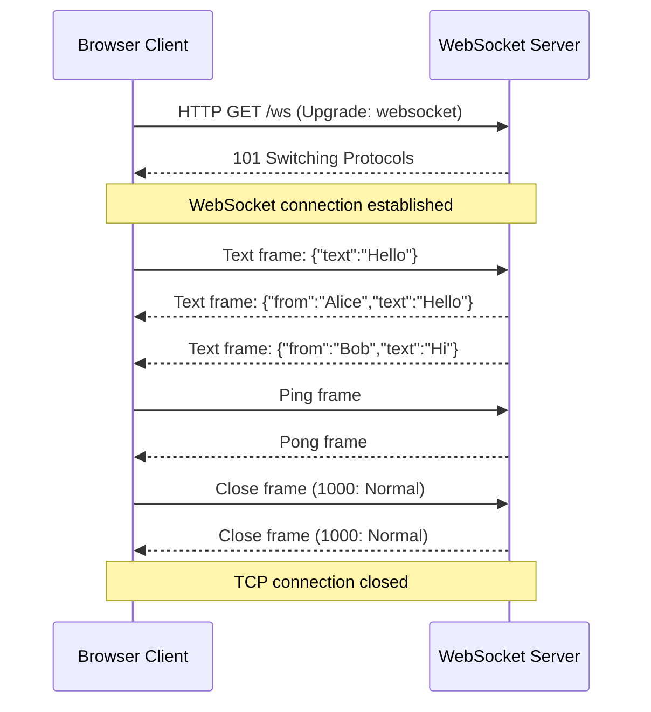

⚡ TL;DR - WebSocket is a full-duplex, persistent
connection between client and server over a single TCP
connection; it starts as an HTTP request (upgrade
handshake), then "upgrades" to the WebSocket protocol
(RFC 6455); unlike HTTP, both sides can send messages
at any time without waiting for a request; ideal for
real-time use cases (chat, live dashboards, multiplayer
games, trading terminals); the main operational cost
is stateful connections - each active connection holds
memory on the server, preventing horizontal scaling
without sticky sessions or a pub/sub broker.

---

| #032 | Category: HTTP & APIs | Difficulty: ★★☆ |
|:---|:---|:---|
| **Depends on:** | HTTP/1.1 Fundamentals, HTTP Request Headers | |
| **Used by:** | Long Polling vs SSE vs WebSocket, WebSocket Protocol Internals | |
| **Related:** | Server-Sent Events, Long Polling vs SSE vs WebSocket, HTTP/1.1 | |

---

### 🔥 The Problem This Solves

**WORLD WITHOUT IT:**
Real-time features over HTTP required polling: the
client sends a request every second to ask "any updates?"
Even when there is nothing new, the client wastes
bandwidth and server resources. A chat application
with 10,000 active users polling every second = 10,000
HTTP requests per second just to check for new messages.
Server load scales with users, not with actual messages.

**THE BREAKING POINT:**
Online multiplayer games, financial trading platforms,
and collaborative editing tools (Google Docs) required
sub-100ms latency with bidirectional messages. HTTP
polling had a fundamental issue: minimum latency equals
polling interval. Reducing the interval (aggressive
polling = 100ms) created unbearable server load.

**THE INVENTION MOMENT:**
WebSocket (RFC 6455, 2011): a single HTTP connection
upgraded to a persistent TCP channel where both client
and server can send messages at any time. No polling,
no connection overhead per message, no half-duplex
limitation. The upgrade happens via HTTP/1.1's Upgrade
mechanism, making WebSocket compatible with existing
HTTP infrastructure (proxies, firewalls, load balancers).

---

### 📘 Textbook Definition

WebSocket (RFC 6455) provides a full-duplex, persistent
communication channel over a single TCP connection.
**Handshake:** the client sends an HTTP/1.1 upgrade
request with `Upgrade: websocket`, `Connection: Upgrade`,
and `Sec-WebSocket-Key` (random base64). Server responds
`101 Switching Protocols`, `Sec-WebSocket-Accept` (hash
of key + GUID). After 101, the TCP connection is "owned"
by the WebSocket protocol. **Framing:** data is sent
in frames (opcode: text, binary, ping, pong, close).
Messages can be fragmented across multiple frames.
**Connection management:** ping/pong frames for keepalive;
close frame with status code for graceful shutdown.
**Security:** WSS (`wss://`) = WebSocket over TLS.

---

### ⏱️ Understand It in 30 Seconds

**One line:**
WebSocket is a persistent telephone call between browser
and server; unlike HTTP (fax machine: send → receive →
hang up), WebSocket keeps the line open for continuous
two-way conversation.

**One analogy:**
> HTTP is a series of postcards: you write a card, mail
> it, wait for a reply. Each card costs postage, takes
> time to arrive. WebSocket is a phone call: once you
> dial and connect, both sides talk freely at any time,
> instantly. The "dialing" cost (HTTP handshake) is paid
> once. All subsequent messages have near-zero overhead.

**One insight:**
WebSocket removes the fundamental request-response
constraint of HTTP. With HTTP, the server can only send
data when the client has sent a request. With WebSocket,
the server can push data to the client at any time.
This is the key capability for real-time: the server
knows when new data exists and sends it immediately
without waiting for the client to ask.

---

### 🔩 First Principles Explanation

**WEBSOCKET HANDSHAKE:**
```
Client → Server:
GET /ws/chat HTTP/1.1
Host: chat.example.com
Upgrade: websocket
Connection: Upgrade
Sec-WebSocket-Key: dGhlIHNhbXBsZSBub25jZQ==
Sec-WebSocket-Version: 13

Server → Client:
HTTP/1.1 101 Switching Protocols
Upgrade: websocket
Connection: Upgrade
Sec-WebSocket-Accept: s3pPLMBiTxaQ9kYGzzhZRbK+xOo=

↑ After this: HTTP is gone. TCP channel is now WebSocket.
```

**WEBSOCKET VS HTTP POLLING:**
```
HTTP Polling (1,000 users, 1 req/sec):
  Client: "Any updates?" → Server: "No"
  Client: "Any updates?" → Server: "No"
  Client: "Any updates?" → Server: "Yes! Message: Hi"
  Network: 1,000 req/sec regardless of message volume
  Latency: up to polling_interval (e.g., 1 second)

WebSocket (1,000 users):
  Client connects once → TCP open
  Server sends: "Message: Hi" → Client receives in <10ms
  Network: proportional to actual messages sent
  Latency: ~5-20ms (RTT only)
```

**WEBSOCKET FRAME STRUCTURE:**
```
 0                   1                   2
 0 1 2 3 4 5 6 7 8 9 0 1 2 3 4 5 6 7 8 9 0 1 2 3
+-+-+-+-+-------+-+-------------+...+
|F|R R R| opcode|M| Payload len |  Payload Data  |
|I|S S S|       |A|             |                |
|N|V V V|  (4)  |S|  (7 or +16  |                |
| |1 2 3|       |K|  or +64 bit)|                |
+-+-+-+-+-------+-+-------------+...+
FIN: final fragment of message
opcode: 0=continuation, 1=text, 2=binary,
        8=close, 9=ping, 10=pong
MASK: client→server frames MUST be masked
Payload len: 7bit, or 7+16bit, or 7+64bit
```

---

### 🧪 Thought Experiment

**SCENARIO: Real-time stock price feed for 10,000 users**

**Option A: HTTP polling (every 500ms)**
```
Requests/sec = 10,000 users × 2 req/sec = 20,000 req/s
Each request: TCP handshake (if not reused) + HTTP headers
HTTP overhead per request: ~500 bytes of headers
Bandwidth overhead: 20,000 × 500B = 10 MB/s just for headers
Latency: up to 500ms (polling interval)
Server memory: 20,000 short-lived connections/sec
```

**Option B: WebSocket**
```
Connections: 10,000 persistent TCP connections
Each price update message: ~50 bytes (WS frame)
100 symbols × 10 updates/sec = 1,000 price updates/sec
Broadcast to subscribers (avg 100 users per symbol):
  100,000 messages/sec × 50B = 5 MB/s
No polling overhead. Latency: 5-20ms (RTT).
Server memory: ~50KB per connection → 500MB for 10K users
```

WebSocket wins on latency and bandwidth for push-heavy
use cases. The cost: server-side stateful connections
(500MB memory for 10K users) requires explicit scaling.

---

### 🧠 Mental Model / Analogy

> HTTP is a REST API for conversations: send a request,
> get a response, connection closed. To have a real-time
> conversation over HTTP, you would have to make a new
> API call for every sentence in the conversation. This
> is polling. WebSocket establishes a "always-open channel."
> The opening is expensive (HTTP upgrade). The conversation
> is cheap (raw TCP frames). Use WebSocket when you have
> many messages to exchange; use HTTP when each exchange
> is independent.

---

### 📶 Gradual Depth - Five Levels

**Level 1 - What it is (anyone can understand):**
Normally, web pages request information from the server
(like asking a question). WebSocket makes a two-way
walkie-talkie connection: your browser and the server
can send each other messages any time. Used for chat,
live scores, and online games where things change in
real time.

**Level 2 - How to use it (junior developer):**
Browser connects via `new WebSocket("wss://example.com/ws")`.
Server upgrades the connection. Both sides call `send(message)` and register `onmessage` handlers. Handle connection lifecycle: `onopen`, `onmessage`, `onerror`, `onclose`. Reconnect on close with exponential backoff (not immediate retry - avoids thundering herd).

**Level 3 - How it works (mid-level engineer):**
WebSocket shares the TCP connection with HTTP during
the handshake, then exclusively owns it after 101.
Ping/pong frames maintain the connection through NAT
timeouts (typically send ping every 30 seconds). Server-
side: each connection object sits in memory for the
connection lifetime. Node.js `ws` library or Python
`websockets` library manages frame parsing and connection
state. For horizontal scaling: connections are sticky
to a server instance; use Redis Pub/Sub or a message
broker to broadcast from any server instance to all
connected clients.

**Level 4 - Why it was designed this way (senior/staff):**
The HTTP upgrade mechanism was chosen for WebSocket
because it reuses port 443 (HTTPS) and traverses the
same corporate proxies and firewalls that allow HTTPS.
A new protocol on a new port would require firewall
rule changes (infeasible in enterprise). The `Sec-
WebSocket-Key` challenge-response prevents HTTP proxy
caching bugs: a proxy that does not understand WebSocket
might attempt to cache the 101 response and reply with
it to subsequent WebSocket upgrade requests. The key
ensures each handshake is unique.

**Level 5 - Mastery (distinguished engineer):**
WebSocket's stateful connection model creates specific
distributed systems problems. Kubernetes pod restarts
drop all active connections (10,000 users suddenly
disconnected simultaneously). Ingress controllers
(Nginx, AWS ALB) must be configured for sticky sessions
(hash-based routing to the same pod per connection).
Connection state (subscription lists, authenticated
user) must be reconstructed on reconnect. Connection
draining during deployments: send a close frame with
code 1001 (going away), clients reconnect to new pod.
Graceful shutdown: the server should complete in-flight
message delivery before closing connections. These
operational challenges explain why many teams prefer
SSE for server-to-client streaming and only use WebSocket
for true bidirectional real-time.

---

### ⚙️ How It Works (Mechanism)

**Python FastAPI WebSocket endpoint:**

```python
from fastapi import FastAPI, WebSocket, WebSocketDisconnect
from typing import List
import json

app = FastAPI()

class ConnectionManager:
    def __init__(self):
        self.active_connections: List[WebSocket] = []

    async def connect(self, websocket: WebSocket):
        await websocket.accept()
        self.active_connections.append(websocket)

    def disconnect(self, websocket: WebSocket):
        self.active_connections.remove(websocket)

    async def broadcast(self, message: str):
        """Send message to all connected clients."""
        disconnected = []
        for connection in self.active_connections:
            try:
                await connection.send_text(message)
            except Exception:
                disconnected.append(connection)
        for conn in disconnected:
            self.active_connections.remove(conn)

manager = ConnectionManager()

@app.websocket("/ws/chat/{room_id}")
async def websocket_endpoint(
    websocket: WebSocket, room_id: str
):
    await manager.connect(websocket)
    try:
        while True:
            data = await websocket.receive_text()
            message = json.loads(data)
            await manager.broadcast(
                json.dumps({
                    "room": room_id,
                    "message": message["text"],
                    "from": message["user"]
                })
            )
    except WebSocketDisconnect:
        manager.disconnect(websocket)
```



---

### 🔄 The Complete Picture - End-to-End Flow

**Client-side with auto-reconnect:**

```javascript
class ReconnectingWebSocket {
    constructor(url) {
        this.url = url;
        this.ws = null;
        this.reconnectDelay = 1000;
        this.maxDelay = 30000;
        this.connect();
    }

    connect() {
        this.ws = new WebSocket(this.url);

        this.ws.onopen = () => {
            console.log("WebSocket connected");
            this.reconnectDelay = 1000; // Reset backoff
        };

        this.ws.onmessage = (event) => {
            const data = JSON.parse(event.data);
            this.handleMessage(data);
        };

        this.ws.onclose = (event) => {
            if (event.code !== 1000) {
                // Abnormal close: reconnect
                console.log(
                    `Closed (${event.code}). ` +
                    `Reconnecting in ${this.reconnectDelay}ms`
                );
                setTimeout(
                    () => this.connect(),
                    this.reconnectDelay
                );
                this.reconnectDelay = Math.min(
                    this.reconnectDelay * 2,
                    this.maxDelay
                );
            }
        };

        this.ws.onerror = (err) => {
            console.error("WebSocket error:", err);
        };
    }

    send(data) {
        if (this.ws.readyState === WebSocket.OPEN) {
            this.ws.send(JSON.stringify(data));
        }
    }
}
```

---

### 💻 Code Example

**Example 1 - BAD: No ping/pong, no reconnect**

```javascript
// BAD: No keepalive; no reconnect on failure
const ws = new WebSocket("wss://api.example.com/ws");
ws.onmessage = (e) => console.log(e.data);
// Problem 1: NAT/firewall closes idle connections
// after 60-300 seconds; ws silently goes dead
// Problem 2: No reconnect on server restart or
// network glitch; user sees stale UI
// Problem 3: readyState not checked before send;
// throws if connection not yet OPEN

// GOOD: Ping keepalive + reconnect + readyState check
const PING_INTERVAL = 25000; // 25s (under NAT timeout)
let pingTimer;

ws.onopen = () => {
    pingTimer = setInterval(() => {
        if (ws.readyState === WebSocket.OPEN) {
            ws.send(JSON.stringify({type: "ping"}));
        }
    }, PING_INTERVAL);
};

ws.onclose = () => {
    clearInterval(pingTimer);
    // Trigger reconnect logic (see ReconnectingWebSocket)
};
```

---

**Example 2 - Handling WebSocket in load balancer (Nginx)**

```nginx
upstream websocket_backends {
    # Sticky sessions: same client → same backend
    ip_hash;
    server backend1:8000;
    server backend2:8000;
}

server {
    listen 443 ssl;
    server_name api.example.com;

    location /ws/ {
        proxy_pass http://websocket_backends;

        # Required for WebSocket upgrade
        proxy_http_version 1.1;
        proxy_set_header Upgrade $http_upgrade;
        proxy_set_header Connection "upgrade";

        # Extend timeout for long-lived connections
        proxy_read_timeout 3600s;   # 1 hour
        proxy_send_timeout 3600s;
    }
}
```

---

### ⚖️ Comparison Table

| Feature | WebSocket | SSE | HTTP Polling |
|:---|:---|:---|:---|
| Direction | Bidirectional | Server → Client only | Client-initiated |
| Protocol | WS/WSS over TCP | HTTP/HTTPS | HTTP/HTTPS |
| Connection | Persistent TCP | Persistent HTTP | New per request |
| Browser support | All modern | All modern | All |
| Load balancer | Sticky sessions needed | Stateless possible | Stateless |
| Reconnect | Manual (client code) | Automatic | N/A |
| Use case | Chat, games, trading | Dashboards, feeds | Infrequent updates |

---

### ⚠️ Common Misconceptions

| Misconception | Reality |
|:---|:---|
| WebSocket is always better than SSE | SSE is simpler for server-push-only use cases (live feeds, notifications). SSE works over standard HTTP, has built-in reconnect, and does not require sticky sessions. WebSocket adds bidirectional complexity not needed for one-way streaming. |
| WebSocket scales horizontally like HTTP | WebSocket connections are stateful. A user connected to Server A cannot receive messages broadcast from Server B without a shared message broker (Redis Pub/Sub, Kafka). Horizontal scaling requires explicit design. |
| WebSocket messages arrive in order | WebSocket is over TCP, which guarantees delivery order within a connection. But message ordering across reconnects is not guaranteed. If the client reconnects, messages sent during disconnection are lost unless the application implements a message queue with sequence numbers. |
| WebSocket works transparently through all proxies | Some corporate HTTP proxies do not support the `Upgrade` header or do not handle long-lived connections. `wss://` (WebSocket over TLS) is less likely to be blocked because proxies treat TLS as opaque. Always use WSS in production. |

---

### 🚨 Failure Modes & Diagnosis

**WebSocket connections drop after ~60 seconds silently**

**Symptom:** Client-side `onclose` fires after ~60
seconds of idle connection. No error logged on server.
Occurs behind corporate networks or certain cloud load
balancers.

**Root Cause:** NAT gateways and stateful firewalls
time out idle TCP connections (often after 60-300
seconds). WebSocket has no activity → NAT state removed
→ TCP RST → connection drops without warning.

**Diagnostic:**
```bash
# On server: check connections idle time
ss -tnp | grep 8765  # WebSocket port
# Note last activity time for idle connections
# If dropping at exactly N seconds → NAT timeout

# Test: send client-side ping every 25 seconds
# If drops stop: NAT timeout confirmed
```

**Fix:** Implement ping/pong heartbeat from client every
25 seconds (under the 30s typical NAT timeout). Server
responds with pong. Update last-seen timestamp for
active connection tracking.

---

**10,000 concurrent connections OOM on single server**

**Symptom:** Server memory usage grows linearly with
connection count. At 10,000 connections, server runs
out of memory and crashes.

**Root Cause:** Each WebSocket connection holds a buffer
(8-64 KB default), authentication data, and subscription
lists. At 10,000 connections × 100 KB average → 1 GB.
Default OS socket buffer size may be set too high.

**Fix:** Tune per-connection buffers. Use async event
loops (Node.js, asyncio in Python, Netty in Java) to
handle many connections on fewer threads. For very
high connection counts (100K+), consider a dedicated
connection tier (Nginx, Envoy as WS proxy) that multiplexes
connections to smaller backend pools.

---

### 🔗 Related Keywords

**Prerequisites (understand these first):**
- `HTTP/1.1 Fundamentals` - WebSocket starts as HTTP
- `HTTP Request Headers` - Upgrade, Connection headers

**Builds On This (learn these next):**
- `Long Polling vs SSE vs WebSocket` - choosing between
  real-time mechanisms
- `WebSocket Protocol Internals (RFC 6455)` - frame
  format, masking, extensions

---

### 📌 Quick Reference Card

```
┌──────────────────────────────────────────────────────────┐
│ WHAT IT IS   │ Persistent full-duplex TCP channel        │
│              │ established via HTTP upgrade (RFC 6455)   │
├──────────────┼───────────────────────────────────────────┤
│ PROBLEM IT   │ HTTP polling wastes bandwidth and adds    │
│ SOLVES       │ latency for real-time bidirectional comms │
├──────────────┼───────────────────────────────────────────┤
│ KEY INSIGHT  │ Each connection holds server memory;      │
│              │ horizontal scaling requires pub/sub broker│
├──────────────┼───────────────────────────────────────────┤
│ USE WHEN     │ Chat, multiplayer games, trading,         │
│              │ collaborative editing (bidirectional)     │
├──────────────┼───────────────────────────────────────────┤
│ HEADERS      │ Client: Upgrade: websocket +              │
│              │        Connection: Upgrade                │
│              │ Server: 101 Switching Protocols           │
├──────────────┼───────────────────────────────────────────┤
│ ANTI-PATTERN │ No ping/pong (NAT drops silent); no       │
│              │ reconnect (permanent disconnect on error) │
├──────────────┼───────────────────────────────────────────┤
│ ONE-LINER    │ "HTTP upgrade → TCP channel → both sides  │
│              │ send anytime; stateful = scaling cost."   │
├──────────────┼───────────────────────────────────────────┤
│ NEXT EXPLORE │ SSE → Long Polling vs SSE vs WebSocket    │
└──────────────────────────────────────────────────────────┘
```

**If you remember only 3 things:**
1. WebSocket starts as HTTP (upgrade handshake) and
   switches to a persistent TCP channel. Both sides can
   send at any time - not request-response.
2. Implement ping/pong heartbeat every 25 seconds.
   Without it, NAT firewalls silently drop idle connections.
3. WebSocket is stateful. Horizontal scaling requires
   sticky sessions at the load balancer AND a shared
   pub/sub broker (Redis Pub/Sub) to broadcast across
   server instances.

---

### 💎 Transferable Wisdom

**Reusable Engineering Principle:**
"Choose the simplest protocol that meets your
requirements." WebSocket enables bidirectional real-time
communication but adds complexity: stateful connections,
sticky sessions, manual reconnect logic, pub/sub for
horizontal scaling. If your use case only needs server-
to-client push (live feeds, notifications), SSE is
simpler and scales like HTTP. If clients only need
occasional updates (< 1/second), long polling may be
sufficient. Match the protocol to the actual
communication pattern, not the aspirational one.

**Where else this pattern applies:**
- TCP connection management: same ping/pong principle
  for detecting dead connections applies to any long-
  lived TCP connection (database connection pools,
  message broker connections)
- gRPC streaming: bidirectional streaming over HTTP/2
  is the HTTP/2 equivalent of WebSocket for gRPC
- SSH multiplexing: multiple sessions over one TCP
  connection (same connection reuse principle)

---

### 💡 The Surprising Truth

WebSocket masking (client-to-server frames MUST be
masked with a random 4-byte key, XOR applied to each
byte) was not designed for security. The mask does not
encrypt or authenticate the data. Its sole purpose is
to prevent "cache poisoning attacks" where a malicious
JavaScript page sends a crafted WebSocket frame that
looks like an HTTP request to a transparent caching
proxy, tricking the proxy into caching a malicious
response. The random mask ensures that even if an
attacker controls the payload, the bytes on the wire
are randomized and cannot spell out a valid HTTP request.
This is why server-to-client frames are NOT masked:
the server is trusted and not controlled by an attacker.

---

### ✅ Mastery Checklist

**You've mastered this when you can:**
1. **EXPLAIN** The WebSocket upgrade handshake: what
   headers the client sends, what the server responds,
   and what happens to the TCP connection after 101.
2. **BUILD** A WebSocket server with connection manager,
   broadcast, ping/pong keepalive, and graceful disconnect.
3. **DESIGN** A horizontal scaling architecture for
   WebSocket with sticky sessions + Redis Pub/Sub for
   cross-instance broadcasting.
4. **DIAGNOSE** Identify the NAT timeout issue from
   silent disconnects and specify the ping/pong fix.
5. **CHOOSE** Given a real-time requirement (server push
   vs bidirectional), choose between WebSocket, SSE,
   and long polling with justification.

---

### 🎯 Interview Deep-Dive

**Q1: How does a WebSocket connection get established?
What is the purpose of the `Sec-WebSocket-Key` header?**

*Why they ask:* Tests protocol knowledge depth.

*Strong answer includes:*
- Client sends HTTP GET with `Upgrade: websocket`,
  `Connection: Upgrade`, `Sec-WebSocket-Key: <base64>`,
  `Sec-WebSocket-Version: 13`.
- Server validates and responds `101 Switching Protocols`
  with `Sec-WebSocket-Accept: <hash>`. After 101, TCP
  connection owned by WebSocket protocol.
- `Sec-WebSocket-Key` purpose: prevent HTTP caching
  proxy bugs. A proxy that does not understand WebSocket
  might cache the 101 response. The unique key ensures
  each handshake is distinct. The server's hash
  (`SHA1(key + GUID)` as base64) also proves the server
  understood the upgrade intent.

**Q2: How do you scale WebSocket servers horizontally?
What is the challenge?**

*Why they ask:* Tests distributed systems thinking.

*Strong answer includes:*
- Challenge: WebSocket connections are stateful and
  persistent. A client connected to Server A cannot
  receive messages broadcast by Server B.
- Solution 1: Sticky sessions at load balancer (hash
  client IP/connection ID to always route to same pod).
  Handles routing but does not solve cross-instance
  broadcast.
- Solution 2: Redis Pub/Sub for broadcast. Server A
  receives a message → publishes to Redis channel →
  Server B (subscribed to same channel) → delivers to
  its connected clients for that room/topic.
- Solution 3: Dedicated WebSocket gateway tier (Nginx,
  Envoy) that routes to backend workers; backend workers
  communicate via message broker.
- Kubernetes consideration: pod restarts drop all
  connections. Use `preStop` hook to send close frames
  and drain connections before pod termination.

**Q3: When would you use SSE instead of WebSocket?**

*Why they ask:* Tests practical technology selection.

*Strong answer includes:*
- Use SSE when: data only flows server → client (live
  feeds, notifications, progress bars, dashboards).
  SSE is simpler: standard HTTP, automatic reconnect,
  event ID for resume-after-disconnect, no sticky
  sessions needed (stateless HTTP server).
- Use WebSocket when: data flows bidirectionally (chat,
  games, collaborative editing) and low latency is
  required for client-to-server messages.
- Gray area: some apps use SSE for server push and
  regular HTTP POST for client-to-server (hybrid
  approach). This is simpler than WebSocket for many
  real-world apps. Example: GitHub Live Activity,
  Vercel build logs.
