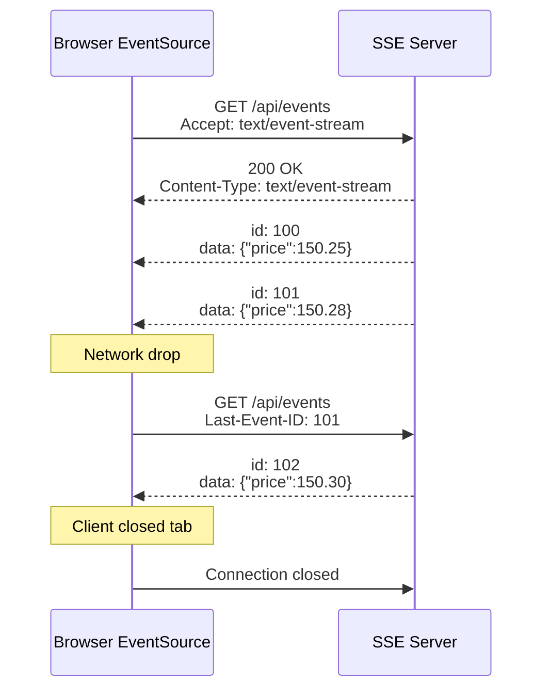

⚡ TL;DR - Server-Sent Events (SSE) is a standard HTTP
streaming mechanism where the server sends a continuous
stream of events to the client over a single persistent
HTTP connection (text/event-stream); unlike WebSocket,
SSE is unidirectional (server to client only) and runs
over standard HTTP/HTTPS; the browser's `EventSource`
API handles connection management and automatic
reconnection; ideal for live dashboards, build logs,
AI streaming responses (ChatGPT uses SSE), and
notifications where only the server needs to push data.

---

| #033 | Category: HTTP & APIs | Difficulty: ★★☆ |
|:---|:---|:---|
| **Depends on:** | HTTP/1.1 Fundamentals, HTTP Response Structure | |
| **Used by:** | Long Polling vs SSE vs WebSocket, Event-Driven APIs | |
| **Related:** | WebSocket Basics, Long Polling vs SSE vs WebSocket | |

---

### 🔥 The Problem This Solves

**WORLD WITHOUT IT:**
Server-push requirements led developers to three bad
options: (1) polling - repeated HTTP requests with
wasted bandwidth; (2) long polling - server holds the
connection open until data is available, then closes
it, forcing client to immediately reconnect; (3)
WebSocket - full bidirectional socket, over-engineered
for server-only push. All have limitations for the
most common real-time use case: server has new data
to show the client.

**THE BREAKING POINT:**
ChatGPT's streaming responses made SSE widely known.
When OpenAI needed to stream AI-generated text token
by token, they needed HTTP streaming that works through
all reverse proxies, load balancers, and CDNs without
special configuration. WebSocket would require sticky
sessions and protocol upgrade negotiation. SSE is
just HTTP - it works everywhere HTTP works.

**THE INVENTION MOMENT:**
SSE (HTML5 specification, 2004; browsers shipped ~2011)
defines `text/event-stream` content type and a simple
line-based event format. The browser's `EventSource`
API handles reconnection automatically using the `id`
field: last received event ID is sent on reconnect
via `Last-Event-ID` header, allowing the server to
resume from the correct point.

---

### 📘 Textbook Definition

Server-Sent Events (SSE) is a server-push technology
built on top of standard HTTP where the server streams
events to the client over a single long-lived HTTP
connection. **Protocol:** client sends a standard HTTP
GET request; server responds with `Content-Type:
text/event-stream` and streams events in the line-
based format: `data: <payload>\n\n`. Optional fields:
`id:` (event sequence number), `event:` (event type
for routing), `retry:` (client reconnect delay in ms).
**Client API:** browser `EventSource` object. Automatic
reconnect on disconnect, sends `Last-Event-ID` header
with the last received `id` value. **Connection:**
HTTP/1.1 persistent connection. Works through CDNs and
standard load balancers (no special configuration).
**Limitations:** unidirectional (server → client only);
default 6-connection limit per domain in HTTP/1.1
browsers (lifted in HTTP/2).

---

### ⏱️ Understand It in 30 Seconds

**One line:**
SSE is a "news ticker" over HTTP: you subscribe once,
the server keeps sending updates, and if the connection
drops, the browser reconnects automatically and asks
for updates since the last one received.

**One analogy:**
> SSE is like a radio broadcast. You tune in (HTTP GET),
> the station (server) keeps broadcasting (streaming
> events), and you listen (browser renders events). You
> cannot talk to the radio station (unidirectional). If
> you lose signal (disconnect), you retune (reconnect)
> from the last song you heard (Last-Event-ID). Contrast
> WebSocket: a phone call where both sides talk.

**One insight:**
SSE's built-in reconnect + event ID resume is a feature
most developers implement manually in WebSocket and
polling. With SSE's `id:` field, a live dashboard that
disconnects and reconnects never misses an event -
the server knows which events were delivered and which
to re-send. This "resume from last event" capability
is essentially at-least-once delivery built into the
protocol.

---

### 🔩 First Principles Explanation

**SSE EVENT FORMAT:**
```
# Standard event (newline + newline = end of event)
data: {"price": 150.25, "symbol": "AAPL"}\n
\n

# Event with type and ID
event: price-update\n
id: 1042\n
data: {"price": 150.25, "symbol": "AAPL"}\n
\n

# Multi-line data (each line prefixed with "data: ")
data: {"line1": "first",\n
data:  "line2": "second"}\n
\n

# Set client reconnect delay to 3 seconds
retry: 3000\n
\n

# Comment (keepalive ping)
: heartbeat\n
\n
```

**HTTP FLOW:**
```
Client → Server:
GET /api/events HTTP/1.1
Accept: text/event-stream
Cache-Control: no-cache
Last-Event-ID: 1041  ← on reconnect; absent on first connect

Server → Client:
HTTP/1.1 200 OK
Content-Type: text/event-stream
Cache-Control: no-cache
X-Accel-Buffering: no  ← Tell Nginx not to buffer
Connection: keep-alive

event: price-update
id: 1042
data: {"price": 150.25}

event: price-update
id: 1043
data: {"price": 150.28}

[stream continues until client closes or server ends]
```

**RECONNECT FLOW:**
```
Client                    Server
  |                         |
  |-- GET /events ---------->| Last-Event-ID: absent
  |<-- stream starts --------|
  |<-- id: 100 event --------|
  |<-- id: 101 event --------|
  | [network drops]          |
  |                         |
  |-- GET /events ---------->| Last-Event-ID: 101
  |<-- id: 102 event --------| (resumes from 102)
  |<-- id: 103 event --------|
```

---

### 🧪 Thought Experiment

**SCENARIO: AI code assistant streaming response**

ChatGPT and similar AI APIs use SSE to stream generated
tokens to the browser:

```
Server response (streaming):
data: {"token": "The"}

data: {"token": " quick"}

data: {"token": " brown"}

data: {"token": " fox"}

data: [DONE]
```

Why SSE and not WebSocket?
- ChatGPT's response is purely server → client streaming
- Standard HTTP/HTTPS works through every CDN and proxy
- No sticky sessions required (each stream is a
  fresh HTTP connection per query)
- Auto-reconnect handles network blips transparently
- EventSource handles backpressure (browser buffers)

This is the defining modern use case for SSE: AI
streaming responses, build logs, deployment progress,
live log tails - all purely server-push.

---

### 🧠 Mental Model / Analogy

> HTTP SSE is like a streaming music API vs a download.
> With a normal API call (GET /song), you wait for the
> entire file to download before it plays. With SSE
> (GET /stream), the server sends audio chunks as they
> are encoded; you start hearing music before the
> encoding is complete. Applied to AI: normal request
> → wait 30 seconds for full answer. SSE: first token
> arrives in 200ms; you start reading while the model
> is still generating.

---

### 📶 Gradual Depth - Five Levels

**Level 1 - What it is (anyone can understand):**
SSE lets a website subscribe to a stream of updates
from the server, like subscribing to a live sports score
ticker. The server sends score updates as they happen.
The browser shows them in real time. If the connection
drops, the browser automatically reconnects and asks
for scores it missed.

**Level 2 - How to use it (junior developer):**
Client: `new EventSource("/api/events")`. Listen:
`source.addEventListener("price", (e) => {...})`.
Server: respond with `Content-Type: text/event-stream`
and stream `data: ...\n\n` lines. Set `id:` on each
event. On reconnect, read `Last-Event-ID` header and
resume from that point.

**Level 3 - How it works (mid-level engineer):**
SSE uses chunked transfer encoding (HTTP/1.1) or stream
frames (HTTP/2) to send events. The browser reads the
stream line-by-line, parses events, and dispatches them
to EventSource listeners. The connection timeout is
managed by the EventSource API - if the server closes
the connection, EventSource reconnects after `retry`
milliseconds (default ~3s). The `id:` field enables
resume: on reconnect, `Last-Event-ID` header is included.
Server-side: maintain an event store (in-memory ring
buffer or database) and query it with `id > last_event_id`
on reconnect.

**Level 4 - Why it was designed this way (senior/staff):**
SSE was designed as a progressive enhancement over HTTP.
Unlike WebSocket, SSE does not require protocol upgrade
or special server support beyond the ability to hold
a connection open and stream. Any HTTP server that
supports streaming responses can serve SSE. This means
SSE works through HTTP/1.1 proxies, CDNs, and load
balancers without special configuration. The trade-off:
unidirectional (no client-to-server push without a
separate HTTP request). For most server-push use cases,
this is fine - clients interact via normal REST calls;
server pushes events via SSE.

**Level 5 - Mastery (distinguished engineer):**
HTTP/1.1 browsers limit 6 concurrent SSE connections
per domain (6-connection per origin limit for all HTTP
connections). This means a tab opening two SSE streams
uses 2 of the 6 slots; if the user opens a 7th SSE
tab, all connections queue. HTTP/2 removes this limit
(multiplexed streams over one TCP connection). This
is why `X-Accel-Buffering: no` is critical for Nginx:
Nginx buffers responses by default, which prevents
SSE events from being flushed immediately to the client.
`X-Accel-Buffering: no` tells Nginx to stream the
response without buffering. Missing this header is the
most common SSE deployment bug.

---

### ⚙️ How It Works (Mechanism)

**FastAPI SSE endpoint:**

```python
from fastapi import FastAPI, Request
from fastapi.responses import StreamingResponse
import asyncio
import json

app = FastAPI()

async def event_generator(
    request: Request,
    last_event_id: str | None
):
    """Stream events, resuming from last_event_id."""
    event_id = int(last_event_id or 0)

    while True:
        # Check client disconnect
        if await request.is_disconnected():
            break

        # Fetch new events since last_event_id
        events = await get_events_after(event_id)

        for event in events:
            event_id = event["id"]
            yield (
                f"event: {event['type']}\n"
                f"id: {event_id}\n"
                f"data: {json.dumps(event['payload'])}\n"
                f"\n"
            )

        if not events:
            # Keepalive comment (prevents proxy timeout)
            yield ": keepalive\n\n"
            await asyncio.sleep(15)

@app.get("/api/events")
async def stream_events(request: Request):
    last_event_id = request.headers.get("Last-Event-ID")
    return StreamingResponse(
        event_generator(request, last_event_id),
        media_type="text/event-stream",
        headers={
            "Cache-Control": "no-cache",
            "X-Accel-Buffering": "no",
            "Connection": "keep-alive"
        }
    )
```



---

### 🔄 The Complete Picture - End-to-End Flow

**Browser-side EventSource with event types:**

```javascript
const source = new EventSource("/api/events");

// Listen to specific event types
source.addEventListener("price-update", (event) => {
    const data = JSON.parse(event.data);
    updatePriceDisplay(data.symbol, data.price);
});

source.addEventListener("alert", (event) => {
    const data = JSON.parse(event.data);
    showNotification(data.message);
});

// Generic message listener (for events with no "event:" field)
source.onmessage = (event) => {
    console.log("Generic message:", event.data);
};

source.onerror = (error) => {
    if (source.readyState === EventSource.CLOSED) {
        console.log("Connection closed; will auto-reconnect");
    }
};

// Manual close when done
// source.close();
```

---

### 💻 Code Example

**Example 1 - BAD: Not flushing the buffer (Nginx buffering)**

```python
# BAD: Nginx buffers by default; events not delivered
# until buffer fills (client sees stale data or nothing)
@app.get("/api/events")
async def stream_bad():
    async def generate():
        for i in range(100):
            await asyncio.sleep(1)
            yield f"data: event {i}\n\n"
    return StreamingResponse(
        generate(),
        media_type="text/event-stream"
        # Missing: X-Accel-Buffering: no
        # Nginx holds events until buffer fills
    )

# GOOD: Include headers that disable proxy buffering
@app.get("/api/events")
async def stream_good():
    async def generate():
        for i in range(100):
            await asyncio.sleep(1)
            yield f"data: event {i}\n\n"
    return StreamingResponse(
        generate(),
        media_type="text/event-stream",
        headers={
            "X-Accel-Buffering": "no",  # Nginx
            "Cache-Control": "no-cache",
            "Connection": "keep-alive"
        }
    )
```

---

**Example 2 - AI streaming response (OpenAI-style SSE)**

```python
@app.post("/api/generate")
async def generate_text(prompt_data: PromptRequest):
    async def stream_tokens():
        async for token in ai_model.generate(
            prompt_data.prompt
        ):
            yield (
                f"data: {json.dumps({'token': token})}\n\n"
            )
        # Signal completion
        yield "data: [DONE]\n\n"

    return StreamingResponse(
        stream_tokens(),
        media_type="text/event-stream",
        headers={
            "X-Accel-Buffering": "no",
            "Cache-Control": "no-cache"
        }
    )
```

---

### ⚖️ Comparison Table

| Feature | SSE | WebSocket | Long Polling |
|:---|:---|:---|:---|
| Direction | Server → Client | Bidirectional | Server → Client |
| Protocol | Standard HTTP | WS protocol | Standard HTTP |
| Auto-reconnect | Built-in (EventSource) | Manual | Manual |
| Resume after disconnect | Built-in (Last-Event-ID) | Manual | Via sequence numbers |
| Proxy/CDN support | Transparent | Requires config | Transparent |
| Browser 6-conn limit | HTTP/1.1 only | No limit | Per-request |
| Use case | Feeds, logs, AI streaming | Chat, games | Low-frequency updates |

---

### ⚠️ Common Misconceptions

| Misconception | Reality |
|:---|:---|
| SSE requires WebSocket support | SSE is plain HTTP. Any server that can hold open a connection and stream text can serve SSE. No special protocol or port required. Works through all standard HTTP infrastructure. |
| SSE auto-reconnect means no missed events | Auto-reconnect sends `Last-Event-ID` to resume. But if the server does not implement event ID tracking and replay, reconnect is just a fresh start. The `id:` field is meaningful only if the server stores events and replays from the given ID. |
| SSE does not work with load balancers | SSE works with stateless load balancers (round-robin) because each request is a fresh HTTP connection. Unlike WebSocket, there is no persistent TCP state per server. An SSE reconnect can land on a different server as long as the event store is shared (Redis, DB). |
| SSE has worse performance than WebSocket | For server-push use cases, SSE is often faster to implement and equally performant. WebSocket's overhead comes from bidirectional state management, ping/pong, masking, and reconnect logic - none of which SSE requires for one-way streaming. |

---

### 🚨 Failure Modes & Diagnosis

**Events delivered with multi-second delay (Nginx buffering)**

**Symptom:** SSE events are delivered in batches after
10-30 second delays. Client-side shows data jumping
rather than streaming smoothly.

**Root Cause:** Nginx (or another reverse proxy) is
buffering the `text/event-stream` response. Nginx's
`proxy_buffering on` (default) collects response bytes
before forwarding to client.

**Diagnostic:**
```bash
# Test direct to app server (bypassing Nginx)
curl -v -N http://localhost:8000/api/events
# If events stream instantly: Nginx is buffering

# Test through Nginx
curl -v -N https://api.example.com/events
# If events arrive in batches: Nginx buffering confirmed
```

**Fix:** Add `X-Accel-Buffering: no` to SSE responses.
OR add `proxy_buffering off;` to the Nginx location
block for the SSE endpoint.

---

**HTTP/1.1 browser 6-connection limit blocks SSE in tabs**

**Symptom:** When user opens 3+ browser tabs each
using SSE, new tabs hang on connection. Intermittent
loading of real-time data in some tabs.

**Root Cause:** HTTP/1.1 limits 6 concurrent connections
per origin. Each SSE stream uses 1 connection. 6 tabs
with 1 SSE each = all connections used.

**Fix:** Upgrade to HTTP/2 (solved by multiplexing:
many streams over 1 TCP connection). Or: use a
SharedWorker to share a single SSE connection across
all tabs from the same origin; distribute events to
tab-local listeners via postMessage.

---

### 🔗 Related Keywords

**Prerequisites (understand these first):**
- `HTTP/1.1 Fundamentals` - SSE is built on HTTP streaming
- `HTTP Response Structure` - Content-Type: text/event-stream

**Builds On This (learn these next):**
- `Long Polling vs SSE vs WebSocket` - comparative
  analysis for choosing the right mechanism
- `Event-Driven APIs` - SSE in event-driven architecture

---

### 📌 Quick Reference Card

```
┌──────────────────────────────────────────────────────────┐
│ WHAT IT IS   │ HTTP streaming: server pushes events to   │
│              │ client over persistent HTTP connection    │
├──────────────┼───────────────────────────────────────────┤
│ PROBLEM IT   │ Server-push without WebSocket complexity; │
│ SOLVES       │ auto-reconnect with resume from last ID   │
├──────────────┼───────────────────────────────────────────┤
│ KEY INSIGHT  │ Works through all HTTP proxies/CDNs;      │
│              │ EventSource auto-reconnect is built-in    │
├──────────────┼───────────────────────────────────────────┤
│ USE WHEN     │ AI streaming, live dashboards, build logs,│
│              │ notifications (server → client only)      │
├──────────────┼───────────────────────────────────────────┤
│ EVENT FORMAT │ data: {json}\n\n                          │
│              │ id: 123\n data: ...\n\n (with resume)     │
├──────────────┼───────────────────────────────────────────┤
│ ANTI-PATTERN │ Missing X-Accel-Buffering: no (Nginx);    │
│              │ not implementing event ID replay          │
├──────────────┼───────────────────────────────────────────┤
│ ONE-LINER    │ "text/event-stream → stream events;       │
│              │ Last-Event-ID → resume after disconnect." │
├──────────────┼───────────────────────────────────────────┤
│ NEXT EXPLORE │ WebSocket Basics → Long Polling vs SSE    │
└──────────────────────────────────────────────────────────┘
```

**If you remember only 3 things:**
1. SSE is unidirectional (server → client). For
   bidirectional real-time, use WebSocket. For server-
   push only (AI responses, live feeds, logs), SSE is
   simpler and works through all HTTP infrastructure.
2. Include `X-Accel-Buffering: no` in SSE responses
   to prevent Nginx and other reverse proxies from
   buffering the stream.
3. Use `id:` on every event and handle `Last-Event-ID`
   on reconnect to implement resume-from-last-event
   (at-least-once delivery).

---

### 💎 Transferable Wisdom

**Reusable Engineering Principle:**
"Build on the existing protocol where possible." SSE
achieves real-time streaming without a new protocol,
new port, or new infrastructure requirements. By using
standard HTTP's streaming capability, SSE inherits
all of HTTP's benefits: CDN caching of static events,
load balancer support, authentication via HTTP headers,
CORS, and browser's built-in connection management.
This "use existing primitives" principle applies to:
HTTP long polling (a workaround before SSE), HTTP
range requests for partial content (streaming media
without a new protocol), and gRPC server streaming
(HTTP/2 stream semantics for server push in gRPC).

**Where else this pattern applies:**
- OpenAI API streaming: uses SSE for token-by-token
  AI response delivery
- GitHub Actions live logs: SSE for build log streaming
- Vercel deployment logs: SSE for real-time deployment
  status streaming
- Kubernetes `kubectl logs -f`: HTTP/2 streaming for
  log tailing

---

### 💡 The Surprising Truth

ChatGPT uses Server-Sent Events for all streaming
responses, not WebSocket. Despite WebSocket being the
"obvious" choice for real-time web communication,
OpenAI chose SSE because: (1) each query is a discrete
HTTP request with no need for a persistent session
state; (2) SSE works transparently through CDNs like
Cloudflare (which caches and routes HTTPS); (3) SSE's
EventSource auto-reconnect means a dropped connection
during a long generation can resume transparently.
This choice turned SSE from a relatively obscure
feature into one of the most-observed protocols in
modern web development. The format `data: [DONE]\n\n`
at the end of a ChatGPT stream is now recognized by
developers worldwide.

---

### ✅ Mastery Checklist

**You've mastered this when you can:**
1. **BUILD** An SSE endpoint in FastAPI with event types,
   IDs, and correct headers (Content-Type, X-Accel-
   Buffering, Cache-Control).
2. **IMPLEMENT** Resume-from-last-event: track event IDs,
   handle `Last-Event-ID` header on reconnect, replay
   missed events from a ring buffer.
3. **DIAGNOSE** Identify and fix Nginx buffering issues
   for SSE endpoints.
4. **EXPLAIN** The HTTP/1.1 6-connection-per-origin limit
   and how HTTP/2 or SharedWorker resolves it.
5. **CHOOSE** Given a real-time requirement, justify
   choosing SSE over WebSocket (server-push only, proxy
   transparency, simpler implementation).

---

### 🎯 Interview Deep-Dive

**Q1: What is the difference between SSE and WebSocket?
When would you choose one over the other?**

*Why they ask:* Core real-time protocol selection question.

*Strong answer includes:*
- WebSocket: bidirectional, persistent TCP channel,
  ping/pong required, sticky sessions for horizontal
  scaling, manual reconnect logic needed.
- SSE: unidirectional (server → client), standard HTTP,
  EventSource auto-reconnect with Last-Event-ID,
  works through all proxies and CDNs without config.
- Choose WebSocket: bidirectional real-time (chat,
  multiplayer games, collaborative editing, trading
  terminal with order entry).
- Choose SSE: server-push only (AI token streaming,
  live dashboards, build logs, notifications). Simpler,
  stateless-friendly.
- Hybrid: some apps use SSE for push + regular HTTP POST
  for client-to-server. GitHub Copilot suggestions stream
  via SSE; user actions via standard REST.

**Q2: How does SSE reconnection work? How do you
prevent missing events on reconnect?**

*Why they ask:* Tests protocol depth and reliability design.

*Strong answer includes:*
- Browser's EventSource automatically reconnects after
  disconnect (using `retry:` delay, default ~3s).
- On reconnect, sends `Last-Event-ID: <last_id>` header.
- Server reads `Last-Event-ID` and replays events with
  `id > last_id` from its event store.
- Implementation: server maintains a ring buffer of
  recent events (e.g., last 100 events or last 5 minutes).
  On reconnect with `Last-Event-ID: 1041`, query for
  events with id > 1041.
- If `Last-Event-ID` is absent or too old: send all
  recent events or start fresh (application-defined).
- This provides at-least-once delivery semantics for
  SSE (client deduplicates by ID if needed).

**Q3: How do you handle SSE in production with Nginx
and a load balancer?**

*Why they ask:* Tests operational deployment knowledge.

*Strong answer includes:*
- Nginx: `proxy_buffering off` or `X-Accel-Buffering: no`
  response header on SSE endpoints. Without this, events
  queue in Nginx buffer until buffer fills.
- Load balancer: SSE is stateless (each reconnect can
  land on any server). No sticky sessions required,
  unlike WebSocket.
- Event store: with multiple server instances, the event
  store (event log with IDs) must be shared. Common:
  Redis sorted set (id → event data), or a database
  table, or a message queue with consumer offsets.
- Keepalive: send `: comment\n\n` every 15-30 seconds
  to prevent proxy timeout (proxies close idle connections).
  Also prevents NAT state expiry.
- ALB (AWS Application Load Balancer): increase idle
  timeout beyond 60s for SSE connections.
