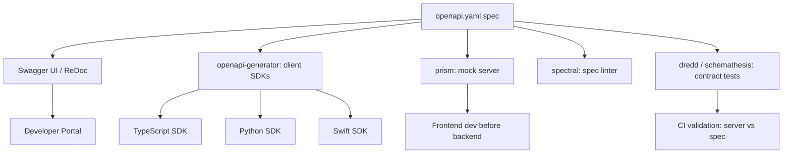

⚡ TL;DR - OpenAPI Specification (OAS) is a language-
agnostic, machine-readable description of a REST API
in YAML or JSON; it defines endpoints, request/response
schemas, authentication, and errors; tools generate
client SDKs, server stubs, documentation, and contract
tests from a single spec file; the workflow that wins
is "spec-first" (write the spec before code) rather
than "code-first" (generate spec from annotations);
OpenAPI 3.x is the current standard; Swagger was the
original name (v2), OpenAPI is the foundation-governed
successor.

---

| #034 | Category: HTTP & APIs | Difficulty: ★★☆ |
|:---|:---|:---|
| **Depends on:** | API Endpoint Design, Request Validation, Error Response Design | |
| **Used by:** | API Contract Testing, API Mocking and Stubbing, API-First Design | |
| **Related:** | API Versioning, Request Validation, API Endpoint Design | |

---

### 🔥 The Problem This Solves

**WORLD WITHOUT IT:**
API documentation is either out of date (written once,
never maintained) or non-existent (read the source
code). Client developers spend weeks figuring out
parameter names, required fields, and error shapes.
SDK authors re-implement the API model by reading docs.
QA teams write tests by guessing the API contract.
When the API changes, all consumers find out via
production failures.

**THE BREAKING POINT:**
A microservices system with 30 services and 15 client
teams: each service has different documentation styles,
different error formats (API-028 solved this), and no
machine-readable contract. Adding a new frontend team
means 2 months of integration meetings and discovery.
Contract validation is manual and error-prone.

**THE INVENTION MOMENT:**
Swagger (2010, Tony Tam at Wordnik) introduced a machine-
readable API description format. It was so successful
that Smartbear acquired it and donated it to the Linux
Foundation as OpenAPI Initiative (2016). OpenAPI 3.0
(2017) added reusable components, `oneOf`/`anyOf`,
callbacks, and links. OpenAPI became the de facto
standard for REST API contracts.

---

### 📘 Textbook Definition

OpenAPI Specification (OAS) is a YAML or JSON document
that describes a REST API contract. **Structure:**
`openapi` (version: "3.1.0"), `info` (title, version,
description), `servers` (base URLs), `paths` (endpoints
with HTTP methods, parameters, request body, responses),
`components` (reusable schemas, security schemes,
responses, parameters), `security` (global auth).
**Path item:** defines an HTTP method (`get`, `post`,
etc.) with `parameters`, `requestBody`, `responses`
(by status code), and `security` (per-operation auth
override). **Schema:** JSON Schema subset/superset (OAS
3.1 aligns fully with JSON Schema); defines object
properties, types, required fields, examples, validation
constraints. **Tooling:** Swagger UI/Redoc (interactive
docs), openapi-generator (SDKs in 40+ languages), Prism
(mock server), Pact (contract tests).

---

### ⏱️ Understand It in 30 Seconds

**One line:**
OpenAPI is the architectural drawing for your API: one
spec file that tools use to auto-generate docs, SDKs,
mock servers, and contract tests.

**One analogy:**
> OpenAPI is like an IDL (Interface Definition Language)
> for REST APIs - the same role Protobuf plays for gRPC.
> The spec is the source of truth. Code generators
> produce clients, servers, and docs from the spec,
> rather than from manual interpretation of documentation.
> Changing the spec re-generates all derived artifacts.

**One insight:**
The spec-first workflow inverts the typical API development
cycle. Instead of "build API → write docs → generate
spec," you write the spec first, then:
1. Mock server runs immediately (teams integrate before
   implementation)
2. Server stubs are generated (implement business logic
   only)
3. Client SDKs are generated (no manual SDK authoring)
4. Contract tests are generated (validate that server
   matches spec)
This makes the spec the single source of truth for the
entire API lifecycle.

---

### 🔩 First Principles Explanation

**MINIMAL OPENAPI 3.1 DOCUMENT:**
```yaml
openapi: "3.1.0"
info:
  title: "User Service API"
  version: "1.0.0"
  description: "Manages user accounts"

servers:
  - url: https://api.example.com/v1
    description: Production
  - url: https://staging.api.example.com/v1
    description: Staging

paths:
  /users/{user_id}:
    get:
      summary: "Get user by ID"
      operationId: "getUser"
      tags: ["Users"]
      parameters:
        - name: user_id
          in: path
          required: true
          schema:
            type: integer
            minimum: 1
      responses:
        "200":
          description: "User found"
          content:
            application/json:
              schema:
                $ref: "#/components/schemas/User"
        "404":
          $ref: "#/components/responses/NotFound"

components:
  schemas:
    User:
      type: object
      required: [id, email, name]
      properties:
        id:
          type: integer
          readOnly: true
          example: 42
        email:
          type: string
          format: email
          example: "alice@example.com"
        name:
          type: string
          minLength: 1
          maxLength: 100
          example: "Alice Smith"
        created_at:
          type: string
          format: date-time
          readOnly: true

  responses:
    NotFound:
      description: "Resource not found"
      content:
        application/problem+json:
          schema:
            $ref: "#/components/schemas/ProblemDetails"

  securitySchemes:
    BearerAuth:
      type: http
      scheme: bearer
      bearerFormat: JWT

security:
  - BearerAuth: []  # Global: all endpoints require auth
```

**KEY SCHEMA KEYWORDS:**
```yaml
# Type constraints
type: string | integer | number | boolean | array | object
format: date | date-time | uuid | email | uri | byte | binary
enum: [active, inactive, pending]
minimum: 1
maximum: 1000
minLength: 1
maxLength: 255
pattern: "^[a-zA-Z]+$"

# Required vs optional fields
required: [id, email]  # at object level

# Read-only / write-only (for request vs response)
readOnly: true   # in responses only
writeOnly: true  # in requests only (e.g., password)

# Polymorphism
oneOf:
  - $ref: "#/components/schemas/Cat"
  - $ref: "#/components/schemas/Dog"
discriminator:
  propertyName: "type"
```

---

### 🧪 Thought Experiment

**SCENARIO: New mobile app team integrates with User Service**

**Without OpenAPI:**
Week 1: mobile team reads sparse Confluence docs
Week 2: integrates, discovers undocumented required
  field `user_type` (docs omitted it)
Week 3: production incident - API returns different
  error format than expected (was never documented)
Total: 3 weeks of discovery before productive development

**With OpenAPI (spec-first):**
Day 1: mobile team downloads `openapi.yaml`
Day 1: runs `openapi-generator-cli generate -g swift`:
  Swift SDK generated with typed models and API clients
Day 1: runs `prism mock openapi.yaml`:
  Mock server running on port 4010 with all endpoints
Day 1: mobile team starts building UI against mock server
Day 5: real backend deployed; mobile team switches URL
  from mock to staging - zero integration surprises

**The difference is weeks vs days** - and zero integration
bugs because the contract was machine-validated.

---

### 🧠 Mental Model / Analogy

> OpenAPI is a construction blueprint. The blueprint
> (spec) defines every room (endpoint), door (parameter),
> and window (response schema). Builders (code generators)
> read the blueprint and build the scaffolding. Inspectors
> (contract tests) verify that the built structure matches
> the blueprint. Tenants (client teams) can review the
> blueprint before moving in. Anyone who changes the
> blueprint must update all derived structures. The
> blueprint is the source of truth - not the building
> itself.

---

### 📶 Gradual Depth - Five Levels

**Level 1 - What it is (anyone can understand):**
OpenAPI is a standardized way to describe what an API
does: what URLs it has, what data you send, and what
data you get back. Tools read this description to create
interactive documentation, generate code for using the
API, and test that the API works as described.

**Level 2 - How to use it (junior developer):**
Write `openapi.yaml` describing your endpoints, request
bodies, and responses. Run Swagger UI for interactive
docs. Use `openapi-generator-cli` to generate client
SDKs. Validate request bodies using a library like
`openapi-validator`. FastAPI auto-generates OpenAPI
from Python type annotations.

**Level 3 - How it works (mid-level engineer):**
Spec-first workflow: (1) Write `openapi.yaml` for new
endpoint. (2) Run mock server (`prism mock openapi.yaml`).
(3) Frontend team integrates against mock. (4) Generate
server stub (`openapi-generator generate -g python-fastapi`).
(5) Implement business logic in the stub. (6) Run
contract tests to verify implementation matches spec.
(7) Publish spec to developer portal. Key: spec and
code are both updated when the API changes.

**Level 4 - Why it was designed this way (senior/staff):**
OpenAPI's `components` section (reusable schemas,
responses, parameters) exists because API duplication
is the primary source of spec drift. Without `$ref`,
every endpoint duplicates the `User` schema. When the
User schema changes, 10 places must be updated. With
`$ref: "#/components/schemas/User"`, one change propagates
everywhere. `readOnly`/`writeOnly` fields solve the
mismatch between request schemas (no `id`, `created_at`)
and response schemas (includes `id`, `created_at`).
Using the same schema for both without these flags
causes validators to reject valid requests.

**Level 5 - Mastery (distinguished engineer):**
The spec-first vs code-first decision has long-term
consequences. Code-first (generate spec from annotations)
produces specs that reflect implementation details, not
API design intent. Field names match internal variable
names, not consumer-friendly names. Error responses
match whatever the framework generates, not RFC 7807.
Spec-first forces API design thinking: what is the
consumer's mental model? What names make semantic sense?
What errors should be documented? Companies with mature
API programs (Stripe, Twilio) maintain specs as the
authoritative source. Code is a spec implementation.
API design review is a spec review. Breaking changes are
a spec diff.

---

### ⚙️ How It Works (Mechanism)

**FastAPI auto-generated OpenAPI (code-first):**

```python
from fastapi import FastAPI, HTTPException, Path
from pydantic import BaseModel, EmailStr
from datetime import datetime

app = FastAPI(
    title="User Service API",
    version="1.0.0",
    description="Manages user accounts"
)

class UserResponse(BaseModel):
    id: int
    email: EmailStr
    name: str
    created_at: datetime

    model_config = {"from_attributes": True}

class UserCreate(BaseModel):
    email: EmailStr
    name: str

@app.get(
    "/users/{user_id}",
    response_model=UserResponse,
    summary="Get user by ID",
    responses={
        404: {
            "description": "User not found",
            "content": {
                "application/problem+json": {
                    "schema": {
                        "$ref": "#/components/schemas/ProblemDetails"
                    }
                }
            }
        }
    },
    tags=["Users"]
)
def get_user(
    user_id: int = Path(..., ge=1, description="User ID")
):
    user = db.get(user_id)
    if not user:
        raise HTTPException(status_code=404)
    return user

# FastAPI auto-serves spec at /openapi.json
# Swagger UI at /docs
# ReDoc at /redoc
```



---

### 🔄 The Complete Picture - End-to-End Flow

**Spec validation in CI pipeline:**

```bash
# Install tools
npm install -g @stoplight/spectral-cli
pip install schemathesis

# Lint the spec against rules
spectral lint openapi.yaml --ruleset .spectral.yaml

# Run contract tests against the live API
schemathesis run openapi.yaml \
  --url https://staging.api.example.com \
  --checks all \
  --hypothesis-max-examples 50

# Generate TypeScript client SDK
npx @openapitools/openapi-generator-cli generate \
  -i openapi.yaml \
  -g typescript-axios \
  -o generated/typescript-client
```

---

### 💻 Code Example

**Example 1 - BAD: Code-first with annotation drift**

```python
# BAD: annotations become the spec; drift is common
@app.get("/users/{id}")  # No summary, no error docs
def get_user(id: int):   # No validation constraints
    user = db.get(id)
    if not user:
        raise HTTPException(500)  # Wrong code: should be 404
    return user
    # Generated spec: missing error responses,
    # missing parameter validation, 500 for not-found
    # Consumers cannot rely on this spec for contracts

# GOOD: spec-first with complete documentation
@app.get(
    "/users/{user_id}",
    response_model=UserResponse,
    summary="Retrieve a user by their unique ID",
    description="Returns user details. Returns 404 if not found.",
    responses={
        200: {"description": "User found"},
        404: {"description": "User not found"},
        403: {"description": "Insufficient permissions"}
    },
    tags=["Users"],
    operation_id="get_user"  # Stable SDK method name
)
def get_user(
    user_id: int = Path(
        ...,
        ge=1,
        description="Unique user identifier",
        example=42
    )
):
    ...
```

---

**Example 2 - $ref for DRY schemas**

```yaml
# BAD: Duplicate User schema in every endpoint
paths:
  /users/{id}:
    get:
      responses:
        "200":
          content:
            application/json:
              schema:
                type: object
                properties:
                  id: {type: integer}
                  email: {type: string}
  /users:
    get:
      responses:
        "200":
          content:
            application/json:
              schema:
                type: array
                items:
                  type: object
                  properties:
                    id: {type: integer}
                    email: {type: string}
# PROBLEM: duplicated schema; out-of-sync when changed

# GOOD: DRY with $ref
paths:
  /users/{id}:
    get:
      responses:
        "200":
          content:
            application/json:
              schema:
                $ref: "#/components/schemas/UserResponse"
  /users:
    get:
      responses:
        "200":
          content:
            application/json:
              schema:
                type: array
                items:
                  $ref: "#/components/schemas/UserResponse"

components:
  schemas:
    UserResponse:
      type: object
      required: [id, email, name]
      properties:
        id:
          type: integer
          readOnly: true
        email:
          type: string
          format: email
        name:
          type: string
```

---

### ⚖️ Comparison Table

| Feature | OpenAPI 2.0 (Swagger) | OpenAPI 3.0 | OpenAPI 3.1 |
|:---|:---|:---|:---|
| JSON Schema alignment | Subset (no $id, no allOf composition) | Near-compatible | Fully compatible |
| Authentication | securityDefinitions | securitySchemes | securitySchemes |
| Callbacks | No | Yes (webhooks) | Yes |
| Nullable types | x-nullable extension | nullable: true | type: [string, null] |
| Webhook support | No | Callbacks only | Webhooks section |
| Most common | Legacy | Widely deployed | Modern standard |

---

### ⚠️ Common Misconceptions

| Misconception | Reality |
|:---|:---|
| OpenAPI is just documentation | OpenAPI is a machine-readable contract. Documentation is one output. Contract tests, client SDKs, server stubs, mock servers, and API gateways all consume the spec programmatically. Treating it as documentation-only wastes 90% of its value. |
| Code-first is easier than spec-first | Code-first is easier to start. Spec-first is easier to maintain. With code-first, the spec is an afterthought that reflects implementation choices rather than consumer needs. Spec drift (spec says X, API does Y) is inevitable without explicit spec review gates. |
| `readOnly` means the field cannot be in request bodies | `readOnly` means the field is omitted from request schema when validating. It can appear in response schemas. Without `readOnly: true` on `id` and `created_at`, validators would require clients to send these fields in POST requests. |
| Swagger and OpenAPI are the same | Swagger 2.0 is the legacy version (still widely used). OpenAPI 3.x is the current standard governed by the OpenAPI Initiative. Swagger tools (Swagger UI, Swagger Codegen) also support OpenAPI 3.x. The names are often used interchangeably but are technically distinct versions. |

---

### 🚨 Failure Modes & Diagnosis

**Spec drift: spec says v1 contract, code implements v2**

**Symptom:** Generated SDK sends requests that fail
with 422. Mock server accepts requests the real server
rejects. Contract tests pass but integration tests fail.

**Root Cause:** Spec was not updated when the API
changed. The spec is out of sync with the implementation.

**Diagnostic:**
```bash
# Run schemathesis against the live API
schemathesis run openapi.yaml \
  --url https://api.example.com/v1 \
  --checks response_schema_conformance

# schemathesis sends spec-defined requests and validates
# responses match spec schemas. Mismatches reveal drift.
```

**Fix:** Add spec-conformance tests to CI that run on
every deployment. Fail the build if the live API
diverges from the spec. Enforce spec updates as part
of API change review.

---

**`operationId` changed: breaks generated SDK method names**

**Symptom:** After a spec update, auto-generated TypeScript
SDK method names changed from `getUser` to `getUserById`.
All SDK consumers have compile errors.

**Root Cause:** `operationId` was modified. openapi-
generator uses `operationId` as the method name in
generated SDKs.

**Fix:** Treat `operationId` as a permanent, stable
identifier. Never rename it (it is a breaking change
for SDK users). Convention: use camelCase verb-noun
(`getUser`, `createOrder`, `deleteAccount`).

---

### 🔗 Related Keywords

**Prerequisites (understand these first):**
- `API Endpoint Design` - REST URL conventions the spec describes
- `Request Validation` - JSON Schema used in spec
- `Error Response Design` - RFC 7807 error schemas

**Builds On This (learn these next):**
- `API Contract Testing` - using the spec to verify implementation
- `API Mocking and Stubbing` - running mock servers from spec
- `API-First Design Strategy` - spec-first development workflow

---

### 📌 Quick Reference Card

```
┌──────────────────────────────────────────────────────────┐
│ WHAT IT IS   │ Machine-readable REST API contract in     │
│              │ YAML/JSON; tools generate docs, SDKs,     │
│              │ mocks, and tests from a single spec       │
├──────────────┼───────────────────────────────────────────┤
│ PROBLEM IT   │ No machine-readable contract → manual     │
│ SOLVES       │ SDK authoring, doc drift, slow integration│
├──────────────┼───────────────────────────────────────────┤
│ KEY INSIGHT  │ Spec-first workflow: write spec before    │
│              │ code; spec is the source of truth         │
├──────────────┼───────────────────────────────────────────┤
│ USE WHEN     │ Any REST API (public or internal);        │
│              │ especially multi-team integration         │
├──────────────┼───────────────────────────────────────────┤
│ TOOLS        │ Swagger UI (docs), prism (mock),          │
│              │ schemathesis (contract tests),            │
│              │ openapi-generator (SDKs)                  │
├──────────────┼───────────────────────────────────────────┤
│ ANTI-PATTERN │ Treating spec as docs only; letting spec  │
│              │ drift from implementation                 │
├──────────────┼───────────────────────────────────────────┤
│ ONE-LINER    │ "Spec is the contract; code is its        │
│              │ implementation; tests verify alignment."  │
├──────────────┼───────────────────────────────────────────┤
│ NEXT EXPLORE │ API Contract Testing → API-First Design   │
└──────────────────────────────────────────────────────────┘
```

**If you remember only 3 things:**
1. OpenAPI is a machine-readable API contract, not just
   documentation. Use it to generate SDKs, mock servers,
   and contract tests - not just Swagger UI.
2. Spec-first workflow: write the spec before writing
   the code. This enables parallel development (frontend
   uses mock, backend implements spec).
3. Prevent spec drift: run contract tests (`schemathesis`)
   in CI on every deployment to verify the live API
   matches the spec.

---

### 💎 Transferable Wisdom

**Reusable Engineering Principle:**
"Define the interface before the implementation." OpenAPI
enforces the same discipline that IDL-first (Protobuf
first) enforces for gRPC: the contract is explicit,
versioned, and reviewed before any code is written.
This principle applies to: gRPC (Protobuf .proto files
before service implementation), GraphQL (schema-first:
SDL before resolver code), message queues (Avro/
Protobuf schemas before producer/consumer code),
database schemas (ERD/DDL before ORM code). "Interface
before implementation" is the cornerstone of clean
service-to-service contracts.

**Where else this pattern applies:**
- gRPC: `.proto` file is the OpenAPI equivalent;
  `protoc` generates SDKs, just as openapi-generator does
- GraphQL: schema SDL is the contract; resolvers implement it
- AsyncAPI: OpenAPI for event-driven APIs (Kafka, AMQP)
  - same spec-first principle for message-based contracts

---

### 💡 The Surprising Truth

Swagger was invented not for documentation but for
client SDK generation. Tony Tam built it to solve the
problem of manually maintaining SDK clients for Wordnik's
dictionary API in multiple languages. The documentation
benefit was secondary. Ironically, most teams today
use OpenAPI primarily for Swagger UI documentation,
ignoring the SDK generation and contract testing
capabilities that were the original motivation. The
tools that deliver the most value (openapi-generator
for SDKs, schemathesis for property-based contract
testing) are less known than the documentation tool
that was always the secondary use case.

---

### ✅ Mastery Checklist

**You've mastered this when you can:**
1. **WRITE** An OpenAPI 3.1 spec for a CRUD API with
   reusable `$ref` schemas, `readOnly`/`writeOnly` fields,
   RFC 7807 error responses, and security schemes.
2. **RUN** A mock server from the spec (`prism mock`),
   generate a TypeScript client SDK, and run contract
   tests (`schemathesis`).
3. **EXPLAIN** The spec-first vs code-first trade-offs
   and when each is appropriate.
4. **DIAGNOSE** Spec drift using `schemathesis` and
   explain how to prevent it in CI.
5. **DESIGN** A spec governance workflow for a team of
   20 engineers: how specs are reviewed, versioned, and
   kept in sync with implementation.

---

### 🎯 Interview Deep-Dive

**Q1: What is the difference between Swagger and
OpenAPI? What version should you use today?**

*Why they ask:* Tests API ecosystem knowledge.

*Strong answer includes:*
- Swagger 2.0: original spec by Smartbear, donated to
  Linux Foundation in 2016. Renamed to "OpenAPI 2.0."
- OpenAPI 3.0: major redesign. Better authentication
  model, `components` for reuse, callbacks, `oneOf`/
  `anyOf`/`allOf` composition.
- OpenAPI 3.1 (current): full JSON Schema alignment.
  `nullable` removed (use `type: [string, null]`).
  Native webhook support.
- Use today: OpenAPI 3.1 for new APIs. OpenAPI 3.0
  if tooling compatibility is a concern. Swagger 2.0
  only for legacy systems.
- Swagger tools (Swagger UI, Codegen) support all
  versions. "Swagger" is often used colloquially for
  the whole ecosystem.

**Q2: What is the difference between spec-first and
code-first API development? Which do you prefer?**

*Why they ask:* Tests API design philosophy.

*Strong answer includes:*
- Code-first: write code, generate spec from annotations.
  Easy to start. Spec reflects implementation internals.
  Drift is common. Not consumer-oriented.
- Spec-first: write spec, then implement. Forces API
  design thinking. Enables parallel development (mock
  server runs immediately). Breaking changes visible in
  spec diff before code change.
- Preference for teams: spec-first at the team level.
  The spec is reviewed like a PR. Backend and frontend
  teams agree on the contract before either starts coding.
  This eliminates integration surprises.
- FastAPI note: FastAPI generates OpenAPI from type
  annotations (technically code-first). The spec can
  still be used spec-first if you write Pydantic models
  first and treat them as the spec.

**Q3: How do you prevent OpenAPI spec drift in a CI/CD
pipeline?**

*Why they ask:* Tests CI/CD and contract testing knowledge.

*Strong answer includes:*
- Add `schemathesis` to CI: generates random valid
  requests from the spec, sends them to the deployed API,
  validates that responses match the spec's response
  schemas. Fails build if mismatch found.
- For breaking changes: run `oasdiff` (spec diff tool)
  in CI to detect any breaking changes between the current
  spec and the spec on the main branch. Fail the build
  for breaking changes without a version bump.
- Deploy spec alongside the API: serve `openapi.yaml`
  at `/openapi.yaml`. Consumers always download the
  live spec. Spec is always the deployed contract.
- Spec review gate: PR review for `.yaml` changes,
  same as code review. A breaking change to the spec
  requires explicit approval from API consumers.
