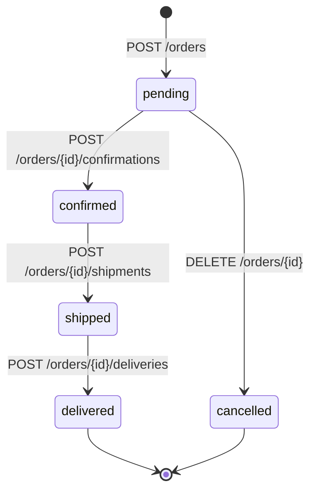

⚡ TL;DR - REST (Representational State Transfer) is
an architectural style where APIs expose resources
(nouns) via URLs and manipulate them with HTTP methods
(verbs); good REST design: `/orders/{id}` not `/getOrder`;
HATEOAS (Hypermedia as the Engine of Application State)
is the strictest REST constraint where responses include
links to related actions - rarely implemented fully in
practice; most production "REST APIs" are actually RPC-
over-HTTP that follow REST conventions; understanding
the distinction prevents over-engineering.

---

| #035 | Category: HTTP & APIs | Difficulty: ★★★ |
|:---|:---|:---|
| **Depends on:** | API Endpoint Design, HTTP Methods | |
| **Used by:** | API-First Design Strategy, Internal vs Public API Design | |
| **Related:** | OpenAPI Specification, API Endpoint Design, HTTP Methods | |

---

### 🔥 The Problem This Solves

**WORLD WITHOUT IT:**
RPC-style APIs with unclear naming: `POST /getUser?id=5`,
`GET /createOrder`, `POST /doLogin`, `POST /cancelAndRefund`.
HTTP methods mean nothing (everything is POST or GET).
URLs are arbitrary. Clients must read documentation to
understand every operation. Discoverability is zero.
Clients tightly coupled to specific URL patterns that
change with every internal refactor.

**THE BREAKING POINT:**
Early SOAP web services used URL + action naming:
`/UserService?action=getUser&id=5`. There was no
consistency across services. Each service team invented
their own naming conventions. Integration was a
discovery exercise for every new service.

**THE INVENTION MOMENT:**
Roy Fielding's 2000 dissertation "Architectural Styles
and the Design of Network-based Software Architectures"
formalized REST as the architectural style behind HTTP.
Key insight: the Web's scalability came from treating
documents (resources) as first-class citizens with
stable URLs, and letting HTTP methods (GET, POST, PUT,
DELETE) define the operations. HATEOAS was the final
constraint: a fully RESTful system is self-describing -
following links from the root reveals the entire API.

---

### 📘 Textbook Definition

REST (Representational State Transfer) is an architectural
style (not a protocol) defined by six constraints:
(1) client-server separation, (2) statelessness (each
request contains all context), (3) cacheability, (4)
uniform interface (resource identification, representation
manipulation, self-descriptive messages, HATEOAS),
(5) layered system, (6) code-on-demand (optional).
**Resource design:** resources are nouns (users, orders,
products); identified by URL; manipulated via HTTP
methods. **URL conventions:** `/resources` (collection),
`/resources/{id}` (single), `/resources/{id}/sub-
resources` (nested). **HATEOAS (Hypermedia as Engine
of Application State):** responses include `_links`
with URLs for related actions; client follows links
rather than constructing URLs. Most APIs claim to be
"REST" but are "REST-like" - resource-oriented, HTTP
methods semantically used, but without HATEOAS.

---

### ⏱️ Understand It in 30 Seconds

**One line:**
REST says "name your things with nouns (resources), use
HTTP methods as verbs"; HATEOAS says "every response
tells you what you can do next."

**One analogy:**
> REST resource design is like a well-organized library.
> Each book (resource) has a clear location (URL).
> "Get book" = walk to the location (GET). "Return book"
> = put it back (PUT). "Donate book" = add it (POST).
> "Destroy damaged book" = remove it (DELETE). HATEOAS
> is the library's card catalog that tells you: "this
> book is available → you can borrow it; link:
> /borrow/book-123" - the response tells you what actions
> are available without consulting external documentation.

**One insight:**
The REST vs RPC debate is philosophical for most APIs.
The practical value of REST is naming consistency:
when every team follows "nouns for resources, HTTP
methods for verbs," developers can guess endpoint URLs
without documentation. `/users/42/orders` returns the
orders for user 42. This predictability reduces
integration time. Full HATEOAS is rarely worth the
implementation cost for internal APIs.

---

### 🔩 First Principles Explanation

**RESOURCE-ORIENTED URL DESIGN:**
```
# Users resource
GET    /users           → List all users (paginated)
POST   /users           → Create a new user
GET    /users/{id}      → Get one user
PUT    /users/{id}      → Replace user (full update)
PATCH  /users/{id}      → Partial update
DELETE /users/{id}      → Delete user

# Nested resource (user's orders)
GET    /users/{id}/orders        → List user's orders
POST   /users/{id}/orders        → Create order for user
GET    /users/{id}/orders/{oid}  → Get specific order

# Actions that don't map to CRUD (use nouns)
POST   /users/{id}/password-reset     → Trigger reset
POST   /orders/{id}/cancellations     → Cancel order
POST   /payments/{id}/refunds         → Issue refund
# NOT: POST /cancelOrder (RPC-style)
```

**HTTP METHOD SEMANTICS:**
```
Method   Semantics      Idempotent  Safe
------   ---------      ----------  ----
GET      Read           Yes         Yes
POST     Create/action  No          No
PUT      Full replace   Yes         No
PATCH    Partial update Varies      No
DELETE   Remove         Yes         No

Resource state after PUT:
  Before: {"name":"Alice","email":"a@b.com","age":30}
  PUT: {"name":"Alice","email":"a@b.com"}
  After: {"name":"Alice","email":"a@b.com","age":null}
  ← PUT replaces the entire resource
  ← PATCH would only update the sent fields
```

**HATEOAS RESPONSE:**
```json
GET /users/42
{
  "id": 42,
  "name": "Alice",
  "status": "active",
  "_links": {
    "self": {"href": "/users/42"},
    "orders": {"href": "/users/42/orders"},
    "deactivate": {
      "href": "/users/42/status",
      "method": "PATCH",
      "body": {"status": "inactive"}
    }
  }
}
```

With HATEOAS, the client:
1. GETs root URL → discovers available resources
2. Follows links to navigate the API
3. Never constructs URLs from domain knowledge
4. When status changes to "inactive", the response
   no longer includes "deactivate" link (only valid
   transitions are offered)

---

### 🧪 Thought Experiment

**SCENARIO: Order workflow modeled as REST vs RPC**

**RPC-style (common but problematic):**
```
POST /placeOrder     {"items": [...], "user_id": 1}
POST /cancelOrder    {"order_id": 123}
POST /confirmOrder   {"order_id": 123}
POST /shipOrder      {"order_id": 123}
GET  /getOrderStatus {"order_id": 123}
```
- No HTTP semantics (all POST/GET)
- Unpredictable URLs; must read docs for each action
- Status of order not a resource (where is the state?)

**REST resource design:**
```
POST   /orders          → Create order (status: pending)
GET    /orders/123      → Read order + current status
POST   /orders/123/confirmations  → Confirm
POST   /orders/123/shipments      → Ship
DELETE /orders/123      → Cancel (or PATCH status: cancelled)
```

**With HATEOAS (ideal):**
```json
GET /orders/123
{
  "id": 123,
  "status": "pending",
  "_links": {
    "self":    {"href": "/orders/123"},
    "confirm": {"href": "/orders/123/confirmations"},
    "cancel":  {"href": "/orders/123", "method": "DELETE"}
  }
}
```
When order is confirmed:
```json
{
  "status": "confirmed",
  "_links": {
    "self": {"href": "/orders/123"},
    "ship": {"href": "/orders/123/shipments"}
    // No "confirm" link: already confirmed
    // No "cancel" link: too late to cancel
  }
}
```
The valid state transitions are self-describing.

---

### 🧠 Mental Model / Analogy

> HATEOAS is like navigating a website without knowing
> the URL structure. You visit the home page, and every
> page tells you where you can go next via links. You
> never type a URL directly - you follow links. If a
> feature becomes unavailable (sale ended), the link
> disappears from the page. You don't need to know that
> the "Buy" button leads to `/cart/add?product=123`; you
> just click the "Buy" link. HATEOAS applies this
> principle to API clients: follow links, don't construct
> URLs.

---

### 📶 Gradual Depth - Five Levels

**Level 1 - What it is (anyone can understand):**
REST APIs name things consistently: `/users` for the
list of users, `/users/42` for user 42. You can guess
the URL for a resource without looking it up. HATEOAS
goes further: every response tells you what you can do
next, like a menu that changes based on what you ordered.

**Level 2 - How to use it (junior developer):**
Use nouns for resource URLs, not verbs. `POST /orders`
(not `POST /createOrder`). Use HTTP methods semantically:
GET=read, POST=create, PUT=replace, PATCH=update,
DELETE=remove. Nest sub-resources: `/users/{id}/orders`.
For actions that do not fit CRUD, use "action resources":
`POST /orders/{id}/cancellations`.

**Level 3 - How it works (mid-level engineer):**
Resource hierarchies reflect ownership relationships:
`/users/{id}/orders` means "orders belonging to user".
But deep nesting creates long URLs and tight coupling.
Rule of thumb: max 3 levels deep. For cross-resource
queries: use query parameters on the root resource
(`GET /orders?user_id=42`) rather than nesting every
relationship. Choose PATCH over PUT for partial updates
in most APIs (PUT requires the client to send the
complete current state, which can overwrite concurrent
updates).

**Level 4 - Why it was designed this way (senior/staff):**
Fielding's REST constraints were descriptions of what
made the web scalable - not a prescription for how to
build APIs. The web's scalability came from cacheability
(GET requests can be cached by CDNs), statelessness
(servers don't hold session state), and uniform interface
(every HTTP server supports the same methods). Most
"REST APIs" are actually "HTTP APIs" that follow REST
conventions without implementing all constraints (they
use server-side sessions, which violates statelessness;
they don't use HATEOAS; they don't provide code-on-
demand). This is fine for most use cases.

**Level 5 - Mastery (distinguished engineer):**
HATEOAS's practical limitation is versioning: if clients
follow links, and the server changes a link URL (new
version), clients must be updated anyway. The benefit
of HATEOAS is clients being insulated from URL changes
at the cost of runtime link resolution (slower than
constructing URLs from a known pattern). For public
APIs with diverse clients (no control over client code),
HATEOAS provides real value. For internal microservices
with generated SDKs, HATEOAS adds overhead without
benefit (the SDK knows the URL pattern). Choose HATEOAS
for APIs where clients are unknown at design time
(HAL, JSON:API standards); skip it for internal APIs.

---

### ⚙️ How It Works (Mechanism)

**HAL (Hypertext Application Language) response format:**

```python
from fastapi import FastAPI
from pydantic import BaseModel

app = FastAPI()

class Link(BaseModel):
    href: str
    method: str = "GET"

class OrderResponse(BaseModel):
    id: int
    status: str
    total: float
    links: dict[str, Link]

    class Config:
        populate_by_name = True

@app.get("/orders/{order_id}")
def get_order(order_id: int) -> dict:
    order = db.get_order(order_id)

    # Build links based on current state
    links = {
        "self": {"href": f"/orders/{order_id}"}
    }

    if order.status == "pending":
        links["confirm"] = {
            "href": f"/orders/{order_id}/confirmations",
            "method": "POST"
        }
        links["cancel"] = {
            "href": f"/orders/{order_id}",
            "method": "DELETE"
        }
    elif order.status == "confirmed":
        links["ship"] = {
            "href": f"/orders/{order_id}/shipments",
            "method": "POST"
        }

    return {
        "id": order.id,
        "status": order.status,
        "total": order.total,
        "_links": links
    }
```



---

### 🔄 The Complete Picture - End-to-End Flow

**Resource URL design patterns:**

```
# Collection vs item
GET /products          - list (paginated)
POST /products         - create
GET /products/{id}     - read one
PUT /products/{id}     - full replace
PATCH /products/{id}   - partial update
DELETE /products/{id}  - delete

# Filtering, sorting, pagination via query params
GET /products?category=electronics&sort=price&order=asc
GET /products?page=2&limit=20
GET /products?cursor=eyJpZCI6MTAwfQ

# Nested resources (max 2-3 levels)
GET /users/{uid}/addresses
POST /users/{uid}/addresses
GET /users/{uid}/addresses/{aid}

# Cross-resource search (avoid deep nesting)
GET /orders?user_id=42    (better than /users/42/orders)
GET /products?tag=sale    (better than /tags/sale/products)

# Action resources for non-CRUD operations
POST /users/{id}/password-resets   → trigger email
POST /invoices/{id}/payments       → record payment
POST /subscriptions/{id}/pauses    → pause subscription
```

---

### 💻 Code Example

**Example 1 - BAD: RPC-style URLs**

```python
# BAD: RPC over HTTP - no REST semantics
@app.get("/getUser")              # verb in URL
@app.post("/createNewOrder")      # verb in URL
@app.post("/cancelOrder")         # all POST, no DELETE
@app.post("/getUserOrders")       # GET via POST
@app.post("/doRefund")            # arbitrary naming

# No discoverability. No semantic HTTP methods.
# Every URL must be individually documented.

# GOOD: Resource-oriented REST design
@app.get("/users/{user_id}")       # GET = read
@app.post("/orders")               # POST = create
@app.delete("/orders/{order_id}")  # DELETE = cancel
@app.get("/users/{user_id}/orders")# Nested resource
@app.post("/orders/{id}/refunds")  # Action resource
```

---

**Example 2 - PATCH vs PUT in practice**

```python
# PUT: full replacement (must send complete state)
@app.put("/users/{user_id}")
def update_user_full(user_id: int, user: UserFull):
    # user must contain ALL fields
    # Missing fields become null/default
    return db.replace_user(user_id, user)

# PATCH: partial update (send only changed fields)
@app.patch("/users/{user_id}")
def update_user_partial(
    user_id: int,
    user: UserPatch  # All fields Optional
):
    # Only updates provided fields
    # Other fields unchanged
    return db.patch_user(user_id, user.dict(exclude_none=True))

class UserPatch(BaseModel):
    name: str | None = None
    email: str | None = None
    # id, created_at: never patchable
```

---

### ⚖️ Comparison Table

| Style | URL Pattern | HTTP Methods | Discoverability | Complexity |
|:---|:---|:---|:---|:---|
| RPC-over-HTTP | `/getUser?id=5` | All POST/GET | None | Low |
| REST-like | `/users/5` | Semantic | Partial (predictable URLs) | Medium |
| Full REST + HATEOAS | `/users/5` + `_links` | Semantic | Full (follow links) | High |
| gRPC | N/A (RPC) | N/A | IDL (Protobuf) | High |

---

### ⚠️ Common Misconceptions

| Misconception | Reality |
|:---|:---|
| Every API must use HATEOAS to be RESTful | Fielding defined HATEOAS as a REST constraint, but he also stated that most "REST APIs" do not implement it. The practical value depends on client variety. Most production APIs are "REST-like" (resource-oriented, HTTP methods), not "fully RESTful." |
| PUT and PATCH are interchangeable | PUT replaces the entire resource (missing fields become null/default). PATCH updates only the provided fields. Using PUT for partial updates causes silent data loss when clients omit fields they did not intend to change. |
| Nesting resources always reflects ownership | Deep nesting (`/users/1/orders/123/items/456/reviews`) creates long URLs and tight coupling. Use flat URLs with filters for cross-resource queries. `/reviews?item_id=456` is simpler than 5 levels of nesting. |
| REST vs RPC is a technical debate | It is primarily a naming consistency debate. The engineering value of REST conventions is predictability: developers can guess URLs. The theoretical value (self-describing APIs, statelessness, cacheability) matters more for public APIs than internal services. |

---

### 🚨 Failure Modes & Diagnosis

**PUT overwrites fields the client did not intend to change**

**Symptom:** User updates their email via a form that
sends only the email field. After the update, other
profile fields (phone, address, preferences) are cleared.

**Root Cause:** Client sends `PUT /users/42 {"email":
"new@example.com"}`. Server treats this as a full
replacement (missing fields set to null). The user's
other data is lost.

**Fix:** Use PATCH for partial updates. PUT is semantically
"replace the whole resource." If clients need partial
updates, implement PATCH with merge semantics (update
only provided fields, leave others unchanged).

---

**Deep nesting creates overly specific URLs**

**Symptom:** URL `/api/v1/organizations/{org}/departments/{dept}/teams/{team}/members/{mid}/roles/{rid}` breaks when organization structure changes. Clients hard-code 6-level URL paths.

**Root Cause:** Ownership hierarchy modeled as URL
nesting. Every level added increases coupling.

**Fix:** Flatten to 2 levels max for REST. Use query
parameters for filtering: `GET /roles?member_id={mid}`.
Reserve nesting for the primary ownership relationship
(`/teams/{id}/members`).

---

### 🔗 Related Keywords

**Prerequisites (understand these first):**
- `API Endpoint Design` - URL conventions
- `HTTP Methods` - method semantics

**Builds On This (learn these next):**
- `API-First Design Strategy` - REST design in the
  broader API lifecycle
- `Internal vs Public API Design Principles` - when
  REST conventions matter most

---

### 📌 Quick Reference Card

```
┌──────────────────────────────────────────────────────────┐
│ WHAT IT IS   │ REST: resource-oriented URL + HTTP method │
│              │ semantics; HATEOAS: responses include     │
│              │ links to next valid actions               │
├──────────────┼───────────────────────────────────────────┤
│ PROBLEM IT   │ RPC-style APIs have arbitrary, unpredic-  │
│ SOLVES       │ table URLs; no semantic HTTP method usage │
├──────────────┼───────────────────────────────────────────┤
│ KEY INSIGHT  │ Nouns for resources, HTTP methods as      │
│              │ verbs; predictability reduces integration │
├──────────────┼───────────────────────────────────────────┤
│ URL PATTERN  │ /resources (collection)                   │
│              │ /resources/{id} (item)                    │
│              │ /resources/{id}/sub-resources (nested)    │
├──────────────┼───────────────────────────────────────────┤
│ ANTI-PATTERN │ /getUser /createOrder /doRefund (verbs);  │
│              │ PUT for partial updates (data loss risk)  │
├──────────────┼───────────────────────────────────────────┤
│ ONE-LINER    │ "Nouns in URLs, methods as verbs;         │
│              │ HATEOAS = responses as menus."            │
├──────────────┼───────────────────────────────────────────┤
│ NEXT EXPLORE │ API-First Design → Internal vs Public API │
└──────────────────────────────────────────────────────────┘
```

**If you remember only 3 things:**
1. Use nouns for resource URLs, HTTP methods as verbs.
   `POST /orders` to create (not `POST /createOrder`).
   `DELETE /orders/123` to cancel (not `POST /cancelOrder`).
2. PATCH = partial update (only changed fields). PUT =
   full replacement (all fields). Using PUT for partial
   updates silently clears missing fields.
3. HATEOAS is real REST but rarely needed for internal
   APIs. Use it for public APIs with unknown clients;
   skip it for internal APIs with generated SDKs.

---

### 💎 Transferable Wisdom

**Reusable Engineering Principle:**
"Name things for what they are, not what you do with them."
This applies beyond API design: database table names
(noun: `orders`, not `place_orders`), message queue
topics (noun: `user.registered`, not `send_welcome_email`),
Kafka topics (noun events: `order.created` not
`createOrder`), event sourcing (past-tense events:
`OrderPlaced`, not `PlaceOrder`). Naming with nouns
makes the thing a first-class citizen that can be
referenced, listed, cached, and extended. Naming with
verbs makes it a procedure that can only be called.

**Where else this pattern applies:**
- GraphQL resource model: types are nouns (User, Order),
  mutations describe state changes past-tense style
- Event sourcing: events are past-tense nouns
  (OrderPlaced, UserRegistered)
- Infrastructure as Code: resources are nouns
  (aws_s3_bucket, kubernetes_deployment)

---

### 💡 The Surprising Truth

Roy Fielding, inventor of REST, has publicly criticized
most APIs calling themselves "RESTful" as not actually
being REST. In his 2008 blog post "REST APIs must be
hypertext-driven," Fielding stated: "I am getting
frustrated by the number of people calling any HTTP-
based interface a REST API... Please try to use another
name for your API." The constraint he considers most
violated is HATEOAS: "If the engine of application
state (and hence the API) is not being driven by
hypertext, then it cannot be RESTful." By Fielding's
definition, Stripe's API (which he has praised for
good design) is not REST - it is an HTTP API with
predictable resource naming. Most production APIs are
excellent HTTP APIs; calling them REST is technically
incorrect but culturally established.

---

### ✅ Mastery Checklist

**You've mastered this when you can:**
1. **DESIGN** A REST API for a multi-resource domain
   (e.g., orders, users, products) with correct URL
   patterns, HTTP method semantics, and nested resources.
2. **EXPLAIN** The difference between PUT and PATCH
   semantics and when to use each, with a concrete
   example of data loss from incorrect PUT usage.
3. **IMPLEMENT** A HATEOAS-style response that includes
   links for valid state transitions (e.g., order
   workflow where available actions change by status).
4. **JUSTIFY** When to implement HATEOAS (public API,
   unknown clients) vs skip it (internal API, generated
   SDKs).
5. **CRITIQUE** Given a set of API endpoints, identify
   which violate REST resource design and propose
   corrections.

---

### 🎯 Interview Deep-Dive

**Q1: What is the difference between PUT and PATCH?
Give a concrete example where using PUT incorrectly
causes a bug.**

*Why they ask:* Tests HTTP method semantics depth.

*Strong answer includes:*
- PUT = idempotent full replacement. The request body
  becomes the new state of the resource. Missing fields
  in the body are set to null or default.
- PATCH = partial update. Only the provided fields are
  updated; others are unchanged.
- Bug scenario: User profile has `{name, email, bio,
  avatar_url}`. Client shows a form with only `name`
  and `email`. On save, sends `PUT /users/1 {name,
  email}`. Server replaces the resource: `bio` and
  `avatar_url` become null. User's bio and avatar are
  silently erased.
- Fix: use PATCH for user-facing forms. PUT is appropriate
  only when the client owns and provides the complete
  resource state.

**Q2: How would you design REST endpoints for an order
management system? Where do non-CRUD actions fit?**

*Why they ask:* Tests REST design in a business domain.

*Strong answer includes:*
- Resources: `/orders` (collection), `/orders/{id}`
  (item), `/orders/{id}/items` (nested items).
- HTTP methods: POST to create; GET to read; PATCH for
  partial update; DELETE to cancel (or POST to an action
  resource).
- Non-CRUD actions use "action resources" (sub-resources
  named after the action): `POST /orders/{id}/confirmations`
  to confirm; `POST /orders/{id}/shipments` to ship;
  `POST /orders/{id}/refunds/{id}` for refunds. These
  model the action as a resource that is created when
  the action occurs, enabling idempotency keys and
  history.
- Avoid: `POST /confirmOrder?order_id=123` (RPC-style
  breaks REST semantics).

**Q3: What is HATEOAS? Is it worth implementing?**

*Why they ask:* Tests depth of REST knowledge and
pragmatic judgment.

*Strong answer includes:*
- HATEOAS: responses include links to related resources
  and valid next actions. Client follows links rather
  than constructing URLs.
- Benefit: clients do not hard-code URL patterns. When
  URLs change, clients auto-discover the new ones.
  Available actions change by state (only valid
  transitions offered).
- Cost: additional response payload; client must parse
  links; server must compute valid links per state;
  complex to implement and maintain.
- Practical answer: worth it for public APIs with
  unknown, diverse clients (the client cannot be
  redeployed when URLs change). Not worth it for
  internal microservices with generated SDKs (the
  SDK is regenerated when the spec changes).
  Example: PayPal's API uses HATEOAS for payment
  workflows. Most internal enterprise APIs do not.
