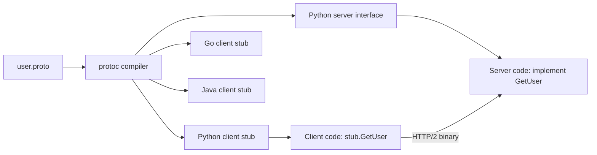

⚡ TL;DR - gRPC is a high-performance RPC framework
from Google that uses Protocol Buffers (Protobuf) as
its IDL and serialization format, and HTTP/2 as its
transport; Protobuf binary encoding is 3-10x smaller
than JSON and 5-10x faster to serialize; gRPC generates
type-safe client and server code in 10+ languages from
a `.proto` schema file; ideal for internal microservice
communication, IoT, and mobile where binary efficiency
and strong typing matter; not a replacement for REST
in public APIs (browser support requires gRPC-Web proxy).

---

| #037 | Category: HTTP & APIs | Difficulty: ★★★ |
|:---|:---|:---|
| **Depends on:** | HTTP/2 Multiplexing, Request and Response Validation | |
| **Used by:** | gRPC Streaming, gRPC vs REST Performance, gRPC Service Evolution | |
| **Related:** | HTTP/2 Multiplexing, gRPC Streaming, gRPC vs REST Performance | |

---

### 🔥 The Problem This Solves

**WORLD WITHOUT IT:**
Internal microservice communication over REST/JSON
has multiple inefficiencies: (1) JSON is a text format;
a 64-bit integer like `1234567890123456789` becomes 19
bytes of text, not 8 bytes of binary. (2) Each service
team defines its own data models; no cross-service
contract enforcement. (3) Client libraries must be
written or generated manually. (4) Dynamic JSON lacks
type safety; a field renamed on the server silently
returns `null` on the client until a runtime error
surfaces.

**THE BREAKING POINT:**
Google's internal systems (Search, Maps, YouTube) have
thousands of services making billions of RPC calls per
day. At that scale, 2x-5x serialization overhead
translates to terabytes of extra bandwidth and
microseconds of latency per call that compound into
seconds of user-visible latency.

**THE INVENTION MOMENT:**
Google had used Stubby (internal RPC framework) for
a decade. When standardizing on HTTP/2, they rebuilt
Stubby as gRPC (2015) with Protocol Buffers 3 as the
IDL. The `.proto` file became the service contract:
both client and server code generated from it. Type
safety, backward compatibility rules, and binary
efficiency baked into the framework.

---

### 📘 Textbook Definition

gRPC is an open-source RPC framework that uses:
**Protocol Buffers (proto3)** as IDL (Interface Definition
Language) and binary serialization format; **HTTP/2**
as transport (streams for bidirectional streaming, HPACK
for header compression); **Protobuf binary encoding**
(field numbers, varint encoding, length-delimited bytes)
for compact, schema-validated serialization. **Service
definition:** `.proto` file declares `service` (RPC
methods), `message` types (request/response), and
`enum` types. **`protoc` compiler** generates client
stubs and server interfaces in Go, Java, Python, C++,
TypeScript (gRPC-Web), and 15+ languages. **RPC types:**
unary (request-response), server streaming, client
streaming, bidirectional streaming. **Metadata:** HTTP/2
headers carry gRPC metadata (auth tokens, trace IDs).
**Status:** `grpc::StatusCode` (OK, NOT_FOUND,
INVALID_ARGUMENT, UNAUTHENTICATED, etc.) maps to HTTP
status codes semantically.

---

### ⏱️ Understand It in 30 Seconds

**One line:**
gRPC = write a `.proto` schema file → generate type-
safe clients and servers in any language → call remote
services as if they were local functions, with binary
efficiency 5x faster than JSON.

**One analogy:**
> gRPC is to REST what compiled code is to interpreted
> code. REST/JSON: you write free-form text (JSON), send
> it, the other side reads it and hopes the field names
> match. gRPC: you define a schema (`.proto`), both sides
> compile from it, the compiler catches mismatches at
> build time. Binary encoding is the compiled output:
> efficient, typed, and schema-validated.

**One insight:**
The killer feature of Protobuf is backward compatibility
rules: fields are identified by numbers (not names).
Adding a new field with a new number is always backward-
compatible. Old clients ignore unknown field numbers.
New clients get the new field. This is why Protobuf
is the internal contract format at Google, Netflix,
and Uber: services deploy independently without
coordinated client updates.

---

### 🔩 First Principles Explanation

**PROTOBUF MESSAGE ENCODING:**
```protobuf
// user.proto
syntax = "proto3";

message User {
  int64  id         = 1;
  string email      = 2;
  string name       = 3;
  Status status     = 4;
  repeated string roles = 5;

  enum Status {
    ACTIVE   = 0;
    INACTIVE = 1;
  }
}
```

```
JSON encoding (text, 80 bytes):
{"id":42,"email":"alice@example.com","name":"Alice","status":"ACTIVE"}

Protobuf binary encoding (~30 bytes):
Field 1 (id=42):    0x08 0x2A
Field 2 (email):    0x12 0x11 "alice@example.com"
Field 3 (name):     0x1A 0x05 "Alice"
Field 4 (status):   (omitted - default value 0)

Wire format:
  Tag = (field_number << 3) | wire_type
  Wire types: 0=varint, 1=64-bit, 2=length-delimited, 5=32-bit
  Varint: 42 = 0x2A (1 byte); 1000000 = 3 bytes varint

Result: ~37% of JSON size for typical messages
```

**SERVICE DEFINITION:**
```protobuf
// user_service.proto
syntax = "proto3";
import "google/protobuf/empty.proto";

service UserService {
  // Unary RPC
  rpc GetUser (GetUserRequest) returns (User);

  // Server streaming: stream users matching a filter
  rpc ListUsers (ListUsersRequest)
    returns (stream User);

  // Client streaming: batch create users
  rpc BatchCreateUsers (stream User)
    returns (BatchCreateResponse);

  // Bidirectional streaming
  rpc Chat (stream ChatMessage)
    returns (stream ChatMessage);
}

message GetUserRequest {
  int64 user_id = 1;
}

message ListUsersRequest {
  string status_filter = 1;
  int32 page_size = 2;
}
```

**GRPC STATUS CODES:**
```
OK = 0                    CANCELLED = 1
UNKNOWN = 2               INVALID_ARGUMENT = 3
DEADLINE_EXCEEDED = 4     NOT_FOUND = 5
ALREADY_EXISTS = 6        PERMISSION_DENIED = 7
RESOURCE_EXHAUSTED = 8    FAILED_PRECONDITION = 9
ABORTED = 10              UNAUTHENTICATED = 16
UNAVAILABLE = 14          INTERNAL = 13
```

---

### 🧪 Thought Experiment

**SCENARIO: 1,000 RPCs/second, average 1KB payload**

**REST/JSON:**
```
Bandwidth: 1000 × 1024B = 1 MB/s
JSON parse time: ~10μs per message (Python/Node)
Total parse overhead: 10,000μs/s = 10ms/s CPU
Schema validation: custom code per endpoint
Type safety: none until runtime
```

**gRPC/Protobuf:**
```
Bandwidth: 1000 × ~380B = 380 KB/s (63% reduction)
Proto parse time: ~1μs per message (C++ binding)
Total parse overhead: 1,000μs/s = 1ms/s CPU
Schema validation: protoc-generated at compile time
Type safety: compile-time in Go, Java, C++
```

**At Google scale (10M RPCs/second):**
```
REST/JSON: 10 GB/s bandwidth + 100,000ms/s parse CPU
gRPC/Protobuf: 3.8 GB/s bandwidth + 10,000ms/s parse
Savings: 6.2 GB/s bandwidth, 90,000ms/s CPU
```
This justifies gRPC for internal microservices at scale.

---

### 🧠 Mental Model / Analogy

> Protobuf field numbers are like column numbers in a
> spreadsheet. If you rename a column header (field name),
> the data in that column is still the same column (same
> field number). Old clients reading column 1 still get
> the data from column 1, even if the new code calls it
> "user_identifier" instead of "id". Compare to JSON:
> renaming `id` to `user_identifier` in JSON is a
> breaking change (clients reading `data.id` get undefined).
> Protobuf's field numbers make renames safe.

---

### 📶 Gradual Depth - Five Levels

**Level 1 - What it is (anyone can understand):**
gRPC lets two services call each other's functions as
if they were on the same machine. You write a definition
file (`.proto`) that says "this service has these
functions with these input and output types." Code
generators turn this into working client and server
code. The data is sent as compact binary instead of
verbose JSON.

**Level 2 - How to use it (junior developer):**
Write `.proto` file. Run `protoc` to generate client/server
code. Implement server methods. Create a client and call
it like a local function. Handle `grpc.StatusCode` errors
instead of HTTP status codes.

**Level 3 - How it works (mid-level engineer):**
The protoc-generated stub handles: message serialization
(struct → binary → struct), HTTP/2 stream management,
deadlines and cancellation, metadata (headers), and
error status codes. On the wire: gRPC frames are HTTP/2
DATA frames with a 5-byte header (1 compression flag
+ 4 length). The HTTP/2 stream ID pairs the request
and response. Unary RPC = one HEADERS frame + one DATA
frame each way. Server streaming = one HEADERS + multiple
DATA frames from server. TLS and authentication via
gRPC interceptors (equivalent to HTTP middleware).

**Level 4 - Why it was designed this way (senior/staff):**
Protocol Buffers uses field numbers (not field names)
for binary encoding. This enables: (1) backward
compatibility (add new fields with new numbers; old
code ignores unknown numbers); (2) efficient encoding
(numbers as varints, not strings); (3) schema evolution
without coordination. The `reserved` keyword in proto
prevents field number reuse (which would silently
assign old data to new fields). gRPC chose HTTP/2 over
a custom transport to leverage existing HTTP/2
infrastructure (load balancers, service meshes, TLS
termination). This is why gRPC works with Nginx and
Envoy without custom proxying.

**Level 5 - Mastery (distinguished engineer):**
gRPC streaming has nuanced backpressure semantics.
HTTP/2 flow control (WINDOW_UPDATE) handles server-
to-client backpressure at the transport layer.
Application-level backpressure requires the server to
check if the stream is writable before sending the
next message. In Go: `stream.Send()` blocks when the
window is full. In Java: the `onNext()` call on the
observer blocks or errors on overflow. Missing
backpressure on server-streaming RPCs causes memory
exhaustion on the server when the client is slower
than the server's send rate. Design streaming RPCs with
explicit flow control: use client-acknowledgment patterns
(client streams ack messages, server paces its sends
based on ack rate).

---

### ⚙️ How It Works (Mechanism)

**Python gRPC server implementation:**

```python
# user_pb2_grpc.py (generated by protoc)
# user_pb2.py (generated by protoc)

import grpc
from concurrent import futures
import user_pb2
import user_pb2_grpc

class UserServiceServicer(user_pb2_grpc.UserServiceServicer):
    def GetUser(self, request, context):
        user = db.get_user(request.user_id)
        if not user:
            context.set_code(grpc.StatusCode.NOT_FOUND)
            context.set_details(
                f"User {request.user_id} not found"
            )
            return user_pb2.User()  # Empty response

        return user_pb2.User(
            id=user.id,
            email=user.email,
            name=user.name,
            status=user_pb2.User.ACTIVE
        )

    def ListUsers(self, request, context):
        """Server streaming: yield multiple responses."""
        for user in db.iter_users(
            status=request.status_filter,
            page_size=request.page_size
        ):
            if context.is_active():
                yield user_pb2.User(
                    id=user.id,
                    email=user.email,
                    name=user.name
                )

def serve():
    server = grpc.server(
        futures.ThreadPoolExecutor(max_workers=10)
    )
    user_pb2_grpc.add_UserServiceServicer_to_server(
        UserServiceServicer(), server
    )
    server.add_insecure_port("[::]:50051")
    server.start()
    server.wait_for_termination()
```



---

### 🔄 The Complete Picture - End-to-End Flow

**Python gRPC client with deadline:**

```python
import grpc
import user_pb2
import user_pb2_grpc

def get_user(user_id: int) -> user_pb2.User:
    channel = grpc.secure_channel(
        "user-service:50051",
        grpc.ssl_channel_credentials()
    )
    stub = user_pb2_grpc.UserServiceStub(channel)

    try:
        # Unary RPC with 500ms deadline
        user = stub.GetUser(
            user_pb2.GetUserRequest(user_id=user_id),
            timeout=0.5,  # seconds
            metadata=[
                ("authorization", f"Bearer {token}"),
                ("x-trace-id", trace_id)
            ]
        )
        return user
    except grpc.RpcError as e:
        if e.code() == grpc.StatusCode.NOT_FOUND:
            raise UserNotFoundError(user_id)
        elif e.code() == grpc.StatusCode.DEADLINE_EXCEEDED:
            raise TimeoutError(f"User service timeout: {user_id}")
        else:
            raise
```

---

### 💻 Code Example

**Example 1 - BAD: Protobuf field number reuse**

```protobuf
// BEFORE:
message User {
  int64  id    = 1;
  string name  = 2;
  string email = 3;
}

// BAD: Remove field 2 (name) and reuse number 2
message User {
  int64  id    = 1;
  // removed: string name = 2; (DO NOT REUSE 2!)
  string email = 3;
  string phone = 2;  // DANGER: old clients reading field 2
                     // will deserialize phone as "name"
                     // silently incorrect data
}

// GOOD: Reserve removed field numbers
message User {
  int64  id    = 1;
  reserved 2;          // Prevents reuse of field 2
  reserved "name";     // Prevents reuse of field name
  string email = 3;
  string phone = 4;    // New field gets new number
}
```

---

**Example 2 - Deadline propagation across services**

```python
# Service A calling Service B with deadline propagation
import grpc
from grpc import StatusCode

def process_order(order_id: int, context: grpc.ServicerContext):
    # Propagate remaining deadline to downstream calls
    remaining = context.time_remaining()
    if remaining < 0.1:  # Less than 100ms left
        context.abort(
            StatusCode.DEADLINE_EXCEEDED,
            "Insufficient time remaining for downstream call"
        )
        return

    try:
        user = user_stub.GetUser(
            GetUserRequest(user_id=order.user_id),
            timeout=min(remaining * 0.5, 0.3)  # Use half
        )
    except grpc.RpcError as e:
        if e.code() == StatusCode.DEADLINE_EXCEEDED:
            context.abort(StatusCode.DEADLINE_EXCEEDED,
                         "User service timed out")
```

---

### ⚖️ Comparison Table

| Feature | gRPC/Protobuf | REST/JSON | GraphQL |
|:---|:---|:---|:---|
| Schema | Protobuf IDL (required) | OpenAPI (optional) | SDL (required) |
| Encoding | Binary (~3-5x smaller) | Text (verbose) | Text (JSON) |
| Code generation | First-class (protoc) | Optional (openapi-gen) | Yes (graphql-gen) |
| Browser support | gRPC-Web (needs proxy) | Native | Native |
| Streaming | 4 RPC types | SSE, WebSocket | Subscriptions |
| Type safety | Compile-time | Runtime | Compile-time (gen) |
| Learning curve | High (proto, codegen) | Low | Medium |

---

### ⚠️ Common Misconceptions

| Misconception | Reality |
|:---|:---|
| gRPC works directly in browsers | Browsers cannot use HTTP/2 streaming required by gRPC directly. gRPC-Web is a different protocol that requires a translation proxy (Envoy, Nginx + grpc-web module) between the browser and the gRPC server. |
| Protobuf is faster because binary | Binary encoding contributes to speed, but protobuf's main performance advantage is the pre-generated, schema-aware parsing code vs generic JSON parsing. Generated code knows exact field positions; JSON parsing scans for keys. |
| Changing a field name in proto is safe | Field names are included in the proto for documentation but not in the wire format. Renaming a field does not affect serialization. HOWEVER, JSON transcoding (gRPC-JSON gateway) uses field names. Renaming breaks JSON consumers. |
| gRPC status codes map 1:1 to HTTP | GRPC status codes have different semantics. `INVALID_ARGUMENT` = HTTP 400; `NOT_FOUND` = HTTP 404; `INTERNAL` = HTTP 500. But `UNAVAILABLE` (server temporarily unavailable) maps to both 503 and 429 depending on context. Mapping is approximate. |

---

### 🚨 Failure Modes & Diagnosis

**Deadline exceeded cascade: all services timeout**

**Symptom:** When one backend service slows down,
cascading timeouts propagate up the call chain. All
requests fail with DEADLINE_EXCEEDED.

**Root Cause:** Deadlines not propagated correctly.
Service A calls Service B with 1s timeout. Service B
makes two 800ms calls to Service C. Service B total
time: 1.6s > 1s deadline. Service A's deadline fires.

**Diagnostic:**
```bash
# gRPC deadline is visible in trace metadata
# Check grpc-timeout header in requests
# grpc-timeout: 1000m (milliseconds)

# Use grpc-health-check probe pattern to identify
# which service is slow:
grpc_health_probe -addr=service-c:50051 -connect-timeout=500ms
```

**Fix:** Propagate context deadlines across service
calls. Use `min(remaining_time * 0.5, max_downstream_timeout)`
to allow buffer for multiple downstream calls. Set
per-RPC timeouts based on the operation's budget.

---

**Proto field number collision after field deletion**

**Symptom:** Old clients receiving new responses get
silently wrong data in one field. No error, just
incorrect values.

**Root Cause:** A field was deleted and its field number
reused for a new field with a different type. Old
binary data for field N is deserialized as the new
field N with incorrect type interpretation.

**Fix:** Always `reserved` deleted field numbers and
names in proto files. Run `buf lint` in CI to catch
unreserved deletions. Treat proto field numbers as
permanent identifiers (they are in the serialized
binary format).

---

### 🔗 Related Keywords

**Prerequisites (understand these first):**
- `HTTP/2 Multiplexing` - gRPC transport layer
- `Request and Response Validation` - Protobuf schema validation

**Builds On This (learn these next):**
- `gRPC Streaming` - server/client/bidirectional streaming
- `gRPC vs REST Performance at Scale` - benchmarks and trade-offs
- `gRPC Service Evolution` - Protobuf backward compatibility

---

### 📌 Quick Reference Card

```
┌──────────────────────────────────────────────────────────┐
│ WHAT IT IS   │ RPC framework: .proto IDL → generated     │
│              │ clients+servers; binary encoding; HTTP/2  │
├──────────────┼───────────────────────────────────────────┤
│ PROBLEM IT   │ JSON overhead in internal microservices;  │
│ SOLVES       │ no cross-language type safety or codegen  │
├──────────────┼───────────────────────────────────────────┤
│ KEY INSIGHT  │ Field numbers (not names) are the wire    │
│              │ contract; renames are safe; reuse is fatal│
├──────────────┼───────────────────────────────────────────┤
│ USE WHEN     │ Internal microservices; high-throughput;  │
│              │ strong typing across languages            │
├──────────────┼───────────────────────────────────────────┤
│ DO NOT USE   │ Public APIs (no browser support);         │
│ WHEN         │ ad-hoc exploration (REST is simpler)      │
├──────────────┼───────────────────────────────────────────┤
│ ANTI-PATTERN │ Reusing proto field numbers after delete; │
│              │ no deadline propagation across services   │
├──────────────┼───────────────────────────────────────────┤
│ ONE-LINER    │ "Field numbers are permanent; names are   │
│              │ documentation; reserve deleted numbers."  │
├──────────────┼───────────────────────────────────--------┤
│ NEXT EXPLORE │ gRPC Streaming → gRPC vs REST Performance │
└──────────────────────────────────────────────────────────┘
```

**If you remember only 3 things:**
1. Proto field numbers are the wire format - never
   reuse them after deletion. Always use `reserved`
   for deleted field numbers. Field names can be renamed
   safely (names are not in the binary).
2. gRPC does not work directly in browsers. Browser
   clients need gRPC-Web with an Envoy/Nginx translation
   proxy.
3. Always propagate deadlines across service calls.
   A 1s deadline on the outer call means all nested
   calls must complete within 1s total budget.

---

### 💎 Transferable Wisdom

**Reusable Engineering Principle:**
"Identify data by stable IDs, not mutable names." Proto
field numbers are the canonical example. The same
principle: database column positions (avoid SELECT *
to prevent ordinal brittleness), Avro schema evolution
(field names matter; Avro does not have stable IDs),
Kafka offset-based messaging (messages identified by
offset, not content), binary file formats (ELF sections
identified by type codes, not names). Any protocol
designed for long-lived compatibility uses stable numeric
IDs over mutable names.

**Where else this pattern applies:**
- Thrift: TType codes serve the same role as proto
  field numbers
- Avro: uses field names for compatibility (no stable
  IDs; causes more breaking change risk than proto)
- MessagePack: similar binary efficiency to proto but
  without IDL or schema enforcement

---

### 💡 The Surprising Truth

Google uses Protocol Buffers internally for virtually
all RPC communication, but Google's public APIs
(Google Maps, Gmail, YouTube Data API) are REST/JSON.
Google chose REST/JSON for public APIs for one reason:
developer experience. JSON is universally readable,
testable with curl, explorable in Postman, and requires
no toolchain (no protoc, no generated code). Protobuf
is a binary format that is unreadable without the
schema. For internal APIs (where Google controls both
client and server), Protobuf's efficiency and type
safety win. For public APIs (where third-party developers
use the API), JSON's accessibility wins. The lesson:
the "best" serialization format depends on who consumes
the API, not on raw performance metrics.

---

### ✅ Mastery Checklist

**You've mastered this when you can:**
1. **WRITE** A `.proto` file defining a service with
   unary and server-streaming RPCs, messages with all
   field types, and reserved fields for deleted fields.
2. **EXPLAIN** Why field numbers must never be reused
   and demonstrate `reserved` syntax.
3. **BUILD** A gRPC server in Python or Go that
   implements a service, handles status codes, and
   propagates deadlines to downstream calls.
4. **COMPARE** gRPC vs REST in terms of performance,
   browser support, type safety, and use case fit.
5. **DIAGNOSE** A DEADLINE_EXCEEDED cascade and explain
   how to implement deadline budget propagation.

---

### 🎯 Interview Deep-Dive

**Q1: Why does gRPC use Protocol Buffers instead of JSON?
What are the trade-offs?**

*Why they ask:* Tests gRPC fundamentals.

*Strong answer includes:*
- Binary encoding: 3-5x smaller than JSON for typical
  payloads. Numbers encoded as varints (1-byte for 0-127),
  not text digits.
- Pre-generated parsing: protoc generates schema-specific
  parsers. No generic key scanning. 5-10x faster than
  JSON parsing.
- Type safety: protoc validates types at compile time.
  Wrong field type = build error, not runtime null.
- Backward compatibility: field numbers enable schema
  evolution without breaking existing clients.
- Trade-offs: binary is unreadable (debugging requires
  tools); requires schema file and codegen toolchain;
  no browser support without proxy.
- Use JSON for: public APIs, explorability, browser
  clients. Use Protobuf for: internal high-throughput
  APIs, multi-language microservices.

**Q2: What is the significance of field numbers in
Protocol Buffers?**

*Why they ask:* Tests proto schema evolution knowledge.

*Strong answer includes:*
- Field numbers ARE the wire format. Binary encoding
  uses field numbers (not names) to identify fields.
  Field names are only in the `.proto` file for readability.
- Consequence: renaming a field is backward-compatible
  (wire format unchanged). Changing a field's number
  is breaking (binary deserialization reads wrong field).
- Reusing a deleted field's number is dangerous: old
  binary data for old field 5 (int64) is deserialized
  as new field 5 (string), causing silent data corruption.
- Fix: `reserved 5;` and `reserved "old_name";` prevents
  reuse. `buf lint` enforces this in CI.
- The max field number is 536,870,911 (2^29-1). Fields
  19000-19999 are reserved by proto spec.

**Q3: Can gRPC be used in a browser? What is gRPC-Web?**

*Why they ask:* Tests understanding of gRPC's browser
limitations.

*Strong answer includes:*
- Browsers cannot use HTTP/2 streaming directly for
  gRPC. HTTP Fetch API does not expose HTTP/2 framing.
  Browser XHR/fetch cannot initiate half-closed HTTP/2
  streams needed for gRPC bidirectional streaming.
- gRPC-Web: a different, browser-compatible protocol.
  Uses HTTP/1.1 or HTTP/2 but with different framing
  (no trailing headers for server streaming; uses
  different end-of-stream signaling).
- Requires a translation proxy: Envoy's grpc-web filter
  or Nginx with grpc-web module translates gRPC-Web
  from the browser to native gRPC for the backend.
- Limitation: gRPC-Web only supports unary and server-
  streaming. Client streaming and bidirectional streaming
  are not supported (browser HTTP model cannot send
  streaming request bodies).
- Alternative: ConnectRPC (from Buf) allows gRPC services
  to be called from browsers using a JSON/HTTP protocol,
  eliminating the proxy requirement.
