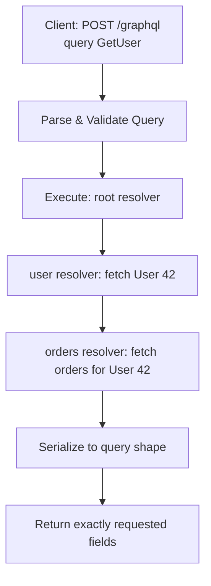

⚡ TL;DR - GraphQL is a query language for APIs where
clients specify exactly what data they need in a typed
schema; a single endpoint (`POST /graphql`) handles
all queries, mutations, and subscriptions; clients
eliminate over-fetching (REST returns all fields
whether needed or not) and under-fetching (one GraphQL
query retrieves nested data that would require multiple
REST calls); the N+1 query problem (loading N users
then N separate author queries) is the most critical
performance trap; DataLoader batches these into
one query.

---

| #038 | Category: HTTP & APIs | Difficulty: ★★★ |
|:---|:---|:---|
| **Depends on:** | API Endpoint Design, Request Validation | |
| **Used by:** | GraphQL Schema Design, GraphQL N+1 Problem, GraphQL Federation | |
| **Related:** | GraphQL Schema Design, GraphQL N+1 Problem, gRPC vs REST vs GraphQL | |

---

### 🔥 The Problem This Solves

**WORLD WITHOUT IT:**
Facebook's mobile app (2012) needed to load a news feed:
post content + author name + author avatar + comment
count + reactions. In REST: 1 GET for the feed (gets
post IDs) + N GETs for each post + N GETs for authors
+ N GETs for comment counts = 3N+1 requests. On a 3G
mobile connection, this is seconds of loading time.

**THE BREAKING POINT:**
REST's resource-centric model forces clients to make
multiple round-trips or receive bloated responses
(include everything in one nested response, even if
the client needs only 2 of 20 fields). On mobile, both
problems are amplified: slow network means round-trips
are expensive; metered data means over-fetching is
costly.

**THE INVENTION MOMENT:**
Facebook developed GraphQL internally in 2012 and open-
sourced it in 2015. Key insight: let the client describe
the shape of the data it needs. The server returns
exactly that shape. One request, one response, exactly
the fields needed - no more, no less.

---

### 📘 Textbook Definition

GraphQL is a query language for APIs and a runtime
for executing those queries against a type system.
**Schema (SDL):** defines types (`type User`), queries
(`type Query { user(id: ID!): User }`), mutations
(`type Mutation { createUser(input: CreateUserInput!):
User }`), and subscriptions. **Resolver:** a function
that fetches data for a specific field in the schema.
**Query:** client specifies exactly which fields to
return, including nested objects. **Mutation:** client
requests a state change. **Subscription:** client
receives real-time updates when data changes (via
WebSocket). **Introspection:** the schema is queryable
(`__schema`, `__type`); tools like GraphiQL discover
the API dynamically. **Single endpoint:** all operations
go to `POST /graphql` (or GET for simple queries).
**Transport:** HTTP (most common), WebSocket (for
subscriptions).

---

### ⏱️ Understand It in 30 Seconds

**One line:**
GraphQL is a "pick your own data" API: instead of the
server deciding what data to return, the client describes
exactly what it wants, and gets back exactly that -
no more fields, no extra requests.

**One analogy:**
> REST is a set-meal: you order "the burger", you get
> patty + bun + fries + coleslaw (whether you want it
> or not). GraphQL is ordering a la carte: "I want a
> patty and bun, no fries. Also, tell me the restaurant
> name on the same ticket." You get exactly what you
> asked for, in one response.

**One insight:**
GraphQL's superpower is co-location of data requirements.
The React component that renders a user card specifies
the exact fields it needs in a GraphQL fragment. When
the component is deleted, the fragment goes with it.
Data requirements are co-located with the code that
uses them, eliminating the "what fields does this
component need?" communication problem between frontend
and backend teams.

---

### 🔩 First Principles Explanation

**GRAPHQL SCHEMA SDL:**
```graphql
# Schema Definition Language
type User {
  id: ID!              # Non-null (! = required)
  email: String!
  name: String!
  orders: [Order!]!    # List of non-null Orders
  createdAt: DateTime!
}

type Order {
  id: ID!
  total: Float!
  status: OrderStatus!
  items: [OrderItem!]!
  user: User!          # Reverse relation
}

enum OrderStatus {
  PENDING
  CONFIRMED
  SHIPPED
  DELIVERED
  CANCELLED
}

type Query {
  user(id: ID!): User          # Nullable: null if not found
  users(limit: Int = 10): [User!]!
  order(id: ID!): Order
}

type Mutation {
  createUser(input: CreateUserInput!): User!
  updateUser(id: ID!, input: UpdateUserInput!): User!
}

type Subscription {
  orderStatusChanged(orderId: ID!): Order!
}

input CreateUserInput {
  email: String!
  name: String!
}
```

**CLIENT QUERY:**
```graphql
# Client asks for exactly what it needs
query GetUserWithOrders($userId: ID!) {
  user(id: $userId) {
    id
    name                # NOT email (not needed)
    orders {
      id
      total
      status
      # NOT items (not needed for this view)
    }
  }
}
```

**SERVER RESPONSE (exactly what was asked):**
```json
{
  "data": {
    "user": {
      "id": "42",
      "name": "Alice",
      "orders": [
        {"id": "101", "total": 49.99, "status": "SHIPPED"},
        {"id": "102", "total": 12.50, "status": "DELIVERED"}
      ]
    }
  }
}
```

**REST EQUIVALENT (over-fetches):**
```
GET /users/42 → {id, email, name, avatar, bio, createdAt, ...}
GET /users/42/orders → [{id, total, status, items: [...], user: {...}, ...}]
Two requests. Both return many unused fields.
```

---

### 🧪 Thought Experiment

**SCENARIO: User profile page with 5 sections**

Design a page that shows: basic info, recent orders,
wishlist, address book, payment methods.

**REST approach:**
```
GET /users/1           → user info
GET /users/1/orders    → recent orders
GET /users/1/wishlist  → wishlist items
GET /users/1/addresses → addresses
GET /users/1/payments  → payment methods
= 5 sequential or parallel HTTP requests
```

**GraphQL approach:**
```graphql
query UserProfile($id: ID!) {
  user(id: $id) {
    name
    email
    recentOrders(limit: 5) {
      id
      total
      status
    }
    wishlist {
      id
      name
      price
    }
    addresses {
      street
      city
      country
    }
    paymentMethods {
      type
      last4
    }
  }
}
= 1 request, server resolves all data
```

One GraphQL query replaces 5 REST calls. On mobile
with 50ms RTT, this saves 200ms of network overhead.

---

### 🧠 Mental Model / Analogy

> A GraphQL schema is a type system for your entire
> data model. Each field in the schema is a function
> (resolver) that knows how to fetch that specific piece
> of data. When a client sends a query, GraphQL walks
> the query tree and calls the appropriate resolver for
> each field. The final response mirrors the query
> structure. It is like a recursive function call:
> query for `user.orders.items.product.name` triggers
> resolver chain: user_resolver → orders_resolver →
> items_resolver → product_resolver → name field.

---

### 📶 Gradual Depth - Five Levels

**Level 1 - What it is (anyone can understand):**
GraphQL lets your app's frontend ask the server: "I need
the user's name, their last 3 orders, and each order's
total." The server returns exactly that - not a huge
blob of data with 20 fields you do not need, not 3
separate requests. One question, one precise answer.

**Level 2 - How to use it (junior developer):**
Define a schema in SDL. Write resolvers for each field.
Use Apollo Server or Strawberry (Python) to host the
GraphQL endpoint. Client uses Apollo Client or any
HTTP client to send POST requests with a `query` body.
Fragments reuse field selections across queries.

**Level 3 - How it works (mid-level engineer):**
GraphQL execution: parse query → validate against schema
→ execute (walk query tree, call resolvers) → serialize
result. Resolver chain: root resolver (e.g., `user(id:
42)`) → field resolver for each requested field →
nested resolvers for `orders` → nested resolvers for
each order's fields. N+1 problem: `user.orders` resolver
called once (returns N orders), then `order.user`
resolver called N times (N database queries). DataLoader
batches these N individual calls into one query.

**Level 4 - Why it was designed this way (senior/staff):**
GraphQL's type system (SDL + introspection) enables
tooling that REST cannot match: Apollo Studio displays
the full schema visually; GraphiQL provides autocomplete
from live schema; code generators produce typed hooks
(React Query, Apollo Client) from the schema. This
tooling advantage is significant: frontend developers
can explore the API, write typed queries, and have
compile-time safety without manually reading documentation.
The trade-off: this depth requires schema design expertise
(poorly designed schemas create N+1 problems at every
resolver level).

**Level 5 - Mastery (distinguished engineer):**
GraphQL's subscription mechanism uses WebSocket under
the hood. For a large-scale system, subscriptions do
not scale to millions of concurrent subscribers via
direct WebSocket connections to the GraphQL server.
Production pattern: subscriptions are events published
to a message broker (Redis Pub/Sub, Kafka). GraphQL
subscription server subscribes to relevant topics and
pushes events to connected clients. Each GraphQL server
instance handles a subset of WebSocket connections;
the broker provides the fan-out. Query complexity
analysis (cost-based limiting) prevents clients from
submitting deeply nested queries that would traverse
millions of database records. Depth limiting alone is
insufficient; cost-based analysis assigns weights to
field resolvers.

---

### ⚙️ How It Works (Mechanism)

**Python GraphQL server with Strawberry:**

```python
import strawberry
from typing import List, Optional

@strawberry.type
class Order:
    id: strawberry.ID
    total: float
    status: str

@strawberry.type
class User:
    id: strawberry.ID
    name: str
    email: str

    @strawberry.field
    def orders(self) -> List[Order]:
        # Resolver: fetches orders for this user
        return db.get_orders_by_user(int(self.id))

@strawberry.type
class Query:
    @strawberry.field
    def user(self, id: strawberry.ID) -> Optional[User]:
        user = db.get_user(int(id))
        if not user:
            return None
        return User(
            id=str(user.id),
            name=user.name,
            email=user.email
        )

    @strawberry.field
    def users(self, limit: int = 10) -> List[User]:
        return [
            User(id=str(u.id), name=u.name, email=u.email)
            for u in db.get_users(limit=limit)
        ]

schema = strawberry.Schema(query=Query)

from fastapi import FastAPI
from strawberry.fastapi import GraphQLRouter

app = FastAPI()
app.include_router(GraphQLRouter(schema), prefix="/graphql")
```



---

### 🔄 The Complete Picture - End-to-End Flow

**GraphQL mutation with input type:**

```graphql
# Client sends mutation
mutation CreateUser($input: CreateUserInput!) {
  createUser(input: $input) {
    id
    name
    email
  }
}

# Variables (separate from query string)
{
  "input": {
    "name": "Alice",
    "email": "alice@example.com"
  }
}
```

```python
# Server resolver
@strawberry.mutation
def create_user(
    self, input: CreateUserInput
) -> User:
    if db.user_exists(email=input.email):
        raise strawberry.types.graphql.GraphQLError(
            "Email already registered",
            extensions={"code": "EMAIL_TAKEN"}
        )
    user = db.create_user(
        name=input.name, email=input.email
    )
    return User(
        id=str(user.id),
        name=user.name,
        email=user.email
    )
```

---

### 💻 Code Example

**Example 1 - BAD: GraphQL without DataLoader (N+1 problem)**

```python
# BAD: N+1 queries in resolver
@strawberry.type
class Post:
    id: strawberry.ID
    title: str
    author_id: int

    @strawberry.field
    def author(self) -> User:
        # DANGER: Called once per post
        # For 100 posts: 100 separate DB queries
        return db.get_user(self.author_id)

# Query: { posts { title author { name } } }
# Result: 1 query for posts + 100 queries for authors
# = 101 DB queries total

# GOOD: Use DataLoader for batching
from strawberry.dataloader import DataLoader

async def load_users_batch(user_ids: List[int]) -> List[User]:
    users = db.get_users_by_ids(user_ids)  # 1 query
    user_map = {u.id: u for u in users}
    return [user_map.get(uid) for uid in user_ids]

user_loader = DataLoader(load_fn=load_users_batch)

@strawberry.type
class Post:
    author_id: strawberry.Private[int]  # Not in schema

    @strawberry.field
    async def author(self, info) -> User:
        # DataLoader batches ALL author lookups
        # into ONE query regardless of N posts
        return await info.context["user_loader"].load(
            self.author_id
        )
# Result: 2 queries total (posts + batched users)
```

---

**Example 2 - Query depth limiting**

```python
from graphql import build_schema
from graphql.validation import validate
from graphql.validation.rules import NoSchemaIntrospectionCustomRule

def check_query_depth(query_ast, max_depth: int = 5) -> int:
    """Prevent deeply nested queries that exhaust resources."""
    def _get_depth(node, depth=0):
        if not hasattr(node, "selection_set"):
            return depth
        if node.selection_set is None:
            return depth
        max_child = max(
            (_get_depth(child, depth + 1)
             for child in node.selection_set.selections),
            default=depth
        )
        return max_child

    for definition in query_ast.definitions:
        depth = _get_depth(definition)
        if depth > max_depth:
            raise ValueError(
                f"Query too deep: {depth} > {max_depth}"
            )
```

---

### ⚖️ Comparison Table

| Feature | GraphQL | REST | gRPC |
|:---|:---|:---|:---|
| Data fetching | Client-specified | Server-specified | Server-specified |
| Over/under-fetching | Eliminated | Common | Common |
| Schema | Required (SDL) | Optional (OpenAPI) | Required (proto) |
| Endpoint count | 1 | Many | Many (RPC methods) |
| Caching | Complex (POST-based) | Simple (HTTP GET) | Complex |
| Browser support | Native | Native | Needs proxy |
| N+1 problem | Yes (needs DataLoader) | Also exists (REST) | No (batch RPCs) |

---

### ⚠️ Common Misconceptions

| Misconception | Reality |
|:---|:---|
| GraphQL eliminates N+1 problems | GraphQL makes N+1 problems easier to create. Every nested field resolver runs per parent. DataLoader is required to batch field-level database lookups. Without DataLoader, GraphQL APIs are often slower than REST. |
| GraphQL POST requests cannot be cached by CDN | Most GraphQL is POST, which CDNs do not cache by default. Persisted queries (client sends hash of query; server has pre-registered query body) allow GET requests for cached operations. Apollo also supports HTTP GET for simple queries. |
| GraphQL schema is optional | The schema is mandatory in GraphQL. It defines all available types, queries, mutations, and subscriptions. Introspection (querying `__schema`) exposes the schema to clients, which is both a tooling benefit and a security consideration (disable introspection in production). |
| Mutations must be POST | GraphQL mutations are technically part of the query body in any HTTP method. However, mutations should always use POST semantically (they have side effects). GET requests with query strings are acceptable for read-only queries but not mutations. |

---

### 🚨 Failure Modes & Diagnosis

**N+1 queries on every list endpoint**

**Symptom:** Loading 50 posts with their authors sends
51 database queries. API response time is 5-10x slower
than equivalent REST endpoints.

**Root Cause:** `author` resolver calls `db.get_user()` individually per post. GraphQL executes field resolvers independently, with no automatic batching.

**Diagnostic:**
```python
# Enable SQL query logging
import logging
logging.getLogger("sqlalchemy.engine").setLevel(logging.INFO)
# Then run a GraphQL query. Count the SELECT statements.
# If you see N SELECTs for N posts: N+1 confirmed.

# Or use Django Debug Toolbar / SQLAlchemy event hooks
# to count queries per GraphQL request
```

**Fix:** Implement DataLoader for all cross-entity
field resolvers. Each DataLoader receives all IDs
collected during a tick, runs one batched query, and
returns results in order. Zero N+1 with DataLoader.

---

**Unbounded query depth causes memory exhaustion**

**Symptom:** Server runs OOM or times out on certain
queries. Malicious client sends `{ user { friends {
friends { friends { ... 50 levels deep } } } } }`.

**Root Cause:** No query depth or complexity limits.
GraphQL executes any valid query regardless of how
expensive it is.

**Fix:** (1) Query depth limit (max 5-7 levels). (2)
Query complexity analysis: assign cost per field; reject
queries over a cost budget. (3) Query timeout (60s max).
(4) Disable introspection in production (prevents
automated schema exploration).

---

### 🔗 Related Keywords

**Prerequisites (understand these first):**
- `API Endpoint Design` - REST concepts GraphQL is compared to
- `Request Validation` - schema validation in GraphQL

**Builds On This (learn these next):**
- `GraphQL Schema Design` - designing scalable schemas
- `GraphQL N+1 Problem and DataLoader` - solving the
  most common GraphQL performance trap

---

### 📌 Quick Reference Card

```
┌──────────────────────────────────────────────────────────┐
│ WHAT IT IS   │ Query language: client specifies exactly  │
│              │ what data to return; single /graphql      │
│              │ endpoint for all queries and mutations    │
├──────────────┼───────────────────────────────────────────┤
│ PROBLEM IT   │ REST over-fetching and multiple round-    │
│ SOLVES       │ trips for nested data on mobile           │
├──────────────┼───────────────────────────────────────────┤
│ KEY INSIGHT  │ DataLoader is non-optional: without it,   │
│              │ nested field resolvers cause N+1 queries  │
├──────────────┼───────────────────────────────────────────┤
│ USE WHEN     │ Complex client data requirements; mobile; │
│              │ frontend teams driving API evolution      │
├──────────────┼───────────────────────────────────────────┤
│ ANTI-PATTERN │ GraphQL without DataLoader (N+1);         │
│              │ no query depth/complexity limits          │
├──────────────┼───────────────────────────────────────────┤
│ ONE-LINER    │ "Client asks for exact shape; server      │
│              │ resolves it. DataLoader prevents N+1."    │
├──────────────┼───────────────────────────────────────────┤
│ NEXT EXPLORE │ GraphQL Schema Design → N+1 + DataLoader  │
└──────────────────────────────────────────────────────────┘
```

**If you remember only 3 things:**
1. GraphQL eliminates over-fetching and multiple round-
   trips at the cost of resolver complexity. Always use
   DataLoader for any field resolver that queries by ID.
2. Every nested field resolver is called per parent.
   100 posts × author resolver = 100 DB queries. DataLoader
   batches these into 1.
3. Add query depth limits and complexity budgets before
   going to production. A client can exhaust your server
   with a single deeply-nested query.

---

### 💎 Transferable Wisdom

**Reusable Engineering Principle:**
"Batch, don't request individually." The DataLoader
pattern (collect individual IDs during the current
tick, batch into one query, return results in order)
applies wherever you are making individual lookups in
a loop: N+1 in any ORM (REST APIs have this problem
too), Elasticsearch multi-get vs N individual GET
requests, database connection pool over-allocation
(batch work per connection instead of opening one
per task). The "collect-then-batch" pattern is a
universal performance optimization for I/O-bound
sequential operations.

**Where else this pattern applies:**
- ORMs (Django, ActiveRecord): `select_related` and
  `prefetch_related` are SQL JOINs that solve the same
  N+1 problem in REST endpoints
- Redis pipelines: batch multiple commands in one
  network round-trip (same collect-then-batch principle)
- Kafka batch publishing: collect N events then send
  as a batch (vs N individual produce calls)

---

### 💡 The Surprising Truth

GitHub's GraphQL API (launched 2016) was one of the
first major public GraphQL deployments. After several
years, GitHub's engineering team wrote about the
challenges: client teams had too much power to write
expensive queries; N+1 problems emerged in unexpected
places; the single endpoint made rate limiting harder
than REST (a single GraphQL query could be equivalent
to hundreds of REST calls). GitHub now recommends
REST for most integrations and positions GraphQL for
complex data requirements only. Facebook (the creator)
has moved many internal services away from GraphQL
toward more specific REST endpoints where performance
is critical. GraphQL is a powerful tool for the right
problem, not a universal REST replacement.

---

### ✅ Mastery Checklist

**You've mastered this when you can:**
1. **WRITE** A GraphQL schema in SDL with types,
   queries, mutations, input types, enums, and non-null
   annotations.
2. **IMPLEMENT** Resolvers with DataLoader batching to
   prevent N+1 queries in a 3-level nested query.
3. **EXPLAIN** The N+1 problem with a concrete example
   and demonstrate that DataLoader reduces it from N+1
   queries to 2 queries.
4. **DESIGN** Query complexity limits: depth limit and
   cost-based analysis to prevent resource exhaustion.
5. **COMPARE** GraphQL vs REST vs gRPC for a given use
   case and justify the choice with trade-offs.

---

### 🎯 Interview Deep-Dive

**Q1: What is the GraphQL N+1 problem and how do you
solve it?**

*Why they ask:* Most critical GraphQL performance issue.

*Strong answer includes:*
- N+1 occurs when fetching a list (1 query) and then
  a related object for each item (N queries). Example:
  100 posts → `author` resolver called 100 times → 100
  `SELECT * FROM users WHERE id = ?` queries.
- GraphQL makes N+1 easy to create because each field
  has its own resolver, and resolvers run independently
  per parent object.
- DataLoader solution: (1) DataLoader collects all
  requested IDs during the current "tick" (synchronous
  iteration of resolvers). (2) At the end of the tick,
  calls the batch function with all IDs: `SELECT * FROM
  users WHERE id IN (1, 2, ..., 100)` - 1 query.
  (3) Returns individual results back to each resolver.
- Result: 100 posts + 100 author lookups = 2 queries
  total (posts + batched users). This is mandatory for
  any GraphQL API serving nested data.

**Q2: How does GraphQL handle schema validation and
type safety?**

*Why they ask:* Tests depth of schema understanding.

*Strong answer includes:*
- SDL defines all types with strict typing: `String!`
  (non-null string), `[User!]!` (non-null list of
  non-null Users), `Int` (nullable integer).
- The runtime validates every query against the schema
  before execution: unknown field → validation error;
  wrong argument type → validation error.
- Introspection: clients can query `__schema` to
  discover all types, fields, and their nullability.
  Tools (GraphiQL, Apollo Studio) use introspection
  for autocomplete.
- Security: disable introspection in production to
  prevent schema enumeration by attackers.
- Code generation (graphql-codegen): generates TypeScript
  types from the schema. Frontend code has compile-time
  type safety for GraphQL queries and responses.

**Q3: When would you choose GraphQL over REST?**

*Why they ask:* Tests pragmatic technology selection.

*Strong answer includes:*
- Choose GraphQL when: (1) clients have diverse data
  needs (mobile app needs less data than desktop); (2)
  frontend teams drive API evolution faster than backend;
  (3) nested data with many relations (avoiding multiple
  REST round-trips); (4) API product (developers consume
  the API and benefit from introspection and tooling).
- Choose REST when: (1) simple CRUD operations; (2)
  HTTP caching is important (REST GET is cacheable;
  GraphQL POST is not); (3) public API with simple client
  needs; (4) team lacks GraphQL expertise (N+1 traps).
- Choose gRPC when: (1) internal microservices with
  performance requirements; (2) bidirectional streaming;
  (3) multi-language clients with strong typing.
- GitHub's experience: GraphQL for complex data
  exploration; REST for well-defined operations.
