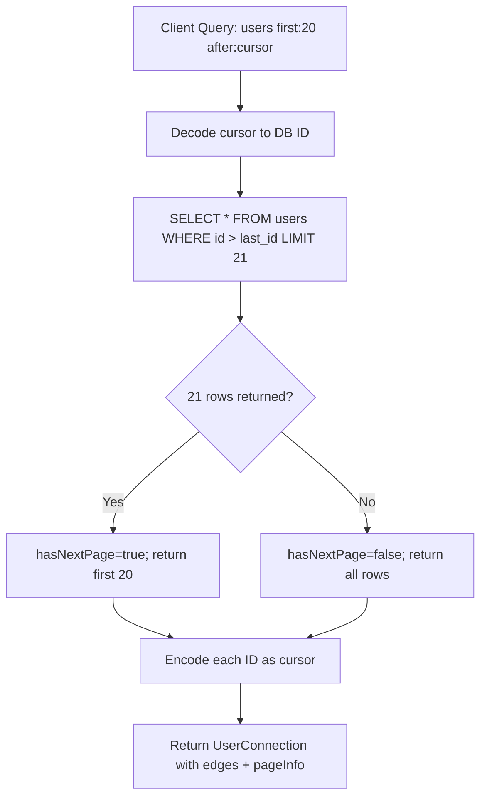

⚡ TL;DR - GraphQL schema design determines API usability
and long-term evolution; the Relay specification provides
globally-unique IDs (`node(id)` for any type), Connections
(cursor-based pagination with `edges`/`pageInfo`), and
input types for mutations; use union types for polymorphic
results (success union with errors); never expose your
database schema directly as the GraphQL schema; additive
changes are safe (adding fields/types); removing or
renaming fields is a breaking change.

---

| #039 | Category: HTTP & APIs | Difficulty: ★★★ |
|:---|:---|:---|
| **Depends on:** | GraphQL Query Language | |
| **Used by:** | GraphQL N+1 Problem, GraphQL Federation, GraphQL Core Design | |
| **Related:** | GraphQL Query Language, GraphQL N+1 Problem, GraphQL Federation | |

---

### 🔥 The Problem This Solves

**WORLD WITHOUT IT:**
GraphQL without schema design principles becomes a thin
wrapper over the database: table columns become schema
fields, foreign keys become nested types, database IDs
are exposed as-is. When the database changes, the schema
breaks. When a page needs differently structured data,
you add a new bespoke resolver instead of composing
existing types. Pagination is implemented differently
by every resolver.

**THE BREAKING POINT:**
Large GraphQL schemas without conventions become
impossible to navigate: 200 root-level queries, no
consistent ID strategy (some IDs are `Int`, some are
`String`, some are `UUID`), no consistent pagination
pattern, mutations return different result shapes.
Frontend developers cannot predict what they will find.

**THE INVENTION MOMENT:**
Facebook's Relay client (2015) defined schema conventions
that make client-side caching and pagination reliable:
globally-unique `id` fields, the `node` interface
(fetch any object by global ID), Connection type
(standardized cursor pagination), and mutation input/
output conventions. These Relay Spec conventions became
widely adopted even for non-Relay clients.

---

### 📘 Textbook Definition

GraphQL schema design encompasses: **Relay Global IDs:**
every type implementing the `Node` interface has a
globally-unique opaque `id` (typically base64-encoded
`type:databaseId`); `Query.node(id: ID!)` returns any
object by global ID. **Connection pattern:** paginated
lists use `UserConnection` with `edges` (array of
`UserEdge` with `node` and `cursor`), `pageInfo`
(`hasNextPage`, `hasPreviousPage`, `startCursor`,
`endCursor`), and optional `totalCount`. **Union result
types for mutations:** `mutation { createUser(input:
...) { ... on User { id } ... on CreateUserError
{ message } } }` enables typed error handling. **Input
types:** mutations use `input` types (not raw arguments)
for extensibility. **Schema stitching vs Federation:**
combining multiple GraphQL services into one graph.
**Deprecation:** `@deprecated(reason: "...")` directive
marks fields for removal.

---

### ⏱️ Understand It in 30 Seconds

**One line:**
GraphQL schema design is the difference between a schema
that is a database dump and a schema that is a usable
API - conventions for IDs, pagination, and mutation
results make schemas predictable across all types.

**One analogy:**
> Schema design conventions are like city grid systems.
> Manhattan's numbered streets and avenues: you can
> navigate without a map (pattern is predictable). An
> unplanned city: every street has a different naming
> system, dead ends everywhere. Relay spec conventions
> are Manhattan's grid for GraphQL: once you know the
> pattern, you can navigate any conforming schema.

**One insight:**
The most important schema design decision is: expose
a domain model, not a data model. Your database has
`user_preferences` table with 15 columns. Your GraphQL
schema should have `user.preferences.theme` and
`user.preferences.notifications` - the domain concepts,
not the table columns. When you later refactor the
preferences to a NoSQL document store, the GraphQL
schema stays stable.

---

### 🔩 First Principles Explanation

**RELAY NODE INTERFACE:**
```graphql
interface Node {
  id: ID!
}

type User implements Node {
  id: ID!          # Globally unique (opaque)
  email: String!
  name: String!
}

type Order implements Node {
  id: ID!
  total: Float!
}

type Query {
  # Fetch any object by its global ID
  node(id: ID!): Node

  user(id: ID!): User
}
```

Global ID encoding:
```python
import base64

def to_global_id(type_name: str, db_id: int) -> str:
    """Encode type and database ID into global ID."""
    raw = f"{type_name}:{db_id}"
    return base64.b64encode(raw.encode()).decode()

def from_global_id(global_id: str) -> tuple[str, int]:
    """Decode global ID to type and database ID."""
    raw = base64.b64decode(global_id).decode()
    type_name, db_id = raw.split(":", 1)
    return type_name, int(db_id)

# User with db id=42: "VXNlcjoo" (base64 of "User:42")
```

**RELAY CONNECTION PATTERN:**
```graphql
type UserEdge {
  node: User!
  cursor: String!      # Opaque pagination cursor
}

type PageInfo {
  hasNextPage: Boolean!
  hasPreviousPage: Boolean!
  startCursor: String
  endCursor: String
}

type UserConnection {
  edges: [UserEdge!]!
  pageInfo: PageInfo!
  totalCount: Int!
}

type Query {
  users(
    first: Int
    after: String
    last: Int
    before: String
    filter: UserFilter
  ): UserConnection!
}
```

Client query with pagination:
```graphql
query GetUsers($cursor: String) {
  users(first: 20, after: $cursor) {
    edges {
      node {
        id
        name
        email
      }
      cursor
    }
    pageInfo {
      hasNextPage
      endCursor
    }
    totalCount
  }
}
```

**MUTATION RESULT UNION:**
```graphql
type CreateUserSuccess {
  user: User!
}

type CreateUserError {
  message: String!
  field: String       # Which field caused the error
  code: ErrorCode!
}

union CreateUserResult = CreateUserSuccess | CreateUserError

type Mutation {
  createUser(input: CreateUserInput!): CreateUserResult!
}
```

Client-side typed error handling:
```graphql
mutation CreateUser($input: CreateUserInput!) {
  createUser(input: $input) {
    ... on CreateUserSuccess {
      user {
        id
        email
      }
    }
    ... on CreateUserError {
      message
      field
      code
    }
  }
}
```

---

### 🧪 Thought Experiment

**SCENARIO: Pagination strategy for a social feed**

**Option A: Offset pagination**
```graphql
users(offset: Int, limit: Int): [User!]!
```
Problem: items shift between pages during inserts.
Between page 1 and page 2, if a new user is inserted,
the user that was at position 21 is now at position 22.
Page 2 starts at offset 21 - user at old position 21
(now 22) is skipped. Users can be duplicated or missed.

**Option B: Cursor pagination (Relay Connection)**
```graphql
users(first: 20, after: $cursor): UserConnection!
```
Cursor points to a specific user ID. "Give me 20 users
after user with cursor X" is stable regardless of
concurrent inserts. No items skipped, no items duplicated.
Trade-off: cannot jump to page 7 directly (must paginate
sequentially).

**Decision:** Use cursor pagination for feeds and lists
with inserts. Use offset only for static data or when
random page access is required.

---

### 🧠 Mental Model / Analogy

> Relay Connection pagination is like reading a book
> with a bookmark. Instead of saying "go to page 42"
> (offset - breaks when pages are added), you place
> a bookmark at "after chapter 3" (cursor). Next time
> you open the book, you find your bookmark regardless
> of whether chapters were added before or after it.
> The cursor is the bookmark. `hasNextPage` tells you
> if there is more to read. `endCursor` is where to
> place the next bookmark.

---

### 📶 Gradual Depth - Five Levels

**Level 1 - What it is (anyone can understand):**
GraphQL schema design is about creating consistent
patterns across your API. Just like a city with street
naming conventions is easier to navigate than one with
arbitrary names, a GraphQL schema with consistent
pagination, ID, and error patterns is easier to build
clients for.

**Level 2 - How to use it (junior developer):**
Implement the Relay spec: globally-unique opaque `id`
(base64-encoded `Type:id`), Connection type for
paginated lists, input types for mutations, union
result types for mutation responses. Use `@deprecated`
to mark old fields. Never expose database IDs directly.

**Level 3 - How it works (mid-level engineer):**
Relay's `node(id: ID!)` interface requires the schema
to route global IDs to their resolvers. The root `node`
resolver decodes the global ID, extracts the type name,
and routes to the appropriate entity loader. DataLoader
is essential for the `node` interface: many components
may call `node(id: "VXNlcjo0Mg==")` for the same
entity; DataLoader deduplicates and batches.

**Level 4 - Why it was designed this way (senior/staff):**
Relay's global ID design enables client-side cache
normalization. The Relay Store and Apollo InMemoryCache
both use global ID as the cache key. When you fetch
`user(id: "42")` and later fetch `node(id: "VXNlcjo0Mg==")`,
the client recognizes these are the same entity and
returns the cached version. Without globally-unique
IDs, the cache cannot correlate objects fetched via
different queries. The opaque ID (not exposing database
integer) enables the server to change the underlying
storage (from PostgreSQL to MongoDB) without changing
client behavior.

**Level 5 - Mastery (distinguished engineer):**
Schema evolution is the hardest problem in GraphQL
design. Unlike REST (which can version via URL), GraphQL
uses a single endpoint. Breaking changes affect all
clients simultaneously. The `@deprecated` directive
signals intent to remove a field. But the actual removal
requires: (1) monitoring which clients still use the
deprecated field (Apollo Studio field usage tracking);
(2) coordinating with all client teams; (3) removing
only when usage drops to zero. For truly additive
evolution: never remove or rename fields; add new fields
with new names; use `@deprecated` to guide migration.
For large schema refactors: GraphQL Federation enables
independent schema evolution per subgraph.

---

### ⚙️ How It Works (Mechanism)

**Connection resolver implementation:**

```python
import strawberry
from typing import Optional, List
import base64
import json

@strawberry.type
class PageInfo:
    has_next_page: bool
    has_previous_page: bool
    start_cursor: Optional[str] = None
    end_cursor: Optional[str] = None

@strawberry.type
class UserEdge:
    node: "User"
    cursor: str

@strawberry.type
class UserConnection:
    edges: List[UserEdge]
    page_info: PageInfo
    total_count: int

def encode_cursor(user_id: int) -> str:
    """Opaque cursor encoding."""
    return base64.b64encode(
        json.dumps({"id": user_id}).encode()
    ).decode()

def decode_cursor(cursor: str) -> int:
    data = json.loads(base64.b64decode(cursor))
    return data["id"]

@strawberry.type
class Query:
    @strawberry.field
    def users(
        self,
        first: int = 20,
        after: Optional[str] = None,
        filter: Optional[str] = None
    ) -> UserConnection:
        after_id = decode_cursor(after) if after else None

        rows = db.get_users(
            after_id=after_id,
            limit=first + 1,  # +1 to detect hasNextPage
            filter=filter
        )

        has_next = len(rows) > first
        rows = rows[:first]

        edges = [
            UserEdge(
                node=to_user_type(row),
                cursor=encode_cursor(row.id)
            )
            for row in rows
        ]

        return UserConnection(
            edges=edges,
            page_info=PageInfo(
                has_next_page=has_next,
                has_previous_page=after_id is not None,
                start_cursor=edges[0].cursor if edges else None,
                end_cursor=edges[-1].cursor if edges else None
            ),
            total_count=db.count_users(filter=filter)
        )
```



---

### 🔄 The Complete Picture - End-to-End Flow

**Mutation with union result type:**

```python
@strawberry.type
class CreateUserSuccess:
    user: User

@strawberry.type
class EmailAlreadyTakenError:
    message: str
    code: str = "EMAIL_TAKEN"

CreateUserResult = strawberry.union(
    "CreateUserResult",
    [CreateUserSuccess, EmailAlreadyTakenError]
)

@strawberry.type
class Mutation:
    @strawberry.mutation
    def create_user(
        self, input: CreateUserInput
    ) -> CreateUserResult:
        if db.email_exists(input.email):
            return EmailAlreadyTakenError(
                message=f"Email {input.email} is already registered"
            )
        user = db.create_user(
            name=input.name, email=input.email
        )
        return CreateUserSuccess(user=to_user_type(user))
```

---

### 💻 Code Example

**Example 1 - BAD: Exposing database schema directly**

```graphql
# BAD: Database table as GraphQL type
type user_preferences_table {
  user_id: Int       # Expose raw DB column name
  pref_key: String   # Not a useful API concept
  pref_value: String # Generic string for everything
  created_at: String # Raw timestamp string
  updated_at: String
}

# GOOD: Domain model
type UserPreferences {
  theme: Theme!
  notifications: NotificationSettings!
  language: String!
  timezone: String!
}

enum Theme {
  LIGHT
  DARK
  SYSTEM
}

type NotificationSettings {
  emailEnabled: Boolean!
  pushEnabled: Boolean!
  frequency: NotificationFrequency!
}
# Stable API even if backend changes from SQL to NoSQL
```

---

**Example 2 - @deprecated directive**

```graphql
type User {
  id: ID!
  email: String!
  # Old field: kept for backward compat but deprecated
  username: String @deprecated(
    reason: "Use email instead. Will be removed in 2025-Q1."
  )
  # New field
  displayName: String!
}
```

---

### ⚖️ Comparison Table

| Pattern | Description | Use Case |
|:---|:---|:---|
| Simple list | `[User!]!` | Small, static lists |
| Relay Connection | `UserConnection` with edges/pageInfo | Paginated, frequently updated lists |
| Offset pagination | `users(page: Int, limit: Int)` | Admin views with page jump |
| Union result | `Success | Error` union | Mutations with typed errors |
| Interface | `Node`, `Searchable` | Polymorphic types |

---

### ⚠️ Common Misconceptions

| Misconception | Reality |
|:---|:---|
| `totalCount` in Connection is always cheap | `totalCount` requires `SELECT COUNT(*)` which can be expensive on large tables. Many GraphQL schemas make `totalCount` nullable or a separate query. Consider approximate counts (PostgreSQL `pg_class.reltuples`) for performance. |
| Union types and interfaces serve the same purpose | Interface: shared fields across types (all types implementing `Node` have `id`). Union: a field can return one of several unrelated types (e.g., `SearchResult = Post | User | Comment` with no common fields). Use union for heterogeneous lists; interface for shared contract. |
| Schema changes only need to be additive | Removing a field is a breaking change (clients break immediately). Renaming a field is a breaking change. Adding a required argument to an existing field is a breaking change. Adding an optional field or a new type is safe. |
| Relay spec is only for Relay clients | The Relay spec's conventions (global IDs, Connections, `node` interface) provide benefits for any client: global IDs enable Apollo InMemoryCache normalization; Connections provide consistent pagination; `node(id)` enables efficient refetching. |

---

### 🚨 Failure Modes & Diagnosis

**Cursor pagination with mutable sort keys**

**Symptom:** Users report skipped or duplicate items
when paginating through a sorted list that has items
inserted or updated during browsing.

**Root Cause:** Cursor encodes a sort value (e.g.,
`created_at`) that is not unique. Two items with the
same `created_at` timestamp cause cursor ambiguity.

**Fix:** Use a tie-breaker in the cursor: `{created_at,
id}` pair as the cursor. The query becomes: `WHERE
(created_at, id) > (cursor_time, cursor_id)`. This
guarantees unique cursor positions and stable pagination.

---

**`totalCount` causes full table scan per page**

**Symptom:** Paginated queries are slow even when
returning only 20 items. Database CPU spikes on
paginated requests.

**Root Cause:** Each page request includes `totalCount`
which triggers `SELECT COUNT(*)` on a table with 10M
rows (no index on the filtered column).

**Diagnostic:**
```sql
-- EXPLAIN the count query
EXPLAIN SELECT COUNT(*) FROM orders WHERE user_id = 42;
-- If: Seq Scan → no index on user_id
-- Add: CREATE INDEX orders_user_id_idx ON orders(user_id);
```

**Fix:** (1) Add index on filtered columns used in
totalCount. (2) Cache `totalCount` with short TTL
(counts rarely need to be exact per-request). (3) Make
`totalCount` optional in the schema (nullable field
the client must explicitly request).

---

### 🔗 Related Keywords

**Prerequisites (understand these first):**
- `GraphQL Query Language` - fundamentals of GraphQL
  operations and type system

**Builds On This (learn these next):**
- `GraphQL N+1 Problem and DataLoader` - resolver
  performance optimization
- `GraphQL Federation` - multi-schema composition

---

### 📌 Quick Reference Card

```
┌──────────────────────────────────────────────────────────┐
│ WHAT IT IS   │ Schema design patterns: Relay IDs,        │
│              │ Connection pagination, union mutations,   │
│              │ domain model vs database model             │
├──────────────┼───────────────────────────────────────────┤
│ PROBLEM IT   │ Inconsistent schemas; breaking changes;   │
│ SOLVES       │ pagination drift; error type ambiguity    │
├──────────────┼───────────────────────────────────────────┤
│ KEY INSIGHT  │ Expose domain model, not database model;  │
│              │ additive changes are safe; never rename   │
├──────────────┼───────────────────────────────────────────┤
│ RELAY SPEC   │ Node interface + global IDs + Connection  │
│              │ type + mutation result unions             │
├──────────────┼───────────────────────────────────────────┤
│ ANTI-PATTERN │ Exposing DB column names; non-unique      │
│              │ cursors; totalCount without index         │
├──────────────┼───────────────────────────────────────────┤
│ ONE-LINER    │ "Design for the consumer, not the DB;     │
│              │ Relay spec makes schemas predictable."    │
├──────────────┼───────────────────────────────────────────┤
│ NEXT EXPLORE │ N+1 + DataLoader → GraphQL Federation     │
└──────────────────────────────────────────────────────────┘
```

**If you remember only 3 things:**
1. Use Relay-style globally-unique opaque IDs. Enables
   client-side cache normalization and `node(id)` refetch.
   Never expose raw database integer IDs.
2. Use cursor pagination (Connection pattern) for any
   list that has concurrent inserts. Offset pagination
   skips or duplicates items when data changes between
   pages.
3. Never remove or rename a field without a deprecation
   period. Track field usage (Apollo Studio, custom
   logging) to confirm zero usage before removal.

---

### 💎 Transferable Wisdom

**Reusable Engineering Principle:**
"Stable identifiers are the foundation of distributed
systems." Relay's global opaque IDs apply the same
principle as UUIDs in microservices (stable identity
across service boundaries), Kafka offset commits
(stable position in log), and database row UUIDs
(stable reference across replications). Exposing
implementation-specific identifiers (auto-increment
integer IDs) creates coupling: clients cannot use those
IDs across multiple services or after a database
migration. Opaque IDs decouple the identifier from
the implementation.

**Where else this pattern applies:**
- REST API resources: use UUID or opaque token as
  resource IDs (not auto-increment integers)
- Event sourcing: stable event IDs (UUID) enable
  exactly-once processing across service restarts
- Distributed caching: stable cache keys do not embed
  mutable data (user.id:42 not user.email:alice)

---

### 💡 The Surprising Truth

The Relay Connection pattern (edges → node → cursor)
seems verbose compared to just returning `[User]`.
The reason for this verbose structure is a historical
design that was never fully used: `edge` was intended
to carry relationship-specific metadata (e.g., in a
social graph, the `edge` between User A and User B
could carry `friendsSince: Date`, `friendshipType:
FriendshipType` - metadata about the relationship
itself, not about either user). In practice, most
teams never use edge metadata. The structure remains
because changing it would break all Relay-compatible
clients. New frameworks (Pothos, mercurius) offer
simplified connection types for schemas that do not
need edge metadata, keeping `totalCount` and `pageInfo`
without the edge wrapping.

---

### ✅ Mastery Checklist

**You've mastered this when you can:**
1. **IMPLEMENT** Relay global IDs: encode/decode base64
   `Type:id`, `node(id: ID!)` root query, `Node` interface.
2. **BUILD** A Connection type with cursor pagination,
   correctly calculating `hasNextPage` via fetch limit+1.
3. **DESIGN** Union result types for mutations with
   typed success and error variants.
4. **EXPLAIN** Why cursor pagination is more stable than
   offset under concurrent inserts.
5. **PLAN** A field deprecation lifecycle: `@deprecated`
   annotation, usage monitoring, client migration, removal.

---

### 🎯 Interview Deep-Dive

**Q1: Why does Relay use globally-unique opaque IDs
instead of simple integer IDs?**

*Why they ask:* Tests depth of GraphQL client architecture
understanding.

*Strong answer includes:*
- Client-side cache normalization: Relay Store and
  Apollo InMemoryCache use `id` as cache key. If
  `User { id: 42 }` and `Order { id: 42 }` both have
  `id: 42`, the cache conflates them. Global IDs
  (`User:42`, `Order:42`) are unique across types.
- `node(id: ID!)` interface: any object can be refetched
  from its global ID without knowing which query to use.
  Relay uses this for `refetchQuery` and pagination
  refetch.
- Opaque (base64-encoded): decouples client from server
  implementation. The server can change the underlying
  storage, change the encoding format, or split the
  service without clients noticing (the decoded value
  is internal).
- Stability: raw integer auto-increment IDs can collide
  after database reset or migration. UUIDs/opaque IDs
  are globally unique.

**Q2: How would you design schema versioning in GraphQL
(given there is no URL versioning like REST)?**

*Why they ask:* Tests long-term API evolution thinking.

*Strong answer includes:*
- GraphQL has no built-in versioning mechanism. Strategies:
  (1) **Additive-only evolution:** never remove or
  rename fields. Add new fields with new names. Mark
  old ones `@deprecated`.
  (2) **Field arguments for behavior change:** instead
  of `user` vs `userV2`, use `user(version: V2)` or
  add a new field like `userProfile` alongside `user`.
  (3) **Schema evolution monitoring:** track per-field
  usage (Apollo Studio, custom logging middleware).
  Remove fields only when usage = 0.
  (4) **Federation subgraphs:** each subgraph can evolve
  independently; the gateway composes the supergraph.
  Breaking changes in a subgraph do not affect other
  subgraphs.
- What to avoid: multiple `/graphql/v2` endpoints (split
  schema maintenance; clients must manage versions
  manually).

**Q3: How does the Relay Connection spec improve
pagination consistency?**

*Why they ask:* Tests schema design pattern knowledge.

*Strong answer includes:*
- Consistent interface: all paginated lists in the schema
  use `XxxConnection { edges { node, cursor }, pageInfo
  { hasNextPage, endCursor }, totalCount }`. Client
  code for pagination works the same for every list.
- Cursor stability: cursor points to a specific item
  position (not page number). Under concurrent inserts,
  cursor pagination never skips or duplicates items.
- `pageInfo` provides forward/backward navigation
  signals (`hasNextPage`, `hasPreviousPage`).
- Compared to offset: offset shifts when items are
  inserted (item at old position N moves to N+1). With
  10M rows, this causes visible UI flicker on paginated
  lists with activity.
- Limitation: cursor pagination cannot jump to page 7
  (requires sequential traversal). For admin views
  needing random page access, offset is acceptable
  (data is typically static in admin contexts).
