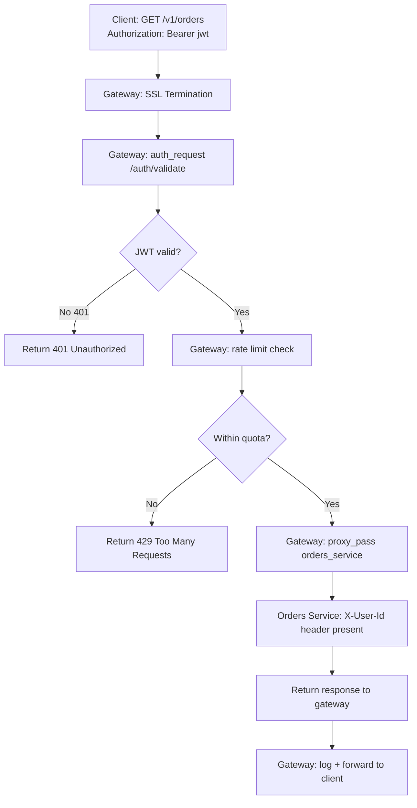

⚡ TL;DR - An API gateway is a reverse proxy that sits
between clients and backend services, centralizing
cross-cutting concerns: authentication/authorization,
rate limiting, SSL termination, request routing, load
balancing, response caching, and observability; the
gateway handles concerns that would otherwise be
duplicated in every microservice; the failure mode is
the gateway becoming a single point of failure and a
performance bottleneck if its latency budget is not
managed; common gateways: AWS API Gateway, Kong, Nginx,
Envoy, and Traefik.

---

| #040 | Category: HTTP & APIs | Difficulty: ★★★ |
|:---|:---|:---|
| **Depends on:** | HTTP Request/Response Cycle, REST API Design Principles | |
| **Used by:** | BFF Pattern, API Gateway Rate Limiting and Auth at Scale, Service Mesh vs API Gateway | |
| **Related:** | BFF Pattern, API Circuit Breaker Pattern, API Gateway Rate Limiting, Service Mesh vs API Gateway | |

---

### 🔥 The Problem This Solves

**WORLD WITHOUT IT:**
50-service microservices architecture without a gateway.
Each service needs to: validate JWTs, apply rate limits,
handle CORS preflight, log requests, parse SSL, and
check authorization. 50 services × 7 cross-cutting
concerns = 350 implementations. When the JWT secret
rotates, 50 services need to be updated. One service
that forgets rate limiting becomes a denial-of-service
vulnerability.

**THE BREAKING POINT:**
Mobile app needs to aggregate data from 5 services for
one screen: user profile (service A), recent orders
(service B), recommendations (service C), notifications
(service D), balance (service E). Without a gateway,
the mobile app makes 5 separate requests with 5 separate
auth checks and 5 separate response parsing steps.
On mobile, 5 sequential requests = 5 × RTT latency.

**THE INVENTION MOMENT:**
Netflix's API gateway (Zuul, 2013) consolidated auth,
rate limiting, and routing for their services. The
gateway aggregated multiple internal service calls
into a single optimized response for each client type
(iOS vs Android vs web vs TV). This eliminated the
client-side fan-out problem.

---

### 📘 Textbook Definition

An API gateway is an entry point for all client requests
to a collection of backend services. **Core functions:**
(1) **Routing:** map `GET /orders` to the Orders Service
at `http://orders:8080`; (2) **Authentication:** validate
JWTs or session tokens centrally, forward identity
headers (`X-User-Id`) to services; (3) **Rate limiting:**
enforce per-client request quotas (100 req/s per API
key); (4) **SSL termination:** handle HTTPS at the
gateway, use HTTP internally between gateway and
services; (5) **Load balancing:** distribute requests
across multiple service instances; (6) **Request/Response
transformation:** add headers, modify payloads, aggregate
responses; (7) **Observability:** centralized request
logging, distributed tracing correlation, metrics
collection. **Key distinction from Service Mesh:**
gateway handles North-South traffic (client → services);
service mesh handles East-West traffic (service →
service). **Products:** Kong (OSS/enterprise), AWS API
Gateway, Nginx, Traefik, Envoy (data plane), Apigee.

---

### ⏱️ Understand It in 30 Seconds

**One line:**
An API gateway is a bouncer + router for your
microservices: checks credentials at the door, then
directs traffic to the right room.

**One analogy:**
> An airport terminal. Arrivals from all flights enter
> via one terminal (the gateway). Security checks tickets
> (authentication), customs limits what you can bring
> in (rate limiting), and departure gates route you to
> the right aircraft (service routing). Without the
> terminal, each airline would need its own security
> checkpoint in a different location.

**One insight:**
The gateway enables the "dumb pipes, smart services"
inversion: instead of services implementing all cross-
cutting concerns, services focus on business logic.
The gateway is smart about infrastructure; services
are smart about domain. This clean separation is the
fundamental value of the gateway pattern.

---

### 🔩 First Principles Explanation

**Request routing with Kong (declarative):**

```yaml
# kong.yml - declarative config
services:
  - name: orders-service
    url: http://orders:8080
    routes:
      - paths: [/v1/orders]
        methods: [GET, POST]
    plugins:
      - name: jwt
        config:
          secret_is_base64: false
      - name: rate-limiting
        config:
          minute: 100
          policy: local

  - name: users-service
    url: http://users:8080
    routes:
      - paths: [/v1/users]
        methods: [GET, POST, PUT]
    plugins:
      - name: jwt
      - name: cors
        config:
          origins: ["https://app.example.com"]
```

**Authentication flow at the gateway:**

```
Client                 Gateway              Orders Service
  |                      |                        |
  |-- POST /v1/orders --> |                        |
  |   Authorization:      |                        |
  |   Bearer <jwt>        |                        |
  |                       |-- Validate JWT ------> |
  |                       |   (JWKS endpoint)      |
  |                       |                        |
  |                       |-- If valid:            |
  |                       |   Forward request      |
  |                       |   + X-User-Id: 42      |
  |                       |   + X-User-Role: admin |
  |                       |                 -----> |
  |                       |                        |
  |                       | <---- 201 Created ---- |
  |<--- 201 Created ----- |
```

Services receive pre-validated identity via headers:
services trust `X-User-Id` and `X-User-Role` headers
because only the gateway can set them (internal network).

---

### 🧪 Thought Experiment

**SCENARIO: Mobile app screen with 5 data sources**

Mobile app dashboard: user name + balance + 3 recent
orders + 2 notifications.

**Without gateway:**
```
App → GET /users/42        (Users Service)
App → GET /balance/42      (Finance Service)
App → GET /orders?limit=3  (Orders Service)
App → GET /notifications   (Notifications Service)
= 4 requests, 4 round-trips, 4 auth checks
```

**With gateway (aggregation):**
```
App → GET /dashboard

Gateway routes to:
  → GET users:8080/42
  → GET finance:8080/balance/42
  → GET orders:8080?limit=3
  → GET notifications:8080?limit=2
    (all 4 in parallel, internal network)

Gateway aggregates → returns one response:
{user: {...}, balance: {...},
 recentOrders: [...], notifications: [...]}
```

Mobile RTT: 80ms. Without gateway: 4 × 80ms = 320ms.
With gateway aggregation: 1 × 80ms + internal fan-out
(~10ms) = 90ms. 3.5x faster for the mobile client.

---

### 🧠 Mental Model / Analogy

> The API gateway is the load-bearing wall of your
> microservices architecture. Everything that would be
> duplicated across 50 services - authentication, rate
> limiting, TLS, logging - lives in one place. Move it
> or remove it and the entire structure needs to be
> rebuilt. That is both its power (single place to
> enforce policy) and its risk (single point of failure
> if not made resilient with active-active redundancy
> and circuit breakers to upstream services).

---

### 📶 Gradual Depth - Five Levels

**Level 1 - What it is (anyone can understand):**
Imagine 50 restaurants in a food court. Instead of
each restaurant checking IDs, taking payments, and
handling parking, there is one central entrance that
handles all of that. You show your ID once, pay once,
and get directed to whichever restaurant you chose. An
API gateway does the same for microservices.

**Level 2 - How to use it (junior developer):**
Deploy Kong, Nginx, or AWS API Gateway in front of your
services. Define routes (`/orders` → orders service,
`/users` → users service). Add plugins for JWT validation,
rate limiting, CORS. Services receive `X-User-Id` from
the gateway and trust it. No auth logic in individual
services.

**Level 3 - How it works (mid-level engineer):**
Gateway handles the request lifecycle: (1) accept TLS
connection, terminate SSL; (2) extract JWT from
`Authorization: Bearer` header; (3) validate JWT against
JWKS endpoint (or cached public key); (4) check rate
limit counter in Redis; (5) apply transform (add headers,
modify path); (6) route to upstream via HTTP; (7) receive
response; (8) apply response transform; (9) log request
with trace ID; (10) return response to client. Each step
adds latency: well-designed gateways add 1-5ms.

**Level 4 - Why it was designed this way (senior/staff):**
The gateway's most important operational property is
that it should never block services from serving
legitimate traffic. Patterns for gateway resilience:
(1) Active-active gateway cluster (multiple gateway
instances behind a load balancer) so no single instance
is a SPOF. (2) Fallback on Redis failure (rate limiting
should fail open - allow traffic when Redis is down -
rather than blocking all traffic). (3) Circuit breaker
per upstream service (gateway trips CB if service is
down; returns 503 instead of queuing requests that will
time out). (4) Lightweight request processing (move
heavy logic to async processing, not the synchronous
gateway path).

**Level 5 - Mastery (distinguished engineer):**
At scale, the gateway itself becomes a performance
concern. A gateway adding 10ms to every request becomes
10ms × 1M req/s = 10M ms of added latency per second
across the fleet. Optimization techniques: (1) Local
JWT validation (validate JWT using cached public key
without calling the auth service per request - JWKS
public keys are valid for hours). (2) Local rate
limiting counters with periodic sync to Redis (tradeoff:
slightly inaccurate counts vs Redis round-trip per
request). (3) Connection pooling to upstream services
(TCP connection reuse eliminates 3-way handshake per
request). (4) HTTP/2 multiplexing to upstreams (multiple
in-flight requests per TCP connection). Netflix's
gateway processes billions of requests per day with
sub-5ms processing overhead through these optimizations.

---

### ⚙️ How It Works (Mechanism)

**Nginx as gateway with JWT validation:**

```nginx
# nginx.conf
http {
  # Rate limiting zones in shared memory
  limit_req_zone $http_x_api_key
    zone=per_key:10m rate=100r/s;

  upstream orders_service {
    server orders-1:8080;
    server orders-2:8080;
    keepalive 32;  # Connection pool
  }

  server {
    listen 443 ssl http2;
    ssl_certificate /certs/gateway.crt;
    ssl_certificate_key /certs/gateway.key;

    location /v1/orders {
      # JWT validation via auth service
      auth_request /auth/validate;
      auth_request_set $user_id
        $upstream_http_x_user_id;
      auth_request_set $user_role
        $upstream_http_x_user_role;

      # Rate limiting
      limit_req zone=per_key burst=20 nodelay;
      limit_req_status 429;

      # Forward identity headers to service
      proxy_set_header X-User-Id $user_id;
      proxy_set_header X-User-Role $user_role;
      proxy_set_header X-Request-Id $request_id;

      proxy_pass http://orders_service;
      proxy_http_version 1.1;
      proxy_set_header Connection "";  # Enable keepalive
    }

    # Auth sub-request handler
    location = /auth/validate {
      internal;
      proxy_pass http://auth-service:8080/validate;
      proxy_pass_request_body off;
      proxy_set_header Content-Length "";
      proxy_set_header Authorization
        $http_authorization;
    }
  }
}
```



---

### 🔄 The Complete Picture - End-to-End Flow

**Response aggregation pattern:**

```python
import asyncio
import httpx

async def dashboard_handler(user_id: int) -> dict:
    """Gateway aggregates 4 service calls in parallel."""
    async with httpx.AsyncClient() as client:
        headers = {"X-Internal-Token": INTERNAL_TOKEN}

        # Fan out to 4 services in parallel
        user_task = client.get(
            f"http://users:8080/{user_id}",
            headers=headers
        )
        balance_task = client.get(
            f"http://finance:8080/balance/{user_id}",
            headers=headers
        )
        orders_task = client.get(
            f"http://orders:8080/?user={user_id}&limit=3",
            headers=headers
        )
        notif_task = client.get(
            f"http://notif:8080/?user={user_id}&limit=2",
            headers=headers
        )

        responses = await asyncio.gather(
            user_task, balance_task,
            orders_task, notif_task,
            return_exceptions=True
        )

    return {
        "user": responses[0].json()
          if not isinstance(responses[0], Exception)
          else None,
        "balance": responses[1].json()
          if not isinstance(responses[1], Exception)
          else None,
        "recentOrders": responses[2].json()
          if not isinstance(responses[2], Exception)
          else [],
        "notifications": responses[3].json()
          if not isinstance(responses[3], Exception)
          else []
    }
```

---

### 💻 Code Example

**Example 1 - BAD: Auth in every service**

```python
# BAD: JWT validation in every service
# (users_service.py, orders_service.py, etc.)
@app.get("/orders")
async def get_orders(
    token: str = Header(..., alias="Authorization")
):
    # Duplicated in 50 services
    try:
        payload = jwt.decode(
            token.replace("Bearer ", ""),
            settings.JWT_SECRET,
            algorithms=["HS256"]
        )
        user_id = payload["sub"]
    except jwt.InvalidTokenError:
        raise HTTPException(status_code=401)
    # Business logic here...

# GOOD: Auth only in gateway
# Services receive X-User-Id from gateway
@app.get("/orders")
async def get_orders(
    user_id: int = Header(..., alias="X-User-Id")
):
    # Trust gateway-validated user ID
    # No JWT logic. Business logic only.
    return db.get_orders(user_id=user_id)
```

---

**Example 2 - Circuit breaker on upstream (fail fast)**

```python
import pybreaker
import httpx

# Trip circuit after 5 failures; try again after 60s
orders_breaker = pybreaker.CircuitBreaker(
    fail_max=5, reset_timeout=60
)

@orders_breaker
def proxy_to_orders(user_id: int):
    response = httpx.get(
        f"http://orders:8080/{user_id}",
        timeout=5.0
    )
    response.raise_for_status()
    return response.json()

def get_orders_with_fallback(user_id: int):
    try:
        return proxy_to_orders(user_id)
    except pybreaker.CircuitBreakerError:
        # Return empty (or cached) instead of
        # queuing requests to down service
        return {"orders": [], "cached": True}
```

---

### ⚖️ Comparison Table

| Feature | Kong | AWS API Gateway | Nginx | Traefik |
|:---|:---|:---|:---|:---|
| Hosting | Self-hosted/SaaS | Managed | Self-hosted | Self-hosted |
| Config | Declarative YAML | Console/CDK | nginx.conf | Labels/YAML |
| Plugin ecosystem | 50+ plugins | Lambda authorizers | Custom modules | Middleware |
| gRPC support | Yes | Limited | Yes | Yes |
| Learning curve | Medium | Low (managed) | High | Medium |
| Rate limiting | Built-in | Built-in | Module | Plugin |

---

### ⚠️ Common Misconceptions

| Misconception | Reality |
|:---|:---|
| API gateway and service mesh are the same | Gateway = North-South (external clients to internal services). Service mesh = East-West (service-to-service, side-car proxy like Envoy/Istio). Many architectures use both: gateway for external traffic; service mesh for internal service authentication and circuit breaking. |
| Moving auth to the gateway means services do not need to authorize | The gateway authenticates (who are you?). Services still need to authorize (can this authenticated user do this operation?). Example: gateway validates JWT and sets `X-User-Role: user`. The orders service still checks if the user role allows deleting another user's order. |
| More gateway plugins = more features = better | Each plugin adds latency to every request. A gateway with 15 active plugins processing 1M req/s needs to be profiled for plugin latency. Disable unused plugins. Profile per-plugin overhead in your deployment. |
| Gateway eliminates the need for service-level rate limiting | Gateway rate limiting protects the gateway and services from external abusers. Service-level rate limiting protects against abusive services in the same cluster (East-West). Both layers are needed for defense in depth. |

---

### 🚨 Failure Modes & Diagnosis

**Gateway becomes single point of failure**

**Symptom:** All services become unreachable when the
gateway instance fails. 100% error rate instantly.

**Root Cause:** Single gateway instance with no redundancy.
Load balancer health check failed to detect the instance
going down before routing traffic to it.

**Fix:** (1) Deploy gateway in active-active cluster
(minimum 2 instances, preferably 3 for rolling updates).
(2) Health check endpoint at `/healthz` returning 200
only when gateway is fully operational. (3) Load balancer
with health check interval ≤10s and fast unhealthy
threshold (2 failures = unhealthy).

---

**JWT validation makes auth service a bottleneck**

**Symptom:** Gateway latency spikes to 200ms when
auth service is slow. All requests blocked on auth
sub-request.

**Root Cause:** Gateway calls auth service synchronously
for every request. Auth service has 150ms P99 latency.

**Fix:** (1) Local JWT validation (validate JWT using
cached JWKS public keys at the gateway, no auth service
call per request). Public keys are rotated on a schedule
(hours/days), so caching for 5 minutes is safe.
(2) Set `auth_request` timeout ≤50ms. Return 503 if
auth service exceeds SLA. (3) Cache auth results by
JWT signature hash for short TTL (30s).

---

### 🔗 Related Keywords

**Prerequisites (understand these first):**
- `HTTP Request/Response Cycle` - gateway sits in this
  cycle for every request
- `REST API Design Principles` - gateway routes to
  REST services

**Builds On This (learn these next):**
- `Backend-for-Frontend (BFF) Pattern` - specialized
  gateway per client type
- `API Gateway Rate Limiting and Auth at Scale` - deep
  dive into gateway scaling

---

### 📌 Quick Reference Card

```
┌──────────────────────────────────────────────────────────┐
│ WHAT IT IS   │ Single entry point for all clients:       │
│              │ auth, rate limiting, routing, aggregation │
├──────────────┼───────────────────────────────────────────┤
│ PROBLEM IT   │ Cross-cutting concerns duplicated in      │
│ SOLVES       │ every microservice; client fan-out        │
├──────────────┼───────────────────────────────────────────┤
│ KEY INSIGHT  │ Gateway authenticates; services authorize │
│              │ Gateway = North-South only                │
├──────────────┼───────────────────────────────────────────┤
│ RISK         │ SPOF if not active-active; latency        │
│              │ bottleneck if plugins are expensive       │
├──────────────┼───────────────────────────────────────────┤
│ ANTI-PATTERN │ Auth logic in every service; single       │
│              │ gateway instance; 15+ plugins on hot path │
├──────────────┼───────────────────────────────────────────┤
│ ONE-LINER    │ "Bouncer + router: centralizes policy,    │
│              │ frees services to focus on business logic"│
├──────────────┼───────────────────────────────────────────┤
│ NEXT EXPLORE │ BFF Pattern → Rate Limiting → Service Mesh│
└──────────────────────────────────────────────────────────┘
```

**If you remember only 3 things:**
1. The gateway centralizes cross-cutting concerns
   (auth, rate limiting, routing). Services receive
   `X-User-Id` headers and trust them - no JWT logic
   in services.
2. Deploy active-active (minimum 2 instances). A single
   gateway instance is a single point of failure for
   your entire microservices cluster.
3. Gateway authenticates; services still authorize.
   Never skip service-level authorization just because
   the gateway validated the token.

---

### 💎 Transferable Wisdom

**Reusable Engineering Principle:**
"Centralize policy, distribute execution." The gateway
pattern applies wherever you need to enforce rules
consistently across a set of diverse systems: database
connection proxies (PgBouncer) enforce connection limits
for all services; CDN edge nodes enforce cache policy
for all content; Kafka authorization (ACL at broker)
enforces topic access for all producers. The pattern:
one policy enforcement point in front of many
implementation points. When the policy changes, one
place changes; the implementations do not need to know.

**Where else this pattern applies:**
- `PgBouncer/RDS Proxy:` gateway for database connections
  (connection pooling, TLS, failover centralized)
- `Kafka ACLs:` gateway for message broker (topic
  authorization without per-consumer logic)
- `Load balancer health checks:` gateway for traffic
  (removes unhealthy upstreams without touching them)

---

### 💡 The Surprising Truth

AWS API Gateway has a hard limit of 10MB per request
and response payload. For file uploads and large data
transfers, services must bypass the gateway and use
pre-signed S3 URLs directly. This is a fundamental
architectural constraint: gateways are designed for
API traffic (small payloads, high frequency), not
binary large object transfer. Any gateway that tries
to handle both API and blob traffic becomes a bottleneck
for both. The separation of API gateway (small payloads)
from CDN/object storage (large payloads) is the
standard solution.

---

### ✅ Mastery Checklist

**You've mastered this when you can:**
1. **EXPLAIN** Why authentication belongs in the gateway
   while authorization stays in services, with a concrete
   example showing the difference.
2. **CONFIGURE** A gateway route with JWT validation,
   rate limiting, and header forwarding (any gateway:
   Kong, Nginx, or AWS API Gateway).
3. **DESIGN** A gateway cluster for HA: active-active
   redundancy, health checks, circuit breakers per
   upstream service.
4. **DIAGNOSE** Gateway-as-bottleneck: profile per-plugin
   latency, switch to local JWT validation, tune rate
   limit backend (local vs Redis).
5. **CONTRAST** API gateway (North-South) vs service
   mesh (East-West) with a system diagram showing where
   each layer operates.

---

### 🎯 Interview Deep-Dive

**Q1: What is the difference between an API gateway
and a service mesh?**

*Why they ask:* Extremely common at companies with
mature microservices.

*Strong answer includes:*
- Gateway = North-South: handles traffic between
  external clients and internal services. One gateway
  (or cluster) at the edge.
- Service mesh = East-West: handles traffic between
  internal services. Sidecar proxy (Envoy/Linkerd)
  deployed next to every service pod. No central
  bottleneck - each service has its own proxy.
- Gateway concerns: authentication, rate limiting from
  external clients, SSL termination, external API
  versioning, API documentation.
- Service mesh concerns: mutual TLS (mTLS) between
  services, internal retries/circuit breaking, internal
  observability, canary routing between service versions.
- Most production architectures use both: gateway for
  external traffic policy, service mesh for internal
  service-to-service policy.

**Q2: How would you prevent the API gateway from
becoming a single point of failure?**

*Why they ask:* Tests production architecture thinking.

*Strong answer includes:*
- Active-active gateway cluster: 3+ instances behind
  a load balancer. Each instance handles full traffic.
- Health checks: `/healthz` endpoint at 5s interval,
  2-consecutive-failure threshold. Load balancer removes
  unhealthy instance immediately.
- Circuit breakers per upstream service: if Orders Service
  is down, gateway trips its circuit breaker and returns
  503 for orders routes immediately (not queuing requests
  that will time out).
- Fail-open for non-critical plugins: rate limiting
  should fail open (allow traffic if Redis is down)
  rather than block all traffic.
- Canary deploy gateway updates: roll out gateway
  changes to 10% of traffic, validate, then 100%.
  Gateway downtime during updates = total outage.

**Q3: How does JWT validation work in the gateway
without calling the auth service per request?**

*Why they ask:* Tests performance optimization knowledge.

*Strong answer includes:*
- JWTs are self-contained: the signature is verified
  using the issuer's public key. No round-trip to auth
  service required for validation.
- JWKS (JSON Web Key Set): auth service publishes its
  public keys at `/.well-known/jwks.json`. Gateway
  fetches and caches the JWKS (refresh every 5-15
  minutes or on key rotation signal).
- Validation: (1) decode JWT header (get `alg` and
  `kid` - key ID); (2) look up public key by `kid` in
  cached JWKS; (3) verify signature using public key;
  (4) check `exp` claim (not expired); (5) check `iss`
  claim (trusted issuer).
- No auth service call per request. Only JWKS refresh
  (once per rotation). Validation adds 0.1-0.5ms (CPU
  for signature verification).
- Revocation: if a token needs to be revoked before
  expiry, the auth service must maintain a revocation
  list checked at the gateway (Redis-based blocklist
  using JTI claim). Adds one Redis lookup per request.
