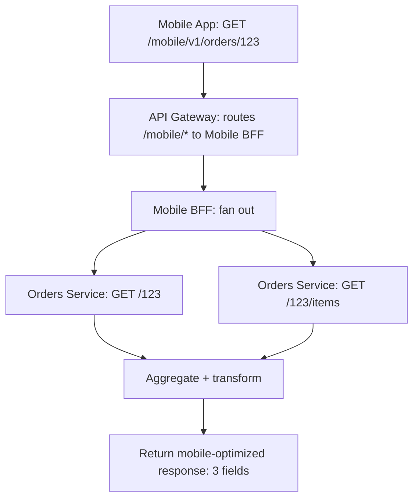

⚡ TL;DR - The Backend-for-Frontend (BFF) pattern creates
a separate backend service per client type (mobile BFF,
web BFF, public API BFF); each BFF aggregates data from
downstream microservices and shapes responses to the
specific client's needs; mobile BFF returns compressed
minimal payloads; web BFF returns richer data; the BFF
is owned by the frontend team, eliminating the
communication gap between frontend and backend teams;
the failure mode is BFF proliferation becoming
maintenance overhead.

---

| #041 | Category: HTTP & APIs | Difficulty: ★★★ |
|:---|:---|:---|
| **Depends on:** | API Gateway Pattern | |
| **Used by:** | Service Mesh vs API Gateway Trade-offs | |
| **Related:** | API Gateway Pattern, Content Negotiation, Partial Responses, Service Mesh Trade-offs | |

---

### 🔥 The Problem This Solves

**WORLD WITHOUT IT:**
One general-purpose API serves mobile, web, third-party
developers, and internal tooling. The mobile app
developer says "this endpoint returns 50 fields but I
only need 3 of them, and I need them formatted
differently." The web developer says "I need all 50
fields plus 5 from another endpoint." The third-party
developer says "your breaking change in v2 broke my
integration." One team (backend API team) must
simultaneously satisfy all four consumers with
conflicting requirements.

**THE BREAKING POINT:**
The backend API becomes a negotiation battlefield.
Every API change requires buy-in from all consumer
teams. Adding fields for web breaks mobile performance
(payload size). Mobile-specific optimizations make
the API unusable for third-party integrators. Nobody
is satisfied; the API team is a bottleneck.

**THE INVENTION MOMENT:**
Sam Newman (2015) formalized the BFF pattern: "build
an API specifically for one frontend." The key insight:
the team that owns the frontend experience should also
own the backend that serves that experience. Mobile
team owns mobile BFF. Web team owns web BFF. Third-
party API team owns public BFF. Each optimizes for
their consumer without blocking the others.

---

### 📘 Textbook Definition

The Backend-for-Frontend pattern places a dedicated
backend layer between each frontend client type and
the downstream microservices that hold the data.
**BFF responsibilities:** aggregating calls to multiple
downstream services; shaping/filtering responses to
client-specific format; handling client-specific auth
flows (mobile OAuth PKCE vs web session cookie);
client-specific caching strategies; adapting API
contracts for client evolution speed.
**BFF ownership:** the frontend team owns their BFF;
backend microservice teams own their services; the BFF
is the boundary where frontend concerns meet backend
data. **When to use:** multiple client types with
divergent data needs; client teams need to evolve their
API independently; mobile vs web performance profiles
differ significantly. **When not to use:** single client
type (just use the API gateway); very few downstream
services (aggregation logic fits in the API gateway).

---

### ⏱️ Understand It in 30 Seconds

**One line:**
BFF is "build a custom restaurant menu for each type
of customer": the kitchen (microservices) makes all
the dishes, but the mobile app menu shows only quick
bites, the dine-in menu shows the full experience, and
the catering menu shows bulk options.

**One analogy:**
> A travel agency is the BFF, downstream airlines and
> hotels are the microservices. A leisure traveler
> (mobile app) needs "package deals" in one call. A
> business traveler (web app) needs detailed itinerary
> with seat selection in one call. A corporate travel
> manager (third-party API) needs bulk booking with
> cost centers. Three different BFFs call the same
> airline and hotel APIs but return completely different
> responses.

**One insight:**
BFF solves the organizational problem, not just the
technical one. Frontend teams cannot move fast when
every API change requires a backend team meeting. The
BFF layer gives frontend teams full control of their
API contract. They call the backend microservices
directly (internal network) and own the contract with
their client. The speed-of-iteration gap closes.

---

### 🔩 First Principles Explanation

**Architecture:**

```
         Mobile App          Web App           3rd Party
              |                  |                  |
    [Mobile BFF :8081]  [Web BFF :8082]  [Public API BFF :8083]
              |                  |                  |
    ┌─────────┼──────────────────┼──────────────────┼────────┐
    |         |                  |                  |        |
[Users Svc] [Orders Svc] [Products Svc] [Payments Svc] [...]
```

Each BFF is a separate service (typically a lightweight
Node.js/Python/Go service) that:
1. Accepts requests from its specific client
2. Calls multiple downstream microservices in parallel
3. Combines, filters, and transforms responses
4. Returns a client-optimized response

**Mobile BFF vs Web BFF response comparison:**

```python
# Mobile BFF: minimal payload for bandwidth
async def get_order_summary(order_id: str) -> dict:
    order, user = await asyncio.gather(
        orders_service.get(order_id),
        users_service.get_profile_mini(order_id)
    )
    # Return only what mobile card view needs
    return {
        "id": order["id"],
        "status": order["status"],
        "total": order["total"],
        "userName": user["firstName"]
        # Omit: 25+ other order fields
        # Omit: full user profile
    }

# Web BFF: rich payload for full-page render
async def get_order_detail(order_id: str) -> dict:
    order, user, items, timeline = await asyncio.gather(
        orders_service.get(order_id),
        users_service.get_full_profile(order_id),
        orders_service.get_items(order_id),
        orders_service.get_timeline(order_id)
    )
    # Return rich payload for web full-page
    return {
        "order": order,
        "customer": user,
        "lineItems": items,
        "statusTimeline": timeline,
        "actions": compute_available_actions(order)
    }
```

---

### 🧪 Thought Experiment

**SCENARIO: E-commerce checkout page**

The checkout page needs:
- Cart items (Catalog Service)
- Inventory availability per item (Inventory Service)
- User shipping addresses (Users Service)
- Saved payment methods (Payments Service)
- Active promotions applicable to cart (Promotions Svc)
= 5 downstream services

**Without BFF:**
Frontend makes 5 API calls directly or through a generic
gateway. Every client (mobile and web) fetches all
data even though mobile only shows 2 addresses and
1 payment method.

**With Web BFF:**
Web BFF calls all 5 services in parallel, enriches the
data (marks inventory status inline per item), returns
one aggregated `checkoutPage` response shaped for the
web checkout UI.

**With Mobile BFF:**
Mobile BFF calls the same 5 services but returns:
compressed item images (thumbnails vs full-res),
max 2 addresses (mobile screen), 1 default payment
method. Response is 60% smaller than web response.

**Result:** Frontend teams iterate independently. Mobile
team adds `appliedPromotion` field to their BFF in one
day without touching web or backend services.

---

### 🧠 Mental Model / Analogy

> Think of microservices as specialists in a hospital.
> The general-purpose API gateway is the admissions
> desk that sends everyone to all the right specialists.
> BFF is a personal case manager (one per patient type:
> emergency patients, outpatient, maternity ward).
> The emergency patient case manager (mobile BFF) routes
> quickly, gets only critical information, and formats
> it for fast decision-making. The outpatient manager
> (web BFF) provides full detailed reports. Same
> specialists; completely different case management
> workflows.

---

### 📶 Gradual Depth - Five Levels

**Level 1 - What it is (anyone can understand):**
Instead of one API that tries to serve all apps
equally, the BFF pattern creates one custom API per
app type. The mobile team gets their own API, the web
team gets their own, and third-party developers get
their own. Each is optimized for exactly what that
client needs.

**Level 2 - How to use it (junior developer):**
Create one service per client type (mobile-bff, web-bff).
Each service has its own routes that call downstream
microservices internally. Frontend teams own and deploy
their BFF. API gateway routes `/mobile/*` to mobile
BFF and `/web/*` to web BFF.

**Level 3 - How it works (mid-level engineer):**
BFF receives client request, fans out to downstream
services in parallel (asyncio.gather / Promise.all),
aggregates responses, applies client-specific
transformation (filter fields, format dates differently
for locale, add client-specific metadata), and returns.
BFF caches at the client-appropriate granularity
(mobile BFF caches more aggressively for offline
support; web BFF caches short-term to reduce server
load).

**Level 4 - Why it was designed this way (senior/staff):**
BFF is fundamentally a team topology pattern (Conway's
Law in action). Without BFF, the backend API team
becomes a coordination bottleneck for all frontend
teams. With BFF, each frontend team owns their API
contract end-to-end. They can add fields, change
response shapes, and ship features without a backend
API release. The microservice teams only need to keep
their internal service APIs stable. BFF is the
translation layer between fast-changing frontend
requirements and slower-changing domain services.

**Level 5 - Mastery (distinguished engineer):**
BFF proliferation is the dark side of the pattern.
20 client types = 20 BFFs to maintain, monitor, and
deploy. At scale, common BFF logic (auth, error
formatting, rate limit headers) gets duplicated across
all BFFs. Solutions: (1) Shared BFF SDK library with
common middleware. (2) BFF generator (schema-driven
code generation per client). (3) Consolidate BFFs
when client requirements converge (mobile-iOS and
mobile-Android often want the same data). (4) GraphQL
as a BFF replacement: one endpoint, clients specify
their own field selection. GraphQL essentially builds
the BFF pattern into the protocol - the client is
its own BFF via query specification.

---

### ⚙️ How It Works (Mechanism)

**FastAPI BFF with parallel downstream calls:**

```python
from fastapi import FastAPI, HTTPException, Header
from typing import Optional
import asyncio
import httpx

app = FastAPI()

DOWNSTREAM = {
    "orders": "http://orders-svc:8080",
    "users": "http://users-svc:8080",
    "products": "http://products-svc:8080",
}

@app.get("/mobile/v1/orders/{order_id}")
async def mobile_order_detail(
    order_id: str,
    x_user_id: int = Header(...)  # Set by gateway
):
    """Mobile-optimized order detail endpoint."""
    async with httpx.AsyncClient(timeout=5.0) as client:
        order_resp, items_resp = await asyncio.gather(
            client.get(
                f"{DOWNSTREAM['orders']}/{order_id}",
                headers={"X-User-Id": str(x_user_id)}
            ),
            client.get(
                f"{DOWNSTREAM['orders']}/{order_id}/items",
                headers={"X-User-Id": str(x_user_id)}
            ),
            return_exceptions=True
        )

    if isinstance(order_resp, Exception):
        raise HTTPException(502, "Orders service unavailable")

    order = order_resp.json()

    # Mobile-specific transformation:
    # only fields needed by mobile card view
    return {
        "id": order["id"],
        "status": order["status"],
        "total": order["total"],
        "estimatedDelivery": order.get("estimatedDelivery"),
        # Compressed item list for mobile
        "itemCount": (
            len(items_resp.json())
            if not isinstance(items_resp, Exception)
            else None
        ),
        # NO: billing address, full timeline, metadata
    }
```



---

### 🔄 The Complete Picture - End-to-End Flow

**BFF handling authentication differences:**

```python
# Mobile BFF: OAuth 2.0 PKCE flow
@app.post("/mobile/auth/token")
async def mobile_token_exchange(body: PKCETokenBody):
    """Mobile uses PKCE for secure auth without secret."""
    token = await auth_service.exchange_pkce_code(
        code=body.code,
        code_verifier=body.code_verifier,
        client_id=MOBILE_CLIENT_ID
    )
    # Mobile: return short-lived access + refresh token
    return {
        "access_token": token.access_token,
        "refresh_token": token.refresh_token,
        "expires_in": 3600
    }

# Web BFF: session cookie flow
@app.post("/web/auth/login")
async def web_login(body: LoginBody, response: Response):
    """Web uses HTTP-only session cookie (XSS protection)."""
    session = await auth_service.create_session(
        email=body.email, password=body.password
    )
    response.set_cookie(
        key="session_id",
        value=session.id,
        httponly=True,   # No JavaScript access
        secure=True,     # HTTPS only
        samesite="lax"
    )
    return {"status": "ok"}
```

---

### 💻 Code Example

**Example 1 - BAD: Generic API with client-specific hacks**

```python
# BAD: One endpoint with client-type query parameter
@app.get("/orders/{order_id}")
def get_order(
    order_id: str,
    client_type: str = "web",  # Leaking client type
    include_items: bool = True,
    compact: bool = False
):
    # Spaghetti: branching on client type
    order = db.get_order(order_id)
    if client_type == "mobile" and compact:
        return {"id": order.id, "status": order.status}
    elif client_type == "mobile":
        return {"id": order.id, ...}
    # 50 more lines of client-specific branching...
    # Backend team owns this; frontend teams fight over it

# GOOD: Separate BFF per client type
# mobile-bff/orders.py
@app.get("/orders/{order_id}")
async def mobile_get_order(order_id: str):
    # Mobile team owns this; always returns mobile format
    order = await orders_svc.get(order_id)
    return MobileOrderView.from_order(order)

# web-bff/orders.py
@app.get("/orders/{order_id}")
async def web_get_order(order_id: str):
    # Web team owns this; returns web format
    order, items = await asyncio.gather(
        orders_svc.get(order_id),
        orders_svc.get_items(order_id)
    )
    return WebOrderDetailView.from_order(order, items)
```

---

### ⚖️ Comparison Table

| Approach | Flexibility | Maintenance | Team Autonomy | Use Case |
|:---|:---|:---|:---|:---|
| Generic API | Low | Low | Low | Simple, 1 client |
| API Gateway (routing only) | Medium | Low | Medium | Multiple clients, simple transforms |
| BFF per client | High | High | High | Multiple clients, divergent needs |
| GraphQL (self-BFF) | High | Medium | High | Clients specify their data shape |

---

### ⚠️ Common Misconceptions

| Misconception | Reality |
|:---|:---|
| BFF is just an API gateway | API gateway routes traffic and enforces policy (auth, rate limiting). BFF aggregates data, transforms responses, and is optimized for a specific client's data needs. They solve different problems at different layers. Most architectures use both. |
| Each BFF must be a separate programming language/tech | BFF technology is a team choice. Mobile BFF could be Node.js, web BFF could be Python. Often the same stack is used for consistency. The key is separate deployment and ownership, not language diversity. |
| BFF eliminates the need for versioning | BFF defers the versioning problem. When the mobile BFF's API changes, mobile app clients still need to be versioned (app store deployments take weeks to reach all users). BFF to downstream service versioning still applies. |
| One BFF per client means one per mobile platform | Android and iOS often have very similar data needs. Start with one mobile BFF. Split only if the data requirements diverge significantly. Premature BFF splitting = maintenance overhead without benefit. |

---

### 🚨 Failure Modes & Diagnosis

**BFF cascade failure**

**Symptom:** Mobile BFF returns 502 errors for all
requests. Mobile app shows "unable to load."

**Root Cause:** Mobile BFF calls 4 downstream services
in sequence (not parallel). One service (Products Svc)
has a 5s timeout. Mobile BFF waits 5s per item on the
list, exhausting connection pool.

**Fix:** (1) Always call downstream services in parallel
(`asyncio.gather`). (2) Set aggressive timeouts on
each downstream call (500ms for reads, 2s max). (3)
Implement partial results: return available data even
when some services fail (items without product names
better than total failure). (4) Circuit breaker per
downstream service.

---

**BFF logic duplication across all BFFs**

**Symptom:** A bug in authentication header parsing
exists in mobile BFF, web BFF, and public API BFF.
Fixing it requires 3 separate PRs and 3 deploys.

**Root Cause:** Each BFF reimplemented common middleware
(auth, error formatting, request tracing) independently.

**Fix:** Extract shared logic into a BFF SDK library.
All BFFs import the library as a dependency. Bug fix =
one library version bump, all BFFs update. This is
the standard pattern for BFF fleets at scale.

---

### 🔗 Related Keywords

**Prerequisites (understand these first):**
- `API Gateway Pattern` - BFF sits behind the gateway

**Builds On This (learn these next):**
- `Service Mesh vs API Gateway Trade-offs` - where BFF
  fits in the full architecture

---

### 📌 Quick Reference Card

```
┌──────────────────────────────────────────────────────────┐
│ WHAT IT IS   │ Separate backend per client type; each    │
│              │ aggregates + shapes data for its consumer │
├──────────────┼───────────────────────────────────────────┤
│ PROBLEM IT   │ General API cannot satisfy diverse client │
│ SOLVES       │ needs; frontend teams blocked on backend  │
├──────────────┼───────────────────────────────────────────┤
│ KEY INSIGHT  │ Frontend team owns the BFF; removes the   │
│              │ coordination bottleneck with backend team  │
├──────────────┼───────────────────────────────────────────┤
│ RISK         │ BFF proliferation (20 BFFs); duplicated   │
│              │ logic across BFFs without shared SDK      │
├──────────────┼───────────────────────────────────────────┤
│ ANTI-PATTERN │ client_type= query param on general API;  │
│              │ sequential downstream calls (use parallel) │
├──────────────┼───────────────────────────────────────────┤
│ ONE-LINER    │ "Custom API per client: owned by frontend, │
│              │ aggregates backends, shaped for context"  │
├──────────────┼───────────────────────────────────────────┤
│ NEXT EXPLORE │ API Gateway → Service Mesh Trade-offs     │
└──────────────────────────────────────────────────────────┘
```

**If you remember only 3 things:**
1. BFF = one backend per client type, owned by the
   frontend team. The frontend team controls their API
   contract without negotiating with the backend API team.
2. BFFs aggregate downstream service calls in parallel.
   Sequential calls = additive latency. Always use
   parallel fan-out with circuit breakers.
3. When you have 2+ BFFs, extract shared logic into a
   library. Otherwise common bugs exist in N places.

---

### 💎 Transferable Wisdom

**Reusable Engineering Principle:**
"Optimize at the boundary for the consumer." The BFF
pattern is a specific application of the interface
segregation principle: don't force clients to depend
on interfaces they don't use. This appears across
systems: database read replicas optimized for read-
heavy query patterns; write-optimized event tables vs
read-optimized materialized views; event-sourced
projections built differently for different query
consumers. The key: don't fight the impedance mismatch
with generic interfaces; build specialized bridges.

**Where else this pattern applies:**
- CQRS: separate read model (optimized for queries)
  vs write model (optimized for commands) - same pattern
  as mobile BFF vs web BFF
- Analytics DB vs OLTP: separate systems optimized
  for their specific consumers (reporting vs transactions)
- CDN edge workers: client-specific response shaping
  at the edge (transforms before delivery)

---

### 💡 The Surprising Truth

Netflix uses a BFF approach (called Edge API or
Falcor-based BFF) but they came to a surprising
conclusion: as client diversity grows to dozens of
device types, having a separate BFF per device is
unsustainable. Netflix's current architecture uses
a GraphQL federation approach as the BFF replacement:
a single gateway with a typed schema where each UI
component specifies its own fragment (micro-frontend
BFF). This is GraphQL completing its role as the
protocol-level solution to the same problem BFF solves
architecturally: client-specified data requirements.
The BFF pattern is often an intermediate step before
adopting GraphQL.

---

### ✅ Mastery Checklist

**You've mastered this when you can:**
1. **EXPLAIN** The organizational reason for BFF (team
   autonomy) and why technical optimization alone does
   not justify the pattern.
2. **IMPLEMENT** A BFF that aggregates 3 downstream
   services in parallel with `asyncio.gather` and
   handles partial failures gracefully.
3. **DESIGN** Auth flow differences between mobile BFF
   (PKCE) and web BFF (session cookie) and explain why
   they differ.
4. **IDENTIFY** When BFF is not needed (single client,
   simple data needs) vs when it is essential (diverse
   clients, divergent data shapes, fast-moving teams).
5. **CONTRAST** BFF vs GraphQL as solutions to the same
   client data flexibility problem.

---

### 🎯 Interview Deep-Dive

**Q1: What problem does the BFF pattern solve and when
should you use it?**

*Why they ask:* Pattern recognition + system design.

*Strong answer includes:*
- Problem: a single general-purpose API must satisfy
  multiple client types (mobile, web, third-party) with
  conflicting requirements. Mobile needs small payloads;
  web needs rich data; third-party needs stable versioning.
  One team (backend API team) becomes a bottleneck for
  all frontend teams.
- BFF solution: separate backend per client type, owned
  by the team that serves that client. Mobile team owns
  mobile BFF. Web team owns web BFF. Each iterates
  independently.
- Use when: (1) multiple client types with divergent
  data needs; (2) frontend teams need to move faster
  than backend API release cycle; (3) mobile/web have
  significantly different performance profiles (payload
  size, caching strategy, auth flow).
- Do not use when: (1) single client type; (2) very few
  downstream services (gateway aggregation is sufficient);
  (3) team does not have capacity to maintain multiple
  BFF services.

**Q2: How does the BFF pattern relate to the API gateway
pattern?**

*Why they ask:* Tests distinction between similar patterns.

*Strong answer includes:*
- API gateway: infrastructure layer. Single entry point.
  Handles auth, rate limiting, TLS, routing. No business
  logic. Often maintained by a platform/infra team.
- BFF: application layer. Per-client customization.
  Aggregates multiple downstream services. Contains
  client-specific transformation logic. Maintained by
  the frontend team.
- How they compose: API gateway routes `/mobile/*` to
  mobile BFF and `/web/*` to web BFF. The gateway
  validates the JWT; the BFF receives `X-User-Id`
  header and uses it to call downstream services.
- Can you skip the gateway? Yes, but then each BFF must
  implement auth validation, rate limiting, etc.
  Gateway centralizes that policy; BFFs focus on data
  aggregation.

**Q3: What are the risks of BFF pattern at scale?**

*Why they ask:* Tests maturity and understanding of
trade-offs.

*Strong answer includes:*
- BFF proliferation: 10 client types = 10 BFFs to
  maintain, monitor, and deploy. Each BFF needs its
  own CI/CD, alerting, and runbook.
- Logic duplication: each BFF reimplements common
  middleware (auth header parsing, error formatting,
  trace ID propagation). Mitigation: shared BFF SDK
  library. All BFFs import shared middleware.
- Cascade failures: BFF calls 5 downstream services.
  If one is slow (5s timeout), the BFF blocks. Fix:
  parallel calls, aggressive timeouts per downstream,
  partial result responses, circuit breakers.
- Data consistency: mobile BFF and web BFF may call
  the same Orders Service at slightly different times.
  User sees different states on mobile vs web for
  seconds. This is acceptable (eventual consistency)
  for most scenarios but must be acknowledged.
- GraphQL as exit strategy: when BFF proliferation
  becomes unsustainable, GraphQL federation (one schema,
  client-specified queries) is the next architectural
  evolution.
