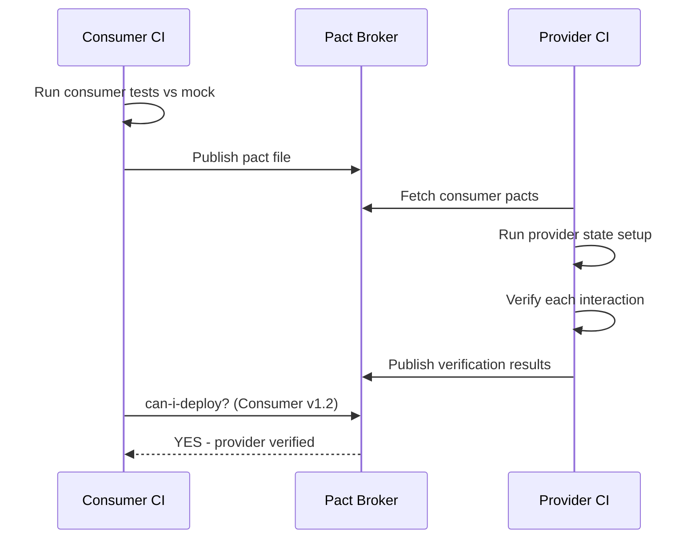

⚡ TL;DR - API contract testing verifies that a provider
API meets the expectations set by its consumers without
full integration tests; Consumer-Driven Contract Testing
(CDCT) with Pact inverts the usual flow: consumers
define their expectations in a "pact" file, the provider
runs those expectations against its implementation in
CI; this catches breaking changes before deployment
rather than in production; the pact file is the living
contract between teams.

---

| #042 | Category: HTTP & APIs | Difficulty: ★★★ |
|:---|:---|:---|
| **Depends on:** | REST API Design Principles, OpenAPI Specification | |
| **Used by:** | API Mocking and Stubbing, API Load Testing | |
| **Related:** | OpenAPI Specification, API Mocking and Stubbing, API Load Testing | |

---

### 🔥 The Problem This Solves

**WORLD WITHOUT IT:**
Microservices team A owns the Orders API. Team B's
Notifications Service consumes it. Team A changes the
`orders` response field from `order_id` to `id` (a
"small" refactor). Team B's service breaks in production.
The integration test suite would have caught this - but
integration tests run in a shared environment that was
down during Team A's release. By the time the issue
is found, both services are deployed and a rollback
is necessary.

**THE BREAKING POINT:**
E2E integration tests are slow (minutes), brittle
(shared environment flakes), and expensive (dedicated
test environment with all services running). They run
too late in the pipeline to prevent breaking changes
from merging. The choice appears to be: slow/reliable
or fast/unreliable.

**THE INVENTION MOMENT:**
Pact (2013, REA Group) inverted the testing model:
instead of running both services together, the consumer
generates a "contract file" from its tests that
specifies exactly what it expects from the provider.
The provider runs those expectations against its own
implementation in isolation. No shared environment
needed. Both sides test independently, fast, in CI.

---

### 📘 Textbook Definition

API contract testing validates that a service provider
fulfills the expectations of its consumers. **Consumer-
Driven Contract Testing (CDCT):** consumers define
the contract; providers verify against it. **Pact
file:** a JSON document capturing consumer expectations:
interactions (request + response pairs), consumer name,
provider name. **Pact Broker:** a server that stores
pact files, tracks verification results, and enables
"can I deploy?" queries (Has the provider verified the
latest pact from this consumer?). **Provider states:**
test preconditions that set up the provider in the
right state for each interaction (e.g., "user 42 exists"
state sets up the user in the test database).
**Schema testing vs contract testing:** schema testing
(OpenAPI/schemathesis) validates the provider's
responses conform to its own schema; contract testing
validates the provider meets specific consumer
expectations (stricter: a consumer expects exactly 3
fields, not the full schema).

---

### ⏱️ Understand It in 30 Seconds

**One line:**
Contract testing is a handshake between services: the
consumer writes what it expects, the provider proves
it delivers exactly that - without either needing the
other to be running.

**One analogy:**
> Legal contract between two parties. Consumer is the
> buyer: "I expect delivery of X by date Y in condition
> Z." Producer is the supplier: "I can prove I met
> those conditions." The contract is the pact file.
> The court (Pact Broker) keeps the records and says
> "can I deploy? - check if both sides have signed off."

**One insight:**
CDCT shifts the contract ownership to the consumer.
The consumer knows exactly what fields it uses. The
provider test suite grows organically as consumers are
added. When a new consumer is onboarded, they add
their expectations to the pact file. The provider runs
all consumer pacts in CI. If the provider breaks any
consumer's expectations, the build fails before merge.

---

### 🔩 First Principles Explanation

**Pact consumer test (Python with `pact-python`):**

```python
import pytest
from pact import Consumer, Provider

# Define the consumer and provider
pact = Consumer("NotificationsService").has_pact_with(
    Provider("OrdersService"),
    pact_dir="./pacts"
)

@pytest.fixture(scope="module", autouse=True)
def start_pact(pact):
    pact.start_service()
    yield
    pact.stop_service()

def test_get_order_for_notification():
    """Consumer expectation: what Notifications expects
    from Orders when fetching order details."""
    expected = {
        "id": "ord-123",
        "status": "SHIPPED",
        "customerEmail": "alice@example.com",
        "estimatedDelivery": "2024-01-15"
    }

    # Define the expected interaction
    (pact
        .given("order ord-123 exists")
        .upon_receiving("a request for order details")
        .with_request("GET", "/orders/ord-123")
        .will_respond_with(200, body=expected)
    )

    # Run the consumer code against the pact mock server
    with pact:
        result = notifications_client.get_order("ord-123")

    assert result["status"] == "SHIPPED"
    assert result["customerEmail"] == "alice@example.com"
    # Pact file generated: pacts/NotificationsService-OrdersService.json
```

**Pact provider verification (Orders Service CI):**

```python
import pytest
from pact import Verifier

@pytest.fixture
def provider_states():
    """Set up provider state before each interaction."""
    return {
        "order ord-123 exists": lambda: db.insert_order(
            id="ord-123",
            status="SHIPPED",
            customer_email="alice@example.com",
            estimated_delivery="2024-01-15"
        )
    }

def test_verify_consumer_pacts(provider_states):
    verifier = Verifier(
        provider="OrdersService",
        provider_base_url="http://localhost:8080"
    )
    output, _ = verifier.verify_with_broker(
        broker_url="https://pact-broker.example.com",
        provider_states_setup_url=(
            "http://localhost:8080/_pact/provider_states"
        ),
        publish_verification_results=True,
        provider_version="1.2.3"
    )
    assert output == 0, "Provider verification failed"
```

**Generated pact file:**

```json
{
  "consumer": {"name": "NotificationsService"},
  "provider": {"name": "OrdersService"},
  "interactions": [
    {
      "description": "a request for order details",
      "providerState": "order ord-123 exists",
      "request": {
        "method": "GET",
        "path": "/orders/ord-123"
      },
      "response": {
        "status": 200,
        "body": {
          "id": "ord-123",
          "status": "SHIPPED",
          "customerEmail": "alice@example.com",
          "estimatedDelivery": "2024-01-15"
        }
      }
    }
  ]
}
```

---

### 🧪 Thought Experiment

**SCENARIO: Adding a consumer requires provider change**

Team A (Orders) has the endpoint `GET /orders/{id}`
returning a large JSON with 30 fields. Team B
(Notifications) only uses 4 fields.

**Without CDCT:**
Team A renames `order_id` → `id` in a refactor. No
breaking change in their OpenAPI schema (they just
renamed a field). Team B's consumer breaks silently:
`notifications_client.py` accesses `.order_id` which
is now missing. Discovered in production.

**With CDCT:**
Team B's pact consumer test explicitly asserts:
```json
"body": {"order_id": "ord-123"}
```
Team A runs `verify_with_broker` in CI. The provider
response now returns `id` not `order_id`. Pact
verification fails. Team A's PR is blocked before
merge. Team A either: (1) keeps `order_id` as an alias,
or (2) communicates the change to Team B before
releasing. Breaking change caught at development time,
not production time.

---

### 🧠 Mental Model / Analogy

> Contract testing is a fire drill: you test whether
> the evacuation procedure works before there is a
> real fire. You do not need the building to actually
> be on fire to verify the procedures. The pact file
> is the procedure document. The consumer test generates
> it. The provider verification checks it. Both happen
> independently and fast. The Pact Broker is the safety
> officer who says: "Has everyone completed the drill?"
> before you are allowed to open the building (deploy).

---

### 📶 Gradual Depth - Five Levels

**Level 1 - What it is (anyone can understand):**
When two services communicate, they have an informal
contract (this service expects this data from that
service). Contract testing makes this contract explicit
and verifiable. If either side breaks the contract,
a test fails before code ships.

**Level 2 - How to use it (junior developer):**
Consumer writes tests using `pact-python` or `pact-js`
that define expected request/response pairs. Run these
tests locally - they generate a pact JSON file. Upload
the pact to Pact Broker. Provider team sets up
verification tests that download and verify all consumer
pacts in their CI pipeline.

**Level 3 - How it works (mid-level engineer):**
Consumer tests run against a Pact mock server (no real
provider needed). The mock server records the
interactions. After all consumer tests pass, it
generates the pact JSON file. On the provider side,
Pact replays each recorded interaction against the
running provider, checking that the actual response
matches the expected response. Provider states set up
test data before each interaction.

**Level 4 - Why it was designed this way (senior/staff):**
CDCT flips the power dynamic of API design. Traditionally:
provider defines the contract (OpenAPI spec), consumers
adapt to it. With CDCT: consumers define what they need,
providers must satisfy all consumers. This aligns with
reality: the provider must not break any consumer. The
"can I deploy?" feature of Pact Broker adds a deployment
gate: before any service deploys, it checks that all
its consumers have verified the current version and
that the provider has verified all consumer pacts.
This prevents broken integration from reaching production.

**Level 5 - Mastery (distinguished engineer):**
CDCT's limitation: it only tests interactions that
consumers have explicitly defined. A provider can
introduce a regression in an API path that no consumer
has written a pact for. Solutions: (1) Combine CDCT
with provider-side schema validation (schemathesis)
which auto-generates test cases from the OpenAPI spec.
(2) Use bi-directional contract testing (BDCT): provider
uploads its OpenAPI spec; consumer uploads its pact;
Pact Broker automatically checks compatibility without
running code. This works at scale where running provider
tests per consumer pact is computationally expensive.

---

### ⚙️ How It Works (Mechanism)

**Pact execution flow:**

```
Consumer Test Run:
  - Consumer tests run against Pact mock server
  - Mock server records interactions
  - Pact file (.json) generated in /pacts/
  - Consumer publishes pact to Pact Broker

Provider Verification Run (CI):
  - Provider fetches all pacts from Pact Broker
  - For each pact interaction:
    1. Provider state setup (insert test data)
    2. Pact replays the recorded request against provider
    3. Compares actual response to expected
    4. Pass or fail per interaction
  - Results published back to Pact Broker

Deployment Gate:
  - CI calls: pact-broker can-i-deploy
    --pacticipant OrdersService
    --version 1.2.3
    --to production
  - Returns: YES (all consumers verified) or NO
```



---

### 🔄 The Complete Picture - End-to-End Flow

**Provider state handler:**

```python
from fastapi import FastAPI
import json

app = FastAPI()

@app.post("/_pact/provider_states")
async def setup_provider_state(body: dict):
    """Pact calls this before each interaction to
    set up test data."""
    state = body.get("state", "")
    consumer = body.get("consumer", "")

    if state == "order ord-123 exists":
        db.execute("""
            INSERT INTO orders
            (id, status, customer_email, estimated_delivery)
            VALUES
            ('ord-123', 'SHIPPED',
             'alice@example.com', '2024-01-15')
            ON CONFLICT DO NOTHING
        """)
    elif state == "no orders exist":
        db.execute("DELETE FROM orders WHERE id = 'ord-123'")

    return {"state": state, "params": {}}
```

---

### 💻 Code Example

**Example 1 - BAD: Integration test with shared environment**

```python
# BAD: Integration test requiring both services running
# in shared environment
def test_notifications_send_on_ship():
    # Requires: Orders Service + Notifications Service
    # + test database + test message broker ALL running
    # Slow: 3-5 minutes; brittle: shared env flakes
    response = requests.post(
        "http://orders-service:8080/orders",
        json={"items": ["sku-1"], "quantity": 1}
    )
    order_id = response.json()["order_id"]
    requests.put(
        f"http://orders-service:8080/orders/{order_id}",
        json={"status": "SHIPPED"}
    )
    time.sleep(5)  # Wait for notification to be sent
    notification = db.get_notification(order_id)
    assert notification is not None  # Flaky timing

# GOOD: Pact consumer test (no shared environment)
def test_notifications_fetches_order_on_ship():
    """Consumer only: runs in 200ms, no infrastructure."""
    (pact
        .given("order ord-123 exists with SHIPPED status")
        .upon_receiving("GET order for notification")
        .with_request("GET", "/orders/ord-123")
        .will_respond_with(200, body={
            "id": "ord-123",
            "status": "SHIPPED",
            "customerEmail": "alice@example.com"
        })
    )
    with pact:
        order = notifications_client.get_order("ord-123")
    assert order["status"] == "SHIPPED"
    # Fast, isolated, generates pact for provider to verify
```

---

### ⚖️ Comparison Table

| Approach | Speed | Isolation | Coverage | Env Required |
|:---|:---|:---|:---|:---|
| Unit tests | Fast (ms) | Full | Logic only | None |
| Contract tests (Pact) | Fast (s) | Full | API contract | None |
| Integration tests | Slow (min) | Partial | Full flow | Shared env |
| E2E tests | Slowest | None | Full UX flow | All services |

---

### ⚠️ Common Misconceptions

| Misconception | Reality |
|:---|:---|
| Contract tests replace integration tests | Contract tests verify API shape and response format. They do not test database transactions, event ordering, or complex business logic requiring multiple services. Integration tests are still needed; contract tests catch breaking changes faster and earlier. |
| The provider should define the contract | In CDCT, consumers define what they need; providers verify they meet all consumer needs. Provider-defined contracts (OpenAPI schemas) are useful for documentation and schema validation but do not prevent the provider from removing fields that consumers depend on. |
| Pact is only for REST APIs | Pact supports REST, GraphQL, and message contracts (Kafka, RabbitMQ). Message pact: consumer defines the expected message format; provider verifies it publishes messages matching that format. Same pattern, different transport. |
| Contract testing requires both teams to use Pact | Bi-directional contract testing (BDCT) enables contract testing between teams using different tools: provider uploads OpenAPI spec; consumer uploads pact; Pact Broker checks compatibility statically without running code. |

---

### 🚨 Failure Modes & Diagnosis

**Provider state setup not matching test data**

**Symptom:** Provider verification fails with "order not
found" even though the endpoint works in production.

**Root Cause:** Provider state handler for "order ord-123
exists" does not insert the correct data (wrong status,
missing field). Pact sends the request but the provider
returns 404 (no matching order in test state).

**Fix:** Print the actual provider response during
verification failure. Fix the provider state handler
to insert exactly the data the interaction assumes.
Provider state handlers are the most common failure
point in Pact setup.

---

**Pact file not uploaded after consumer tests pass**

**Symptom:** `can-i-deploy` query always says YES even
when the provider has a breaking change. Provider team
deploys a breaking change without warning.

**Root Cause:** Consumer CI passes tests but does not
publish the pact file to Pact Broker. The Broker has
no pact for this consumer, so the provider never runs
it. No alert generated.

**Fix:** Make pact publication a CI step that fails
the build if upload fails. Add Pact Broker webhook:
when a new pact is published, automatically trigger
provider verification pipeline.

---

### 🔗 Related Keywords

**Prerequisites (understand these first):**
- `REST API Design Principles` - contracts are about
  REST endpoints and response shapes
- `OpenAPI Specification` - schema-level contract (Pact
  is interaction-level contract)

**Builds On This (learn these next):**
- `API Mocking and Stubbing` - closely related technique
  for isolation testing

---

### 📌 Quick Reference Card

```
┌──────────────────────────────────────────────────────────┐
│ WHAT IT IS   │ Consumer-defined API expectations;        │
│              │ provider verifies them in CI without      │
│              │ needing a shared environment               │
├──────────────┼───────────────────────────────────────────┤
│ PROBLEM IT   │ Breaking API changes discovered in        │
│ SOLVES       │ production; slow/brittle integration tests │
├──────────────┼───────────────────────────────────────────┤
│ KEY INSIGHT  │ Consumer writes the contract (not         │
│              │ provider); Pact Broker is the gatekeeper  │
├──────────────┼───────────────────────────────────────────┤
│ FLOW         │ Consumer tests → pact JSON → Broker →     │
│              │ Provider verification → can-i-deploy      │
├──────────────┼───────────────────────────────────────────┤
│ ANTI-PATTERN │ Provider defines contract only (OpenAPI); │
│              │ not publishing pacts to broker in CI      │
├──────────────┼───────────────────────────────────────────┤
│ ONE-LINER    │ "Consumer expectations become tests for    │
│              │ the provider; no shared environment"      │
├──────────────┼───────────────────────────────────────────┤
│ NEXT EXPLORE │ API Mocking → OpenAPI spec-based testing  │
└──────────────────────────────────────────────────────────┘
```

**If you remember only 3 things:**
1. The consumer writes the pact (not the provider).
   The consumer knows exactly which fields it uses. The
   provider verifies all consumer pacts in CI.
2. No shared environment needed. Consumer tests run
   against a Pact mock. Provider verification runs
   the provider in isolation with test data.
3. `can-i-deploy` is the safety gate: "Has every consumer
   that uses my API verified the current version?" Deploy
   only if YES.

---

### 💎 Transferable Wisdom

**Reusable Engineering Principle:**
"Make implicit contracts explicit and machine-verifiable."
This applies everywhere: database schema migrations
verified against all consumers before deploy (Flyway
compatibility checks); Kafka message schema (Confluent
Schema Registry enforces backward/forward compatibility);
library API changes (semantic versioning + changelogs
+ automated breaking change detection). In each case,
the pattern is: formalize the contract → verify
automatically in CI → block deployment on violation.

**Where else this pattern applies:**
- Confluent Schema Registry: Kafka producers publish
  schemas; compatibility mode (BACKWARD, FORWARD, FULL)
  enforces that schema changes do not break consumers
- npm/pip dependency constraints: `>=1.0,<2.0` pins
  the acceptable contract range; version bumps are
  verified by CI
- Database migration testing: verify migrations against
  all service query patterns before applying to production

---

### 💡 The Surprising Truth

Pact is used primarily by microservices teams, but its
most powerful use case is actually not between separate
services - it is between frontend and backend on the
same team. When a frontend team writes Pact consumer
tests for the API they call, the backend cannot
accidentally break the frontend during a refactor.
The "two teams" of CDCT can literally be the same team
with a frontend half and a backend half. Netflix
reported that this single-team use of Pact reduced
their mobile app release cycle by 2 weeks because
frontend engineers could write tests that prevented
API breakage without needing backend team coordination.

---

### ✅ Mastery Checklist

**You've mastered this when you can:**
1. **WRITE** A Pact consumer test that records an
   interaction with request matcher and expected response.
2. **SET UP** A provider verification test that sets
   up provider states and verifies all consumer pacts.
3. **EXPLAIN** The difference between schema testing
   (provider validates its own schema) and contract
   testing (provider validates consumer expectations).
4. **CONFIGURE** `can-i-deploy` as a CI deployment gate
   in a pipeline.
5. **DESIGN** The testing strategy: which interactions
   need contract tests vs integration tests vs unit tests.

---

### 🎯 Interview Deep-Dive

**Q1: How does consumer-driven contract testing differ
from integration testing?**

*Why they ask:* Tests testing strategy depth.

*Strong answer includes:*
- Integration tests: both services run in a shared
  environment. Test verifies the complete interaction
  including database, network, and business logic.
  Slow (minutes), brittle (shared env flakes), and
  expensive (dedicated environment).
- Contract tests: run each side in isolation. Consumer
  tests run against a mock (no real provider). Provider
  tests run against the provider alone (no real consumer).
  Fast (seconds), stable (no shared env), and cheap
  (no infrastructure required).
- What contract tests catch: API response shape changes
  (field renames, type changes, removed fields). What
  they do not catch: end-to-end business logic flows,
  database consistency issues, event ordering.
- Both are needed: contract tests catch breaking changes
  early; integration tests verify the full system
  behavior before production.

**Q2: Walk me through the Pact workflow end-to-end.**

*Why they ask:* Tests practical implementation knowledge.

*Strong answer includes:*
1. Consumer writes Pact test defining expected request
   and response. Test runs against Pact mock server
   (not real provider). Pact file (JSON) generated on
   test pass.
2. Consumer CI publishes pact JSON to Pact Broker with
   consumer version tag.
3. Provider CI: on each build, fetches latest pacts
   from Pact Broker for all consumers. For each
   interaction: (a) calls provider state endpoint to
   set up test data; (b) Pact sends the recorded request
   to the running provider; (c) compares actual response
   to expected. Pass/fail per interaction.
4. Provider publishes verification results to Pact Broker.
5. Before any service deploys to production: CI calls
   `can-i-deploy` API. Pact Broker returns YES if all
   consumers have verified the current version against
   this provider version.
6. Deploy only if `can-i-deploy` returns YES.

**Q3: What is bidirectional contract testing and when
is it better than Pact?**

*Why they ask:* Tests awareness of evolved approaches.

*Strong answer includes:*
- Standard Pact: provider runs consumer pacts against
  live provider code. Requires provider to write state
  setup handlers for every consumer interaction. At
  scale (50 consumers), this becomes expensive.
- BDCT (Bidirectional Contract Testing): provider
  uploads its OpenAPI spec to Pact Broker. Consumer
  uploads its pact file. Pact Broker statically checks
  if the pact is a subset of the OpenAPI spec (does
  the spec satisfy the consumer's expectations?). No
  code execution required.
- BDCT advantages: faster (no running services); works
  when provider uses a different testing framework;
  scales to many consumers without provider test setup
  overhead.
- BDCT limitation: trusts the OpenAPI spec accurately
  describes the implementation. If the spec and code
  diverge, BDCT misses actual breakage. Combine with
  `schemathesis` (tests provider against its own spec)
  to close this gap.
