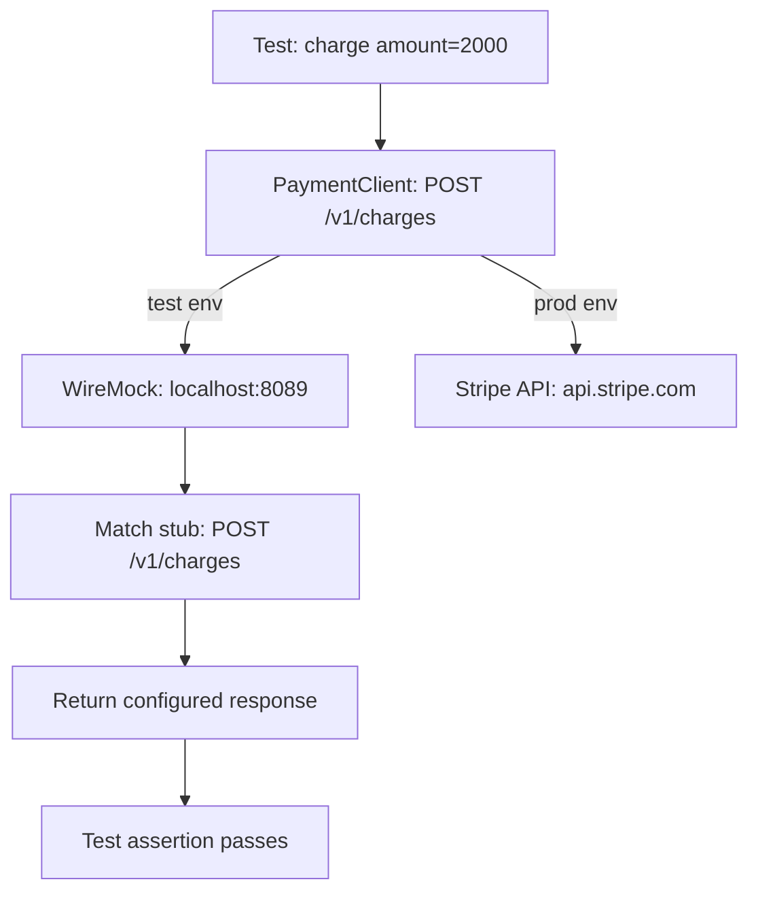

⚡ TL;DR - API mocking replaces a real API with a
controlled fake that returns predefined responses; a
stub is a minimal replacement that only returns
programmed responses; a mock can also verify that
expected calls were made; key tools: WireMock (Java/
standalone HTTP mock server), Prism (OpenAPI-driven
mock from spec), responses/httpretty (Python unit
tests); mocking enables testing before the real API
exists and isolates tests from external service
instability.

---

| #043 | Category: HTTP & APIs | Difficulty: ★★ |
|:---|:---|:---|
| **Depends on:** | REST API Design Principles, OpenAPI Specification | |
| **Used by:** | API Contract Testing, API Load Testing | |
| **Related:** | OpenAPI Specification, API Contract Testing, API Load Testing | |

---

### 🔥 The Problem This Solves

**WORLD WITHOUT IT:**
Integration test for the Checkout Service calls a real
payment gateway (Stripe). Test environment Stripe
account has rate limits (100 test calls/hour). Running
the full test suite of 300 tests hits the limit halfway
through. 150 tests fail with `429 Too Many Requests`.
Alternatively: test suite makes real calls to a staging
payment gateway that costs $0.0015 per call. 10,000
test runs per day = $15/day in test transaction fees.

**THE BREAKING POINT:**
External APIs in test environments are: rate-limited,
cost money, have unpredictable availability, require
specific test credentials, and return non-deterministic
responses. Testing error scenarios (payment declined,
gateway timeout, 503) requires special test account
setup or is impossible to trigger reliably.

**THE INVENTION MOMENT:**
WireMock (2011, Tom Akehurst) created a standalone HTTP
server that intercepts HTTP requests and returns
configured responses. Tests configure WireMock with
exactly the responses they need; the application calls
WireMock instead of the real API. Test scenarios
(including error cases, timeouts, malformed responses)
are completely under test control.

---

### 📘 Textbook Definition

**Stub:** a test replacement that returns hardcoded
responses to specific requests. No verification of
how many times it was called. Simplest form of API
replacement. **Mock:** a stub that also records calls
and can verify behavior assertions (the endpoint was
called exactly once with this request body).
**WireMock:** standalone HTTP server or Java library
that accepts stub/mock definitions as JSON and returns
configured responses. Supports request matching (URL,
method, headers, body), response templating, delays,
fault injection (connection reset, chunk dribble).
**Prism:** OpenAPI-driven mock server that auto-
generates responses from the OpenAPI spec (no manual
stub configuration needed; auto-validates requests
against spec). **responses (Python):** intercepts
`requests` library calls at the code level (no real
HTTP connection). **WireMock vs Prism:** WireMock gives
full control over exact responses; Prism generates
plausible responses from schema without per-endpoint
configuration.

---

### ⏱️ Understand It in 30 Seconds

**One line:**
API mocking replaces an unpredictable external service
with a controlled fake so tests are fast, deterministic,
and free from external dependencies.

**One analogy:**
> A flight simulator is an API mock for pilots. The
> real aircraft (real API) is expensive, limited, and
> dangerous to use for training edge cases (engine
> failure). The simulator (mock) returns the exact
> scenario the trainer wants to test (instrument
> failure, crosswind landing, emergency). Same interface
> as the real thing; completely controlled behavior.

**One insight:**
The hardest test scenarios to hit on the real API
(payment declined, 503 during checkout, timeout after
5 seconds) are trivial to configure in a mock. This
is the key superpower: mocking makes negative test
cases (error handling, retries, fallbacks) as easy
to test as happy paths.

---

### 🔩 First Principles Explanation

**Python: `responses` library for unit-level mocking**

```python
import responses
import requests
import pytest

@responses.activate
def test_payment_success():
    """No real HTTP call made."""
    # Configure what the payment API will return
    responses.add(
        method=responses.POST,
        url="https://api.stripe.com/v1/charges",
        json={
            "id": "ch_test_123",
            "status": "succeeded",
            "amount": 2000
        },
        status=200
    )

    # Code under test calls requests.post() normally
    result = payment_service.charge(
        amount=2000,
        currency="usd",
        card_token="tok_test"
    )

    assert result.status == "succeeded"
    # Verify the call was made exactly once
    assert len(responses.calls) == 1
    assert "amount=2000" in responses.calls[0].request.body

@responses.activate
def test_payment_declined():
    """Test error handling for card declined."""
    responses.add(
        method=responses.POST,
        url="https://api.stripe.com/v1/charges",
        json={
            "error": {
                "type": "card_error",
                "code": "card_declined",
                "message": "Your card was declined."
            }
        },
        status=402
    )

    with pytest.raises(PaymentDeclinedError):
        payment_service.charge(
            amount=2000,
            currency="usd",
            card_token="tok_test"
        )
```

**WireMock standalone (integration-level mock):**

```json
// POST to /__admin/mappings to register stub
{
  "request": {
    "method": "POST",
    "url": "/v1/charges",
    "headers": {
      "Content-Type": {"contains": "application/x-www-form-urlencoded"}
    },
    "bodyPatterns": [
      {"contains": "amount=2000"}
    ]
  },
  "response": {
    "status": 200,
    "headers": {
      "Content-Type": "application/json"
    },
    "jsonBody": {
      "id": "ch_test_123",
      "status": "succeeded",
      "amount": 2000
    }
  }
}
```

**WireMock fault injection (test timeout handling):**

```json
{
  "request": {
    "method": "POST",
    "url": "/v1/charges"
  },
  "response": {
    "fault": "CONNECTION_RESET_BY_PEER"
  }
}
```

or with fixed delay:
```json
{
  "response": {
    "status": 200,
    "fixedDelayMilliseconds": 5000,
    "jsonBody": {"status": "succeeded"}
  }
}
```

---

### 🧪 Thought Experiment

**SCENARIO: Test the retry logic in your HTTP client**

Real Stripe API does not timeout reliably in test env.
You need to verify: if the payment gateway times out
after 3 seconds, the client retries once and then
returns a timeout error to the caller.

**Without mocking:**
Cannot test this. The real Stripe test environment
responds in ~200ms. Cannot configure it to timeout
deliberately. You hope the retry logic works and ship.

**With WireMock:**
```json
// First call: times out after 3s
{
  "request": {"url": "/v1/charges", "method": "POST"},
  "response": {"fixedDelayMilliseconds": 3100},
  "scenarioName": "retry-test",
  "requiredScenarioState": "Started",
  "newScenarioState": "Retried"
}

// Second call (retry): succeeds
{
  "request": {"url": "/v1/charges", "method": "POST"},
  "response": {"status": 200, "jsonBody": {"status": "succeeded"}},
  "scenarioName": "retry-test",
  "requiredScenarioState": "Retried"
}
```

Test verifies: first call times out → retry occurs →
second call succeeds → result returned. Complete retry
logic coverage with deterministic behavior.

---

### 🧠 Mental Model / Analogy

> Stubs and mocks are understudy actors. The real API
> is the lead actor (expensive, sometimes unavailable,
> has their own schedule). The stub is an understudy
> (reads from a script of predefined lines, does not
> improvise). The mock is a director-level understudy
> (reads the script AND confirms afterward: "did the
> other actors hit their cues correctly?"). Production
> uses the real actor. Tests use understudy actors who
> always show up on time and say exactly what the test
> script requires.

---

### 📶 Gradual Depth - Five Levels

**Level 1 - What it is (anyone can understand):**
Instead of calling a real payment API in tests (slow,
costs money, requires internet), you set up a fake
payment API that returns exactly what your test needs.
Your code doesn't know it's calling a fake. Tests run
fast and free, with no external dependencies.

**Level 2 - How to use it (junior developer):**
For Python unit tests: use `responses` library with
`@responses.activate`. For Java integration tests:
use WireMock. Start WireMock before tests, register
stubs with `stubFor()`, run tests, verify calls with
`verify()`. For OpenAPI-driven: use Prism (`prism mock
openapi.yaml`) to auto-generate mock from spec.

**Level 3 - How it works (mid-level engineer):**
`responses` intercepts `urllib3` calls before they reach
the network (monkey-patching). No real HTTP connection
made. WireMock is a real HTTP server; your app calls
`http://localhost:8080/v1/charges` instead of `https://
api.stripe.com/v1/charges`. Requests are matched by
URL pattern, method, headers, and body matchers; the
matching stub response is returned.

**Level 4 - Why it was designed this way (senior/staff):**
Test isolation is non-negotiable for test suite speed.
A suite of 10,000 unit tests that each make real HTTP
calls would take 1,000+ seconds (100ms per call). With
mocking, those tests run in under 10 seconds. More
importantly: mocking enables test-driven development
for code that depends on external APIs before the API
is even built (spec-driven development with Prism).

**Level 5 - Mastery (distinguished engineer):**
Mock fidelity is the major risk: if your mock does not
accurately model the real API's edge cases (response
shape changes, error code variations, timing), your
tests pass against the mock but fail in production.
Mitigation: (1) Pact (contract tests) - mock responses
are verified against the real API; (2) Record-and-
replay mocking (VCR in Python, WireMock recording mode)
- first test run calls real API and records responses;
subsequent runs replay recordings; (3) Schema validation
in mock (Prism validates requests against OpenAPI spec
and returns 400 if request is invalid - catches client-
side bugs early).

---

### ⚙️ How It Works (Mechanism)

**WireMock in Python tests (via subprocess or Docker):**

```python
import subprocess
import requests
import pytest
import time

@pytest.fixture(scope="session")
def wiremock():
    """Start WireMock for the test session."""
    proc = subprocess.Popen([
        "java", "-jar", "wiremock.jar",
        "--port", "8089", "--root-dir", "./wiremock"
    ])
    time.sleep(1)  # Wait for startup
    yield "http://localhost:8089"
    proc.terminate()

def register_stub(wiremock_url: str, stub: dict):
    """Register a stub definition via WireMock admin API."""
    response = requests.post(
        f"{wiremock_url}/__admin/mappings",
        json=stub
    )
    response.raise_for_status()

def test_payment_succeeds(wiremock):
    register_stub(wiremock, {
        "request": {
            "method": "POST",
            "url": "/v1/charges"
        },
        "response": {
            "status": 200,
            "jsonBody": {
                "id": "ch_test_123",
                "status": "succeeded"
            }
        }
    })
    # Point payment service at WireMock
    client = PaymentClient(base_url=wiremock)
    result = client.charge(amount=2000, token="tok_test")
    assert result["status"] == "succeeded"
```



---

### 🔄 The Complete Picture - End-to-End Flow

**Prism: OpenAPI-driven mock server**

```bash
# Start mock server from OpenAPI spec
# No stub configuration needed - auto-generates examples
prism mock openapi.yaml --port 4010

# Prism returns:
# - Example values from schema 'examples:' fields
# - Random values matching schema types if no examples
# - 400 if request violates schema (validates input)
# - 422 if required fields missing

# Test against Prism:
curl http://localhost:4010/orders/123
# Returns: auto-generated order response matching schema
```

---

### 💻 Code Example

**Example 1 - BAD: Test calling real external API**

```python
# BAD: Tests call real third-party API
def test_get_weather():
    # Real HTTP call: slow, rate-limited, needs internet
    response = requests.get(
        "https://api.openweathermap.org/data/2.5/weather",
        params={"q": "London", "appid": API_KEY}
    )
    data = response.json()
    assert "temp" in data["main"]  # Flaky: API changes

# GOOD: Mock the external call
@responses.activate
def test_get_weather_with_mock():
    responses.add(
        responses.GET,
        "https://api.openweathermap.org/data/2.5/weather",
        json={"main": {"temp": 15.5, "humidity": 80}},
        status=200
    )
    result = weather_service.get_weather("London")
    assert result.temperature == 15.5
    assert len(responses.calls) == 1
```

---

**Example 2 - Record and replay with VCR.py**

```python
import vcr

@vcr.use_cassette("tests/cassettes/stripe_charge.yaml")
def test_charge_card():
    """First run: records real API call.
    Subsequent runs: replays recorded response."""
    result = stripe.Charge.create(
        amount=2000,
        currency="usd",
        source="tok_test"
    )
    assert result.status == "succeeded"
# cassette saved to YAML; committed to repo
# subsequent test runs: no real HTTP call
```

---

### ⚖️ Comparison Table

| Tool | Level | Language | Config | Best For |
|:---|:---|:---|:---|:---|
| `responses` | Unit | Python | Code | Python unit tests |
| `httpretty` | Unit | Python | Code | Python unit tests |
| WireMock | Integration | Any | JSON/Java | Integration tests, fault injection |
| Prism | Integration | Any | OpenAPI spec | Schema-driven mocking |
| VCR.py | Unit/Integration | Python | Cassette files | Record/replay real API |
| Mockito | Unit | Java | Code | Java unit tests |

---

### ⚠️ Common Misconceptions

| Misconception | Reality |
|:---|:---|
| Mocking means tests do not need to call the real API ever | Mocks decouple test execution from real APIs but mock fidelity decays. Real API changes (new required fields, changed error codes) will not be caught by mocks unless verified against the real API periodically. Combine with contract tests or record-and-replay to keep mocks accurate. |
| Stubs and mocks are the same thing | Stub: returns predefined responses. Mock: returns predefined responses AND verifies call behavior (how many times called, with what arguments). In practice, "mock" is used colloquially for both. In strict TDD terminology (Martin Fowler), the distinction matters. |
| WireMock requires Java | WireMock runs as a standalone JAR (requires Java on the host). Your application can be in any language (Python, Go, Node). For zero-JVM environments, WireMock has Docker images and a Python/Node wrapper (`wiremock-py`). |
| Prism validates only responses | Prism validates both requests (against input schema in OpenAPI spec) and generates responses. Sending a request with a missing required field → Prism returns 422. This catches client-side API contract violations early. |

---

### 🚨 Failure Modes & Diagnosis

**Mock drift: mock is out of sync with real API**

**Symptom:** Tests pass 100% against mocks. The same
code fails in staging when it calls the real API.
The real API returns a field the mock never included.

**Root Cause:** The real payment API added a required
field `payment_method_id` (was optional before). Mock
still returns the old response shape. Tests pass
against the outdated mock.

**Fix:** (1) Pact consumer tests: consumer pact verified
against real provider periodically (or on every
provider deploy). (2) Record-and-replay: re-record
cassettes periodically against real API in a test
account. (3) Schema validation in tests: validate mock
response against the latest OpenAPI spec to detect
schema drift.

---

### 🔗 Related Keywords

**Prerequisites (understand these first):**
- `REST API Design Principles` - understanding what
  you are mocking
- `OpenAPI Specification` - Prism uses this as the
  source of truth for mock responses

**Builds On This (learn these next):**
- `API Contract Testing` - Pact consumer tests use
  Pact mock server (related mocking mechanism)

---

### 📌 Quick Reference Card

```
┌──────────────────────────────────────────────────────────┐
│ STUB         │ Returns predefined responses. No call     │
│              │ verification.                             │
├──────────────┼───────────────────────────────────────────┤
│ MOCK         │ Stub + verifies call count and arguments  │
├──────────────┼───────────────────────────────────────────┤
│ UNIT (Python)│ responses, httpretty (intercepts          │
│              │ requests library at Python level)         │
├──────────────┼───────────────────────────────────────────┤
│ INTEGRATION  │ WireMock standalone HTTP server           │
│              │ (any language, fault injection)           │
├──────────────┼───────────────────────────────────────────┤
│ SPEC-DRIVEN  │ Prism (auto-generates from OpenAPI spec;  │
│              │ validates requests against spec)          │
├──────────────┼───────────────────────────────────────────┤
│ RISK         │ Mock drift: mock out of sync with real API │
│              │ Fix: Pact or record-and-replay            │
├──────────────┼───────────────────────────────────────────┤
│ ONE-LINER    │ "Replace real API with a controlled fake; │
│              │ test error cases without real failures"   │
└──────────────────────────────────────────────────────────┘
```

**If you remember only 3 things:**
1. Mocking makes error cases testable (timeout, 503,
   card declined) without needing the real API to fail.
   This is the biggest value: testing the unhappy path.
2. Mock fidelity decays as the real API evolves. Combine
   mocking with contract tests or periodic re-recording
   to prevent tests passing against an outdated mock.
3. Prism generates a mock from OpenAPI spec automatically
   (no manual stub configuration). Use it for rapid
   frontend development when the backend API is still
   being built.

---

### 💎 Transferable Wisdom

**Reusable Engineering Principle:**
"Make dependencies replaceable at the boundary." The
mocking pattern (stub at the HTTP boundary) applies
everywhere you have an unstable or expensive dependency:
database mocks (in-memory SQLite for unit tests);
filesystem mocks (tempdir with known contents); message
broker mocks (in-memory queue in tests). The key is
defining a clear interface at the dependency boundary
so you can swap the real implementation for a test
double without changing the code under test.

**Where else this pattern applies:**
- SQLAlchemy with SQLite in-memory: mock the real
  PostgreSQL database for unit tests (same SQL interface)
- `unittest.mock.MagicMock`: mock any Python object
  (not just HTTP calls) for unit isolation
- Testcontainers: spin up real Docker containers
  (real PostgreSQL, real Redis) for integration tests
  instead of mocking (opposite strategy: use real
  dependencies in isolation)

---

### 💡 The Surprising Truth

WireMock's record mode (where it proxies to the real
API and records the interaction) is one of the least-
used but most powerful features. Instead of manually
writing stub definitions, you run your test suite once
in record mode (pointing at the real staging API).
WireMock records every request-response pair. You
commit the recordings to your repo. Subsequent test
runs replay the recordings - no real API needed, but
responses are based on real API data. This record-
and-replay pattern is the same used by the `VCR.py`
library in Python and the `nock` library in Node.js.
It eliminates the mock fidelity problem for the
interactions you have actually exercised.

---

### ✅ Mastery Checklist

**You've mastered this when you can:**
1. **WRITE** A Python test using `@responses.activate`
   that mocks a POST endpoint and verifies the call
   was made with the correct request body.
2. **CONFIGURE** WireMock to simulate: (a) 200 success,
   (b) 503 service unavailable, (c) 5s timeout.
3. **START** Prism from an OpenAPI spec and verify it
   rejects a request missing a required field.
4. **EXPLAIN** Mock drift and describe two strategies
   to keep mocks synchronized with the real API.
5. **CHOOSE** Between `responses` (unit), WireMock
   (integration), and Prism (spec-driven) for a given
   testing scenario.

---

### 🎯 Interview Deep-Dive

**Q1: What is the difference between a stub and a mock?**

*Why they ask:* Tests precision of testing terminology.

*Strong answer includes:*
- Stub: a test replacement that returns predefined
  responses. Passive. Example: `GET /users/1` always
  returns `{"id": 1, "name": "Alice"}`. No verification
  of how many times it was called.
- Mock: a stub that additionally records calls and can
  assert behavior. Active. Example: verify that the
  payment endpoint was called exactly once with `amount=
  2000`. If called 0 or 2 times, the mock assertion
  fails.
- In practice: the terms are used interchangeably.
  `unittest.mock.MagicMock` is technically a mock (it
  verifies calls). `@responses.activate` is a stub
  (records calls via `responses.calls` but does not
  auto-assert call count unless you explicitly check).
- Martin Fowler's taxonomy also includes: fake (a real
  working implementation but unsuitable for production,
  like SQLite for tests), spy (a real implementation
  that also records calls).

**Q2: How do you prevent mocks from drifting out of
sync with the real API?**

*Why they ask:*  Tests awareness of mock maintenance
challenges.

*Strong answer includes:*
- Problem: the real API adds a required field; mock
  returns the old response shape; tests pass but code
  fails in production.
- Strategy 1 - Contract testing (Pact): consumer tests
  define expected response shape. Provider runs those
  expectations against the real implementation in CI.
  If provider removes a field the consumer expects,
  provider CI fails. Prevents drift at the source.
- Strategy 2 - Record and replay: periodically re-record
  cassettes against the real API in staging (quarterly,
  or when the provider ships a new version). Recorded
  responses are real; no drift possible.
- Strategy 3 - Prism + OpenAPI: mock is auto-generated
  from the OpenAPI spec. Provider team updates the spec
  when the API changes. Mock auto-reflects the updated
  spec. Mock fidelity = spec fidelity (one level of
  indirection).
- Strategy 4 - Schema validation on mock response:
  in your test, validate the mock response against the
  latest OpenAPI schema. If mock response does not
  conform to schema, test fails (detected in CI, not
  production).

**Q3: When would you use WireMock vs the `responses`
library for Python tests?**

*Why they ask:*  Tests practical tool selection judgment.

*Strong answer includes:*
- `responses` (unit level): intercepts at the Python
  `requests` library level. No real HTTP server. Tests
  run in-process. Use when: your application uses the
  `requests` library; you want fast, isolated unit
  tests; no need for fault injection or multi-call
  scenario state management.
- WireMock (integration level): a real HTTP server on
  localhost. Your application calls `http://localhost:
  8089` instead of the real API (base URL configured
  via env var). Use when: testing multiple services
  together (your app + a real downstream); need fault
  injection (connection reset, chunk dribble, delays);
  need stateful scenarios (first call returns X, second
  call returns Y); language is not Python (WireMock
  works for any HTTP client).
- Decision guide: unit test → `responses`; integration
  test or need fault injection → WireMock or Docker
  container; spec-driven rapid mock → Prism.
