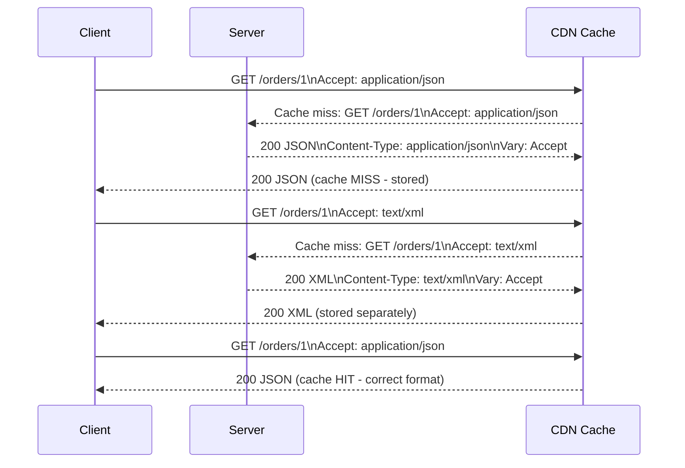

⚡ TL;DR - Content negotiation is the HTTP mechanism
where the client specifies what response formats it
can handle (`Accept: application/json, text/xml;q=0.9`)
and the server selects the best match and returns it
with `Content-Type`; quality values (`q=0.9`) set
client preference weights; `Vary: Accept` on the
response tells CDNs to cache separate copies per
`Accept` header value; the critical production issue
is omitting `Vary: Accept` causing CDN to serve the
wrong format to subsequent clients.

---

| #044 | Category: HTTP & APIs | Difficulty: ★★ |
|:---|:---|:---|
| **Depends on:** | HTTP Request/Response Cycle, REST API Design Principles | |
| **Used by:** | Partial Responses (Sparse Fieldsets) | |
| **Related:** | HTTP Request/Response Cycle, HTTP Compression, Partial Responses | |

---

### 🔥 The Problem This Solves

**WORLD WITHOUT IT:**
A REST API serves only JSON. A legacy enterprise client
needs XML for integration with their SOAP-based system.
Without content negotiation, the API team must build
a separate endpoint (`/orders.xml`) or a separate service
just to serve XML. If they later need CSV export and
protobuf for mobile, endpoints multiply: `/orders`,
`/orders.xml`, `/orders.csv`, `/orders.proto`. Each is
a separate code path to maintain.

**THE BREAKING POINT:**
API versioning for format changes creates explosion of
endpoints. Caching becomes impossible because the URL
does not indicate what format was served. CDNs cache
`/orders` as JSON and serve it to XML clients. The
codebase has 4 copies of the same business logic, one
per format.

**THE INVENTION MOMENT:**
HTTP/1.0 RFC 1945 (1996) defined the `Accept` header.
The design: the URL identifies the resource; the
`Accept` header specifies the desired representation
of that resource. One URL (`/orders/123`), multiple
representations (JSON, XML, CSV). The server selects
the best match using quality-weighted negotiation.
URL stays clean; format preference is transport-level
metadata.

---

### 📘 Textbook Definition

HTTP content negotiation allows client and server to
agree on the best representation for a response.
**Proactive (server-driven) negotiation:** client sends
preference headers; server selects the representation.
Headers involved: `Accept` (media type), `Accept-Language`
(language), `Accept-Encoding` (compression), `Accept-
Charset` (character set). **Reactive (agent-driven)
negotiation:** server returns 300 Multiple Choices with
a list of available representations; client chooses.
Rarely used in REST APIs. **Quality values (q-factors):**
`Accept: application/json;q=1.0, text/xml;q=0.9, */*;q=0.1`
means JSON is preferred (1.0), XML acceptable (0.9),
anything else minimally acceptable (0.1). Range 0.0-1.0;
default is 1.0 if not specified. **`Vary` header:**
`Vary: Accept` tells caches (CDN, browser) that responses
may differ based on the `Accept` header. CDN must cache
separate entries for `Accept: application/json` vs
`Accept: text/xml`. **406 Not Acceptable:** server
cannot produce any format from the `Accept` header;
returns 406 with list of available types.

---

### ⏱️ Understand It in 30 Seconds

**One line:**
Content negotiation is HTTP's "I speak these languages,
in this order of preference" mechanism: the client
lists what it can handle, the server picks the best
match.

**One analogy:**
> A waiter asks what wine you prefer. You say "I prefer
> red, but white is OK, anything but rose." The waiter
> checks what is available and returns the best match.
> If only rose is available, they say "I cannot satisfy
> your preferences" (406 Not Acceptable). The table
> number (URL) is the same regardless; the drink (format)
> is negotiated at service time.

**One insight:**
The `Vary` header is the critical production concern.
Without `Vary: Accept`, a CDN caches the first response
(say JSON) for `GET /orders/123` and serves that cached
JSON to the next request (which wanted XML). The client
gets the wrong format with a 200 status code - no error
signal. `Vary: Accept` is non-negotiable when serving
multiple formats from the same URL.

---

### 🔩 First Principles Explanation

**Quality value parsing:**

```
Accept: application/json, text/xml;q=0.9, */*;q=0.1

Parsed preference list (sorted by q-value):
1. application/json   q=1.0  (default, no q specified)
2. text/xml           q=0.9
3. */* (any)          q=0.1

Server has: JSON, XML, CSV
Best match: application/json (q=1.0, client's first choice)
→ Respond with Content-Type: application/json
```

**406 Not Acceptable:**
```
Accept: text/html, application/pdf
Server has: JSON only
→ 406 Not Acceptable
Body: {"available": ["application/json", "text/xml"]}
```

**FastAPI content negotiation:**

```python
from fastapi import FastAPI, Request
from fastapi.responses import (
    JSONResponse, Response
)
import csv
import io
import xml.etree.ElementTree as ET

app = FastAPI()

def order_to_xml(order: dict) -> str:
    root = ET.Element("order")
    for key, value in order.items():
        child = ET.SubElement(root, key)
        child.text = str(value)
    return ET.tostring(root, encoding="unicode")

def order_to_csv(order: dict) -> str:
    output = io.StringIO()
    writer = csv.DictWriter(output, fieldnames=order.keys())
    writer.writeheader()
    writer.writerow(order)
    return output.getvalue()

@app.get("/orders/{order_id}")
async def get_order(order_id: str, request: Request):
    order = {
        "id": order_id,
        "status": "SHIPPED",
        "total": 49.99
    }

    # Parse Accept header
    accept = request.headers.get("accept", "application/json")

    # ALWAYS include Vary header for CDN correctness
    headers = {"Vary": "Accept"}

    if "application/json" in accept or "*/*" in accept:
        return JSONResponse(order, headers=headers)
    elif "text/xml" in accept or "application/xml" in accept:
        return Response(
            content=order_to_xml(order),
            media_type="text/xml",
            headers=headers
        )
    elif "text/csv" in accept:
        return Response(
            content=order_to_csv(order),
            media_type="text/csv",
            headers=headers
        )
    else:
        # 406 Not Acceptable
        return Response(
            status_code=406,
            content='{"available":["application/json","text/xml","text/csv"]}',
            media_type="application/json"
        )
```

---

### 🧪 Thought Experiment

**SCENARIO: REST API with protobuf for mobile**

Mobile app wants protobuf (binary, smaller payload)
for high-frequency requests. Web app wants JSON.
Same `/events` endpoint serves both.

**Client requests:**
```
Mobile:  Accept: application/x-protobuf;q=1.0, application/json;q=0.5
Web:     Accept: application/json
```

**Server logic:**
```
Mobile request → protobuf available? Yes → serve protobuf
Web request → protobuf first (q=1.0) → web does not list protobuf
           → next: application/json (q=1.0) → available → serve JSON
```

**CDN requirement:**
```
Vary: Accept
→ CDN caches separately:
  cache["/events"][Accept: application/x-protobuf] = <binary>
  cache["/events"][Accept: application/json]        = <json>
→ Each client gets correct format
```

Result: one URL, two formats, CDN-cacheable, no URL
proliferation.

---

### 🧠 Mental Model / Analogy

> Content negotiation is like a multilingual customer
> service rep. You tell them your languages in order
> of preference: "I speak Spanish (first choice), then
> English, then Portuguese." They check which languages
> they know, pick the best match (Spanish if available,
> English if not), and respond in that language. The
> phone number (URL) is the same; the language
> (format) is agreed upon at the start of the call.
> The `Vary` header tells the call center's translation
> service to keep separate transcripts per language
> (not serve the Spanish transcript to an English caller).

---

### 📶 Gradual Depth - Five Levels

**Level 1 - What it is (anyone can understand):**
HTTP content negotiation lets the client say "I prefer
JSON but can handle XML" and the server automatically
returns the right format. One URL, multiple response
formats, no duplicate endpoints.

**Level 2 - How to use it (junior developer):**
Read the `Accept` header in your endpoint. Parse it
for the preferred media type. Return the response in
that format with the correct `Content-Type` header.
Always add `Vary: Accept` to the response.

**Level 3 - How it works (mid-level engineer):**
Quality values (`;q=0.9`) are decimal weights from 0
to 1. Default is 1.0. Parse all types from the `Accept`
header, sort by q-value descending, find the first
match your server supports, respond with that type.
If no match: 406. Wildcard `*/*` matches any type
(with the given q weight). `text/*` matches any text
subtype.

**Level 4 - Why it was designed this way (senior/staff):**
Content negotiation is designed around Fielding's REST
constraint that URLs identify resources, not
representations. A resource (`/orders/123`) can have
multiple representations (JSON, XML, CSV). Encoding
the format in the URL (`/orders/123.json`) breaks this
constraint: the resource identifier becomes coupled
to its representation format. Headers carry transport-
level metadata; URLs carry resource identity. The `Vary`
header is the mechanism that makes caching correct:
without it, cache invalidation based on URL alone
would serve wrong representations.

**Level 5 - Mastery (distinguished engineer):**
At scale, content negotiation with many formats creates
cache key complexity. Each `Accept` header variant
creates a separate CDN cache entry. A client sending
`Accept: application/json, text/html;q=0.9, */*;q=0.8`
creates a different cache key than `Accept: application/
json`. This can result in cache fragmentation. Solutions:
(1) Normalize `Accept` headers before caching (extract
only the preferred media type, not the full header);
(2) Use separate CDN behaviors/routes per format if
format diversity is high; (3) Limit supported formats
to 2-3 and document them clearly (JSON + protobuf for
most modern APIs). Excessive format proliferation is
an anti-pattern.

---

### ⚙️ How It Works (Mechanism)

**Proper q-value parser:**

```python
from typing import List, Tuple

def parse_accept_header(
    accept: str
) -> List[Tuple[str, float]]:
    """Parse Accept header into (media_type, q) pairs
    sorted by preference (highest q first)."""
    if not accept:
        return [("application/json", 1.0)]

    types = []
    for part in accept.split(","):
        part = part.strip()
        if ";q=" in part:
            media_type, q_part = part.split(";q=", 1)
            try:
                q = float(q_part)
            except ValueError:
                q = 1.0
        else:
            media_type = part
            q = 1.0
        types.append((media_type.strip(), q))

    # Sort by q descending, then by specificity
    # (application/json > text/* > */*)
    types.sort(key=lambda x: (
        -x[1],
        0 if "*" not in x[0] else
        1 if x[0].endswith("/*") else 2
    ))
    return types

def negotiate(
    accept_header: str,
    available: List[str]
) -> str | None:
    """Select best match from available types."""
    preferences = parse_accept_header(accept_header)
    for media_type, q in preferences:
        if q == 0.0:
            continue  # q=0 means "not acceptable"
        if media_type == "*/*":
            return available[0]  # First available
        if media_type.endswith("/*"):
            prefix = media_type[:-1]  # "text/"
            for avail in available:
                if avail.startswith(prefix):
                    return avail
        if media_type in available:
            return media_type
    return None  # 406 Not Acceptable
```



---

### 🔄 The Complete Picture - End-to-End Flow

**Vary header in Nginx for content negotiation:**

```nginx
location /api/ {
    proxy_pass http://backend;

    # Nginx does not add Vary automatically.
    # Backend must return Vary: Accept.
    # Alternatively force it here:
    add_header Vary Accept always;
}
```

---

### 💻 Code Example

**Example 1 - BAD: No Vary header (CDN serves wrong format)**

```python
# BAD: No Vary header - CDN caches one format for all
@app.get("/orders/{order_id}")
async def get_order(order_id: str, request: Request):
    accept = request.headers.get("accept", "application/json")
    order = db.get_order(order_id)

    if "text/xml" in accept:
        return Response(
            content=to_xml(order), media_type="text/xml"
            # NO Vary header!
            # CDN caches JSON response, serves XML clients JSON
        )
    return JSONResponse(order)
    # NO Vary header!
    # CDN caches first response for ALL Accept values

# GOOD: Always include Vary: Accept
@app.get("/orders/{order_id}")
async def get_order(order_id: str, request: Request):
    accept = request.headers.get("accept", "application/json")
    order = db.get_order(order_id)
    headers = {"Vary": "Accept"}  # REQUIRED for CDN

    if "text/xml" in accept:
        return Response(
            content=to_xml(order),
            media_type="text/xml",
            headers=headers
        )
    return JSONResponse(order, headers=headers)
```

---

### ⚖️ Comparison Table

| Approach | URLs | Caching | Flexibility | Complexity |
|:---|:---|:---|:---|:---|
| Separate endpoints (`/orders.json`) | Multiple | Simple | Low | Low |
| Query param (`?format=json`) | 1 URL | Medium (key includes param) | Medium | Low |
| Content negotiation (`Accept` header) | 1 URL | Complex (Vary required) | High | Medium |
| Always JSON (no negotiation) | 1 URL | Simple | Low | None |

---

### ⚠️ Common Misconceptions

| Misconception | Reality |
|:---|:---|
| `Accept: */*` means the client has no preference | `*/*` means the client accepts any format. Used as a fallback, usually with low q-value: `Accept: application/json, */*;q=0.1`. If `*/*` is the only value, the server should return its default format (typically JSON for REST APIs). |
| `Content-Type` and `Accept` serve the same purpose | `Accept` is sent by the client to specify what it can receive (request). `Content-Type` is sent by both client (what body format I'm sending) and server (what body format I'm returning). Two different headers with different directions. |
| 406 means server error | 406 Not Acceptable is a client error (4xx). The client requested a format the server cannot produce. The server is correct; the client must change its `Accept` header or accept the server's default format. |
| Content negotiation is only for response format | Content negotiation also includes `Accept-Language` (localization), `Accept-Encoding` (compression), and `Accept-Charset` (character encoding). Most APIs only use `Accept` for format negotiation, but the mechanism extends to all representation dimensions. |

---

### 🚨 Failure Modes & Diagnosis

**CDN serving wrong format (missing Vary header)**

**Symptom:** Client requesting XML receives JSON with
200 status code. Happens only when there is a CDN cache
hit. Requests bypassing CDN work correctly.

**Root Cause:** Server returns responses without `Vary:
Accept`. CDN stores the first response (JSON) for the
URL and serves it to all subsequent requests regardless
of `Accept` header.

**Diagnostic:**
```bash
# Check CDN-cached response headers
curl -v -H "Accept: application/json" \
  https://api.example.com/orders/123
# Check for: X-Cache: HIT, Content-Type: application/json

curl -v -H "Accept: text/xml" \
  https://api.example.com/orders/123
# If Content-Type is still application/json: Vary missing
# Solution: add Vary: Accept to all multi-format responses
```

---

### 🔗 Related Keywords

**Prerequisites (understand these first):**
- `HTTP Request/Response Cycle` - headers and status
  codes are the mechanism
- `REST API Design Principles` - REST resource vs
  representation concept

**Builds On This (learn these next):**
- `Partial Responses (Sparse Fieldsets)` - related
  field selection mechanism

---

### 📌 Quick Reference Card

```
┌──────────────────────────────────────────────────────────┐
│ WHAT IT IS   │ Client lists preferred formats (Accept:); │
│              │ server picks best match (Content-Type:)   │
├──────────────┼───────────────────────────────────────────┤
│ QUALITY      │ Accept: application/json,text/xml;q=0.9   │
│ VALUES       │ JSON preferred (1.0), XML fallback (0.9)  │
├──────────────┼───────────────────────────────────────────┤
│ 406          │ Not Acceptable: server cannot produce     │
│              │ any requested format                      │
├──────────────┼───────────────────────────────────────────┤
│ CRITICAL     │ Vary: Accept - ALWAYS required when       │
│              │ serving multiple formats from one URL     │
├──────────────┼───────────────────────────────────────────┤
│ ANTI-PATTERN │ Separate URLs per format (/orders.json);  │
│              │ omitting Vary: Accept (CDN serves wrong   │
│              │ format to clients)                        │
├──────────────┼───────────────────────────────────────────┤
│ ONE-LINER    │ "One URL, many formats: Accept header     │
│              │ negotiates; Vary caches correctly"        │
└──────────────────────────────────────────────────────────┘
```

**If you remember only 3 things:**
1. `Accept` header = what client wants. `Content-Type`
   = what is being sent. Different headers, different
   directions.
2. Always include `Vary: Accept` when serving multiple
   formats from one URL. Without it, CDN caches the
   first format served and returns it to all clients
   regardless of their `Accept` value.
3. `q=0.0` means "not acceptable" (the opposite of
   preference). `q=1.0` (default) means most preferred.

---

### 💎 Transferable Wisdom

**Reusable Engineering Principle:**
"Separate identity from representation." URLs identify
resources (what); headers carry metadata about how
the resource should be represented (format, language,
encoding). This separation is the foundation of HTTP
cache semantics. The `Vary` header generalizes this:
any dimension that affects the response representation
must be listed in `Vary` so caches can key correctly.
This applies beyond content type: `Vary: Accept-
Language` for internationalized responses, `Vary:
Accept-Encoding` for compression (this is why CDNs
typically strip `Accept-Encoding` from cache keys
and handle compression transparently).

**Where else this pattern applies:**
- Accept-Language (i18n): same endpoint returns English
  or French based on client preference
- Accept-Encoding: compression negotiated (gzip, br)
  without format-specific URLs
- GraphQL persisted queries: client sends query hash;
  server returns data in client-requested format

---

### 💡 The Surprising Truth

Most popular REST APIs do not implement content
negotiation at all. GitHub API, Stripe API, Twilio API
- all return JSON only, regardless of `Accept` header.
The simplest case (`Accept: application/json` always)
is the most common. Content negotiation is valuable
when: (1) you have genuinely diverse client types with
different format requirements (enterprise SOAP clients
vs mobile JSON clients); (2) you are building a
hypermedia API (JSON-LD, HAL, JSON:API all have specific
media types); (3) API documentation requires format
flexibility. For a typical modern REST API serving
web/mobile clients: always JSON, no negotiation needed.
The mechanism exists for when you need it; do not add
complexity when you do not.

---

### ✅ Mastery Checklist

**You've mastered this when you can:**
1. **PARSE** An `Accept` header with multiple types
   and quality values, correctly ranking preferences.
2. **IMPLEMENT** A multi-format endpoint that returns
   JSON, XML, or CSV based on the `Accept` header and
   responds with 406 if none are supported.
3. **EXPLAIN** Why `Vary: Accept` is required and what
   happens to CDN caching without it.
4. **DISTINGUISH** `Accept` (desired response format),
   `Content-Type` (actual response format), and the
   direction each flows.
5. **DECIDE** When content negotiation is worth the
   complexity vs always serving one format.

---

### 🎯 Interview Deep-Dive

**Q1: What does `Vary: Accept` do and why is it
critical?**

*Why they ask:* Tests CDN/caching knowledge depth.

*Strong answer includes:*
- `Vary: Accept` tells HTTP caches (CDN, browser cache,
  reverse proxy) that the response may differ based on
  the `Accept` request header.
- Without `Vary: Accept`: CDN stores response for
  `GET /orders/1` (first seen with `Accept: application/
  json` → JSON body). Next request with `Accept: text/xml`
  → CDN has a cache entry for this URL → returns cached
  JSON body. Client receives wrong format with 200 OK.
- With `Vary: Accept`: CDN uses `(URL, Accept-value)`
  as the composite cache key. `GET /orders/1` with JSON
  accept is a different cache entry from `GET /orders/1`
  with XML accept. Each format is cached and returned
  separately.
- Practical concern: `Vary` header increases CDN cache
  fragmentation. For most APIs that serve only JSON,
  `Vary: Accept` adds complexity without benefit. Only
  add it if you actually serve multiple formats.

**Q2: What is the difference between Accept and
Content-Type headers?**

*Why they ask:*  Common interview question testing HTTP
header knowledge.

*Strong answer includes:*
- `Accept` (client to server, in request): "I can
  understand these response formats, in this preference
  order." Used in GET/DELETE/HEAD requests that have
  no request body. Example: `Accept: application/json`.
- `Content-Type` (both directions): declares the format
  of the body being sent. In requests: "The body I'm
  sending is in this format" (used with POST/PUT/PATCH).
  In responses: "The body I'm returning is in this
  format." Example: `Content-Type: application/json;
  charset=utf-8`.
- Connection: client sends `Accept: text/xml`. Server
  responds with `Content-Type: text/xml` (confirming
  the format it is using). If server cannot satisfy
  `Accept`, it returns 406.
- Common mistake: setting `Content-Type` on a GET
  request (no body → Content-Type is meaningless).

**Q3: When would you add content negotiation to an API
vs just returning JSON always?**

*Why they ask:* Tests pragmatic decision-making.

*Strong answer includes:*
- Add when: (1) Enterprise clients need XML (SOAP
  integration, TIBCO, IBM MQ systems); (2) mobile app
  needs protobuf for bandwidth efficiency on high-
  frequency endpoints; (3) building a hypermedia API
  (HAL, JSON:API, JSON-LD all have specific media types
  that use negotiation to distinguish from plain JSON);
  (4) data export endpoints (CSV for spreadsheet users,
  JSON for developers).
- Do not add when: (1) all clients are web/mobile and
  expect JSON; (2) team and API tooling do not support
  multiple formats (OpenAPI spec becomes complex);
  (3) you would add formats "just in case" without a
  real consumer.
- Simplest rule: start with JSON-only. Add content
  negotiation only when you have a real consumer that
  needs a different format and the URL-per-format
  approach is explicitly unacceptable.
