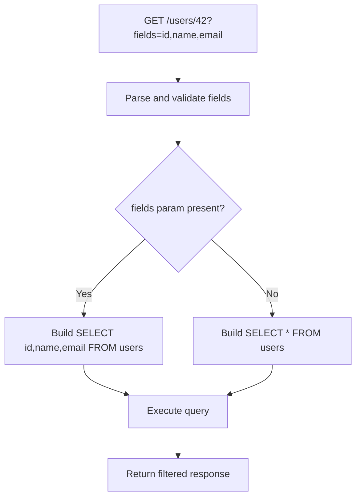

⚡ TL;DR - Partial responses (sparse fieldsets) let
clients specify exactly which fields to return from a
REST endpoint using a `fields` query parameter (`?fields=
id,name,email`); reduces payload size and server-side
serialization work for bandwidth-constrained clients;
Google API conventions use `fields` parameter; JSON:API
spec uses `fields[resource-type]=field1,field2`; the
main complexity is server-side field filtering without
breaking schema validation and OpenAPI documentation.

---

| #045 | Category: HTTP & APIs | Difficulty: ★★ |
|:---|:---|:---|
| **Depends on:** | REST API Design Principles, Content Negotiation | |
| **Used by:** | Batch Requests | |
| **Related:** | GraphQL Query Language, Content Negotiation, Batch Requests | |

---

### 🔥 The Problem This Solves

**WORLD WITHOUT IT:**
A user list endpoint returns 25 fields per user (full
profile). The mobile app's contact list UI only shows
name, avatar, and email. Fetching 1000 users returns
25,000 field values; only 3,000 are used. 88% of the
response payload is unused. On a 3G connection, this
adds 400ms of unnecessary transfer time. On the server,
serializing 25,000 field values takes measurable CPU
time even though 22,000 will be discarded immediately.

**THE BREAKING POINT:**
Adding more fields to the user model for other client
needs bloats every request. The mobile list query grows
from 25 to 40 fields - but the mobile contact list
still only needs 3. The response grows by 60%; the
client's usefulness stays at 3 fields.

**THE INVENTION MOMENT:**
Google's API design guide formalized the `fields`
parameter: `GET /users?fields=id,name,email` returns
only those three fields. The API internally fetches
the full user and then filters to the requested fields
before serialization. Payload size controlled by the
client. First appeared widely in Google+ and YouTube
APIs (2010-2012).

---

### 📘 Textbook Definition

Partial responses (sparse fieldsets) allow API clients
to request a subset of fields in a response using a
query parameter. **Google convention:** `?fields=
id,name,email` (comma-separated list). **JSON:API spec:**
`?fields[articles]=title,body&fields[people]=name`
(type-scoped field lists). **RFC 7396 (Merge Patch):**
related concept for PATCH requests specifying which
fields to update. **GraphQL equivalent:** query field
selection (built into the protocol). **Implementation
approaches:** (1) post-serialization filtering (serialize
full object, then remove non-requested keys - simple
but wasteful for complex objects); (2) pre-serialization
filtering (build response from only requested fields -
efficient but more complex; requires conditional field
resolution). **Caching impact:** `?fields=id,name` and
`?fields=id,name,email` are different cache keys (full
URL including query string). CDN caches separate
entries per field combination.

---

### ⏱️ Understand It in 30 Seconds

**One line:**
Sparse fieldsets let clients ask "give me only these
3 fields" from an endpoint that normally returns 25,
reducing payload by 88% without building a custom
endpoint.

**One analogy:**
> You receive a newspaper but only want the sports
> section and the weather. Instead of getting the full
> newspaper (40 pages) and recycling 38, you subscribe
> to the "sports + weather only" edition. Same press
> (same database), but the delivery is filtered to
> exactly what you want. The `fields` parameter is
> your subscription preference.

**One insight:**
Sparse fieldsets are REST's answer to GraphQL's field
selection. GraphQL's primary value proposition is "ask
for exactly what you need." The `fields` parameter
brings that same principle to REST without changing
the protocol. The trade-off: REST sparse fieldsets
are flat (cannot select nested fields without URL
encoding complexity); GraphQL field selection is
recursive (select `user.orders.items.product.name`).

---

### 🔩 First Principles Explanation

**Google API style fields parameter:**

```
GET /users?fields=id,name,email

Full user object: {
  "id": "42",
  "email": "alice@example.com",
  "name": "Alice",
  "bio": "...",
  "avatar": "...",
  "createdAt": "...",
  "updatedAt": "...",
  "preferences": {...},
  "address": {...}
}

Sparse response: {
  "id": "42",
  "name": "Alice",
  "email": "alice@example.com"
}
```

**Nested field selection (Google style):**

```
GET /users?fields=id,name,orders(id,total)

Response: {
  "id": "42",
  "name": "Alice",
  "orders": [
    {"id": "101", "total": 49.99},
    {"id": "102", "total": 12.50}
  ]
}
# Fetches related orders but returns only id+total per order
```

**FastAPI implementation:**

```python
from fastapi import FastAPI, Query
from typing import Optional, Set
import json

app = FastAPI()

def filter_fields(
    obj: dict,
    fields: Optional[Set[str]]
) -> dict:
    """Filter dict to requested fields only."""
    if not fields:
        return obj  # No filtering: return all fields
    return {k: v for k, v in obj.items() if k in fields}

@app.get("/users/{user_id}")
async def get_user(
    user_id: int,
    fields: Optional[str] = Query(
        None,
        description="Comma-separated list of fields to return",
        example="id,name,email"
    )
):
    user = db.get_user(user_id)  # Full user object

    # Parse fields parameter
    requested_fields: Optional[Set[str]] = None
    if fields:
        requested_fields = {
            f.strip() for f in fields.split(",")
            if f.strip()
        }

    return filter_fields(user.dict(), requested_fields)
```

---

### 🧪 Thought Experiment

**SCENARIO: Mobile list vs detail views**

Mobile app has two screens:
1. Contact list: shows name + email + avatar (3 fields)
2. Contact detail: shows all 25 fields

**Without sparse fieldsets:**
Both views call `GET /users/{id}` - both receive 25
fields. List view discards 22 fields on the client.

**With sparse fieldsets:**
```
List view:   GET /users?fields=id,name,email,avatarUrl
Detail view: GET /users/{id}  (no fields filter - all 25)
```

Bandwidth impact for a list of 100 users:
- Without: 100 × 25 fields × 200 bytes avg = 500 KB
- With: 100 × 4 fields × 80 bytes avg = 32 KB
- Reduction: 93.6% for the list view

**Result:** Contact list loads in one-fifth the time
on slow connections. Detail view unchanged (full data
when needed).

---

### 🧠 Mental Model / Analogy

> Sparse fieldsets are like a SELECT statement in SQL.
> Instead of `SELECT * FROM users WHERE id = 42`
> (returns all columns), you write `SELECT id, name,
> email FROM users WHERE id = 42` (returns only needed
> columns). The `fields` parameter is the REST equivalent
> of listing columns in a SELECT statement. The database
> (backend) can optimize by only fetching and
> serializing what was asked, just as the database query
> planner skips unneeded columns.

---

### 📶 Gradual Depth - Five Levels

**Level 1 - What it is (anyone can understand):**
Sparse fieldsets let you say "I only want the name
and email" when asking for user data. Instead of
getting a huge blob with 25 fields you do not need,
you get a small response with exactly what you asked
for.

**Level 2 - How to use it (junior developer):**
Add a `fields` query parameter to your endpoints.
Parse it as a comma-separated list of field names.
Return only the requested fields in the response.
If `fields` is absent, return all fields (backward
compatible).

**Level 3 - How it works (mid-level engineer):**
Two implementation strategies: (1) post-serialization
filtering: fetch full object, serialize it, remove
non-requested keys from the dict. Simple but serializes
all fields even if most are dropped. (2) pre-serialization
filtering: only resolve and serialize requested fields
(similar to GraphQL resolver approach). More efficient
for expensive computed fields. For database optimization:
pass `fields` to the query layer to generate `SELECT
id, name, email FROM users` instead of `SELECT *`.

**Level 4 - Why it was designed this way (senior/staff):**
Sparse fieldsets provide a REST-native solution to
over-fetching without the protocol overhead of GraphQL.
They are simpler to implement, document in OpenAPI,
and reason about than GraphQL's field selection. The
trade-off: flat field lists cannot select nested fields
with the same expressiveness as GraphQL. JSON:API's
type-scoped fieldsets (`fields[articles]`, `fields[
people]`) partially address nested selection for included
resources. For most APIs: `fields` parameter is
sufficient. For highly nested, complex data needs:
GraphQL is a better fit.

**Level 5 - Mastery (distinguished engineer):**
Sparse fieldsets at scale require careful cache key
design. A CDN or application cache keyed on full URL
including query string will create one cache entry per
unique `fields` combination. With 25 fields, clients
could request 2^25 combinations in theory. Mitigation:
(1) normalize the `fields` parameter (sort fields
alphabetically: `fields=email,id,name` and `fields=
name,id,email` produce the same fields but are different
cache keys). Sort on ingress before cache lookup.
(2) Allow a small set of named field presets (`?preset=
minimal`, `?preset=full`) instead of arbitrary field
lists. (3) Application cache keyed on `(user_id, sorted_
fields_set)` not URL string.

---

### ⚙️ How It Works (Mechanism)

**Database-level optimization (pass fields to query):**

```python
from sqlalchemy import select, Column
from typing import Set, Optional

def get_user_with_fields(
    user_id: int,
    fields: Optional[Set[str]] = None
) -> dict:
    """Build query to SELECT only requested fields."""

    # Default: all fields
    ALLOWED_FIELDS = {
        "id", "email", "name", "bio",
        "avatarUrl", "createdAt", "updatedAt"
    }

    # Validate requested fields
    if fields:
        invalid = fields - ALLOWED_FIELDS
        if invalid:
            raise ValueError(
                f"Unknown fields: {', '.join(invalid)}"
            )
        select_fields = fields & ALLOWED_FIELDS
    else:
        select_fields = ALLOWED_FIELDS

    # Build typed select columns
    columns = [
        getattr(User, f)
        for f in select_fields
        if hasattr(User, f)
    ]

    query = select(*columns).where(User.id == user_id)
    row = db.execute(query).fetchone()
    if not row:
        return None
    return dict(zip(select_fields, row))
```



---

### 🔄 The Complete Picture - End-to-End Flow

**JSON:API sparse fieldsets format:**

```
GET /articles?include=author&fields[articles]=title,body&fields[people]=name

Response: {
  "data": [{
    "type": "articles",
    "id": "1",
    "attributes": {
      "title": "Article One",
      "body": "Content here..."
    },
    "relationships": {
      "author": {"data": {"type": "people", "id": "42"}}
    }
  }],
  "included": [{
    "type": "people",
    "id": "42",
    "attributes": {
      "name": "Alice"
    }
  }]
}
# author.name only (not email, avatar, etc.)
# article.title + body only (not createdAt, etc.)
```

---

### 💻 Code Example

**Example 1 - BAD: No field validation (injection risk)**

```python
# BAD: Unvalidated fields directly in query
@app.get("/users/{user_id}")
async def get_user(user_id: int, fields: str = ""):
    if fields:
        # DANGER: fields could contain SQL injection
        # or internal fields (password_hash)
        query = f"SELECT {fields} FROM users WHERE id = ?"
        # Exposes password_hash, internal_flags, etc.

# GOOD: Allowlist validation
ALLOWED_FIELDS = frozenset({
    "id", "email", "name", "bio",
    "avatarUrl", "createdAt"
})
# Note: password_hash, internalFlags NOT in allowlist

@app.get("/users/{user_id}")
async def get_user(
    user_id: int, fields: Optional[str] = None
):
    requested = set()
    if fields:
        requested = {f.strip() for f in fields.split(",")}
        invalid = requested - ALLOWED_FIELDS
        if invalid:
            raise HTTPException(
                status_code=400,
                detail=f"Unknown fields: {invalid}"
            )
    # Use only validated, allowlisted fields
    return db.get_user_fields(
        user_id, requested or ALLOWED_FIELDS
    )
```

---

### ⚖️ Comparison Table

| Feature | `fields` param (REST) | GraphQL Selection | JSON:API `fields[]` |
|:---|:---|:---|:---|
| Flat field selection | Yes | Yes | Yes |
| Nested field selection | Limited | Full recursive | Type-scoped |
| Cache friendly | With normalization | Complex | With normalization |
| OpenAPI documentation | Simple | N/A | Spec-defined |
| Learning curve | Low | High | Medium |

---

### ⚠️ Common Misconceptions

| Misconception | Reality |
|:---|:---|
| Sparse fieldsets are only useful for mobile clients | Any client with bandwidth or performance constraints benefits. Internal microservices calling each other can benefit significantly if they only need 2 of 30 fields. Reduces serialization CPU, reduces network transfer, reduces deserialization CPU on the consumer. |
| Removing fields from response always reduces server work | If the server fetches all fields from the database and then filters before returning, the database work is unchanged. Full benefit requires passing field selection to the database query (`SELECT id, name` not `SELECT *`). |
| Any field name should be accepted | Never allow unvalidated `fields` values in a query string. Attackers can probe for internal fields (`?fields=password_hash,reset_token`). Always validate against an allowlist. |
| Sparse fieldsets and pagination are independent | Both affect response size. Sparse fieldsets reduce width (fields per item). Pagination reduces height (items per page). Both should be implemented together for list endpoints. |

---

### 🚨 Failure Modes & Diagnosis

**Client caches wrong fields after removing a field**

**Symptom:** Client application cached `GET /users?fields=
id,name,email` response. Later, the client request
changes to `GET /users?fields=id,name,email,avatarUrl`.
Because the URL changed, the CDN has no cache entry.
But the application-level cache (Redis key based on
`user_id`) returns the old 3-field response for the
4-field request.

**Root Cause:** Application cache key includes only
`user_id`, not the field set. Returns cached response
regardless of which fields are requested.

**Fix:** Cache key must include the sorted field set:
`users:{user_id}:{sorted_field_hash}`. Invalidate cache
on any field-set change. Alternatively, cache full user
object and apply field filtering at the application
cache layer (cache the full object, filter before
returning; cheaper than DB roundtrip).

---

### 🔗 Related Keywords

**Prerequisites (understand these first):**
- `REST API Design Principles` - REST resource model
- `Content Negotiation` - related representation selection

**Builds On This (learn these next):**
- `Batch Requests` - request optimization; related
  bandwidth reduction approach

---

### 📌 Quick Reference Card

```
┌──────────────────────────────────────────────────────────┐
│ WHAT IT IS   │ ?fields=id,name,email returns only those  │
│              │ fields from any endpoint                  │
├──────────────┼───────────────────────────────────────────┤
│ PROBLEM IT   │ Over-fetching: client receives 25 fields; │
│ SOLVES       │ uses 3; wastes bandwidth and CPU          │
├──────────────┼───────────────────────────────────────────┤
│ KEY INSIGHT  │ Pass field list to DB query (SELECT only  │
│              │ needed cols) for full server-side benefit │
├──────────────┼───────────────────────────────────────────┤
│ SECURITY     │ Allowlist fields: never allow unvalidated │
│              │ field names into SQL or serialization     │
├──────────────┼───────────────────────────────────────────┤
│ CACHE KEY    │ Sort fields alphabetically; include in    │
│              │ cache key: ?fields=email,id,name          │
├──────────────┼───────────────────────────────────────────┤
│ ONE-LINER    │ "REST's SELECT-clause: client picks       │
│              │ columns, server fetches only those"       │
└──────────────────────────────────────────────────────────┘
```

**If you remember only 3 things:**
1. Validate `fields` values against an allowlist. Never
   pass raw `fields` parameter values into SQL queries
   or serializers. Security boundary.
2. Pass field selection to the database (`SELECT id, name`
   vs `SELECT *`). Full bandwidth + CPU benefit. Filtering
   after full DB fetch only saves network transfer.
3. Normalize cache keys: sort fields alphabetically
   (`email,id,name` not `name,id,email`) so different
   orderings hit the same cache entry.

---

### 💎 Transferable Wisdom

**Reusable Engineering Principle:**
"Only transfer what is needed." Sparse fieldsets apply
the same principle as: database index covering (select
only indexed columns to avoid table lookup); Kafka
message projections (publish only fields that changed);
gRPC field masks (`FieldMask` in protobuf: specify
which fields to update or return, standard in Google
Cloud APIs). The pattern recurs wherever a wide data
model must serve narrow consumers: minimize transfer
to minimize cost and latency.

**Where else this pattern applies:**
- gRPC `FieldMask`: explicit field selection in protobuf
  responses; used extensively in Google Cloud APIs
- Elasticsearch `_source` filtering: `"_source":
  ["id", "title"]` returns only those fields from a
  document search result
- SQL projections: `SELECT id, name` vs `SELECT *`
  reduces I/O and network transfer from database

---

### 💡 The Surprising Truth

Google's original `fields` parameter (used in Google+
and YouTube APIs) was so well-received that it became
the inspiration for GraphQL's field selection. When
Facebook engineers designed GraphQL, they were partly
motivated by the problem that Google's `fields`
parameter solved, but they wanted a more powerful
recursive version. So in a real sense, Google's sparse
fieldsets parameter is the REST ancestor of GraphQL's
core feature. The REST `fields` parameter is simpler,
less powerful, and requires no special client library.
For most use cases, the simple REST parameter is
sufficient.

---

### ✅ Mastery Checklist

**You've mastered this when you can:**
1. **IMPLEMENT** A `fields` parameter endpoint with
   allowlist validation and SQL projection (SELECT
   only requested columns).
2. **DESIGN** A normalized cache key for sparse fieldset
   responses (sorted field set + user ID).
3. **EXPLAIN** The security requirement for field
   allowlisting (prevent internal field exposure).
4. **CONTRAST** REST sparse fieldsets vs GraphQL field
   selection in terms of capability and complexity.
5. **CALCULATE** The bandwidth savings for a concrete
   list endpoint with field filtering (3 fields of 25,
   100 items).

---

### 🎯 Interview Deep-Dive

**Q1: How would you implement a `fields` query parameter
on a REST endpoint, and what security consideration
must you handle?**

*Why they ask:* Tests API design + security awareness.

*Strong answer includes:*
- Implementation: parse `?fields=id,name,email` as
  comma-separated set. If absent, return all fields
  (backward compatible). Pass field set to serializer
  or database query.
- Security: NEVER use `fields` values directly in SQL
  queries (injection risk). NEVER expose all model
  attributes without allowlisting. Create explicit
  `ALLOWED_FIELDS = frozenset({...})`. Check requested
  fields against allowlist; return 400 if unknown fields
  requested.
- Database optimization: use field set to build `SELECT
  id, name, email FROM users WHERE id = ?` instead of
  `SELECT *`. Reduces database I/O, serialization CPU,
  and network transfer.
- Cache key: sort fields alphabetically and include in
  cache key so `?fields=name,id` and `?fields=id,name`
  hit the same cache entry.

**Q2: How do sparse fieldsets relate to GraphQL field
selection?**

*Why they ask:* Tests breadth of API technology awareness.

*Strong answer includes:*
- Both solve over-fetching: client specifies which fields
  it needs; server returns only those fields.
- REST sparse fieldsets (`?fields=`): flat field list;
  cannot easily express nested field selection for
  related resources without complex syntax; documented
  in OpenAPI; CDN cacheable with normalized keys.
- GraphQL field selection: recursive (can select
  `user.orders.items.product.name`); schema-aware
  (compile-time validation); requires DataLoader to
  prevent N+1; not natively CDN cacheable (POST); needs
  GraphQL client library.
- Choice: simple flat field filtering → REST `fields`
  parameter; complex nested, multi-entity field
  selection → GraphQL.
- Historical note: Google's REST `fields` parameter
  (YouTube API, Google+) was one inspiration for
  GraphQL's field selection design.

**Q3: What happens to CDN caching when clients use
different `fields` combinations?**

*Why they ask:* Tests caching + performance awareness.

*Strong answer includes:*
- Each unique `?fields=` combination is a different
  URL (query string is part of the cache key). CDN
  stores separate cache entries.
- Risk: cache fragmentation. If clients send arbitrary
  field combinations, cache hit rate drops because few
  requests match the same exact fields.
- Mitigation 1: field normalization. Sort fields in
  the query string before cache lookup. Redirect or
  normalize at the gateway: `?fields=name,id` → `?
  fields=id,name`. All requests for the same logical
  field set hit the same cache entry.
- Mitigation 2: named presets. Instead of arbitrary
  `fields`, define `?preset=minimal` (id, name),
  `?preset=standard` (id, name, email, avatar),
  `?preset=full` (all fields). Cache key is predictable.
  Small number of cache entries per resource.
- Mitigation 3: short TTL for sparse fieldset responses.
  Accept lower cache hit rate in exchange for always-
  fresh data. Trade bandwidth for cache simplicity.
