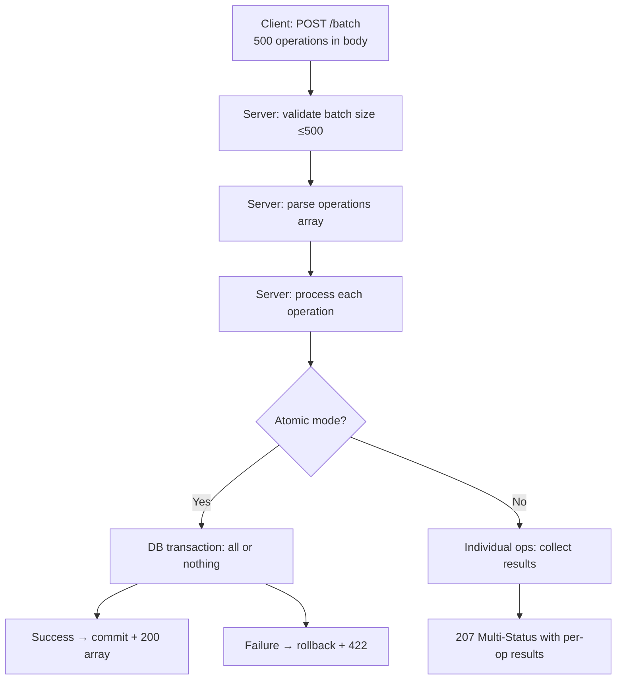

⚡ TL;DR - Batch requests allow a client to send
multiple API operations in a single HTTP request and
receive all results in a single response; reduces
connection overhead (N requests × connection + TLS
handshake → 1 request); approaches: JSON array body
(`[{op1}, {op2}]`), Google Batch API (multipart/mixed),
or an explicit bulk endpoint (`POST /orders/bulk`);
the main failure mode is partial success handling -
decide upfront whether the batch is atomic (all-or-
nothing) or non-atomic (partial success with per-
operation status codes).

---

| #046 | Category: HTTP & APIs | Difficulty: ★★ |
|:---|:---|:---|
| **Depends on:** | REST API Design Principles, Partial Responses | |
| **Used by:** | Webhook Design | |
| **Related:** | GraphQL Query Language, Partial Responses, Webhook Design | |

---

### 🔥 The Problem This Solves

**WORLD WITHOUT IT:**
An admin UI needs to activate 500 user accounts. With
single-resource REST: `POST /users/{id}/activate` called
500 times. Each call has: TCP connection (if not
keepalive), TLS handshake overhead, HTTP request/
response headers (~2KB), authentication validation,
server-side processing, and response serialization.
500 × 2KB headers = 1MB in headers alone. 500 × auth
validation = 500 JWT signature verifications. On a
10ms round-trip connection: 500 sequential requests
= 5 seconds minimum.

**THE BREAKING POINT:**
Import workflows, data migration tools, and admin bulk
operations commonly need to create/update/delete
thousands of records. A "add 1000 product SKUs" import
that makes 1000 separate API calls takes 10-60 seconds
and hammers the server with 1000 individual JWT
validations and 1000 database transactions instead
of 1 bulk insert.

**THE INVENTION MOMENT:**
Google's Batch API (2010-era) allowed multiple API
requests to be bundled in a single HTTP multipart
request. The server processes all operations and
returns a multipart response with per-operation results.
Reduced connection overhead from N connections to 1.
This pattern was later simplified to JSON array bodies
in most modern APIs (Stripe Batch, SendGrid bulk email,
Salesforce Bulk API).

---

### 📘 Textbook Definition

Batch requests combine multiple API operations in a
single HTTP request to reduce network overhead.
**Approaches:**
(1) **JSON Array Body:** `POST /users/bulk` with body
`[{name: "Alice"}, {name: "Bob"}]` - simplest; server
processes all and returns array of results.
(2) **Google Batch API (multipart/mixed):** body is a
`multipart/mixed` MIME document where each part is a
complete HTTP request (method, headers, body). Server
unpacks, processes, and returns multipart response.
(3) **Operations Array:** `POST /batch` with body of
named operations: `{"ops": [{"op": "create", "path":
"/orders", "body": {...}}, ...]}`.
**Atomicity:** batch can be atomic (all succeed or all
roll back; use database transaction) or non-atomic
(each operation succeeds/fails independently; return
per-operation status). **Idempotency:** batches with
mutation operations should support idempotency keys
to prevent duplicate processing on retry. **Size
limits:** server should enforce max batch size (100-
1000 operations) to prevent resource exhaustion.

---

### ⏱️ Understand It in 30 Seconds

**One line:**
Batch requests bundle multiple API operations into
one HTTP call, reducing connection overhead from N
round-trips to 1 while getting N results back.

**One analogy:**
> Grocery shopping. Instead of going to the store for
> each item separately (N trips), you write a shopping
> list and do one trip to get everything (batch). The
> store (API) processes your list and puts all items
> in one bag (batch response). If apples are out of
> stock (one item fails), the store either cancels the
> whole order (atomic) or skips apples and delivers
> everything else (non-atomic).

**One insight:**
Partial success handling is the hardest part of batch
API design, not the request bundling itself. A client
sends 500 operations and 3 fail. Does the API return
200 with 497 successes and 3 failures in the body?
Return 207 Multi-Status? Roll back all 500? The answer
must be decided upfront and documented clearly, because
different clients will assume different behavior.

---

### 🔩 First Principles Explanation

**Simple JSON array batch endpoint:**

```python
from fastapi import FastAPI
from pydantic import BaseModel
from typing import List, Any
import asyncio

app = FastAPI()

class CreateUserRequest(BaseModel):
    name: str
    email: str

class BatchResult(BaseModel):
    index: int
    status: int       # HTTP status per operation
    data: Any = None
    error: str = None

class BatchCreateUsersRequest(BaseModel):
    operations: List[CreateUserRequest]

@app.post("/users/batch", response_model=List[BatchResult])
async def batch_create_users(
    body: BatchCreateUsersRequest
):
    # Validate batch size
    if len(body.operations) > 500:
        raise HTTPException(
            status_code=400,
            detail="Batch size exceeds maximum of 500"
        )

    results = []
    for i, op in enumerate(body.operations):
        try:
            if db.email_exists(op.email):
                results.append(BatchResult(
                    index=i,
                    status=409,
                    error=f"Email {op.email} already exists"
                ))
            else:
                user = db.create_user(
                    name=op.name, email=op.email
                )
                results.append(BatchResult(
                    index=i, status=201,
                    data={"id": user.id, "email": user.email}
                ))
        except Exception as e:
            results.append(BatchResult(
                index=i, status=500, error=str(e)
            ))

    # 207 Multi-Status: some may have succeeded, some failed
    return Response(
        content=json.dumps([r.dict() for r in results]),
        status_code=207,
        media_type="application/json"
    )
```

**Atomic batch (all-or-nothing with transaction):**

```python
@app.post("/orders/batch/atomic")
async def atomic_batch_create_orders(
    body: BatchCreateOrdersRequest
):
    if len(body.operations) > 100:
        raise HTTPException(400, "Max 100 operations")

    try:
        with db.transaction() as txn:
            created = []
            for op in body.operations:
                order = txn.create_order(**op.dict())
                created.append({"id": order.id})
            # If any create fails, exception rolls back all
        return {"status": "ok", "created": created}
    except Exception as e:
        # All-or-nothing: nothing created
        raise HTTPException(422, f"Batch failed: {e}")
```

---

### 🧪 Thought Experiment

**SCENARIO: Import 1000 products into catalog**

**Without batch:**
```
1000 × POST /products HTTP/1.1
1000 × TLS handshake (if no keepalive)
1000 × Authorization: Bearer <jwt>
1000 × JWT validation (crypto operation)
1000 × INSERT INTO products ...
Sequential: ~10 seconds
With HTTP/2 parallel: ~1 second (but 1000 DB inserts)
```

**With batch (non-atomic, 10 per request):**
```
100 × POST /products/batch [10 items each]
100 × JWT validation
10 × bulk INSERT (INSERT INTO products VALUES ...)
Bandwidth: ~1000 ops / (10 headers) = 100x less overhead
Time: ~200ms total (100 parallel requests)
```

**With batch (atomic, 1000 per request):**
```
1 × POST /products/batch [1000 items]
1 × JWT validation
1 × INSERT INTO products VALUES (1000 rows)
Time: ~100ms
Risk: if 1 item fails, all 1000 fail
```

**Decision:** Atomic for all-or-nothing data integrity
(order items). Non-atomic for idempotent imports where
partial success is acceptable (product catalog).

---

### 🧠 Mental Model / Analogy

> Batch API is like a bus versus individual taxis.
> Single requests: each passenger (operation) takes
> their own taxi (HTTP request). Fixed overhead per
> passenger: taxi fee (connection) + tip (auth check)
> + fuel (DB transaction). Bus: many passengers share
> one vehicle. Fixed overhead once: one connection,
> one auth check, one DB transaction context. Each
> passenger still has individual fare (per-op result).
> Some routes may fail (partial success). The bus
> schedule is the batch size limit.

---

### 📶 Gradual Depth - Five Levels

**Level 1 - What it is (anyone can understand):**
Instead of sending 100 separate requests to create
100 users, you send one request with all 100 users
in the body. The server creates all 100 and returns
one response with all results. Faster, less overhead.

**Level 2 - How to use it (junior developer):**
Create a `POST /resource/batch` endpoint that accepts
an array of objects. Process each object and collect
results. Return an array of per-operation results with
individual status codes. Use 207 Multi-Status if partial
success is possible.

**Level 3 - How it works (mid-level engineer):**
Batch endpoint receives array of operations. Validate
batch size (reject if over limit). Process each
operation (either sequentially or in parallel for
idempotent operations). For non-atomic: collect all
results regardless of individual failures, return 207
Multi-Status with per-item status codes. For atomic:
wrap all operations in a database transaction; rollback
and return error if any operation fails.

**Level 4 - Why it was designed this way (senior/staff):**
The choice between atomic and non-atomic is a domain
decision. Financial operations (transfer money to
multiple accounts) must be atomic: partial success
creates inconsistent state. Import operations (upload
product catalog) can be non-atomic: retry failed items
individually. Document which mode your endpoint uses
clearly in OpenAPI. The HTTP 207 Multi-Status code
is explicitly designed for batch operations where
results are mixed.

**Level 5 - Mastery (distinguished engineer):**
Large batch operations (10,000+ items) cannot be
processed synchronously in a single HTTP request
(timeouts, memory). Pattern for large batches: (1)
client sends batch, server immediately returns
`202 Accepted` with a job ID; (2) server processes
batch asynchronously (worker queue); (3) client polls
`GET /jobs/{id}` for completion or receives webhook;
(4) client retrieves results from `GET /jobs/{id}/
results`. This is the async job pattern (API-063) for
large batch operations. Size threshold: synchronous
batch for <1000 items (<5s processing); async batch
for ≥1000 items.

---

### ⚙️ How It Works (Mechanism)

**Google-style multipart/mixed batch:**

```
POST /batch HTTP/1.1
Content-Type: multipart/mixed; boundary=batch_boundary

--batch_boundary
Content-Type: application/http
Content-ID: <op1>

POST /orders HTTP/1.1
Content-Type: application/json

{"items": ["sku-1"], "quantity": 1}

--batch_boundary
Content-Type: application/http
Content-ID: <op2>

GET /users/42 HTTP/1.1

--batch_boundary--
```

Response:
```
HTTP/1.1 200 OK
Content-Type: multipart/mixed; boundary=resp_boundary

--resp_boundary
Content-Type: application/http
Content-ID: <response-op1>

HTTP/1.1 201 Created
Content-Type: application/json

{"id": "ord-123", "status": "PENDING"}

--resp_boundary
Content-Type: application/http
Content-ID: <response-op2>

HTTP/1.1 200 OK
Content-Type: application/json

{"id": "42", "name": "Alice"}
--resp_boundary--
```



---

### 🔄 The Complete Picture - End-to-End Flow

**Idempotency for batch retries:**

```python
@app.post("/users/batch")
async def batch_create_users(
    body: BatchCreateUsersRequest,
    x_idempotency_key: Optional[str] = Header(None)
):
    # If idempotency key provided, check for duplicate
    if x_idempotency_key:
        cached = redis.get(f"batch:{x_idempotency_key}")
        if cached:
            # Return same results as original request
            return json.loads(cached)

    # Process batch
    results = process_batch(body.operations)

    # Cache results for idempotency window (24h)
    if x_idempotency_key:
        redis.setex(
            f"batch:{x_idempotency_key}",
            86400,
            json.dumps(results)
        )

    return results
```

---

### 💻 Code Example

**Example 1 - BAD: No batch size limit (DoS vector)**

```python
# BAD: No size limit - client can crash server with
# a batch of 1,000,000 operations
@app.post("/users/batch")
async def batch_create(body: List[CreateUserRequest]):
    results = []
    for op in body:  # Could be millions
        user = db.create_user(op.name, op.email)
        results.append(user)
    return results
    # OOM crash for very large batches

# GOOD: Enforce max batch size
MAX_BATCH_SIZE = 500

@app.post("/users/batch")
async def batch_create(body: List[CreateUserRequest]):
    if len(body) > MAX_BATCH_SIZE:
        raise HTTPException(
            status_code=400,
            detail=(
                f"Batch size {len(body)} exceeds "
                f"maximum of {MAX_BATCH_SIZE}. "
                f"Split into smaller batches."
            )
        )
    # Process bounded batch...
```

---

**Example 2 - Partial success response (207 Multi-Status)**

```python
# 207 Multi-Status: client must check each item's status
results = [
    {"index": 0, "status": 201, "id": "user-1"},
    {"index": 1, "status": 409, "error": "Email exists"},
    {"index": 2, "status": 201, "id": "user-3"},
]
# HTTP 207 Multi-Status: not 200, not 400
# Client must inspect each item's status code
```

---

### ⚖️ Comparison Table

| Approach | Connection Overhead | Atomicity | Complexity | Use Case |
|:---|:---|:---|:---|:---|
| N single requests | N × overhead | Per-request | Low | Low volume, simple |
| JSON array batch | 1 × overhead | Configurable | Medium | Bulk operations |
| Google multipart | 1 × overhead | Per-operation | High | Mixed operations |
| Async job (large) | 1 × overhead + polling | Configurable | High | 10K+ items |

---

### ⚠️ Common Misconceptions

| Misconception | Reality |
|:---|:---|
| Batch API is just a performance optimization | Batch API changes error semantics (partial success), changes idempotency requirements (batch-level idempotency key), and changes timeout behavior (one long request vs many short ones). It is an API contract change, not just a performance tuning. |
| Atomic batch means faster processing | Atomic batch wraps all operations in one database transaction. Database row-level locks are held for the duration of the batch. A 10,000-item atomic batch holds locks for seconds, blocking other operations. Non-atomic batches in smaller DB transactions are often faster for large batches. |
| 207 means most operations succeeded | 207 Multi-Status means "results vary per item." All items could have failed (all 500 with 409 status), and the outer status is still 207. Clients must check per-item status codes, not just the outer HTTP status. |
| HTTP/2 multiplexing makes batch APIs unnecessary | HTTP/2 multiplexing eliminates the connection overhead of sequential requests by allowing many in-flight requests per connection. However, each request still has individual auth validation, per-request logging, and per-request server-side overhead. Batch APIs reduce the number of operations the server processes, not just the number of connections. |

---

### 🚨 Failure Modes & Diagnosis

**Batch timeout on large operations**

**Symptom:** Batch requests with 1000 items frequently
timeout with 504 Gateway Timeout. Partial results are
lost.

**Root Cause:** Synchronous batch processing exceeds
the API gateway timeout (typically 30-60 seconds).
1000 items × 50ms per item = 50 seconds.

**Fix:** (1) Reduce max synchronous batch size to
100-200 items. (2) Implement async batch processing:
return 202 Accepted with job ID immediately; process
in worker queue; client polls or receives webhook.
(3) Process batch items in parallel (asyncio.gather
for independent operations) to reduce wall-clock time.

---

**Ambiguous partial success semantics**

**Symptom:** Client retries a batch after receiving
a timeout. Server processes 300 of 500 items twice
(duplicate records). Client receives 207 Multi-Status
but cannot tell which items were processed in the
timed-out request.

**Root Cause:** No idempotency key on batch request.
On timeout, client cannot know what was processed.
Retries create duplicates.

**Fix:** Require `Idempotency-Key` header on batch
mutations. Cache batch results by idempotency key for
24h. On retry with same key, return cached results.
Client gets deterministic response even after timeout.

---

### 🔗 Related Keywords

**Prerequisites (understand these first):**
- `REST API Design Principles` - resource design
- `Partial Responses` - related response shaping

**Builds On This (learn these next):**
- `Webhook Design` - async result delivery for large batches

---

### 📌 Quick Reference Card

```
┌──────────────────────────────────────────────────────────┐
│ WHAT IT IS   │ Multiple operations in 1 HTTP request;   │
│              │ reduces N round-trips to 1               │
├──────────────┼───────────────────────────────────────────┤
│ ATOMIC       │ All-or-nothing (DB transaction). Fails    │
│              │ as unit. Simple client retry logic.       │
├──────────────┼───────────────────────────────────────────┤
│ NON-ATOMIC   │ Per-op results. 207 Multi-Status.         │
│              │ Client checks each item's status.         │
├──────────────┼───────────────────────────────────────────┤
│ MAX SIZE     │ Enforce limit (100-500). Large batches    │
│              │ → async job (202 Accepted + job ID)       │
├──────────────┼───────────────────────────────────────────┤
│ IDEMPOTENCY  │ Require Idempotency-Key header; cache     │
│              │ batch results for 24h to enable safe retry│
├──────────────┼───────────────────────────────────────────┤
│ ONE-LINER    │ "Bundle N operations in 1 request; decide │
│              │ atomic vs non-atomic before building"     │
└──────────────────────────────────────────────────────────┘
```

**If you remember only 3 things:**
1. Decide atomic vs non-atomic upfront. This determines
   error handling, retry semantics, and client complexity.
   Document the choice explicitly.
2. Enforce a max batch size (500 max). Unbounded batches
   are a DoS vector and a timeout risk. Large batches
   go async (return 202, poll for results).
3. Support `Idempotency-Key` on batch mutations. Clients
   will retry on timeout; without idempotency, retries
   create duplicates.

---

### 💎 Transferable Wisdom

**Reusable Engineering Principle:**
"Amortize fixed costs across multiple units of work."
Batch requests amortize connection overhead, auth
validation, and DB transaction cost across many
operations. This pattern recurs everywhere: database
bulk insert (`INSERT INTO t VALUES (1,...),(2,...)`
vs 1000 individual INSERTs); Kafka batch produce
(send 100 messages in 1 batch vs 100 individual calls);
HTTP/2 server push (batch related resources before
client asks). The key: identify which overhead is
fixed-per-operation and eliminate it by batching.

**Where else this pattern applies:**
- Redis MULTI/EXEC pipeline: batch multiple commands
  into one round-trip (same amortization pattern)
- Elasticsearch bulk API: `POST /_bulk` with NDJSON
  body for 1000 index/update/delete operations in one
  HTTP call
- SQL bulk insert: `INSERT INTO ... VALUES (row1),
  (row2), ... (rowN)` vs N single INSERT statements

---

### 💡 The Surprising Truth

Facebook's production batch API (used internally for
graph operations) returns a different design from most
batch APIs: instead of batching by resource type, it
batches arbitrary graph queries. You can mix "create
order", "update user", and "send notification" in the
same batch. The server routes each operation to the
appropriate microservice internally and assembles the
composite response. This is the same design as
Facebook's GraphQL - a batch of heterogeneous operations
with a unified response format. The "batch as GraphQL"
evolution is why GraphQL eventually made REST-style
batch APIs less necessary for Facebook's use case.

---

### ✅ Mastery Checklist

**You've mastered this when you can:**
1. **IMPLEMENT** A non-atomic batch endpoint that
   returns 207 Multi-Status with per-operation status
   codes and error messages.
2. **IMPLEMENT** An atomic batch endpoint that wraps
   all operations in a DB transaction and returns a
   clear all-or-nothing response.
3. **DESIGN** Batch idempotency using an
   `Idempotency-Key` header with Redis-backed result
   caching for 24h.
4. **DECIDE** When to use synchronous vs async batch
   processing based on expected item count and timeout
   constraints.
5. **EXPLAIN** Why 207 Multi-Status requires clients
   to check per-item status codes, not just the outer
   HTTP response code.

---

### 🎯 Interview Deep-Dive

**Q1: How do you design a batch API endpoint and what
is the most important decision to make upfront?**

*Why they ask:* Tests API design and error semantics.

*Strong answer includes:*
- Most important decision: atomic (all-or-nothing) or
  non-atomic (partial success). This drives everything:
  - Atomic: wrap in DB transaction; client gets clean
    all-or-nothing semantics; simpler client code (retry
    whole batch on failure).
  - Non-atomic: process each operation independently;
    return per-op results; client must handle partial
    success (identify which ops failed, retry only those).
- Endpoint design: `POST /resource/batch` (or `/bulk`)
  with JSON array body. Max size limit enforced (return
  400 if exceeded, suggest smaller batches). Idempotency
  key support for mutations.
- Response: atomic → 200 (all succeeded) or 422 (all
  failed). Non-atomic → 207 Multi-Status with array of
  per-operation results each having `status`, `data`,
  and `error` fields.
- Large batches (>500 items): return 202 Accepted with
  a job ID, process async, client polls or receives
  webhook.

**Q2: What does HTTP 207 Multi-Status mean and when
should you use it?**

*Why they ask:* Tests HTTP specification depth.

*Strong answer includes:*
- 207 Multi-Status (RFC 4918, WebDAV): indicates that
  the response body contains multiple statuses for
  multiple operations. Not defined for REST by default
  but widely adopted for batch APIs.
- When to use: batch endpoints where individual
  operations may have different outcomes (some succeed,
  some fail, some are pending).
- Client implication: 207 does NOT mean "most succeeded."
  It means "look at each item's status code." A 207
  response where all items have `status: 409` means
  every single operation failed.
- Alternative: some teams use 200 for "all succeeded",
  422 for "all failed", and 207 for "mixed results."
  This is a valid design but adds client complexity
  (three separate response handling paths).

**Q3: How do you prevent a batch API from becoming a
DoS vector?**

*Why they ask:* Tests security and operational thinking.

*Strong answer includes:*
- Max batch size: hard limit (e.g., 500 items). Return
  400 with "batch size exceeds maximum" if exceeded.
  Document this in OpenAPI with examples.
- Per-batch rate limiting: apply rate limits per batch,
  not per item. A client sending 10 batches of 500
  items each second = 5000 operations/second. Rate
  limit at the batch level too.
- Request body size limit: the API gateway (Nginx, AWS
  API Gateway) should enforce a max request body size.
  500 items × 10KB each = 5MB; set body size limit
  accordingly with some headroom.
- Timeout enforcement: set server-side processing
  timeout per batch (e.g., 30 seconds). If processing
  exceeds timeout, return 202 Accepted with a job ID
  and continue async.
- Async for large operations: redirect large batches
  to async processing endpoint (returns job ID
  immediately) so synchronous endpoint is never
  resource-constrained by batch size.
