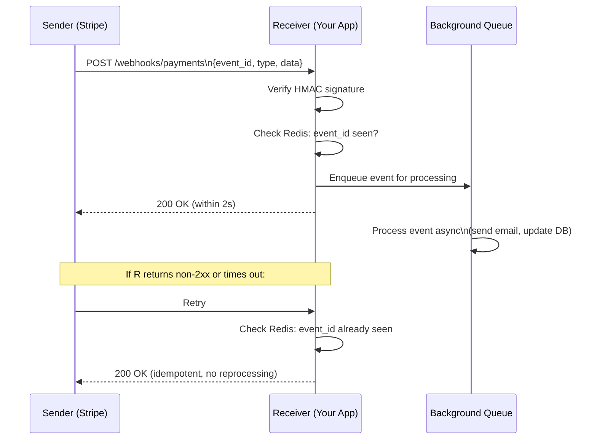

⚡ TL;DR - Webhooks are HTTP push notifications: instead
of polling an API for changes, the API calls your
endpoint when an event occurs; the sender POSTs a JSON
payload to a registered URL; the receiver must return
2xx within 5-30 seconds or the delivery is retried
with exponential backoff; HMAC-SHA256 signature
verification (using a shared secret) is mandatory to
prevent spoofed payloads; webhook consumers must be
idempotent because retries deliver the same event
multiple times.

---

| #047 | Category: HTTP & APIs | Difficulty: ★★★ |
|:---|:---|:---|
| **Depends on:** | REST API Design Principles, Idempotency in APIs | |
| **Used by:** | Long Polling vs SSE vs WebSocket, Event-Driven APIs | |
| **Related:** | Idempotency in APIs, Long Polling vs SSE vs WebSocket, Async Job Pattern, Event-Driven APIs | |

---

### 🔥 The Problem This Solves

**WORLD WITHOUT IT:**
An e-commerce platform needs to know when a payment
succeeds. Without webhooks: the platform polls Stripe
`GET /charges/{id}` every 2 seconds to check if the
payment status changed to "succeeded." For 10,000
concurrent payments: 10,000 × 30 requests/minute =
300,000 API requests/minute. Stripe's API would be
overwhelmed by polling. Response time is 2 seconds
worst case (polling interval). The platform wastes
resources constantly checking resources that have not
changed.

**THE BREAKING POINT:**
Polling is fundamentally inefficient for event-driven
state changes: most polls return "no change." The
slower the polling interval, the more stale the data.
The faster the interval, the more wasted requests.
Neither extreme is correct.

**THE INVENTION MOMENT:**
Jeff Lindsay coined "webhooks" in 2007: the API sends
an HTTP request to the consumer when an event occurs.
Stripe's implementation (2009) popularized the pattern
for payment events. Instead of the consumer asking
"did the payment succeed?" repeatedly, Stripe asks
"where should I notify you when a payment succeeds?"
- and calls that URL exactly once (well, with retries).

---

### 📘 Textbook Definition

A webhook is an HTTP callback: a registered endpoint
URL that receives POST requests from an event source
when specific events occur. **Components:** (1) sender
(event source) calls the consumer's URL with an event
payload; (2) receiver (consumer) processes the event
and returns 2xx; (3) retry logic with exponential
backoff on non-2xx or no response; (4) HMAC-SHA256
signature for authentication/integrity.
**HMAC signature:** sender computes `HMAC-SHA256(secret,
payload_bytes)` and sends as header (`Stripe-Signature`,
`X-Hub-Signature-256`). Receiver recomputes HMAC and
compares. Rejects if mismatch.
**Delivery guarantees:** at-least-once delivery
(retries mean duplicates are possible; consumers must
be idempotent). **Dead letter:** after N retries (or
time window, e.g., 72 hours), event is placed in dead
letter queue or marked failed; sender notifies
consumer.
**Event envelope:** `{event_type, event_id, created_at,
data: {...}}`. Consumer de-duplicates on `event_id`.

---

### ⏱️ Understand It in 30 Seconds

**One line:**
Webhooks invert polling: instead of you asking "did
anything change?" repeatedly, the API tells you "this
happened" exactly when it does.

**One analogy:**
> Email notification vs checking your mailbox every
> 5 minutes. Polling = walk to the mailbox every 5
> minutes and check (wastes time, misses nothing for
> ≤5 minutes). Webhook = the mail carrier rings your
> doorbell when a letter arrives. You act immediately.
> But if you are not home (endpoint down), the mail
> carrier tries again later (retry with backoff).
> You need to make sure you do not process the same
> letter twice if they ring twice (idempotency).

**One insight:**
Webhook reliability is fundamentally asymmetric: the
sender controls delivery attempts, but the receiver
controls processing time and success. The receiver
returning 200 within 5 seconds is the critical contract.
If processing takes 30 seconds, the receiver must
acknowledge the webhook immediately (200 OK) and process
asynchronously in a queue. Never block the webhook
handler on long processing.

---

### 🔩 First Principles Explanation

**HMAC signature generation (sender side - Stripe model):**

```python
import hmac
import hashlib
import time
import json

def sign_webhook_payload(
    payload: dict,
    secret: str,
    timestamp: int = None
) -> tuple[str, str]:
    """Generate HMAC-SHA256 webhook signature."""
    if timestamp is None:
        timestamp = int(time.time())

    payload_bytes = json.dumps(
        payload, separators=(",", ":")
    ).encode("utf-8")

    # Stripe format: "timestamp.payload_bytes"
    signed_content = f"{timestamp}.".encode() + payload_bytes

    signature = hmac.new(
        key=secret.encode("utf-8"),
        msg=signed_content,
        digestmod=hashlib.sha256
    ).hexdigest()

    # Header: "t=timestamp,v1=signature"
    header = f"t={timestamp},v1={signature}"
    return header, payload_bytes.decode()
```

**HMAC verification (receiver side):**

```python
import hmac
import hashlib
import time
import json
from fastapi import FastAPI, Request, HTTPException, Header
from typing import Optional

WEBHOOK_SECRET = "whsec_your_secret_here"
TOLERANCE_SECONDS = 300  # 5 minutes: reject old payloads

app = FastAPI()

def verify_webhook_signature(
    payload_bytes: bytes,
    signature_header: str,
    secret: str
) -> bool:
    """Verify HMAC-SHA256 webhook signature."""
    try:
        parts = {
            k: v
            for k, v in (
                part.split("=", 1)
                for part in signature_header.split(",")
            )
        }
        timestamp = int(parts.get("t", 0))
        expected_sig = parts.get("v1", "")
    except (ValueError, KeyError):
        return False

    # Replay attack prevention: reject old webhooks
    age = abs(int(time.time()) - timestamp)
    if age > TOLERANCE_SECONDS:
        return False

    signed_content = f"{timestamp}.".encode() + payload_bytes
    computed_sig = hmac.new(
        key=secret.encode("utf-8"),
        msg=signed_content,
        digestmod=hashlib.sha256
    ).hexdigest()

    # Use constant-time comparison to prevent timing attacks
    return hmac.compare_digest(computed_sig, expected_sig)

@app.post("/webhooks/payments")
async def handle_payment_webhook(
    request: Request,
    stripe_signature: Optional[str] = Header(None)
):
    payload_bytes = await request.body()

    if not stripe_signature or not verify_webhook_signature(
        payload_bytes, stripe_signature, WEBHOOK_SECRET
    ):
        raise HTTPException(status_code=401, detail="Invalid signature")

    event = json.loads(payload_bytes)
    event_id = event.get("id")
    event_type = event.get("type")

    # Idempotency check: process each event_id only once
    if redis.sismember("processed_webhook_ids", event_id):
        # Already processed (retry delivery)
        return {"status": "already_processed"}

    # Acknowledge immediately; process async
    background_tasks.add_task(
        process_event, event_type, event
    )
    redis.sadd("processed_webhook_ids", event_id)
    redis.expire("processed_webhook_ids", 86400 * 7)

    # Return 200 FAST (within 5s) to avoid retry
    return {"status": "accepted"}
```

---

### 🧪 Thought Experiment

**SCENARIO: Webhook delivery and idempotency**

Stripe sends `payment.succeeded` webhook. Your endpoint
takes 8 seconds to process (sends email + updates DB).
Stripe's timeout is 5 seconds. Stripe retries.

**Timeline:**
```
T+0:   Stripe → POST /webhooks/payments
T+5:   Stripe timeout (no 200 received)
T+7:   Your processing completes (too late)
T+10:  Stripe retry #1 → POST /webhooks/payments (again)
T+10:  Your endpoint: receives SAME event_id
```

**Without idempotency:**
Second delivery triggers another email sent + another
DB update = duplicate email, double credit to account.

**With idempotency:**
```python
event_id = event["id"]
if redis.sismember("processed_webhook_ids", event_id):
    return {"status": "already_processed"}  # 200 OK, no processing
```

Second delivery hits the Redis check: event_id already
processed → return 200 immediately, no duplicate action.

**Fix for the root problem:**
Acknowledge the webhook within 1-2 seconds by queuing
the work. Let a background worker handle the heavy
processing.

---

### 🧠 Mental Model / Analogy

> HMAC webhook signatures work like a sealed envelope
> with a wax seal. The sender puts the message inside
> and seals it with their unique wax (HMAC computed
> with shared secret). Anyone can deliver the envelope
> (network hops), but when you receive it, you check
> the seal: if the wax seal matches what YOUR copy of
> the signet ring would produce, the content is authentic
> and unmodified. If someone tampered with the envelope
> content in transit, the wax seal no longer matches.
> `hmac.compare_digest` is the "check the seal" step -
> done in constant time to prevent timing attacks.

---

### 📶 Gradual Depth - Five Levels

**Level 1 - What it is (anyone can understand):**
Instead of constantly asking "did the payment succeed?",
you tell Stripe "call this URL when payment succeeds."
Stripe calls your URL with the payment details as
soon as it happens. You process it and say "OK" (200).
No more polling.

**Level 2 - How to use it (junior developer):**
Register your endpoint URL with the webhook provider.
Create a POST endpoint that receives JSON events.
Return 200 within 5-30 seconds. Process event
asynchronously if it takes longer. Verify the HMAC
signature to reject fake requests.

**Level 3 - How it works (mid-level engineer):**
Webhook handler: (1) verify HMAC signature immediately
(reject with 401 if invalid); (2) check idempotency
(event_id in Redis cache); (3) queue the event for
async processing; (4) return 200 within 2 seconds.
Background worker processes the queued event. This
pattern ensures fast acknowledgment (prevents retries)
and reliable processing (queued, retryable).

**Level 4 - Why it was designed this way (senior/staff):**
The 5-second timeout is not arbitrary. At scale, a
webhook sender has millions of events in the delivery
queue. If a consumer is slow (takes 30s each), the
sender's delivery workers are blocked waiting for
responses. The short timeout with retry prevents one
slow consumer from blocking the delivery queue.
Consumers must acknowledge fast and process async -
this is a system-level design constraint, not a
suggestion.

**Level 5 - Mastery (distinguished engineer):**
Webhook reliability at scale: the sender needs delivery
guarantees (at-least-once) without overwhelming the
receiver. Production patterns: (1) exponential backoff
with jitter (retry at 1s, 2s, 4s, 8s... + random
jitter to prevent thundering herd after a receiver
outage). (2) Dead letter queue: after 72 hours or
N retries, move to DLQ, alert consumer team. (3)
Webhook deliverability scoring: track delivery success
rate per consumer URL; auto-disable if success rate
drops below 20% (receiver is consistently down). (4)
Replay API: `POST /events/{id}/retry` allows consumer
to request re-delivery of a specific event after fixing
their endpoint. Stripe provides all these features.

---

### ⚙️ How It Works (Mechanism)

**Webhook sender with retry queue:**

```python
import asyncio
import httpx
from dataclasses import dataclass
from typing import Optional

@dataclass
class WebhookDelivery:
    event_id: str
    consumer_url: str
    payload: dict
    attempt: int = 0
    max_attempts: int = 10

BACKOFF_SECONDS = [1, 2, 4, 8, 16, 32, 64, 128, 256, 512]

async def deliver_webhook(delivery: WebhookDelivery):
    """Deliver webhook with retry and backoff."""
    for attempt in range(delivery.max_attempts):
        try:
            payload_bytes = json.dumps(
                delivery.payload,
                separators=(",", ":")
            ).encode()
            sig_header, _ = sign_webhook_payload(
                delivery.payload, SENDER_SECRET
            )
            async with httpx.AsyncClient() as client:
                response = await client.post(
                    delivery.consumer_url,
                    content=payload_bytes,
                    headers={
                        "Content-Type": "application/json",
                        "Stripe-Signature": sig_header,
                        "X-Webhook-ID": delivery.event_id,
                    },
                    timeout=5.0  # 5s timeout
                )
            if response.status_code < 300:
                db.mark_delivered(delivery.event_id)
                return  # Delivery succeeded
            # 4xx/5xx → retry
        except (httpx.TimeoutException, httpx.ConnectError):
            pass  # Network error → retry

        if attempt < delivery.max_attempts - 1:
            backoff = BACKOFF_SECONDS[attempt]
            await asyncio.sleep(backoff)

    # Exhausted retries → dead letter
    db.mark_failed(delivery.event_id)
    alert_consumer_team(delivery.consumer_url)
```



---

### 🔄 The Complete Picture - End-to-End Flow

**Webhook registration (provider side):**

```python
@app.post("/webhooks")
async def register_webhook(
    body: WebhookRegistrationRequest,
    user_id: int = Depends(get_current_user)
):
    """Register a webhook endpoint for this user."""
    # Validate URL reachability (send test event)
    challenge = secrets.token_hex(16)
    test_response = httpx.post(
        body.url,
        json={"type": "webhook.test", "challenge": challenge},
        timeout=5.0
    )
    if test_response.status_code != 200:
        raise HTTPException(
            400, "Webhook URL unreachable or returned non-200"
        )

    # Generate unique secret for this webhook
    webhook_secret = f"whsec_{secrets.token_hex(32)}"

    webhook = db.create_webhook(
        user_id=user_id,
        url=body.url,
        events=body.events,
        secret=webhook_secret
    )

    # Return secret once - consumer must save it
    return {
        "id": webhook.id,
        "secret": webhook_secret,  # Show only at creation
        "events": body.events
    }
```

---

### 💻 Code Example

**Example 1 - BAD: No signature verification (spoofing risk)**

```python
# BAD: No signature check - anyone can POST fake events
@app.post("/webhooks/payments")
async def handle_payment(request: Request):
    event = await request.json()
    # Anyone can send: {"type": "payment.succeeded",
    #                   "data": {"amount": 999999}}
    # No way to verify this is actually from Stripe
    process_payment(event)  # DANGEROUS
    return {"status": "ok"}

# GOOD: Verify HMAC signature before processing
@app.post("/webhooks/payments")
async def handle_payment(
    request: Request,
    stripe_signature: str = Header(...)
):
    payload_bytes = await request.body()
    if not verify_webhook_signature(
        payload_bytes, stripe_signature, WEBHOOK_SECRET
    ):
        raise HTTPException(401, "Invalid signature")
    event = json.loads(payload_bytes)
    process_payment(event)
    return {"status": "ok"}
```

---

**Example 2 - Constant-time comparison (prevent timing attack)**

```python
# BAD: Regular string comparison leaks timing info
# Attacker can probe signatures byte-by-byte
if computed_sig == provided_sig:  # TIMING LEAK!
    return True

# GOOD: Constant-time comparison
import hmac
if hmac.compare_digest(computed_sig, provided_sig):
    return True
```

---

### ⚖️ Comparison Table

| Approach | Latency | Server Load | Implementation | Best For |
|:---|:---|:---|:---|:---|
| Polling | High (poll interval) | High (wasted requests) | Simple | Legacy, no webhook support |
| Webhooks | Low (near-realtime) | Low (event-driven) | Medium | External API events |
| SSE | Low | Medium | Medium | Browser clients |
| WebSocket | Lowest | High | Complex | Bidirectional realtime |

---

### ⚠️ Common Misconceptions

| Misconception | Reality |
|:---|:---|
| Returning 200 means the event was processed | Webhook best practice: return 200 immediately on receipt acknowledgment. Processing happens asynchronously. The sender only knows "received" vs "not received." Whether the receiver correctly processed the event is the receiver's responsibility, invisible to the sender. |
| HMAC signature prevents replay attacks | HMAC proves authenticity (this payload was signed by someone who knows the secret) but does not prevent replay by itself. Add timestamp validation: reject payloads where `abs(now - timestamp) > 300 seconds`. A replayed valid signature with an old timestamp is rejected. |
| Webhooks guarantee exactly-once delivery | Webhooks provide at-least-once delivery. Network timeouts, non-2xx responses, and other transient failures cause retries. Consumers MUST be idempotent. Use `event_id` de-duplication. "Exactly-once" is a consumer responsibility, not a sender guarantee. |
| You need to process the event in the webhook handler | Never do heavy processing in the webhook handler. Acknowledge (200) within 2-5 seconds, queue the work, process async. Heavy processing in the handler causes timeouts, triggers retries, and creates duplicate processing. |

---

### 🚨 Failure Modes & Diagnosis

**Retry storm after receiver outage**

**Symptom:** Receiver was down for 2 hours. When it
comes back online, it is immediately overwhelmed by
all queued retry deliveries arriving simultaneously.
The receiver crashes again under the load.

**Root Cause:** All deliveries are retried at the same
time when the receiver recovers. No jitter in the retry
schedule.

**Fix (on sender):** Exponential backoff with jitter
(`backoff + random(0, backoff)`). Events spread out
over time rather than converging at the same retry
interval. Receiver sees gradual traffic increase rather
than spike.

**Fix (on receiver):** Add circuit breaker: if error
rate exceeds 50%, return 503 to signal "I'm overloaded"
instead of processing more events. Sender backs off.

---

**Webhook processing timeout causes duplicate action**

**Symptom:** Users receive duplicate payment confirmation
emails. Database shows duplicate order records.

**Root Cause:** Webhook handler calls the email service
(4 seconds) before returning 200. Sender timeout is
3 seconds. Sender retries. Both deliveries process the
event completely, sending 2 emails.

**Fix:** (1) Return 200 within 1 second (acknowledge
then queue). (2) Add idempotency check before processing:
`if redis.sismember("processed", event_id): return`.
(3) Process events in background worker (separate
process from the webhook HTTP server).

---

### 🔗 Related Keywords

**Prerequisites (understand these first):**
- `REST API Design Principles` - webhook is HTTP push
- `Idempotency in APIs` - webhooks require idempotent
  consumers

**Builds On This (learn these next):**
- `Long Polling vs SSE vs WebSocket` - alternative
  event delivery mechanisms
- `Event-Driven APIs` - webhooks as a component of
  event-driven architecture

---

### 📌 Quick Reference Card

```
┌──────────────────────────────────────────────────────────┐
│ WHAT IT IS   │ HTTP push: API calls your endpoint when  │
│              │ events occur (inverted polling)           │
├──────────────┼───────────────────────────────────────────┤
│ SECURITY     │ Verify HMAC-SHA256 signature + timestamp  │
│              │ (replay protection). Use compare_digest.  │
├──────────────┼───────────────────────────────────────────┤
│ RELIABILITY  │ At-least-once delivery: implement         │
│              │ idempotency using event_id in Redis        │
├──────────────┼───────────────────────────────────────────┤
│ SPEED        │ Return 200 within 2-5s; queue async;      │
│              │ never process in webhook handler          │
├──────────────┼───────────────────────────────────────────┤
│ RETRY        │ Exponential backoff + jitter; dead letter │
│              │ after 72h; replay API for recovery        │
├──────────────┼───────────────────────────────────────────┤
│ ONE-LINER    │ "API calls you when things happen;        │
│              │ verify signature, ack fast, queue work"   │
└──────────────────────────────────────────────────────────┘
```

**If you remember only 3 things:**
1. Always verify the HMAC signature. Without it, anyone
   can POST fake events to your webhook endpoint.
   Use `hmac.compare_digest` (constant-time comparison).
2. Return 200 within 2-5 seconds. Queue the work async.
   Slow handlers cause retries, which cause duplicates.
   Acknowledge first, process later.
3. Webhooks are at-least-once. Implement idempotency
   with `event_id` de-duplication (Redis SET or DB
   unique constraint). Retries will happen.

---

### 💎 Transferable Wisdom

**Reusable Engineering Principle:**
"Push beats poll in event-driven systems." Webhooks
apply the observer pattern at the HTTP protocol level.
This appears as: Kafka consumer groups (broker pushes
records to consumers instead of consumers polling
one-by-one per record); Redis keyspace notifications
(push on key expiry instead of polling for TTL); OS
inotify (kernel pushes file change events to processes
instead of polling). The pattern: register interest
in events; receive notification when events occur;
eliminate wasted cycles checking for non-events.

**Where else this pattern applies:**
- Kafka push model: consumer receives messages rather
  than polling (though internally Kafka uses long-poll,
  not true push)
- Database triggers: DB pushes to application on row
  change (instead of application polling for changes)
- WebSocket subscriptions: server pushes state changes
  to connected clients (real-time equivalent of webhooks)

---

### 💡 The Surprising Truth

Stripe's webhook delivery system processes billions
of events per year and has evolved several non-obvious
design constraints. One of the most surprising: Stripe
deliberately does NOT guarantee ordering of webhook
events. A `payment.updated` event may arrive before
the `payment.created` event (different delivery workers,
network variance). Every Stripe consumer must handle
out-of-order events. Best practice: use event timestamps
(not delivery order) to determine current state. If
a `payment.updated` arrives before `payment.created`,
upsert using the event data rather than assuming a
record exists. This out-of-order delivery is a property
of at-least-once delivery systems that most engineers
discover in production, not documentation.

---

### ✅ Mastery Checklist

**You've mastered this when you can:**
1. **IMPLEMENT** A webhook receiver that verifies
   HMAC-SHA256 signature with timestamp validation
   (replay protection) and returns 200 within 2 seconds.
2. **ADD** Event ID idempotency using Redis `SISMEMBER`
   before processing, with 7-day TTL.
3. **EXPLAIN** Why `hmac.compare_digest` must be used
   instead of `==` for signature comparison.
4. **DESIGN** A webhook sender with exponential backoff
   + jitter retry strategy and dead letter queue.
5. **DEBUG** A duplicate-processing issue caused by
   webhook handler timeout triggering retry.

---

### 🎯 Interview Deep-Dive

**Q1: How do you secure a webhook endpoint against
spoofed payloads?**

*Why they ask:* Security + webhook architecture.

*Strong answer includes:*
- HMAC-SHA256 signature: sender computes `HMAC(shared_
  secret, payload)` and sends as a header (`Stripe-
  Signature`, `X-Hub-Signature-256`). Receiver recomputes
  and compares.
- Constant-time comparison: use `hmac.compare_digest`
  instead of `==`. String comparison short-circuits on
  first mismatch, leaking timing information. Attacker
  can probe byte by byte to discover signature. Constant-
  time comparison always takes the same time regardless
  of where the mismatch occurs.
- Replay attack prevention: include timestamp in signed
  content. Receiver rejects payloads where timestamp
  age exceeds 5 minutes (`abs(now - ts) > 300`). A
  captured valid signature cannot be replayed after
  the tolerance window.
- Secret per consumer: each registered webhook gets a
  unique secret. If one consumer's secret is compromised,
  other consumers are unaffected. Rotate secrets
  independently.

**Q2: Why are webhook consumers required to be
idempotent?**

*Why they ask:* Tests at-least-once delivery understanding.

*Strong answer includes:*
- Webhook senders guarantee at-least-once delivery.
  Network timeouts, temporary receiver unavailability,
  and non-2xx responses all trigger retries.
- The same event (same `event_id`) may be delivered
  2, 3, or more times. If the receiver processes each
  delivery independently (sends email per delivery,
  creates record per delivery), duplicates result.
- Implementation: before processing, check if `event_id`
  was already processed. Use Redis `SISMEMBER` (fast,
  ~1ms). If seen: return 200 immediately (acknowledge,
  no processing). If not seen: process, then add to
  Redis set.
- TTL on the set: keep event IDs for 7-14 days (covers
  the retry window). After that, duplicates are unlikely
  and the storage cost of keeping IDs forever is not
  justified.
- Important: the order of operations matters: check
  BEFORE processing (not after). "Process then mark"
  risks a crash after processing but before marking,
  causing reprocessing on retry.

**Q3: A webhook handler is timing out and causing
duplicate event processing. How do you fix this?**

*Why they ask:* Tests production debugging and async
design.

*Strong answer includes:*
- Root cause: webhook handler is performing heavy work
  (database writes, API calls, email sending) before
  returning 200. This takes >5 seconds, causing sender
  timeout and retry.
- Immediate fix: restructure handler to: (1) verify
  HMAC signature (fast, ~1ms); (2) check event_id
  idempotency (Redis, ~2ms); (3) enqueue event in task
  queue (Celery, Redis Queue, SQS) (~5ms); (4) mark
  event_id as "processing" in Redis; (5) return 200.
  Total: <20ms. No timeout risk.
- Background worker: dequeue from task queue; perform
  heavy processing; mark event_id "processed" in Redis.
  If worker crashes before completing, event is
  requeued; the "processing" Redis key (with TTL)
  expires, allowing retry.
- The event_id idempotency check prevents duplicates
  for properly ordered retries. The Redis key TTL
  handles rare crash-mid-processing scenarios.
- Result: webhook handler always responds in <100ms.
  Sender never times out. No retries triggered by
  processing delay.
