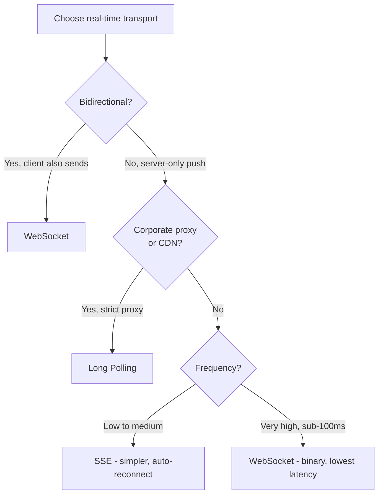

⚡ TL;DR - Three patterns for real-time data from
server to client: Long Polling (client sends request,
server holds it until data is ready - HTTP, simple,
high overhead); SSE (one long-lived HTTP connection,
server streams text events, auto-reconnect, HTTP/2
friendly, unidirectional); WebSocket (full-duplex
binary/text protocol over a single TCP connection,
lowest latency, highest complexity, requires Redis
Pub/Sub for horizontal scaling); choose based on
direction (server-only push → SSE; bidirectional →
WebSocket) and CDN/proxy requirements (long polling
is safest through corporate firewalls).

---

| #048 | Category: HTTP & APIs | Difficulty: ★★★ |
|:---|:---|:---|
| **Depends on:** | WebSocket Basics, Server-Sent Events (SSE), Webhook Design | |
| **Used by:** | Event-Driven APIs | |
| **Related:** | WebSocket Basics, Server-Sent Events, Webhook Design, Event-Driven APIs | |

---

### 🔥 The Problem This Solves

**WORLD WITHOUT IT:**
A dashboard shows live order tracking. Without real-time
transport, the only option is: `setInterval(() =>
fetchOrders(), 5000)` - polling every 5 seconds.
Problems: (1) latency: updates are up to 5 seconds
stale; (2) wasted requests: 95% of polls return "no
change"; (3) thundering herd: 10,000 clients polling
simultaneously → 10,000 requests/5s = 2,000 req/s
with mostly empty responses.

**THE BREAKING POINT:**
For financial trading, live sports scores, or
collaborative editing, 5-second polling is unusable.
Sub-second updates are required. Polling with 100ms
interval: 10,000 clients × 10 req/s = 100,000 req/s
of empty responses. The polling approach does not
scale to realtime requirements.

**THE INVENTION MOMENT:**
Long polling (2000s): hold the HTTP request open until
data arrives. SSE (HTML5, 2009): standardized server-
to-browser event streaming over HTTP. WebSocket
(RFC 6455, 2011): full-duplex protocol designed
explicitly for low-latency bidirectional communication.
Three different solutions, each with a different
complexity/capability trade-off.

---

### 📘 Textbook Definition

**Long Polling:** client sends HTTP request; server
holds it until data is available (or timeout); server
responds; client immediately sends next request.
Simulates push with standard HTTP. **Server-Sent Events
(SSE):** client opens one HTTP GET connection; server
keeps it open and streams `data: ...\n\n` events.
`EventSource` API handles reconnect automatically using
`Last-Event-ID` header. Unidirectional (server → client).
**WebSocket:** HTTP Upgrade request (101 Switching
Protocols); then full-duplex binary/text framing over
the same TCP connection. Bidirectional (both parties
send at any time). Lower latency than SSE for high-
frequency updates (no HTTP overhead per message).
**Key dimensions:** direction (unidirectional vs
bidirectional); protocol (HTTP vs WebSocket); browser
support; proxy/CDN compatibility; auto-reconnect;
message types (text vs binary).

---

### ⏱️ Understand It in 30 Seconds

**One line:**
Long polling fakes push with repeated HTTP requests;
SSE is a one-way live stream over HTTP; WebSocket is
a full telephone call (both can talk at any time).

**One analogy:**
> Restaurant order tracking. Long polling: you go to
> the counter every 5 minutes and ask "is my order
> ready?" SSE: the restaurant PA system announces
> your name when your order is ready (one-way, no
> response needed). WebSocket: the restaurant gives
> you a walkie-talkie to communicate directly with the
> kitchen (both can talk, any time). Choose based on
> whether you need to talk back.

**One insight:**
The correct choice is almost always SSE unless you
need bidirectional communication. SSE uses standard
HTTP (works through every proxy and CDN), has built-in
auto-reconnect, scales horizontally with Redis Pub/Sub,
and is supported natively by all modern browsers.
WebSocket adds complexity (stateful connections, custom
reconnect logic, proxy issues) that is only justified
when the client must also send frequent messages to
the server (collaborative editing, gaming, trading).

---

### 🔩 First Principles Explanation

**Side-by-side protocol comparison:**

```
LONG POLLING:
Client → GET /events?since=timestamp
Server holds request (30s timeout)
Server → 200 OK {"events": [...]}  (when data arrives)
Client → GET /events?since=new_timestamp  (immediately)
Repeat forever.

SSE:
Client → GET /events
         Accept: text/event-stream
Server → 200 OK
         Content-Type: text/event-stream

         id: 1
         event: order_update
         data: {"order_id": "123", "status": "SHIPPED"}

         id: 2
         data: {"order_id": "456", "status": "DELIVERED"}

         [connection stays open, server sends when ready]

WEBSOCKET:
Client → GET /ws HTTP/1.1
         Upgrade: websocket
         Connection: Upgrade
         Sec-WebSocket-Key: dGhlIHNhbXBsZSBub25jZQ==
Server → 101 Switching Protocols
         Upgrade: websocket
         Sec-WebSocket-Accept: ...
         [TCP connection upgraded to WebSocket]
Client → {text frame: "subscribe:orders:123"}
Server → {text frame: {"order": "123", "status": "SHIPPED"}}
Server → {text frame: {"order": "456", "status": "DELIVERED"}}
Client → {text frame: "ping"}
Server → {text frame: "pong"}
[both can send at any time]
```

---

### 🧪 Thought Experiment

**SCENARIO: Choose transport for three products**

**Product A: Live delivery tracking**
- Only server pushes location updates to client
- Works on mobile browsers (Safari has strict cookie
  handling)
- Must work through corporate HTTP proxies

**Winner: SSE**
- Unidirectional (server → client): SSE fits perfectly
- HTTP (works through proxies): SSE on HTTP/2 doesn't
  hit 6-connection browser limit
- Mobile-friendly: `EventSource` is well-supported

**Product B: Live collaborative code editor**
- Client sends keystrokes; server broadcasts to other clients
- Sub-100ms latency required
- Desktop web app (no proxy concerns)

**Winner: WebSocket**
- Bidirectional: client sends edits, server broadcasts
- Sub-100ms: no HTTP overhead per message
- Single TCP connection eliminates HOL blocking

**Product C: REST API polling replacement for a legacy
enterprise system (only HTTPS port open, strict proxy)**

**Winner: Long polling**
- SSE may be blocked by HTTP proxies (buffering strips
  `data:` format)
- WebSocket may be blocked (non-standard port or
  Upgrade rejected)
- Long polling is plain HTTP GET: always works through
  any proxy

---

### 🧠 Mental Model / Analogy

> The three patterns map to three telephone systems.
> Long polling = the telegraph: you send a message
> and wait for a response (one exchange at a time,
> high overhead). SSE = AM radio broadcast: the station
> (server) transmits continuously; you (client) tune
> in and receive; you cannot talk back over the same
> channel. WebSocket = full telephone call: real-time
> voice in both directions, continuous connection,
> lowest latency of the three.

---

### 📶 Gradual Depth - Five Levels

**Level 1 - What it is (anyone can understand):**
Three ways to get live updates in a web app. Long
polling: keep asking "any news?" until there is news.
SSE: subscribe to a live feed (like a news ticker).
WebSocket: open a two-way conversation (like a phone
call). Each has different complexity and use cases.

**Level 2 - How to use it (junior developer):**
Long polling: server-side timeout (30s), return empty
204 on timeout; client immediately re-polls. SSE: return
`text/event-stream`, send `data: ...\n\n` format, set
`X-Accel-Buffering: no` for Nginx. WebSocket: use
`fastapi-websocket` or `socket.io`; handle connect/
disconnect events.

**Level 3 - How it works (mid-level engineer):**
Long polling holds the request in a server-side async
context (asyncio wait) or message queue. SSE uses
chunked transfer encoding over a persistent HTTP
connection. WebSocket upgrades TCP connection to
the WebSocket binary framing protocol. All three
require sticky sessions or distributed pub/sub for
multi-server deployments.

**Level 4 - Why it was designed this way (senior/staff):**
SSE's HTTP design enables CDN caching of the connection
setup and header, and HTTP/2 multiplexing resolves
the 6-connection browser limit. WebSocket cannot be
multiplexed by standard CDN load balancers (each
WebSocket is a stateful connection to one server).
This is why large-scale real-time systems (Slack,
Discord) use WebSocket for messaging but rely on Redis
Pub/Sub and sticky sessions for horizontal scaling.

**Level 5 - Mastery (distinguished engineer):**
At 100,000 concurrent connections: each WebSocket
connection is a stateful file descriptor. Linux default
`ulimit -n 1024` (open files) means one server instance
can hold 1024 WebSocket connections. For 100K: raise
`ulimit` to 100K+, tune `net.core.somaxconn` and
`net.ipv4.tcp_tw_reuse`, use efficient async event loop
(uvicorn/asyncio handles 50K+ WebSocket connections
per instance with proper tuning). SSE has the same
scaling requirement but benefits from HTTP/2 stream
multiplexing over one TCP connection per browser tab
(reducing file descriptor pressure).

---

### ⚙️ How It Works (Mechanism)

**All three in FastAPI:**

```python
from fastapi import FastAPI, WebSocket
from fastapi.responses import StreamingResponse
import asyncio
import json

app = FastAPI()

# --- LONG POLLING ---
@app.get("/events/poll")
async def long_poll(since: str = "0"):
    """Hold until event arrives or 30s timeout."""
    start = asyncio.get_event_loop().time()
    while True:
        events = await get_events_since(since)
        if events:
            return {"events": events}
        if asyncio.get_event_loop().time() - start > 28:
            return {"events": []}  # Timeout → empty
        await asyncio.sleep(0.5)  # Check every 0.5s

# --- SSE ---
@app.get("/events/stream")
async def sse_stream(request: Request, user_id: int):
    """Stream SSE events."""
    async def event_generator():
        event_id = 0
        async for event in subscribe_to_events(user_id):
            if await request.is_disconnected():
                break
            event_id += 1
            yield f"id: {event_id}\n"
            yield f"event: {event['type']}\n"
            yield f"data: {json.dumps(event['data'])}\n\n"

    return StreamingResponse(
        event_generator(),
        media_type="text/event-stream",
        headers={
            "Cache-Control": "no-cache",
            "X-Accel-Buffering": "no",  # Nginx: disable buffering
        }
    )

# --- WEBSOCKET ---
@app.websocket("/ws/{user_id}")
async def websocket_endpoint(
    ws: WebSocket, user_id: int
):
    await ws.accept()
    # Subscribe to user's events via Redis Pub/Sub
    pubsub = redis.pubsub()
    await pubsub.subscribe(f"user:{user_id}:events")

    try:
        async def receive_messages():
            async for message in pubsub.listen():
                if message["type"] == "message":
                    await ws.send_text(message["data"])

        async def send_messages():
            while True:
                data = await ws.receive_text()
                await handle_client_message(user_id, data)

        # Run both directions concurrently
        await asyncio.gather(
            receive_messages(), send_messages()
        )
    except Exception:
        pass
    finally:
        await pubsub.unsubscribe()
        await ws.close()
```



---

### 🔄 The Complete Picture - End-to-End Flow

**Horizontal scaling for all three:**

```
LONG POLLING: stateless → any instance handles next poll
  No sticky sessions needed
  DB/Redis queried per long-poll request

SSE: stateful connection → sticky sessions needed
  OR: server subscribes to Redis Pub/Sub channel
  Any server instance can handle fan-out
  Redis Pub/Sub → server sends to connected clients

WEBSOCKET: stateful connection → sticky sessions needed
  Redis Pub/Sub (same as SSE)
  Each server manages its own connected WS clients
  Redis → broadcast to all server instances
  → each instance sends to its local connections
```

---

### 💻 Code Example

**Example 1 - BAD: Long polling with busy-wait**

```python
# BAD: Tight loop burns CPU
@app.get("/events/poll")
async def bad_long_poll():
    while True:
        events = check_events()
        if events:
            return events
        time.sleep(0.01)  # 10ms sleep: still 100 checks/s

# GOOD: Async wait with exponential sleep
@app.get("/events/poll")
async def good_long_poll():
    for sleep_time in [0.1, 0.2, 0.5, 1, 2, 5]:
        events = await check_events_async()
        if events:
            return {"events": events}
        await asyncio.sleep(sleep_time)
    return {"events": []}  # 30s total timeout
```

---

**Example 2 - SSE keepalive to prevent proxy timeout**

```python
async def event_generator_with_keepalive():
    last_keepalive = time.time()
    async for event in event_source():
        yield f"data: {json.dumps(event)}\n\n"
        last_keepalive = time.time()

        # Keepalive every 15s prevents proxy timeout
        while time.time() - last_keepalive > 15:
            yield ": keepalive\n\n"  # Comment line
            last_keepalive = time.time()
```

---

### ⚖️ Comparison Table

| Feature | Long Polling | SSE | WebSocket |
|:---|:---|:---|:---|
| Direction | Server → Client | Server → Client | Bidirectional |
| Protocol | HTTP | HTTP | TCP (after upgrade) |
| Auto-reconnect | Client code | Built-in (EventSource) | Client code |
| Proxy/CDN friendly | Yes (plain HTTP GET) | Usually (some proxies buffer) | Sometimes (may block Upgrade) |
| HTTP/2 compatible | Yes | Yes (multiple streams) | No (separate connection) |
| Binary messages | No (JSON in body) | No (text only) | Yes |
| Per-message overhead | High (new request) | Low (HTTP headers once) | Lowest (frame headers ~2-10 bytes) |
| Horizontal scaling | Stateless (easy) | Redis Pub/Sub | Redis Pub/Sub + sticky sessions |

---

### ⚠️ Common Misconceptions

| Misconception | Reality |
|:---|:---|
| WebSocket always has lower latency than SSE | For low-frequency events (1-10 per second), SSE and WebSocket are equivalent. WebSocket's advantage appears only at very high frequency (100+ messages/second) where HTTP header overhead per event becomes significant. |
| SSE does not work through corporate HTTP proxies | Some aggressive HTTP proxies buffer the response until the connection closes, breaking SSE. Fix: use HTTPS (TLS prevents proxy buffering), add `X-Accel-Buffering: no` for Nginx, and test your target network environment. For guaranteed proxy compatibility: use long polling. |
| Long polling is just slow polling | Long polling holds the request at the server until data is ready (or timeout). The latency is near-realtime (milliseconds after data is ready). The inefficiency is the new request overhead after each response, not the hold time. |
| WebSocket connections last forever | WebSocket connections die on server restart, network change (mobile switching from WiFi to 4G), idle timeout (NAT, load balancer). Applications must implement reconnect logic with exponential backoff. SSE's `EventSource` handles this automatically. |

---

### 🚨 Failure Modes & Diagnosis

**SSE buffered by Nginx (events delayed until disconnect)**

**Symptom:** SSE events appear in the browser only
when the connection closes (e.g., server restart).
All events arrive in bulk, not streamed.

**Root Cause:** Nginx is buffering the SSE response
body (default behavior). Events are queued in Nginx's
buffer and only flushed when the response completes.

**Fix:**
```nginx
location /events/stream {
    proxy_pass http://backend;
    proxy_buffering off;                    # Disable buffering
    proxy_set_header X-Accel-Buffering no;  # Signal to upstream
    proxy_cache off;
    proxy_read_timeout 3600s;  # Keep alive 1 hour
}
```
Or from the application response header:
`X-Accel-Buffering: no`

---

**WebSocket connection drops on load balancer timeout**

**Symptom:** WebSocket connections drop every 60
seconds with no errors. Reconnects immediately. Pattern
suggests load balancer idle timeout.

**Root Cause:** AWS ALB default idle timeout is 60
seconds. An idle WebSocket connection (no messages
for 60s) is terminated by the ALB.

**Fix:** (1) WebSocket ping/pong every 25 seconds
(server-initiated): prevents idle timeout. (2) Increase
ALB idle timeout to 3600s for WebSocket target groups.
(3) Client-side reconnect on close: exponential backoff
with max 30s between retries.

---

### 🔗 Related Keywords

**Prerequisites (understand these first):**
- `WebSocket Basics` - WebSocket protocol
- `Server-Sent Events (SSE)` - SSE protocol details
- `Webhook Design` - HTTP push pattern fundamentals

**Builds On This (learn these next):**
- `Event-Driven APIs` - webhooks/SSE/WebSocket as
  components of event-driven architecture

---

### 📌 Quick Reference Card

```
┌──────────────────────────────────────────────────────────┐
│ LONG POLL    │ Client holds HTTP request open; server    │
│              │ responds when data ready; client re-polls │
│              │ Use: proxy-friendly; legacy support       │
├──────────────┼───────────────────────────────────────────┤
│ SSE          │ Single HTTP connection; server streams    │
│              │ text/event-stream; built-in reconnect     │
│              │ Use: server-push to browser; notifications│
├──────────────┼───────────────────────────────────────────┤
│ WEBSOCKET    │ Full-duplex TCP; both sides send freely;  │
│              │ binary or text; Redis for horizontal scale│
│              │ Use: chat; collaborative; gaming; trading │
├──────────────┼───────────────────────────────────────────┤
│ DEFAULT      │ Start with SSE. Upgrade to WebSocket only │
│ CHOICE       │ when client-to-server messages are needed │
├──────────────┼───────────────────────────────────────────┤
│ ONE-LINER    │ "Poll=many requests; SSE=one stream;      │
│              │ WS=full duplex. SSE first, WS if needed"  │
└──────────────────────────────────────────────────────────┘
```

**If you remember only 3 things:**
1. SSE is the default for server-push. HTTP compatible,
   auto-reconnect, scales with Redis Pub/Sub. Use it
   unless you need client-to-server messages.
2. WebSocket needs explicit reconnect logic and Redis
   Pub/Sub for horizontal scaling. Justified only when
   bidirectional communication is required.
3. Long polling is the safe fallback for environments
   with strict HTTP proxies (enterprise, government).

---

### 💎 Transferable Wisdom

**Reusable Engineering Principle:**
"Match the protocol to the communication pattern."
Unidirectional data flow (server to client) maps to
SSE (HTTP stream). Bidirectional data flow maps to
WebSocket (full-duplex). This applies beyond HTTP:
Kafka topics (producer → consumer: unidirectional
stream); Redis Pub/Sub (publisher → subscribers:
broadcast stream); gRPC server streaming vs bidirectional
streaming RPC types reflect the same choices. Always
choose the simplest protocol that satisfies the
communication pattern.

**Where else this pattern applies:**
- gRPC streaming: server streaming (SSE equivalent)
  vs bidirectional streaming (WebSocket equivalent)
- Kafka: log stream (one direction); exactly-once
  semantics for guaranteed delivery (not needed in
  SSE/WS which are both best-effort)
- Redis Streams vs Pub/Sub: Streams persist (consumers
  can replay); Pub/Sub does not (fire and forget)

---

### 💡 The Surprising Truth

Slack uses WebSocket for all message delivery to
clients. However, Slack's WebSocket does not actually
carry message content - it carries lightweight event
notifications ("new message in channel X"). The client
then makes a REST API call to fetch the actual message
content. This hybrid design (WebSocket for realtime
signal, REST for content) keeps the WebSocket payload
small (reducing WebSocket server memory per connection),
enables REST response caching (identical message
content for multiple users), and allows the message
REST API to scale independently from the real-time
notification layer. WebSocket and REST are not mutually
exclusive; the best architectures combine them for
their respective strengths.

---

### ✅ Mastery Checklist

**You've mastered this when you can:**
1. **IMPLEMENT** All three patterns: long polling
   endpoint with 30s timeout, SSE streaming endpoint
   with keepalive, WebSocket endpoint with ping/pong.
2. **CHOOSE** The correct transport given direction
   (unidirectional vs bidirectional), proxy environment,
   and message frequency.
3. **SCALE** SSE and WebSocket to multiple server
   instances using Redis Pub/Sub with a concrete code
   example.
4. **FIX** SSE buffering in Nginx with correct proxy
   config and application headers.
5. **EXPLAIN** Why WebSocket connections require explicit
   reconnect logic while SSE's `EventSource` handles
   reconnect automatically.

---

### 🎯 Interview Deep-Dive

**Q1: How would you choose between SSE and WebSocket
for a real-time notification system?**

*Why they ask:* Tests real-time architecture judgment.

*Strong answer includes:*
- SSE for server-push only: if clients only receive
  notifications (no client-to-server messages), SSE
  is simpler: uses standard HTTP (CDN/proxy compatible),
  built-in `EventSource` reconnect, works with HTTP/2
  (multiple SSE streams per TCP connection), unidirectional.
- WebSocket for bidirectional: if clients also send
  messages frequently (typing indicators, message
  reactions, cursor position in collaborative editor),
  WebSocket eliminates per-message HTTP overhead and
  enables sub-50ms roundtrip.
- Hybrid: some systems use SSE for server-push and
  regular REST POST for client-to-server actions (Slack's
  approach). Works well when client-to-server events
  are infrequent and not latency-critical.
- Decision drivers: (1) Does the client need to send
  frequent messages back? → WebSocket. (2) Is this
  behind a corporate HTTP proxy? → SSE or long polling.
  (3) Is this a browser-to-CDN use case? → SSE (cacheable).

**Q2: How do you scale WebSocket connections to multiple
server instances?**

*Why they ask:* Tests distributed systems + real-time
architecture.

*Strong answer includes:*
- Problem: WebSocket is stateful. A message published
  by User A needs to reach User B, who may be connected
  to a different server instance.
- Solution: Redis Pub/Sub as the message fan-out layer.
  (1) User B connects to Server 2; Server 2 subscribes
  to Redis channel `user:B:events`. (2) User A publishes
  a message. Server 1 receives it; publishes to Redis
  `user:B:events`. (3) Server 2 receives Redis event;
  sends to User B's WebSocket connection.
  No direct Server 1 → Server 2 communication needed.
- Sticky sessions vs Redis: sticky sessions (load
  balancer routes each user to same server) reduce
  Redis calls but introduce hot spots (one user's server
  instance handles all their traffic). Redis Pub/Sub
  allows any server to handle any connection.
- Horizontal scaling: add server instances freely; all
  subscribe to Redis channels; Redis distributes the
  message to all subscribers.

**Q3: A user reports that their real-time notifications
stop working after exactly 60 seconds. What is the
likely cause and how do you fix it?**

*Why they ask:* Tests operational debugging.

*Strong answer includes:*
- Symptom: exactly 60 seconds is highly diagnostic.
  This matches AWS ALB/NLB default idle timeout (60
  seconds), Nginx proxy_read_timeout default, or HAProxy
  timeout.
- Cause: the connection (SSE or WebSocket) is idle for
  60 seconds (no messages), and the load balancer or
  proxy terminates the idle connection.
- Fix for WebSocket: server sends a ping frame every
  25 seconds. Client responds with pong. Load balancer
  sees activity, resets idle timer. Never reaches 60s
  idle.
- Fix for SSE: server sends `: keepalive\n\n` (SSE
  comment) every 15 seconds. HTTP body activity prevents
  proxy idle timeout.
- Fix at infrastructure level: increase AWS ALB idle
  timeout for WebSocket target group (`--idle-timeout
  3600`). Appropriate for WebSocket but may consume
  ALB resources for many idle connections.
- Fix in client: detect connection close, reconnect
  with exponential backoff. WebSocket `onclose` event
  + retry timer. SSE `EventSource` handles this
  automatically.
