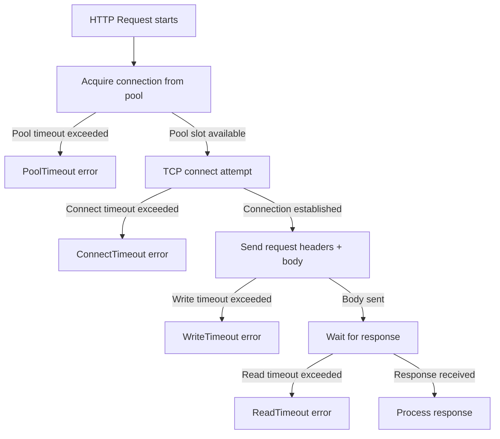

⚡ TL;DR - HTTP client timeouts have three distinct
types: connect timeout (time to establish TCP connection,
typically 1-5s), read timeout (time waiting for the
server to send response bytes after connection established,
typically 5-60s), write timeout (time to send request
body, typically 5-30s); missing timeouts cause thread/
connection pool exhaustion when a downstream service
hangs; the most dangerous missing timeout is read
timeout - a hung server keeps the connection open
forever, exhausting all connection pool slots.

---

| #049 | Category: HTTP & APIs | Difficulty: ★★★ |
|:---|:---|:---|
| **Depends on:** | HTTP Request/Response Cycle, TCP/IP Fundamentals | |
| **Used by:** | API Retry and Backoff Strategy, API Circuit Breaker Pattern | |
| **Related:** | HTTP Request/Response Cycle, API Retry and Backoff, API Circuit Breaker, HTTP Keep-Alive | |

---

### 🔥 The Problem This Solves

**WORLD WITHOUT IT:**
Python service calls Payments Service with `requests.get(url)`.
No timeout specified. Payments Service has a database
deadlock and hangs. The Python service's `requests.get`
call hangs indefinitely. One by one, all thread pool
workers are blocked waiting for the hung payment call.
Thread pool exhausted → new requests queue up → queue
fills → incoming requests receive 503 immediately.
The entire service is down because one downstream
service is slow.

**THE BREAKING POINT:**
This is the cascading failure pattern: one slow service
hangs all threads in the caller, which then hangs all
callers of the caller. The entire service mesh freezes
in a matter of seconds. The upstream services receive
no responses and time out themselves. A single hung
database query can take down a 100-service system.

**THE INVENTION MOMENT:**
Martin Fowler's "Release It!" (2007) formalized timeout
as a stability pattern: "always set timeouts when
integrating with external services." The key insight:
a timeout is not about giving up on the call; it is
about protecting the caller's resources (threads,
connections) from being permanently consumed by a
slow or unresponsive downstream system.

---

### 📘 Textbook Definition

HTTP client timeouts control how long the client waits
at each phase of an HTTP request. **Connect timeout:**
maximum time to complete the TCP three-way handshake
and establish a connection. A connect timeout triggers
when the server is unreachable, the network is slow,
or the server's accept queue is full (no workers
available). **Read timeout (or socket timeout):** maximum
time between receiving bytes from the server after the
request is sent. Starts after the connection is
established and the request headers are sent. A read
timeout triggers when the server accepted the connection
but is taking too long to respond (DB slow query,
heavy computation). **Write timeout:** maximum time to
send the request body to the server. Rarely triggered
except for very slow network connections or large
upload payloads. **Total/deadline timeout (httpx):**
maximum wall-clock time for the entire request including
all phases. **Connection pool exhaustion:** when all
connections in the pool are occupied (waiting, timed
out, or in use), new requests fail immediately or
wait for a pool slot.

---

### ⏱️ Understand It in 30 Seconds

**One line:**
HTTP timeouts are how long you wait for each phase
of a call - without them, one slow service hangs all
your threads and takes down your service.

**One analogy:**
> Calling customer service. Connect timeout: if the
> phone rings 30 times with no answer, hang up (server
> not accepting connections). Read timeout: if you are
> put on hold for 5 minutes without anyone coming back,
> hang up (server accepted call but is not responding).
> Write timeout: if you are explaining your problem
> but the line is so choppy it takes 10 minutes to
> say 5 words, hang up (slow network transmission).
> Without these hang-up rules, you are on hold forever.

**One insight:**
The most dangerous missing timeout is the read timeout,
not the connect timeout. Most developers intuitively
set connect timeouts (the server is obviously down if
it does not answer the phone). But read timeout is
the killer: the server answered (TCP connection
established), said "I'll be right with you" (accepted
the HTTP request), and then went silent. Without a
read timeout, you wait forever. With thousands of
concurrent requests, that is thousands of threads/
connections hanging.

---

### 🔩 First Principles Explanation

**Python `requests` vs `httpx` timeout configuration:**

```python
import requests
import httpx

# requests: only one timeout (applies to both connect and read)
response = requests.get(
    "https://api.example.com/orders",
    timeout=5  # 5s for BOTH connect and read
)

# requests: tuple (connect_timeout, read_timeout)
response = requests.get(
    "https://api.example.com/orders",
    timeout=(3, 10)  # 3s connect, 10s read
)

# httpx: granular timeouts (recommended)
timeout = httpx.Timeout(
    connect=3.0,   # 3s to establish TCP connection
    read=10.0,     # 10s to receive first byte of response
    write=5.0,     # 5s to send request body
    pool=2.0       # 2s to acquire connection from pool
)
response = httpx.get(
    "https://api.example.com/orders",
    timeout=timeout
)

# httpx: total timeout (wall clock for entire request)
response = httpx.get(
    "https://api.example.com/orders",
    timeout=httpx.Timeout(total=15.0)
)
```

**Timeout timeline visualization:**

```
DNS resolution → TCP connect → TLS handshake → Send request → Receive response → Read body
                 |<---connect timeout--->|      |<-write timeout->| |<---read timeout--->|
                                                |<-----------total timeout------------>|
```

---

### 🧪 Thought Experiment

**SCENARIO: Connection pool exhaustion without read timeout**

Setup:
- Python service: 10 worker threads, each can make HTTP calls
- Payments Service: becomes slow (DB deadlock), takes 300s

```
T=0:   10 requests arrive simultaneously
T=0:   All 10 threads call payments_svc.get('/charge')
T=0:   All 10 connections established (connect timeout OK)
T=0:   All 10 requests sent (write timeout OK)
T=0:   All 10 threads now waiting for response...
       [No read timeout set: they wait forever]
T=5:   New requests arrive. Thread pool full. Queue.
T=60:  Queue exhausted. New requests: 503 immediately.
T=300: DB deadlock clears. Payments responds.
T=300: All 10 threads receive responses, finally free.
       But 60 seconds of new requests already failed.
```

**With read timeout (10s):**

```
T=0:   10 requests call payments_svc.get('/charge')
T=10:  All 10 timeout with ReadTimeout exception
T=10:  All 10 threads free. New requests can proceed.
T=10:  Circuit breaker trips: 10 failures in 10s
T=10:  Further calls to payments return 503 immediately
       (circuit breaker protects thread pool)
Total: 10s of errors vs 300s+ of cascading failure
```

---

### 🧠 Mental Model / Analogy

> Timeout types map to phases of a phone call.
> Connect timeout: how long you wait while it rings
> before hanging up (server might be down or network
> broken). Read timeout: how long you wait after
> someone picks up but says nothing (server accepted
> connection but stopped responding). Write timeout:
> how long you wait trying to speak when the connection
> is choppy and your words are not getting through
> (slow write to server). Pool timeout: how long you
> wait for a phone to become available when all phones
> in the office are in use (no connection slot available).

---

### 📶 Gradual Depth - Five Levels

**Level 1 - What it is (anyone can understand):**
When you call an API, you should set a maximum wait
time. Without it, if the API hangs, your code also
hangs forever and takes down your service. Setting
timeouts means: "if I do not hear back within X seconds,
give up and report an error."

**Level 2 - How to use it (junior developer):**
Always set `timeout=(connect, read)` in `requests` or
`httpx.Timeout(connect=3, read=10)` in httpx. For
slow APIs (large files, reports): increase read timeout.
For fast APIs (auth checks): reduce read timeout to 1-2s.

**Level 3 - How it works (mid-level engineer):**
The OS TCP stack handles connect timeout by marking
the connection attempt as failed after N retries (SYN
retransmits). Read timeout is a socket-level deadline
set by the application (`SO_RCVTIMEO`). When the timer
expires with no data received, the OS signals a timeout
error to the application.

**Level 4 - Why it was designed this way (senior/staff):**
Timeouts must be calibrated to service SLAs. If
Payments Service has a P99 response time of 8 seconds,
setting read_timeout=10s is correct. Setting it to 3s
causes 1% of requests to fail unnecessarily. Setting
it to 60s means 1% of requests consume a thread for
up to 60 seconds. The balance: timeout = P99 latency
× 1.5 (buffer for variance). Measure actual latency
distributions before setting timeouts.

**Level 5 - Mastery (distinguished engineer):**
Timeout + circuit breaker + connection pool sizing form
the complete resilience trio. Connection pool: if
`max_connections=20` and average request takes 100ms,
the pool supports 200 req/s. If one downstream service
suddenly takes 5s, the pool fills with 20 waiting
connections in 5s, blocking 200 req/s of other traffic.
Solution: separate connection pools per downstream
service (payment pool, user pool, notification pool).
One slow service only exhausts its own pool, not the
global pool. Size pools based on: `(requests/s to
downstream) × (P99 response time of downstream) /
(pool slots available)`. This is Little's Law applied
to HTTP connection pools.

---

### ⚙️ How It Works (Mechanism)

**httpx async client with proper timeout and retry:**

```python
import httpx
import asyncio
from typing import Optional

# Per-service timeout configuration
PAYMENT_TIMEOUT = httpx.Timeout(
    connect=2.0,
    read=10.0,
    write=5.0,
    pool=1.0
)

USER_TIMEOUT = httpx.Timeout(
    connect=1.0,
    read=3.0,
    write=2.0,
    pool=0.5
)

# Per-service connection pool (isolate slow services)
payment_client = httpx.AsyncClient(
    timeout=PAYMENT_TIMEOUT,
    limits=httpx.Limits(
        max_connections=20,
        max_keepalive_connections=10
    )
)

user_client = httpx.AsyncClient(
    timeout=USER_TIMEOUT,
    limits=httpx.Limits(
        max_connections=50,
        max_keepalive_connections=25
    )
)

async def get_payment(payment_id: str) -> Optional[dict]:
    try:
        response = await payment_client.get(
            f"/payments/{payment_id}"
        )
        response.raise_for_status()
        return response.json()
    except httpx.ConnectTimeout:
        # Server unreachable: circuit breaker candidate
        metrics.increment("payment.connect_timeout")
        return None
    except httpx.ReadTimeout:
        # Server slow: circuit breaker candidate
        metrics.increment("payment.read_timeout")
        return None
    except httpx.PoolTimeout:
        # Connection pool exhausted: back-pressure signal
        metrics.increment("payment.pool_timeout")
        return None
```



---

### 🔄 The Complete Picture - End-to-End Flow

**Timeout calibration from latency percentiles:**

```python
import statistics

def calculate_timeout(
    p99_latency_ms: float,
    safety_multiplier: float = 1.5
) -> float:
    """Calculate read timeout from observed P99 latency."""
    # P99 × safety_multiplier in seconds
    return (p99_latency_ms * safety_multiplier) / 1000

# Example: Payments service P99 = 800ms
payment_read_timeout = calculate_timeout(800, 1.5)
# = 1.2 seconds (allows P99 requests to complete)
# Set to 2s for additional safety margin

# For slow report generation P99 = 15s:
report_read_timeout = calculate_timeout(15000, 1.5)
# = 22.5 seconds
```

---

### 💻 Code Example

**Example 1 - BAD: No timeout (thread pool exhaustion)**

```python
# BAD: No timeout - one slow service takes down all
import requests

def get_order(order_id: str):
    # DANGER: No timeout
    # If orders service hangs: this hangs forever
    # All thread pool workers become stuck
    response = requests.get(
        f"http://orders-svc/orders/{order_id}"
    )
    return response.json()

# GOOD: Always set explicit timeouts per service
def get_order(order_id: str):
    try:
        response = requests.get(
            f"http://orders-svc/orders/{order_id}",
            timeout=(2, 8)  # (connect, read)
        )
        response.raise_for_status()
        return response.json()
    except requests.Timeout:
        # Log, increment metric, return fallback/error
        logger.warning(f"orders-svc timeout: {order_id}")
        raise ServiceUnavailableError("orders")
```

---

**Example 2 - Separate connection pools per downstream**

```python
import httpx

# GOOD: Isolated pools prevent one slow service
# from exhausting the shared pool
CLIENTS = {
    "orders": httpx.AsyncClient(
        base_url="http://orders-svc",
        timeout=httpx.Timeout(connect=2, read=8),
        limits=httpx.Limits(max_connections=30)
    ),
    "payments": httpx.AsyncClient(
        base_url="http://payments-svc",
        timeout=httpx.Timeout(connect=2, read=15),
        limits=httpx.Limits(max_connections=20)
    ),
    "notifications": httpx.AsyncClient(
        base_url="http://notif-svc",
        timeout=httpx.Timeout(connect=1, read=3),
        limits=httpx.Limits(max_connections=50)
    )
}
# Payments slowdown fills only payments pool (20 slots)
# Orders and notifications unaffected (their own pools)
```

---

### ⚖️ Comparison Table

| Timeout Type | Trigger | Default in Python | Typical Value |
|:---|:---|:---|:---|
| Connect | TCP handshake timeout | None (infinite) | 1-5s |
| Read | Server response delay | None (infinite) | 5-60s |
| Write | Body upload delay | None (infinite) | 5-30s |
| Pool | Wait for pool slot | None (infinite) | 0.5-2s |
| Total | Wall-clock for full request | None (infinite) | read × 1.5 |

---

### ⚠️ Common Misconceptions

| Misconception | Reality |
|:---|:---|
| One timeout covers all phases | The `requests` single-number timeout applies to both connect and read. The `httpx` per-phase timeout is more precise. A 30s single timeout may wait 30s for connect + 30s for read = 60s max. Use `(connect, read)` tuple in `requests` or `httpx.Timeout` for phase-level control. |
| Setting a short timeout means failures on slow responses | Timeout should match the service's P99 latency. If the service is genuinely slow (batch processing: P99=30s), set read_timeout=45s. If it's fast (user profile: P99=50ms), set read_timeout=1s. Measure first, then configure. |
| Timeout errors mean the request failed on the server | A client timeout does not tell you what happened server-side. The server may have received the request and completed it (client timed out before receiving response). For mutating operations (POST/PUT), a timeout means the operation might have completed or not - requires idempotent retry logic. |
| Connection pool limits are the same as thread pool limits | HTTP clients use connection pools (TCP connections). Web servers use thread/process/async worker pools. Both can be exhausted independently. A hung downstream connection fills the HTTP client connection pool (client-side). Slow upstream requests fill the server worker pool (server-side). Timeouts protect both. |

---

### 🚨 Failure Modes & Diagnosis

**Thread pool exhaustion from missing read timeout**

**Symptom:** Service becomes unresponsive during a
downstream slowdown. Logs show all requests hanging
at the same `requests.get()` call. Service returns
503 for new incoming requests. Recovers when downstream
recovers.

**Diagnostic:**
```bash
# Check blocked threads in Python (Linux)
ps aux | grep python
kill -3 <pid>  # SIGQUIT dumps stack traces to stderr
# Look for threads stuck in: socket.recv() or _read()

# With asyncio: check event loop
import asyncio
# asyncio.all_tasks() shows all pending coroutines
# Look for: await response.read() or await client.get()
```

**Root Cause:** `requests.get(url)` with no `timeout`
parameter. Downstream service hangs. Connection
established (no connect timeout), but server never
sends bytes (no read timeout). Thread waits forever.

**Fix:** Add `timeout=(2, 10)` to every `requests.get`
call. Use a service-wide timeout default in your HTTP
client factory so it cannot be forgotten.

---

**Pool timeout masking slow consumer**

**Symptom:** Intermittent 500 errors on burst traffic.
Logs show `PoolTimeout`. Metrics show connection pool
usage at 100% during bursts.

**Root Cause:** `max_connections=10` is too small for
the traffic. Each request takes 200ms; at 60 req/s
peak traffic: 60 × 0.2 = 12 connections needed, but
pool size is 10. New requests wait for a pool slot,
then time out if they wait longer than `pool_timeout`.

**Fix:** (1) Increase pool size: `max_connections=20`.
(2) Profile actual concurrent connection usage at P99
traffic. Use `Little's Law: L = λW` (pool connections
= requests/s × average response time). (3) Add pool
utilization metric to dashboards (alert at 80% full).

---

### 🔗 Related Keywords

**Prerequisites (understand these first):**
- `HTTP Request/Response Cycle` - phases of an HTTP
  request where timeouts apply
- `TCP/IP Fundamentals` - TCP connect mechanics

**Builds On This (learn these next):**
- `API Retry and Backoff Strategy` - what to do when
  a timeout occurs
- `API Circuit Breaker Pattern` - prevent repeated
  timeout failures

---

### 📌 Quick Reference Card

```
┌──────────────────────────────────────────────────────────┐
│ CONNECT      │ TCP handshake: 1-5s typical              │
│              │ Trigger: server down or unreachable       │
├──────────────┼───────────────────────────────────────────┤
│ READ         │ Wait for server response: 5-60s           │
│              │ Most dangerous if missing (thread pool)   │
├──────────────┼───────────────────────────────────────────┤
│ WRITE        │ Send request body: 5-30s                  │
│              │ Rarely triggered (slow upload)            │
├──────────────┼───────────────────────────────────────────┤
│ POOL         │ Wait for connection slot: 0.5-2s          │
│              │ High = pool undersized for traffic        │
├──────────────┼───────────────────────────────────────────┤
│ CALIBRATION  │ read_timeout = P99 latency × 1.5         │
│              │ Measure before setting                    │
├──────────────┼───────────────────────────────────────────┤
│ ISOLATION    │ Separate pool per downstream service      │
│              │ Prevents slow service taking all slots    │
├──────────────┼───────────────────────────────────────────┤
│ ONE-LINER    │ "Always set timeout=(connect, read);      │
│              │ one hung service → thread pool death"     │
└──────────────────────────────────────────────────────────┘
```

**If you remember only 3 things:**
1. Always set explicit `timeout=(connect, read)` on
   every HTTP client call. Missing read timeout is the
   most common cause of cascading failures in services.
2. Calibrate read_timeout to P99 latency × 1.5. Too
   short causes false failures; too long delays thread
   pool recovery.
3. Use separate connection pools per downstream service.
   One slow service fills only its pool, not the shared
   pool used by all services.

---

### 💎 Transferable Wisdom

**Reusable Engineering Principle:**
"Every blocking operation must have a bound." HTTP
read timeout is one application of this rule. It
appears everywhere: `socket.settimeout(5)` in raw
socket programming; `redis.StrictRedis(socket_timeout=
1)` for Redis calls; `db.set_connect_timeout(3)` for
database connections; `asyncio.wait_for(coro, timeout=
5)` for any coroutine; `concurrent.futures.wait(
futures, timeout=10)` for thread pool tasks. Unbounded
blocking is always a systemic risk when called from
a shared resource (thread pool, connection pool).

**Where else this pattern applies:**
- Database connection timeouts: `connect_timeout` for
  initial connection, `statement_timeout` for slow
  queries (PostgreSQL `SET statement_timeout = '5s'`)
- Redis socket timeouts: prevent Redis call from hanging
  if Redis is slow (`socket_timeout`, `socket_connect_
  timeout` in `redis-py`)
- Message broker consumer timeouts: Kafka consumer
  poll timeout, SQS visibility timeout (not the same
  but related concept of bounded wait)

---

### 💡 The Surprising Truth

The Python `requests` library's `timeout` parameter
is not a total timeout for the request. It is applied
independently to each read operation (each chunk of
data received). This means: if a server is slowly
streaming a large response (20KB received, then 5s
pause, then 20KB, then 5s pause), `timeout=10` would
NOT trigger because no individual read operation
exceeds 10 seconds - the total is 10+ seconds but
the library only times individual reads. The `httpx`
library fixed this with a separate `pool`, `connect`,
`read`, and `write` timeout model. For strict total
time limits, use `httpx.Timeout(total=15.0)` or
wrap the call in `asyncio.wait_for(coro, timeout=15)`.

---

### ✅ Mastery Checklist

**You've mastered this when you can:**
1. **CONFIGURE** `httpx.Timeout` with separate
   connect, read, write, and pool values for a given
   service's latency profile.
2. **DIAGNOSE** Thread pool exhaustion from missing
   read timeout using stack trace analysis.
3. **CALCULATE** Read timeout from P99 latency data
   using the 1.5× safety factor formula.
4. **DESIGN** Per-service connection pool isolation
   to prevent one slow service from exhausting global
   resources.
5. **EXPLAIN** Why a client timeout on a POST request
   does not confirm the server did not process the
   request, and what the implications are for retry.

---

### 🎯 Interview Deep-Dive

**Q1: What is connection pool exhaustion and how do
timeouts prevent it?**

*Why they ask:* Core reliability/resilience topic.

*Strong answer includes:*
- Connection pool: a fixed set of pre-created TCP/HTTP
  connections reused across requests. Avoids TCP
  handshake + TLS overhead per request.
- Exhaustion: all pool connections are in use (waiting
  for responses). New requests cannot get a connection
  slot. They wait (pool_timeout) or fail immediately.
- Without read timeout: a slow downstream keeps each
  connection occupied indefinitely. Pool of 20
  connections fills in (20 × average response time).
  At 5s/request: 4 req/s fills the pool. Every request
  after blocks.
- With read timeout (10s max): connections return to
  pool after 10s even if downstream never responded.
  Pool self-recovers. Combined with circuit breaker:
  after N timeouts, fast-fail new requests instead of
  waiting for pool slot.
- Isolation: separate pools per downstream service
  means slow payments service (pool of 20) does not
  block fast user service (pool of 50).

**Q2: How do you determine the correct read timeout
for an HTTP API call?**

*Why they ask:* Tests operational calibration thinking.

*Strong answer includes:*
- Measure first: collect latency percentile data from
  your monitoring (Prometheus histogram, Datadog
  distribution). Look at P99 and P999.
- Formula: `read_timeout = P99_latency × 1.5`. This
  allows 99% of requests to complete successfully while
  bounding the tail latency impact on thread pools.
- Factor in retry: if you retry on timeout, effective
  client latency = timeout × retries. With 10s timeout
  and 3 retries: worst case = 30s client wait. Adjust
  accordingly.
- Different timeout per operation type: read-only
  queries (fast: 3s); write operations (moderate: 10s);
  report generation (slow: 120s). One global timeout
  is wrong.
- Revisit when SLAs change: if the downstream service
  upgrades hardware and P99 drops from 800ms to 200ms,
  reduce timeout to 0.5s. Overly generous timeouts
  slow failure recovery.

**Q3: A timeout occurs on a POST request. How do you
safely retry?**

*Why they ask:* Tests idempotency + timeout interaction.

*Strong answer includes:*
- The problem: client timed out before receiving
  response. Server may have: (a) received request and
  completed it (response lost in transit); (b) received
  request and is still processing (read timeout); (c)
  never received request (connect timeout). Client does
  not know which scenario.
- Unsafe retry for non-idempotent POST: if server
  completed the request (scenario a), retrying creates
  a duplicate (two orders placed, two charges).
- Safe retry requires idempotency key: client generates
  `Idempotency-Key: uuid` before first attempt. Sends
  same key on retry. Server deduplicates by key: if
  already processed → return cached result. Client
  safely retries until it gets a response.
- Distinguish by timeout type: connect timeout → server
  never received request → safe to retry without
  idempotency key (no server state change). Read
  timeout → server may have processed → MUST use
  idempotency key.
- Implementation: retry only once on read timeout
  (not 3 times). Set `retry_on_timeout=True` only for
  GET requests by default. POST/PUT retries require
  explicit idempotency key handling.
