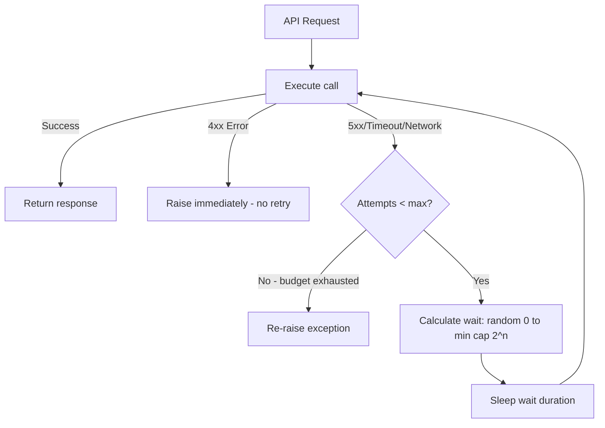

⚡ TL;DR - Retry strategies define how a client
re-attempts failed API calls; naive retry (immediate
re-attempt) amplifies load on an already struggling
server and causes thundering herd; exponential backoff
(wait 1s, 2s, 4s, 8s between retries) reduces retry
rate as failures accumulate; jitter (randomize wait
time within bounds) desynchronizes retries from
multiple clients so they do not all hit the server
simultaneously; only retry idempotent operations
(GET, PUT, DELETE, or POST with Idempotency-Key)
since retrying non-idempotent POST without dedup
creates duplicate state.

---

| #050 | Category: HTTP & APIs | Difficulty: ★★★ |
|:---|:---|:---|
| **Depends on:** | HTTP Timeouts (Connect, Read, Write) | |
| **Used by:** | API Circuit Breaker Pattern | |
| **Related:** | HTTP Timeouts, API Circuit Breaker Pattern, Idempotency in APIs | |

---

### 🔥 The Problem This Solves

**WORLD WITHOUT IT:**
Service A calls Service B. Service B returns 500 due
to a transient database hiccup (1 in 200 requests
fails). Without retry: the caller gets a 500 and fails
the user request. With naive immediate retry: caller
retries instantly. Service B is still recovering from
the hiccup. Retry hits during recovery → another 500.
Meanwhile, other callers also retried. Service B is
now handling 2× its normal load at the exact moment
it was trying to recover. Retry storm makes recovery
impossible.

**THE BREAKING POINT:**
AWS DynamoDB outage in 2012: clients were configured
to retry on 500 errors without backoff. When DynamoDB
had a partial failure, every client in AWS us-east-1
immediately retried at full speed. The retry traffic
alone exceeded the traffic of the original requests,
preventing recovery for hours. Exponential backoff
with jitter is now a documented AWS best practice
("Building Robust Applications with DynamoDB").

**THE INVENTION MOMENT:**
Exponential backoff was formalized in Ethernet's
binary exponential backoff algorithm (1980) for
collision avoidance: after each collision, wait for
a random number of slot times from [0, 2^n - 1].
Applied to HTTP retries: each failure doubles the
wait, with random jitter to desynchronize clients.
This single algorithm prevents cascading retry storms
in distributed systems.

---

### 📘 Textbook Definition

**Retry:** re-attempting a failed operation in hopes
that it will succeed on a subsequent try. Only safe
for transient failures (5xx, timeout, connection
refused) not for permanent failures (400, 401, 403,
404). **Exponential backoff:** wait time grows
exponentially with each retry attempt: `wait = base
× 2^attempt`. After attempt 0: base (1s); attempt 1:
2s; attempt 2: 4s; attempt 3: 8s. Caps at a maximum
wait (`max_wait = 30s`). **Jitter:** add randomness
to the wait time to prevent synchronized retries from
multiple clients. Two strategies: (1) Full jitter:
`wait = random(0, base × 2^attempt)` - most effective
at desynchronizing; (2) Equal jitter: `wait = (base
× 2^attempt / 2) + random(0, base × 2^attempt / 2)`.
**Retry budget:** maximum number of retry attempts
(typically 3). Beyond this, fail fast rather than
wait longer. **Retry predicate:** determine which
errors are retryable (5xx, network errors, timeouts)
vs not (4xx except 429, 408). **Idempotency
requirement:** only retry safe/idempotent operations
or operations with server-side deduplication.

---

### ⏱️ Understand It in 30 Seconds

**One line:**
Retry failed calls, but wait longer between each
attempt and randomize the wait - otherwise all clients
retry at the same moment and kill the server.

**One analogy:**
> Voting booth congestion. Without backoff: you try
> to vote, find a line of 100 people, leave, immediately
> come back, find 100 people still there, leave again.
> You and 10,000 others are all doing the same thing:
> the voting booth line never gets shorter because
> everyone keeps showing up simultaneously. With
> exponential backoff + jitter: after failing to vote,
> wait a random time (10-30 minutes, 20-60 minutes,
> 40-120 minutes). Each person returns at a different
> time, spreading the load, and the voting booth can
> process people in batches.

**One insight:**
Jitter is the most important part of the retry
strategy for distributed systems. Without jitter,
exponential backoff only slows the retry storm; it
does not eliminate the synchronized spike. With 1000
clients all failing at T=0 and all retrying at T=1s
(no jitter), you still get a 1000-client spike at
T=1s. With jitter: clients retry at T=0.1s, T=0.7s,
T=1.3s, ... spread across 2 seconds. The server
receives a manageable trickle instead of a spike.

---

### 🔩 First Principles Explanation

**Full jitter algorithm:**

```
attempt_1_wait = random(0, base)              = random(0, 1)
attempt_2_wait = random(0, base × 2)          = random(0, 2)
attempt_3_wait = random(0, base × 4)          = random(0, 4)
attempt_4_wait = random(0, min(cap, base × 8))= random(0, 8)

With cap=30, base=1:
attempt_5_wait = random(0, 16) - not 32 (capped)
attempt_6_wait = random(0, 30) - not 64 (capped at 30)
```

**Why full jitter beats "decorrelated jitter":**
Marc Brooker's AWS blog (2015) measured: full jitter
spreads retries most evenly across time, resulting in
lower total server load during recovery. Decorrelated
jitter: `wait = min(cap, random(base, wait × 3))` -
avoids runs of very short sleeps but is harder to
reason about.

---

### 🧪 Thought Experiment

**SCENARIO: 1000 clients fail simultaneously. Compare
retry strategies.**

**T=0:** Service B drops. All 1000 clients get 500.

**Naive immediate retry:**
- T=0.001: all 1000 clients retry simultaneously
- T=0.001: 1000-request spike → Service B overwhelmed
- T=0.001: All 1000 fail again
- Repeat forever. Service B never recovers.

**Fixed delay retry (1s, no jitter):**
- T=1: all 1000 clients retry simultaneously
- T=1: 1000-request spike → Service B overwhelmed
- T=2: same. T=3: same.
- Service B never recovers.

**Exponential backoff, no jitter:**
- T=1: all 1000 retry. Spike → fail.
- T=3: all 1000 retry. Smaller spike if partial recovery.
- T=7: all 1000 retry. Better but still spiky.
- Recovery possible but slow (synchronized spikes).

**Full jitter (base=1s, cap=30s):**
- T=0-1: ~500 clients retry (random in 0-1s window)
- T=0-2: ~750 more clients retry (next window 0-2s)
- Load is spread: ~250 req/s vs 1000-req spikes
- Service B recovers gradually with manageable load
- By T=30: all clients succeeded or failed permanently

---

### 🧠 Mental Model / Analogy

> Exponential backoff with jitter is like a stadium
> evacuation protocol. Without protocol: everyone runs
> to the exit simultaneously → bottleneck, crush, slow.
> With protocol: section A leaves first (0-5 min),
> section B (5-10 min), section C (10-15 min). Each
> section's members are assigned random times within
> their window. Result: continuous, manageable flow
> through exits instead of a crush. Exponential spacing
> means sections get larger gaps as time passes (if
> exits are backed up, wait longer). Jitter means
> within each section, individuals leave at slightly
> different times to avoid any instantaneous spike.

---

### 📶 Gradual Depth - Five Levels

**Level 1 - What it is (anyone can understand):**
When an API call fails, try again - but wait before
retrying. Wait longer each time. Add some randomness
to the wait so all clients do not retry at the exact
same millisecond. This prevents swamping an already-
struggling server with a wave of simultaneous retries.

**Level 2 - How to use it (junior developer):**
Use `tenacity` library in Python: `@retry(stop=
stop_after_attempt(3), wait=wait_exponential(multiplier
=1, min=1, max=30) + wait_random(0, 1))`. Only retry
on 500 errors and timeouts. Never retry on 400, 401,
403, 404 (permanent failures that will not improve
with retry).

**Level 3 - How it works (mid-level engineer):**
Retry predicate determines retryability. Exponential
backoff + jitter calculates wait. Retry budget prevents
infinite loops. For POST requests without idempotency
key: do not retry on read timeout (server may have
processed). For GET: always safe to retry. For POST
with `Idempotency-Key`: safe to retry (server dedupes).

**Level 4 - Why it was designed this way (senior/staff):**
Full jitter (Marc Brooker, AWS, 2015) beats exponential
backoff alone because the jitter desynchronizes retry
waves. Without jitter: 1000 clients in lockstep → spikes
at t=1, t=3, t=7. With full jitter: Poisson-like
arrival distribution → smooth load. This matches the
design goal: reduce total failed requests during a
partial outage by giving the server recoverable load.

**Level 5 - Mastery (distinguished engineer):**
Retry strategy must cooperate with the upstream circuit
breaker. If circuit breaker opens after N failures,
retries must stop even before the retry budget is
exhausted. The combined policy: (1) retry up to 3
times with full jitter backoff; (2) circuit breaker
trips after 5 failures in 10s; (3) while circuit
open: fail immediately (no retries); (4) circuit
half-open after 30s: one probe request. This prevents
retries from triggering more circuit breaker events
during recovery. Also: observe retry amplification
factor: if retry=3, upstream receives up to 3× normal
request volume during a partial outage. Design upstream
capacity for this amplification, or reduce retry count.

---

### ⚙️ How It Works (Mechanism)

**Python tenacity library with full jitter:**

```python
from tenacity import (
    retry,
    stop_after_attempt,
    wait_random_exponential,
    retry_if_exception_type,
    before_sleep_log,
)
import httpx
import logging

logger = logging.getLogger(__name__)

def is_retryable_error(exc: Exception) -> bool:
    """Only retry on transient errors."""
    if isinstance(exc, httpx.TimeoutException):
        return True
    if isinstance(exc, httpx.HTTPStatusError):
        # Retry: 429 (rate limit), 500/502/503/504
        return exc.response.status_code in (
            429, 500, 502, 503, 504
        )
    if isinstance(exc, httpx.NetworkError):
        return True
    return False  # 400, 401, 403, 404: do NOT retry

@retry(
    stop=stop_after_attempt(3),
    # Full jitter: random between 0 and exponential
    wait=wait_random_exponential(multiplier=1, max=30),
    retry=retry_if_exception_type(Exception),
    before_sleep=before_sleep_log(logger, logging.WARNING),
    reraise=True
)
async def call_payment_api(
    client: httpx.AsyncClient,
    payment_id: str
) -> dict:
    try:
        response = await client.get(
            f"/payments/{payment_id}",
            timeout=httpx.Timeout(connect=2, read=10)
        )
        response.raise_for_status()
        return response.json()
    except httpx.HTTPStatusError as e:
        if not is_retryable_error(e):
            raise  # Re-raise: tenacity will not retry
        raise  # Will be caught by retry decorator
```



---

### 🔄 The Complete Picture - End-to-End Flow

**Retry-safe POST with idempotency key:**

```python
import uuid
import httpx

async def create_order_with_retry(
    client: httpx.AsyncClient,
    order_data: dict
) -> dict:
    # Generate idempotency key BEFORE first attempt
    # Same key reused on all retries for deduplication
    idempotency_key = str(uuid.uuid4())

    @retry(
        stop=stop_after_attempt(3),
        wait=wait_random_exponential(multiplier=1, max=30)
    )
    async def attempt():
        response = await client.post(
            "/orders",
            json=order_data,
            headers={
                "Idempotency-Key": idempotency_key
            },
            timeout=httpx.Timeout(connect=2, read=15)
        )
        response.raise_for_status()
        return response.json()

    return await attempt()
```

---

### 💻 Code Example

**Example 1 - BAD: Immediate retry causes retry storm**

```python
# BAD: No backoff - amplifies load on struggling server
def call_with_retry_bad(url: str) -> dict:
    for attempt in range(3):
        try:
            return requests.get(url, timeout=5).json()
        except Exception:
            continue  # Instant retry - no wait
    raise Exception("All retries failed")

# GOOD: Full jitter exponential backoff
import random, time

def call_with_retry_good(url: str) -> dict:
    base = 1  # seconds
    cap = 30  # seconds max
    for attempt in range(3):
        try:
            return requests.get(url, timeout=5).json()
        except requests.exceptions.Timeout:
            wait = random.uniform(0, min(cap, base * (2 ** attempt)))
            time.sleep(wait)
        except requests.exceptions.HTTPError as e:
            if e.response.status_code < 500:
                raise  # 4xx: do not retry
            wait = random.uniform(
                0, min(cap, base * (2 ** attempt))
            )
            time.sleep(wait)
    raise Exception("All retries exhausted")
```

---

**Example 2 - Retry-after header handling (429)**

```python
async def handle_rate_limit_retry(
    client: httpx.AsyncClient,
    url: str
) -> dict:
    for attempt in range(5):
        response = await client.get(url)
        if response.status_code == 429:
            # Server tells us exactly how long to wait
            retry_after = int(
                response.headers.get("Retry-After", 60)
            )
            await asyncio.sleep(retry_after)
            continue
        response.raise_for_status()
        return response.json()
    raise Exception("Rate limit not recovered after 5 tries")
```

---

### ⚖️ Comparison Table

| Strategy | Wait Pattern | Synchronized Retries? | Good For |
|:---|:---|:---|:---|
| No retry | Immediate fail | N/A | None (avoid) |
| Immediate retry | 0s always | Yes - worst thundering herd | Never |
| Fixed delay | constant wait | Yes - still synchronized | Simple scripts, not production |
| Exponential backoff | 1s, 2s, 4s, 8s... | Yes - at each fixed point | Single client |
| Exp backoff + jitter | random in range | No - desynchronized | Production (multi-client) |

---

### ⚠️ Common Misconceptions

| Misconception | Reality |
|:---|:---|
| Always retry on any error | Only retry on transient errors (5xx, timeout, network). Never retry on 400, 401, 403, 404 (permanent failures). Retrying a 401 "Unauthorized" 3 times logs 3 auth failures and may trigger rate limiting or account lockout. |
| More retries = more reliability | More retries = more upstream load amplification. 3 retries means upstream sees up to 3× traffic during a failure. For high-traffic services this can prevent recovery. 3 attempts total (1 original + 2 retries) is usually sufficient. Combine with circuit breaker instead of adding more retries. |
| Retry is the same as idempotency | Retry is the caller's mechanism; idempotency is the server's guarantee. A client can retry any request; but without server-side idempotency (deduplication by Idempotency-Key), retrying a non-idempotent POST creates duplicates. Both layers are needed for safe POST retries. |
| Jitter just adds random noise | Jitter is the primary mechanism for desynchronizing client retries. Without jitter, 1000 clients with identical exponential backoff retry in perfect lockstep. With full jitter, retries are spread uniformly over the wait window, converting synchronized spikes into a smooth Poisson-like arrival rate. |

---

### 🚨 Failure Modes & Diagnosis

**Retry storm during partial outage**

**Symptom:** Service B has a partial failure (30% of
requests fail). Instead of recovering, it gets worse.
Metrics show 3× normal request rate on Service B.

**Root Cause:** Service A has N instances, each with
`retry=3`, no jitter. 30% failure means each request
retries up to 3 times. Effective load on Service B:
N × (0.7 × 1 original + 0.3 × 3 retries) = N × 1.6.
60% more load than normal, on a service that is already
struggling.

**Fix:**
(1) Add full jitter to all retry configurations.
(2) Add circuit breaker: after 5 failures/10s, stop
all retries for 30s. Service B gets breathing room.
(3) Reduce retry to 2 attempts (1 retry): amplification
factor drops from 1.6× to 1.3×.
(4) Instrument retry rate: alert if retry rate exceeds
10% of request rate (indicates systemic issue, not
transient).

---

**POST retry creating duplicate records**

**Symptom:** Duplicate orders appear in the database.
Correlation: each duplicate appears ~2-10 seconds
after the original. Pattern matches retry timing.

**Root Cause:** POST `/orders` is being retried on
timeout (or 503). Server received the first request,
created the order, then took too long to respond.
Client timed out, retried. Server created a second
order.

**Fix:**
(1) Add `Idempotency-Key` header support to POST
`/orders`. Store key → order_id mapping in Redis with
TTL 24h. On duplicate key: return the existing order.
(2) Client: generate idempotency key before first
attempt, include on all retries.
(3) Monitoring: add unique constraint on
`(idempotency_key)` to database to catch any bypass.

---

### 🔗 Related Keywords

**Prerequisites (understand these first):**
- `HTTP Timeouts` - what triggers the need for retry

**Builds On This (learn these next):**
- `API Circuit Breaker Pattern` - stops retrying when
  a service is clearly down
- `Idempotency in APIs` - server-side deduplication
  that makes POST retries safe

---

### 📌 Quick Reference Card

```
┌──────────────────────────────────────────────────────────┐
│ RETRY ON     │ 5xx, timeout, network error, 429          │
│ NO RETRY     │ 4xx (except 429), 401, 403, 404           │
├──────────────┼───────────────────────────────────────────┤
│ FORMULA      │ wait = random(0, min(cap, base × 2^n))    │
│ (full jitter)│ cap=30s, base=1s, n=attempt number       │
├──────────────┼───────────────────────────────────────────┤
│ MAX ATTEMPTS │ 3 total (1 original + 2 retries)          │
│              │ More = more load amplification            │
├──────────────┼───────────────────────────────────────────┤
│ IDEMPOTENCY  │ GET: always safe to retry                 │
│              │ POST: only with Idempotency-Key header    │
│              │ PUT/DELETE: safe if idempotent by design  │
├──────────────┼───────────────────────────────────────────┤
│ RETRY-AFTER  │ Always honour server's Retry-After header │
│              │ Overrides calculated backoff time         │
├──────────────┼───────────────────────────────────────────┤
│ ONE-LINER    │ "Retry with full jitter + stop retrying   │
│              │ when circuit breaker opens"               │
└──────────────────────────────────────────────────────────┘
```

**If you remember only 3 things:**
1. Always add full jitter to backoff (not just
   exponential delay) - jitter desynchronizes 1000
   clients and prevents retry storms.
2. Never retry 4xx errors (except 429) - they are
   permanent failures that retrying cannot fix.
3. POST retries require an Idempotency-Key - without
   server-side deduplication, retries create duplicates.

---

### 💎 Transferable Wisdom

**Reusable Engineering Principle:**
"Backoff + jitter desynchronizes competing actors."
This appears in many contexts beyond HTTP retry:
database connection retry on startup (all app instances
start simultaneously and hammer the DB - add jitter);
cron job scheduling (all instances run at the same
minute - add random offset); cache expiry (all entries
expire at the same time causing a cache stampede -
add jitter to TTL); leader election (all candidates
propose at the same time - add random election timeout,
as in the Raft consensus algorithm).

**Where else this pattern applies:**
- Raft consensus algorithm: randomized election timeout
  (150-300ms) prevents simultaneous elections - direct
  application of jitter principle
- TCP congestion control: binary exponential backoff
  on collision detection (original inspiration for
  HTTP retry backoff)
- Message queue consumer backoff: Kafka consumer
  poll backoff, SQS message visibility timeout extension

---

### 💡 The Surprising Truth

AWS found that "equal jitter" is NOT the best jitter
strategy despite being the most commonly implemented.
Marc Brooker's 2015 benchmark ("Exponential Backoff
and Jitter") showed: **full jitter** (completely
random within [0, cap]) produces the lowest total
completion time for a fixed server capacity during
a partial outage - better than equal jitter, decorrelated
jitter, and plain exponential backoff. The intuition:
full jitter most closely approximates a Poisson process
(uniform random arrivals), which is the optimal
arrival distribution for a server trying to recover.
Counterintuitive because full jitter sometimes waits
near-zero time (feels wrong: "why not always wait at
least a little?") but the uniformity is precisely
what spreads the load.

---

### ✅ Mastery Checklist

**You've mastered this when you can:**
1. **IMPLEMENT** Full jitter exponential backoff with
   `tenacity`: `wait_random_exponential(multiplier=1,
   max=30)` with retry predicate.
2. **DISTINGUISH** Retryable errors (5xx, timeout,
   network) from non-retryable (4xx) and configure
   the retry predicate accordingly.
3. **SECURE** POST retries with `Idempotency-Key`
   header generation before first attempt, reused
   across all retry attempts.
4. **DIAGNOSE** Retry storms from the metrics: retry
   rate > 10% of request rate indicates systemic issue.
5. **COMBINE** Retry with circuit breaker: retries stop
   when circuit opens, preventing amplification during
   outage.

---

### 🎯 Interview Deep-Dive

**Q1: What is the thundering herd problem in the
context of retry strategies, and how do you prevent it?**

*Why they ask:* Tests understanding of distributed
systems failure modes.

*Strong answer includes:*
- Thundering herd: many clients fail simultaneously,
  then retry simultaneously, producing a traffic spike
  that exceeds server capacity at the exact moment
  the server is trying to recover.
- Example: 1000 clients, fixed 1s retry delay. All
  fail at T=0. All retry at T=1. Server receives 1000
  simultaneous requests again at T=1. Likely still
  overwhelmed. All fail again. All retry at T=2. etc.
- Prevention: full jitter exponential backoff. After
  failure #1: each client waits random(0, 1s). Clients
  spread across a 1s window (avg 500ms). After failure
  #2: each waits random(0, 2s). Spread across 2s.
  Load drops from 1000 req/0ms spike to ~1000 req/2s
  = 500 req/s - manageable.
- Layer 2 prevention: circuit breaker. After N failures,
  stop retrying entirely for T seconds. Server gets
  near-zero load during the circuit open period and
  can recover.
- Metric to monitor: retry_rate/request_rate ratio.
  If > 10%, there is a systemic issue, not just
  transient failures.

**Q2: When is it safe to retry a POST request?**

*Why they ask:* Tests idempotency + retry interaction.

*Strong answer includes:*
- By default: POST is not idempotent → not safe to
  retry without server-side deduplication.
- Safe POST retry requires: (1) client generates a
  unique `Idempotency-Key: <uuid>` before the first
  attempt; (2) client includes the same key on all
  retries; (3) server stores key → result mapping
  (Redis: `SET idempotency:{key} {result} EX 86400`);
  (4) server checks key before processing: if exists,
  return cached result without reprocessing.
- Connect timeout: server never received request →
  safe to retry without idempotency key (no state
  change happened).
- Read timeout: server may or may not have processed
  → must use idempotency key on retry (cannot
  distinguish scenarios a/b/c).
- Client implementation: generate key once, persist
  it through all retries. Never generate a new key
  for each retry attempt (that defeats deduplication).

**Q3: How would you configure retry for a high-volume
service where retries could amplify load by 3×?**

*Why they ask:* Tests production-scale resilience thinking.

*Strong answer includes:*
- Reduce retry count: 3 total (1 original + 2 retries)
  = max 3× amplification. Consider 2 total (1 original
  + 1 retry) = max 2× amplification for high-volume.
- Calculate amplification: if failure rate = 30% and
  retry=3: effective RPS = original × (0.7 × 1 + 0.3
  × 3) = original × 1.6. Not 3× in practice because
  not all requests fail.
- Circuit breaker as safety valve: after 5 failures/10s,
  circuit opens. New requests fail immediately without
  hitting upstream. Amplification drops to 0× during
  circuit open period. Service gets full breathing room.
- Retry budget (service-wide): limit total retry
  attempts per second across all instances. If service
  has 10 instances each handling 1000 req/s, total
  retry budget = e.g. 500 retries/s across all instances.
  When budget exhausted, fail fast instead of queuing
  retry.
- Observability: instrument `retry_attempt_count` metric
  per service, per endpoint. Alert on sustained retry
  rate > 5%. Dashboard: original requests vs retry
  requests vs circuit breaker opens per minute.
