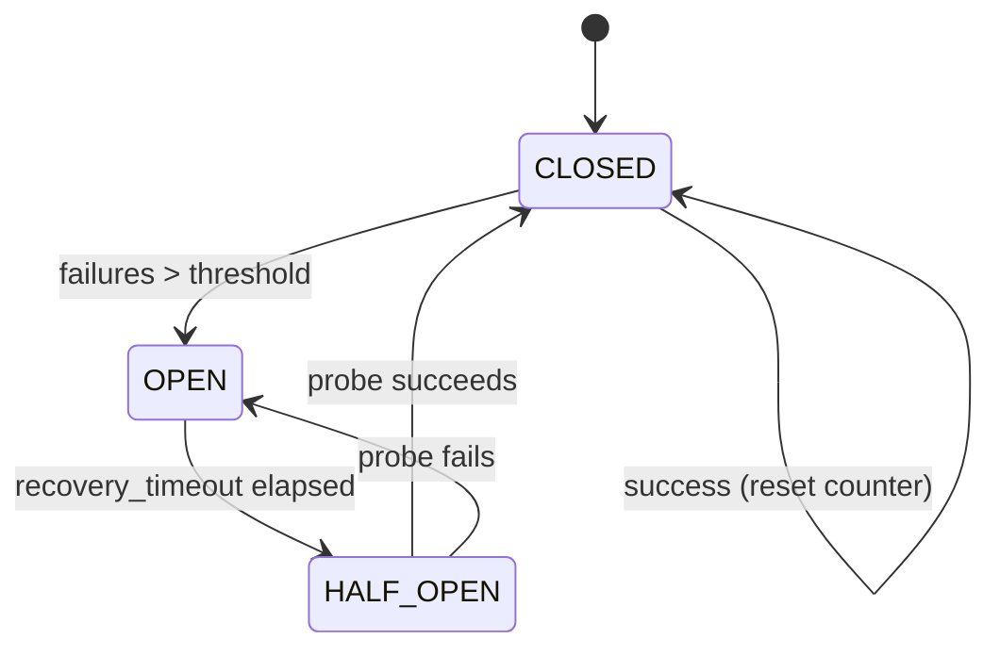

⚡ TL;DR - Circuit breaker wraps API calls and
monitors failure rate; when failures exceed a threshold
(e.g. 50% in 10s), it "opens" and all subsequent
calls fail immediately (no network call made) for a
configured recovery period; after the recovery period
it enters "half-open" and allows one probe request;
if the probe succeeds → close (normal operation); if
it fails → reopen; prevents cascading failures by
stopping retries from amplifying load on a downed
service, and provides fast failure to callers instead
of hanging them with timeouts.

---

| #051 | Category: HTTP & APIs | Difficulty: ★★★ |
|:---|:---|:---|
| **Depends on:** | HTTP Timeouts, API Retry and Backoff Strategy | |
| **Used by:** | API Gateway Rate Limiting and Auth at Scale | |
| **Related:** | HTTP Timeouts, API Retry and Backoff, API Gateway Pattern, API Gateway at Scale | |

---

### 🔥 The Problem This Solves

**WORLD WITHOUT IT:**
Payment service goes down at T=0. User service has
3-retry logic with 10s read timeout per attempt.
Each user request: 3 attempts × 10s = 30s before
failure. 1000 users/second × 30s = 30,000 concurrent
threads blocked, waiting for payment calls to timeout.
Thread pool exhausted. User service returns 503 for
all requests (not just payment-related). Every other
feature (product search, cart) is also down because
of one unrelated downstream failure.

**THE BREAKING POINT:**
The cascade: Payments down → User service threads
blocked → User service 503 → Cart service threads
blocked (calling User service) → Cart 503 → All
services down. One service failure takes down the
entire stack within minutes. Netflix experienced this
and built Hystrix to prevent it.

**THE INVENTION MOMENT:**
Michael Nygard's "Release It!" (2007) described the
circuit breaker pattern for software. Inspired by the
electrical circuit breaker: when current (load) exceeds
safe limits (failure rate), open the circuit (stop
current flow) to protect downstream components
(prevent cascade). Key insight: failing fast is
better than hanging. A fast 503 allows callers to
serve fallback responses immediately rather than
consuming threads waiting for timeouts.

---

### 📘 Textbook Definition

**Circuit breaker:** a stateful proxy that wraps
remote calls and tracks success/failure outcomes.
Three states:

**CLOSED (normal):** all requests pass through.
Failures tracked in a sliding window. If failure
rate exceeds threshold, transition to OPEN.

**OPEN (tripped):** all requests fail immediately
without making network calls. Returns a
`CircuitBreakerOpenError` (or configurable fallback).
After a `recovery_timeout` (e.g. 30s), transition to
HALF-OPEN.

**HALF-OPEN (probing):** allows one request through.
If it succeeds → CLOSED. If it fails → OPEN again
(extends recovery period).

**Failure counting:** count-based (fail N times
in window) or rate-based (fail X% of last N requests).
Rate-based is more accurate for high-volume services
(Hystrix, resilience4j use rolling window with
configurable size).

**Key parameters:**
- `failure_threshold`: failures (or %) to open
- `recovery_timeout`: seconds in OPEN before HALF-OPEN
- `expected_exception`: which exceptions count as failures
- `success_threshold`: successes in HALF-OPEN to close

---

### ⏱️ Understand It in 30 Seconds

**One line:**
Circuit breaker monitors call failures and stops
making calls when failure rate is too high - failing
fast instead of waiting for timeouts.

**One analogy:**
> Electrical circuit breaker in your home. Normal
> operation: electricity flows freely (CLOSED). Overload
> (too many failures): breaker trips to protect wires
> (OPEN). You must wait before resetting (recovery
> timeout). Reset one test: flip the switch once (HALF-
> OPEN). If everything is fine: stays on (CLOSED). If
> overload again: trips again (OPEN). The breaker is
> not about ignoring the problem; it is about giving
> the damaged part of the system time to recover
> without being continuously hammered.

**One insight:**
The circuit breaker's most valuable feature is not
preventing the caller from making calls - it is the
HALF-OPEN state. Without HALF-OPEN, you would need
to manually detect when the downstream service is
healthy and manually close the circuit. HALF-OPEN
makes recovery automatic: the circuit self-heals
after the recovery timeout, sends one probe, and
returns to normal operation if the probe succeeds.
This makes circuit breakers "self-healing" resilience
mechanisms.

---

### 🔩 First Principles Explanation

**State machine:**

```
                                  failure_threshold exceeded
    [CLOSED] ───────────────────────────────────────────> [OPEN]
       ^                                                      |
       |     recovery_timeout elapsed                         |
       |  <──────────────────────────────────────── [HALF-OPEN]
       |                                                      |
       |  success in HALF-OPEN    failure in HALF-OPEN        |
       └─────────────────────────     ──────────────────────> |
         (circuit closes)         failure (extends recovery)  |
```

```
ASCII state diagram:

  CLOSED ──(failures > threshold)──> OPEN
     ^                                  |
     |                        (timeout elapsed)
     |                                  v
  ←─ success ────────────── HALF-OPEN
     (close again)              |
                       failure ─┘ (re-open)
```

---

### 🧪 Thought Experiment

**SCENARIO: Payment service failure with and without
circuit breaker**

**Setup:**
- Payment service goes down (returns 500)
- User service: 100 requests/second
- Retry: 3 attempts × 10s timeout each = 30s per call
- Circuit breaker: trip at 5 failures in 10s, 30s recovery

**WITHOUT circuit breaker:**
```
T=0:  Payment service down
T=0:  100 req/s start calling payment, timeout 30s each
T=30: 3000 concurrent waiting threads (100/s × 30s)
T=30: Thread pool exhausted. User service returns 503
T=60: Payment recovers. Thread pool still draining.
T=90: Finally recovers.
Total user impact: 90+ seconds of complete failure
```

**WITH circuit breaker:**
```
T=0:  Payment service down
T=0:  5 failures in <1s → circuit OPENS
T=0:  All subsequent payment calls → fast 503 (no timeout)
T=0:  Thread pool NOT exhausted (0ms per call, not 30s)
T=0:  User service: payment-related features show
      "Payment unavailable" fallback. Other features: OK.
T=30: Recovery timeout. Circuit → HALF-OPEN
T=30: One probe request → success → circuit CLOSES
T=30: Full operation restored.
Total user impact: 30 seconds of degraded payment
      (not total outage)
```

---

### 🧠 Mental Model / Analogy

> Circuit breaker is like a sick day policy for services.
> CLOSED: team member works normally. OPEN: team member
> calls in sick - all their tasks are redirected to
> a fallback (another person, or deferred). Recovery
> timeout: mandatory rest period before returning.
> HALF-OPEN: first day back, handle just one task to
> confirm recovery. If the task goes well: back to full
> capacity. If overwhelmed again: another sick day.
> Without this policy: sick team member keeps failing
> every task, holding up the whole pipeline.

---

### 📶 Gradual Depth - Five Levels

**Level 1 - What it is (anyone can understand):**
Circuit breaker watches how often an API call fails.
When failures pile up, it stops making calls for a
while and returns an instant error instead. After a
recovery period, it tries one call. If that works:
back to normal. This stops one slow or broken service
from freezing all your threads.

**Level 2 - How to use it (junior developer):**
Use `pybreaker` library: `cb = CircuitBreaker(
fail_max=5, reset_timeout=30)`. Wrap calls:
`@cb`. On `CircuitBreakerError`: return fallback
response. Configure `expected_exception` to match
your HTTP client exception classes.

**Level 3 - How it works (mid-level engineer):**
The circuit maintains a failure count (or rolling
window for rate-based). Each call increments success
or failure counter. On open: start a timer. On
`reset_timeout` expiry: allow one call (HALF-OPEN).
Rate-based circuits use sliding time windows (more
accurate but more memory): Hystrix default is 10s
window with 20-bucket granularity.

**Level 4 - Why it was designed this way (senior/staff):**
Count-based circuits are simple but inaccurate for
high-volume services: 5 failures in 10s is very
different meaning at 100 req/s (5% failure rate) vs
10 req/s (50% failure rate). Rate-based circuits
(resilience4j's `SlidingWindowType.COUNT_BASED` vs
`TIME_BASED`) are more accurate. Netflix Hystrix used
rolling window counters. Key design trade-off:
sensitivity vs flapping. Too sensitive (5% failure
rate): circuit opens on normal noise. Too insensitive
(60% failure rate): circuit opens too late. Typical
production values: 50% failure rate, minimum 20
requests in window.

**Level 5 - Mastery (distinguished engineer):**
Circuit breaker placement matters architecturally.
Per-service circuit breaker: one circuit wraps all
calls to service B. Advantage: tracks service-level
health. Problem: a service with 10 endpoints may have
one endpoint slow (DB query) and nine fast - one
circuit breaks all 10. Per-endpoint circuit breaker:
more granular but more state to track. Shared state
for distributed circuit breaker: in a multi-instance
deployment (10 app instances), each instance has its
own circuit state. A failure on instance 1 opens
instance 1's circuit, but instances 2-10 still make
calls. Solutions: (1) distributed circuit state in
Redis; (2) service mesh (Istio, Envoy) handles circuit
breaking at the proxy layer (shared state across all
instances automatically).

---

### ⚙️ How It Works (Mechanism)

**Python pybreaker with httpx and fallback:**

```python
import pybreaker
import httpx
import logging

logger = logging.getLogger(__name__)

# Per-service circuit breaker
payment_circuit = pybreaker.CircuitBreaker(
    fail_max=5,               # Open after 5 failures
    reset_timeout=30,         # Try again after 30s
    name="payment_service",
    listeners=[pybreaker.CircuitBreakerListener()],
    expected_exception=lambda e: isinstance(
        e, (httpx.TimeoutException, httpx.HTTPStatusError)
    ) and (
        not isinstance(e, httpx.HTTPStatusError)
        or e.response.status_code >= 500
    )
)

http_client = httpx.AsyncClient(
    base_url="http://payments-svc",
    timeout=httpx.Timeout(connect=2, read=10)
)

@payment_circuit
async def charge_payment(
    payment_id: str, amount: int
) -> dict:
    """Wrapped by circuit breaker."""
    response = await http_client.post(
        f"/payments/{payment_id}/charge",
        json={"amount": amount}
    )
    response.raise_for_status()
    return response.json()

async def process_payment(
    payment_id: str, amount: int
) -> dict:
    """Caller with fallback on open circuit."""
    try:
        return await charge_payment(payment_id, amount)
    except pybreaker.CircuitBreakerError:
        # Circuit is OPEN: fast failure, no network call
        logger.warning(
            "Payment circuit OPEN: returning fallback"
        )
        return {
            "status": "payment_unavailable",
            "retry_after": 30
        }
    except httpx.TimeoutException:
        # Counted by circuit breaker; return error
        return {"status": "payment_timeout"}
```



---

### 🔄 The Complete Picture - End-to-End Flow

**Service mesh circuit breaker (distributed, shared state):**

```
App Instance 1 ──────────────────────────────────────────────
App Instance 2 ──> Envoy Sidecar ──> Payments Service
App Instance 3 ──────────────────────────────────────────────
                        |
                 Shared circuit state
                 (all instances see same
                 OPEN/CLOSED/HALF-OPEN)

Istio OutlierDetection config:
  consecutiveErrors: 5
  interval: 30s
  baseEjectionTime: 30s
  maxEjectionPercent: 100
```

This is the production solution for multi-instance
circuit breaking: the service mesh sidecar (Envoy)
tracks circuit state across all app instances,
eliminating the need for distributed circuit state
in application code.

---

### 💻 Code Example

**Example 1 - BAD: No circuit breaker (thread pool exhaustion)**

```python
# BAD: Every timeout blocks a thread for full timeout
async def get_user_with_payment(user_id: str) -> dict:
    user = await user_client.get(f"/users/{user_id}")
    # If payment service is down: blocks 10s per call
    # 100 req/s → 1000 threads blocked after 10s
    payment = await payment_client.get(
        f"/payments/{user_id}",
        timeout=10  # 10 seconds, no circuit breaker
    )
    return {"user": user.json(), "payment": payment.json()}

# GOOD: Circuit breaker + fallback
async def get_user_with_payment(user_id: str) -> dict:
    user = await user_client.get(f"/users/{user_id}")
    try:
        payment = await get_payment_with_circuit(user_id)
    except pybreaker.CircuitBreakerError:
        payment = {"status": "unavailable"}  # Fast fallback
    return {"user": user.json(), "payment": payment}
```

---

**Example 2 - Observability (circuit state metrics)**

```python
class MetricsListener(pybreaker.CircuitBreakerListener):
    def state_change(self, cb, old_state, new_state):
        metrics.gauge(
            "circuit_breaker.state",
            1 if new_state.name == "open" else 0,
            tags={"circuit": cb.name}
        )
        logger.warning(
            f"Circuit {cb.name}: {old_state} -> {new_state}"
        )
    def failure(self, cb, exc):
        metrics.increment(
            "circuit_breaker.failure",
            tags={"circuit": cb.name}
        )

payment_circuit = pybreaker.CircuitBreaker(
    fail_max=5,
    reset_timeout=30,
    listeners=[MetricsListener()]
)
```

---

### ⚖️ Comparison Table

| Feature | Count-Based | Rate-Based | Service Mesh |
|:---|:---|:---|:---|
| Accuracy | Low (ignores volume) | High (% of requests) | High |
| Volume sensitivity | No (5 failures at 10/s vs 10000/s treated same) | Yes (50% of N requests) | Yes |
| Shared state | No (per instance) | No (per instance) | Yes (per service) |
| App code changes | Yes (add circuit) | Yes | No (config only) |
| Examples | pybreaker, resilience4j count | Hystrix, resilience4j sliding | Istio, Linkerd, Envoy |

---

### ⚠️ Common Misconceptions

| Misconception | Reality |
|:---|:---|
| Circuit breaker replaces retry | They complement each other. Retry handles transient single failures. Circuit breaker handles sustained failures (service is down). Pattern: retry first (1-2 retries); if still failing → circuit opens → fast failure for recovery period. Do not retry when circuit is OPEN (would defeat the purpose). |
| Circuit breaker always returns an error | It returns whatever the fallback provides. Well-designed systems provide degraded responses: show "payment temporarily unavailable" instead of crashing. The circuit breaker enables graceful degradation, not just error propagation. |
| One global circuit breaker is sufficient | Per-service circuit breakers are needed. A global circuit breaker that covers all downstream calls would open when ANY service fails, blocking all external calls. Isolate each downstream with its own circuit. |
| Circuit breaker fixes the underlying service | Circuit breaker protects the caller; it does nothing for the downstream service. The downstream service recovers on its own. Circuit breaker just ensures the caller does not add more load while the downstream recovers. |

---

### 🚨 Failure Modes & Diagnosis

**Circuit flapping (opens and closes rapidly)**

**Symptom:** Circuit breaker alternates between OPEN
and CLOSED every 30-60 seconds. Metrics show rapid
state transitions. Service is partially degraded but
not fully down.

**Root Cause:** `fail_max` is too low or recovery
timeout too short for the current service conditions.
After 30s recovery, one probe succeeds (CLOSED). First
real traffic: one failure in degraded conditions →
OPEN again. Cycle repeats.

**Fix:**
(1) Increase `fail_max` or switch to rate-based with
minimum request threshold (e.g. open only if 50%+
failure rate AND at least 20 requests in window).
(2) Increase `reset_timeout` to 60s - gives more time
for downstream to fully recover.
(3) Increase success threshold in HALF-OPEN: require 3
consecutive successes before fully closing.

---

**Circuit breaker not opening (thread pool still exhausted)**

**Symptom:** Payments service is down. Circuit breaker
metric shows CLOSED. Thread pool exhausted. Circuit
appears to not be working.

**Root Cause:** `expected_exception` not configured to
match actual exceptions thrown by the HTTP client.
Circuit breaker only counts exceptions it recognizes.
If the HTTP client throws `httpx.TimeoutException` but
the circuit is only watching for `requests.Timeout`,
every timeout call counts as a "success" (no exception
matching).

**Fix:**
Verify `expected_exception` list matches actual raised
exceptions. Add test: manually trigger a timeout and
log which exception class is raised. Update circuit's
`expected_exception` to match. Add monitoring to log
all circuit breaker events.

---

### 🔗 Related Keywords

**Prerequisites (understand these first):**
- `HTTP Timeouts` - the trigger for circuit breaker failures
- `API Retry and Backoff Strategy` - what happens before
  circuit opens

**Builds On This (learn these next):**
- `API Gateway Rate Limiting and Auth at Scale` - circuit
  breakers at the API gateway layer

---

### 📌 Quick Reference Card

```
┌──────────────────────────────────────────────────────────┐
│ STATES       │ CLOSED: normal; OPEN: fast fail;          │
│              │ HALF-OPEN: probe (1 request)              │
├──────────────┼───────────────────────────────────────────┤
│ OPEN TRIGGER │ N failures (count) or X% failures (rate) │
├──────────────┼───────────────────────────────────────────┤
│ RECOVERY     │ reset_timeout (30s typical) before probe  │
├──────────────┼───────────────────────────────────────────┤
│ FALLBACK     │ Return cached/degraded/error response     │
│              │ Never let circuit exception bubble up raw │
├──────────────┼───────────────────────────────────────────┤
│ SCOPE        │ One circuit per downstream service        │
│              │ Not one global circuit for all calls      │
├──────────────┼───────────────────────────────────────────┤
│ LAYER        │ App code (pybreaker) or service mesh      │
│              │ Service mesh preferred for multi-instance │
├──────────────┼───────────────────────────────────────────┤
│ ONE-LINER    │ "Open when failing, wait, probe, recover  │
│              │ - self-healing fast-failure proxy"        │
└──────────────────────────────────────────────────────────┘
```

**If you remember only 3 things:**
1. Circuit breaker stops making calls when failure
   rate is too high - protecting thread pools from
   being consumed by timeouts on a downed service.
2. HALF-OPEN state enables self-healing: one probe
   request after recovery_timeout automatically
   restores normal operation when downstream recovers.
3. Always provide a fallback response when the circuit
   is OPEN - graceful degradation, not propagated error.

---

### 💎 Transferable Wisdom

**Reusable Engineering Principle:**
"Fail fast, recover automatically." The circuit
breaker is one instance of a broader distributed
systems principle: when a dependency is clearly
unhealthy, stop depending on it temporarily rather
than continuing to wait for it. This appears as: Redis
health check with fallback to local cache; database
failover to read replica when primary is slow; Kafka
producer circuit breaker when broker is overwhelmed
(skip writes vs block forever); API gateway upstream
health check (stop routing to unhealthy instance).
The common thread: detect unhealthy state quickly,
switch to fallback, self-heal when health is restored.

**Where else this pattern applies:**
- Istio/Envoy OutlierDetection: service mesh circuit
  breaking at the infrastructure layer
- resilience4j (Java/Spring): production-grade circuit
  breaker with sliding window, bulkhead, rate limiter
- Polly (.NET): circuit breaker for .NET HTTP calls
- AWS Lambda retry policies: dead letter queue when
  function exceeds error rate (analogous concept)

---

### 💡 The Surprising Truth

Netflix's Hystrix, the most famous circuit breaker
library, was deprecated in 2018 and is no longer
actively maintained. Netflix themselves migrated to
resilience4j and then to service mesh (Envoy/Istio).
The reason: application-level circuit breaking (inside
each service's code) requires every team to implement
it correctly, configure it appropriately, and maintain
it. In a 500-microservice environment, this becomes
operationally unmanageable. Service mesh circuit
breaking moves the concern to the infrastructure layer:
no application code changes needed, consistent policy
across all services, centralized configuration and
observability. Application-level circuit breakers
are still valuable for local fallback logic (what to
return when the circuit is open), but the state-
tracking and network interception moves to the sidecar.
The pattern did not die; it moved to a better layer.

---

### ✅ Mastery Checklist

**You've mastered this when you can:**
1. **IMPLEMENT** `pybreaker.CircuitBreaker` with correct
   `expected_exception`, `fail_max`, and `reset_timeout`
   for a given service's latency profile.
2. **DESIGN** Fallback responses for each circuit-
   protected service: cached data, degraded UI, 503
   with `retry_after`.
3. **CONFIGURE** Istio `OutlierDetection` for service
   mesh circuit breaking (multi-instance shared state).
4. **DIAGNOSE** Circuit flapping (too-sensitive threshold)
   vs circuit not opening (wrong exception class in
   `expected_exception`).
5. **EXPLAIN** Why circuit breaker + retry + timeout
   are three separate patterns that work together and
   why substituting one for another does not work.

---

### 🎯 Interview Deep-Dive

**Q1: Explain the three states of a circuit breaker
and when each transition occurs.**

*Why they ask:* Core pattern knowledge.

*Strong answer includes:*
- CLOSED: normal operation. All requests pass through.
  Failure counter tracked in rolling window. Transition
  to OPEN: failure count (or rate) exceeds threshold
  (e.g. 5 failures, or 50% failure rate over 20 requests).
- OPEN: all requests fail immediately without network
  call. Returns `CircuitBreakerError` or fallback.
  Timer starts. Transition to HALF-OPEN: `reset_timeout`
  elapsed (e.g. 30s).
- HALF-OPEN: allows one "probe" request through. If
  probe succeeds → CLOSED (circuit recovered). If
  probe fails → OPEN again (restart recovery timer).
  HALF-OPEN is the self-healing mechanism: automatic
  recovery without manual intervention.
- Why HALF-OPEN matters: without it, the circuit stays
  OPEN forever. Someone must manually close it when
  the service recovers. HALF-OPEN automates this.

**Q2: How would you implement circuit breaking in a
multi-instance deployment (10 app servers)?**

*Why they ask:* Tests distributed systems thinking.

*Strong answer includes:*
- Problem: with 10 instances, each has its own circuit
  state. Instance 1's circuit opens → only instance 1
  fast-fails. Instances 2-10 still make calls. The
  circuit is not providing full protection.
- Option 1: distributed circuit state in Redis. All
  instances read/write circuit state to Redis. One
  failure on any instance contributes to the shared
  counter. Shared OPEN state means all instances fast-
  fail. Complexity: Redis latency per call to check
  state; Redis as additional dependency.
- Option 2: service mesh circuit breaking (Istio
  OutlierDetection, Envoy). The sidecar proxy on each
  instance intercepts calls and tracks state. State
  is coordinated across all Envoy sidecars via the
  control plane. Application code changes: zero. Config
  change only (VirtualService, DestinationRule).
  Production recommendation: use service mesh for
  multi-instance deployments.
- Option 3: accept per-instance state for internal
  services. If 10 instances each protect themselves,
  the downstream sees 10× the fast-failure rate, which
  is still better than 10× the timeout rate. Workable
  for lower-scale deployments.

**Q3: What is the difference between circuit breaker,
retry, and timeout, and how do they work together?**

*Why they ask:* Tests resilience pattern architecture.

*Strong answer includes:*
- Timeout: bounds how long a single request waits.
  Protects individual calls. "I will not wait more
  than 10 seconds."
- Retry: re-attempts failed calls for transient errors.
  Handles single-failure events. "I will try 3 times
  with backoff before giving up."
- Circuit breaker: tracks failure rate over time and
  stops calling when it is too high. Handles sustained
  failures (service is down). "After 5 failures, I
  will stop calling for 30 seconds."
- Combined correctly: request → (circuit open? fast
  fail) → attempt → timeout (10s) → on timeout:
  (retry once with backoff) → on 2nd failure: circuit
  failure counter increments → if counter > threshold:
  circuit opens → future requests fast-fail.
- Key interaction: do NOT retry when circuit is OPEN.
  Retry + open circuit = still makes network calls,
  defeats the fast-failure protection. Check circuit
  state before executing retry loop.
- Implementation order: circuit breaker wraps the
  retry+timeout layer. Circuit opens when the retry
  layer has exhausted its budget N times.
