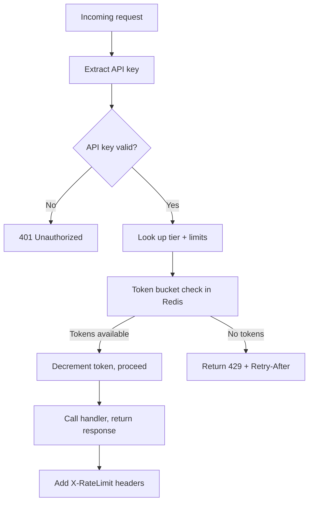

⚡ TL;DR - Throttling is enforcing a rate limit per
unit time (requests/second); quota is enforcing a
total consumption limit over a longer period (requests/
day or GB/month); algorithms differ: token bucket
(smooth burst capacity, Redis-based), sliding window
(precise but memory-intensive), fixed window (simple
but vulnerable to burst at boundary); responses must
include `X-RateLimit-Limit`, `X-RateLimit-Remaining`,
`X-RateLimit-Reset`, and `Retry-After` headers; 429
Too Many Requests is the standard status code; quota
enforcement serves fairness, cost control, and DoS
protection simultaneously.

---

| #052 | Category: HTTP & APIs | Difficulty: ★★★ |
|:---|:---|:---|
| **Depends on:** | HTTP Status Codes, API Retry and Backoff Strategy | |
| **Used by:** | API Gateway Rate Limiting at Scale, Rate Limiting as Universal Resource Governance | |
| **Related:** | HTTP Status Codes, API Retry, API Gateway at Scale, Rate Limiting (META) | |

---

### 🔥 The Problem This Solves

**WORLD WITHOUT IT:**
Public API with no rate limiting. A single customer
writes a bug in their client: infinite loop calling
`/search` API. 50,000 requests/second from one
customer. API costs $0.001/request: $50/second billing
to provider. Other customers experience degraded
performance (shared compute). Within 1 hour: $180,000
in compute costs. Competitor scrapes entire catalog
in 4 hours. Without rate limiting, there is no defense
against any of: buggy clients, cost runaway, scraping,
DoS, or unfair monopolization of shared capacity.

**THE BREAKING POINT:**
Twitter's API (2012): no per-endpoint rate limiting.
Third-party Twitter clients were making hundreds of
millions of API calls per day per popular app. Twitter
could not sustain the infrastructure cost. Result:
aggressive rate limiting rollout that broke thousands
of third-party apps. Building rate limiting after
launch is painful for everyone. Rate limiting at
launch is table stakes for any public API.

**THE INVENTION MOMENT:**
Token bucket algorithm was formalized in network
traffic shaping (Tanenbaum's Computer Networks, 1980s)
for regulating burst transmission. Applied to API
rate limiting: each API key has a "bucket" that
accumulates tokens at a fixed rate. Each request
consumes one token. Burst allowed as long as tokens
are available. Key insight: token bucket allows short
bursts above average rate while maintaining long-term
average, matching how real clients behave (bursts of
activity followed by idle periods).

---

### 📘 Textbook Definition

**Rate limiting / throttling:** enforcing a maximum
number of requests per time window per client (API
key, user ID, IP). **Quota:** a longer-period cap
(daily, monthly) separate from the per-second rate
limit. **Algorithms:**

**Fixed window:** count requests in a fixed
time window (e.g. 100 req/minute). Simple, but
boundary burst vulnerability: 100 requests at 12:59
+ 100 requests at 13:00 = 200 requests in 2 seconds,
which may overwhelm the backend despite both windows
being within limit.

**Sliding window log:** store timestamp of each
request. Count requests in the last N seconds. Precise,
but O(N requests) memory per client.

**Sliding window counter:** interpolate between two
adjacent fixed windows to approximate sliding window
with O(1) memory. Used by Redis-based limiters.

**Token bucket:** bucket holds up to B tokens, fills
at R tokens/second. Each request takes one token.
If bucket empty: reject. Allows burst up to B while
enforcing average rate R. Implementation: track
`(tokens, last_refill_time)` in Redis per key.

**Leaky bucket:** requests enter a queue and exit at
a fixed rate (smooth output). Flattens bursts but
adds latency. Less common for API rate limiting.

---

### ⏱️ Understand It in 30 Seconds

**One line:**
Rate limiting restricts how many API calls a client
can make per second; quota limits total consumption
per day; both protect the provider from cost overruns,
DoS, and unfair monopolization.

**One analogy:**
> A highway toll booth with two controls. Rate limit:
> the booth processes at most 10 cars/minute (burst
> speed limit). If 50 cars arrive in 30 seconds: 10
> pass, 40 wait or turn away. Quota: each car has a
> monthly toll budget (1000 crossings/month). Once
> the monthly budget is used, the car cannot cross
> regardless of current toll booth throughput. The
> toll booth (rate limit) protects capacity in the
> moment; the monthly budget (quota) manages long-term
> resource allocation.

**One insight:**
The rate limit headers (`X-RateLimit-Remaining`,
`Retry-After`) are as important as the 429 status code.
Without headers, clients cannot implement correct
backoff: they must guess when to retry. Stripe, GitHub,
Twitter all publish current quota status in every
response header so clients can throttle themselves
before hitting the limit. Self-throttling clients
(that respect headers) reduce 429 errors by 90%+
compared to clients that only react to 429s.

---

### 🔩 First Principles Explanation

**Token bucket implementation in Redis:**

```python
import redis
import time
import math

def token_bucket_check(
    r: redis.Redis,
    key: str,
    rate: float,    # tokens/second
    capacity: int,  # max tokens (burst capacity)
) -> tuple[bool, int]:
    """
    Returns (allowed: bool, tokens_remaining: int).
    Atomic operation via Lua script.
    """
    lua_script = """
    local key = KEYS[1]
    local rate = tonumber(ARGV[1])
    local capacity = tonumber(ARGV[2])
    local now = tonumber(ARGV[3])
    local requested = 1

    local bucket = redis.call("HMGET", key,
        "tokens", "last_refill")
    local tokens = tonumber(bucket[1]) or capacity
    local last_refill = tonumber(bucket[2]) or now

    -- Refill tokens based on elapsed time
    local elapsed = now - last_refill
    tokens = math.min(
        capacity,
        tokens + (elapsed * rate)
    )

    local allowed = 0
    if tokens >= requested then
        tokens = tokens - requested
        allowed = 1
    end

    redis.call("HMSET", key,
        "tokens", tokens,
        "last_refill", now
    )
    redis.call("EXPIRE", key, 3600)
    return {allowed, math.floor(tokens)}
    """
    now = time.time()
    result = r.eval(lua_script, 1, key, rate,
                    capacity, now)
    return bool(result[0]), int(result[1])
```

**Why Lua script:** the refill + check + update must
be atomic. Without a Lua script (or Redis transaction),
two concurrent requests can both read the same token
count, both see tokens available, and both decrement -
double-spending the same token.

---

### 🧪 Thought Experiment

**SCENARIO: Fixed window boundary burst vulnerability**

**Setup:** Rate limit = 100 requests/minute (fixed window)
Attacker knows windows reset at :00 of each minute.

```
T=12:59:50  100 requests sent → all allowed
            (window 12:59:00-13:00:00, count=100)
T=13:00:00  Window resets. Count=0.
T=13:00:01  100 requests sent → all allowed
            (window 13:00:00-14:00:00, count=100)
```

Result: 200 requests in 11 seconds (12:59:50 to
13:00:01). Backend receives 200 req in 11s = 18.2
req/s. Rate limit was supposed to enforce "max 1.67
req/s average." Attack achieves 11× burst.

**Token bucket at same average (100 requests/minute
= 1.67 tokens/second, capacity=10):**

```
T=12:59:50  10 tokens available. 10 requests allowed.
T=12:59:56  ~10 tokens refilled. 10 more allowed.
T=13:00:02  ~10 more. 10 allowed.
...
Peak burst: 10 requests (capacity), not 200.
```

Token bucket limits burst to capacity (10), not to
window boundary exploit (200).

---

### 🧠 Mental Model / Analogy

> Token bucket is like a coffee shop loyalty card.
> You earn 1 free drink per day (rate). Card holds
> up to 5 drinks (capacity/burst). Visiting once a
> week: 5 drinks banked, redeem all 5 on Monday
> (legitimate burst for heavy user). Visiting 10
> times today: can only use 5 (capacity limit). Next
> day: 1 more drink earned. The bucket fills at the
> configured rate, allows burst up to the bucket
> capacity, and never allows more than capacity in
> any short window.

---

### 📶 Gradual Depth - Five Levels

**Level 1 - What it is (anyone can understand):**
APIs limit how many times you can call them per second
or day. Exceed the limit → get a 429 error ("Too Many
Requests"). Wait the time specified in the
`Retry-After` response header, then try again.

**Level 2 - How to use it (junior developer):**
Return 429 with `Retry-After: 60` header. Return
`X-RateLimit-Limit`, `X-RateLimit-Remaining`,
`X-RateLimit-Reset` headers in every response so
clients can self-throttle. Use Redis for distributed
rate limit counter (one counter across all instances).

**Level 3 - How it works (mid-level engineer):**
Redis `INCR` with `EXPIRE` for fixed window. Lua script
for token bucket (atomic refill + decrement). Sliding
window counter: `ZADD` timestamps + `ZREMRANGEBYSCORE`
+ `ZCARD` for per-request precision. Rate limit key:
`ratelimit:{api_key}:{endpoint}:{window}`.

**Level 4 - Why it was designed this way (senior/staff):**
Rate limit dimensions: per API key (fairness between
customers), per user ID (user behavior), per IP (abuse
prevention), per endpoint (expensive endpoints get
lower limits). Limits cascade: free tier = 100/min
(API key level); burst protection = 20/s (IP level);
expensive endpoint = 10/s (`/export`). Global vs local
rate limiting: local (per-instance) is fastest but
allows N× the limit (N = instances). Distributed
(Redis): accurate but adds Redis latency (~1ms) to
every request. Trade-off: use local for approximate
protection, distributed for billing-accurate quotas.

**Level 5 - Mastery (distinguished engineer):**
Rate limit headers form a control loop. Client reads
`X-RateLimit-Remaining` and `X-RateLimit-Reset`. Client
slows down when remaining approaches 0. This turns
rate limiting from reactive (429 → backoff) to
proactive (approaching limit → slow down now). Stripe's
client SDK implements this: if `remaining < 10%` of
limit, client adds artificial delay before next request.
Result: 99.9% of Stripe API calls from their SDK never
hit 429. This cooperative rate limiting model reduces
server-side 429 handling, reduces client retry traffic,
and provides smoother throughput for all customers.

---

### ⚙️ How It Works (Mechanism)

**FastAPI middleware with token bucket:**

```python
from fastapi import FastAPI, Request, Response
from fastapi.responses import JSONResponse
import redis.asyncio as aioredis
import time

app = FastAPI()
redis_client = aioredis.from_url("redis://localhost")

LIMITS = {
    "free": {"rate": 10.0, "capacity": 20},     # 10/s
    "pro": {"rate": 100.0, "capacity": 200},     # 100/s
    "enterprise": {"rate": 1000.0, "capacity": 2000},
}

@app.middleware("http")
async def rate_limit_middleware(
    request: Request, call_next
):
    api_key = request.headers.get("X-API-Key")
    if not api_key:
        return JSONResponse(
            {"error": "API key required"}, status_code=401
        )

    tier = await get_tier(api_key)  # "free"|"pro"|"enterprise"
    limit = LIMITS[tier]
    key = f"ratelimit:{api_key}"

    allowed, remaining = await token_bucket_check(
        redis_client, key,
        limit["rate"], limit["capacity"]
    )

    if not allowed:
        reset_at = int(time.time()) + int(
            1.0 / limit["rate"]
        )
        return JSONResponse(
            {"error": "Rate limit exceeded"},
            status_code=429,
            headers={
                "Retry-After": str(
                    int(1.0 / limit["rate"])
                ),
                "X-RateLimit-Limit": str(limit["capacity"]),
                "X-RateLimit-Remaining": "0",
                "X-RateLimit-Reset": str(reset_at),
            }
        )

    response = await call_next(request)
    response.headers["X-RateLimit-Limit"] = str(
        limit["capacity"]
    )
    response.headers["X-RateLimit-Remaining"] = str(remaining)
    return response
```



---

### 🔄 The Complete Picture - End-to-End Flow

**Quota management (daily/monthly limits):**

```python
from datetime import datetime, timezone

async def check_daily_quota(
    r: aioredis.Redis,
    api_key: str,
    tier: str
) -> tuple[bool, int]:
    """Fixed-window daily quota per tier."""
    DAILY_QUOTAS = {
        "free": 10_000,
        "pro": 500_000,
        "enterprise": 10_000_000,
    }
    today = datetime.now(timezone.utc).strftime("%Y-%m-%d")
    quota_key = f"quota:{api_key}:{today}"

    # Atomic increment + check
    count = await r.incr(quota_key)
    if count == 1:
        # First request today: set 25h expiry
        # (25h covers timezone boundary edge cases)
        await r.expire(quota_key, 90000)

    limit = DAILY_QUOTAS[tier]
    allowed = count <= limit
    remaining = max(0, limit - count)
    return allowed, remaining
```

Rate limiting (per-second) + quota (per-day) are
enforced separately. A free tier customer can send
10 requests/second (rate limit) but only 10,000/day
(quota). Both limits apply simultaneously.

---

### 💻 Code Example

**Example 1 - BAD: Fixed window with boundary exploit**

```python
# BAD: Fixed window - vulnerable to boundary burst
def check_rate_limit_bad(api_key: str) -> bool:
    window = int(time.time() // 60)  # 1-minute window
    key = f"rl:{api_key}:{window}"
    count = redis.incr(key)
    redis.expire(key, 60)
    return count <= 100  # 100 req/min limit

# GOOD: Token bucket - burst-safe
async def check_rate_limit_good(
    api_key: str
) -> tuple[bool, int]:
    return await token_bucket_check(
        redis_client,
        f"rl:{api_key}",
        rate=1.67,     # ~100/min average
        capacity=20    # Allow burst of 20
    )
```

---

**Example 2 - Client respecting rate limit headers**

```python
import httpx
import asyncio
import time

async def call_api_respecting_limits(
    client: httpx.AsyncClient,
    url: str
) -> dict:
    """Self-throttling client using rate limit headers."""
    while True:
        response = await client.get(url)
        remaining = int(
            response.headers.get("X-RateLimit-Remaining", 100)
        )
        # Self-throttle: add delay when approaching limit
        if remaining < 5:
            reset_time = int(
                response.headers.get("X-RateLimit-Reset", 0)
            )
            wait = max(0, reset_time - time.time()) + 0.1
            await asyncio.sleep(wait)

        if response.status_code == 429:
            retry_after = int(
                response.headers.get("Retry-After", 60)
            )
            await asyncio.sleep(retry_after)
            continue

        return response.json()
```

---

### ⚖️ Comparison Table

| Algorithm | Complexity | Memory | Boundary Burst | Best For |
|:---|:---|:---|:---|:---|
| Fixed window | O(1) | O(1) | Vulnerable | Simple internal APIs |
| Sliding window log | O(N) | O(N requests) | None | Low-volume precise limits |
| Sliding window counter | O(1) | O(1) | Minimal | Most production APIs |
| Token bucket | O(1) | O(1) | Controlled (capacity) | Public APIs with burst |
| Leaky bucket | O(1) | O(queue) | None (strict smooth) | Streaming, bandwidth control |

---

### ⚠️ Common Misconceptions

| Misconception | Reality |
|:---|:---|
| Rate limiting and throttling are the same | Rate limiting rejects excess requests (429). Throttling (true throttling) accepts the request but slows processing - less common in REST APIs, more common in message queue consumers. Most "throttling" in API context means rate limiting (reject). |
| Per-instance rate limiting is equivalent to per-service | With N instances and a per-instance limit of 100 req/s, the effective limit is 100 × N req/s. An aggressive client can overwhelm the system by distributing requests across instances. Use Redis for distributed (accurate) rate limiting for enforcement-critical limits (billing quotas). Per-instance local limits are acceptable for rough DoS protection. |
| 429 means the client should never retry | 429 means "slow down, then retry." The `Retry-After` header specifies exactly when. Unlike 4xx errors (400/401/403 - permanent) and 5xx errors (transient), 429 is specifically "you will succeed if you wait." Clients must implement Retry-After handling: parse the header and wait exactly that duration before retrying. |
| Rate limits only protect against attacks | Rate limits are primarily for business reasons: fairness between customers (prevent one customer from consuming all capacity), cost control (compute cost per request), tier differentiation (free/pro/enterprise have different limits), and capacity planning (known max load per customer tier). Attack protection is a secondary benefit. |

---

### 🚨 Failure Modes & Diagnosis

**Race condition in multi-instance rate limiting (Redis INCR)**

**Symptom:** Rate limit of 100 req/s is occasionally
exceeded by 2× during high concurrency. Audit logs
show more than 100 requests per second for a single
API key.

**Root Cause:** Each instance reads the current count,
decides to allow, increments, and responds. Without
atomic check-and-increment, two instances can read
`count=99`, both decide to allow (99 < 100), both
increment to 100 and 101. Effective limit becomes
100 + N (where N = number of instances).

**Fix:**
Use atomic Lua script (as shown above): `INCR + check`
in one atomic Redis operation. The Lua script acquires
Redis's single-threaded execution lock for the entire
check-and-decrement operation. No race condition.

---

**Quota not resetting at midnight (timezone bug)**

**Symptom:** Some customers report their daily quota
resets at different times. Customers in UTC+8 get a
15-hour day quota instead of 24 hours.

**Root Cause:** Quota key uses `datetime.now()` without
timezone: `key = f"quota:{api_key}:{datetime.now().date()}"`
Date changes at local server time, which varies if
servers are in different time zones (or if DST changes).

**Fix:**
```python
# Always use UTC for quota window keys
from datetime import datetime, timezone
today = datetime.now(timezone.utc).strftime("%Y-%m-%d")
key = f"quota:{api_key}:{today}"
```
All servers use the same UTC date. Quota resets at
00:00 UTC regardless of server timezone.

---

### 🔗 Related Keywords

**Prerequisites (understand these first):**
- `HTTP Status Codes` - 429 Too Many Requests semantics
- `API Retry and Backoff Strategy` - how clients respond
  to 429

**Builds On This (learn these next):**
- `API Gateway Rate Limiting and Auth at Scale` - rate
  limiting at the gateway layer for 100M+ requests/day

---

### 📌 Quick Reference Card

```
┌──────────────────────────────────────────────────────────┐
│ STATUS CODE  │ 429 Too Many Requests                     │
├──────────────┼───────────────────────────────────────────┤
│ HEADERS      │ X-RateLimit-Limit: max requests           │
│              │ X-RateLimit-Remaining: tokens left        │
│              │ X-RateLimit-Reset: Unix timestamp         │
│              │ Retry-After: seconds to wait              │
├──────────────┼───────────────────────────────────────────┤
│ ALGORITHM    │ Token bucket for public APIs (burst-safe) │
│              │ Sliding window counter for billing-exact  │
├──────────────┼───────────────────────────────────────────┤
│ STORAGE      │ Redis (distributed, atomic Lua script)    │
│              │ Local (approximate, no Redis latency)     │
├──────────────┼───────────────────────────────────────────┤
│ DIMENSIONS   │ Per API key (fairness)                    │
│              │ Per IP (abuse)                            │
│              │ Per endpoint (expensive ops)              │
├──────────────┼───────────────────────────────────────────┤
│ ONE-LINER    │ "Token bucket per API key in Redis;       │
│              │ 429 + Retry-After + X-RateLimit headers"  │
└──────────────────────────────────────────────────────────┘
```

**If you remember only 3 things:**
1. Use token bucket (not fixed window) to prevent
   boundary burst attacks while allowing legitimate
   client burst traffic.
2. Always return `X-RateLimit-Remaining` and
   `Retry-After` so clients can self-throttle before
   hitting the limit.
3. Use Redis Lua script for atomic check-and-decrement
   to prevent race conditions in multi-instance
   deployments.

---

### 💎 Transferable Wisdom

**Reusable Engineering Principle:**
"Rate limiting is resource governance." The token
bucket algorithm governs any shared resource: CPU
time, database connections, email sends, SMS messages,
outbound API calls to third parties. Wherever a shared
resource can be exhausted by one actor, token bucket
with Redis enforces per-actor limits. The specific
resource changes; the algorithm does not. Same pattern:
Stripe uses token bucket for API keys; Twilio limits
SMS sends per second per account; AWS uses token bucket
for IAM API calls (10 req/s burst, 1 req/s sustained);
Redis itself uses a token bucket internally for command
rate limiting in Redis Enterprise.

**Where else this pattern applies:**
- Message queue consumers: token bucket to limit
  message processing rate (prevent DB overload during
  Kafka consumer)
- Email sending: token bucket per user (max 500 emails/
  day per account; max 10/s burst)
- Login attempts: sliding window for security (lock
  after 5 failed attempts in 10 minutes)

---

### 💡 The Surprising Truth

Stripe's API rate limits are not the same for all
endpoints - and the limits per endpoint are not
publicly documented for all tiers. Stripe uses
adaptive rate limiting: the system monitors actual
capacity and adjusts limits dynamically during partial
outages. When a Stripe backend service is degraded,
the API gateway automatically tightens rate limits
(by reducing token refill rate) to match available
capacity. This prevents queue buildup and ensures
that the available capacity is distributed fairly
across all customers instead of one customer's burst
consuming all the remaining capacity during an outage.
The `Retry-After` header response time during these
adaptive throttling events is longer than during normal
operation. This is observable by clients: unusually
long `Retry-After` values often signal a Stripe
partial outage before it appears on their status
page.

---

### ✅ Mastery Checklist

**You've mastered this when you can:**
1. **IMPLEMENT** Token bucket in Redis with Lua script
   for atomic check-and-decrement. Explain why Lua
   is required for correctness.
2. **DESIGN** Rate limit header response (`X-RateLimit-*`,
   `Retry-After`) and explain why headers are as
   important as the 429 status code.
3. **CHOOSE** Fixed window vs sliding window counter
   vs token bucket based on the boundary burst
   vulnerability trade-off.
4. **DIAGNOSE** Race condition in rate limiting (multi-
   instance over-counting) and fix with Lua script.
5. **CONFIGURE** Multi-dimension rate limits: per-API-
   key (fairness), per-IP (abuse), per-endpoint
   (expensive operations).

---

### 🎯 Interview Deep-Dive

**Q1: Design a rate limiter for a public API that
allows 100 req/minute average but allows short bursts.**

*Why they ask:* Core rate limiting design problem.

*Strong answer includes:*
- Algorithm choice: token bucket. Bucket fills at 1.67
  tokens/second (100/min). Capacity (burst limit): 20
  tokens. A client can burst up to 20 requests instantly,
  then is limited to 1.67/s average.
- Why not fixed window: boundary burst (200 req in 2s
  at window boundary) is dangerous. Token bucket
  naturally prevents this.
- Storage: Redis. One bucket state per API key: `{tokens,
  last_refill_time}`. Atomic Lua script for refill +
  check + decrement.
- Response: 429 on empty bucket, with `X-RateLimit-
  Remaining` (tokens remaining), `Retry-After` (seconds
  until 1 token refills = 1/rate), `X-RateLimit-Reset`
  (Unix timestamp when bucket will be non-empty).
- Multi-instance: all instances read/write same Redis
  key. Single shared circuit state for the API key
  across all instances.

**Q2: What is the difference between rate limiting and
quota management?**

*Why they ask:* Tests vocabulary precision.

*Strong answer includes:*
- Rate limit: per-second or per-minute ceiling. Enforces
  throughput (requests/second). Protects real-time
  capacity. Token bucket or sliding window.
- Quota: longer-period cap (per-day, per-month). Enforces
  total consumption. Used for billing and tier
  differentiation. Fixed window (reset at day/month
  boundary).
- Example: GitHub API: rate limit = 5000 requests/hour
  (per authenticated user); secondary rate limit = max
  100 concurrent requests. These are rate limits.
  GitHub's Actions usage is billed per minute (quota).
  Both apply to the same API ecosystem.
- They enforce simultaneously: a free tier customer
  might have: 10 req/s (rate limit) AND 10,000 req/day
  (quota). Can hit either limit independently.
- Implementation: rate limit in Redis with token bucket
  (per-second granularity). Quota in Redis or DB with
  daily counter + TTL reset.

**Q3: How does a large-scale API platform handle rate
limiting across 100 API gateway instances?**

*Why they ask:* Tests distributed rate limiting at scale.

*Strong answer includes:*
- Local-only rate limiting: each gateway instance tracks
  its own counter. Problem: effective limit is 100×N
  (N instances). A determined client distributes requests
  across all gateways and gets N× the intended limit.
- Centralized Redis: all gateways use shared Redis for
  rate limit state. Advantage: accurate limit. Cost:
  Redis latency (~1ms) on every request. For 100K req/s:
  100K Redis operations/second. Single Redis can handle
  this (1M commands/s). Redis Cluster for higher volume.
- Hybrid: local token bucket (approximate, no Redis
  latency) for rough protection against sudden traffic
  spikes. Synchronized global counter in Redis for
  billing-accurate quota enforcement. Per-second rate
  limit: local (approximate). Per-day quota: Redis
  (accurate).
- Lua atomic scripts prevent race conditions when
  multiple gateway instances hit the same Redis key
  simultaneously.
- Read-replica Redis for reads (checking remaining),
  primary for writes (incrementing). Reduces write
  pressure.
  Performance at 1M req/s: Redis Cluster with 6 shards,
  rate limit keys hashed across shards by API key
  prefix.
