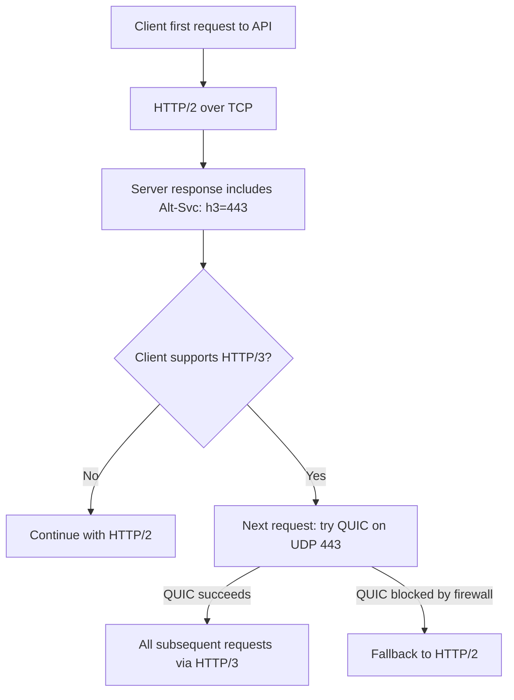

⚡ TL;DR - HTTP/3 replaces TCP+TLS with QUIC (UDP-
based transport designed by Google, standardized as
RFC 9000); core improvements: (1) eliminates TCP head-
of-line (HOL) blocking - a lost packet blocks all
streams in HTTP/2 but only one stream in QUIC; (2)
0-RTT connection establishment (no TCP handshake; TLS
1.3 built in; can send data in first packet); (3)
connection migration (connection ID instead of 5-tuple
- survives mobile WiFi↔4G switches); HTTP/3 is now
deployed on ~28% of top websites (2024); for APIs,
the primary benefit is mobile clients on lossy networks
(5G/WiFi handoff), not data center to data center.

---

| #053 | Category: HTTP & APIs | Difficulty: ★★★★ |
|:---|:---|:---|
| **Depends on:** | HTTP Request/Response Cycle, HTTP/2 and Multiplexing | |
| **Used by:** | gRPC vs REST Performance at Scale | |
| **Related:** | HTTP Request/Response Cycle, HTTP/2 and Multiplexing, HTTP Keep-Alive and Connection Reuse, gRPC vs REST Performance | |

---

### 🔥 The Problem This Solves

**WORLD WITHOUT IT:**
User on a commuter train using a mobile app. Network
alternates between WiFi (station platforms) and 4G
(between stations). With TCP: each network change
triggers a TCP reconnect (IP address changes → TCP
connection ID = 5-tuple including IP → all connections
reset). New TCP handshake: 1 RTT. TLS 1.2 handshake:
2 RTT. Total reconnect cost: 3 RTT = ~300ms on mobile.
If this happens 10 times on a commute: 3 seconds of
reconnect latency, plus whatever requests were in-
flight at disconnect time must be retried.

**THE BREAKING POINT:**
HTTP/2 was designed to solve the HTTP/1.1 multiple-
connection problem. It did: 6 connections → 1 connection
with multiplexed streams. But it introduced a new
problem: TCP HOL blocking. HTTP/2 sends all streams
over one TCP connection. If one TCP packet is lost,
TCP holds ALL streams until that packet is retransmitted.
One lost packet for stream 1 blocks streams 2-10 from
delivering their data even though they are complete.
On lossy mobile networks (2-5% packet loss), HTTP/2
can actually be slower than HTTP/1.1 with multiple
connections.

**THE INVENTION MOMENT:**
Google built QUIC (2013) for Chrome as an experimental
UDP-based transport. Key insight: TCP is in the kernel
and cannot be easily modified; QUIC implemented in
userspace on UDP can iterate rapidly. Key innovations:
(1) per-stream flow control (lost packet → only that
stream stalls); (2) connection ID-based (not IP-based)
sessions; (3) TLS 1.3 integrated into protocol (not
layered on top). IETF standardized it as RFC 9000
(QUIC) and RFC 9114 (HTTP/3) in 2021.

---

### 📘 Textbook Definition

**QUIC:** a general-purpose, UDP-based, multiplexed,
stream-oriented transport protocol. Connection
management uses Connection IDs (not IP:port 5-tuple).
Streams within a connection are independent - packet
loss on one stream does not block others. TLS 1.3
is integrated (not layered). Built-in 0-RTT for
resumed connections. **HTTP/3:** HTTP semantics (methods,
status codes, headers, frames) running over QUIC
instead of TCP+TLS. QPACK replaces HPACK for header
compression (accommodates out-of-order delivery, which
HPACK cannot handle). **Head-of-line blocking (HOL):**
TCP HOL: a lost packet blocks all subsequent data in
the stream until retransmitted. HTTP/2 over TCP:
all multiplexed streams blocked by one lost TCP
packet. QUIC HOL: a lost QUIC packet blocks only the
QUIC stream it belongs to; other streams proceed.
**0-RTT:** connection to a previously-visited server
can send application data in the first packet (using
session ticket from previous connection). Reduces cold
connection latency from 1 RTT (QUIC) to 0 RTT.
0-RTT has replay attack risks for mutating requests.

---

### ⏱️ Understand It in 30 Seconds

**One line:**
HTTP/3 runs HTTP over UDP instead of TCP, eliminating
the "one lost packet blocks everything" problem of
HTTP/2, and allowing connections to survive switching
between WiFi and 4G.

**One analogy:**
> HTTP/2 over TCP is like a highway with one shared
> lane: if one car (packet) breaks down, all cars
> behind it stop (HOL blocking). HTTP/3 over QUIC is
> like a highway with individually addressable lanes:
> if one car breaks down in lane 1, cars in lanes 2-10
> drive past it without stopping. Connection migration
> is like carrying your lane number (Connection ID)
> with you when you change highways (WiFi to 4G) -
> traffic continues without stopping to re-establish
> the highway connection.

**One insight:**
HTTP/3 does not help data center API traffic. If your
API is called from a server with a stable, low-latency
connection, you gain nothing from HTTP/3. The benefit
is specifically for mobile clients on lossy networks.
Data center-to-data center API calls on 100Gbps fiber
links: HTTP/2 is better (no UDP overhead, TCP is
optimally efficient). Mobile app to API on 4G/5G with
0.5-2% packet loss: HTTP/3 is significantly better.

---

### 🔩 First Principles Explanation

**TCP HOL vs QUIC stream independence:**

```
HTTP/2 over TCP (packet loss in stream 1):
                   LOST
Stream 1: [pkt1][pkt2][    ][pkt4] → stalled waiting
Stream 2: [pkt5][pkt6][pkt7][pkt8] → BLOCKED by TCP
Stream 3: [pkt9][pkA][pkB][pkC]    → BLOCKED by TCP

TCP: all data in order. pkt3 lost → buffer pkt4-pkC,
     wait for pkt3 retransmission. EVERYTHING waits.

QUIC (packet loss in stream 1):
                   LOST
Stream 1: [pkt1][pkt2][    ][pkt4] → stalled waiting
Stream 2: [pkt5][pkt6][pkt7][pkt8] → DELIVERED immediately
Stream 3: [pkt9][pkA][pkB][pkC]    → DELIVERED immediately

QUIC: stream-level ordering. pkt3 loss → only stream 1
      waits. Streams 2 and 3 proceed independently.
```

**Connection establishment comparison:**

```
TCP + TLS 1.3 (new connection):
Client → SYN
Server → SYN-ACK
Client → ACK + ClientHello (TLS)
Server → ServerHello + cert + Finished
Client → Finished + HTTP request
= 2 RTT before first response

QUIC (new connection, TLS 1.3 integrated):
Client → QUIC Initial (includes TLS ClientHello)
Server → QUIC Initial response (TLS ServerHello)
Client → HTTP/3 request (in first data packet)
= 1 RTT before first response

QUIC (resumed connection with 0-RTT):
Client → QUIC Initial + 0-RTT data (HTTP request)
         [using session ticket from previous connection]
Server → response
= 0 RTT round-trips before first response data
  (response arrives after 1 RTT but request sent at T=0)
```

---

### 🧪 Thought Experiment

**SCENARIO: 2% packet loss - HTTP/2 vs HTTP/3**

Setup: 10 concurrent HTTP requests. 100ms RTT. 2% loss.

**HTTP/2 over TCP:**
- All 10 requests share one TCP connection
- On average: 2 lost packets per 100 sent
- Each lost packet: TCP waits for retransmission (~100ms)
- HOL blocking: ALL 10 streams pause during retransmission
- Per-request latency increase: proportional to how
  often their data is near a lost packet in the stream
- At 2% loss: ~15% latency increase vs 0% loss

**HTTP/3 over QUIC:**
- All 10 requests in separate QUIC streams
- On average: 2 lost QUIC packets per 100 sent
- Each lost packet: only the affected stream waits
- Other 9 streams proceed unaffected
- Per-request latency increase: only if that specific
  stream has a packet loss
- At 2% loss: ~2% of requests see retransmit delay
- Overall average: <3% latency increase vs 0% loss

**Conclusion:** HTTP/3 degrades gracefully under loss.
HTTP/2 degrades catastrophically because all streams
share TCP's ordered delivery guarantee.

---

### 🧠 Mental Model / Analogy

> HTTP/2 over TCP is like a train: all passenger cars
> (streams) are coupled together. If the engine (TCP
> connection) hits a problem at one car (lost packet),
> the entire train stops. QUIC is like independent cars
> on parallel tracks: if one car hits a problem, the
> others keep moving on their own tracks.
> 
> Connection migration: TCP is like a phone number
> tied to your landline (IP:port). Change location →
> new number → call drops. QUIC is like a mobile number
> (Connection ID). Change location → same number →
> call continues.

---

### 📶 Gradual Depth - Five Levels

**Level 1 - What it is (anyone can understand):**
HTTP/3 is the latest version of HTTP. It runs on UDP
instead of TCP. The main benefit: if one small piece
of data is lost, only that piece waits for retransmission
- everything else keeps moving. Also: connections
survive switching between WiFi and 4G without dropping.

**Level 2 - How to use it (junior developer):**
For APIs: enable HTTP/3 on Nginx or Caddy (server
config). For clients: `httpx` supports HTTP/3 via
`httpx[http3]` package with `h3` transport. Most
browsers already use HTTP/3 for supported servers.
No API protocol changes needed: same endpoints,
methods, and status codes.

**Level 3 - How it works (mid-level engineer):**
QUIC runs over UDP but implements reliability itself:
sequence numbers, acknowledgments, retransmission -
but per-stream, not per-connection. Congestion control
is pluggable (BBR, CUBIC). Each QUIC stream has its
own flow control window. Lost QUIC packet: only blocks
the stream containing that packet, not the entire
connection. TLS 1.3 is part of the QUIC handshake
(not layered on top).

**Level 4 - Why it was designed this way (senior/staff):**
Running reliability over UDP in userspace was a
deliberate choice to escape "ossification": TCP has
so many deployed middleboxes (NATs, firewalls, proxies)
that adding new TCP options is nearly impossible
(middleboxes drop unknown options). UDP is less
intercepted. QUIC's design encrypts its own connection
metadata (ack numbers, sequence numbers) making QUIC
streams opaque to middleboxes - they cannot modify
QUIC packets without breaking the encryption.

**Level 5 - Mastery (distinguished engineer):**
QUIC's 0-RTT has a replay attack vulnerability: 0-RTT
data is not protected against replay by the server
(the server cannot distinguish a 0-RTT packet from
a replayed captured packet on the first exchange).
RFC 9001 mandates: 0-RTT must only be used for
idempotent requests (GET, HEAD). POST/PUT with 0-RTT
can result in duplicate execution if an attacker
replays the captured 0-RTT packet. API servers
implementing HTTP/3 must: (1) reject 0-RTT for
non-idempotent methods; (2) implement application-
layer idempotency keys for any operations sent early.

---

### ⚙️ How It Works (Mechanism)

**Enabling HTTP/3 on Nginx + Alt-Svc header:**

```nginx
# nginx.conf - HTTP/3 configuration
server {
    listen 443 ssl http2;
    listen 443 quic reuseport;  # HTTP/3 (QUIC) on UDP 443

    ssl_certificate /etc/ssl/cert.pem;
    ssl_certificate_key /etc/ssl/key.pem;

    # TLS 1.3 required for QUIC
    ssl_protocols TLSv1.3;

    # Tell clients HTTP/3 is available on same port
    add_header Alt-Svc 'h3=":443"; ma=86400';
    # Client reads this header, upgrades future requests

    location /api/ {
        proxy_pass http://backend;
    }
}
```

**httpx HTTP/3 client:**

```python
import httpx

# Install: pip install httpx[http3]
# Requires aioquic or httpx-http3
async def call_api_http3():
    # httpx automatically negotiates HTTP/3 if server
    # advertises it via Alt-Svc header
    async with httpx.AsyncClient(http3=True) as client:
        response = await client.get(
            "https://api.example.com/orders"
        )
        # Check protocol version used
        print(response.http_version)  # "HTTP/3" or "HTTP/2"
        return response.json()
```



---

### 🔄 The Complete Picture - End-to-End Flow

**QUIC connection lifecycle:**

```
NEW CONNECTION:
Client                              Server
  |-- QUIC Initial (TLS ClientHello)->|
  |<- QUIC Handshake (TLS ServerHello)|
  |-- QUIC Handshake (TLS Finished) ->|
  |-- Stream 0: GET /api/data ------->|  (1 RTT)
  |<- Stream 0: 200 OK + body --------|

RESUMED CONNECTION (0-RTT):
Client                              Server
  |-- QUIC Initial + 0-RTT data ----->|  (data included)
  |   [Stream 0: GET /api/data]
  |<- QUIC Handshake + response -------|  (0 RTT for request)

CONNECTION MIGRATION (WiFi -> 4G):
  Client IP changes from 192.168.1.5 to 10.0.0.2
  QUIC Connection ID: {abc123} stays the same
  |-- QUIC packet (from new IP, same CID) -->|
  |   Server recognizes Connection ID        |
  |<- Response (to new IP) ------------------|
  [Connection continues, no reconnect]
```

---

### 💻 Code Example

**Example 1 - BAD: Forcing HTTP/1.1 (missed optimization)**

```python
# BAD: Explicitly disabling HTTP/2 and HTTP/3
response = requests.get(
    "https://api.example.com/data",
    # No HTTP/2 or HTTP/3 support in requests lib anyway
    # But explicitly using old urllib3 with no TLS upgrade
)

# GOOD: httpx with HTTP/3 upgrade support
import httpx
async with httpx.AsyncClient(http3=True) as client:
    response = await client.get(
        "https://api.example.com/data"
    )
    # httpx negotiates highest available version
    print(response.http_version)  # HTTP/3 if available
```

---

**Example 2 - Alt-Svc Discovery (how clients learn HTTP/3)**

```python
# Server sends this header to advertise HTTP/3 support:
# Alt-Svc: h3=":443"; ma=86400, h3-29=":443"; ma=86400
# ma = max-age: client should remember for 86400 seconds

# Client implementation: check header, store, use next time
async def check_alt_svc(response: httpx.Response):
    alt_svc = response.headers.get("alt-svc", "")
    if "h3" in alt_svc:
        print("Server supports HTTP/3 - will use next time")
    # httpx handles this automatically when http3=True
```

---

### ⚖️ Comparison Table

| Feature | HTTP/1.1 | HTTP/2 | HTTP/3 |
|:---|:---|:---|:---|
| Transport | TCP | TCP | QUIC (UDP) |
| Multiplexing | No (6 connections) | Yes (streams) | Yes (streams) |
| HOL blocking | TCP + HTTP | TCP only | None |
| Connection migration | No | No | Yes (Connection ID) |
| 0-RTT | No | No | Yes (with session ticket) |
| TLS | Layered (optional) | Layered (required) | Integrated |
| Packet loss impact | Per-connection | All streams blocked | Per-stream only |
| Firewall/proxy compat | Excellent | Excellent | Good (some UDP blocked) |

---

### ⚠️ Common Misconceptions

| Misconception | Reality |
|:---|:---|
| HTTP/3 is always faster than HTTP/2 | On low-loss networks (data center, fiber broadband), HTTP/2 and HTTP/3 are equivalent or HTTP/2 is slightly faster (no UDP overhead). HTTP/3 significantly outperforms only on lossy networks (mobile, WiFi, satellite). Cloudflare's data: HTTP/3 P99 is 10-20% faster on mobile, negligible on desktop fiber. |
| HTTP/3 uses a different port | HTTP/3 typically uses the same port 443 as HTTPS (UDP 443 instead of TCP 443). Clients discover HTTP/3 support via the `Alt-Svc` header in the first HTTP/2 response, then upgrade. No port change required. |
| UDP means HTTP/3 is unreliable | QUIC implements its own reliable delivery, packet ordering, and retransmission on top of UDP. It is as reliable as TCP, but implements these features at the application/transport boundary instead of the OS kernel. The difference: reliability is per-stream, not per-connection. |
| HTTP/3 is not widely deployed | As of 2024: Cloudflare, Google, and Facebook serve HTTP/3 to all clients. Chrome, Firefox, Safari all support HTTP/3. ~28% of top websites support HTTP/3. For API servers: Nginx 1.25+, Caddy 2.x, and AWS CloudFront all support HTTP/3. |

---

### 🚨 Failure Modes & Diagnosis

**QUIC blocked by corporate firewall (UDP blocked)**

**Symptom:** HTTP/3 connection attempts fail. Clients
fall back to HTTP/2. Some clients never get HTTP/3
performance improvements. Alt-Svc header is present
but QUIC connections time out.

**Root Cause:** Many corporate firewalls block all UDP
traffic except DNS (port 53). QUIC on UDP 443 is
blocked. Clients fall back to HTTP/2 on TCP 443.

**Expected behavior:** This is correct. HTTP/3 is
designed with TCP fallback: if QUIC is blocked, the
browser/client retries with TCP. The `Alt-Svc` fallback
is the spec-mandated behavior. No fix needed: the
client handles fallback automatically. Monitor the
ratio of HTTP/3 vs HTTP/2 requests in your API logs
to see what percentage of clients use HTTP/3.

---

**0-RTT replay attack on non-idempotent endpoint**

**Symptom:** Duplicate POST requests creating duplicate
database records. Requests are identical in content,
arriving within milliseconds. Source is always a
resumed QUIC connection.

**Root Cause:** Client sends a POST via 0-RTT (which
is valid per client code). Server processes it. Attacker
captured the 0-RTT packet and replays it. Server
processes the replay as a new request.

**Fix:**
(1) Reject 0-RTT for non-idempotent methods:
```python
if request.http_version == "HTTP/3" and request.early_data:
    if request.method not in ("GET", "HEAD", "OPTIONS"):
        return Response(425, "Too Early")
        # 425 Too Early - RFC 8470 status code
```
(2) Add idempotency key enforcement for all POST/PUT
endpoints regardless of transport.

---

### 🔗 Related Keywords

**Prerequisites (understand these first):**
- `HTTP Request/Response Cycle` - HTTP semantics
  (unchanged in HTTP/3)
- `HTTP/2 and Multiplexing` - the problem HTTP/3 solves

**Builds On This (learn these next):**
- `gRPC vs REST Performance at Scale` - gRPC on HTTP/3
  eliminates gRPC's HTTP/2 HOL blocking concern

---

### 📌 Quick Reference Card

```
┌──────────────────────────────────────────────────────────┐
│ TRANSPORT    │ QUIC over UDP (not TCP)                   │
│              │ Implements reliability per stream         │
├──────────────┼───────────────────────────────────────────┤
│ HOL BLOCKING │ HTTP/2: all streams blocked by TCP loss  │
│              │ HTTP/3: only affected stream blocked      │
├──────────────┼───────────────────────────────────────────┤
│ 0-RTT        │ Resumed connections: send data in pkt 1  │
│              │ ONLY for idempotent requests (GET, HEAD)  │
├──────────────┼───────────────────────────────────────────┤
│ MIGRATION    │ Connection ID (not IP:port)               │
│              │ Survives WiFi↔4G switches                 │
├──────────────┼───────────────────────────────────────────┤
│ DISCOVERY    │ Server sends Alt-Svc header               │
│              │ Client upgrades next request to HTTP/3    │
├──────────────┼───────────────────────────────────────────┤
│ WHEN TO USE  │ Mobile clients on lossy networks          │
│              │ NOT data center to data center (use HTTP/2)│
├──────────────┼───────────────────────────────────────────┤
│ ONE-LINER    │ "UDP transport that fixes HTTP/2 HOL      │
│              │ blocking and survives network changes"    │
└──────────────────────────────────────────────────────────┘
```

**If you remember only 3 things:**
1. QUIC over UDP eliminates TCP HOL blocking: a lost
   packet blocks only the affected stream, not all
   streams - critical for mobile on lossy networks.
2. Connection migration: Connection IDs survive IP
   address changes (WiFi↔4G) without reconnecting.
3. 0-RTT is safe only for idempotent requests (GET,
   HEAD). POST via 0-RTT is vulnerable to replay attacks.

---

### 💎 Transferable Wisdom

**Reusable Engineering Principle:**
"The protocol layer you choose determines your failure
characteristics." HTTP/2 over TCP chose reliability
at the transport layer (TCP guarantees). This came
with HOL blocking as an emergent consequence. QUIC
chose reliability at the stream layer (stream-level
acks), accepting UDP unreliability at the packet layer.
This eliminated HOL blocking. The lesson: when designing
layered systems, understand which failures the lower
layer introduces (TCP → HOL) and whether a different
layer design eliminates them (QUIC → stream independence).
This thinking applies to message queues (Kafka: ordered
within partition, not across - partitioning is your
HOL isolation), database replication (log-based: HOL
if primary is slow; parallel replication: stream-
independent), and storage systems (SSTable compaction:
reads blocked during compaction vs LSM tree stream-
independent reads).

**Where else this pattern applies:**
- SCTP (Stream Control Transmission Protocol): earlier
  attempt at multi-stream transport, less successful
  due to middlebox problems that QUIC solved with UDP
- WebTransport: HTTP/3 protocol for bidirectional
  streams (replaces WebSocket with QUIC semantics)
- QUIC in gRPC: gRPC over HTTP/3 eliminates gRPC's
  remaining HOL blocking problem

---

### 💡 The Surprising Truth

HTTP/3 was deployed to billions of users BEFORE it
was standardized. Google deployed QUIC in Chrome and
to all Google servers in 2013. By the time RFC 9000
was published in 2021, QUIC was already serving 35%
of all internet traffic (Google's own traffic). This
is unprecedented in protocol history: normally IETF
standardizes → vendors implement → deployment follows.
QUIC reversed this: large-scale deployment proved
QUIC was practical, then standardization formalized it.
The implication: when Google says a new technology is
important, they sometimes deploy it to production at
scale before the standard is finalized. QUIC's unusual
deployment history is why its implementation details
(especially QPACK vs HPACK) were shaped by operational
experience rather than theoretical design.

---

### ✅ Mastery Checklist

**You've mastered this when you can:**
1. **EXPLAIN** TCP HOL blocking in HTTP/2 and how QUIC
   solves it with per-stream packet loss independence.
2. **CONFIGURE** HTTP/3 on Nginx with QUIC support and
   `Alt-Svc` header for client discovery.
3. **IDENTIFY** When HTTP/3 provides benefit (mobile,
   lossy networks) vs when HTTP/2 is sufficient
   (data center, stable connections).
4. **SECURE** 0-RTT by rejecting early data for non-
   idempotent requests (return 425 Too Early).
5. **DIAGNOSE** QUIC blocked by corporate firewall and
   explain why automatic TCP fallback is the
   correct expected behavior.

---

### 🎯 Interview Deep-Dive

**Q1: What is head-of-line blocking and how does HTTP/3
solve it?**

*Why they ask:* Tests depth of HTTP/2 vs HTTP/3 knowledge.

*Strong answer includes:*
- TCP HOL blocking: TCP guarantees ordered delivery.
  Packet 5 lost → TCP buffers packets 6-100, waiting
  for retransmission of packet 5. Nothing else can
  proceed until the gap is filled.
- HTTP/2 + TCP HOL: HTTP/2 streams (stream 1, 2, 3)
  are multiplexed over one TCP connection. One lost
  TCP packet carrying stream 1 data → ALL streams
  (1, 2, 3) blocked. HTTP/2 solved the HTTP-layer HOL
  (6 connections → 1) but the TCP-layer HOL remains.
- QUIC HOL elimination: QUIC has stream-level packet
  acknowledgment. Lost QUIC packet → only the QUIC
  stream that contained that packet is blocked.
  Other streams continue. QUIC "stream 1's packet 5
  was lost" does not affect "stream 2's packet 5."
- Real-world impact: 2% packet loss on mobile. HTTP/2:
  at any given moment, one of 10 streams has a lost
  packet, HOL blocks all 10. Latency impact scales
  with number of multiplexed streams. QUIC: 2% of
  streams experience retransmit delay. 98% proceed
  unaffected.

**Q2: What is QUIC connection migration and when is
it valuable?**

*Why they ask:* Tests knowledge of QUIC's mobile
optimization.

*Strong answer includes:*
- TCP connection ID = 5-tuple (src IP, src port,
  dst IP, dst port, protocol). Change any component
  → connection dropped → full TCP+TLS reconnect.
- QUIC connection ID = opaque identifier chosen by
  server, independent of network path. Survives IP
  address changes.
- Mobile use case: phone switches from home WiFi
  (192.168.1.5) to 4G (10.0.0.7). TCP: all connections
  drop, reconnect. QUIC: client sends QUIC packet from
  new IP with same Connection ID. Server recognizes
  the Connection ID, continues the session from the
  new IP.
- Reconnect cost savings: TCP+TLS 1.3 reconnect = 2
  RTT (~200ms on 4G). QUIC migration = 0 RTT overhead
  (next packet just arrives from new IP).
- API use case: any mobile API (food delivery, ride
  sharing, navigation) where the user is moving. 
  10-20 WiFi↔4G transitions per hour → each saves 200ms.

**Q3: Should you implement HTTP/3 for an internal
microservices API?**

*Why they ask:* Tests judgment - when is a technology
appropriate vs inappropriate.

*Strong answer includes:*
- No, for most internal microservices. HTTP/3's benefits
  target lossy, mobile, variable-latency networks.
  Data center networks: <0.01% packet loss, <0.5ms RTT,
  stable connections. HTTP/2 is optimal here: ordered
  TCP delivery has zero HOL cost at 0.01% loss; QUIC
  has marginally higher CPU overhead (userspace vs
  kernel TCP); no connection migration needed (servers
  do not switch networks).
- Exception: if the microservice communicates across
  regions over the public internet (cross-region gRPC
  calls), and the path has measurable packet loss
  (>0.1%), HTTP/3 could improve tail latency.
- For public-facing APIs with mobile clients: yes,
  enable HTTP/3 on your edge (CDN/API gateway). Let
  CDN terminate HTTP/3; your internal services use
  HTTP/2. No change to microservice communication.
- Implementation: Cloudflare, Fastly, AWS CloudFront
  all support HTTP/3 at the edge. Enable it there.
  Do not change internal service communication
  unless you have measured evidence of benefit.
