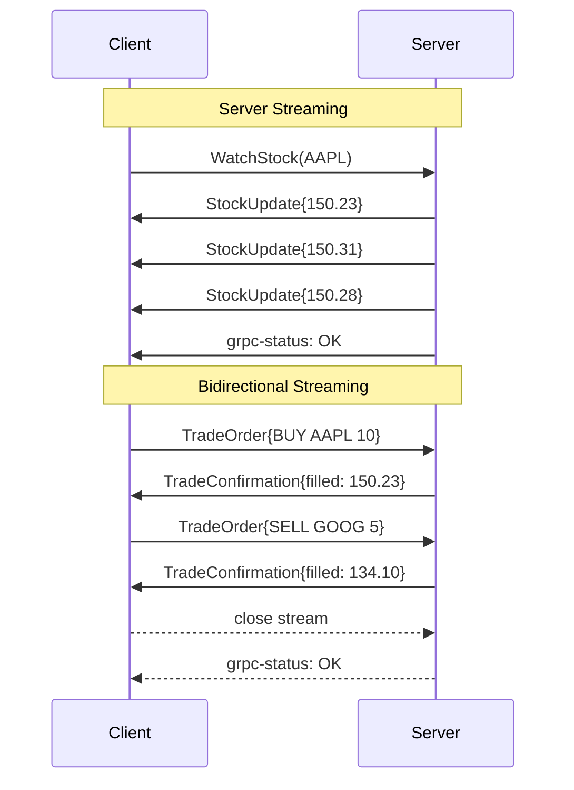

⚡ TL;DR - gRPC defines four RPC types: unary (one
request, one response - like REST); server streaming
(one request, stream of responses - like SSE but
binary/typed); client streaming (stream of requests,
one response - useful for chunked uploads); bidirectional
streaming (both sides stream simultaneously - for
real-time bidirectional communication at low latency);
all streaming types share one HTTP/2 connection;
server streaming is the most commonly used (replacing
polling for live data); bidirectional is the hardest
to implement correctly (error handling, backpressure,
stream cancellation).

---

| #054 | Category: HTTP & APIs | Difficulty: ★★★★ |
|:---|:---|:---|
| **Depends on:** | gRPC and Protocol Buffers, Long Polling vs SSE vs WebSocket | |
| **Used by:** | gRPC vs REST Performance at Scale, gRPC Service Evolution | |
| **Related:** | gRPC and Protocol Buffers, Long Polling/SSE/WebSocket, gRPC vs REST Performance, GraphQL vs REST vs gRPC, gRPC Service Evolution | |

---

### 🔥 The Problem This Solves

**WORLD WITHOUT IT:**
ML inference service needs to stream model output
tokens to the client as they are generated (think:
ChatGPT streaming text). Options with REST: (1) client
polls every 100ms (high overhead, 100ms latency per
token chunk); (2) SSE (one-way, no client control,
text-only, no binary efficiency); (3) WebSocket (works
but requires separate WebSocket infrastructure, no
type safety, no Protobuf serialization).

**THE BREAKING POINT:**
Log ingestion: client sends 1 billion log events per
day to a central analytics service. With unary gRPC
(one request per event): 1 billion HTTP/2 round trips.
With client streaming: client opens one gRPC stream,
sends 1 billion events as a stream, server acknowledges
at the end. 1 connection vs 1 billion connections.
For high-volume data ingestion, streaming is not
optional.

**THE INVENTION MOMENT:**
Google's internal RPC framework (Stubby) always
supported streaming - Google's infrastructure is
fundamentally stream-oriented (MapReduce, search
index pipelines, YouTube ingestion). gRPC open-sourced
this as four streaming modes over HTTP/2 streams.
The key insight: HTTP/2's stream abstraction maps
directly to gRPC's streaming RPC types. HTTP/2 stream
= gRPC stream = Protobuf message sequence with proper
framing.

---

### 📘 Textbook Definition

**gRPC RPC types:**

**Unary:** `rpc GetUser(GetUserRequest) returns (UserResponse)`.
Single request message, single response message.
Equivalent to a REST GET. Uses one HTTP/2 stream.

**Server streaming:** `rpc ListUsers(ListRequest)
returns (stream UserResponse)`. Single request;
server sends multiple responses over one HTTP/2
stream. Server sends each response message as a
separate Protobuf frame. Client reads until stream
ends (STATUS message from server) or error. Equivalent
to SSE but binary and typed.

**Client streaming:** `rpc UploadLogs(stream LogEvent)
returns (UploadSummary)`. Client sends multiple
messages; server reads all and returns one response.
Equivalent to chunked HTTP PUT. One HTTP/2 stream.

**Bidirectional streaming:** `rpc Chat(stream
ChatMessage) returns (stream ChatResponse)`. Both
sides send messages freely. Full-duplex over one
HTTP/2 stream. Both sides use `stream.Write()` and
`stream.Read()` concurrently.

**Framing:** each gRPC message is prefixed with a
5-byte header: 1 byte compression flag + 4 bytes
message length. Enables reading complete messages
from a stream without delimiters.

---

### ⏱️ Understand It in 30 Seconds

**One line:**
gRPC streaming extends RPC to allow one call to
deliver many messages over a single connection -
server push, client upload stream, or full two-way
real-time communication.

**One analogy:**
> The four gRPC types map to four conversation styles.
> Unary: you ask a question, get one answer. Server
> streaming: you ask for a news feed, server sends
> stories as they happen (one question, many answers).
> Client streaming: you dictate a long document while
> the server transcribes - you speak continuously,
> server confirms at the end. Bidirectional: a phone
> call - both sides speak and listen simultaneously
> in real time.

**One insight:**
Server streaming gRPC is often the right tool where
SSE is typically used. They solve the same problem
(server push to client) but gRPC gives you: type
safety (Protobuf schema), binary encoding (smaller
messages than JSON/text-event-stream), two-way error
propagation (rich gRPC status codes), and multiplexing
over HTTP/2 alongside other gRPC calls. The tradeoff:
SSE works in any browser with a URL; server streaming
gRPC requires a gRPC client library. For internal
service-to-service streaming: gRPC. For browser
clients: SSE or WebSocket.

---

### 🔩 First Principles Explanation

**gRPC stream framing over HTTP/2:**

```
HTTP/2 frame structure (simplified):
[LENGTH: 3B][TYPE: 1B][FLAGS: 1B][STREAM_ID: 4B][PAYLOAD]

gRPC message framing within HTTP/2 DATA frame:
[COMPRESS_FLAG: 1B][MESSAGE_LENGTH: 4B][PROTOBUF_BYTES...]

Server streaming - HTTP/2 wire:
Client sends:  HTTP/2 HEADERS (POST /service/Method)
               + HTTP/2 DATA (gRPC request message)
               + END_STREAM flag (client done sending)

Server sends:  HTTP/2 DATA (gRPC response 1)
               HTTP/2 DATA (gRPC response 2)
               ...
               HTTP/2 DATA (gRPC response N)
               HTTP/2 HEADERS (grpc-status: 0 = OK)
               + END_STREAM flag (server done sending)

Bidirectional streaming - HTTP/2 wire:
Client:  HEADERS (POST) → DATA msg1 → DATA msg2 → ...
Server:  HEADERS (200)  → DATA rsp1 → DATA rsp2 → ...
         (both sides interleaved, no turn-taking)
```

---

### 🧪 Thought Experiment

**SCENARIO: Real-time stock price service**

Requirement: 10,000 clients subscribe to 100 stock
prices each. Server pushes updates at 1,000 updates/s.

**Option A: REST polling**
- Each client polls `/stocks` every 100ms
- 10,000 clients × 10 req/s = 100,000 HTTP req/s
- Each response: JSON array of 100 stocks = ~5KB
- Bandwidth: 100,000 × 5KB = 500 MB/s
- Latency: up to 100ms (polling interval)

**Option B: SSE**
- Each client opens one SSE connection
- 10,000 SSE connections to server
- Server pushes JSON when prices change
- Bandwidth: only changed data (delta)
- Latency: ~5ms (real-time push)
- Limitation: text-only JSON, no field filtering

**Option C: gRPC server streaming**
- Each client opens one gRPC server stream
- Protobuf-encoded delta updates (50 bytes vs 5KB)
- 10,000 HTTP/2 streams (multiplexed across connections)
- Bandwidth: 1,000 updates/s × 50 bytes = 50 KB/s
- Latency: ~1ms
- Bonus: type-safe, field masks for filtering, backpressure

gRPC server streaming wins for high-frequency, typed,
binary data to many concurrent subscribers.

---

### 🧠 Mental Model / Analogy

> gRPC streaming types are four types of pipe
> configurations. Unary: pour a cup, get a cup back
> (one in, one out). Server streaming: open a faucet
> - one trigger, continuous flow until done (one in,
> many out). Client streaming: fill a pool - pour water
> continuously, get confirmation when full (many in,
> one out). Bidirectional: two faucets, two drains
> running simultaneously - both sides produce and
> consume in real time.

---

### 📶 Gradual Depth - Five Levels

**Level 1 - What it is (anyone can understand):**
Normal API calls: one question, one answer. gRPC
streaming lets you keep the connection open and
exchange multiple messages in sequence, or both ways
at once. Useful for: live data feeds (server streaming),
uploading big files in chunks (client streaming),
chat apps (bidirectional).

**Level 2 - How to use it (junior developer):**
Add `stream` keyword to `.proto` definition. Use
`for await` loop to receive server-streamed messages.
For client streaming: call `stream.write(message)`
repeatedly, then `stream.done_writing()`. For bidirectional:
run two concurrent loops: one for reading, one for writing.

**Level 3 - How it works (mid-level engineer):**
Each streaming message is a separate Protobuf frame
(5-byte header + message bytes) sent in a HTTP/2 DATA
frame. Server streaming: client sends one HTTP/2
request with END_STREAM. Server sends multiple DATA
frames, each with one Protobuf message, then closes
with status headers. gRPC flow control: application-
level flow control on top of HTTP/2 flow control.

**Level 4 - Why it was designed this way (senior/staff):**
gRPC streaming maps directly to HTTP/2's stream
multiplexing. A "stream" in gRPC is an HTTP/2 stream
(integer ID). Bidirectional gRPC uses one HTTP/2
stream for both directions (full-duplex within the
stream). This is only possible because HTTP/2 streams
are full-duplex at the framing layer. Each gRPC
message boundary is explicit (5-byte length prefix)
so partial messages can be buffered and reassembled.

**Level 5 - Mastery (distinguished engineer):**
Bidirectional streaming with backpressure is the
hardest gRPC pattern to implement correctly. If the
server generates messages faster than the client
consumes them, the HTTP/2 flow control window fills,
and the server blocks on `stream.Send()`. Application
code must handle this blocking properly (async, with
context cancellation). The correct pattern: server
checks `context.Done()` in its send loop - if the
context is cancelled (client disconnected or deadline
exceeded), immediately return and release resources.
Missing this: server goroutine leaks, filling heap
with unsent messages.

---

### ⚙️ How It Works (Mechanism)

**Python grpc streaming examples (all four types):**

```python
# service.proto
# service StockService {
#   rpc GetStock(StockRequest)          // Unary
#     returns (StockResponse);
#   rpc WatchStock(StockRequest)        // Server stream
#     returns (stream StockUpdate);
#   rpc BulkIngest(stream LogEvent)    // Client stream
#     returns (IngestSummary);
#   rpc TradingSession(               // Bidirectional
#     stream TradeOrder)
#     returns (stream TradeConfirmation);
# }

import grpc
from concurrent import futures

class StockServiceServicer(StockServiceServicer):

    # 1. UNARY - one request, one response
    def GetStock(self, request, context):
        price = get_price(request.symbol)
        return StockResponse(symbol=request.symbol,
                             price=price)

    # 2. SERVER STREAMING - one request, many responses
    def WatchStock(self, request, context):
        for update in price_feed(request.symbol):
            if context.is_active():  # Check if client connected
                yield StockUpdate(
                    symbol=request.symbol,
                    price=update.price,
                    timestamp=update.ts
                )
            else:
                break  # Client disconnected: stop generating
        # After loop: gRPC sends status OK automatically

    # 3. CLIENT STREAMING - many requests, one response
    def BulkIngest(self, request_iterator, context):
        count = 0
        errors = 0
        for log_event in request_iterator:
            try:
                store_log(log_event)
                count += 1
            except Exception:
                errors += 1
        return IngestSummary(
            total=count + errors,
            success=count,
            failed=errors
        )

    # 4. BIDIRECTIONAL STREAMING
    def TradingSession(self, request_iterator, context):
        for order in request_iterator:
            if not context.is_active():
                return  # Client disconnected
            result = process_trade(order)
            yield TradeConfirmation(
                order_id=order.id,
                status=result.status,
                filled_price=result.price
            )
```



---

### 🔄 The Complete Picture - End-to-End Flow

**Server streaming client (Python async):**

```python
import grpc
import asyncio

async def watch_stock_prices(symbol: str):
    async with grpc.aio.insecure_channel(
        "localhost:50051"
    ) as channel:
        stub = StockServiceStub(channel)
        # Deadline: stream will auto-cancel after 60s
        async for update in stub.WatchStock(
            StockRequest(symbol=symbol),
            timeout=60
        ):
            print(f"{update.symbol}: ${update.price}")
            # Backpressure: processing time here
            # will slow the stream if server checks
            # context.is_active()
```

**Client streaming upload:**

```python
async def bulk_upload_logs(events: list[LogEvent]):
    async with grpc.aio.insecure_channel(
        "localhost:50051"
    ) as channel:
        stub = LogServiceStub(channel)

        async def generate_events():
            for event in events:
                yield event
                await asyncio.sleep(0)  # Yield to event loop

        summary = await stub.BulkIngest(generate_events())
        print(f"Uploaded: {summary.success}/{summary.total}")
```

---

### 💻 Code Example

**Example 1 - BAD: Polling vs server streaming**

```python
# BAD: Polling for real-time data
async def poll_stock_bad(symbol: str):
    while True:
        response = await http_client.get(
            f"/stocks/{symbol}"
        )
        price = response.json()["price"]
        await asyncio.sleep(0.1)  # 100ms polling interval

# GOOD: gRPC server streaming
async def watch_stock_good(symbol: str):
    async for update in stub.WatchStock(
        StockRequest(symbol=symbol)
    ):
        price = update.price  # Pushed when it changes
        # 1ms latency, no wasted requests, binary encoding
```

---

**Example 2 - Context cancellation check in server stream**

```python
# GOOD: Always check context in streaming server
def WatchStock(self, request, context):
    for update in price_feed(request.symbol):
        # CRITICAL: Check before yielding
        if not context.is_active():
            return  # Client gone: stop immediately
        try:
            yield StockUpdate(price=update.price)
        except grpc.RpcError:
            return  # Network error: stop

# BAD: Missing context check (goroutine/thread leak)
def WatchStock_bad(self, request, context):
    for update in price_feed(request.symbol):
        yield StockUpdate(price=update.price)
        # If client disconnects: price_feed keeps running
        # Thread blocked on yield forever (or until
        # price_feed exhausts - potentially never)
```

---

### ⚖️ Comparison Table

| Type | Request | Response | Use Case |
|:---|:---|:---|:---|
| Unary | One message | One message | Standard CRUD, auth, lookup |
| Server streaming | One message | Many messages | Live feeds, notifications, log tailing |
| Client streaming | Many messages | One message | Bulk upload, telemetry ingestion, chunked file upload |
| Bidirectional | Many messages | Many messages | Trading, collaboration, gaming, bidirectional proxy |

---

### ⚠️ Common Misconceptions

| Misconception | Reality |
|:---|:---|
| Server streaming gRPC is like SSE | Same concept (server push), very different implementation. SSE is text-only, HTTP/1.1 compatible, browser-native with `EventSource`. gRPC server streaming is binary (Protobuf), requires HTTP/2, requires gRPC client library. Not browser-native without grpc-web. For browser clients: SSE. For service-to-service: gRPC streaming. |
| Bidirectional streaming means both sides send simultaneously | Both sides CAN send simultaneously (full-duplex), but application code determines when each side sends. Many "bidirectional" use cases are actually turn-based (client sends request, server sends response, repeat). True simultaneous bidirectional is needed for real-time collaboration where either side can send at any time. |
| gRPC streams use multiple connections | All gRPC stream types use one HTTP/2 connection with multiple HTTP/2 streams (integers). 1000 concurrent gRPC server streaming subscriptions = 1000 HTTP/2 streams but typically only 1-10 TCP connections. This is the fundamental efficiency gain over WebSocket (which requires one TCP connection per stream for most implementations). |
| Client streaming response comes after all messages | The server can send the response as soon as it has enough information, before the client closes the stream. More commonly: server waits for the client to close the stream (send all messages), then sends the response. This is configurable in the server implementation. |

---

### 🚨 Failure Modes & Diagnosis

**Stream goroutine leak (missing context check)**

**Symptom:** gRPC server memory usage grows continuously
during streaming. Eventually OOM. Correlation: memory
growth matches number of active streaming RPCs that
were cancelled by clients.

**Root Cause:** Server streaming generator does not
check `context.is_active()`. When a client disconnects
(timeout, navigation, crash), the gRPC framework
cancels the context but the server's Python generator
keeps running and trying to `yield` into a closed
stream. The generator's thread/coroutine leaks until
the generator completes naturally.

**Diagnosis:**
```python
# Add to server streaming methods:
import logging
logger = logging.getLogger(__name__)

def WatchStock(self, request, context):
    total = 0
    for update in price_feed(request.symbol):
        if not context.is_active():
            logger.info(
                "Client disconnected after %d updates", total
            )
            return  # CRITICAL: explicit return
        yield StockUpdate(price=update.price)
        total += 1
```

Monitor: add Prometheus gauge for active streaming RPC
count. If it grows monotonically (never decreases),
you have a leak.

---

**gRPC deadline exceeded mid-stream**

**Symptom:** Long-running server streams fail with
`DEADLINE_EXCEEDED` (status code 4) after exactly N
seconds. All clients with streams lasting longer than
N seconds are affected.

**Root Cause:** Default gRPC deadline (timeout) is
propagated as an HTTP/2 `grpc-timeout` header. If
client sets `timeout=30s`, all streaming calls lasting
more than 30 seconds are killed by the framework.

**Fix:**
For long-lived streams: use a longer deadline or no
deadline for subscription streams. The client controls
the deadline:
```python
# Python client: no deadline for indefinite subscription
async for update in stub.WatchStock(
    StockRequest(symbol=symbol)
    # No timeout= parameter: runs until cancelled or error
):
    process(update)
```
For tailing/subscription use cases, the stream should
be cancelled explicitly when done (context manager or
`cancel()` call), not via deadline.

---

### 🔗 Related Keywords

**Prerequisites (understand these first):**
- `gRPC and Protocol Buffers` - gRPC fundamentals,
  Protobuf serialization
- `Long Polling vs SSE vs WebSocket` - alternatives
  to server streaming

**Builds On This (learn these next):**
- `gRPC vs REST Performance at Scale` - streaming
  as a performance factor
- `gRPC Service Evolution` - how streaming RPCs
  evolve without breaking clients

---

### 📌 Quick Reference Card

```
┌──────────────────────────────────────────────────────────┐
│ UNARY        │ 1 req → 1 resp; like REST                 │
│ SERVER STREAM│ 1 req → N resp; like SSE but binary       │
│ CLIENT STREAM│ N req → 1 resp; bulk upload               │
│ BIDI STREAM  │ N req → N resp; full-duplex chat/collab   │
├──────────────┼───────────────────────────────────────────┤
│ ALL TYPES    │ Share one HTTP/2 connection               │
│              │ Multiplexed (many streams, few sockets)   │
├──────────────┼───────────────────────────────────────────┤
│ CRITICAL     │ Always check context.is_active() in       │
│              │ server-side stream generator              │
│              │ Missing = thread/goroutine leak           │
├──────────────┼───────────────────────────────────────────┤
│ FRAMING      │ 5-byte header + Protobuf bytes per message│
│              │ Enables partial message buffering         │
├──────────────┼───────────────────────────────────────────┤
│ ONE-LINER    │ "Four RPC modes: 1:1, 1:N, N:1, N:N      │
│              │ all over one HTTP/2 connection"           │
└──────────────────────────────────────────────────────────┘
```

**If you remember only 3 things:**
1. Server streaming is gRPC's answer to SSE: binary,
   typed, multiplexed - use it for service-to-service
   real-time data (not browser clients).
2. Always check `context.is_active()` in server
   streaming generators to prevent goroutine/thread
   leaks when clients disconnect.
3. All four streaming types share one HTTP/2 connection
   with multiplexed streams - not separate connections.

---

### 💎 Transferable Wisdom

**Reusable Engineering Principle:**
"Match the communication pattern to the RPC type."
The four gRPC streaming types enumerate all possible
message flow patterns between two endpoints. This
taxonomy (1:1, 1:N, N:1, N:N) appears in many contexts:
database queries (single row: unary; streaming result
set: server streaming); file transfer (download one
file: unary; streaming media: server streaming; upload
in chunks: client streaming; bidirectional sync:
bidirectional); message queue consumer (poll one:
unary; subscribe: server streaming; publish batch:
client streaming; request/reply over queue:
bidirectional). Whenever designing a service interface,
ask: "What is the cardinality of the message flow?"
and choose the corresponding pattern.

**Where else this pattern applies:**
- Kafka: producer (client streaming equivalent);
  consumer (server streaming equivalent); Kafka Streams
  (bidirectional: read-process-write)
- Database streaming: `COPY` in PostgreSQL (client
  streaming for bulk insert); cursor-based pagination
  (server streaming equivalent)
- WebSocket protocol: closest to bidirectional streaming
  but without gRPC's type safety and flow control

---

### 💡 The Surprising Truth

gRPC bidirectional streaming is rarely the right tool
despite being the most impressive-sounding type.
Google's own internal usage data (from their SRE blog):
~85% of gRPC calls are unary, ~13% server streaming,
~1.5% client streaming, ~0.5% bidirectional. The reason
bidirectional is rarely used: it is the hardest to
implement correctly (error propagation from both sides,
backpressure, half-close semantics, ordering guarantees
when both sides send simultaneously). Most "real-time
bidirectional" use cases can be decomposed into:
(1) server streaming for server push, plus (2) unary
RPC for client actions. The decomposed approach is
simpler to implement, debug, and scale independently.
Use bidirectional streaming when the interaction truly
requires interleaved, ordered messages from both sides
simultaneously (not just "both sides communicate").

---

### ✅ Mastery Checklist

**You've mastered this when you can:**
1. **DEFINE** All four gRPC streaming types in a
   `.proto` file (`stream` keyword placement).
2. **IMPLEMENT** Server streaming Python servicer with
   `context.is_active()` check in the generator loop.
3. **CHOOSE** Between server streaming gRPC and SSE
   based on client type (browser vs service) and
   data format requirements.
4. **DIAGNOSE** Goroutine/thread leak in server
   streaming from missing context cancellation check.
5. **EXPLAIN** How all streaming types share one HTTP/2
   connection and why this is more efficient than
   multiple TCP connections.

---

### 🎯 Interview Deep-Dive

**Q1: When would you use server streaming gRPC vs SSE?**

*Why they ask:* Tests trade-off reasoning on real-time patterns.

*Strong answer includes:*
- SSE: browser clients (native `EventSource` API),
  text-based data (JSON events), works through HTTP
  proxies without special config, HTTP/1.1 compatible.
- gRPC server streaming: service-to-service, binary
  data (Protobuf = 3-10× smaller than JSON), type
  safety (schema-enforced), multiplexed (many streams
  per connection), backpressure (flow control),
  richer error codes.
- Decision: browser client → SSE; internal service
  client → gRPC server streaming; browser + Protobuf
  → grpc-web (with proxy, not native browser HTTP/2).
- Concrete example: real-time stock prices pushed to
  a web dashboard → SSE (browser). Real-time order
  events from order service to fulfillment service →
  gRPC server streaming (service-to-service, typed,
  binary).

**Q2: What happens to a gRPC server stream when the
client disconnects?**

*Why they ask:* Tests understanding of error handling
and resource cleanup.

*Strong answer includes:*
- Framework behavior: gRPC framework detects client
  disconnect (HTTP/2 RST_STREAM frame or TCP close)
  and cancels the server-side context.
- `context.is_active()` returns `False`. Any pending
  `yield` into a cancelled stream raises `RpcError`.
- Application responsibility: server streaming
  generators MUST check `context.is_active()` before
  each yield, or use `try/except grpc.RpcError`.
  Without this: generator continues consuming resources
  (CPU, memory, external connections like DB cursors)
  until it naturally completes or the server process
  restarts.
- Resource leak: if the generator holds a database
  connection or an external API subscription, not
  checking context → resource held until the generator
  finishes (potentially forever for infinite streams).
- Pattern:
  ```python
  for item in data_source:
      if not context.is_active():
          cleanup_resources()
          return  # Release resources immediately
      yield convert(item)
  ```

**Q3: How would you design a real-time order tracking
system using gRPC streaming?**

*Why they ask:* System design with gRPC streaming.

*Strong answer includes:*
- .proto design: `rpc TrackOrder(TrackOrderRequest)
  returns (stream OrderUpdate)`. Request: `{order_id}`.
  Update: `{status, location, estimated_arrival,
  timestamp}`.
- Server implementation: subscribe to order events
  (Redis Pub/Sub on `order:{order_id}:updates`). Yield
  each event to the gRPC stream. Check context before
  each yield.
- Backpressure: if client is slow to consume updates,
  HTTP/2 flow control fills; server blocks on yield.
  Mitigation: drop non-critical updates (location
  precision) when backpressure detected. Keep only
  high-priority updates (status changes).
- Horizontal scaling: each server instance handles
  some connected clients. Redis Pub/Sub ensures order
  updates reach all instances. Each instance sends
  to its connected clients.
- Reconnect: client stores last received `sequence_id`.
  On reconnect: sends `TrackOrderRequest{order_id,
  last_seq_id}`. Server replays missed events from
  event log (last 10 events stored in Redis list per
  order). After replay: switches to live Redis Pub/Sub.
  No missed updates on reconnect.
