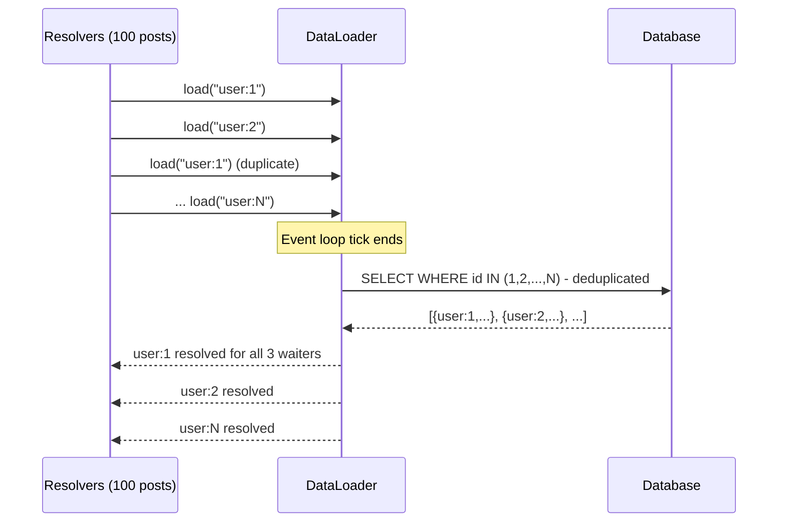

⚡ TL;DR - The N+1 problem: fetching 1 list of N items
triggers N additional queries (one per item) because
each resolver runs independently; example: list 100
posts → 1 query for posts, then 100 queries for each
post's author → 101 total queries instead of 2;
DataLoader solves this with two techniques: (1)
batching - collect all IDs requested during one
execution tick, fire one `SELECT WHERE id IN (...)`,
(2) caching - deduplicate requests for the same ID
within one request; DataLoader is the standard pattern
for GraphQL N+1 prevention and is available for all
major languages.

---

| #055 | Category: HTTP & APIs | Difficulty: ★★★ |
|:---|:---|:---|
| **Depends on:** | GraphQL Query Language, GraphQL Schema Design | |
| **Used by:** | GraphQL Federation, GraphQL vs REST vs gRPC Decision Framework | |
| **Related:** | GraphQL Query Language, GraphQL Schema Design, GraphQL Federation, GraphQL vs REST vs gRPC | |

---

### 🔥 The Problem This Solves

**WORLD WITHOUT IT:**
GraphQL schema: Post type has `author: User` field.
Resolver for `author`:
```python
def resolve_author(post, info):
    return db.query(User).filter_by(id=post.author_id).first()
```
Query: `{ posts { id title author { name } } }`
Server fetches: 1 query → 100 posts. Then: 100
individual queries for each post's author.
Total: 101 queries. With REST: 1 query for posts with
JOIN on users: 1 query total. GraphQL's resolver-per-
field architecture makes this N+1 pattern the default.

**THE BREAKING POINT:**
Production GraphQL server. No DataLoader. Client
sends `{ users { id name posts { id title comments {
id body author { name } } } } }`. With 100 users,
each with 10 posts, each with 5 comments:
- 1 query: users (100)
- 100 queries: posts per user
- 1,000 queries: comments per post
- 5,000 queries: author per comment
= 6,101 database queries for one GraphQL request.
REST with proper JOINs: 4-6 queries. Database
overloaded, query timeout after 30 seconds.

**THE INVENTION MOMENT:**
Lee Byron (Facebook) created DataLoader in 2015.
Key insight: GraphQL resolvers execute in breadth-
first phases (all resolvers at depth 1, then depth 2,
etc.). Within one phase, all `author` resolver calls
happen synchronously before the event loop advances.
A DataLoader batches all load calls queued in one
event loop tick, then dispatches ONE batch query for
all collected IDs. Resolution: O(N) queries → O(1)
batch query per resolver type.

---

### 📘 Textbook Definition

**N+1 problem:** executing N extra queries (one per
item) after fetching a list of N items, because each
item resolver independently queries for related data.
Total queries: 1 (list) + N (per-item) = N+1.
**DataLoader:** a utility that batches and caches
per-request data loads. Two phases: (1) **Collect:**
during one event loop tick, accumulate all load
requests by key. (2) **Dispatch:** when the tick
ends, call the batch function with all collected keys,
get results map, resolve all pending promises/futures.
**Per-request scoping:** DataLoader instances are
created per GraphQL request (not global). Each request
gets a fresh DataLoader with empty cache. This prevents
cross-request data leakage. **Cache:** within one
request, if the same user ID is requested 10 times,
DataLoader only fetches it once. The cache is evicted
when the request ends. **Batch function signature:**
`async def batch_load_fn(ids: list) -> list`.
Must return a list of values in the same order as the
input IDs list. `None` for missing items.

---

### ⏱️ Understand It in 30 Seconds

**One line:**
Instead of each resolver making its own DB query,
DataLoader collects all IDs needed across all
resolvers and fires one bulk query.

**One analogy:**
> A restaurant server without DataLoader: for each
> table, runs to the kitchen separately for each dish.
> Table 1: runs for dish 1, runs for dish 2, runs for
> dish 3. 10 tables × 3 dishes = 30 kitchen trips.
> DataLoader: collects all orders from all tables,
> makes ONE trip to the kitchen with all orders at once,
> brings back all dishes in one delivery.
> 
> Same result; drastically fewer round trips.

**One insight:**
DataLoader works because of JavaScript's (and Python's
asyncio's) event loop. When a GraphQL resolver calls
`dataloader.load(id)`, it returns a promise/future.
The resolver suspends, waiting for the future. Before
the event loop processes any I/O, ALL resolvers at
that depth run to their first `await` (their DataLoader
load call). At that point, all IDs have been queued.
The DataLoader dispatches its batch function, which
fires ONE query for all IDs. The event loop then
resumes all waiting resolvers with their results.
This "collect during tick, dispatch after tick" is the
fundamental mechanism.

---

### 🔩 First Principles Explanation

**DataLoader execution timeline:**

```
Resolver execution (depth 2: author resolver):
  Post resolver calls:
    userLoader.load("user:1")  → queues "user:1", returns Future_1
    userLoader.load("user:2")  → queues "user:2", returns Future_2
    userLoader.load("user:1")  → CACHE HIT, returns Future_1 (same)
    userLoader.load("user:3")  → queues "user:3", returns Future_3
    ... (100 posts → at most N unique user IDs queued)

  [Event loop tick ends. All resolvers reached first await.]

DataLoader batch function fires:
  keys = ["user:1", "user:2", "user:3"]  # deduplicated
  SELECT * FROM users WHERE id IN ('user:1','user:2','user:3')
  → [{id:"user:1", name:"Alice"}, {id:"user:2", name:"Bob"},
     {id:"user:3", name:"Carol"}]

DataLoader resolves futures:
  Future_1.set_result(Alice)
  Future_2.set_result(Bob)
  Future_3.set_result(Carol)

Resolvers resume:
  post 1's author resolver → receives Alice → continues
  post 2's author resolver → receives Bob → continues
  post 3's author resolver → receives Alice (cached) → continues
```

---

### 🧪 Thought Experiment

**SCENARIO: Blog with 100 posts, 20 unique authors**

Query: `{ posts { title author { name } } }`

**WITHOUT DataLoader:**
1. Fetch all posts: `SELECT * FROM posts LIMIT 100`
   → 1 query
2. For each post, fetch author:
   `SELECT * FROM users WHERE id = ?` × 100
   → 100 queries (even if 80 posts share 20 authors)
Total: 101 queries

**WITH DataLoader (batching only, no dedup):**
1. Fetch all posts: `SELECT * FROM posts LIMIT 100`
2. All 100 author IDs queued in DataLoader
3. One batch query: `SELECT * FROM users WHERE id IN (1..100)`
Total: 2 queries

**WITH DataLoader (batching + caching):**
1. Fetch all posts
2. Author IDs queued: [1,2,1,1,3,2,4,...] (100 total)
3. DataLoader deduplicates: unique IDs = [1,2,3,4,...,20]
4. One batch query: `SELECT * FROM users WHERE id IN (1..20)`
Total: 2 queries. Only 20 rows fetched (not 100).

---

### 🧠 Mental Model / Analogy

> DataLoader is like a bus vs taxi system. Without
> DataLoader: each database query is a taxi - immediate
> departure for each passenger (resolver). 100 resolvers
> = 100 taxis = 100 trips. DataLoader: each resolver
> is a bus passenger. Bus waits until all passengers
> are seated (event loop tick ends), then makes ONE
> trip for all passengers (one batch query). Faster
> total journey even though each individual passenger
> waits slightly longer for the bus to depart.

---

### 📶 Gradual Depth - Five Levels

**Level 1 - What it is (anyone can understand):**
GraphQL can accidentally make hundreds of database
queries when fetching a list of items. DataLoader
combines all the individual lookups into one bulk
query. 100 separate queries → 1 query with 100 IDs.

**Level 2 - How to use it (junior developer):**
Create a `DataLoader` with a batch function.
In resolvers: call `loader.load(id)` instead of
directly querying DB. Create a fresh DataLoader per
request (in GraphQL context). The batch function
receives a list of IDs and returns a list of objects.

**Level 3 - How it works (mid-level engineer):**
DataLoader queues `load(id)` calls during synchronous
execution. After all resolvers at the current depth
have suspended (await their load() call), the event
loop dispatches the DataLoader batch function with
all queued IDs. Results returned to all waiting
resolvers simultaneously.

**Level 4 - Why it was designed this way (senior/staff):**
DataLoader is per-request scoped by design. A global
DataLoader would cache user data across requests,
causing stale data (user updates invisible) and
security issues (user A's cached data visible to
user B's request). Per-request: fresh cache each
time, O(1) extra queries for repeated IDs within
one request.

**Level 5 - Mastery (distinguished engineer):**
DataLoader batch function ordering is a contract:
the return list MUST be in the same order as the
input keys list. If `keys = [5, 2, 8]` and the DB
returns rows in order [2, 5, 8], the batch function
must reorder to [user_5, user_2, user_8]. Violation:
resolvers receive wrong objects. With 100 users,
one mismatched ID can serve the wrong user's private
data. Always sort the DB results into the input key
order using a dict lookup.

---

### ⚙️ How It Works (Mechanism)

**strawberry (Python) DataLoader example:**

```python
from strawberry.dataloader import DataLoader
from typing import Any
import asyncio

# Database helper (batch fetch users by IDs)
async def batch_load_users(user_ids: list[str]) -> list:
    """
    Receives list of IDs in any order.
    Must return list in SAME ORDER as user_ids.
    """
    rows = await db.fetch_all(
        "SELECT * FROM users WHERE id = ANY(:ids)",
        {"ids": user_ids}
    )
    # Build lookup dict for O(1) access
    user_map = {str(row.id): row for row in rows}
    # Return in the SAME ORDER as input keys
    return [
        user_map.get(user_id)  # None if not found
        for user_id in user_ids
    ]

# GraphQL context (created per request)
@app.post("/graphql")
async def graphql_endpoint(request: Request):
    context = {
        "user_loader": DataLoader(
            load_fn=batch_load_users
        ),
        # Fresh loader each request = clean cache
    }
    return await schema.execute(
        query, variable_values=vars,
        context_value=context
    )

# Resolver using DataLoader
@strawberry.type
class Post:
    author_id: str

    @strawberry.field
    async def author(self, info) -> "User":
        # NOT: db.query(User).filter_by(id=self.author_id)
        # YES: DataLoader batches these across all posts
        return await info.context["user_loader"].load(
            self.author_id
        )
```



---

### 🔄 The Complete Picture - End-to-End Flow

**Nested DataLoaders for deep queries:**

```python
# Schema: Post → author (User) → posts (List[Post])
# Naive: creates infinite loops. DataLoader + depth
# limiting prevent this.

@strawberry.type
class User:
    id: str

    @strawberry.field
    async def posts(self, info) -> list["Post"]:
        # Use post_by_author_loader
        return await info.context[
            "posts_by_author_loader"
        ].load(self.id)

async def batch_load_posts_by_author(author_ids):
    """Batch: load all posts for many authors."""
    rows = await db.fetch_all(
        "SELECT * FROM posts WHERE author_id = ANY(:ids)",
        {"ids": author_ids}
    )
    # Group by author_id
    posts_by_author: dict[str, list] = {
        aid: [] for aid in author_ids
    }
    for row in rows:
        posts_by_author[str(row.author_id)].append(row)
    # Return list in input order
    return [posts_by_author[aid] for aid in author_ids]
```

---

### 💻 Code Example

**Example 1 - BAD: N+1 without DataLoader**

```python
# BAD: Each resolver makes its own DB query
@strawberry.type
class Post:
    author_id: str

    @strawberry.field
    async def author(self, info) -> User:
        # N+1: 100 posts → 100 separate queries
        user = await db.fetch_one(
            "SELECT * FROM users WHERE id = :id",
            {"id": self.author_id}
        )
        return User.from_row(user)

# GOOD: DataLoader batches all author loads
    @strawberry.field
    async def author(self, info) -> User:
        return await info.context["user_loader"].load(
            self.author_id
        )
```

---

**Example 2 - Batch function ordering guarantee**

```python
# CRITICAL: return in same order as input keys
async def batch_load_users(keys: list[str]) -> list:
    rows = await db.fetch_all(
        "SELECT * FROM users WHERE id = ANY(:ids)",
        {"ids": keys}
    )
    # BAD: return rows directly (wrong order)
    # return rows  # DB returns in ANY order

    # GOOD: map then reorder
    user_map = {str(r.id): r for r in rows}
    return [
        user_map.get(k)  # None if user deleted
        for k in keys     # Same order as input
    ]
```

---

### ⚖️ Comparison Table

| Solution | Queries | Complexity | Use Case |
|:---|:---|:---|:---|
| No optimization | N+1 | None | Never production |
| SQL JOIN in resolver | 1 but over-fetches | Low | Simple, one depth |
| DataLoader batching | 1 per type per depth | Low | Most GraphQL apps |
| Persisted queries + CDN | Same as DataLoader | Medium | Public, cacheable queries |
| Query compilation (Hasura) | 1 (compiles to SQL) | None (framework) | CRUD-heavy |

---

### ⚠️ Common Misconceptions

| Misconception | Reality |
|:---|:---|
| DataLoader eliminates all N+1 problems | DataLoader eliminates per-field N+1 within one request. It does not help with cross-request N+1 (same data loaded in 100 different requests from 100 different users). For cross-request optimization: use Redis cache in the batch function. |
| DataLoader is GraphQL-specific | DataLoader can be used in any async system where many concurrent coroutines/promises need to load data by key. It was created for GraphQL but is applicable to any "N parallel loads of same entity type" pattern. |
| DataLoader caching persists across requests | DataLoader instances are per-request. Cache is empty at the start of each request and discarded when the request ends. This is intentional: prevents stale data and data leaks between users. |
| SQL JOIN is always better than DataLoader | SQL JOIN works when you know all fields upfront (REST). GraphQL fields are dynamic (client chooses at runtime). You cannot JOIN every possible field combination efficiently. DataLoader provides a clean abstraction that works regardless of which fields the client requests. |

---

### 🚨 Failure Modes & Diagnosis

**Wrong ordering in batch function (data leakage)**

**Symptom:** Users see other users' data. Comments
attributed to wrong author. Post content shows wrong
details. Bug appears intermittently (only when batch
contains multiple users).

**Root Cause:** Batch function returns DB rows in
result set order (DB row order), not in input key
order. DataLoader maps result[0] to key[0], result[1]
to key[1], etc. If DB returns user:3 in position 0
but key[0] is user:1, all resolvers expecting user:1
receive user:3's data.

**Diagnosis:** Add assertion:
```python
async def batch_load_users(keys: list[str]) -> list:
    rows = await db.fetch_all(...)
    user_map = {str(r.id): r for r in rows}
    result = [user_map.get(k) for k in keys]
    # Debug assertion:
    for key, res in zip(keys, result):
        if res and str(res.id) != key:
            raise ValueError(
                f"DataLoader ordering bug: "
                f"key {key} got {res.id}"
            )
    return result
```

---

**DataLoader not batching (resolvers are synchronous)**

**Symptom:** DataLoader is configured but N+1 queries
still appear in DB logs. Each resolver still fires an
individual query.

**Root Cause:** Resolvers are not `async`. DataLoader
batching works by collecting load() calls during one
event loop tick, which requires async resolvers. If
resolvers are synchronous Python functions, they
execute to completion (not yielding to the event loop),
so each load() is dispatched immediately (batch of 1).

**Fix:**
```python
# BAD: synchronous resolver - no batching
@strawberry.field
def author(self, info) -> User:
    return info.context["user_loader"].load(
        self.author_id
    )  # Dispatches immediately (no batching)

# GOOD: async resolver - batching works
@strawberry.field
async def author(self, info) -> User:
    return await info.context["user_loader"].load(
        self.author_id
    )  # Queued until event loop tick ends
```

---

### 🔗 Related Keywords

**Prerequisites (understand these first):**
- `GraphQL Query Language` - how resolvers work
- `GraphQL Schema Design` - schema structure that
  creates N+1 scenarios

**Builds On This (learn these next):**
- `GraphQL Federation` - DataLoader across federated
  subgraphs
- `GraphQL vs REST vs gRPC Decision Framework` -
  N+1 as a factor in GraphQL adoption decision

---

### 📌 Quick Reference Card

```
┌──────────────────────────────────────────────────────────┐
│ N+1 PATTERN  │ 1 list query + N per-item queries         │
│              │ Default in GraphQL without DataLoader     │
├──────────────┼───────────────────────────────────────────┤
│ DATALOADER   │ 1. Collect all load(id) calls in one tick │
│              │ 2. Batch function: SELECT WHERE id IN (...) │
│              │ 3. Return results in SAME ORDER as input   │
├──────────────┼───────────────────────────────────────────┤
│ PER-REQUEST  │ Create new DataLoader per GraphQL request  │
│              │ Prevents cross-request data leaks         │
├──────────────┼───────────────────────────────────────────┤
│ ORDERING     │ batch_fn MUST return in same order as keys │
│              │ Use dict lookup to reorder after DB fetch  │
├──────────────┼───────────────────────────────────────────┤
│ ASYNC REQ.   │ Resolvers must be async for batching       │
│              │ Sync resolvers dispatch immediately (N+1) │
├──────────────┼───────────────────────────────────────────┤
│ ONE-LINER    │ "Collect IDs → batch SELECT IN → reorder  │
│              │ results → resolve all waiting resolvers"  │
└──────────────────────────────────────────────────────────┘
```

**If you remember only 3 things:**
1. N+1: fetching a list of N items triggers N individual
   queries for each item's related data - 101 queries
   instead of 2.
2. DataLoader batches all loads from one event loop
   tick into ONE `SELECT WHERE id IN (...)` per type.
3. Batch function MUST return results in the same order
   as the input keys list - wrong order causes data
   served to wrong resolvers (security issue).

---

### 💎 Transferable Wisdom

**Reusable Engineering Principle:**
"Batch synchronize asynchronous loads." The DataLoader
pattern is an instance of the "batch window" technique:
collect requests that arrive within a short time
window, process them together in one batch operation.
This appears in: database write batching (INSERT multiple
rows at once vs one at a time); Kafka producer batching
(accumulate messages until batch.size or linger.ms);
HTTP request batching (JSON batch endpoints); Elasticsearch
bulk API (index many documents in one request). Any
time you have many small, independent operations of
the same type arriving in a burst, batching them reduces
overhead by sharing the fixed cost (connection,
round-trip, transaction) across many operations.

**Where else this pattern applies:**
- React `unstable_batchedUpdates` (batch state updates
  - same tick-based batching concept)
- Elasticsearch bulk index (batch many document
  operations in one HTTP call)
- Database COPY vs INSERT for bulk data loading
- Write-back cache with periodic flush (batch writes
  to DB vs individual writes per operation)

---

### 💡 The Surprising Truth

Facebook implemented DataLoader internally in 2012,
three years before GraphQL was open-sourced (2015).
The N+1 problem existed in Facebook's PHP+MySQL stack
(not GraphQL) and DataLoader (then called "Ent loader"
internally) was the solution. When Facebook open-sourced
GraphQL, they included DataLoader as a companion
library because they knew from experience that GraphQL
without DataLoader at scale would be unusably slow.
The N+1 problem is so fundamental to GraphQL's resolver
architecture that Facebook considered it a solved
problem before anyone outside Facebook was writing
GraphQL resolvers. The lesson: GraphQL's architecture
actively creates N+1 - DataLoader is not an optional
optimization, it is a required component of any
production GraphQL server with relational data.

---

### ✅ Mastery Checklist

**You've mastered this when you can:**
1. **IDENTIFY** N+1 in a GraphQL schema by reading
   resolver code - any `db.query(Entity).filter_by(
   id=parent.entity_id)` without DataLoader.
2. **IMPLEMENT** DataLoader with correct per-request
   scoping, async resolvers, and ordered batch function.
3. **VERIFY** Ordering contract: write a test that
   fetches 3 entities by ID [5, 2, 8] and asserts
   the result is in the same order.
4. **DIAGNOSE** DataLoader not batching due to
   synchronous resolvers vs async resolvers.
5. **EXTEND** DataLoader to a "has-many" relationship
   (posts by author) where the batch function groups
   results by parent ID.

---

### 🎯 Interview Deep-Dive

**Q1: Explain the GraphQL N+1 problem and how DataLoader
solves it.**

*Why they ask:* Core GraphQL interview question.

*Strong answer includes:*
- The problem: GraphQL resolvers are independent
  functions per field. To resolve `author` on 100 posts,
  the server calls the `author` resolver 100 times,
  each making its own DB query. 100 queries instead
  of 1 JOIN.
- Why it happens: GraphQL's design isolates each
  resolver (no global query context). Resolver for
  `post.author` does not know that 99 other `post.author`
  resolvers are about to run.
- DataLoader mechanism: instead of querying DB in the
  resolver, the resolver calls `loader.load(author_id)`.
  DataLoader queues this. When the event loop tick ends
  (all resolvers for this depth have suspended), DataLoader
  has all 100 author IDs queued. Fires ONE `SELECT WHERE
  id IN (...)`. Resolves all 100 waiting promises.
- Result: 1 query instead of 100.
- Scope: per-request DataLoader instance = fresh cache
  per request. No cross-request stale data.

**Q2: What is the ordering contract in DataLoader's
batch function and why does it matter?**

*Why they ask:* Tests implementation depth.

*Strong answer includes:*
- Contract: `batch_load_fn(keys) → values` where
  `values[i]` MUST correspond to `keys[i]`.
- Why: DataLoader maps `result[0]` to `keys[0]`,
  `result[1]` to `keys[1]`, etc. If DB returns rows
  in a different order, each resolver receives the wrong
  object.
- Consequence of violation: data served to wrong
  resolvers. In a User query: user A sees user B's
  private data. Security vulnerability, not just a
  bug.
- Implementation: always build a dict from DB results
  (keyed by ID), then iterate `keys` to build the
  return list in the correct order.
- Handling missing items: `keys` may contain IDs for
  deleted/nonexistent entities. `user_map.get(key)`
  returns `None` for missing. DataLoader propagates
  `None` (resolver receives `None` and handles the
  "not found" case).

**Q3: A GraphQL query is making 500 DB queries per
request. How do you diagnose and fix it?**

*Why they ask:* Tests production debugging approach.

*Strong answer includes:*
- Diagnose: enable SQL query logging (Django `DEBUG=True`,
  SQLAlchemy `echo=True`, Strawberry `extensions=[
  QueryDepthLimiter()]`). Run the query and count
  unique SQL statements. Pattern: repeated
  `WHERE id = ?` with single values = N+1 confirmed.
- Find the resolver: look for resolver functions that
  call `db.query()` or similar with a single entity
  lookup by ID (not a list/batch).
- Fix with DataLoader:
  (1) Create a DataLoader for each entity type that
      is fetched by ID.
  (2) Replace `db.query(User).filter_by(id=X)` in
      resolvers with `await context.user_loader.load(X)`.
  (3) Implement batch function with correct ordering.
  (4) Add DataLoader instances to request context.
  (5) Ensure resolvers are `async`.
- Verify fix: re-run the same query and count SQL
  statements. Should be 1 per entity type per depth
  level.
- Further optimization: add depth limiting to GraphQL
  schema to prevent `users → posts → comments → author
  → posts → ...` queries that create O(depth^N) loads
  even with DataLoader.
