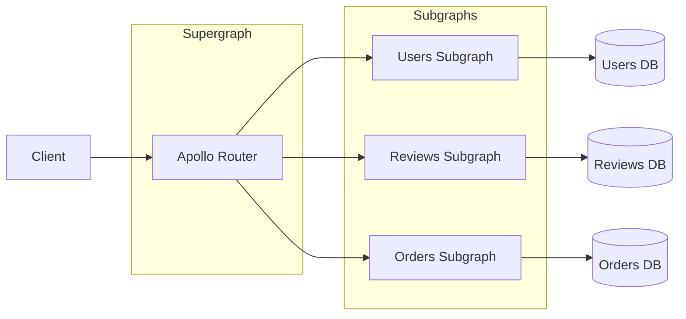

⚡ TL;DR - GraphQL Federation (Apollo Federation v2)
allows multiple independent GraphQL services (subgraphs)
to compose into one unified GraphQL schema (supergraph)
via a Router; subgraphs own their types and can extend
types from other subgraphs using `@key` directive
(entity resolution); the Router handles query planning
(splits one client query into parallel subgraph queries),
entity resolution, and result merging; federation solves
the "single monolith GraphQL schema" problem in
microservices - each team owns and deploys their
subgraph independently; the primary cost is added
complexity in the Router and entity resolver
implementations.

---

| #056 | Category: HTTP & APIs | Difficulty: ★★★★ |
|:---|:---|:---|
| **Depends on:** | GraphQL Query Language, GraphQL Schema Design, GraphQL N+1 Problem and DataLoader | |
| **Used by:** | GraphQL vs REST vs gRPC Decision Framework, Designing an API Platform for 100+ Teams | |
| **Related:** | GraphQL Query Language, GraphQL Schema Design, GraphQL N+1/DataLoader, GraphQL vs REST vs gRPC, API Platform Design | |

---

### 🔥 The Problem This Solves

**WORLD WITHOUT IT:**
100-microservice company decides to use GraphQL for
their frontend. Two options:

**Option A: API Gateway aggregates REST, exposes GraphQL.**
One GraphQL schema per microservice interface.
Frontend queries multiple schemas (ugly, no composition).
OR: one monolith schema maintained by a "platform team."
100 teams submit PRs to platform team for every
schema change. Platform team bottleneck. Schema
changes take 2 weeks.

**Option B: Each team maintains their own GraphQL schema.**
Frontend must query 10 different GraphQL endpoints per
page. No cross-type relationships (User → Orders →
Payments). Each type duplicated across services.

**THE BREAKING POINT:**
Netflix internal GraphQL (2020 case study): single
shared GraphQL schema with 100+ teams contributing.
Schema merge conflicts became so frequent that teams
were blocked waiting for their changes to merge.
Schema had grown to 5,000 types with no clear ownership.
Any change required full regression testing of the
entire schema. Deployment became monthly, blocking
all teams.

**THE INVENTION MOMENT:**
Apollo introduced Federation (v1, 2019). Key insight:
split the schema across teams (subgraphs), compose at
runtime (router). Each team owns their subgraph's
types. The router holds a query plan that routes
queries to the correct subgraphs and merges results.
Teams deploy subgraph changes independently. The
router composes the supergraph schema automatically
from published subgraph schemas.

---

### 📘 Textbook Definition

**Subgraph:** an independent GraphQL service that owns
a subset of the unified schema. Exposes standard
GraphQL endpoint + a `_service` introspection endpoint
and an `_entities` resolver for entity resolution.
Annotated with federation directives: `@key`, `@external`,
`@requires`, `@provides`. **Supergraph:** the composed
GraphQL schema that clients query. Not served by any
single subgraph - served by the Router. **Router
(Apollo Router or Apollo Gateway):** receives client
queries, generates a query plan (which subgraphs to
call, in what order, what fields), executes the plan
(parallel where possible), merges results. **Entity:**
a type with `@key` directive - can be referenced and
extended by other subgraphs. Example: `User` defined
in `accounts` subgraph, extended in `reviews` subgraph
with `reviews` field. **Entity resolution:** when a
subgraph needs data about an entity it does not own,
it fetches it via the `_entities` query (analogous to
DataLoader across service boundaries). **`@key`:**
designates one or more fields as the entity's primary
identifier, used for cross-subgraph resolution.

---

### ⏱️ Understand It in 30 Seconds

**One line:**
Federation lets each team own their slice of the
GraphQL schema independently, while the Router
assembles them into one unified API that clients query.

**One analogy:**
> A shopping mall (supergraph) with independently-
> managed stores (subgraphs). Each store manages its
> own inventory (types), staff (resolvers), and layout
> (schema). The mall directory (router) knows which
> store to visit for each product category. A customer
> asks for "a shirt and matching shoes" - the directory
> sends them to the clothing store for the shirt, and
> the shoe store for the shoes, then combines the
> purchase receipt (result merging). Each store can
> renovate independently without affecting other stores,
> as long as they maintain the same storefront interface
> (schema contract).

**One insight:**
Federation is not free. The Router adds a network hop
for every subgraph call. A simple query that touches
3 subgraphs makes 3 outbound requests from the Router.
A complex query might touch 8 subgraphs serially (when
one subgraph's output is needed as input to another).
Federation is the right choice when: (1) team count
is high (>5 teams on GraphQL), (2) schema contention
is real (multiple teams blocked on one schema), (3)
independent deployment is valued. For 1-2 teams: a
monolithic GraphQL schema is simpler.

---

### 🔩 First Principles Explanation

**Subgraph schema with federation directives:**

```graphql
# accounts subgraph
type User @key(fields: "id") {
  id: ID!
  username: String!
  email: String!
}

type Query {
  me: User
}

# Federation resolver: called by Router when another
# subgraph needs User fields
# (implementation in Python/JS servicer)
```

```graphql
# reviews subgraph (extends User from accounts)
# User is defined in accounts subgraph
# reviews subgraph EXTENDS it with a reviews field
type User @key(fields: "id") {
  id: ID! @external    # Defined in accounts subgraph
  reviews: [Review!]!  # Added by reviews subgraph
}

type Review {
  id: ID!
  body: String!
  author: User! @provides(fields: "id")
}
```

**Client query that crosses subgraphs:**
```graphql
query {
  me {           # → accounts subgraph
    id
    username
    reviews {    # → reviews subgraph (extends User)
      id
      body
    }
  }
}
```

**Router query plan:**
```
Step 1: Fetch from accounts subgraph: { me { id username } }
Step 2: Use id from Step 1 to fetch from reviews:
        _entities(representations: [{__typename: "User", id: "123"}])
        → { reviews { id body } }
Step 3: Merge results: { id, username, reviews: [...] }
```

---

### 🧪 Thought Experiment

**SCENARIO: E-commerce with 5 subgraphs**

Subgraphs:
- `users` - User type, login/logout
- `products` - Product type, catalog
- `orders` - Order type, checkout
- `reviews` - Review type, ratings
- `inventory` - Stock levels

Client query for order history page:
```graphql
query OrderHistory {
  me {               # users subgraph
    orders {         # orders subgraph (extends User)
      id
      items {
        product {    # products subgraph (extends OrderItem)
          name
          inStock    # inventory subgraph (extends Product)
        }
        review {     # reviews subgraph (extends OrderItem)
          rating
        }
      }
    }
  }
}
```

**Router query plan (parallel where possible):**
```
Step 1: users → me { id }
Step 2: orders → orders for User.id (from step 1)
Step 3: products + inventory (PARALLEL)
        products → products for item.productId
        inventory → stockLevel for item.productId
Step 4: reviews → reviews for item.id
Step 5: Merge all results, return to client
```

Without federation: frontend makes 5 separate REST
calls and assembles manually. With federation: one
GraphQL query, Router handles the fan-out.

---

### 🧠 Mental Model / Analogy

> Federation is like a SQL query planner for
> microservices. A SQL query planner takes one query
> (`SELECT u.name, o.total, p.stock FROM users u JOIN
> orders o ON ... JOIN products p ON ...`) and generates
> an execution plan: which tables to scan, which joins
> to execute, what order to process them. The planner
> optimizes for parallelism and minimizes data transfer.
> The Router does the same for subgraph queries: takes
> one GraphQL query, generates a subgraph execution
> plan, runs parallel queries where possible, and merges
> results. The client sees one unified query; the
> execution is distributed.

---

### 📶 Gradual Depth - Five Levels

**Level 1 - What it is (anyone can understand):**
Instead of one big GraphQL server that knows everything,
federation lets you have multiple smaller GraphQL
servers, each owning part of the schema. A Router in
front handles the routing. Clients query the Router
as if it were one server.

**Level 2 - How to use it (junior developer):**
Add `@apollo/subgraph` to your GraphQL service.
Annotate entity types with `@key(fields: "id")`.
Implement `__resolveReference` function for entity
resolution. Register subgraph with Apollo Registry.
Deploy Apollo Router with the supergraph schema.

**Level 3 - How it works (mid-level engineer):**
Router downloads supergraph schema (or uses managed
federation from Apollo Studio). On each query: router
runs the query planner to generate a fetch plan (which
subgraphs, which fields, which order). Executes plan,
making HTTP calls to subgraphs. Entity resolution:
passes `{__typename, ...key_fields}` to subgraph's
`_entities` resolver, which uses DataLoader-style
batching.

**Level 4 - Why it was designed this way (senior/staff):**
`@key` is the federation primitive because entity
identity is the hardest part of cross-service data
composition. Without `@key`: each subgraph is isolated.
With `@key`: subgraph B can extend type A (defined in
subgraph A) by declaring "I can resolve additional
fields for any A given its key." The Router knows:
to get `User.reviews`, fetch User from accounts
(step 1), pass User.id to reviews (step 2). This
is foreign key resolution at the GraphQL layer.

**Level 5 - Mastery (distinguished engineer):**
Federation v2 introduced `@shareable` and entity
resolution with multiple `@key` directives. `@shareable`
allows a type field to be resolved by multiple subgraphs
(e.g., Product.name in both catalog and search services).
The router chooses which subgraph to query based on
the query plan. This enables "hot paths": search
subgraph can serve Product.name from its own Elasticsearch
index (no need to call catalog subgraph). Trade-off:
`@shareable` fields must stay in sync across subgraphs
(eventual consistency risk). Prefer `@shareable` for
read-only, rarely-changing fields.

---

### ⚙️ How It Works (Mechanism)

**Python subgraph with strawberry-graphql federation:**

```python
from strawberry.federation import Schema
import strawberry

# accounts subgraph: owns User
@strawberry.federation.type(keys=["id"])
class User:
    id: strawberry.ID
    username: str
    email: str

    @classmethod
    def resolve_reference(cls, id: strawberry.ID):
        """Called by Router to resolve User by key."""
        return get_user_by_id(id)

@strawberry.type
class Query:
    @strawberry.field
    def me(self, info) -> User:
        return get_current_user(info.context)

accounts_schema = Schema(query=Query, types=[User])
```

```python
# reviews subgraph: extends User with reviews field
@strawberry.federation.type(keys=["id"], extend=True)
class User:
    id: strawberry.ID = strawberry.federation.field(
        external=True
    )

    @strawberry.field
    async def reviews(self, info) -> list["Review"]:
        # DataLoader for N+1 prevention across subgraph
        return await info.context["review_loader"].load(
            self.id
        )

@strawberry.type
class Review:
    id: strawberry.ID
    body: str

reviews_schema = Schema(query=Query, types=[User, Review])
```



---

### 🔄 The Complete Picture - End-to-End Flow

**Schema composition and deployment pipeline:**

```
Each team:
  1. Define subgraph schema (SDL + federation directives)
  2. Deploy subgraph service
  3. Publish schema to Apollo Registry:
     "rover subgraph publish my-graph@main
       --schema ./schema.graphql
       --name reviews
       --routing-url http://reviews-svc:4001/graphql"

Apollo Registry:
  4. Validates subgraph schema changes against supergraph
     (checks: no breaking changes in @key types,
              no duplicate field conflicts,
              entity references valid)
  5. If valid: compose new supergraph schema
  6. Publishes to Apollo Router (hot-reload)

Apollo Router:
  7. Receives new supergraph schema
  8. Hot-reloads without downtime
  9. Uses new query plan for subsequent queries
```

---

### 💻 Code Example

**Example 1 - BAD: Resolving cross-service data in resolver**

```python
# BAD: orders subgraph directly calls accounts REST API
@strawberry.type
class Order:
    user_id: str

    @strawberry.field
    async def user(self) -> dict:
        # Anti-pattern: direct service call from subgraph
        # Creates tight coupling, bypasses federation
        response = await http_client.get(
            f"http://accounts-svc/users/{self.user_id}"
        )
        return response.json()

# GOOD: Use federation @key and resolve_reference
# accounts subgraph defines User with @key(fields: "id")
# orders subgraph extends User only if needed,
# or just returns user_id and lets client/router
# fetch User fields via federation
@strawberry.federation.type(keys=["id"], extend=True)
class User:
    id: strawberry.ID = strawberry.federation.field(
        external=True
    )
    # Router fetches actual User fields from accounts subgraph
```

---

**Example 2 - resolve_reference with DataLoader batching**

```python
# In reviews subgraph: resolve User by ID (for entity resolution)
@strawberry.federation.type(keys=["id"], extend=True)
class User:
    id: strawberry.ID = strawberry.federation.field(
        external=True
    )

    @strawberry.field
    async def reviews(
        self, info: strawberry.types.Info
    ) -> list["Review"]:
        # Use DataLoader to batch across entity resolution calls
        # Router may call resolve_reference for N users at once
        return await info.context["review_loader"].load(self.id)

    @classmethod
    def resolve_reference(cls, id: strawberry.ID):
        return cls(id=id)
        # reviews field will be loaded via DataLoader
```

---

### ⚖️ Comparison Table

| Approach | Team Autonomy | Schema Coherence | Complexity | Use Case |
|:---|:---|:---|:---|:---|
| Monolith GraphQL schema | Low (shared repo) | High (one schema) | Low | <5 teams |
| Schema stitching (v1) | Medium | Medium | High (brittle) | Legacy |
| Apollo Federation v2 | High (own subgraph) | High (composed) | Medium | 5-100+ teams |
| Multiple separate schemas | High | Low (no composition) | None | Different products |

---

### ⚠️ Common Misconceptions

| Misconception | Reality |
|:---|:---|
| Federation eliminates service calls between subgraphs | Federation replaces direct service calls with Router-mediated entity resolution. The same number of service calls happen, but they are coordinated by the Router (which can parallelize them). The network hops are not eliminated - they are optimized. |
| Each subgraph needs to know about other subgraphs | Subgraphs are independent. The reviews subgraph does not import accounts subgraph code. It only declares `@external` fields (fields it will receive from the Router). The Router holds the composition knowledge, not the subgraphs. |
| Federation is only for large companies | Federation is appropriate when multiple teams own different parts of a GraphQL schema and schema ownership conflicts are causing slowdowns. Team count (>5 teams) is the key threshold, not company size. |
| Apollo Router is required for federation | Apollo Router is the production recommendation. Open-source alternatives: Apollo Gateway (Node.js, older), Grafbase, WunderGraph, and custom router implementations using Apollo Federation spec (open spec). The spec is public; multiple implementations exist. |

---

### 🚨 Failure Modes & Diagnosis

**Query plan fan-out (N subgraph calls for one query)**

**Symptom:** Client GraphQL query takes 2 seconds.
Router logs show 8 sequential subgraph calls. Latency
is the sum of all subgraph latencies, not the max.

**Root Cause:** Query plan has sequential dependencies
(Step 2 needs Step 1's result; Step 3 needs Step 2's
result). Typical cause: deeply nested entity resolution.
Each level of entity extension adds a network hop.

**Diagnosis:** Enable Apollo Router query plan logging.
Look for sequential steps vs parallel steps in the
plan. Identify which types are causing chains.

**Fix:**
(1) Use `@provides`: if reviews subgraph can provide
`Product.name` without calling products subgraph,
annotate: `product: Product @provides(fields: "name")`.
Router will use the locally available field.
(2) Flatten the schema: instead of `user → reviews →
product`, add a direct resolver that fetches all needed
data in one call.
(3) Use `@requires`: compute derived fields from
locally available fields without extra subgraph calls.

---

**Subgraph deployment breaks supergraph**

**Symptom:** After deploying a new reviews subgraph,
client queries return errors. Apollo Studio shows
"composition error." Existing clients see schema
validation failures.

**Root Cause:** Reviews subgraph schema change broke
the supergraph composition. Common causes: removed
a `@key` field that another subgraph depends on;
changed the type of an `@external` field; removed
a type used in another subgraph.

**Fix:**
Use rover CLI schema checks BEFORE deployment:
```bash
rover subgraph check my-graph@main \
  --schema ./schema.graphql \
  --name reviews
# Composition validation runs against current supergraph
# BEFORE publishing. Fails here, not in production.
```
Implement as CI check: subgraph PRs must pass `rover
subgraph check` before merge.

---

### 🔗 Related Keywords

**Prerequisites (understand these first):**
- `GraphQL Query Language` - SDL, types, queries
- `GraphQL Schema Design` - schema design principles
- `GraphQL N+1 Problem and DataLoader` - entity
  resolution uses DataLoader pattern

**Builds On This (learn these next):**
- `GraphQL vs REST vs gRPC Decision Framework` -
  federation as a factor in GraphQL adoption
- `Designing an API Platform for 100+ Teams` -
  federation as the GraphQL platform approach

---

### 📌 Quick Reference Card

```
┌──────────────────────────────────────────────────────────┐
│ SUBGRAPH     │ Independent GraphQL service               │
│              │ Owns specific types, deploys independently │
├──────────────┼───────────────────────────────────────────┤
│ SUPERGRAPH   │ Composed schema served by the Router      │
│              │ Clients see one unified API               │
├──────────────┼───────────────────────────────────────────┤
│ @key         │ Entity primary identifier                 │
│              │ Enables cross-subgraph entity resolution  │
├──────────────┼───────────────────────────────────────────┤
│ @external    │ Field defined in another subgraph          │
│              │ Used as @key reference in current subgraph│
├──────────────┼───────────────────────────────────────────┤
│ resolve_ref  │ __resolveReference: fetch entity by @key  │
│              │ Use DataLoader for batching               │
├──────────────┼───────────────────────────────────────────┤
│ VALIDATION   │ rover subgraph check before deployment    │
│              │ Catches composition breaks in CI          │
├──────────────┼───────────────────────────────────────────┤
│ ONE-LINER    │ "Each team owns a subgraph; Router        │
│              │ composes and plans queries across all"    │
└──────────────────────────────────────────────────────────┘
```

**If you remember only 3 things:**
1. `@key` directive designates entity identity - enables
   cross-subgraph type composition via the Router's
   entity resolution.
2. The Router generates a query plan: which subgraphs
   to call, in parallel where possible, for each client
   query.
3. Run `rover subgraph check` in CI before deploying
   any subgraph change - catches composition breaks
   before they reach production.

---

### 💎 Transferable Wisdom

**Reusable Engineering Principle:**
"Composition at the interface layer, independence at
the implementation layer." Federation applies this
principle to GraphQL: subgraphs implement independently;
the Router composes at the query layer. This is the
same pattern as: Kafka schema registry (independent
producers/consumers, composed schema contract);
microservices API gateway (independent services,
composed routing); OpenAPI spec composition (individual
service specs, merged API documentation). When multiple
teams own different parts of the same consumer-facing
interface, a composition layer that assembles from
independent contributors is the scalable solution.
The cost is always the composition layer complexity.

**Where else this pattern applies:**
- Module federation (Webpack 5): separate teams build
  React micro-frontends, composed at runtime in the
  browser shell
- Platform engineering: internal developer platform
  abstracts and composes multiple backend services for
  application teams
- BFF pattern at scale: federation is a GraphQL-native
  evolution of the BFF pattern for multi-team environments

---

### 💡 The Surprising Truth

Netflix's GraphQL federation story has an unexpected
twist: they built their own federation implementation
(Netflix DGS framework + Studio Edge) instead of using
Apollo Federation, despite Apollo being the standard.
Reason: Netflix had 100M+ users and needed extreme
query optimization that Apollo Router did not provide
at the time. Netflix's Router generates query plans
with deep knowledge of their infrastructure (which
subgraph is in which AZ, which has the cached data,
which is under load). This hyperspecialized Router
outperformed Apollo Router for their specific workload.
The lesson: Apollo Federation v2 is the right starting
point for most companies. But the federation spec is
open; at sufficient scale, building a custom router
optimized for your infrastructure topology is a viable
option.

---

### ✅ Mastery Checklist

**You've mastered this when you can:**
1. **DESIGN** A federated schema: split a monolith
   GraphQL schema across 3 subgraphs with proper `@key`
   directives and `@external` annotations.
2. **IMPLEMENT** `resolve_reference` in a subgraph
   using DataLoader for batched entity resolution.
3. **DIAGNOSE** Sequential query plan fan-out and
   optimize with `@provides` or schema flattening.
4. **PROTECT** Supergraph composition with `rover
   subgraph check` in CI.
5. **DECIDE** When federation is the right choice (5+
   teams, schema contention) vs monolith GraphQL (1-2
   teams, simple schema).

---

### 🎯 Interview Deep-Dive

**Q1: How does GraphQL Federation handle a query that
spans multiple subgraphs?**

*Why they ask:* Tests federation internals.

*Strong answer includes:*
- Client sends one query to the Router.
- Router parses the query against the supergraph schema.
- Query planner generates a plan: which subgraphs to
  call, which fields to request, which steps depend
  on others, which can run in parallel.
- Example: `{ me { username reviews { id } } }`.
  Plan: (1) Call accounts subgraph: `{ me { id username } }`.
  (2) Call reviews subgraph with entity representation:
  `{ _entities(representations: [{__typename:"User",id:"123"}])
  { ... on User { reviews { id } } } }`.
  (3) Merge results: return `{ username, reviews }`.
- `_entities` is the federation protocol: subgraph
  must implement this resolver to return entity data
  given `__typename` and key fields.
- Parallelism: if two fields in the query are from
  different subgraphs and neither depends on the other's
  result, the Router calls both simultaneously.

**Q2: What is the `@key` directive and why is it
important?**

*Why they ask:* Tests core federation concept.

*Strong answer includes:*
- `@key(fields: "id")`: declares that this type has a
  stable identity accessible via the `id` field. Any
  subgraph that references this type can use the `id`
  to fetch the full entity.
- Without `@key`: a type is "unresolvable" - other
  subgraphs can reference fields from it but cannot
  add new fields to it.
- With `@key`: the type is an "entity." Other subgraphs
  can extend it by implementing `resolve_reference`
  (or `__resolveReference` in JS). The Router passes
  the key value to the extending subgraph to fetch
  the additional fields.
- Compound keys: `@key(fields: "sku variation { id }")`
  - an entity identified by multiple fields. Useful
  for types without a single primary key.
- Multiple keys: a type can have multiple `@key`
  directives, allowing resolution via different
  identifying fields.

**Q3: What are the failure modes of GraphQL Federation
at scale?**

*Why they ask:* Tests production GraphQL at scale.

*Strong answer includes:*
- Query plan fan-out: a deeply nested query touches
  many subgraphs serially (each level needs the
  previous level's key). Latency = sum of all subgraph
  latencies. Fix: `@provides` (serve field from local
  subgraph), schema flattening, or caching at the
  Router level.
- Subgraph deployment breaking supergraph: a subgraph
  removes a `@key` field or breaks an entity contract.
  Fix: `rover subgraph check` in CI, schema change
  management policy.
- Entity resolution N+1: Router calls `_entities` with
  one representation per entity. If subgraph's
  `resolve_reference` makes one DB query per entity,
  N+1 reappears at the federation layer. Fix: use
  DataLoader in `resolve_reference` (batch all
  representations into one query per batch window).
- Router SPOF: Router is the single entry point for
  all GraphQL queries. Router downtime = GraphQL
  downtime. Fix: multiple Router instances behind load
  balancer, horizontal scaling, circuit breakers for
  each subgraph in the Router.
