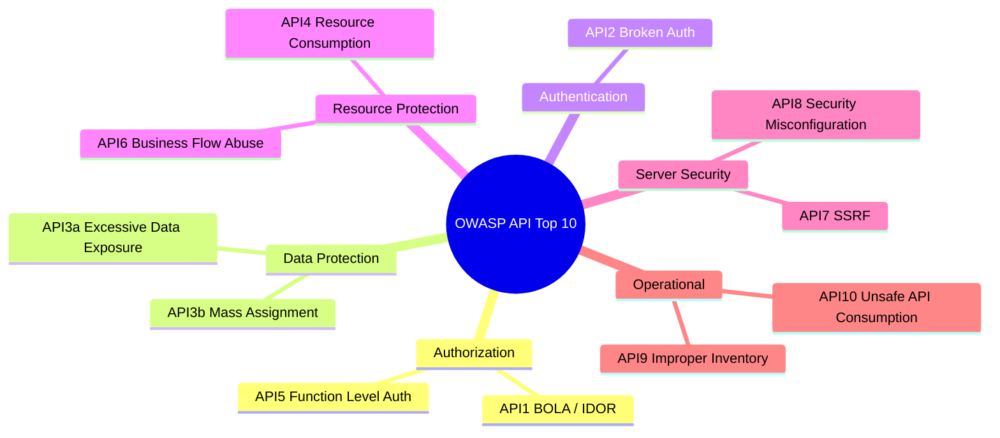

⚡ TL;DR - OWASP API Security Top 10 (2023 edition)
are the 10 most critical API security vulnerabilities:
API1 - Broken Object Level Authorization (BOLA/IDOR,
most common), API2 - Broken Authentication, API3 -
Broken Object Property Level Authorization (mass
assignment / over-exposure), API4 - Unrestricted
Resource Consumption (DoS via resource exhaustion),
API5 - Broken Function Level Authorization, API6 -
Unrestricted Access to Sensitive Business Flows,
API7 - SSRF, API8 - Security Misconfiguration, API9 -
Improper Inventory Management (shadow APIs), API10 -
Unsafe Consumption of APIs (trusting third-party APIs).
BOLA (insecure direct object reference) accounts for
~40% of API breaches.

---

| #057 | Category: HTTP & APIs | Difficulty: ★★★ |
|:---|:---|:---|
| **Depends on:** | HTTP Authentication, OAuth and Token-Based Authentication, HTTP Status Codes, Content Security | |
| **Used by:** | JWT Security, OAuth 2.0 Security Best Practices, CSRF and SSRF in APIs | |
| **Related:** | HTTP Auth, OAuth/Tokens, HTTP Status Codes, CORS/Security Headers, JWT Security, OAuth Security, CSRF/SSRF | |

---

### 🔥 The Problem This Solves

**WORLD WITHOUT IT:**
API endpoints are tested for functionality (does it
return the right data?) but not for authorization (does
it return data only to authorized requesters?). A
developer builds `GET /api/orders/{orderId}` - works
correctly, returns order data. Security team never
asked: "can user A see user B's orders by changing
the orderId in the URL?" Answer: yes, because no
authorization check was added. This is BOLA - Broken
Object Level Authorization - and it is in 70% of APIs.

**THE BREAKING POINT:**
Venmo API (2019): all transactions (including private
ones) were accessible via the public API without
authentication. A developer scraped 7 million Venmo
transactions, revealing sensitive financial data for
millions of users. Root cause: API3 (Broken Object
Property Level Authorization) and API8 (Security
Misconfiguration). No authentication required for
transaction history endpoint, and private fields
included in the response.

**THE INVENTION MOMENT:**
OWASP (Open Web Application Security Project) published
the first API Security Top 10 in 2019 after observing
that the original OWASP Web Application Top 10 did
not address API-specific attack vectors (REST APIs
lack browser-enforced security; APIs expose structured
data not HTML; APIs have machine-to-machine access
patterns). Updated to 2023 edition with new entries
(API7: SSRF, API10: Unsafe API Consumption) reflecting
evolved threat landscape.

---

### 📘 Textbook Definition

**OWASP API Security Top 10 (2023):**

**API1 - Broken Object Level Authorization (BOLA):**
API accepts object IDs in requests but does not verify
the requesting user is authorized to access that object.
Attacker changes `orderId=123` to `orderId=124` and
sees another user's order. Also known as IDOR (Insecure
Direct Object Reference).

**API2 - Broken Authentication:** weak API keys (no
expiry), JWT without signature verification (accepting
`"alg": "none"`), no rate limiting on auth endpoints
(brute force), long-lived tokens with no revocation.

**API3 - Broken Object Property Level Authorization:**
(a) Excessive data exposure: API returns full object
(including sensitive fields) and relies on client to
filter. Attacker queries API directly, ignoring client-
side filtering. (b) Mass assignment: API automatically
maps request body to database model, allowing attackers
to set admin=true, balance=1000000 via crafted request
body.

**API4 - Unrestricted Resource Consumption:** no rate
limiting, no query complexity limits (GraphQL), no
payload size limits, no execution timeout. DoS via
large payloads, deeply nested queries, or billions of
requests.

**API5 - Broken Function Level Authorization:** endpoints
exist for admin or internal functions but are accessible
to regular users (no role check). `/api/admin/users`
returns 200 for all authenticated users, not just
admins.

**API6 - Unrestricted Access to Sensitive Business Flows:**
API properly authenticates and authorizes but has no
business logic rate limiting. Attacker creates 1000
accounts, "buys" limited-edition items with all, resells
for profit (scalping bot). Or: sends 1000 OTP requests
(SMS flooding).

**API7 - Server-Side Request Forgery (SSRF):** API
accepts URLs/endpoints as input and fetches them
server-side. Attacker provides internal AWS metadata
URL (`http://169.254.169.254/latest/meta-data/`) to
steal instance credentials.

**API8 - Security Misconfiguration:** CORS allowing
all origins, debug endpoints enabled in production,
default credentials, missing security headers (HSTS,
CSP), outdated TLS versions, verbose error messages
with stack traces.

**API9 - Improper Inventory Management:** shadow APIs
(v1 API deployed alongside v2, v1 has known
vulnerabilities), test/debug APIs exposed in production,
undocumented endpoints.

**API10 - Unsafe Consumption of APIs:** service trusts
data from third-party APIs without validation,
sanitization, or authentication verification. Third-
party webhook sends malicious payload; service executes
it without validation.

---

### ⏱️ Understand It in 30 Seconds

**One line:**
The 10 most common API security mistakes: most critical
is BOLA (not checking if user owns the object they
requested), most overlooked is mass assignment
(user sends JSON that modifies admin fields).

**One analogy:**
> API1 (BOLA): a hotel where each room has a key card
> numbered 1-500. A guest swipes key card #215 and
> discovers it also opens rooms 216, 217, 218 because
> the lock system checks "is this a valid key card?"
> but not "does this key belong to this room?"
> API3 (mass assignment): a hotel check-in form where
> typing "admin: true" in the last name field actually
> grants admin access because the backend maps form
> fields directly to the user record without filtering.

**One insight:**
BOLA is so common because developers test "happy path"
authorization (user can access their own resource) but
not "malicious path" (user accesses another user's
resource by changing an ID). The fix is one line in
every endpoint that returns user-owned resources:
`if resource.user_id != current_user.id: raise 403`.
But developers forget to write this line because it
seems obvious. BOLA persists because it requires
explicitly thinking like an attacker during development.

---

### 🔩 First Principles Explanation

**BOLA attack and fix:**

```python
# VULNERABLE: BOLA (API1)
@app.get("/orders/{order_id}")
async def get_order(
    order_id: int,
    current_user: User = Depends(get_current_user)
):
    order = db.query(Order).filter_by(id=order_id).first()
    # BUG: Only checks authentication, not authorization
    # Attacker changes order_id to any value
    return order

# FIXED: Check ownership
@app.get("/orders/{order_id}")
async def get_order(
    order_id: int,
    current_user: User = Depends(get_current_user)
):
    order = db.query(Order).filter_by(
        id=order_id,
        user_id=current_user.id  # OWNERSHIP CHECK
    ).first()
    if not order:
        raise HTTPException(403, "Not authorized")
    return order
```

**Mass assignment attack and fix (API3b):**

```python
# VULNERABLE: Mass assignment
@app.post("/users/profile")
async def update_profile(
    updates: dict,  # Attacker sends: {"is_admin": true}
    current_user: User = Depends(get_current_user)
):
    for key, value in updates.items():
        setattr(current_user, key, value)  # Sets is_admin!
    db.commit()

# FIXED: Explicit field allowlist
class ProfileUpdate(BaseModel):
    display_name: Optional[str] = None
    bio: Optional[str] = None
    # is_admin NOT included: cannot be set via this endpoint

@app.post("/users/profile")
async def update_profile(
    updates: ProfileUpdate,  # Pydantic validates + filters
    current_user: User = Depends(get_current_user)
):
    current_user.display_name = updates.display_name
    current_user.bio = updates.bio
    db.commit()
```

---

### 🧪 Thought Experiment

**SCENARIO: E-commerce API audit - find all Top 10 issues**

```
GET /api/v1/products - no auth (intentional, public)
GET /api/v1/orders/{id} - BOLA if no ownership check
POST /api/v1/users - mass assignment if dict mapping
GET /api/v1/users/{id} - BOLA + excessive data
  (returns password hash, internal_notes, etc.)
POST /api/login - no rate limiting (brute force)
GET /api/v1/export?url={url} - SSRF if url not validated
GET /api/admin/config - not role-checked (API5)
GET /api/v2/... - v1 still live at /api/v1 (API9)
```

Each endpoint maps to one or more OWASP API issues.
A security review systematically checks each category
against each endpoint.

---

### 🧠 Mental Model / Analogy

> The OWASP API Top 10 are the 10 doors attackers
> try first. BOLA = front door with no lock on specific
> rooms. Broken auth = master key that works everywhere.
> Mass assignment = forms that accept hidden fields.
> Resource consumption = flooding the lobby.
> Function auth = employee entrance with no badge check.
> SSRF = phone in the lobby that dials internal lines.
> Misconfig = debug panel visible to all guests.
> Inventory = old service entrances still open.
> If you fix these 10 first, you have locked 90% of the
> easily-picked doors.

---

### 📶 Gradual Depth - Five Levels

**Level 1 - What it is (anyone can understand):**
A list of the 10 most common ways attackers break into
APIs. If you build an API without addressing these 10
issues, attackers can steal data, take over accounts,
or crash the service.

**Level 2 - How to use it (junior developer):**
During code review, check each endpoint against the
top 3: BOLA (ownership check), broken auth (JWT verified,
rate limited), excessive data (using response model
with only needed fields). Use Pydantic response models
to prevent accidental field leakage.

**Level 3 - How it works (mid-level engineer):**
Each OWASP category is a vulnerability class with
attack patterns and prevention controls. Integrate
OWASP checklist into security review process. Use
automated tools (OWASP ZAP, Burp Suite) for API1,
API2, API4, API8 detection. Manual review required
for API5, API6, API9.

**Level 4 - Why it was designed this way (senior/staff):**
OWASP categories are ordered by attack frequency and
impact. BOLA (API1) is not most severe but most common
(present in nearly every API that has not been
explicitly reviewed). Broken auth (API2) is most severe
(account takeover). Resource consumption (API4) is
most easy to exploit (anyone can send HTTP requests).
The ordering guides where to invest security effort
first.

**Level 5 - Mastery (distinguished engineer):**
OWASP API Top 10 is a minimum bar, not a ceiling.
Production APIs require: (1) defense-in-depth (multiple
controls for each category); (2) threat modeling
(which OWASP categories are most relevant for your
API's data sensitivity and threat actors); (3) API
security testing in CI/CD pipeline (automated checks,
not manual review); (4) runtime protection (WAF rules
for common OWASP attack patterns, anomaly detection
for unusual access patterns). The security posture
degrades over time (new endpoints without security
review); automated enforcement is required.

---

### ⚙️ How It Works (Mechanism)

**FastAPI security middleware addressing multiple OWASP categories:**

```python
from fastapi import FastAPI, Request, Response
from fastapi.responses import JSONResponse
from starlette.middleware.base import BaseHTTPMiddleware
import re

app = FastAPI()

# API8: Remove internal headers from responses
@app.middleware("http")
async def remove_internal_headers(request: Request, call_next):
    response = await call_next(request)
    # Remove headers that reveal implementation details
    response.headers.pop("X-Powered-By", None)
    response.headers.pop("Server", None)
    # API8: Add security headers
    response.headers["X-Content-Type-Options"] = "nosniff"
    response.headers["X-Frame-Options"] = "DENY"
    response.headers["Strict-Transport-Security"] = (
        "max-age=31536000; includeSubDomains"
    )
    return response

# API1: BOLA prevention helper
async def check_ownership(
    resource, current_user_id: int, field="user_id"
):
    """Reusable ownership assertion."""
    if not resource:
        raise HTTPException(404, "Not found")
    if getattr(resource, field) != current_user_id:
        raise HTTPException(403, "Forbidden")
    return resource

# API3b: Strict response model (prevents data leakage)
class OrderResponse(BaseModel):
    id: int
    status: str
    total: float
    created_at: datetime
    # NOT included: internal_notes, payment_token,
    # user.password, user.internal_id

@app.get("/orders/{order_id}", response_model=OrderResponse)
async def get_order(
    order_id: int,
    current_user: User = Depends(get_current_user)
):
    order = await db.get_order(order_id)
    await check_ownership(order, current_user.id)
    return order  # Pydantic filters to OrderResponse fields

# API7: SSRF prevention
ALLOWED_SCHEMES = {"https"}
BLOCKED_HOSTS = {
    "localhost", "127.0.0.1", "169.254.169.254",
    "metadata.google.internal", "::1"
}
def validate_url(url: str) -> str:
    """Prevent SSRF: validate URL before fetching."""
    parsed = urlparse(url)
    if parsed.scheme not in ALLOWED_SCHEMES:
        raise ValueError("Only HTTPS URLs allowed")
    hostname = parsed.hostname or ""
    if hostname in BLOCKED_HOSTS:
        raise ValueError("Internal URLs not allowed")
    if re.match(r"^(10\.|172\.(1[6-9]|2[0-9]|3[01])\.|192\.168\.)",
                hostname):
        raise ValueError("Private IP ranges not allowed")
    return url
```



---

### 🔄 The Complete Picture - End-to-End Flow

**Security review checklist per endpoint:**

```
For each endpoint, check:
□ API1 (BOLA): does endpoint access user-owned data?
  → Add owner_id == current_user.id check
□ API2 (Auth): is JWT verified? Rate limited?
  → verify signature + expiry; rate limit /login
□ API3a (Over-exposure): does response expose internal fields?
  → Use strict Pydantic response model
□ API3b (Mass assignment): does update accept open dict?
  → Use explicit Pydantic request model
□ API4 (Resource): max payload size? Query timeout?
  → Set Content-Length limit; DB statement_timeout
□ API5 (Function auth): is endpoint role-checked?
  → Admin endpoints: require admin role
□ API7 (SSRF): does endpoint fetch user-provided URLs?
  → Validate scheme, block internal IPs
□ API8 (Misconfig): security headers set?
  → HSTS, X-Frame-Options, X-Content-Type-Options
□ API9 (Inventory): is this endpoint documented?
  → Add to OpenAPI spec; decommission old versions
```

---

### 💻 Code Example

**Example 1 - BAD: Multiple OWASP violations**

```python
# BAD: Multiple OWASP violations in one endpoint
@app.put("/users/{user_id}")
async def update_user(user_id: int, body: dict):
    # API2: No authentication check
    # API1: No ownership check (any user_id accessible)
    # API3b: Mass assignment (sets any field including is_admin)
    user = db.query(User).filter_by(id=user_id).first()
    for k, v in body.items():
        setattr(user, k, v)
    db.commit()
    return user  # API3a: Returns full user object including password

# GOOD: Addresses all violations
@app.put("/users/{user_id}")
async def update_user(
    user_id: int,
    updates: UserUpdateRequest,  # API3b: explicit fields only
    current_user: User = Depends(get_current_user)  # API2
):
    if current_user.id != user_id:  # API1: BOLA check
        raise HTTPException(403, "Forbidden")
    current_user.display_name = updates.display_name
    db.commit()
    return UserResponse.from_orm(current_user)  # API3a: filtered
```

---

### ⚖️ Comparison Table

| Category | Attack Complexity | Frequency | Fix Complexity | Priority |
|:---|:---|:---|:---|:---|
| API1 (BOLA) | Low | Very High | Low (one check) | P0 |
| API2 (Auth) | Medium | High | Medium | P0 |
| API3 (Data/Mass) | Low | High | Low (Pydantic models) | P0 |
| API4 (Resources) | Low | Medium | Low (rate limit) | P1 |
| API5 (Function) | Low | Medium | Low (role check) | P1 |
| API7 (SSRF) | Medium | Low | Medium (URL validation) | P1 |
| API8 (Misconfig) | Low | High | Low (headers, config) | P1 |

---

### ⚠️ Common Misconceptions

| Misconception | Reality |
|:---|:---|
| Authentication prevents BOLA | Authentication verifies WHO you are. BOLA is about WHAT you are allowed to access. An authenticated user can still access other users' resources if authorization (ownership check) is missing. Both layers are required. |
| Response models prevent mass assignment | Pydantic response models filter OUTPUT (what is returned). Mass assignment is an INPUT problem (what the server accepts). You need both: strict request models (input validation) AND strict response models (output filtering). |
| Rate limiting only prevents DDoS | Rate limiting prevents: brute force (API2), business logic abuse (API6), resource exhaustion (API4), enumeration attacks (API1 - iterating IDs). It is a cross-cutting security control, not just availability protection. |
| Fixing OWASP Top 10 = complete security | OWASP Top 10 is the minimum bar. It does not cover: supply chain attacks, cryptographic failures in data storage, physical security, insider threats, or zero-day vulnerabilities. It is the starting point for API security, not the complete checklist. |

---

### 🚨 Failure Modes & Diagnosis

**BOLA in production (data breach)**

**Symptom:** Security team receives alert: one user
account downloaded 50,000 records in 2 hours. All
via `GET /api/orders/{id}` with sequential IDs.

**Diagnosis:**
(1) Check access logs for sequential ID patterns:
```bash
grep "GET /api/orders" access.log | \
  awk '{print $7}' | sort | uniq | head -100
# Pattern: /api/orders/1001 /api/orders/1002 /api/orders/1003...
```
(2) Check if all fetched orders belong to requester:
```sql
SELECT order_id, user_id FROM order_access_logs
WHERE requester_id != user_id
AND timestamp > NOW() - INTERVAL '3 hours';
```

**Fix (emergency):** Immediately add ownership check
to `GET /api/orders/{id}`. Invalidate session token
of the exploiting user. Review all other object-level
endpoints for same missing check.

**Fix (preventive):** Use indirect references - expose
only non-predictable, per-user scoped identifiers
(UUID or hash of internal ID). Implement audit logging
for all data access to detect future BOLA attempts.

---

**Excessive data exposure (API3a)**

**Symptom:** API endpoint returns full user objects
including `password_hash`, `internal_notes`, and
`billing_address` even when the client only needs
`display_name` and `avatar_url`.

**Root Cause:** ORM's `to_dict()` or FastAPI's default
response serialization returns all model fields.

**Fix:**
```python
# Before: returns ALL User fields including password_hash
return user.to_dict()

# After: strict response model
class UserPublicResponse(BaseModel):
    id: int
    display_name: str
    avatar_url: str
    # password_hash: NOT here
    # internal_notes: NOT here
    # billing_address: NOT here
    class Config:
        orm_mode = True

@app.get("/users/{user_id}", response_model=UserPublicResponse)
async def get_user_public(user_id: int):
    user = db.query(User).filter_by(id=user_id).first()
    return user  # Pydantic filters to UserPublicResponse fields
```

---

### 🔗 Related Keywords

**Prerequisites (understand these first):**
- `HTTP Authentication` - auth mechanisms referenced in API2
- `OAuth and Token-Based Auth` - token security for API2
- `HTTP Status Codes` - 403/401 for authorization/auth errors

**Builds On This (learn these next):**
- `JWT Security` - specific attack vectors under API2
- `OAuth 2.0 Security Best Practices` - OAuth-specific
  API2 vulnerabilities
- `CSRF and SSRF in APIs` - deep dive on API7

---

### 📌 Quick Reference Card

```
┌──────────────────────────────────────────────────────────┐
│ API1 BOLA    │ Check owner_id == user.id on every object │
│ API2 Auth    │ Verify JWT sig + expiry; rate limit /login│
│ API3a Over   │ Use strict response model (Pydantic)      │
│ API3b Mass   │ Use explicit request model (no open dict) │
│ API4 Resource│ Rate limit + payload size + query timeout │
│ API5 Function│ Role check on admin/internal endpoints    │
│ API7 SSRF    │ Validate URL scheme + block private IPs   │
│ API8 Misconfig│ Security headers + no debug in prod      │
│ API9 Inventory│ Decommission old API versions            │
│ API10 Consume │ Validate + sanitize third-party data     │
├──────────────┼───────────────────────────────────────────┤
│ ONE-LINER    │ "BOLA is most common; always check        │
│              │ ownership before returning an object"     │
└──────────────────────────────────────────────────────────┘
```

**If you remember only 3 things:**
1. BOLA (API1) is the most common: add ownership check
   (`resource.user_id == current_user.id`) to every
   endpoint that returns user-owned objects.
2. Mass assignment (API3b): never map request body
   directly to model. Use explicit Pydantic request
   models with only the allowed fields.
3. SSRF (API7): never fetch URLs provided by users
   without validating scheme (HTTPS only) and blocking
   private IP ranges.

---

### 💎 Transferable Wisdom

**Reusable Engineering Principle:**
"Never trust input; always verify authorization."
OWASP API Top 10 violations share a root cause:
implicitly trusting client-provided values (object
IDs, field names, URLs, body data). The countermeasure
is always explicit verification: verify ownership
before returning data (BOLA fix); verify allowed fields
before mapping (mass assignment fix); verify URL
safety before fetching (SSRF fix). This applies beyond
APIs: SQL injection (verify query parameters are
parameterized, not string-concatenated); XSS (verify
output is HTML-escaped, not raw); command injection
(verify system commands use allowed args list). "Distrust
by default, verify explicitly" is the universal
security primitive.

**Where else this pattern applies:**
- SQL injection: parameterized queries (explicit safe
  input, not string concat)
- Path traversal: canonicalize file paths, verify
  they remain within allowed directory
- SSRF in webhook handlers: validate webhook source
  IP against provider's allowlist

---

### 💡 The Surprising Truth

The most exploited OWASP API category is not the one
most covered in security courses. API2 (Broken
Authentication) gets the most training time. But in
actual breach reports (IBM X-Force Threat Intelligence
2023, Veracode SOSS): API1 (BOLA) accounts for ~40%
of API breaches. The reason: BOLA is an authorization
logic bug - it requires understanding the business
logic of who should access what. Authentication bugs
are often detectable by automated scanners (no JWT
in request → test fails). BOLA requires knowing that
user 123 should not see user 456's orders - a fact
that scanners do not have. BOLA is underappreciated
in security tooling but overrepresented in breaches.
The takeaway: prioritize BOLA code review over other
categories regardless of what your security scanner
reports.

---

### ✅ Mastery Checklist

**You've mastered this when you can:**
1. **IDENTIFY** BOLA in code review: any endpoint
   that accepts an object ID without verifying
   `resource.user_id == current_user.id`.
2. **FIX** Mass assignment: convert `dict`-based
   updates to explicit Pydantic request models.
3. **IMPLEMENT** SSRF prevention: URL scheme check
   + private IP range blocklist.
4. **DESIGN** Security review checklist: walk through
   all 10 OWASP categories for a given API endpoint.
5. **EXPLAIN** Why authentication does not prevent
   BOLA and why both auth and authz are required.

---

### 🎯 Interview Deep-Dive

**Q1: What is BOLA and how do you prevent it?**

*Why they ask:* Most common API security vulnerability.

*Strong answer includes:*
- BOLA = Broken Object Level Authorization. Also called
  IDOR (Insecure Direct Object Reference). An API
  endpoint accepts an object ID (orderId, userId,
  documentId) but does not verify the requesting user
  is authorized to access that specific object.
- Attack: attacker changes `orderId=123` to `orderId=124`
  in the request URL. If no ownership check: receives
  another user's order data.
- Why common: developers test "can I access my own
  order?" (authentication test) but not "can I access
  someone else's order?" (authorization test). The
  check is easy to forget because authentication succeeds
  and the happy path works.
- Fix: in every endpoint that returns user-owned data,
  add: `if resource.owner_id != current_user.id: raise
  403`. Alternatively: scope the database query to the
  current user: `db.query(Order).filter_by(id=order_id,
  user_id=current_user.id)`.
- Additional protection: use non-sequential IDs (UUID)
  so attackers cannot enumerate. But do not rely on
  this alone - always add the ownership check.

**Q2: Explain mass assignment and how Pydantic prevents it.**

*Why they ask:* Tests API3b knowledge and framework
security features.

*Strong answer includes:*
- Mass assignment: server automatically maps all request
  body fields to model attributes without validation.
  Attacker sends `{"display_name": "Bob", "is_admin":
  true, "credits": 1000000}` - and the server sets
  all three fields.
- Why common: many frameworks (including Python ORMs
  and ActiveRecord in Rails) have convenient "update
  from dict" methods that map all provided keys.
- Pydantic fix: define a strict request model with
  only the allowed fields:
  ```python
  class UpdateRequest(BaseModel):
      display_name: str  # Only these fields accepted
      bio: Optional[str] = None
      # is_admin: NOT here - cannot be set by user
  ```
  Pydantic rejects any fields not in the model.
  `UpdateRequest(is_admin=True)` → ValidationError.
- Depth: also prevent via database permission model:
  the application user should not have UPDATE permission
  on the `is_admin` column. Defense in depth.

**Q3: How would you implement SSRF prevention for an
API that accepts user-provided URLs?**

*Why they ask:* Tests API7 implementation depth.

*Strong answer includes:*
- SSRF: server fetches a URL provided by the user.
  Attacker provides internal URL to access cloud
  metadata, internal services, or localhost services.
- Prevention layers:
  (1) URL validation (before any network call):
      - Allow only HTTPS scheme (no http, file, ftp)
      - Resolve hostname to IP, check against blocklist
      - Block: 127.0.0.1, ::1, 169.254.0.0/16 (AWS
        metadata), 10.0.0.0/8, 172.16.0.0/12,
        192.168.0.0/16 (private ranges)
  (2) Network-level isolation: run URL-fetching service
      in a network segment with no access to internal
      services. Even if SSRF bypasses validation,
      network controls prevent access.
  (3) Use a headless browser / fetch proxy for URL
      rendering that enforces its own SSRF protection.
  (4) Log all URL fetch requests for anomaly detection.
- Bypass detection: attackers use DNS rebinding (URL
  resolves to public IP at validation time, then
  rebinds to private IP at fetch time). Fix: re-resolve
  hostname and re-check IP immediately before fetching
  (not just at validation time).
