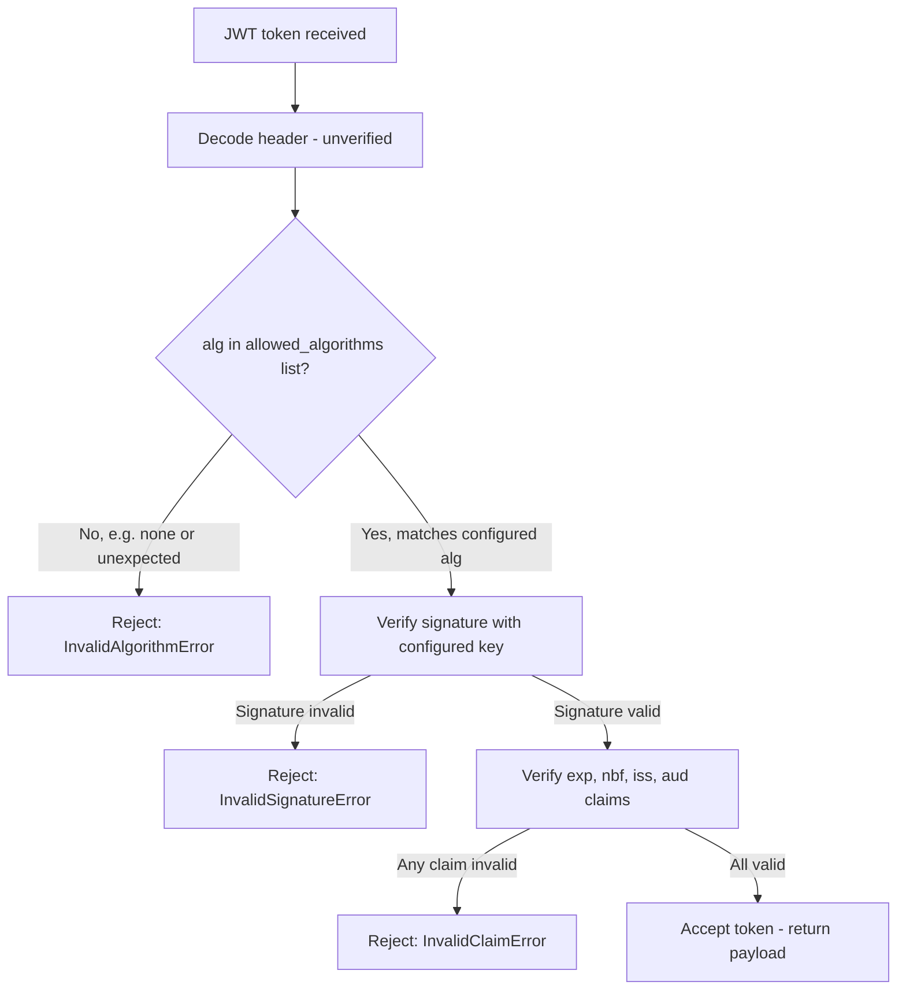

⚡ TL;DR - JWT vulnerabilities divide into four
categories: (1) Algorithm confusion: attacker changes
`alg` header to `none` (bypass signature) or from
RS256 to HS256 (use public key as HMAC secret);
(2) Weak secrets: HMAC-SHA256 with short/guessable
secrets can be brute-forced; (3) Expiry issues: no
`exp` claim, `exp` too far in future, or no server-
side revocation; (4) Claim validation failures: not
verifying `iss`, `aud`, `nbf`, or accepting expired
tokens; the `none` algorithm attack was so severe
it's now the first example in OWASP API2; always
specify an explicit allowed algorithm list, never
trust the `alg` header.

---

| #058 | Category: HTTP & APIs | Difficulty: ★★★★ |
|:---|:---|:---|
| **Depends on:** | HTTP Authentication, OAuth and Token-Based Auth, OWASP API Security Top 10 | |
| **Used by:** | OAuth 2.0 Security Best Practices, API Gateway Rate Limiting at Scale | |
| **Related:** | HTTP Auth, OAuth/Tokens, OWASP API Top 10, OAuth Security, API Gateway, TLS and Certificate Pinning | |

---

### 🔥 The Problem This Solves

**WORLD WITHOUT IT:**
Developer implements JWT verification: decode the
token, check the signature. The developer uses a
library that reads `alg` from the JWT header to
determine how to verify. Attacker takes a valid JWT,
changes `alg` from `RS256` to `none`, removes the
signature. The verification library reads `alg: none`,
decides "no signature needed" and accepts the token.
Attacker is authenticated as any user they want by
modifying the `sub` claim.

**THE BREAKING POINT:**
Auth0 (2015 research disclosure): most JWT libraries
at the time trusted the `alg` header. Researchers
sent JWTs with `"alg": "none"` to production APIs
and bypassed authentication entirely. Multiple major
API providers were vulnerable. The OWASP API Security
project listed this as API2 (Broken Authentication).

**THE INVENTION MOMENT:**
RFC 7519 (JWT, 2015) was designed for flexibility:
the algorithm was specified in the header so one
library could handle many algorithms. This flexibility
became the attack vector. The security community
established the countermeasure: servers MUST specify
the allowed algorithm list at verification time, never
reading it from the token's `alg` header. The token's
algorithm choice is not trusted.

---

### 📘 Textbook Definition

**JWT structure:** `base64url(header).base64url(payload).
base64url(signature)`. Header contains `alg` (algorithm)
and `typ` (JWT). Payload contains claims (`sub`, `exp`,
`iss`, `aud`, `iat`, `nbf`). Signature covers header
+ payload.

**Algorithm confusion attack:** attacker modifies the
`alg` header before verification. Two variants:
(1) `alg: none` - remove signature; if library
respects this, it accepts any payload. (2) RS256 → HS256:
if server verifies RS256 (asymmetric: private key signs,
public key verifies), attacker switches `alg` to HS256
(symmetric: same key for sign and verify), signs with
the server's PUBLIC KEY (which is publicly available).
Server verifies HMAC with the public key (the same key
it uses for HS256). Verification passes. Attacker
authenticated.

**Weak secret attack:** HMAC secrets shorter than 32
bytes are vulnerable to offline dictionary attacks
(hashcat, john the ripper). Common weak secrets:
"secret", "password", "jwt_secret", company name.
JWT signed with short secret can be brute-forced in
minutes.

**Missing/weak expiry:** JWT with no `exp` claim is
valid indefinitely. JWT with `exp` 1 year in future
is valid for 1 year after account compromise. No
server-side revocation (stateless JWT design) means
stolen tokens cannot be invalidated without revoking
all tokens.

**Claim validation failures:** not checking `iss`
(issuer) allows tokens from other identity providers
to be accepted. Not checking `aud` (audience) allows
tokens intended for service A to be used against
service B.

---

### ⏱️ Understand It in 30 Seconds

**One line:**
JWT security fails when servers trust the algorithm
specified inside the token (which the attacker controls)
instead of requiring a specific algorithm.

**One analogy:**
> JWT signature check with untrusted `alg` is like
> a padlock where the key type is written on the
> padlock itself. Someone can change "requires key
> type A" to "requires no key" (none algorithm) or
> "requires key type B" (algorithm confusion) on the
> padlock. The lock manufacturer rule: ignore what
> the padlock says about its key type; your lock-
> picker tool only accepts key type A (the configured
> algorithm). The token's `alg` field is attacker-
> controlled; the server's algorithm configuration is
> not.

**One insight:**
The `none` algorithm attack is not a JWT library bug;
it is a specification design issue. RFC 7519 explicitly
includes `none` as a valid algorithm value. The
specification's intent was that `none` would be used
for JWTs that are verified by other means (e.g., sent
over an already-authenticated TLS channel). In practice,
libraries that accept `none` for all JWTs are exploitable.
The correct implementation: never accept `none` as an
algorithm, period.

---

### 🔩 First Principles Explanation

**JWT Header decode (attacker's view):**

```python
import base64
import json

# Original JWT (truncated for clarity):
# eyJhbGciOiJSUzI1NiIsInR5cCI6IkpXVCJ9.
# eyJzdWIiOiJ1c2VyMTIzIn0.
# <RS256_signature>

token = "eyJhbGciOiJSUzI1NiIsInR5cCI6IkpXVCJ9.eyJzdWIiOiJ1c2VyMTIzIn0.<sig>"
parts = token.split(".")

# Decode header (no padding fix needed for demo)
header = json.loads(base64.b64decode(parts[0] + "=="))
print(header)  # {"alg": "RS256", "typ": "JWT"}

# Attacker crafts new header
attack_header = {"alg": "none", "typ": "JWT"}
new_header = base64.b64encode(
    json.dumps(attack_header).encode()
).decode().rstrip("=")

# Craft attack token: no signature (empty 3rd part)
attack_token = f"{new_header}.{parts[1]}."
# If server reads alg from header and allows "none":
# it will accept attack_token without any signature
```

**Algorithm confusion (RS256 → HS256 attack):**

```
Server setup:
  - Verification algorithm: RS256 (reads from token header)
  - Public key: stored in /certs/public.pem (world-accessible)

Attack:
  1. Attacker fetches public key from /certs/public.pem
  2. Creates JWT with: alg=HS256, sub=admin
  3. Signs with the PUBLIC KEY as HMAC-SHA256 secret
  4. Server reads alg=HS256 from header
  5. Server verifies HMAC with... the public key (same key
     it would use for HS256 symmetric verification)
  6. HMAC check PASSES: attacker signed with public key,
     server verifies with same public key = match

Defense:
  Server MUST specify algorithm at verification:
  jwt.decode(token, public_key, algorithms=["RS256"])
  # NOT: algorithms=["RS256", "HS256"] or auto-detect
```

---

### 🧪 Thought Experiment

**SCENARIO: Which JWT configurations are secure?**

```
Config A: jwt.decode(token, secret, algorithms=["HS256"])
  → SECURE: exact algorithm specified, not from token

Config B: alg = jwt.get_unverified_header(token)["alg"]
          jwt.decode(token, secret, algorithms=[alg])
  → VULNERABLE: reads alg from token = attacker-controlled
    Attacker can set alg="none" and pass

Config C: jwt.decode(token, secret, algorithms=["RS256","HS256"])
  → RISKY: if secret is the public key for RS256,
    algorithm confusion attack possible (HS256 path)

Config D: jwt.decode(token, rsa_public_key, algorithms=["RS256"])
  → SECURE: only RS256 accepted, public key correct
    Cannot be confused with HS256 (different key type)

Config E: jwt.decode(token, secret) # No algorithms param
  → VULNERABLE: library defaults may accept "none"
    or read alg from header
```

---

### 🧠 Mental Model / Analogy

> JWT algorithm confusion is like having a combination
> lock where the combination type is printed on the
> outside: "3-digit" vs "5-digit" vs "none". A burglar
> reads the label "none" (which they wrote there) and
> the lock opens without a combination. The defense:
> ignore the label entirely - always use the correct
> type you configured (3-digit, always), regardless
> of what is printed on the lock.

---

### 📶 Gradual Depth - Five Levels

**Level 1 - What it is (anyone can understand):**
JWTs are signed tokens used for authentication. The
security issue: if the server reads the algorithm
type from the token itself (which the attacker wrote),
the attacker can set it to "no signature needed" and
log in as anyone. Always tell the server which algorithm
to expect, not the token.

**Level 2 - How to use it (junior developer):**
Always pass `algorithms=["HS256"]` (or `["RS256"]`)
to JWT decode. Use a 256-bit (32-byte) randomly
generated secret for HS256. Set `exp` to 15 minutes
for access tokens. Verify `iss` and `aud` claims.

**Level 3 - How it works (mid-level engineer):**
PyJWT `jwt.decode(token, secret, algorithms=["HS256"])`:
reads `alg` from token header; if it is NOT in the
`algorithms` list → raises `InvalidAlgorithmError`.
This prevents `none` attack (not in list) and RS256→HS256
confusion (RS256 not in list). The `algorithms` param
is the primary defense; it must be explicit.

**Level 4 - Why it was designed this way (senior/staff):**
JWT was designed for algorithm agility (servers can
upgrade algorithms over time). The flexibility was
the vulnerability. Modern security guidance: pin
algorithms at the verification site. Use RS256 or
ES256 (asymmetric) for public-key scenarios (API
providers with third-party verifiers). Use HS256
with strong secret for internal services. Never use
RS512 or HS512 (no security benefit over 256-bit).

**Level 5 - Mastery (distinguished engineer):**
JWT revocation in stateless systems is architecturally
hard. Access token (15-minute expiry) + refresh token
(7-day expiry) pattern: short-lived access tokens
expire quickly (minimal revocation need). Refresh
tokens are stored in the authorization server and
CAN be revoked (they are stateful). When a user logs
out or is compromised: revoke the refresh token.
Next access token refresh fails. Within 15 minutes,
all access tokens derived from that refresh token
also expire. For immediate revocation: maintain a
token blocklist (Redis SET with TTL = remaining token
lifetime). Check blocklist on every request. Performance
cost: one Redis read per API call. Acceptable for
high-security endpoints.

---

### ⚙️ How It Works (Mechanism)

**Python JWT security with PyJWT:**

```python
import jwt
import secrets
import os
from datetime import datetime, timedelta, timezone
from typing import Optional

# Secure configuration
JWT_SECRET = os.environ.get("JWT_SECRET")
# MUST be at least 32 bytes (256 bits) of random data
# Generate: python -c "import secrets; print(secrets.token_hex(32))"
if not JWT_SECRET or len(JWT_SECRET.encode()) < 32:
    raise RuntimeError(
        "JWT_SECRET must be at least 32 bytes"
    )

JWT_ALGORITHM = "HS256"     # Do NOT read from token
JWT_ACCESS_EXPIRY = 15      # minutes
JWT_ISSUER = "https://auth.example.com"
JWT_AUDIENCE = "https://api.example.com"

def create_access_token(user_id: str, role: str) -> str:
    now = datetime.now(timezone.utc)
    payload = {
        "sub": user_id,
        "role": role,
        "iss": JWT_ISSUER,        # Issuer claim
        "aud": JWT_AUDIENCE,      # Audience claim
        "iat": now,               # Issued at
        "exp": now + timedelta(minutes=JWT_ACCESS_EXPIRY),
        "nbf": now,               # Not before (current time)
    }
    return jwt.encode(payload, JWT_SECRET, algorithm=JWT_ALGORITHM)

def verify_token(token: str) -> dict:
    """
    SECURE: algorithm is specified here, not from token.
    Verifies: signature, exp, iss, aud, nbf.
    """
    try:
        payload = jwt.decode(
            token,
            JWT_SECRET,
            algorithms=[JWT_ALGORITHM],  # EXPLICIT - not from token
            issuer=JWT_ISSUER,           # Verify iss claim
            audience=JWT_AUDIENCE,       # Verify aud claim
            # options default: verify_exp=True, verify_nbf=True
        )
        return payload
    except jwt.ExpiredSignatureError:
        raise AuthError("Token expired")
    except jwt.InvalidAlgorithmError:
        raise AuthError("Invalid algorithm in token")
    except jwt.InvalidTokenError as e:
        raise AuthError(f"Invalid token: {e}")

# FastAPI dependency
async def get_current_user(
    credentials: HTTPAuthorizationCredentials = Depends(bearer)
) -> dict:
    return verify_token(credentials.credentials)
```



---

### 🔄 The Complete Picture - End-to-End Flow

**Access + Refresh token rotation:**

```python
# Access token: short-lived (15 min), stateless
# Refresh token: long-lived (7 days), stored in DB

async def login(username: str, password: str) -> dict:
    user = await authenticate(username, password)
    access_token = create_access_token(user.id, user.role)
    refresh_token = create_refresh_token()
    # Store refresh token in DB (revocable)
    await db.store_refresh_token(
        user_id=user.id,
        token_hash=hash_token(refresh_token),
        expires_at=datetime.now(timezone.utc) + timedelta(days=7)
    )
    return {
        "access_token": access_token,
        "refresh_token": refresh_token,
        "expires_in": 900  # 15 minutes
    }

async def refresh(refresh_token: str) -> dict:
    # Verify refresh token exists in DB and is not expired
    token_record = await db.get_refresh_token(
        hash_token(refresh_token)
    )
    if not token_record or token_record.revoked:
        raise AuthError("Invalid refresh token")
    # Issue new access token
    return {"access_token": create_access_token(
        token_record.user_id, token_record.role
    )}

async def logout(refresh_token: str):
    # Revoke refresh token → future refreshes fail
    await db.revoke_refresh_token(hash_token(refresh_token))
```

---

### 💻 Code Example

**Example 1 - BAD: Algorithm from token header (vulnerable)**

```python
# BAD: reads algorithm from token - attacker-controlled
import jwt

def verify_token_bad(token: str) -> dict:
    # Decode header without verification
    header = jwt.get_unverified_header(token)
    alg = header["alg"]  # ATTACKER CONTROLS THIS
    # If attacker sets alg="none": no signature needed
    # If attacker sets alg="HS256" with public key: confused
    return jwt.decode(token, SECRET, algorithms=[alg])

# GOOD: algorithm specified server-side, not from token
def verify_token_good(token: str) -> dict:
    return jwt.decode(
        token,
        SECRET,
        algorithms=["HS256"],  # HARDCODED on server
        # Attacker cannot change this by modifying token
    )
```

---

**Example 2 - Weak secret detection**

```python
import jwt
import hashlib

# BAD: short or predictable secret
JWT_SECRET_BAD = "secret"         # 6 chars - trivially brute-forced
JWT_SECRET_BAD2 = "password123"   # Dictionary word
JWT_SECRET_BAD3 = "myapp"         # Company name

# GOOD: cryptographically random, minimum 32 bytes
def generate_jwt_secret() -> str:
    """Generate a secure JWT secret."""
    import secrets
    return secrets.token_hex(32)  # 256 bits of randomness
    # Store in environment variable, never in code

# Validate secret strength at startup
def validate_jwt_secret(secret: str):
    if len(secret.encode()) < 32:
        raise ValueError(
            "JWT secret must be at least 32 bytes"
        )
    # Check against common weak values
    common_secrets = {
        "secret", "password", "jwt", "token", "key",
        "123456", "your-secret-key"
    }
    if secret.lower() in common_secrets:
        raise ValueError("JWT secret is too weak")
```

---

### ⚖️ Comparison Table

| Algorithm | Key Type | Security | Use Case |
|:---|:---|:---|:---|
| HS256 | Shared secret (32+ bytes) | Good if secret is strong | Internal service auth |
| RS256 | RSA key pair | Strong | Public API, multiple verifiers |
| ES256 | ECDSA key pair | Strong, smaller key | Mobile/embedded, IoT |
| none | No key | INSECURE - reject always | Never |

---

### ⚠️ Common Misconceptions

| Misconception | Reality |
|:---|:---|
| JWT is encrypted | JWT is NOT encrypted by default. It is signed (integrity + authenticity), not encrypted (confidentiality). The payload is base64url-encoded, not encrypted. Anyone with the token can decode and read the payload. For encrypted JWTs: use JWE (JSON Web Encryption). Never put sensitive data in JWT payload unless using JWE. |
| Long expiry makes tokens more secure | Long expiry increases risk window after token theft. A stolen JWT with 1-year expiry gives an attacker 1-year access. Recommendation: access tokens 15 minutes, refresh tokens 7 days (revocable). Short access token expiry limits damage from theft. |
| Storing JWT in localStorage is safe | localStorage is accessible to JavaScript (XSS risk). If any script on the page is compromised (XSS), the attacker can read the JWT. Recommendation: store access tokens in memory (JavaScript variable), refresh tokens in HttpOnly, Secure, SameSite=Strict cookie. HttpOnly cookies cannot be read by JavaScript. |
| JWT signature means the token is authentic | JWT signature verifies the token was signed by the expected key and has not been tampered with. It does NOT verify the claims are accurate (claims are set by the issuer, who could issue invalid data). Always verify `sub`, `iss`, `aud`, and application-specific claims. |

---

### 🚨 Failure Modes & Diagnosis

**None algorithm attack in production**

**Symptom:** Security scanner reports "JWT algorithm
bypass." Access logs show requests with `Authorization:
Bearer` tokens where signature portion is empty or
missing.

**Diagnosis:**
```python
# Check if library accepts none algorithm:
import jwt

test_payload = {"sub": "attacker", "admin": True}
# Create unsigned token (manually)
import base64, json
header = base64.b64encode(
    json.dumps({"alg":"none","typ":"JWT"}).encode()
).decode().rstrip("=")
payload_b64 = base64.b64encode(
    json.dumps(test_payload).encode()
).decode().rstrip("=")
attack_token = f"{header}.{payload_b64}."

try:
    result = jwt.decode(attack_token, "secret",
                        algorithms=["none"])
    print("VULNERABLE: none algorithm accepted")
except jwt.exceptions.InvalidAlgorithmError:
    print("SECURE: none algorithm rejected")
```

**Fix:**
Update PyJWT to 2.4.0+ (addressed `none` algorithm
by default). Always pass `algorithms=["HS256"]` (or
your expected algorithm). Never pass `algorithms=
["none"]` or include `none` in the list.

---

**Token not expiring (missing exp validation)**

**Symptom:** User reports they can still use tokens
after changing their password or being deactivated.
Tokens should be invalid but are accepted.

**Root Cause:**
(a) `exp` claim not set in token creation, or
(b) `options={"verify_exp": False}` in JWT decode
    (common in development, forgotten in production).

**Fix:**
```python
# Ensure exp is set in token creation:
payload = {
    "sub": user_id,
    "exp": datetime.now(timezone.utc) + timedelta(minutes=15),
    # ...
}

# Ensure exp is verified in decode (default: True):
jwt.decode(token, secret,
           algorithms=["HS256"])
           # DO NOT add: options={"verify_exp": False}
```

For password-change invalidation: implement token
blacklist in Redis with TTL = remaining token lifetime.
Add check in verify_token: `if token_jti in redis:
raise AuthError("Token revoked")`.

---

### 🔗 Related Keywords

**Prerequisites (understand these first):**
- `HTTP Authentication` - Bearer token auth pattern
- `OAuth and Token-Based Auth` - where JWTs come from
- `OWASP API Security Top 10` - API2 context

**Builds On This (learn these next):**
- `OAuth 2.0 Security Best Practices` - OAuth-level
  JWT security
- `API Gateway Rate Limiting at Scale` - JWT
  verification at the gateway

---

### 📌 Quick Reference Card

```
┌──────────────────────────────────────────────────────────┐
│ NONE ATTACK  │ Never accept alg=none; specify algorithms= │
│              │ in decode call; never read alg from token  │
├──────────────┼───────────────────────────────────────────┤
│ ALG CONFUSION│ Use RS256 or ES256 for asymmetric;        │
│              │ Never mix RS256/HS256 with same key        │
├──────────────┼───────────────────────────────────────────┤
│ WEAK SECRET  │ HS256 secret: min 32 bytes, random        │
│              │ Generate: secrets.token_hex(32)            │
├──────────────┼───────────────────────────────────────────┤
│ EXPIRY       │ Access: 15 min; Refresh: 7 days (DB)      │
│              │ Always set exp claim                       │
├──────────────┼───────────────────────────────────────────┤
│ CLAIMS       │ Verify: exp, nbf, iss, aud               │
│              │ Don't put sensitive data in payload (no JWE) │
├──────────────┼───────────────────────────────────────────┤
│ ONE-LINER    │ "Never read alg from token header;        │
│              │ hardcode algorithm at verify site"        │
└──────────────────────────────────────────────────────────┘
```

**If you remember only 3 things:**
1. Never trust the `alg` header in the JWT. Always
   specify `algorithms=["HS256"]` (or RS256) at the
   decode call. Never include `none` in the list.
2. HS256 secrets must be at least 32 bytes of random
   data. Use `secrets.token_hex(32)`, store in
   environment variable, never hardcode.
3. Access tokens: 15-minute expiry (limits theft
   window). Refresh tokens: stored in DB (revocable).
   Logout = revoke refresh token.

---

### 💎 Transferable Wisdom

**Reusable Engineering Principle:**
"Never trust attacker-controlled metadata about
cryptographic operations." The `alg` field in JWT is
metadata that the attacker controls. Trusting it to
determine the verification algorithm is the root cause
of the algorithm confusion attack. The same principle:
never trust client-provided encryption algorithms
(use server-configured algorithms); never trust client-
provided hash algorithms for integrity checks; never
trust client-provided serialization format (use server-
configured deserializer with schema validation). The
server, not the client, decides how security operations
are performed. Client input is data; algorithm choice
is server policy.

**Where else this pattern applies:**
- TLS: server chooses cipher suite (not client, though
  client provides preferences) - same "server decides
  algorithm" pattern
- Database encryption: server chooses encryption
  algorithm for stored data, not the application
- HMAC for webhook verification: server uses its own
  configured HMAC secret and algorithm, verifies
  against client-provided signature

---

### 💡 The Surprising Truth

The `alg: none` vulnerability was present in nearly
every major JWT library in 2015 and was known to the
JWT specification authors. The RFC 7519 specification
explicitly defines `none` as "Unsecured JWT" - a JWT
without a signature, intended for cases where the
channel itself provides security (mutual TLS, internal
trusted network). The specification authors considered
`none` a valid use case. The vulnerability was not a
bug in the spec but in implementations that did not
require configuration of a valid algorithm list.
Library maintainers eventually removed `none` from
default-accepted algorithms, but only after multiple
high-profile disclosures. Python's PyJWT changed
the default in version 2.4.0 (2022) - seven years
after the specification was published. Any system
using PyJWT < 2.4.0 with the default configuration
was vulnerable to the `none` algorithm attack for
those seven years.

---

### ✅ Mastery Checklist

**You've mastered this when you can:**
1. **DEMONSTRATE** The none algorithm attack: forge
   a JWT with `alg: none` and explain exactly why
   a vulnerable library accepts it.
2. **DEMONSTRATE** The RS256→HS256 confusion attack:
   explain how an attacker signs a JWT with the
   server's public key and why the server verifies it.
3. **CONFIGURE** PyJWT decode with explicit algorithm,
   issuer, audience, and expiry verification.
4. **GENERATE** A cryptographically secure JWT secret
   and explain the minimum byte length requirement.
5. **DESIGN** Access + refresh token rotation: short
   access token expiry + DB-backed revocable refresh
   tokens.

---

### 🎯 Interview Deep-Dive

**Q1: Explain the JWT algorithm confusion attack.**

*Why they ask:* Specific, well-known attack pattern.

*Strong answer includes:*
- Two variants: `none` attack and RS256→HS256.
- `none` attack: attacker sets `alg: none` in token
  header, removes signature. Vulnerable library reads
  `alg` from header, sees `none`, decides no signature
  check needed, accepts the token. Attacker modifies
  `sub` to any user ID.
- RS256→HS256 attack: server uses RS256 (asymmetric).
  Server's public key is publicly accessible (e.g.,
  `GET /.well-known/jwks.json`). Attacker: (1) fetches
  public key, (2) creates JWT with `alg: HS256` + any
  claims, (3) signs with the PUBLIC KEY as HMAC-SHA256
  secret, (4) sends to server. Vulnerable server:
  reads `alg=HS256` from token, uses its public key
  for HS256 verification. Attacker signed with the
  public key = verification succeeds.
- Defense: `jwt.decode(token, key,
  algorithms=["RS256"])`. Server never reads `alg`
  from the token to determine verification algorithm.
  If token has `alg=none` or `alg=HS256`, library
  rejects (not in allowed list).

**Q2: How should JWTs be stored in browser-based apps?**

*Why they ask:* Tests full-stack security thinking.

*Strong answer includes:*
- localStorage: accessible to all JavaScript on the
  page. XSS vulnerability → attacker's script reads
  `localStorage.getItem('token')`. Not recommended
  for access tokens.
- Memory: store in JavaScript closure/state. Not
  accessible to injected scripts. Cleared on page
  refresh (feature: forces re-authentication after
  page close). Best for access tokens.
- HttpOnly cookie: cannot be read by JavaScript (XSS
  protection). Sent automatically with every request.
  Must use `Secure` (HTTPS only) and `SameSite=Strict`
  (CSRF protection). Best for refresh tokens.
- Recommended pattern: access token in memory (15-min
  expiry, refreshed in background); refresh token in
  HttpOnly Secure SameSite=Strict cookie. Logout:
  clear access token from memory + revoke refresh
  token cookie server-side.

**Q3: How do you handle JWT revocation in a stateless
architecture?**

*Why they ask:* Tests understanding of JWT limitations.

*Strong answer includes:*
- The fundamental trade-off: JWTs are designed
  stateless (no server-side session). Revocation
  requires state. Choose your trade-off.
- Short expiry approach: 15-minute access tokens.
  Stolen tokens expire quickly. No revocation needed
  for most use cases. "Revoke" by not issuing new
  refresh tokens.
- Blocklist approach: Redis SET stores revoked token
  JTI (JWT ID) claims. Each token includes a unique
  `jti` claim. On verify: check `EXISTS revokedJTI:{jti}`.
  Redis TTL = remaining token lifetime (no unbounded
  storage growth). Performance: one Redis read per
  API call (~1ms).
- Refresh token rotation: each refresh token can only
  be used once. On use: old token revoked, new issued.
  DB tracks active refresh tokens. On compromise:
  revoke all refresh tokens for that user. Prevents
  refresh token theft (re-use triggers detection).
- Generation-based revocation: add a `token_version`
  field to the user record. JWT includes `version`.
  On verify: check `user.token_version == jwt.version`.
  If user's version incremented (password changed):
  all old JWTs invalid. Cost: one DB read per API call.
  More expensive than Redis but simpler to implement.
