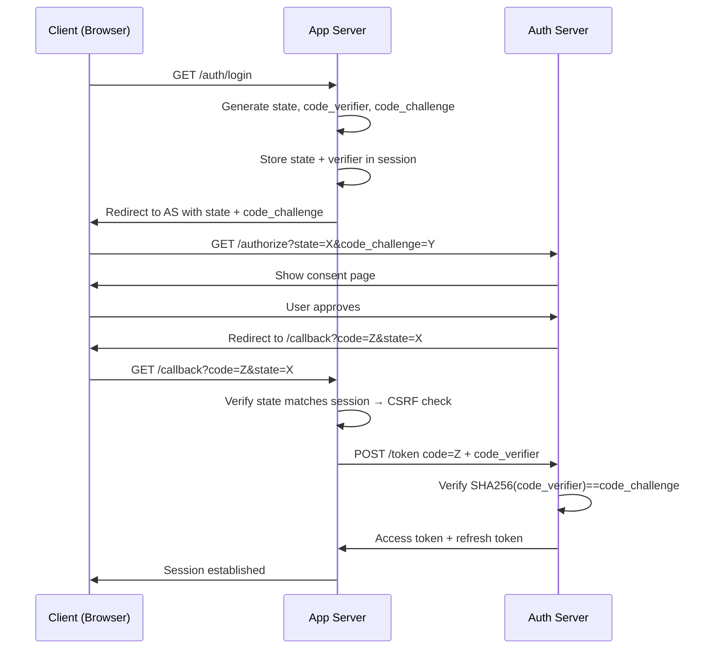

⚡ TL;DR - OAuth 2.0 security best practices address
attacks specific to the OAuth authorization flows:
(1) State parameter: required CSRF protection for
authorization code flow - server generates random
state, verifies it matches after redirect; (2) PKCE
(Proof Key for Code Exchange): required for public
clients (SPA, mobile) - prevents authorization code
interception; (3) Redirect URI: exact match only,
never open redirects or wildcard patterns;
(4) Token storage: access tokens in memory only
(never localStorage); (5) Client credentials: never
expose client_secret in public clients; (6) Token
binding: bind refresh tokens to device/user-agent;
Authorization Code + PKCE is the only secure flow
for new public client applications.

---

| #059 | Category: HTTP & APIs | Difficulty: ★★★★ |
|:---|:---|:---|
| **Depends on:** | OAuth and Token-Based Auth, JWT Security, OWASP API Security | |
| **Used by:** | CSRF and SSRF in APIs, API Gateway Auth at Scale, TLS and Certificate Pinning | |
| **Related:** | OAuth/Tokens, JWT Security, OWASP API Top 10, CSRF/SSRF, API Gateway | |

---

### 🔥 The Problem This Solves

**WORLD WITHOUT IT:**
Developer implements OAuth 2.0 Authorization Code
flow. User clicks "Login with GitHub," gets redirected
to GitHub, authorizes the app, gets redirected back
with `code=abc123` in the URL. Developer exchanges
the code for tokens. Works perfectly.

What the developer did not add: `state` parameter.

Attacker performs CSRF attack: (1) attacker initiates
GitHub OAuth flow on their own account; (2) captures
the redirect URL (with code but before redirecting
back); (3) tricks the victim into clicking that URL;
(4) victim's browser completes the OAuth flow - but
for the attacker's GitHub account. Victim's app
account is now linked to the attacker's GitHub
identity. Attacker can then log in via "Login with
GitHub" as the victim. Classic OAuth CSRF.

**THE BREAKING POINT:**
OAuth 2.0 CSRF attacks on Airbnb and Facebook (2012
research by Chetan Conikee): connecting a malicious
account to a legitimate user's profile via OAuth CSRF.
The `state` parameter was present in the RFC but
optional. Developers treated it as optional. Attacks
demonstrated it was mandatory.

**THE INVENTION MOMENT:**
PKCE (RFC 7636, 2015): originally for native apps
where the client_secret cannot be safely stored (app
binary is inspectable). Code interception attack on
mobile: malicious app registers same URL scheme
(`myapp://callback`), intercepts the authorization
code. PKCE solution: client generates a random
`code_verifier` before the flow, sends
`code_challenge=SHA256(code_verifier)` in authorization
request. The `code_verifier` is sent at token exchange.
Authorization server verifies `SHA256(code_verifier)
== code_challenge`. Intercepted code is useless without
the `code_verifier` (attacker does not have it).

---

### 📘 Textbook Definition

**State parameter (CSRF prevention):**
Server generates a cryptographically random `state`
value before redirecting user to authorization server.
After redirect back, server verifies the `state`
parameter matches what was generated. Prevents CSRF:
an attacker-initiated authorization flow will have
a `state` the victim's server does not recognize.

**PKCE (Proof Key for Code Exchange):**
Client generates `code_verifier` (43-128 char random
string). Sends `code_challenge = BASE64URL(SHA256(
code_verifier))` with the authorization request.
When exchanging code for tokens, sends `code_verifier`.
Authorization server verifies `SHA256(code_verifier)
== code_challenge`. Prevents code interception attacks.
Required for all public clients (SPA, mobile) per
RFC 9700 (OAuth 2.0 Security Best Current Practice).

**Implicit flow deprecation:** The implicit flow
(directly returning access token in URL fragment) is
deprecated (OAuth 2.0 Security BCP). It is vulnerable
to: token leakage in URL, no code/token binding,
no PKCE support. Use Authorization Code + PKCE instead.

**Client credentials flow:** Machine-to-machine only
(no user). Server-to-server API calls. `client_id`
and `client_secret` must be stored securely (not in
code, not in public clients, rotate on compromise).

**Resource Server token validation:** Never use
introspection endpoint on every API call in high-
throughput APIs (performance). Use JWT with short
expiry for stateless validation. Reserve introspection
for high-security endpoints (admin actions, payment
flows).

---

### ⏱️ Understand It in 30 Seconds

**One line:**
OAuth 2.0 security is about protecting the authorization
code flow: use `state` to prevent CSRF, use PKCE to
prevent code interception, use exact redirect URI
matching to prevent open redirect attacks.

**One analogy:**
> OAuth authorization code flow is like a valet
> ticket at a restaurant. You give the valet your car,
> get a ticket (authorization code), present the ticket
> at the valet booth to get your car (exchange code for
> token). CSRF attack: someone tricks you into giving
> your ticket to the wrong valet booth (different OAuth
> state - different restaurant's valet). State parameter
> fix: the ticket has a stamp from YOUR specific
> restaurant that the wrong booth cannot fake.
> PKCE: the ticket also requires a matching physical
> key (code_verifier) that only you have - even if
> someone steals the ticket, they cannot redeem it.

**One insight:**
The `state` parameter is labeled "RECOMMENDED" in the
original RFC 6749. This led developers to treat it as
optional. RFC 9700 (OAuth 2.0 Security Best Current
Practice, 2023) now calls `state` + PKCE REQUIRED for
the authorization code flow. The practical lesson:
when a security control is "recommended" in a spec,
implement it as required in your system. Optional
security controls get skipped under time pressure.

---

### 🔩 First Principles Explanation

**State parameter - CSRF attack and defense:**

```
WITHOUT STATE:
1. Attacker initiates OAuth with their GitHub account
2. Gets redirect_uri=https://app.example.com/callback
   with code=ATTACKER_CODE (before completing flow)
3. Tricks victim: victim's browser opens
   https://app.example.com/callback?code=ATTACKER_CODE
4. App exchanges code for tokens → now app is linked
   to attacker's GitHub identity
5. Attacker logs in via GitHub as the victim's app account

WITH STATE:
1. App generates: state=random_nonce, stores in session
2. Authorization request: ...&state=random_nonce
3. After GitHub redirect: callback has state=random_nonce
4. App verifies: session state == callback state ✓
5. Attacker's redirect does NOT have the correct state
   → App rejects: "State mismatch - possible CSRF"
   (attacker would need to know the victim's session state)
```

**PKCE - Code interception attack and defense:**

```
WITHOUT PKCE (mobile native app):
1. Malicious app registers myapp://callback URL scheme
2. User authorizes legitimate myapp via OAuth
3. Authorization code sent to myapp://callback
4. Malicious app (same URL scheme) intercepts the code
5. Exchanges code for access token

WITH PKCE:
1. Legitimate app generates code_verifier (random 64 chars)
   code_challenge = BASE64URL(SHA256(code_verifier))
2. Authorization request includes code_challenge
3. Code returned to app (malicious app also gets it)
4. Token exchange requires code_verifier
5. Malicious app does NOT have code_verifier (only app does)
   Authorization server: SHA256(attacker_guess) ≠ code_challenge
   → Token exchange rejected
```

---

### 🧪 Thought Experiment

**SCENARIO: OAuth security review - flag the issues**

```
Flow 1: &redirect_uri=https://app.com/oauth/callback%2F..%2Fadmin
  → Open redirect attempt: URL traversal to /admin
  → Fix: exact string match against allowlist

Flow 2: No state parameter in authorization request
  → CSRF vulnerability
  → Fix: generate + verify state

Flow 3: Mobile app using implicit flow (token in URL hash)
  → Deprecated: token leaks in logs, browser history
  → Fix: Authorization Code + PKCE

Flow 4: SPA storing access token in localStorage
  → XSS vulnerability: scripts can read localStorage
  → Fix: memory storage for access token

Flow 5: Client secret in SPA JavaScript bundle
  → Secret exposed in browser source code
  → Fix: SPA is a public client - no client_secret;
    use PKCE without client_secret

Flow 6: Refresh token reuse (not rotating on use)
  → Stolen refresh token reusable indefinitely
  → Fix: refresh token rotation + reuse detection
```

---

### 🧠 Mental Model / Analogy

> OAuth 2.0 security controls are locks on the
> authorization code handshake. State = lock ensuring
> the handshake was initiated by this user (not
> injected by attacker). PKCE = lock ensuring only
> the initiator can complete the handshake (not an
> interceptor). Exact redirect URI = lock ensuring
> the authorization code goes to the right destination
> (not a similar-looking URL). Each lock addresses a
> specific attack on the handshake. Remove any one
> lock and the attacker walks through.

---

### 📶 Gradual Depth - Five Levels

**Level 1 - What it is (anyone can understand):**
When using "Login with [Provider]", OAuth security
controls ensure that attackers cannot trick users into
linking their account to an attacker's identity, or
steal the temporary login code mid-flight.

**Level 2 - How to use it (junior developer):**
Use an OAuth library (Authlib, django-allauth) that
handles state and PKCE automatically. Never implement
OAuth from scratch. Verify that the library is recent
and PKCE-enabled. Register exact redirect URIs with
the OAuth provider, never wildcards.

**Level 3 - How it works (mid-level engineer):**
Authorization Code + PKCE flow: (1) generate
`state` (random 32 bytes, store in session), (2)
generate `code_verifier` (random 64 chars), compute
`code_challenge = BASE64URL(SHA256(code_verifier))`,
(3) redirect to authorization server with state +
code_challenge, (4) on callback: verify state, (5) on
token exchange: send code_verifier. Library handles
all of this; understanding it helps when debugging
OAuth errors.

**Level 4 - Why it was designed this way (senior/staff):**
OAuth 2.0 was designed for flexibility (web, mobile,
server-to-server). That flexibility created multiple
flow types with different security properties. PKCE
started as mobile-only (RFC 7636) but RFC 9700 now
requires it for all public clients (including SPAs).
The authorization server must also verify PKCE (if
client sends code_challenge, server must verify it -
otherwise an old non-PKCE client can bypass by simply
not sending the challenge). PKCE only protects if
the authorization server enforces it.

**Level 5 - Mastery (distinguished engineer):**
Token binding (DPoP - Demonstrating Proof of
Possession, RFC 9449): access tokens are cryptographically
bound to the client's key pair. Even if the token is
stolen (e.g., from a WAF log), it cannot be used by
another client because they do not have the private
key. Client generates an ephemeral key pair per
request, signs a proof (DPoP JWT) with the private
key, sends it with the access token. Authorization
server and resource server verify the DPoP proof.
This is the highest-security OAuth token binding for
high-value APIs (banking, healthcare).

---

### ⚙️ How It Works (Mechanism)

**Authorization Code + PKCE implementation:**

```python
import secrets
import hashlib
import base64
from urllib.parse import urlencode
from fastapi import FastAPI, Request, HTTPException
from fastapi.responses import RedirectResponse

app = FastAPI()

# --- Step 1: Start authorization flow ---
@app.get("/auth/login")
async def start_oauth(request: Request):
    # Generate state (CSRF protection)
    state = secrets.token_urlsafe(32)
    # Generate PKCE code_verifier and code_challenge
    code_verifier = secrets.token_urlsafe(64)
    code_challenge = base64.urlsafe_b64encode(
        hashlib.sha256(code_verifier.encode()).digest()
    ).decode().rstrip("=")

    # Store in server-side session (NOT in cookie body)
    await request.session.set(
        "oauth_state", state
    )
    await request.session.set(
        "pkce_verifier", code_verifier
    )

    params = {
        "response_type": "code",
        "client_id": OAUTH_CLIENT_ID,
        "redirect_uri": "https://app.example.com/auth/callback",
        "scope": "openid profile email",
        "state": state,
        "code_challenge": code_challenge,
        "code_challenge_method": "S256",
    }
    auth_url = f"{AUTHORIZATION_ENDPOINT}?{urlencode(params)}"
    return RedirectResponse(auth_url)

# --- Step 2: Handle callback ---
@app.get("/auth/callback")
async def oauth_callback(
    code: str,
    state: str,
    request: Request
):
    # Verify state (CSRF protection)
    stored_state = await request.session.get("oauth_state")
    if not stored_state or state != stored_state:
        raise HTTPException(400, "State mismatch - CSRF detected")
    await request.session.delete("oauth_state")

    # Retrieve code_verifier
    code_verifier = await request.session.get("pkce_verifier")
    await request.session.delete("pkce_verifier")

    # Exchange code for tokens
    token_response = await http_client.post(
        TOKEN_ENDPOINT,
        data={
            "grant_type": "authorization_code",
            "code": code,
            "redirect_uri": "https://app.example.com/auth/callback",
            "client_id": OAUTH_CLIENT_ID,
            # client_secret for confidential clients only
            # Public clients (SPA): omit client_secret
            "code_verifier": code_verifier,  # PKCE
        }
    )
    tokens = token_response.json()
    # Store access token in memory/session, not localStorage
    # Store refresh token securely (HttpOnly cookie)
    return tokens
```



---

### 🔄 The Complete Picture - End-to-End Flow

**Redirect URI validation (prevents open redirect):**

```python
# BAD: prefix match allows path traversal
REDIRECT_URI_BAD = "https://app.com/oauth/callback"

def is_valid_redirect_bad(uri: str) -> bool:
    return uri.startswith(REDIRECT_URI_BAD)  # BUG
    # Allows: https://app.com/oauth/callback/../admin
    # Allows: https://app.com/oauth/callback.evil.com

# GOOD: exact match against registered allowlist
ALLOWED_REDIRECT_URIS = {
    "https://app.example.com/auth/callback",
    "https://staging.example.com/auth/callback",
}

def is_valid_redirect_good(uri: str) -> bool:
    return uri in ALLOWED_REDIRECT_URIS  # Exact match only
    # No path traversal, no similar-domain bypass
```

**Refresh token rotation:**

```python
async def rotate_refresh_token(old_refresh_token: str):
    """
    Refresh token rotation: old token is revoked, new issued.
    Reuse detection: if old token used again → revoke all tokens
    (possible token theft detected).
    """
    stored = await db.get_refresh_token(old_refresh_token)
    if not stored:
        # Token not found - possible reuse of old rotated token
        # Revoke all tokens for this user (compromise suspected)
        await db.revoke_all_tokens(stored.user_id)
        raise AuthError("Token reuse detected - all tokens revoked")
    if stored.used_at:
        # Token already used → reuse attempt
        await db.revoke_all_tokens(stored.user_id)
        raise AuthError("Refresh token reuse - all tokens revoked")

    # Mark as used, issue new token
    await db.mark_token_used(old_refresh_token)
    new_refresh_token = secrets.token_urlsafe(64)
    await db.store_refresh_token(new_refresh_token, stored.user_id)
    return new_refresh_token
```

---

### 💻 Code Example

**Example 1 - BAD: Multiple OAuth security issues**

```python
# BAD: No state, no PKCE, implicit flow, localStorage
# JavaScript SPA - wrong approach
function startOAuth() {
  // BAD 1: No state parameter (CSRF vulnerable)
  // BAD 2: Implicit flow - returns token in URL hash
  window.location = "https://provider/authorize"
    + "?response_type=token"  // implicit flow
    + "&client_id=myapp"
    + "&redirect_uri=https://app.com/callback";
}
function handleCallback() {
  // BAD 3: Token in URL fragment - logged by servers
  const token = window.location.hash
    .split("access_token=")[1].split("&")[0];
  // BAD 4: Stored in localStorage - XSS vulnerable
  localStorage.setItem("access_token", token);
}

# GOOD: Authorization Code + PKCE (server-side + memory storage)
# See the mechanism section for complete implementation.
# In browser: use an OAuth library that handles PKCE.
# Store access token in memory, not localStorage.
# Use HttpOnly cookie for refresh token.
```

---

### ⚖️ Comparison Table

| OAuth Flow | Security | Use Case | PKCE Required |
|:---|:---|:---|:---|
| Authorization Code + PKCE | Highest | SPA, mobile, web app | Yes (RFC 9700) |
| Authorization Code (confidential) | High | Server-side web app | Recommended |
| Client Credentials | High (no user) | M2M server-to-server | N/A |
| Implicit (deprecated) | Low | Deprecated - do not use | N/A |
| Resource Owner Password | Low | Legacy - do not use | N/A |

---

### ⚠️ Common Misconceptions

| Misconception | Reality |
|:---|:---|
| PKCE is only for mobile apps | PKCE was originally designed for mobile (RFC 7636, 2015) but RFC 9700 (2023 BCP) requires PKCE for ALL public clients including SPAs. Also recommended for confidential clients for defense in depth. |
| OAuth is only for third-party login | OAuth is also the standard for API authorization (M2M with client credentials), user delegation (your app acting on behalf of user in another service), and fine-grained API access control (scopes). It is not limited to "Login with Google." |
| state parameter is just CSRF protection | The `state` parameter is also used to persist application state across the OAuth redirect round-trip (e.g., the URL the user was trying to access before login). The CSRF check is the security function; the state payload can carry application data. |
| Refresh tokens are safer than access tokens | Refresh tokens have longer lifetime and wider blast radius if stolen (can generate many access tokens). They require more protection: stored in DB (revocable), rotated on each use, stored in HttpOnly cookie (not memory). Access tokens are short-lived; refresh tokens are the more sensitive credential. |

---

### 🚨 Failure Modes & Diagnosis

**OAuth CSRF (missing state parameter)**

**Symptom:** User reports their account is linked
to an unknown social account. Attacker is now logged
in as the victim via "Login with GitHub."

**Diagnosis:**
```bash
# Check if state parameter was verified in callback logs
grep "oauth_callback" app.log | grep "state" | head -20
# If no state validation log lines: state not checked

# Check for missing state in audit logs:
grep "oauth_start" app.log | grep -v "state=" | head -10
# Requests without state parameter = vulnerable
```

**Fix:**
Add state generation + verification. If using a
library, ensure the state feature is enabled. Audit
existing linked accounts for anomalies (user linked
an account they do not recognize = potential CSRF
exploitation).

---

**Open redirect in redirect_uri**

**Symptom:** Security scanner reports redirect URI
accepts paths outside the registered base URL.

**Reproduction:**
```
GET /oauth/authorize?redirect_uri=https://app.example.com/oauth/
  callback%2F..%2F..%2Fatacker.com%2Fsteal

If server does prefix match: redirects to
  https://app.example.com/oauth/../../attacker.com/steal
  = https://attacker.com/steal (after normalization)
  Authorization code is now sent to attacker.
```

**Fix:**
Exact string match against registered allowlist.
`uri in ALLOWED_URIS` - not `uri.startswith(base)`.
Register exact URIs including path and query parameters.

---

### 🔗 Related Keywords

**Prerequisites (understand these first):**
- `OAuth and Token-Based Auth` - OAuth 2.0 flow basics
- `JWT Security` - token security fundamentals
- `OWASP API Security Top 10` - API2 (Broken Auth)

**Builds On This (learn these next):**
- `CSRF and SSRF in APIs` - CSRF attacks in context
- `API Gateway Rate Limiting and Auth at Scale` -
  OAuth at infrastructure level

---

### 📌 Quick Reference Card

```
┌──────────────────────────────────────────────────────────┐
│ State param  │ Generate random, verify on callback       │
│              │ Prevents CSRF in auth code flow           │
├──────────────┼───────────────────────────────────────────┤
│ PKCE         │ Required for SPA + mobile (public clients)│
│              │ code_challenge = BASE64URL(SHA256(verifier)│
├──────────────┼───────────────────────────────────────────┤
│ Redirect URI │ Exact match only, no wildcards            │
│              │ Register in OAuth provider exactly         │
├──────────────┼───────────────────────────────────────────┤
│ Token storage│ Access: memory only (not localStorage)    │
│              │ Refresh: HttpOnly Secure SameSite cookie  │
├──────────────┼───────────────────────────────────────────┤
│ Flows        │ Use: Auth Code + PKCE                     │
│              │ Never: Implicit (deprecated), ROPC        │
├──────────────┼───────────────────────────────────────────┤
│ ONE-LINER    │ "Always use state + PKCE for auth code    │
│              │  flow; never implicit or ROPC"            │
└──────────────────────────────────────────────────────────┘
```

**If you remember only 3 things:**
1. Always generate and verify a `state` parameter in
   the authorization code flow. This prevents CSRF.
2. All public clients (SPA, mobile) must use PKCE.
   PKCE is now required by RFC 9700, not optional.
3. Never use the implicit flow. Use Authorization Code
   + PKCE regardless of the client type.

---

### 💎 Transferable Wisdom

**Reusable Engineering Principle:**
"A security control labeled 'recommended' in a spec
should be treated as required in your implementation."
OAuth's `state` parameter was RECOMMENDED in RFC 6749.
PKCE was OPTIONAL for confidential clients. Developers
treated optional as "skip under time pressure." Both
gaps led to real breaches. When designing security
systems: label mandatory controls as REQUIRED in your
internal standards, even if the external spec says
RECOMMENDED. Downstream implementations inherit your
word choices. "Recommended" becomes "skip if busy."
"Required" does not.

**Where else this pattern applies:**
- TLS certificate validation: optional in some HTTP
  client defaults - should be required in your config
- CSRF tokens in forms: optional in some frameworks -
  should be required in all state-changing forms
- Input validation: not required by HTTP spec - always
  required in your application
- Audit logging: optional by default - required for
  any security-sensitive action

---

### 💡 The Surprising Truth

The OAuth 2.0 Resource Owner Password Credentials
(ROPC) flow - where users provide their username and
password directly to the client app (which forwards
to the authorization server) - is listed in the spec
as a "legacy" grant type. Yet it is frequently used
in enterprise systems because it is simpler to
implement (no redirects). The surprise: ROPC is not
just a security risk because the client sees the
password. ROPC fundamentally breaks the OAuth trust
model: the user must trust the client app with their
password (which should only be trusted to the
authorization server). This means phishing the client
app is equivalent to phishing the auth server. ROPC
was included in RFC 6749 for "existing deployments
using direct authentication schemes" - the original
authors expected it to be deprecated. RFC 9700 (2023)
explicitly states: "Clients SHOULD NOT use the ROPC
grant." Fifteen years after OAuth 2.0: ROPC is still
widely deployed. Avoid it in any new implementation.

---

### ✅ Mastery Checklist

**You've mastered this when you can:**
1. **IMPLEMENT** State parameter: generate cryptographically
   random state, store in session, verify on callback.
2. **IMPLEMENT** PKCE: generate code_verifier, compute
   code_challenge as BASE64URL(SHA256(verifier)), send
   verifier at token exchange.
3. **EXPLAIN** Why implicit flow is deprecated and what
   specific attack it is vulnerable to.
4. **IDENTIFY** Open redirect vulnerabilities in redirect
   URI validation (prefix match vs exact match).
5. **DESIGN** Refresh token rotation with reuse detection:
   mark token as used, detect double-use as compromise
   indicator, revoke all tokens.

---

### 🎯 Interview Deep-Dive

**Q1: What is the OAuth state parameter and what
attack does it prevent?**

*Why they ask:* Fundamental OAuth security question.

*Strong answer includes:*
- The `state` parameter is a nonce generated by the
  client before redirecting to the authorization server.
  After the auth server redirects back with the
  authorization code, the client verifies that the
  `state` in the callback matches the one it generated.
- It prevents OAuth CSRF: attacker initiates an OAuth
  flow with their own account, captures the redirect
  URL (with code) before it completes, then tricks
  the victim's browser into opening that URL. The
  victim's app would then link its account to the
  attacker's identity. With `state` verification:
  the attacker's redirect has a `state` the victim's
  session does not recognize → rejected.
- Implementation: `state = secrets.token_urlsafe(32)`,
  stored in the server-side session before redirect.
  On callback: `if request.state != session.state:
  raise 400`. Delete the state from session after
  verification to prevent replay.

**Q2: What is PKCE and why is it required for SPAs?**

*Why they ask:* PKCE is a required modern OAuth practice.

*Strong answer includes:*
- PKCE = Proof Key for Code Exchange (RFC 7636).
  Designed for public clients (mobile, SPA) that cannot
  securely store a client_secret.
- Attack prevented: authorization code interception.
  On mobile: malicious app registered for the same
  URL scheme intercepts the authorization code redirect.
  Without PKCE: attacker exchanges the code for tokens.
  With PKCE: attacker has the code but not the
  `code_verifier` (generated on the legitimate client
  before the flow started). Token exchange requires
  `code_verifier` + auth server verifies
  SHA256(code_verifier) == code_challenge (sent in
  the original authorization request). Attacker fails.
- For SPAs: no URL scheme interception but PKCE also
  provides code-to-token binding. RFC 9700 now requires
  PKCE for all new OAuth client implementations.
- Implementation: `code_verifier = secrets.token_urlsafe(64)`,
  `code_challenge = BASE64URL(SHA256(code_verifier))`,
  add to authorization request, send `code_verifier`
  at token exchange.

**Q3: How should OAuth tokens be stored in a single-
page application?**

*Why they ask:* Tests full-stack security awareness.

*Strong answer includes:*
- localStorage: readable by any JavaScript. XSS
  attack → `localStorage.getItem('token')` steals token.
  Do not use for any tokens.
- sessionStorage: same JavaScript-readable risk as
  localStorage. Do not use.
- Memory (JavaScript variable): not accessible to
  injected scripts (attacker cannot read a variable
  in another closure). Cleared on page refresh.
  Use for access tokens (short-lived, acceptable to
  lose on refresh - re-fetch from auth server).
- HttpOnly cookie: not readable by JavaScript. Sent
  automatically with requests. Must add `Secure` +
  `SameSite=Strict` to prevent CSRF. Use for refresh
  tokens. Cookie cannot be read by XSS but can be
  used by CSRF if SameSite is not set.
- Recommended pattern: access token in memory
  (15-minute expiry), refresh token in HttpOnly Secure
  SameSite=Strict cookie. On page load: silently
  refresh access token using the cookie (invisible
  to user). On logout: server revokes refresh token
  cookie via Set-Cookie with immediate expiry.
