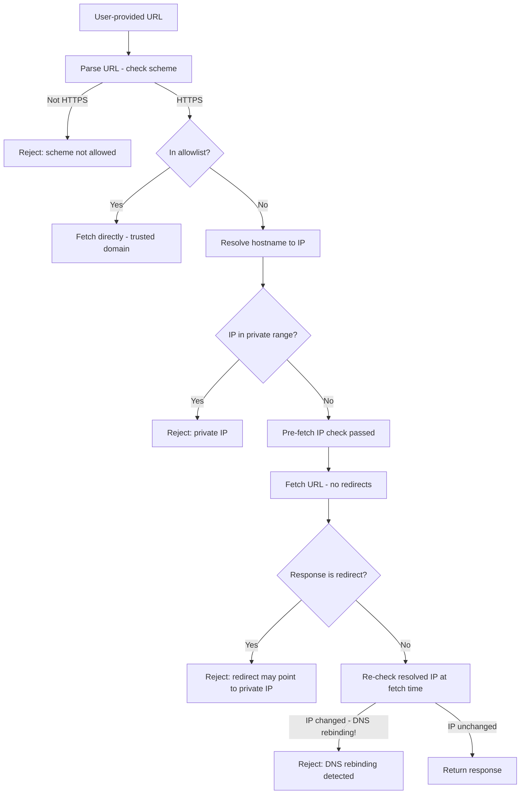

⚡ TL;DR - CSRF (Cross-Site Request Forgery): an
attacker's website makes a browser send authenticated
requests to a victim API using the victim's cookies;
prevention: SameSite=Strict cookies + CSRF token (double
submit or synchronizer pattern); SSRF (Server-Side
Request Forgery): an attacker makes a SERVER fetch an
attacker-controlled URL, allowing access to internal
services (AWS metadata, Redis, databases); prevention:
URL allowlist (not blocklist) + network isolation;
SSRF has higher severity than CSRF (server accesses
internal network that is not reachable from outside);
DNS rebinding bypasses IP-based SSRF checks and requires
re-resolution at fetch time.

---

| #060 | Category: HTTP & APIs | Difficulty: ★★★★ |
|:---|:---|:---|
| **Depends on:** | HTTP Authentication, OWASP API Security Top 10, OAuth 2.0 Security | |
| **Used by:** | API Gateway Rate Limiting and Auth at Scale, TLS and Certificate Pinning | |
| **Related:** | HTTP Auth, OWASP API Top 10, JWT Security, OAuth Security, API Gateway | |

---

### 🔥 The Problem This Solves

**CSRF - THE BREAKING POINT:**
A banking application uses cookie-based session auth.
Browser automatically attaches cookies to all same-
domain requests. Attacker creates `evil.com` with
hidden HTML: ``. When a logged-in
victim visits `evil.com`, the browser sends a GET
request to the bank with the victim's session cookie
(automatic cookie attachment). If the bank's transfer
endpoint accepts GET (or an equivalent form POST): the
transfer executes. Victim loses $10,000. The bank's
authentication worked correctly - the request had a
valid session cookie. The problem: the request was
not intentionally made by the victim.

**SSRF - THE BREAKING POINT:**
Capital One 2019 breach: SSRF vulnerability in a WAF
(Web Application Firewall) misconfiguration allowed
access to the AWS EC2 Instance Metadata Service at
`http://169.254.169.254/latest/meta-data/iam/security-
credentials/`. The attacker retrieved temporary IAM
credentials from the metadata service. Used those
credentials to list and download S3 buckets. 100
million customer records exposed. Root cause: a server
that fetched user-provided URLs without validating
that the URL was not pointing to internal infrastructure.

---

### 📘 Textbook Definition

**CSRF (Cross-Site Request Forgery):**
An attack where an attacker's website tricks an
authenticated user's browser into making requests to
a target application. The target application sees the
request with the user's valid credentials (cookie)
and executes it. The user did not intentionally make
the request.

**CSRF prevention:**
(1) SameSite=Strict cookie: browser only sends cookie
for same-site requests (not cross-site). Modern and
most effective.
(2) CSRF token (synchronizer pattern): server issues
a random token with each form; form submission must
include matching token (stored in session). Stateless
variant: double-submit cookie (CSRF token in cookie
+ in header; attacker cannot read cookie to forge
header).
(3) Origin/Referer header check: reject requests
where Origin does not match expected domain. Less
reliable (can be absent in some cases).

**SSRF (Server-Side Request Forgery):**
An attacker controls a URL that a server fetches.
The server may have access to internal services
(metadata API, internal databases, Redis, other
microservices) that are not accessible from the public
internet. The SSRF leverages the server's network
position.

**SSRF prevention:**
(1) URL allowlist: server only fetches URLs matching
an explicit allowlist (safest). If flexible URL
fetching is required: validate scheme (HTTPS only),
resolve hostname to IP, check IP against blocklist.
(2) Network isolation: URL-fetching service runs in
a network segment with no access to internal services.
Even if SSRF validation fails: network blocks the
request.
(3) Cloud metadata endpoint protection: AWS IMDSv2
requires a PUT request with a session token before
GET requests (prevents simple SSRF via GET to the
metadata URL).
(4) Egress filtering: firewall rules prevent the
application from making requests to internal IP ranges.

---

### ⏱️ Understand It in 30 Seconds

**One line:**
CSRF: browser is weaponized against a target server
(using the victim's cookies). SSRF: a target server
is weaponized against its own internal network
(server fetches attacker-controlled URLs).

**One analogy:**
> CSRF: a pickpocket steals your hand for a moment -
> your hand (browser) signs a check (request) you did
> not intend to sign, using your legitimate pen (cookie).
> The bank (server) sees the valid signature and processes
> the check. The problem is not the signature; it is
> that you did not intend to sign.
>
> SSRF: you give a postman (server) an envelope to
> deliver and write the destination address yourself.
> The postman delivers to wherever you say - including
> the secure mail room in the same building that the
> public cannot enter. You leveraged the postman's
> internal access to reach places you cannot directly.

**One insight:**
SSRF is categorized as API7 in OWASP API Top 10 and
was not in the original 2019 list. It was added in the
2023 revision after the Capital One breach (2019) and
GitLab SSRF (2021) demonstrated SSRF was widespread
and high-impact. The severity: SSRF in a cloud
environment gives access to the Instance Metadata
Service (IMDS) which provides IAM credentials - i.e.,
attacker can become the server's IAM identity. Full
cloud account takeover is possible from a single SSRF
in a cloud-hosted application. This is why cloud
providers added IMDSv2 (AWS, 2019) as a mitigation.

---

### 🔩 First Principles Explanation

**CSRF attack mechanism:**

```
Same-origin policy: prevents JavaScript on evil.com
from READING responses from bank.example.com.
But: same-origin policy does NOT prevent evil.com
from SENDING requests to bank.example.com.

Attack form (on evil.com):
<form action="https://bank.example.com/transfer"
      method="POST" id="csrf-form">
  <input type="hidden" name="to" value="attacker">
  <input type="hidden" name="amount" value="10000">
</form>
<script>document.getElementById('csrf-form').submit()</script>

When victim (logged in to bank) visits evil.com:
1. Form auto-submits
2. Browser sends POST to bank.example.com
3. Browser attaches session cookie (automatic)
4. Bank sees: valid session + POST /transfer → executes
No CSRF token → transfer succeeds
```

**SSRF attack mechanism:**

```
Target API endpoint:
POST /api/fetch-preview
{"url": "https://user-provided.com/image.jpg"}

Server code (vulnerable):
response = requests.get(request_body["url"])
return response.content

Attack: send url="http://169.254.169.254/latest/meta-data/"
Server fetches the AWS metadata URL:
- Returns instance ID, security group, IAM role name
Further: url="http://169.254.169.254/latest/meta-data/
  iam/security-credentials/{role-name}"
Returns temporary AWS credentials (access key + secret
+ token). Attacker now has AWS access.
```

---

### 🧪 Thought Experiment

**SCENARIO: SSRF bypass attempts**

```
Defense attempt 1: Blocklist "169.254.169.254"
Attack bypass: Use DNS name that resolves to 169.254.169.254,
or use http://2852039166/ (decimal IP notation),
or use http://0xa9fea9fe/ (hex notation),
or use IPv6 equivalent.
→ Blocklist approach is fragile. Allowlist is better.

Defense attempt 2: Resolve hostname → check IP → fetch
Attack bypass: DNS rebinding!
1. Attacker registers rebind.evil.com
2. DNS returns 1.2.3.4 (public IP) at validation time
3. DNS TTL = 0 (instant expiry)
4. Between validation and fetch: DNS switches to 169.254.169.254
5. Server fetches → gets metadata
→ Fix: re-resolve hostname immediately before fetch,
   check both pre-fetch and at-fetch-time IPs

Defense attempt 3: Block all private IP ranges
Attack bypass: Use an IPv6 address or a cloud-internal
DNS name that resolves to an internal IP.
→ Network-level isolation is the only reliable defense
```

---

### 🧠 Mental Model / Analogy

> CSRF and SSRF are "forgery" attacks because they
> make requests appear to come from a trusted source.
> CSRF forges the user's browser intent - the browser
> genuinely sends the request with valid credentials,
> but the intent was forged by the attacker's site.
> SSRF forges the server's identity to internal services
> - the request genuinely comes from the trusted server,
> but the destination was chosen by the attacker.
> Both bypass the trust model: CSRF bypasses user
> intent, SSRF bypasses network perimeter trust.

---

### 📶 Gradual Depth - Five Levels

**Level 1 - What it is (anyone can understand):**
CSRF: attacker tricks your browser into doing things
on a website you are logged into (like transferring
money). SSRF: attacker tricks a server into fetching
URLs it should not (like internal company services).

**Level 2 - How to use it (junior developer):**
CSRF fix: add `SameSite=Strict` to session cookies.
For APIs with JSON bodies: require `Content-Type:
application/json` (forms cannot send JSON, so this
filters form-based CSRF). SSRF fix: validate any
user-provided URL against an allowlist before fetching.

**Level 3 - How it works (mid-level engineer):**
CSRF requires cookie-based auth; JWT in Authorization
header is immune (browser does not auto-attach headers
to cross-site requests). If using cookies: SameSite
+ CSRF token. If using JWT Bearer: CSRF is not an
issue (header-based auth). SSRF fix: resolve hostname
to IP, check IP against blocklist (private ranges,
loopback, cloud metadata). Allowlist is better than
blocklist.

**Level 4 - Why it was designed this way (senior/staff):**
SameSite=Strict prevents CSRF by preventing the
browser from sending cookies on cross-site requests.
But SameSite has caveats: top-level navigation (clicking
a link from another site) is considered cross-site.
`SameSite=Strict` blocks the cookie on top-level
navigations too - breaks "login via external link"
flows. `SameSite=Lax` allows cookies on top-level
navigation GET requests but blocks POST from cross-
site. For APIs (no browser navigation): Strict is
correct. For web apps with external login flows: Lax
with CSRF token is the right combination.

**Level 5 - Mastery (distinguished engineer):**
SSRF in a service mesh environment: even if the
application validates URLs, inter-service requests
within the mesh may be authenticated via service
account tokens (mTLS). SSRF that reaches an internal
service might use the trusted service identity to
access other services in the mesh. Network-level
isolation (only allow specific egress destinations
per service, implemented at the mesh level) is the
defense-in-depth approach. Combine with application-
level URL validation. AWS IMDSv2 required PUT pre-
flight with a token before GET - this prevents
simple SSRF because attackers cannot predict the
session token. But complex SSRF (two-request SSRF)
can still bypass IMDSv2 if the vulnerable endpoint
follows redirects and makes multiple requests.

---

### ⚙️ How It Works (Mechanism)

**CSRF token implementation (synchronizer pattern):**

```python
import secrets
from fastapi import FastAPI, Request, HTTPException, Form
from fastapi.responses import HTMLResponse

app = FastAPI()

# --- CSRF Token Generation ---
def generate_csrf_token(session: dict) -> str:
    token = secrets.token_urlsafe(32)
    session["csrf_token"] = token
    return token

def verify_csrf_token(
    session: dict, submitted_token: str
):
    stored = session.get("csrf_token")
    if not stored or submitted_token != stored:
        raise HTTPException(403, "CSRF token invalid")
    # Rotate token after use (prevents replay)
    session["csrf_token"] = secrets.token_urlsafe(32)

# --- Form endpoint with CSRF ---
@app.get("/transfer", response_class=HTMLResponse)
async def transfer_form(request: Request):
    csrf = generate_csrf_token(request.session)
    return f"""
    <form method="POST" action="/transfer">
      <input type="hidden" name="csrf_token" value="{csrf}">
      <input name="amount">
      <button type="submit">Transfer</button>
    </form>
    """

@app.post("/transfer")
async def transfer(
    request: Request,
    csrf_token: str = Form(...),
    amount: float = Form(...)
):
    verify_csrf_token(request.session, csrf_token)
    # CSRF verified → process transfer
    return {"status": "transferred", "amount": amount}
```

**SSRF prevention with allowlist + DNS rebinding fix:**

```python
import socket
import ipaddress
import httpx
from urllib.parse import urlparse
import re

# Allowlist approach (preferred for known domains)
ALLOWED_FETCH_DOMAINS = {
    "cdn.example.com",
    "images.partner.com",
}

# Blocklist approach (for dynamic URLs)
PRIVATE_RANGES = [
    ipaddress.ip_network("10.0.0.0/8"),
    ipaddress.ip_network("172.16.0.0/12"),
    ipaddress.ip_network("192.168.0.0/16"),
    ipaddress.ip_network("169.254.0.0/16"),  # Link-local / AWS IMDS
    ipaddress.ip_network("127.0.0.0/8"),     # Loopback
    ipaddress.ip_network("::1/128"),          # IPv6 loopback
    ipaddress.ip_network("fc00::/7"),         # IPv6 private
]

def is_private_ip(ip: str) -> bool:
    try:
        addr = ipaddress.ip_address(ip)
        return any(addr in net for net in PRIVATE_RANGES)
    except ValueError:
        return True  # Invalid IP = block

def validate_url_ssrf(url: str) -> str:
    parsed = urlparse(url)
    if parsed.scheme not in ("https",):
        raise ValueError("Only HTTPS allowed")
    hostname = parsed.hostname
    if not hostname:
        raise ValueError("Invalid URL: no hostname")
    if hostname in ALLOWED_FETCH_DOMAINS:
        return url  # Allowlist: skip IP check

    # Resolve to IP and check (DNS rebinding defense:
    # re-resolve at fetch time too - see fetch function)
    try:
        ip = socket.getaddrinfo(hostname, 443)[0][4][0]
    except socket.gaierror:
        raise ValueError("Cannot resolve hostname")
    if is_private_ip(ip):
        raise ValueError("Private IP range not allowed")
    return url

async def safe_fetch(url: str) -> bytes:
    """Fetch URL with SSRF protection."""
    validate_url_ssrf(url)  # Pre-fetch validation

    # Re-resolve at fetch time (DNS rebinding fix)
    parsed = urlparse(url)
    hostname = parsed.hostname
    if hostname not in ALLOWED_FETCH_DOMAINS:
        ip = socket.getaddrinfo(hostname, 443)[0][4][0]
        if is_private_ip(ip):
            raise ValueError("DNS rebinding detected")

    async with httpx.AsyncClient(
        timeout=5.0,
        follow_redirects=False  # No redirect following
    ) as client:
        response = await client.get(url)
        if response.is_redirect:
            raise ValueError("Redirect not allowed (SSRF)")
        return response.content
```



---

### 🔄 The Complete Picture - End-to-End Flow

**Cookie security for CSRF prevention:**

```python
# FastAPI session cookie setup (CSRF-resistant)
from starlette.middleware.sessions import SessionMiddleware

app.add_middleware(
    SessionMiddleware,
    secret_key=os.environ["SESSION_SECRET"],
    session_cookie="session",
    same_site="strict",    # CSRF prevention
    https_only=True,       # Secure attribute
    max_age=3600,          # 1 hour session
    # HttpOnly is default in Starlette (True)
)

# For JSON APIs with JWT Bearer auth:
# CSRF is not needed - Bearer header is not automatically
# attached by browsers (unlike cookies).
# Only needed when using cookie-based session auth.
```

---

### 💻 Code Example

**Example 1 - BAD: SSRF via URL fetch without validation**

```python
# BAD: direct URL fetch with no validation
import httpx

@app.post("/fetch-url")
async def fetch_url(url: str):
    # Attacker sends: url="http://169.254.169.254/..."
    # Server fetches AWS metadata → credentials exposed
    async with httpx.AsyncClient() as client:
        response = await client.get(url)  # SSRF VULNERABILITY
    return response.text

# GOOD: validate URL before fetch
@app.post("/fetch-url")
async def fetch_url_safe(url: str):
    validated_url = validate_url_ssrf(url)  # raises on invalid
    return await safe_fetch(validated_url)  # no-redirect fetch
```

---

**Example 2 - BAD vs GOOD cookie configuration**

```python
# BAD: cookie without SameSite (CSRF vulnerable)
@app.post("/login")
async def login_bad(response: Response, ...):
    response.set_cookie(
        key="session",
        value=session_token,
        # No SameSite: browser attaches to cross-site requests
        # No Secure: sent over HTTP
        # No HttpOnly: accessible to JavaScript
    )

# GOOD: CSRF-resistant cookie
@app.post("/login")
async def login_good(response: Response, ...):
    response.set_cookie(
        key="session",
        value=session_token,
        httponly=True,       # Not readable by JavaScript
        secure=True,         # HTTPS only
        samesite="strict",   # Not sent on cross-site requests
        max_age=3600,
        path="/",
    )
```

---

### ⚖️ Comparison Table

| Attack | Target | Requires | Defense |
|:---|:---|:---|:---|
| CSRF | Victim's browser used against server | Cookie-based auth | SameSite=Strict + CSRF token |
| SSRF | Server used against internal network | User-controlled URL fetch | URL allowlist + network isolation |
| CSRF via API | JSON APIs with cookie auth | Cookie + no CSRF token | SameSite=Strict / JWT Bearer |
| SSRF (DNS rebind) | Server fetches internal IP | URL validation without re-resolve | Re-resolve at fetch + network egress |

---

### ⚠️ Common Misconceptions

| Misconception | Reality |
|:---|:---|
| JWT Bearer tokens are immune to CSRF | Correct for Bearer tokens in Authorization header. Bearer header is not automatically attached by browsers (unlike cookies). BUT if you store the JWT in a cookie and send it as a cookie (not a header), CSRF applies. Immunity only holds for header-based JWT delivery. |
| SSRF blocklist is sufficient | IP blocklists are fragile. Attackers use: decimal/hex/octal IP notation, IPv6, DNS aliases, DNS rebinding (IP changes between validation and fetch). Allowlist (only fetch from approved domains) is the only reliable defense. If allowlist is not possible: allowlist + network isolation. |
| CSRF only affects form submissions | CSRF works with any browser-triggered request: forms, img src, CSS url(), XMLHttpRequest (with CORS). For JSON APIs: browser cannot send Content-Type: application/json in a cross-site request without a preflight (CORS). Requiring JSON content type prevents simple CSRF but is not sufficient alone - use SameSite cookies. |
| SSRF is only a problem for user-facing features | SSRF appears in: webhook URL registration (service fetches webhook URL to validate), URL preview generation, import/export features that accept URLs, image resize APIs that fetch source images, CI/CD pipelines that clone arbitrary repo URLs. Any feature that fetches a user-provided URL is a potential SSRF surface. |

---

### 🚨 Failure Modes & Diagnosis

**SSRF leading to metadata credential theft**

**Symptom:** AWS CloudTrail shows API calls from your
EC2 instance role to resources you don't recognize.
Access to S3 buckets with abnormal patterns.

**Diagnosis:**
```bash
# Check application access logs for metadata IP
grep "169.254.169.254" app.log | head -20
# If found: SSRF confirmed, metadata was accessed

# Check if IAM credentials leaked via CloudTrail
aws cloudtrail lookup-events \
  --lookup-attributes AttributeKey=EventName,\
  AttributeValue=GetCredentials \
  --start-time 2024-01-01

# Check for IMDS calls:
aws cloudtrail lookup-events \
  --lookup-attributes AttributeKey=EventSource,\
  AttributeValue=sts.amazonaws.com
```

**Immediate Response:**
(1) Rotate the compromised IAM role credentials.
(2) Identify which endpoint caused the SSRF.
(3) Add URL validation to that endpoint immediately.
(4) Enable IMDSv2 on all EC2 instances (requires
PUT pre-flight - prevents simple GET-based SSRF).

```bash
# Enable IMDSv2 on running instance:
aws ec2 modify-instance-metadata-options \
  --instance-id i-xxx \
  --http-tokens required \
  --http-put-response-hop-limit 1
```

---

**CSRF on state-changing GET endpoint**

**Symptom:** Users report unexpected actions (follows,
likes, transfers) they did not initiate.

**Root Cause:** State-changing endpoint uses GET
(instead of POST), no CSRF protection. ``
on any page causes victims to follow the attacker.

**Fix:**
(1) Move state-changing operations to POST/PUT/DELETE.
(2) Add SameSite=Strict to session cookie.
(3) Add CSRF token to all state-changing forms/API
    calls.
(4) Never use GET for state-changing operations
    (violates HTTP semantics + CSRF risk).

---

### 🔗 Related Keywords

**Prerequisites (understand these first):**
- `HTTP Authentication` - cookie-based auth context
- `OWASP API Security Top 10` - API7 (SSRF) overview
- `OAuth 2.0 Security Best Practices` - OAuth CSRF

**Builds On This (learn these next):**
- `API Gateway Rate Limiting and Auth at Scale`
- `TLS and Certificate Pinning in APIs`

---

### 📌 Quick Reference Card

```
┌──────────────────────────────────────────────────────────┐
│ CSRF         │ SameSite=Strict cookie + CSRF token       │
│ Prevention   │ JWT Bearer in header: CSRF not needed     │
├──────────────┼───────────────────────────────────────────┤
│ SSRF         │ Allowlist domains (preferred)             │
│ Prevention   │ Blocklist: scheme + private IP ranges     │
│              │ + re-resolve at fetch + no redirects      │
├──────────────┼───────────────────────────────────────────┤
│ DNS rebinding│ Re-resolve IP immediately before fetch    │
│              │ Compare pre-fetch and at-fetch IPs        │
├──────────────┼───────────────────────────────────────────┤
│ Cloud SSRF   │ Enable IMDSv2 (PUT pre-flight required)   │
│              │ Egress firewall: block 169.254.169.254    │
├──────────────┼───────────────────────────────────────────┤
│ ONE-LINER    │ "CSRF: browser weapon; SSRF: server weapon│
│              │  Allowlist beats blocklist for SSRF"      │
└──────────────────────────────────────────────────────────┘
```

**If you remember only 3 things:**
1. CSRF: use `SameSite=Strict` on all session cookies.
   APIs using JWT Bearer in Authorization header are
   immune to CSRF (no auto-attachment by browser).
2. SSRF: never fetch user-provided URLs without
   validation. Allowlist known domains. Blocklist private
   IP ranges as second defense. Network isolation as
   third defense.
3. DNS rebinding bypasses IP-based SSRF blocklists:
   re-resolve the hostname immediately before each
   fetch and reject if it now resolves to a private IP.

---

### 💎 Transferable Wisdom

**Reusable Engineering Principle:**
"Browsers and servers are trusted intermediaries;
trust them, and the trust can be weaponized." CSRF
weaponizes the browser's trust (the server trusts the
browser's session cookie). SSRF weaponizes the server's
network position (internal services trust requests
from the application server). Both attacks turn trusted
components into attack vectors. The defense pattern:
never let external-party-controlled data determine the
target of a privileged operation. Browser trust: verify
the request was intentionally made (CSRF token / SameSite).
Server trust: verify the server only fetches from
approved destinations (allowlist / network isolation).

**Where else this pattern applies:**
- XML External Entity (XXE): XML parser fetches external
  entity URLs - same SSRF pattern in a different protocol
- Log4Shell (CVE-2021-44228): Log4j fetched JNDI URLs
  from log messages - same attacker-controlled fetch pattern
- PDF generation with external URLs: PDF renderer
  fetches URLs in HTML - SSRF in PDF generation

---

### 💡 The Surprising Truth

SSRF is not primarily a web application problem; it
is a cloud architecture problem. In traditional data
centers, an internal server accessed by SSRF can reach
databases and internal services - bad, but bounded.
In cloud environments (AWS, GCP, Azure), SSRF can
reach the Instance Metadata Service (IMDS) which
provides short-lived IAM credentials with the server's
full cloud permissions. These permissions often include
access to S3, RDS, Secrets Manager, and more. An SSRF
in a cloud-hosted application can escalate to cloud
account takeover if the application's IAM role is
over-provisioned (which most are). The Capital One
breach showed this exact attack path. The countermeasure:
(1) enable IMDSv2 everywhere, (2) apply least-privilege
IAM (application role should not have access to all
S3 buckets), (3) add URL validation. Defense in depth
is required because a single control (SSRF validation)
in application code may be missed - but network
isolation and IMDSv2 are infrastructure controls
that cannot be bypassed by application logic bugs.

---

### ✅ Mastery Checklist

**You've mastered this when you can:**
1. **EXPLAIN** The browser's automatic cookie attachment
   mechanism and why it enables CSRF.
2. **IMPLEMENT** SameSite=Strict cookie + synchronizer
   CSRF token pattern.
3. **DEMONSTRATE** An SSRF attack against an AWS
   metadata endpoint via a URL-fetch vulnerability.
4. **IMPLEMENT** SSRF prevention with allowlist, IP
   range blocklist, and DNS rebinding protection
   (re-resolve at fetch time).
5. **EXPLAIN** Why JWT Bearer tokens in the Authorization
   header are immune to CSRF while cookie-based JWTs
   are not.

---

### 🎯 Interview Deep-Dive

**Q1: Explain CSRF and how SameSite=Strict prevents it.**

*Why they ask:* Classic web security question.

*Strong answer includes:*
- CSRF: browser automatically attaches cookies to
  requests matching the cookie's domain. An attacker's
  website can trigger a request to the victim's bank
  API; the browser automatically adds the bank's session
  cookie. Bank server sees valid session → executes.
- SameSite=Strict: cookie is only sent when the request
  originates from the same site as the cookie's domain.
  If an attacker's site (evil.com) triggers a request
  to bank.com, the browser does NOT attach the
  SameSite=Strict cookie. Bank server has no session
  → rejects request.
- Nuance: SameSite=Strict also blocks cookies on top-
  level navigation (clicking a link from another site
  to bank.com). For web apps with external links:
  use SameSite=Lax (allows cookies on top-level
  navigation GET, blocks cross-site POST).
- JWT Bearer: if the client uses `Authorization: Bearer
  <token>` header (not a cookie), CSRF is not possible.
  Browsers do not auto-attach Authorization headers
  to cross-site requests. Only cookies are auto-attached.

**Q2: What is DNS rebinding and how does it bypass
SSRF URL validation?**

*Why they ask:* Tests advanced SSRF understanding.

*Strong answer includes:*
- DNS rebinding: attacker registers a domain (rebind.evil.com)
  with very low TTL (e.g., 1 second). DNS initially
  resolves to a legitimate public IP.
- Attack flow: (1) Application validates URL - resolves
  rebind.evil.com → 1.2.3.4 (public, not private - passes
  check). (2) Between validation and actual HTTP fetch:
  DNS TTL expires, rebind.evil.com switches to
  169.254.169.254 (AWS IMDS). (3) Application fetches -
  resolves again → gets private IP. Server connects to
  metadata endpoint.
- The gap: URL validation resolves DNS once at validation
  time. Fetch resolves DNS again at fetch time. Two
  different resolutions, different IPs.
- Fix: re-resolve the hostname immediately before the
  fetch (not just at validation time). Compare the
  re-resolved IP to the validation-time IP. If different:
  DNS rebinding suspected - reject. Or: make the HTTP
  connection using the validated IP directly (bypass
  DNS at fetch time - use the IP obtained at validation
  time as the connect target).
- Defense in depth: network egress firewall prevents
  connections to 169.254.169.254 regardless of
  application-level checks.

**Q3: How does IMDSv2 mitigate SSRF on AWS?**

*Why they ask:* Cloud-specific SSRF mitigation.

*Strong answer includes:*
- IMDSv1 (legacy): single GET request to
  `http://169.254.169.254/latest/meta-data/...` returns
  metadata. SSRF can fetch this directly.
- IMDSv2: two-step process. (1) PUT request to
  `http://169.254.169.254/latest/api/token` with
  `X-aws-ec2-metadata-token-ttl-seconds: 21600` header.
  Returns a session token. (2) GET request with
  `X-aws-ec2-metadata-token: <session-token>` header.
- Why this prevents simple SSRF: SSRF typically works
  via a single GET request (URL in a form field, img
  src, etc.). The PUT + custom header step is difficult
  to achieve with simple SSRF vectors (img src cannot
  do PUT; most URL-fetch SSRF only does GET).
- Limitations: sophisticated SSRF (injecting into a
  fetch library that supports PUT + custom headers)
  can still bypass IMDSv2. IMDSv2 raises the bar but
  is not foolproof. Application-level URL validation
  + network isolation remain necessary.
- How to enforce: `aws ec2 modify-instance-metadata-options
  --http-tokens required` on all instances.
  Can enforce via Service Control Policy (SCP) at the
  organization level.
