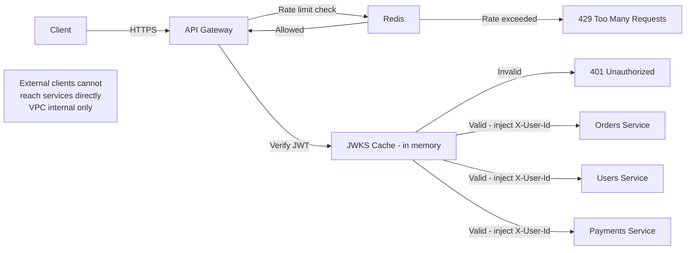

⚡ TL;DR - API Gateway centralizes cross-cutting
concerns for all services behind it: auth (JWT
validation, API key check), rate limiting (per-key /
per-IP / per-tier), and request routing; at scale the
gateway becomes the bottleneck and latency contributor;
key architecture decisions: (1) validate JWT signature
at the gateway (saves downstream service work) but
do NOT forward the raw token - pass validated claims
in a header; (2) use a distributed rate limiter (Redis
Lua atomic script, not per-instance counters) to ensure
consistency across gateway replicas; (3) cache JWKS
(public keys) at the gateway with a 1-hour TTL - never
fetch per-request; gateway should handle 100k+ RPS
per instance; mTLS between gateway and services is
the zero-trust model.

---

| #061 | Category: HTTP & APIs | Difficulty: ★★★★ |
|:---|:---|:---|
| **Depends on:** | API Gateway Pattern, API Throttling/Quota, JWT Security, OAuth Security, CSRF/SSRF | |
| **Used by:** | API Observability, Service Mesh vs API Gateway | |
| **Related:** | API Gateway, Rate Limiting, JWT Security, OAuth Security, CSRF/SSRF, Observability, Service Mesh | |

---

### 🔥 The Problem This Solves

**WORLD WITHOUT IT:**
Each of 50 microservices implements its own JWT
validation, rate limiting, CORS, logging, and auth.
Team A uses PyJWT, Team B uses python-jose (different
validation behaviors), Team C forgot to add rate
limiting entirely. Each deployment requires updating
50 services for a new security header requirement.
A security vulnerability in JWT handling requires 50
patches across 50 services. Rate limit counters are
per-instance (not distributed): service with 3 replicas
allows 3x the intended rate. Auth inconsistency creates
security gaps.

**THE BREAKING POINT:**
DoorDash engineering (2022): monolithic auth logic
scattered across 300+ microservices. Different teams
had different JWT validation logic. Token refresh
logic was inconsistent. To add a new token type: 300
services needed updating. Solution: centralized
authentication at the API gateway layer (Kong). One
place to update for all security changes.

**THE INVENTION MOMENT:**
The API gateway pattern emerged from Netflix's Zuul
(2013): a single entry point to route requests to
backend services and apply cross-cutting filters
(auth, logging, rate limiting). The insight: security
and observability concerns are orthogonal to business
logic. Centralizing them at the gateway keeps services
focused on their domain.

---

### 📘 Textbook Definition

**API Gateway:** a reverse proxy that sits in front
of all backend services, applying cross-cutting
concerns: authentication, authorization, rate limiting,
SSL termination, request routing, request/response
transformation, logging, tracing. All external traffic
flows through the gateway.

**Rate limiting at the gateway:**
(1) Token bucket (preferred): allows bursts, drains
at a rate. Redis stores remaining tokens per key.
(2) Fixed window: simple but allows 2x burst at
window boundary. Redis counter with TTL.
(3) Sliding window: accurate, slightly higher Redis
cost. Use sliding window for strict rate enforcement.
Dimensions: per-API-key, per-IP, per-user, per-tier
(paid tier = higher limit).

**JWT validation at the gateway:**
Gateway validates JWT signature using JWKS (JSON Web
Key Set) fetched from the authorization server and
cached locally. Valid JWT → gateway injects claims into
downstream headers (`X-User-Id`, `X-User-Role`).
Downstream services trust these headers (from gateway
only - blocked from external clients via mTLS or
header injection protection).

**API key authentication at the gateway:**
Gateway looks up API key in a cache (Redis) or in-
memory store. Invalid key → 401 immediately (does
not reach backend). Valid key → request forwarded
with rate limit applied to that key's tier.

---

### ⏱️ Understand It in 30 Seconds

**One line:**
The API gateway is the single security checkpoint
for all services: validate credentials once at the
edge, enforce rate limits once per key, never touch
downstream services for these concerns.

**One analogy:**
> The gateway is an airport security checkpoint. Each
> passenger (request) passes through one checkpoint
> before reaching any gate (service). The checkpoint
> verifies your boarding pass (JWT/API key), checks
> you against no-fly lists (rate limit), ensures you
> have the right ticket for your destination (routing),
> and stamps your passport (injects auth headers).
> Individual gates do not re-check boarding passes -
> they trust the checkpoint's stamp. Without the
> checkpoint: each gate would need its own security
> team, equipment, and inconsistent procedures.

**One insight:**
The hidden cost of JWT validation at the gateway is
JWKS key rotation. When the authorization server
rotates its signing key, it publishes the new public
key in the JWKS endpoint. If the gateway caches the
JWKS with a 1-hour TTL, it may reject valid tokens
signed with the new key for up to 1 hour. Fix: on
signature verification failure, immediately refetch
JWKS (cache invalidation on failure), then retry
validation. This "refetch on failure" pattern handles
key rotation with no downtime: old key tokens fail,
trigger refetch, new key tokens succeed.

---

### 🔩 First Principles Explanation

**Gateway vs per-service auth:**

```
Without gateway auth:
Client → Service A (validates JWT)
Client → Service B (validates JWT, different logic)
Client → Service C (no validation - forgot!)

With gateway auth:
Client → Gateway (validates JWT, injects X-User-Id)
         → Service A (trusts X-User-Id header)
         → Service B (trusts X-User-Id header)
         → Service C (trusts X-User-Id header)

Gateway auth flow:
1. Extract Bearer token from Authorization header
2. Fetch JWKS from cache (not per-request network call)
3. Verify JWT signature with JWKS public key
4. Verify exp, iss, aud claims
5. On success: forward request with X-User-Id, X-Role
6. On failure: return 401 (request never reaches services)

Rate limit flow (per-key, Redis token bucket):
1. Extract API key from X-API-Key header (or Bearer)
2. Lua script: atomically check + decrement tokens
3. Tokens exhausted: return 429 with Retry-After
4. Tokens available: forward request
```

**Distributed rate limiting (Redis Lua script):**

```lua
-- Rate limit check: token bucket algorithm
-- KEYS[1] = "ratelimit:{api_key}"
-- ARGV[1] = max_tokens, ARGV[2] = refill_rate_per_sec
-- ARGV[3] = current_time_ms, ARGV[4] = cost (default 1)
local key = KEYS[1]
local max_tokens = tonumber(ARGV[1])
local refill_rate = tonumber(ARGV[2])
local now = tonumber(ARGV[3])
local cost = tonumber(ARGV[4])

local data = redis.call("HMGET", key,
    "tokens", "last_refill")
local tokens = tonumber(data[1]) or max_tokens
local last_refill = tonumber(data[2]) or now

-- Refill tokens based on elapsed time
local elapsed_sec = (now - last_refill) / 1000
local new_tokens = math.min(
    max_tokens,
    tokens + (elapsed_sec * refill_rate)
)

if new_tokens < cost then
    -- Rate limited
    return {0, math.ceil((cost - new_tokens) / refill_rate)}
end

-- Deduct and store
redis.call("HMSET", key,
    "tokens", new_tokens - cost,
    "last_refill", now)
redis.call("EXPIRE", key, 3600)
return {1, 0}  -- {allowed, retry_after_seconds}
```

---

### 🧪 Thought Experiment

**SCENARIO: Gateway design for 100k RPS**

```
Given: 100k RPS total, 1000 API keys, 100 RPS limit each

Rate limit storage:
  Per-key counter in Redis: 1000 keys × ~100 bytes = 100KB
  Redis handles 100k operations/sec easily (<1ms latency)

JWKS cache:
  1 JWKS endpoint, ~5KB payload
  Cache in gateway memory: 0 network calls per JWT
  Refresh every 1 hour (or on validation failure)
  Savings vs per-request fetch: 100k HTTP calls/sec saved

Per-instance vs distributed:
  10 gateway replicas × 100 RPS limit per key
  Per-instance counter: each allows 100 RPS → 1000 RPS total
  Redis distributed: all share one counter → 100 RPS total

Gateway latency budget:
  JWT validation (JWKS cached): ~0.1ms
  Redis rate limit check: ~0.5ms
  Request routing: ~0.1ms
  Total gateway overhead: ~0.7ms per request
  Must be <1ms to not dominate API latency
```

---

### 🧠 Mental Model / Analogy

> Think of the gateway's layers as concentric defense
> rings: outer ring = rate limiting (blocks flooding
> before any processing); middle ring = authentication
> (identity check, JWKS-based); inner ring = routing
> + header injection (trusted path to services).
> Failures fail fast at the outermost ring: rate-limited
> requests rejected at ring 1, never hit JWT validation.
> Invalid JWTs rejected at ring 2, never hit services.
> Only valid, authorized, non-rate-limited requests
> reach services. Services receive a pre-validated
> identity in headers.

---

### 📶 Gradual Depth - Five Levels

**Level 1 - What it is (anyone can understand):**
The API gateway is a security checkpoint in front of
all your services. Instead of each service checking
authentication and rate limiting, the gateway does
it once for everyone.

**Level 2 - How to use it (junior developer):**
Use a managed gateway (AWS API Gateway, Kong, Envoy)
with plugins for JWT validation and rate limiting.
Configure JWT plugin with your authorization server's
JWKS URL. Configure rate limit plugin with per-key
limits. Services receive `X-User-Id` in headers.

**Level 3 - How it works (mid-level engineer):**
Gateway intercepts all requests. JWT plugin: fetches
JWKS, verifies signature, injects claims. Rate limit
plugin: Redis Lua script atomically checks token bucket.
Routing: rewrites path and forwards to upstream service
based on route configuration. Downstream services
block direct external access (VPC-internal only).

**Level 4 - Why it was designed this way (senior/staff):**
Gateway latency must be sub-millisecond to not dominate
API latency. Key optimizations: (1) JWKS cached in
memory (no network call per JWT); (2) Redis pipeline
for rate limit check (single round-trip); (3) connection
pool to upstream services (no new TCP per request).
Gateway CPU cost: JWT verification is the most
expensive operation. At 100k RPS with RSA (RS256):
~10ms per verification × 100k = CPU bound. Solution:
cache JWT verification result by JTI (JWT ID) with
TTL = min(remaining token lifetime, 60s). Same token
used multiple times in the same minute = one verification.

**Level 5 - Mastery (distinguished engineer):**
Gateway is not a silver bullet. Failure modes: (1)
gateway becomes single point of failure - requires
HA deployment (multiple replicas + load balancer in
front of gateway); (2) gateway becomes performance
bottleneck at very high scale - sidecar proxy model
(Istio/Envoy per-pod) distributes the gateway's work;
(3) gateway does not address east-west traffic (service-
to-service) - service mesh for that; (4) gateway plugin
sprawl - 50 plugins create coupling between gateway
and service behavior. Best practice: gateway handles
infra concerns (auth, rate limit, SSL); business logic
(permissions, entitlements) stays in services.

---

### ⚙️ How It Works (Mechanism)

**Kong gateway plugin configuration (declarative):**

```yaml
# kong.yml - declarative gateway config
services:
  - name: orders-service
    url: http://orders-svc:8080
    routes:
      - name: orders-route
        paths:
          - /api/v1/orders
        strip_path: false
    plugins:
      # JWT validation plugin
      - name: jwt
        config:
          secret_is_base64: false
          # JWKS is configured separately in consumer
          # Gateway validates signature, injects X-Consumer-Username
          key_claim_name: sub
          claims_to_verify:
            - exp
            - nbf
      # Rate limiting plugin (Redis)
      - name: rate-limiting
        config:
          minute: 100          # 100 requests per minute
          limit_by: consumer   # Per API key / consumer
          policy: redis        # Distributed (not local)
          redis_host: redis-svc
          redis_port: 6379
          redis_timeout: 2000  # 2 second timeout
          fault_tolerant: true # On Redis failure: allow through
          # (fail open: better than blocking all traffic)
      # Header injection - block external X-User-Id
      - name: request-transformer
        config:
          remove:
            headers:
              - X-User-Id    # Cannot be set by external clients
              - X-User-Role  # Security: only gateway sets these
          add:
            headers:
              # Added by JWT plugin after validation:
              - "X-User-Id:$(jwt.claims.sub)"
              - "X-User-Role:$(jwt.claims.role)"
```



---

### 🔄 The Complete Picture - End-to-End Flow

**JWKS caching with key rotation handling:**

```python
import time
import httpx
from jwt import PyJWKClient
from cachetools import TTLCache

# JWKS client with caching (PyJWT built-in caching)
jwks_client = PyJWKClient(
    uri="https://auth.example.com/.well-known/jwks.json",
    cache_jwk_set=True,
    lifespan=3600  # Cache JWKS for 1 hour
)

def verify_jwt_gateway(token: str) -> dict:
    """
    Gateway JWT verification with key rotation handling.
    On signature failure: refetch JWKS and retry once.
    """
    try:
        signing_key = jwks_client.get_signing_key_from_jwt(token)
        payload = jwt.decode(
            token,
            signing_key,
            algorithms=["RS256"],
            issuer="https://auth.example.com",
            audience="https://api.example.com",
        )
        return payload
    except jwt.InvalidSignatureError:
        # Possible key rotation: refetch JWKS
        jwks_client.fetch_data()  # Force cache refresh
        try:
            signing_key = jwks_client.get_signing_key_from_jwt(token)
            return jwt.decode(token, signing_key,
                             algorithms=["RS256"],
                             issuer="https://auth.example.com",
                             audience="https://api.example.com")
        except jwt.InvalidSignatureError:
            raise AuthError("Invalid JWT signature")

# JWT result cache (per JTI, TTL = min(token_expiry, 60s))
jwt_cache: TTLCache = TTLCache(maxsize=10000, ttl=60)

def verify_jwt_cached(token: str) -> dict:
    """Cache JWT verification result by token hash."""
    import hashlib
    token_hash = hashlib.sha256(token.encode()).hexdigest()
    if token_hash in jwt_cache:
        return jwt_cache[token_hash]
    payload = verify_jwt_gateway(token)
    jwt_cache[token_hash] = payload
    return payload
```

---

### 💻 Code Example

**Example 1 - BAD: Rate limiting not distributed**

```python
# BAD: per-instance in-memory counter
# With 3 gateway replicas: each allows 100 RPS = 300 RPS total
from collections import defaultdict
import time

request_counts = defaultdict(int)  # In-memory, not shared

async def rate_limit_bad(api_key: str) -> bool:
    minute_key = f"{api_key}:{int(time.time() // 60)}"
    request_counts[minute_key] += 1  # Only in this replica!
    return request_counts[minute_key] <= 100

# GOOD: distributed Redis counter (atomic Lua script)
async def rate_limit_redis(api_key: str) -> bool:
    result = await redis.eval(
        RATE_LIMIT_LUA_SCRIPT,
        1,                   # 1 key
        f"ratelimit:{api_key}",
        100,                 # max_tokens
        1.67,                # refill_rate (100/min = 1.67/sec)
        int(time.time() * 1000),  # current_time_ms
        1                    # cost
    )
    allowed, retry_after = result
    return bool(allowed)
```

---

### ⚖️ Comparison Table

| Gateway | Performance | Features | Cloud | Best for |
|:---|:---|:---|:---|:---|
| Kong | Very High | Rich plugins | Any | High-throughput, extensible |
| AWS API Gateway | Medium | Managed | AWS only | AWS-native, simple use case |
| Envoy/Istio | Highest | Service mesh | Any | East-west + north-south |
| Nginx + Lua | High | DIY | Any | Custom logic, full control |
| Traefik | High | Auto-discovery | k8s | Kubernetes-native |

---

### ⚠️ Common Misconceptions

| Misconception | Reality |
|:---|:---|
| Gateway should validate all business permissions | Gateway handles infrastructure concerns: is this user authenticated? Are they rate-limited? Route to the right service. Business permissions ("can user A delete order B?") must stay in the service, not the gateway. The gateway does not know business context. |
| Caching JWT verification per-token is a security risk | Caching JWT result by token hash for 60 seconds is safe: the cached result is for the SAME token (same signature, same claims). The cache does not create a path to accept different tokens. If the token is revoked via blocklist, the cache misses that - which is why access tokens should have short (15-min) expiry, not long-lived tokens. Short expiry limits the cache risk window. |
| Rate limiting at gateway means services don't need it | Gateway rate limits are at the API level. A single API call that triggers 100 database queries needs service-level protection too. Rate limit at the gateway for API abuse protection, and at the service level for compute/database protection. Both layers needed. |
| Gateway must verify JWT signature | For internal services calling other internal services (east-west traffic), mTLS (service certificates) provides identity. JWT is for external-to-internal (north-south) traffic. A service mesh handles east-west auth with mTLS, not JWT. Gateway verifies JWT for external client identity; service mesh provides service identity. |

---

### 🚨 Failure Modes & Diagnosis

**Gateway Redis dependency failure (rate limit)**

**Symptom:** All API requests start failing with 500
or 429 errors. Redis metrics show connection errors.

**Root Cause:** Rate limit plugin configured with
`fault_tolerant: false`. When Redis is unavailable:
gateway fails all requests (cannot check rate limit).

**Fix:**
```yaml
# Kong rate limit plugin
config:
  fault_tolerant: true  # On Redis failure: allow requests
  # This trades strict rate limiting for availability
  # Acceptable: brief Redis outage should not block all users
  # Unacceptable: if rate limit is critical security control
  #   (e.g., auth endpoint) - consider separate Redis cluster
```

For critical endpoints (login, payment): separate Redis
cluster with failover for rate limiting. For non-
critical: `fault_tolerant: true` (allow through on
Redis failure).

---

**JWKS fetch failing (JWT validation broken)**

**Symptom:** All JWT-authenticated requests returning
401 after certificate rotation.

**Diagnosis:**
```bash
# Check gateway JWKS fetch logs
kubectl logs -n api-gateway deploy/kong | grep "jwks"
# Error: certificate verify failed

# Check JWKS endpoint reachability from gateway pod
kubectl exec -it -n api-gateway deploy/kong -- \
  curl -v "https://auth.example.com/.well-known/jwks.json"
# If SSL error: certificate issue or JWKS endpoint down
```

**Fix:**
If JWKS endpoint cert changed: update trust store in
gateway. If JWKS endpoint is down: implement fallback
to previously cached JWKS (file-based cache in addition
to memory). Gateway should not fail all requests because
the JWKS endpoint is temporarily unreachable.

---

### 🔗 Related Keywords

**Prerequisites (understand these first):**
- `API Gateway Pattern` - gateway basics
- `API Throttling and Quota Management` - rate limit patterns
- `JWT Security` - token validation specifics

**Builds On This (learn these next):**
- `API Observability` - gateway metrics + tracing
- `Service Mesh vs API Gateway Trade-offs` - when to
  use each

---

### 📌 Quick Reference Card

```
┌──────────────────────────────────────────────────────────┐
│ JWT at GW    │ Cache JWKS in memory (1h TTL)             │
│              │ Refetch on signature failure (rotation)   │
├──────────────┼───────────────────────────────────────────┤
│ Rate limit   │ Redis Lua script (atomic token bucket)    │
│              │ fault_tolerant=true on non-critical paths │
├──────────────┼───────────────────────────────────────────┤
│ Header inject│ Remove X-User-Id from inbound (spoofing)  │
│              │ Inject from validated JWT claims          │
├──────────────┼───────────────────────────────────────────┤
│ Distributed  │ Redis for rate limit counters             │
│              │ Per-instance counters = 10x bypass risk   │
├──────────────┼───────────────────────────────────────────┤
│ Scale target │ <1ms gateway overhead per request         │
│              │ JWKS + Redis: ~0.6ms combined             │
├──────────────┼───────────────────────────────────────────┤
│ ONE-LINER    │ "Gateway = edge auth + rate limit;        │
│              │  services trust injected headers"         │
└──────────────────────────────────────────────────────────┘
```

**If you remember only 3 things:**
1. Use distributed rate limiting (Redis), never per-
   instance counters. Per-instance allows N × limit
   where N = replica count.
2. Cache JWKS in memory at the gateway. Never fetch
   JWKS per request. Refetch only on signature failure
   (handles key rotation without downtime).
3. Strip external `X-User-Id` / `X-User-Role` headers
   from inbound requests. Inject them only after JWT
   validation. Otherwise clients can spoof user identity.

---

### 💎 Transferable Wisdom

**Reusable Engineering Principle:**
"Centralize cross-cutting concerns at the boundary;
leave domain concerns to the domain." Cross-cutting
concerns (auth, rate limiting, logging, SSL termination)
apply to every service identically. Domain concerns
(business logic, data access, service-specific
permissions) are unique per service. Centralizing
cross-cutting at the gateway means: one place to update
security policies, one place to enforce compliance
headers, one place to add observability. This is the
same principle as middleware in application frameworks
(authentication middleware in Express, Django, Spring)
but at the infrastructure level. The anti-pattern:
putting business logic in the gateway (routing based
on user plan type, feature flags in gateway config)
- this creates tight coupling between infrastructure
and business logic.

**Where else this pattern applies:**
- Service mesh (Istio/Envoy): same centralization
  principle for east-west traffic
- WAF (Web Application Firewall): centralized security
  inspection before the gateway
- CDN (edge): centralized caching and SSL termination
  before the gateway

---

### 💡 The Surprising Truth

The most common gateway performance mistake is not
choosing the wrong gateway software - it is Redis
network latency. Every rate-limited request requires
at least one Redis round-trip (~0.3-1ms in same AZ).
At 100k RPS: Redis handling 100k Lua script executions
per second. Redis handles this comfortably (1M ops/sec).
But if the Redis cluster is in a different AZ or region
from the gateway replicas: 5-10ms cross-AZ latency
× 100k RPS = gateway becomes the bottleneck. The
fix seems obvious (same-AZ Redis). But in practice,
teams deploy Redis in a central "primary" region,
gateway replicas in three AZs, and wonder why their
P99 gateway latency is 15ms. Locality matters as much
as the algorithm choice. Rate limit accuracy can be
slightly relaxed (eventual consistency using Redis
clusters with async replication) to allow local Redis
replicas per AZ, trading strict accuracy for latency.

---

### ✅ Mastery Checklist

**You've mastered this when you can:**
1. **IMPLEMENT** Distributed token bucket rate limiting
   with a Redis Lua script that atomically checks and
   decrements tokens.
2. **CONFIGURE** JWKS caching at the gateway with key
   rotation handling (refetch on signature failure).
3. **EXPLAIN** Why per-instance rate limit counters
   allow N × the intended rate with N replicas.
4. **DESIGN** Header injection pattern: strip external
   user identity headers, inject from validated JWT.
5. **DIAGNOSE** Gateway Redis failure scenarios and
   explain fault_tolerant trade-off for security vs
   availability.

---

### 🎯 Interview Deep-Dive

**Q1: How does an API gateway validate JWTs at scale?**

*Why they ask:* Common senior/staff question on
gateway architecture.

*Strong answer includes:*
- Gateway fetches JWKS (JSON Web Key Set) from the
  authorization server's `/.well-known/jwks.json`
  endpoint. Caches the JWKS in memory with a long TTL
  (1 hour). Never fetches per request.
- JWT validation: parse header → get `kid` (key ID)
  → find matching public key in JWKS cache → verify
  RSA/EC signature → verify exp, iss, aud claims.
- Key rotation handling: when the auth server rotates
  keys, it publishes new keys in JWKS. Old keys may
  be present for a grace period. If signature validation
  fails: refetch JWKS immediately (cache miss) → retry.
  This handles key rotation without service downtime.
- JWT caching: to avoid CPU cost of RSA verify at
  100k RPS, cache JWT validation result by token hash
  with TTL = min(remaining token lifetime, 60s). Same
  token used multiple times = one cryptographic operation.
- Security: always hardcode `algorithms=["RS256"]`
  at the gateway. Never read algorithm from token header.

**Q2: Design a rate limiting system for 100k API keys,
each with different rate limits (free: 10 RPS, paid:
100 RPS, enterprise: 1000 RPS).**

*Why they ask:* Tests distributed systems + algorithm
knowledge.

*Strong answer includes:*
- Storage: Redis with token bucket per API key.
  Key format: `ratelimit:{api_key}`. Data: `tokens`
  (remaining), `last_refill` (timestamp).
  Metadata: API key → tier mapping stored in Redis
  Hash `api_key:{api_key}:tier` or in-memory cache
  of API key metadata.
- Algorithm: token bucket (allows burst). Refill
  rate = tier limit per second. Max tokens = tier
  limit × burst factor (e.g., 2× for 2-second burst).
  Atomic Lua script: get tier from metadata, get
  current bucket, compute refill, check/decrement.
  All in one Redis call (atomic).
- Dimensions: per-key (primary), per-IP (abuse
  protection for unauthenticated endpoints).
- Response headers: `X-RateLimit-Limit: 100`,
  `X-RateLimit-Remaining: 45`, `X-RateLimit-Reset:
  1705234567` (epoch when bucket refills to full).
  On 429: `Retry-After: 3` (seconds).
- Fault tolerance: `fault_tolerant: true` for most
  endpoints. Critical security endpoints (login):
  separate high-availability Redis cluster; fail closed
  on Redis unavailability.
- Scaling: Redis cluster with slots. Rate limit key
  hash determines which slot/shard. Ensures same API
  key always hits same shard (consistent bucket state).
