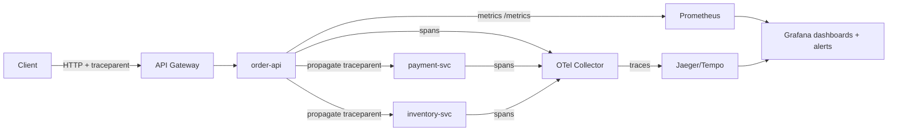

⚡ TL;DR - API observability requires the three pillars
working together: (1) Metrics (Prometheus): four golden
signals (latency, traffic, errors, saturation) per
endpoint using histograms (not averages); (2) Tracing
(OpenTelemetry): W3C traceparent header propagates
trace context across services, Jaeger/Tempo stores
spans, use `trace_id` to join logs + traces; (3)
Logging: structured JSON with `trace_id`, `user_id`,
`endpoint` fields for log-to-trace correlation; key
alert: P99 latency (not P50), error RATE (not count),
saturation (queue depth, connection pool usage); the
golden rule: you can reconstruct ANY request across
50 microservices from a single trace ID in the original
response header.

---

| #062 | Category: HTTP & APIs | Difficulty: ★★★ |
|:---|:---|:---|
| **Depends on:** | API Gateway Pattern, API Gateway Rate Limiting | |
| **Used by:** | gRPC vs REST Performance at Scale, API Load Testing, Service Mesh Trade-offs | |
| **Related:** | API Gateway, API Gateway at Scale, gRPC vs REST Performance, Load Testing, Service Mesh | |

---

### 🔥 The Problem This Solves

**WORLD WITHOUT IT:**
Production API incident. P99 latency on `/api/orders`
spiked from 50ms to 8000ms. No tracing. Logs show
`order_id=12345 took 8.2s` but no breakdown. Three
downstream services called: payment, inventory,
shipping. Which one is slow? Check each service's
logs separately. Payment logs have 15,000 entries
in the incident window. Can't correlate to the original
request. Check inventory: different time format in
logs. Shipping: no latency logging at all. After 4
hours of manual log archaeology: shipping service
has a database connection pool exhaustion issue.
No one can answer "when did this start?" because
there are no P99 latency metrics, only request counts.

**THE BREAKING POINT:**
Google SRE "four golden signals" paper: latency,
traffic, errors, saturation. The insight: you can
derive most alert-worthy states from these four.
Previous approach: hundreds of ad-hoc metrics per
service, inconsistent dashboards, alert fatigue from
metrics that could not be correlated. Standardizing
on four signals per service created coherent system-
wide visibility.

---

### 📘 Textbook Definition

**Three pillars of observability:**

**Metrics:** numeric aggregations over time. For APIs:
request rate (req/sec), error rate (% 5xx), latency
distribution (histogram), active connections. Use
Prometheus histograms for latency (not averages - P50
hides the P99 problem). Alert on P99, not P50.

**Distributed Tracing:** records the journey of a
single request across multiple services. Each service
creates a "span" (name, start time, duration, attributes).
Spans are linked by trace ID and parent span ID. A
"trace" is the tree of all spans for one request.
OpenTelemetry is the standard SDK. Jaeger, Zipkin,
Tempo store and query traces.

**Structured Logging:** log lines are JSON objects
with consistent fields (`timestamp`, `level`,
`trace_id`, `span_id`, `user_id`, `endpoint`,
`latency_ms`, `status`). Enable joining log lines
to traces (same `trace_id`). Avoid free-form log
strings that cannot be queried.

**W3C traceparent header:** `traceparent: 00-{trace_id}-
{parent_span_id}-{flags}`. Propagated across HTTP
calls. Services extract and inject this header to
maintain trace continuity. Without propagation: trace
breaks at service boundary.

---

### ⏱️ Understand It in 30 Seconds

**One line:**
Observability means you can reconstruct WHAT happened
to any request from its trace ID alone - which services
touched it, how long each took, and what was logged.

**One analogy:**
> A distributed trace is like a relay race baton.
> Service A starts the race (creates trace ID), passes
> the baton (traceparent header) to service B, which
> passes it to service C. Each runner adds their split
> time to the baton. After the race: you can read the
> baton and know exactly when each runner ran, who was
> slow, and where the baton was dropped (error). Without
> the baton: you have three runners' times but cannot
> tell which run was for which race.

**One insight:**
The histogram is more important than the average.
If your API has P50 latency of 50ms and P99 of 5000ms:
the average is ~97ms. The average looks "fine" but 1
in 100 users waits 5 seconds. Dashboards showing
"average latency" hide tail latency issues. Prometheus
`histogram_quantile(0.99, rate(latency_bucket[5m]))`
shows P99 latency. Always instrument with histograms,
always alert on P99.

---

### 🔩 First Principles Explanation

**Four golden signals, specifically for APIs:**

```
1. LATENCY: how long requests take
   Metric: request_duration_seconds histogram
   Alert: P99 > SLO threshold (not average)
   Split by: endpoint, status code
   Reason: P99 hides: cache misses, GC pauses,
           connection pool exhaustion

2. TRAFFIC: how much demand
   Metric: requests_total counter (req/sec via rate())
   Alert: 3× baseline sustained for 5min (abnormal)
   Split by: endpoint, method, user_tier
   Reason: baseline helps distinguish DDoS from launch

3. ERRORS: failure rate
   Metric: requests_total{status=~"5.."} / total
   Alert: error rate > 1% for 1 minute
   Split by: endpoint (find the bad one)
   Reason: COUNT of errors is misleading during low traffic;
           RATE is the right signal

4. SATURATION: how full the system is
   Metric: db_pool_connections{state="active"} / max
           process_open_fds / ulimit
           queue_depth / queue_capacity
   Alert: > 80% utilization
   Reason: saturation predicts failure before it happens
```

---

### 🧪 Thought Experiment

**SCENARIO: P99 latency spike investigation via traces**

```
Alert fires: P99 latency on POST /orders > 3000ms

Step 1: Query traces in Jaeger
  - Filter: service=order-api, duration>2000ms, last 15min
  - Find 3 example traces

Step 2: Inspect trace waterfall
  order-api: 3200ms total
    ├── auth_middleware: 2ms
    ├── get_user: 45ms
    ├── check_inventory: 12ms
    └── create_payment: 3100ms  ← 97% of latency!

Step 3: Inspect payment span attributes
  - payment.method: "credit_card"
  - payment.provider: "stripe"
  - http.status_code: 200
  - span.kind: CLIENT
  → Stripe API call taking 3+ seconds

Step 4: Check metrics in Prometheus
  - stripe_api_duration_p99 → 3200ms (vs SLA of 1000ms)
  - stripe_api_error_rate → 0% (not errors - just slow)

Step 5: Root cause
  - Stripe API latency degradation on their end
  - Action: add timeout (1000ms) + async payment (queue)
```

---

### 🧠 Mental Model / Analogy

> Metrics are the dashboard gauges: latency gauge,
> error rate gauge, traffic counter. They tell you
> SOMETHING is wrong. Traces are the X-ray of a
> specific request: they tell you EXACTLY WHERE it
> is wrong. Logs are the doctor's notes for each
> step: the detailed context around each observation.
> To diagnose a production incident: start with
> metrics (which alert fired?), switch to traces
> (which request path is slow?), finish with logs
> (what was the exact error message?). All three
> are needed; each alone is insufficient.

---

### 📶 Gradual Depth - Five Levels

**Level 1 - What it is (anyone can understand):**
Observability means you can answer "what is happening
in my API right now?" with three tools: numbers
(metrics), request timelines (traces), and text (logs).
When something breaks, you use all three to find out
what and why.

**Level 2 - How to use it (junior developer):**
Add OpenTelemetry SDK to your service. It auto-
instruments FastAPI/Express/Spring. Export to Jaeger
(traces) and Prometheus (metrics). Add `trace_id`
to every log line using the OTel trace context.
Your service now has automatic observability for
all HTTP endpoints.

**Level 3 - How it works (mid-level engineer):**
OTel SDK intercepts HTTP requests/responses, creates
spans automatically. `W3C traceparent` header is
propagated: incoming requests attach to existing
traces (external caller's trace) or start new ones.
Outgoing HTTP calls get traceparent injected. Spans
are sent to an OTel Collector, which batches and
forwards to Jaeger/Tempo. Metrics are exposed on
`/metrics` endpoint in Prometheus format.

**Level 4 - Why it was designed this way (senior/staff):**
Sampling is required at scale. 100k RPS × full traces
= ~50GB/day of trace data. Tail-based sampling:
sample 100% of traces where any span had an error
or exceeded latency SLO; sample 1% of normal traces.
This preserves all interesting traces and limits
storage. Head-based sampling (decide at trace start)
is simpler but misses errors discovered later. Tail-
based sampling requires a collector that buffers
spans and makes sampling decisions after the full
trace is assembled.

**Level 5 - Mastery (distinguished engineer):**
OpenTelemetry Exemplars: Prometheus metrics can embed
a trace_id as an "exemplar" - a specific example
trace that caused a particular metric observation.
When investigating a P99 spike: click the exemplar
on the histogram bucket and jump directly to the
trace for that specific slow request. This bridges
the metrics→traces gap without manual correlation.
Grafana supports exemplars natively from Prometheus.
This is the production-grade metrics-to-traces
correlation flow.

---

### ⚙️ How It Works (Mechanism)

**FastAPI + OpenTelemetry auto-instrumentation:**

```python
# main.py - FastAPI with full OTel instrumentation
from opentelemetry import trace
from opentelemetry.sdk.trace import TracerProvider
from opentelemetry.sdk.trace.export import BatchSpanProcessor
from opentelemetry.exporter.otlp.proto.grpc.trace_exporter import (
    OTLPSpanExporter
)
from opentelemetry.instrumentation.fastapi import FastAPIInstrumentor
from opentelemetry.instrumentation.httpx import HTTPXClientInstrumentor
from opentelemetry.instrumentation.sqlalchemy import (
    SQLAlchemyInstrumentor
)
from prometheus_client import Histogram, Counter, Gauge

# --- Tracing setup ---
provider = TracerProvider()
otlp_exporter = OTLPSpanExporter(
    endpoint="http://otel-collector:4317"
)
provider.add_span_processor(BatchSpanProcessor(otlp_exporter))
trace.set_tracer_provider(provider)

app = FastAPI()

# Auto-instrument: all FastAPI endpoints get spans
FastAPIInstrumentor.instrument_app(app)
# Auto-instrument: all httpx calls get spans + traceparent
HTTPXClientInstrumentor().instrument()
# Auto-instrument: all SQLAlchemy queries get spans
SQLAlchemyInstrumentor().instrument()

# --- Custom metrics ---
REQUEST_LATENCY = Histogram(
    "api_request_duration_seconds",
    "API request latency",
    ["method", "endpoint", "status"],
    buckets=[0.005, 0.01, 0.025, 0.05, 0.1, 0.25,
             0.5, 1.0, 2.5, 5.0, 10.0]
)
REQUEST_COUNT = Counter(
    "api_requests_total",
    "API request count",
    ["method", "endpoint", "status"]
)
ACTIVE_REQUESTS = Gauge(
    "api_active_requests",
    "Currently processing requests",
    ["endpoint"]
)

@app.middleware("http")
async def observe_requests(request: Request, call_next):
    endpoint = request.url.path
    ACTIVE_REQUESTS.labels(endpoint=endpoint).inc()
    start = time.time()
    try:
        response = await call_next(request)
        status = str(response.status_code)
    except Exception:
        status = "500"
        raise
    finally:
        duration = time.time() - start
        REQUEST_LATENCY.labels(
            method=request.method,
            endpoint=endpoint,
            status=status
        ).observe(duration)
        REQUEST_COUNT.labels(
            method=request.method,
            endpoint=endpoint,
            status=status
        ).inc()
        ACTIVE_REQUESTS.labels(endpoint=endpoint).dec()
    return response

# --- Structured logging with trace context ---
import structlog
from opentelemetry import trace as otel_trace

def add_trace_context(logger, method, event_dict):
    """Inject current trace ID into all log lines."""
    span = otel_trace.get_current_span()
    if span.is_recording():
        ctx = span.get_span_context()
        event_dict["trace_id"] = format(ctx.trace_id, "032x")
        event_dict["span_id"] = format(ctx.span_id, "016x")
    return event_dict

structlog.configure(
    processors=[
        add_trace_context,
        structlog.processors.TimeStamper(fmt="iso"),
        structlog.processors.JSONRenderer(),
    ]
)
log = structlog.get_logger()
```



---

### 🔄 The Complete Picture - End-to-End Flow

**SLO alerting in Prometheus:**

```yaml
# prometheus/rules/api-slo.yaml
groups:
  - name: api_slo
    rules:
      # P99 latency SLO: < 500ms for 99% of requests
      - alert: APILatencyP99High
        expr: |
          histogram_quantile(0.99,
            rate(api_request_duration_seconds_bucket[5m])
          ) > 0.5
        for: 2m
        labels:
          severity: warning
        annotations:
          summary: "P99 latency above SLO"
          description: "{{ $labels.endpoint }} P99={{ $value }}s"

      # Error rate SLO: < 1% 5xx errors
      - alert: APIErrorRateHigh
        expr: |
          rate(api_requests_total{status=~"5.."}[5m])
          / rate(api_requests_total[5m]) > 0.01
        for: 1m
        labels:
          severity: critical
        annotations:
          summary: "Error rate above 1%"
```

---

### 💻 Code Example

**Example 1 - BAD: Unstructured logging, no trace context**

```python
# BAD: unstructured log, no trace_id
def process_order(order_id: str):
    print(f"Processing order {order_id}")  # Not queryable
    # After an incident: grep "order_id" returns 50k lines
    # Cannot correlate to specific trace

# GOOD: structured log with trace context
def process_order_good(order_id: str):
    log.info(
        "order_processing_started",
        order_id=order_id,
        # trace_id injected automatically by structlog processor
    )
    # Log output: {"event":"order_processing_started",
    #   "order_id":"123","trace_id":"abc123","timestamp":"..."}
    # Can query: trace_id="abc123" in Loki/Elasticsearch
```

---

### ⚖️ Comparison Table

| Signal | Tool | Query Example | Alert On |
|:---|:---|:---|:---|
| Latency | Prometheus histogram | `histogram_quantile(0.99, ...)` | P99 > SLO |
| Error rate | Prometheus counter | `rate(errors[5m]) / rate(total[5m])` | Rate > 1% |
| Traffic | Prometheus counter | `rate(requests_total[1m])` | 3× baseline |
| Saturation | Prometheus gauge | `db_pool_used / db_pool_max` | > 80% |
| Trace | Jaeger/Tempo | `service=orders duration>500ms` | Manual investigation |
| Logs | Loki/Elasticsearch | `trace_id="abc" level=ERROR` | Joined from alerts |

---

### ⚠️ Common Misconceptions

| Misconception | Reality |
|:---|:---|
| Average latency is sufficient | Average hides tail latency. P50=50ms, P99=5000ms → average≈97ms which looks "fine." 1% of users waiting 5 seconds is unacceptable but invisible in average. Always use histograms and monitor P95/P99. |
| Tracing everything causes performance overhead | OTel SDK overhead is ~1-3% CPU increase for typical services. The bigger concern is STORAGE, not CPU. At 100k RPS: trace 100% = 50GB+/day. Use tail-based sampling: 100% of error traces, 1-5% of successful traces. Storage becomes manageable while preserving all failure context. |
| Logs are sufficient without traces | For a single service, logs are sufficient. For 10+ services handling one request, you cannot correlate log lines across services without a shared trace ID. Logs + trace ID correlation = traces. The trace ID is the foreign key that links log lines across service boundaries. |
| Metrics with high cardinality are fine | Prometheus stores one time series per unique label combination. `{user_id="12345"}` as a label creates one time series per user. At 1M users = 1M time series = Prometheus OOM. Never use user IDs, request IDs, or other high-cardinality values as metric labels. Use traces for per-request data. |

---

### 🚨 Failure Modes & Diagnosis

**Trace context not propagating (broken traces)**

**Symptom:** Traces in Jaeger show single-span "islands"
per service instead of connected trees. Cannot correlate
requests across services.

**Root Cause:** Service B receives `traceparent` header
but does not extract it and does not inject it into
outgoing calls to service C.

**Diagnosis:**
```python
# Check if traceparent is in incoming request headers
@app.middleware("http")
async def debug_trace_headers(request: Request, call_next):
    tp = request.headers.get("traceparent")
    print(f"Incoming traceparent: {tp}")
    response = await call_next(request)
    return response

# Check what OTel SDK is extracting:
from opentelemetry.propagators.b3 import B3MultiFormat
from opentelemetry import context
ctx = B3MultiFormat().extract(
    {"traceparent": request.headers.get("traceparent", "")}
)
print(f"Extracted context: {ctx}")
```

**Fix:** Ensure `FastAPIInstrumentor.instrument_app(app)`
is called before any routes are registered. Ensure
`HTTPXClientInstrumentor().instrument()` is called
before any HTTP clients are created.

---

### 🔗 Related Keywords

**Prerequisites (understand these first):**
- `API Gateway Pattern` - where gateway-level metrics live
- `API Gateway Rate Limiting at Scale` - gateway observability

**Builds On This (learn these next):**
- `gRPC vs REST Performance at Scale` - performance
  metrics interpretation
- `API Load Testing` - generating load to verify metrics

---

### 📌 Quick Reference Card

```
┌──────────────────────────────────────────────────────────┐
│ 4 Golden     │ Latency (P99), Traffic (req/s),           │
│ Signals      │ Errors (rate%), Saturation (pool%)        │
├──────────────┼───────────────────────────────────────────┤
│ Histogram    │ Observe duration in histogram, not counter │
│              │ histogram_quantile(0.99,...) for P99       │
├──────────────┼───────────────────────────────────────────┤
│ Trace prop.  │ W3C traceparent header across all calls   │
│              │ FastAPIInstrumentor + HTTPXInstrumentor    │
├──────────────┼───────────────────────────────────────────┤
│ Log joining  │ Add trace_id to every log line            │
│              │ structlog processor from OTel span context │
├──────────────┼───────────────────────────────────────────┤
│ Sampling     │ 100% errors, 1-5% success (tail-based)    │
│              │ Exemplars: metric → trace direct link      │
├──────────────┼───────────────────────────────────────────┤
│ ONE-LINER    │ "Metrics alert you, traces find WHERE,    │
│              │  logs explain WHAT; trace_id links them"  │
└──────────────────────────────────────────────────────────┘
```

**If you remember only 3 things:**
1. Always use histograms for latency, not averages.
   Alert on P99. Average latency hides the 1% of
   users experiencing 100× slower responses.
2. Propagate `traceparent` (W3C) across ALL service
   calls. One broken propagation link breaks the trace
   tree for that request.
3. Add `trace_id` to every log line. This is the
   foreign key that connects your logs to traces and
   makes log-to-trace correlation possible.

---

### 💎 Transferable Wisdom

**Reusable Engineering Principle:**
"Instrument at the layer that sees the full picture,
not at the layer closest to the code." CPU profiling
instrumented deep in business logic misses network
wait time. Latency metrics at the load balancer miss
per-endpoint breakdown. The right instrumentation
layer for APIs is the HTTP middleware: it sees the
request method, path, response status, and total
duration from the service's perspective. This principle
applies: profile at the process boundary (not function
level) for latency investigations; measure at the
queue consumer (not producer) for throughput investigations;
log at transaction commit (not individual operations)
for business event tracking.

**Where else this pattern applies:**
- Database query tracing: instrument at connection
  pool level to capture all queries, not just slow
  queries
- Message queue observability: measure consumer lag
  (messages behind head) not producer throughput
- Frontend observability: measure Time to Interactive
  (user experience) not JavaScript bundle size (internal)

---

### 💡 The Surprising Truth

P99 latency monitoring is necessary but not sufficient
for SLO compliance. The real target is error budget:
the % of time where latency and error rate SLOs are
met. Consider: P99 latency SLO = 500ms, measured
over a 1-month window. In month 1: P99 = 490ms
throughout (compliant). In month 2: P99 = 450ms
for 29 days, then 2000ms for 24 hours (1 day). P99
over the full month = ~500ms (looks compliant from
the monthly average). But SLO compliance measured
correctly: 24 hours of P99 > 500ms = 24/720 hours =
3.3% error budget consumed in one day. Alerting on
the monthly P99 misses this. The correct approach:
burn rate alerts (how fast is the error budget being
consumed?). A 3.3% burn in 1 hour is severe (projected
to consume 100% in 30 hours). Google SRE's "Alerting
on SLOs" chapter: alert when burn rate × time
remaining = error budget exhausted. This is more
sophisticated than "P99 > threshold."

---

### ✅ Mastery Checklist

**You've mastered this when you can:**
1. **IMPLEMENT** Prometheus histogram middleware for
   FastAPI that tracks latency by endpoint and status.
2. **CONFIGURE** OpenTelemetry with FastAPI auto-
   instrumentation, OTLP export, and W3C traceparent
   propagation.
3. **WRITE** A Prometheus alert rule for P99 latency
   above SLO using `histogram_quantile`.
4. **EXPLAIN** Why high-cardinality metric labels
   (user IDs) cause Prometheus OOM and how to avoid it.
5. **DESIGN** Tail-based sampling strategy: 100% errors,
   1% success, using OTel Collector tail sampling processor.

---

### 🎯 Interview Deep-Dive

**Q1: What are the four golden signals and what do
you alert on for each?**

*Why they ask:* Common SRE/platform question.

*Strong answer includes:*
- Latency: time requests take. Alert on P99 > SLO.
  Use `histogram_quantile(0.99, rate(duration_bucket[5m]))`.
  Never alert on average (hides tail). Alert threshold:
  whatever your SLA says. E.g., P99 < 500ms SLO.
- Traffic: requests per second. Alert on 3× sustained
  baseline for 5+ minutes (unexpected spike = load test,
  DDoS, viral event). Baseline is the normal weekday
  traffic pattern.
- Errors: 5xx response rate as a percentage. Alert
  when rate exceeds 1% for > 1 minute. Use rate(),
  not count - error count is misleading during low
  traffic.
- Saturation: how close to capacity. Alert at 80%
  to leave headroom. Saturation metrics: DB connection
  pool utilization, message queue depth, worker thread
  pool active/total, CPU for compute-bound services.
- Why four? They cover the user-visible aspects of
  a service (latency = slowness, errors = failures)
  and the internal capacity aspects (traffic = demand,
  saturation = supply). Together they predict and
  diagnose most SLA-relevant failures.

**Q2: How does distributed tracing work across
microservices?**

*Why they ask:* Tests understanding of trace propagation.

*Strong answer includes:*
- Trace starts at the edge (gateway or first service).
  A unique trace ID is generated. A span is created
  for the current operation.
- W3C traceparent header: `traceparent: 00-{trace_id}-
  {span_id}-{flags}`. Injected into every outgoing
  HTTP call. Extracted from every incoming HTTP call.
- Service B receives traceparent, extracts trace ID
  and parent span ID. Creates its own span with this
  trace ID and parent ID. Adds spans for its DB
  queries, outgoing calls, etc.
- All spans from all services are sent to an OTel
  Collector (batched). Collector forwards to Jaeger/Tempo.
  Jaeger reassembles the tree: parent span = gateway
  call, child spans = downstream service calls.
- The result: a flame graph showing exact timing for
  every operation in every service for that one request.
  The trace ID in the original response header
  (`X-Trace-Id`) lets the user (or your support team)
  look up the exact trace for their failing request.

**Q3: What is the difference between head-based and
tail-based sampling in distributed tracing?**

*Why they ask:* Advanced observability question.

*Strong answer includes:*
- Head-based sampling: sampling decision made at trace
  start (before any processing). If this trace is
  sampled (e.g., 1% probability), ALL spans in the
  trace are sampled. Pros: simple, low overhead.
  Cons: you cannot know at trace start whether this
  trace will be interesting (have errors, high latency).
  1% sampling means 1% of error traces captured.
- Tail-based sampling: OTel Collector buffers all spans
  for a trace for N seconds (typically 30s). After the
  full trace arrives, evaluate rules: if any span has
  error → sample 100%. If P99 exceeded → sample 100%.
  Otherwise → sample 1%. Decision made AFTER seeing
  the full trace.
- Pros of tail-based: captures 100% of error and slow
  traces (the important ones). Reduces storage by
  discarding fast successful traces.
- Cons: OTel Collector must buffer all spans (memory
  pressure). Spans for a trace must reach the same
  collector instance (consistent hashing by trace ID).
  Higher operational complexity.
- When to use: high-traffic services where full
  sampling is cost-prohibitive (100k RPS → tail-based
  with 1% success sampling + 100% error sampling is
  standard production practice).
