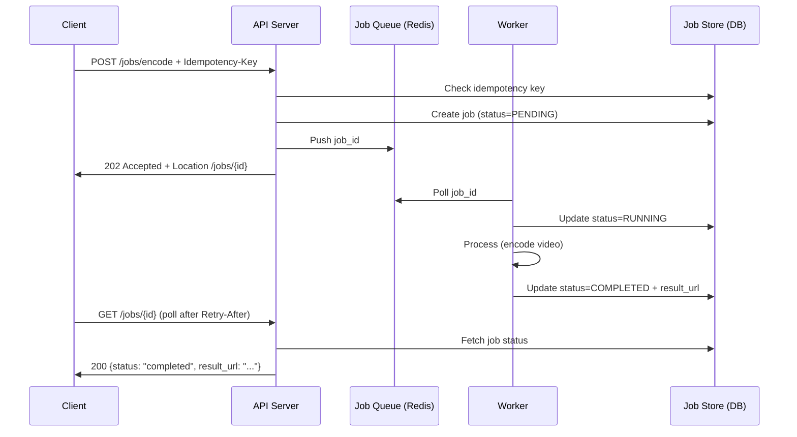

⚡ TL;DR - Long-running operations (video encoding,
report generation, ML inference) should never block
an HTTP connection; the async job pattern: POST
returns 202 Accepted + `Location: /jobs/{id}` header
immediately; client polls `GET /jobs/{id}` until
status transitions to `completed` or `failed`; OR
register a webhook that the server calls on completion;
job status machine: PENDING → RUNNING → COMPLETED /
FAILED; include partial progress in job status (% done);
idempotency: POST with Idempotency-Key must return
the same job ID on retries (not create two jobs);
use Celery/RQ/BullMQ for the worker pool; the
`Retry-After` header in 202 response tells clients
how long to wait before first poll.

---

| #063 | Category: HTTP & APIs | Difficulty: ★★★ |
|:---|:---|:---|
| **Depends on:** | HTTP Methods and Safe/Idempotent Semantics, HTTP Request/Response Cycle, Idempotency in APIs, Long Polling/SSE/WebSocket | |
| **Used by:** | Event-Driven APIs (Webhooks vs Kafka vs SSE) | |
| **Related:** | HTTP Methods, HTTP Cycle, Idempotency, Long Polling/SSE/WS, Event-Driven APIs | |

---

### 🔥 The Problem This Solves

**WORLD WITHOUT IT:**
Client POSTs a video encoding job: `POST /encode`. The
server starts encoding (5 minutes). The HTTP connection
stays open. After 30 seconds: client's connection
times out (default browser/CDN timeout). Job continues
on the server. Client retries `POST /encode` - creates
a second encoding job for the same video. Eventually
the client has 5 identical encoding jobs running.
Or: the server crashes mid-operation - client gets
a 500 with no information about whether the work
completed. Client retries - starts another encoding job.

**THE BREAKING POINT:**
AWS Textract (document analysis API): processing a
1000-page PDF takes 5-7 minutes. AWS could not fit
that in a synchronous HTTP call. Solution: return
a JobId immediately, poll for results. Every cloud
provider that offers compute-intensive API operations
uses this pattern (AWS Transcribe, GCP Vision API
batch, Azure Form Recognizer).

---

### 📘 Textbook Definition

**Async job pattern (polling variant):**
1. `POST /jobs` (submit work) → `202 Accepted` with
   `Location: /jobs/{job_id}` and `Retry-After: 5`
   (seconds before first poll).
2. `GET /jobs/{job_id}` → `200 OK` with job status
   object: `{status: "pending|running|completed|failed",
   progress: 45, result_url: null, error: null}`.
3. Client polls until `status == "completed"` or
   `"failed"`. On completed: retrieve result via
   `result_url` or embedded in the job response.

**Async job pattern (webhook variant):**
1. `POST /jobs` with `callback_url` in body →
   `202 Accepted` with `job_id`.
2. Server processes job in background.
3. On completion: server POSTs to `callback_url` with
   job result. Client processes callback.

**Job ID idempotency:** duplicate POSTs with the same
`Idempotency-Key` return the same `job_id`. Prevents
duplicate jobs on client retry.

**Job state machine:**
`PENDING` (queued) → `RUNNING` (worker picked up)
→ `COMPLETED` (result available) or `FAILED` (error,
can be retried). Optional: `CANCELLED` (user-requested
cancellation).

**Webhook security:** server-side outbound webhook
must sign the payload (HMAC-SHA256 with a shared
secret). Client verifies signature before processing.
Prevents forged webhook callbacks.

---

### ⏱️ Understand It in 30 Seconds

**One line:**
Return 202 Accepted immediately, give the client a
job ID to poll - never keep an HTTP connection open
for longer than 30 seconds.

**One analogy:**
> The async job pattern is like a restaurant with a
> buzzer pager system. You order (POST), get a buzzer
> number (job_id), and are told "about 20 minutes"
> (Retry-After). You go sit down and the restaurant
> pages you when ready (webhook callback) OR you check
> the buzzer periodically (polling). The waiter does
> not stand at your table for 20 minutes blocking a
> table (HTTP connection). The order is being processed
> in the background.

**One insight:**
The `Retry-After` header in the 202 response is
commonly overlooked. Without it, clients poll
immediately and repeatedly. With it: clients wait
the suggested delay before first poll. This is
exponential backoff built into the HTTP response:
`Retry-After: 5` for short jobs, `Retry-After: 30`
for long ones. Good API design tells clients how
to behave; it does not rely on clients being polite.

---

### 🔩 First Principles Explanation

**Synchronous vs async cost comparison:**

```
Synchronous (BAD for long operations):
  Client connects → holds TCP connection open
  Server thread allocated for 5 minutes
  With 100 concurrent requests: 100 threads blocked
  Thread pool: 100 threads max → queue fills
  101st request: queue timeout → 503

Asynchronous (GOOD):
  Client POST → 202 + job_id (in <100ms)
  Server: push job to queue, release thread
  Worker: picks job from queue, processes independently
  Server thread allocated for: 100ms (not 5 minutes)
  100 concurrent requests: 100 × 100ms = normal load
  Worker pool: scales independently from HTTP server
```

**Job queue architecture:**

```
Client → API Server → Job Queue (Redis/RabbitMQ/SQS)
                      ↓
                   Worker Pool
                      ↓
                   Job Store (PostgreSQL/Redis)
                      ↓
          Client polls GET /jobs/{id}
          or: webhook callback to client
```

---

### 🧪 Thought Experiment

**SCENARIO: Which polling frequency is correct?**

```
Job expected duration: 30 seconds
Naive poll: every 1 second for 30 seconds = 30 requests
Smart poll: respect Retry-After, then exponential backoff
  Wait 10s (Retry-After), check, wait 5s, check, done
  = 2-3 requests total

For a 1-hour job:
  Naive poll (every 1s): 3600 requests
  Smart poll (1s → 2s → 4s → 8s → ... → max 60s cap):
    ~30 requests total
  → 120× reduction in polling load

Webhook alternative:
  0 polling requests. Server calls when done.
  Trade-off: client must be publicly reachable
  (or use message queue for pull-style webhooks)
```

---

### 🧠 Mental Model / Analogy

> Think of the async job pattern as a government
> permit application. You submit the application
> (POST → 202), get an application number (job_id).
> You do not wait at the counter for 6 weeks. You
> can either check the status online (polling) or
> set up email notifications (webhook). The government
> office processes your application independently.
> The HTTP connection closing is equivalent to leaving
> the office building - the work continues without
> your presence.

---

### 📶 Gradual Depth - Five Levels

**Level 1 - What it is (anyone can understand):**
When an API task takes longer than a few seconds,
don't make the user wait. Return a job ID immediately,
let the user check back when ready. Like a pickup
number at a deli counter.

**Level 2 - How to use it (junior developer):**
POST to create job → receive 202 + Location header.
Poll the Location URL with GET. Check `status` field.
When `status == "completed"`, retrieve result from
`result_url`. Use exponential backoff for polling
(wait 1s, 2s, 4s, 8s, up to 60s max).

**Level 3 - How it works (mid-level engineer):**
Server creates job record in DB (status=PENDING),
pushes job_id to Celery/RQ queue, returns 202 + job_id.
Worker picks up job_id from queue, fetches job
parameters from DB, processes, updates DB with
result/error, updates status=COMPLETED/FAILED.
GET /jobs/{id}: queries DB, returns current status.
If webhook: worker makes HTTP POST to callback_url
on completion.

**Level 4 - Why it was designed this way (senior/staff):**
Job store (DB) and job queue (Redis/MQ) are separate.
Job store: source of truth for job status, persistent.
Job queue: delivery mechanism, ephemeral. If worker
crashes mid-job: job_id remains in queue with at-
least-once delivery, worker retries. If DB is
unavailable: worker pauses (queue buffers). Separation
allows different scaling, durability, and failure
characteristics. Job store must be durable (ACID).
Queue must be reliable (at-least-once or exactly-once).

**Level 5 - Mastery (distinguished engineer):**
At scale: idempotency is critical. Client retries POST
(timeout on 202 response). Two identical jobs created.
Solution: Idempotency-Key header. Server stores
`{idempotency_key: job_id}` in Redis (TTL 24h). On
POST: check Redis first. If key exists: return same
job_id. If not: create job, store key→job_id. Exactly-
once job creation regardless of client retry behavior.
Also: webhook reliability. Webhook delivery may fail
(callback_url unreachable). Webhook system needs
retry with exponential backoff, dead letter queue for
permanently failing webhooks, and visibility into
webhook delivery status.

---

### ⚙️ How It Works (Mechanism)

**FastAPI async job implementation:**

```python
from fastapi import FastAPI, BackgroundTasks
from celery import Celery
import uuid, redis

app = FastAPI()
redis_client = redis.Redis(host="redis", decode_responses=True)
celery_app = Celery(broker="redis://redis/0",
                    backend="redis://redis/1")

# Job status store (use PostgreSQL in production)
def get_job(job_id: str) -> dict:
    return redis_client.hgetall(f"job:{job_id}")

def create_job(job_id: str, params: dict):
    redis_client.hset(f"job:{job_id}", mapping={
        "status": "pending",
        "progress": 0,
        "params": json.dumps(params),
        "created_at": time.time(),
    })

def update_job(job_id: str, **fields):
    redis_client.hset(f"job:{job_id}", mapping=fields)

# --- Submit endpoint ---
@app.post("/jobs/encode", status_code=202)
async def submit_encode(
    request: EncodeRequest,
    idempotency_key: Optional[str] = Header(None)
):
    # Idempotency check
    if idempotency_key:
        existing = redis_client.get(
            f"idempotency:{idempotency_key}"
        )
        if existing:
            return Response(
                status_code=202,
                headers={"Location": f"/jobs/{existing}"}
            )

    job_id = str(uuid.uuid4())
    create_job(job_id, request.dict())

    # Store idempotency key
    if idempotency_key:
        redis_client.set(
            f"idempotency:{idempotency_key}",
            job_id,
            ex=86400  # 24-hour TTL
        )

    # Push to Celery queue
    encode_video.apply_async(
        args=[job_id],
        task_id=job_id
    )

    return Response(
        status_code=202,
        headers={
            "Location": f"/jobs/{job_id}",
            "Retry-After": "10",  # Poll after 10 seconds
        },
        content=json.dumps({"job_id": job_id})
    )

# --- Status endpoint ---
@app.get("/jobs/{job_id}")
async def get_job_status(job_id: str):
    job = get_job(job_id)
    if not job:
        raise HTTPException(404, "Job not found")
    response = {
        "job_id": job_id,
        "status": job["status"],
        "progress": int(job.get("progress", 0)),
        "result_url": job.get("result_url"),
        "error": job.get("error"),
    }
    if job["status"] == "completed":
        return JSONResponse(response)
    if job["status"] == "failed":
        return JSONResponse(response, status_code=200)
    # In-progress: include Retry-After for polling
    return JSONResponse(
        response,
        headers={"Retry-After": "5"}
    )

# --- Celery worker ---
@celery_app.task(
    bind=True,
    max_retries=3,
    default_retry_delay=60
)
def encode_video(self, job_id: str):
    try:
        update_job(job_id, status="running", progress=0)
        params = json.loads(get_job(job_id)["params"])

        # Simulate encoding with progress updates
        for i in range(0, 100, 10):
            time.sleep(3)  # Real work here
            update_job(job_id, progress=i)

        result_url = f"s3://bucket/encoded/{job_id}.mp4"
        update_job(
            job_id,
            status="completed",
            progress=100,
            result_url=result_url
        )
    except Exception as exc:
        update_job(
            job_id,
            status="failed",
            error=str(exc)
        )
        raise self.retry(exc=exc)
```



---

### 🔄 The Complete Picture - End-to-End Flow

**Webhook variant with signature verification:**

```python
import hmac, hashlib

# Server: POST to webhook on completion
async def notify_webhook(job_id: str, callback_url: str):
    payload = {
        "job_id": job_id,
        "status": "completed",
        "result_url": f"s3://bucket/{job_id}.mp4"
    }
    body = json.dumps(payload).encode()
    signature = hmac.new(
        WEBHOOK_SECRET.encode(),
        body,
        hashlib.sha256
    ).hexdigest()

    async with httpx.AsyncClient() as client:
        await client.post(
            callback_url,
            content=body,
            headers={
                "Content-Type": "application/json",
                "X-Signature-256": f"sha256={signature}"
            },
            timeout=10.0
        )

# Client: verify webhook signature before processing
@app.post("/webhook/job-complete")
async def receive_webhook(
    request: Request,
    x_signature_256: str = Header(...)
):
    body = await request.body()
    expected = "sha256=" + hmac.new(
        WEBHOOK_SECRET.encode(),
        body,
        hashlib.sha256
    ).hexdigest()
    if not hmac.compare_digest(x_signature_256, expected):
        raise HTTPException(401, "Invalid signature")
    payload = json.loads(body)
    # Process result...
```

---

### 💻 Code Example

**Example 1 - BAD: Blocking synchronous job**

```python
# BAD: blocks HTTP connection for minutes
@app.post("/encode")
async def encode_video_blocking(video_url: str):
    # Blocks thread for 5 minutes
    result = subprocess.run([
        "ffmpeg", "-i", video_url, "output.mp4"
    ], capture_output=True)  # BAD: timeout, connection loss
    return {"result": result.stdout}

# GOOD: async job pattern
@app.post("/encode", status_code=202)
async def encode_video_async(video_url: str):
    job_id = str(uuid.uuid4())
    encode_task.delay(job_id, video_url)  # Push to queue
    return Response(
        status_code=202,
        headers={"Location": f"/jobs/{job_id}",
                 "Retry-After": "10"}
    )
```

---

### ⚖️ Comparison Table

| Pattern | Latency | Complexity | Best for |
|:---|:---|:---|:---|
| Synchronous HTTP | Blocks | Low | < 5 second operations |
| 202 + Polling | Immediate | Medium | Stateless clients, no inbound |
| 202 + Webhook | Immediate | Medium-High | Event-driven clients, inbound available |
| SSE progress | Streams | Medium | Real-time progress display |
| WebSocket | Streams | High | Interactive long-running ops |

---

### ⚠️ Common Misconceptions

| Misconception | Reality |
|:---|:---|
| 202 means the job succeeded | 202 means "accepted for processing" - the job has not started yet and may fail later. The client MUST poll (or receive a webhook) to know the actual outcome. Never interpret 202 as "completed." |
| Clients should poll as fast as possible | Clients should respect `Retry-After` in the 202 and job status responses, then use exponential backoff. Aggressive polling creates unnecessary load on the job status endpoint with no benefit (the job finishes when it finishes). |
| Cancelling a job is simple | Job cancellation is complex: (1) if worker has not started: remove from queue (easy); (2) if worker is in-progress: send a cancellation signal (cooperative cancellation - worker checks periodically); (3) if completed: cancel is a no-op. Distributed job cancellation requires coordination between queue and worker. |
| Idempotency-Key is only needed for payment APIs | Any POST that creates a job needs idempotency. If the 202 response is lost in transit, the client retries. Without idempotency: two identical jobs. With Idempotency-Key: second POST returns the same job_id. This applies to any expensive, non-trivially-reversible operation. |

---

### 🚨 Failure Modes & Diagnosis

**Worker crashes mid-job (task lost)**

**Symptom:** Jobs stuck in `running` status indefinitely.
No completion webhook received.

**Root Cause:** Worker process crashed while processing
the job. The job was "acked" from the queue prematurely
(at-most-once delivery mode).

**Fix:**
Use at-least-once delivery in Celery/RQ:
```python
# Celery: ack message AFTER task completes (not at start)
@celery_app.task(acks_late=True, reject_on_worker_lost=True)
def encode_video(job_id: str):
    # Message is NOT acked until this function returns
    # If worker crashes: message returns to queue
    ...
```

Add a job timeout + stale job recovery:
```python
# Scheduled task: find jobs stuck in "running" for > 10min
async def recover_stale_jobs():
    stale_time = time.time() - 600  # 10 minutes
    stale_jobs = db.query(Job).filter(
        Job.status == "running",
        Job.updated_at < stale_time
    ).all()
    for job in stale_jobs:
        job.status = "failed"
        job.error = "Worker timeout"
```

---

### 🔗 Related Keywords

**Prerequisites (understand these first):**
- `HTTP Methods and Safe/Idempotent Semantics` - 202 semantics
- `Idempotency in APIs` - preventing duplicate jobs

**Builds On This (learn these next):**
- `Event-Driven APIs (Webhooks vs Kafka vs SSE)` -
  event-driven completion notification

---

### 📌 Quick Reference Card

```
┌──────────────────────────────────────────────────────────┐
│ Submit       │ POST → 202 + Location + Retry-After       │
│              │ Return job_id within 100ms always         │
├──────────────┼───────────────────────────────────────────┤
│ Poll         │ GET /jobs/{id} → status + progress        │
│              │ Backoff: 1s→2s→4s→...→60s max            │
├──────────────┼───────────────────────────────────────────┤
│ Webhook      │ Sign payload: HMAC-SHA256 + X-Signature   │
│              │ Client verifies before processing         │
├──────────────┼───────────────────────────────────────────┤
│ Idempotency  │ Idempotency-Key → same job_id on retry    │
│              │ Store key→job_id in Redis with 24h TTL    │
├──────────────┼───────────────────────────────────────────┤
│ Recovery     │ acks_late=True: requeue on worker crash   │
│              │ Stale job sweep: recover stuck "running"  │
├──────────────┼───────────────────────────────────────────┤
│ ONE-LINER    │ "202 = accepted, not complete;            │
│              │  poll or webhook to know the outcome"     │
└──────────────────────────────────────────────────────────┘
```

**If you remember only 3 things:**
1. Return 202 + `Location` header + `Retry-After` within
   100ms. Never block the HTTP connection for long
   operations.
2. Use `Idempotency-Key` to prevent duplicate jobs on
   client retry. Store `{key: job_id}` in Redis with
   24h TTL.
3. Worker delivery mode: `acks_late=True`. Message is
   requeued if worker crashes. Without this: jobs are
   silently lost on worker crash.

---

### 💎 Transferable Wisdom

**Reusable Engineering Principle:**
"Separate command acceptance from command execution."
HTTP request = command acceptance (fast, synchronous).
Actual work = command execution (slow, asynchronous).
This applies beyond APIs: database triggers vs
application events; synchronous API calls vs message
queues; HTTP webhooks vs polling. The principle is
"don't block the caller while doing expensive work."
Command acceptance should be fast (< 100ms). Execution
may take arbitrary time. The Job ID is the receipt
that connects them. This is the Command Query
Responsibility Segregation (CQRS) pattern applied
to API design: write commands are accepted quickly,
processed eventually.

**Where else this pattern applies:**
- Email sending: POST /emails → 202 + job_id; email
  queued in SendGrid; webhook on delivery/bounce
- Database migrations: POST /migrations → 202; large
  table alter happens asynchronously; GET to check
  status
- ML model training: POST /models → 202; training runs
  for hours; webhook on completion

---

### 💡 The Surprising Truth

The hardest part of the async job pattern is not the
job queue or the worker - it is the client-side polling
implementation. The common mistake: polling with a
fixed interval (1 second forever). This causes:
(1) 3600 requests for a 1-hour job (unnecessary load);
(2) missed completions if the client pauses polling
when the browser tab goes to background; (3) no way
to tell the client "stop polling, the job is done"
- the client must keep asking. The elegant solution
that most teams miss: use SSE (Server-Sent Events)
as a polling-push hybrid. Client connects to `GET
/jobs/{id}/events` with `Accept: text/event-stream`.
Server holds the SSE connection and pushes updates
as the job progresses. No client polling logic needed.
The SSE connection replaces polling entirely. When
the job completes: push a `data: {"status":"completed"}
\n\n` event and close the connection. One long-lived
connection instead of hundreds of polls. The catch:
SSE still requires connection timeout handling, and
if the job takes hours, the SSE connection needs to
be periodically re-established (keep-alive comments
every 15 seconds prevent proxy timeouts).

---

### ✅ Mastery Checklist

**You've mastered this when you can:**
1. **IMPLEMENT** 202 job submission with idempotency
   key check, Redis storage, and Celery queue push.
2. **IMPLEMENT** Job status endpoint returning correct
   status, progress, and `Retry-After` header.
3. **DESIGN** Worker error handling: at-least-once
   delivery (`acks_late=True`), retry logic, stale
   job recovery sweep.
4. **IMPLEMENT** Webhook signature: HMAC-SHA256 signing
   and `hmac.compare_digest` verification.
5. **EXPLAIN** Why `Idempotency-Key` is required and
   the race condition it prevents (client retry before
   first job completes).

---

### 🎯 Interview Deep-Dive

**Q1: Design an API for a video encoding service that
handles uploads taking 1-60 minutes.**

*Why they ask:* Classic async design question.

*Strong answer includes:*
- Submit: `POST /videos/encode` → `202 Accepted`,
  `Location: /videos/{id}/status`, `Retry-After: 30`.
  Response body: `{job_id: "uuid"}`.
- Status: `GET /videos/{id}/status` → `200` with
  `{status: "pending|running|completed|failed",
  progress: 45, output_url: null, error: null}`.
  When running: include `Retry-After: 10` to guide
  poll frequency.
- Worker: Celery with Redis broker. `acks_late=True`
  for at-least-once delivery. Worker updates status
  every 10% progress.
- Idempotency: `Idempotency-Key` header. Store key→job_id
  in Redis with 24h TTL. Second POST returns same job_id.
- Webhook variant: include `callback_url` in POST body.
  Worker POSTs to callback_url on completion with HMAC
  signature. Retry webhook with exponential backoff
  on failure (max 3 attempts).
- Cancel: `DELETE /videos/{id}` → 204 if pending
  (remove from queue), 409 if running (graceful
  cancellation), 410 if completed.

**Q2: How do you prevent duplicate job creation when
the client retries?**

*Why they ask:* Tests idempotency thinking.

*Strong answer includes:*
- Problem: client sends `POST /jobs`, receives 202,
  but TCP connection drops before client reads the
  response. Client retries. Server creates job twice.
  Both jobs process the same work. Waste + possible
  data corruption.
- Solution: Idempotency-Key header. Client generates
  a random UUID per logical operation and includes
  it in every retry of the same operation.
- Server implementation: (1) extract Idempotency-Key
  header; (2) check Redis: `GET idempotency:{key}`; (3)
  if exists: return 202 + same job_id (do not create
  new job); (4) if not exists: create job, atomically
  store `SET idempotency:{key} {job_id} EX 86400`.
- Atomic check-and-set: use Redis `SET NX` or Lua
  script to prevent race condition where two concurrent
  requests with the same key both miss the check.
- TTL: 24 hours is standard. Long enough to cover all
  retry scenarios. Short enough to not grow forever.
- Depth: Stripe uses Idempotency-Key for all payment
  operations. AWS S3 uses it for PutObject. It is the
  industry standard for any mutable API operation
  where duplicate execution has side effects.
