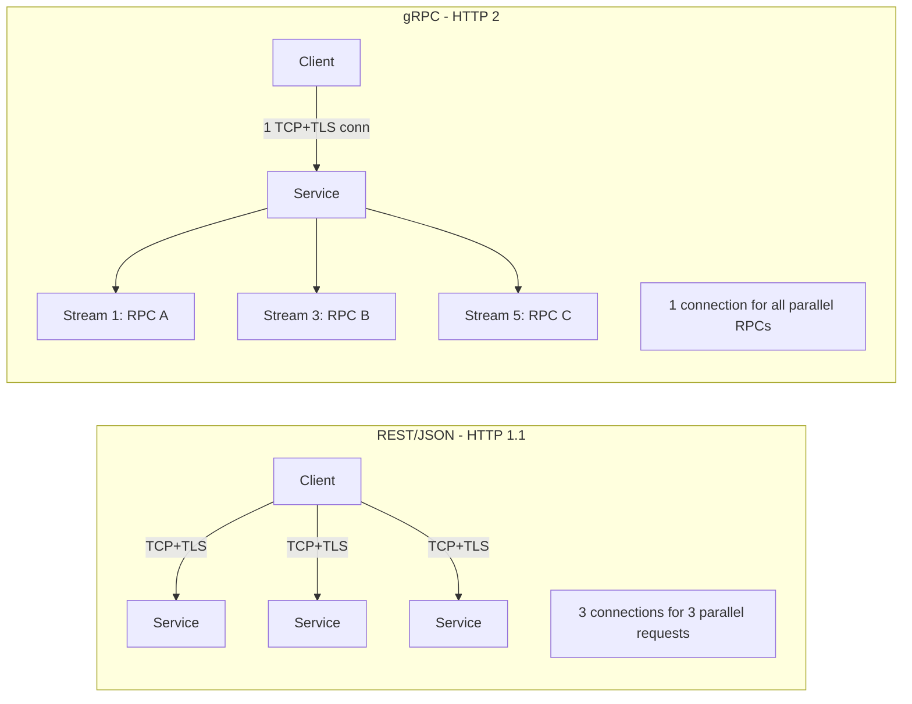

⚡ TL;DR - gRPC beats REST on serialization (Protobuf
3-10× smaller than JSON), connection multiplexing
(HTTP/2 vs HTTP/1.1 connection-per-request), and
latency (persistent connections, no TLS re-handshake);
REST beats gRPC on browser support (grpc-web required),
human debuggability (JSON vs binary), ecosystem (every
language has HTTP clients), and caching (HTTP cache
headers work natively on REST); at 10k RPS: gRPC
saves ~30-40% CPU on serialization + ~15-20% on
network bytes; the real bottleneck beyond protocol
is almost always the database, not HTTP serialization;
choose gRPC for internal microservices that need high
throughput; REST/JSON for external public APIs.

---

| #064 | Category: HTTP & APIs | Difficulty: ★★★★ |
|:---|:---|:---|
| **Depends on:** | HTTP Methods, HTTP/2 Multiplexing and Server Push, gRPC and Protocol Buffers, API Observability | |
| **Used by:** | GraphQL vs REST vs gRPC Decision Framework | |
| **Related:** | HTTP Methods, HTTP/2, gRPC/Protobuf, gRPC Streaming, Observability, Decision Framework, gRPC Design | |

---

### 🔥 The Problem This Solves

**WORLD WITHOUT IT:**
Internal microservice calls between 50 services. Each
call: JSON serialization + HTTP/1.1 (new connection
per request without keep-alive) + JSON deserialization.
A single user request triggers 20 downstream service
calls. At 10k RPS on the user-facing service: 200k
internal RPS. JSON parse CPU + connection overhead
adds 5ms latency to every call chain. Service B needs
100 concurrent connections to service C. HTTP/1.1
connection pool: 100 persistent connections sitting
idle, holding memory.

**THE BREAKING POINT:**
Google internal services (2015): hundreds of billions
of RPCs per day between services. JSON was impractical.
Protobuf (Protocol Buffers) was Google's internal
binary serialization format for decades. gRPC was the
open-source release of Google's internal RPC framework,
using HTTP/2 + Protobuf + code generation.

---

### 📘 Textbook Definition

**Serialization comparison:**
JSON: human-readable, schema-optional, 200-500 bytes
for typical API response. Protobuf: binary, schema
required (`.proto` file), 50-200 bytes for same data.
Protobuf fields are encoded as field number + wire
type (varint, length-delimited, fixed), no field names
in binary (field names only in `.proto`).

**Transport comparison:**
REST/JSON: HTTP/1.1 (one request per connection, unless
keep-alive with HTTP pipelining). gRPC: HTTP/2 (many
concurrent streams per connection, header compression
via HPACK, binary framing).

**Latency components (per-call):**
REST: DNS + TCP handshake + TLS handshake + HTTP/1.1
request + JSON parse. gRPC: multiplexed on existing
HTTP/2 connection + Protobuf parse. After the first
connection: gRPC avoids TCP + TLS overhead per call.

**Code generation:**
gRPC generates client and server stubs from `.proto`
files. Language support: Go, Java, Python, C++, Ruby,
Node.js, PHP, C#. Stub generation ensures type safety
across language boundaries.

**Interoperability:**
REST: any HTTP client works. gRPC: requires gRPC client
library. Browser: requires grpc-web proxy (browsers
cannot use gRPC HTTP/2 framing directly). Load
balancers: must be gRPC-aware (AWS ALB + h2c, Envoy,
Nginx with http2 module).

---

### ⏱️ Understand It in 30 Seconds

**One line:**
gRPC is faster for internal service-to-service calls
(binary + HTTP/2 multiplexing); REST is more compatible
for external APIs (JSON + universal HTTP clients).

**One analogy:**
> REST/JSON is a conversation in plain English: anyone
> understands it, easy to read aloud, but verbose.
> gRPC/Protobuf is a conversation in shorthand: smaller,
> faster, but you need to know the shorthand system
> (the `.proto` schema) to decode it. For two people
> talking all day (internal microservices): shorthand
> wins. For publishing a book to the public (external
> API): plain English is more accessible.

**One insight:**
The CPU benefit of Protobuf is often overstated for
Python services. Python's JSON parser is implemented
in C (fast). Python's Protobuf implementation was
historically Python-pure (slow). gRPC Python's
`protobuf==4.x` uses the C++ extension for parsing
(fast again). Always benchmark YOUR stack - do not
assume "binary = faster" in Python without measuring.
Go and Java gRPC consistently outperform JSON; Python
gRPC is competitive with Python JSON only with the
C extension.

---

### 🔩 First Principles Explanation

**Protobuf wire format (why it is smaller):**

```
JSON: {"user_id": 12345, "active": true, "score": 98.6}
= 43 bytes (including field names and punctuation)

Protobuf equivalent:
  field 1 (user_id) = 12345: 04 bytes (varint)
  field 2 (active) = true:   02 bytes
  field 3 (score) = 98.6:    09 bytes (double)
= ~15 bytes

Why smaller:
  1. Field names not transmitted (just field numbers)
  2. Integers encoded as varints (small numbers = 1 byte)
  3. No punctuation overhead ({, }, :, ",")
  4. Binary, not ASCII

Trade-off:
  1. Schema (.proto file) required to decode
  2. Not human-readable without protoc or grpcurl
  3. Backward compatibility requires careful field numbering
```

**HTTP/2 multiplexing (why fewer connections needed):**

```
HTTP/1.1:
  Connection 1: Request A → Response A (sequential)
  Connection 2: Request B → Response B (parallel = new connection)
  10 parallel requests = 10 TCP connections

HTTP/2:
  Connection 1:
    Stream 1: Request A → Response A
    Stream 3: Request B → Response B
    Stream 5: Request C → Response C
  10 parallel requests = 1 TCP connection, 10 streams

Result:
  TLS handshake: once (not once per request)
  TCP slow start: once (not per connection)
  Memory: 1 connection state (not 10)
  At 1000 RPS: 1 connection vs 1000 connections/sec
```

---

### 🧪 Thought Experiment

**SCENARIO: Benchmark gRPC vs REST for an order service**

```python
# Benchmark parameters:
# - 1000 concurrent calls
# - Order object: {id, user_id, items: [10 items], total}
# - Measure: throughput (RPS), P99 latency, CPU

# Typical benchmark results (Go service, same machine):
# REST/JSON:
#   Throughput: 25,000 RPS
#   P99 latency: 12ms
#   CPU: 45%
#   Network bytes: 820 bytes/response

# gRPC/Protobuf:
#   Throughput: 40,000 RPS (+60%)
#   P99 latency: 6ms (-50%)
#   CPU: 28% (-38%)
#   Network bytes: 280 bytes/response (-66%)

# Java service (similar pattern, smaller multipliers):
#   REST/JSON: 18,000 RPS, 15ms P99
#   gRPC: 28,000 RPS (+55%), 8ms P99

# Python service (biggest caveat):
#   REST/JSON (uvicorn): 8,000 RPS
#   gRPC (with C extension): 9,500 RPS (+18%)
#   gRPC (without C extension): 5,000 RPS (-38%)!
#   → Python: verify C extension is active before choosing gRPC
```

---

### 🧠 Mental Model / Analogy

> Compare REST/JSON to shipping goods in wooden crates
> with each item labeled individually, crates shipped
> one per truck (HTTP/1.1). gRPC/Protobuf is shipping
> goods in compact vacuum packs inside containers on
> a single mega-ship (HTTP/2 multiplexing). The mega-
> ship (HTTP/2 connection) carries thousands of items
> in compact form (Protobuf). But if you need to ship
> one package to a friend at home: the postal service
> (REST) is more practical than chartering a container
> ship. Use the right transport for the cargo volume.

---

### 📶 Gradual Depth - Five Levels

**Level 1 - What it is (anyone can understand):**
gRPC sends data in a compact binary format (Protobuf)
and reuses connections efficiently (HTTP/2). REST
sends data in human-readable JSON. gRPC is faster;
REST is more flexible and universally supported.

**Level 2 - How to use it (junior developer):**
Internal service-to-service calls: use gRPC with
generated stubs. Define service in `.proto` file,
generate code with `protoc`. External public API:
use REST/JSON. Browser clients: REST (or gRPC-web
with a proxy, more complex).

**Level 3 - How it works (mid-level engineer):**
gRPC uses HTTP/2 streams: each RPC is a stream with
a 5-byte frame header (stream ID + flags + length).
Multiple RPCs multiplexed on one connection. Protobuf:
field number (varint) + wire type (3 bits) + value.
Integers encoded as varints. Strings as length-prefixed
bytes. No schema metadata in the wire format.

**Level 4 - Why it was designed this way (senior/staff):**
Protobuf field numbers are the API contract - changing
a field number breaks all existing clients. Adding a
new field is backward compatible (old clients ignore
unknown fields). Removing a field: mark as reserved
to prevent number reuse. gRPC's HTTP/2 requirement
means: every intermediate (load balancer, proxy)
must understand HTTP/2. HTTP/1.1 proxies silently
downgrade or fail. This is why gRPC requires gRPC-
aware infrastructure (Envoy, Nginx with h2c).

**Level 5 - Mastery (distinguished engineer):**
gRPC at scale introduces a new failure mode: head-of-
line blocking at the application layer. HTTP/2
eliminated TCP-level HOL blocking between streams
(partially - see HTTP/3 QUIC). But within a gRPC
service: if one large streaming RPC is consuming all
server-side processing resources, other RPCs on the
same connection are delayed at the application layer.
Use `MaxConcurrentStreams` server config to limit
streams per connection. Use `grpc.keepalive_params`
to detect dead connections. Use `grpc.max_message_size`
to prevent individual messages from consuming all
memory.

---

### ⚙️ How It Works (Mechanism)

**Protobuf definition and generated code:**

```protobuf
// order.proto
syntax = "proto3";
package order;

service OrderService {
  rpc GetOrder(GetOrderRequest) returns (OrderResponse);
  rpc ListOrders(ListOrdersRequest)
    returns (stream OrderResponse);
}

message GetOrderRequest {
  string order_id = 1;   // Field number 1
  // NEVER reuse field numbers! Mark removed fields as:
  // reserved 2;  // was: user_id
}

message OrderItem {
  string product_id = 1;
  int32 quantity = 2;
  double price = 3;
}

message OrderResponse {
  string order_id = 1;
  string user_id = 2;
  repeated OrderItem items = 3;  // List of items
  double total = 4;
  string status = 5;
  // New fields added later: automatically backward compat
  // Old clients receive unknown fields, skip them
  string created_at = 6;  // Added in v2 - safe
}
```

**Python gRPC server with connection settings:**

```python
import grpc
from concurrent import futures
import order_pb2, order_pb2_grpc

class OrderServicer(order_pb2_grpc.OrderServiceServicer):
    def GetOrder(self, request, context):
        order = db.get_order(request.order_id)
        if not order:
            context.set_code(grpc.StatusCode.NOT_FOUND)
            context.set_details(
                f"Order {request.order_id} not found"
            )
            return order_pb2.OrderResponse()
        return order_pb2.OrderResponse(
            order_id=order.id,
            user_id=order.user_id,
            items=[
                order_pb2.OrderItem(
                    product_id=item.product_id,
                    quantity=item.quantity,
                    price=item.price
                )
                for item in order.items
            ],
            total=order.total,
            status=order.status,
        )

def serve():
    server = grpc.server(
        futures.ThreadPoolExecutor(max_workers=10),
        options=[
            ('grpc.max_receive_message_length',
             4 * 1024 * 1024),      # 4MB max message
            ('grpc.max_send_message_length',
             4 * 1024 * 1024),
            ('grpc.keepalive_time_ms', 30000),   # 30s
            ('grpc.keepalive_timeout_ms', 10000), # 10s
            ('grpc.max_concurrent_streams', 100),
        ]
    )
    order_pb2_grpc.add_OrderServiceServicer_to_server(
        OrderServicer(), server
    )
    server.add_insecure_port('[::]:50051')
    server.start()
    server.wait_for_termination()
```



---

### 🔄 The Complete Picture - End-to-End Flow

**gRPC client with deadline and error handling:**

```python
import grpc
from grpc import RpcError, StatusCode

def get_order_grpc(order_id: str, timeout_sec=5.0) -> dict:
    channel = grpc.secure_channel(
        "orders-svc:443",
        grpc.ssl_channel_credentials()
    )
    stub = order_pb2_grpc.OrderServiceStub(channel)
    try:
        response = stub.GetOrder(
            order_pb2.GetOrderRequest(order_id=order_id),
            timeout=timeout_sec,   # deadline
            # Optional: metadata (equivalent to HTTP headers)
            metadata=[("x-user-id", current_user_id)]
        )
        return {
            "order_id": response.order_id,
            "total": response.total,
            "items": [
                {"product_id": item.product_id,
                 "quantity": item.quantity}
                for item in response.items
            ]
        }
    except RpcError as e:
        if e.code() == StatusCode.NOT_FOUND:
            raise OrderNotFound(order_id)
        elif e.code() == StatusCode.DEADLINE_EXCEEDED:
            raise TimeoutError(
                f"gRPC deadline exceeded: {timeout_sec}s"
            )
        raise
```

---

### 💻 Code Example

**Example 1 - BAD: gRPC for a browser-facing API**

```python
# BAD: gRPC for an API consumed directly by browsers
# Browsers cannot use gRPC HTTP/2 framing natively
# Solution attempt: grpc-web proxy (adds complexity)
# Better: REST/JSON for browser-facing APIs

# GOOD: Use gRPC for internal service-to-service only
# REST/JSON gateway → internal gRPC services
# This is the recommended architecture:

# External: GET /orders/123 (REST/JSON)
@app.get("/orders/{order_id}")  # REST gateway
async def get_order_rest(order_id: str):
    # Gateway calls internal gRPC service
    stub = OrderServiceStub(grpc_channel)
    response = stub.GetOrder(
        GetOrderRequest(order_id=order_id),
        timeout=5.0
    )
    return {"order_id": response.order_id, ...}
    # External clients see JSON; internal = gRPC
```

---

### ⚖️ Comparison Table

| Dimension | gRPC | REST/JSON |
|:---|:---|:---|
| Serialization | Protobuf (binary, 3-10× smaller) | JSON (human-readable, larger) |
| Transport | HTTP/2 (multiplexed) | HTTP/1.1 or HTTP/2 |
| Browser support | grpc-web (proxy required) | Native |
| Code gen | Required (.proto → stubs) | Optional (OpenAPI) |
| Streaming | First-class (4 RPC types) | SSE/WebSocket add-on |
| Caching | No HTTP cache headers | Full HTTP caching |
| Debugging | Binary (grpcurl/BloomRPC) | curl/Postman |
| Performance gain | 30-60% vs REST at high RPS | Baseline |
| Best for | Internal microservices | Public APIs, browser |

---

### ⚠️ Common Misconceptions

| Misconception | Reality |
|:---|:---|
| gRPC is always faster than REST | gRPC is faster for high-throughput internal calls where Protobuf savings and HTTP/2 multiplexing are realized. For a single request with a small payload: the difference is <1ms. For low-traffic services (< 100 RPS): the operational cost of `.proto` schema management outweighs the tiny performance gain. Measure first. |
| Protobuf is backward compatible automatically | Adding new fields IS backward compatible (old clients ignore unknown fields). Changing field numbers, changing field types, or removing required fields BREAKS backward compatibility. gRPC services evolve carefully: only add fields, never remove or renumber them. |
| gRPC handles load balancing at the transport level | gRPC multiplexes all RPCs on one persistent connection per server. An L4 load balancer (round-robin on new connections) cannot balance gRPC traffic effectively - all RPCs go to whichever server has the established connection. gRPC requires L7 load balancing (Envoy, Nginx, AWS ALB with h2c support) that understands HTTP/2 streams. |
| gRPC error codes map directly to HTTP status codes | gRPC has its own status code enum (NOT_FOUND, INVALID_ARGUMENT, UNAVAILABLE, DEADLINE_EXCEEDED, etc.). These are semantically similar to HTTP codes but different values and different granularity. When exposing gRPC errors via a REST gateway: translate gRPC codes to HTTP codes explicitly (NOT_FOUND → 404, INVALID_ARGUMENT → 400, DEADLINE_EXCEEDED → 504). Do not expose raw gRPC status codes to REST clients. |

---

### 🚨 Failure Modes & Diagnosis

**gRPC connection pool exhaustion**

**Symptom:** P99 gRPC latency spikes periodically.
CPU on both client and server is normal.

**Root Cause:** Client using a single gRPC channel
(one HTTP/2 connection). `MaxConcurrentStreams`
(server config, default 100) reached. New RPCs queue
waiting for a stream slot.

**Diagnosis:**
```python
# Check gRPC channel state and metrics
import grpc
channel = grpc.insecure_channel("svc:50051")
state = channel._channel.check_connectivity_state(True)
print(f"Channel state: {state}")
# grpc.ChannelConnectivity.READY = healthy

# Enable gRPC channelz for connection metrics:
from grpc_channelz.v1 import channelz
channelz.add_channelz_servicer(server)
# Access: grpc_channelz.v1.ChannelzServicer
```

**Fix:**
Use a channel pool (multiple channels per client):
```python
import random

class GrpcChannelPool:
    def __init__(self, target: str, pool_size: int = 5):
        self.channels = [
            grpc.secure_channel(target,
                               grpc.ssl_channel_credentials())
            for _ in range(pool_size)
        ]
    def get_stub(self, stub_class):
        # Round-robin or random channel selection
        return stub_class(random.choice(self.channels))
```

---

### 🔗 Related Keywords

**Prerequisites (understand these first):**
- `HTTP/2 Multiplexing and Server Push` - HTTP/2 basics
- `gRPC and Protocol Buffers` - gRPC fundamentals

**Builds On This (learn these next):**
- `GraphQL vs REST vs gRPC Decision Framework` -
  choosing the right protocol

---

### 📌 Quick Reference Card

```
┌──────────────────────────────────────────────────────────┐
│ Serialization│ Protobuf: 3-10× smaller than JSON         │
│              │ Python: verify C extension active         │
├──────────────┼───────────────────────────────────────────┤
│ Transport    │ HTTP/2: N streams on 1 connection         │
│              │ vs HTTP/1.1: 1 connection per request     │
├──────────────┼───────────────────────────────────────────┤
│ Load balance │ Must use L7 LB (Envoy/ALB gRPC support)  │
│              │ L4 LB sends all RPCs to same server       │
├──────────────┼───────────────────────────────────────────┤
│ Error codes  │ NOT_FOUND, DEADLINE_EXCEEDED, UNAVAILABLE │
│              │ Translate to HTTP codes at gateway        │
├──────────────┼───────────────────────────────────────────┤
│ Best use     │ Internal microservices: gRPC              │
│              │ Public API / browser: REST/JSON           │
├──────────────┼───────────────────────────────────────────┤
│ ONE-LINER    │ "gRPC = binary + multiplexed connections; │
│              │  REST = JSON + universal compatibility"   │
└──────────────────────────────────────────────────────────┘
```

**If you remember only 3 things:**
1. gRPC is 30-60% faster for high-throughput internal
   service calls. Not worth the complexity for < 100
   RPS services. Measure before choosing.
2. gRPC requires L7 load balancing. L4 load balancers
   send all streams to one backend because gRPC reuses
   connections.
3. Field numbers in `.proto` are the API contract -
   never renumber or remove them. Only add new fields.

---

### 💎 Transferable Wisdom

**Reusable Engineering Principle:**
"Schema-first design enables optimization." Protobuf
requires a schema (`.proto` file) before any data
can be sent. This constraint enables the optimization:
field names are replaced with numbers in the wire
format. JSON's schemaless flexibility requires field
names in every message. The lesson: explicit schemas
pay performance dividends. This applies beyond
serialization: typed programming languages (vs dynamic)
enable compiler optimization; database schemas (vs
document stores) enable query plan optimization;
API specifications (OpenAPI) enable code generation
and contract testing. Schema constraints are not
limitations - they are the foundation for tooling,
optimization, and correctness guarantees.

**Where else this pattern applies:**
- Apache Arrow: binary columnar format for analytics,
  requires schema, 10-100× faster than JSON for data
- Apache Parquet: columnar storage format for data
  warehouses, schema enables predicate pushdown
- Cap'n Proto, FlatBuffers: other binary schema-first
  formats competing with Protobuf

---

### 💡 The Surprising Truth

The most significant gRPC performance benefit is not
Protobuf serialization - it is connection reuse. A
full TLS 1.3 handshake takes 1 round-trip (with
TLS 1.3 session resumption: 0-RTT). At 10k RPS with
HTTP/1.1 and connection pooling: you still need to
establish new connections when the pool is exhausted.
With gRPC/HTTP/2: one persistent connection handles
hundreds of concurrent streams. At 100k RPS, gRPC's
connection model might use 10 connections total vs
HTTP/1.1's need for hundreds. The TCP/TLS cost per
new connection is 1-3 round-trips × network RTT. For
same-datacenter calls (0.1ms RTT): TLS handshake = 0.3ms
per new connection. At 10k new connections/sec: 3 seconds
of CPU just for TLS handshakes. gRPC avoids this entirely.
This is the real win at scale, not the 100-byte savings
from Protobuf on a 500-byte payload.

---

### ✅ Mastery Checklist

**You've mastered this when you can:**
1. **MEASURE** The actual serialization time difference
   between Protobuf and JSON in your specific language/
   framework (do not assume Go benchmarks apply to Python).
2. **EXPLAIN** Why L4 load balancers do not work with
   gRPC and configure an L7 load balancer (Envoy) for
   gRPC.
3. **DESIGN** A `.proto` schema with proper backward
   compatibility: only add fields, reserve removed
   field numbers.
4. **IMPLEMENT** A gRPC client with deadline, error
   handling, and connection pool.
5. **DECIDE** When to use gRPC vs REST: internal high-
   throughput services (gRPC), external public APIs
   (REST), browser clients (REST or grpc-web).

---

### 🎯 Interview Deep-Dive

**Q1: What are the performance advantages of gRPC over
REST, and when do they not matter?**

*Why they ask:* Tests benchmarking judgment.

*Strong answer includes:*
- Three advantages: (1) Protobuf: 3-10× smaller payload
  than JSON; (2) HTTP/2: multiplexing multiple RPCs on
  one TCP+TLS connection; (3) code generation: type-safe
  stubs eliminate runtime serialization errors.
- Quantified: at 10k RPS internal service, gRPC reduces
  P99 latency by 30-50% and CPU by 20-40% compared to
  REST/JSON (Go/Java). Numbers vary by language.
- When advantages do NOT matter: (1) services with <
  100 RPS - HTTP/1.1 connection pooling handles this fine;
  (2) services where DB is the bottleneck - protocol
  choice affects 2ms, DB query affects 50ms; (3) Python
  without the Protobuf C extension - Python gRPC can
  be SLOWER than Python JSON; (4) external/public APIs -
  REST compatibility is worth more than 30% throughput.
- Rule of thumb: gRPC for internal services at > 1k RPS
  where the protocol overhead is measurable. REST
  everywhere else.

**Q2: Why does gRPC require L7 load balancing?**

*Why they ask:* Tests infrastructure + protocol knowledge.

*Strong answer includes:*
- HTTP/2 multiplexing: gRPC establishes a persistent
  HTTP/2 connection to the server. All RPCs from a client
  go over this one connection (as separate streams).
  The connection is maintained as long as both sides
  are alive.
- L4 load balancer (e.g., TCP/UDP level): distributes
  connections (not requests). Once a client establishes
  a connection to backend A: ALL gRPC streams go to
  backend A. New connections go to different backends.
  But gRPC makes very few new connections. Result:
  most traffic is pinned to a single backend.
  10 backends: 90% are idle, 1 is overloaded.
- L7 load balancer (Envoy, Nginx, AWS ALB with gRPC mode):
  understands HTTP/2 at the stream level. Sees each
  RPC as a separate unit of work. Routes each RPC to
  the least-loaded backend. All 10 backends get equal
  load.
- Solution: use Envoy as sidecar (Istio) or as a
  standalone L7 proxy. Configure with `lb_policy:
  ROUND_ROBIN` or `LEAST_REQUEST`. Or use gRPC client-
  side load balancing (client maintains a list of
  backends, routes RPCs directly) for lowest latency.
