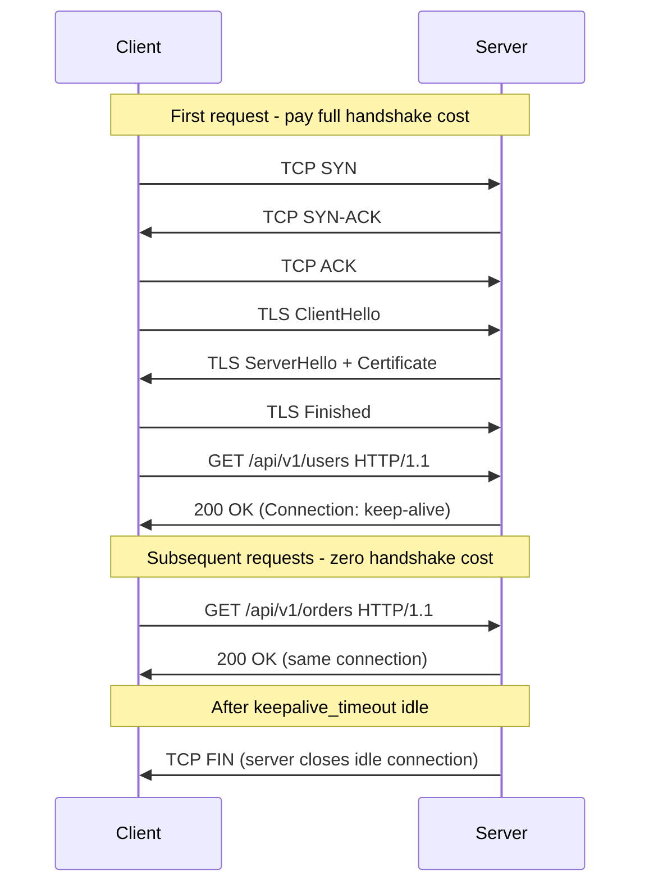

⚡ TL;DR - HTTP Keep-Alive (HTTP/1.1 default) keeps
the TCP connection open after a response so subsequent
requests reuse the same TCP+TLS session; without it:
each request pays TCP handshake (1 RTT) + TLS handshake
(1-2 RTT) overhead; critical bug: using `requests.get()`
in Python without a Session creates a new TCP connection
per call - use `requests.Session()` or httpx with
a client for connection pooling; connection pool sizing:
`pool_maxsize = max_concurrent_threads × connections_per_thread`
- too small = queuing latency, too large = idle connections
exhaust server file descriptors; TIME_WAIT state after
connection close holds the port for 2×MSL (60s on
Linux default) - persistent connections eliminate this
at high RPS.

---

| #065 | Category: HTTP & APIs | Difficulty: ★★★ |
|:---|:---|:---|
| **Depends on:** | HTTP Request/Response Lifecycle, HTTP/2 Multiplexing | |
| **Used by:** | gRPC vs REST Performance at Scale, TLS and Certificate Pinning | |
| **Related:** | HTTP Lifecycle, HTTP/2, HTTP Timeouts, gRPC vs REST Performance, TLS and Cert Pinning | |

---

### 🔥 The Problem This Solves

**WORLD WITHOUT IT:**
Each request to an external API: DNS lookup + TCP
3-way handshake + TLS 1.3 handshake + HTTP request
+ HTTP response + TCP FIN. On a service making 1000
API calls per second to the same host:
- DNS lookup: ~1ms × 1000 = 1 sec/sec of DNS load
- TCP handshake: ~10ms × 1000 = 10 sec/sec of TCP overhead
- TLS handshake: ~20ms × 1000 = 20 sec/sec of TLS overhead
= 31 seconds of overhead per second of actual request
processing. The overhead is larger than the useful work.

**THE BREAKING POINT:**
Early web era (HTTP/1.0): default was connection-per-
request. Every image, CSS, JS on a page = new connection.
A page with 50 resources = 50 TCP+TLS handshakes.
Performance was catastrophic. HTTP/1.1 (1997) made
`Connection: keep-alive` the default. Each TCP connection
is reused for multiple requests. HTTP/2 (2015) went
further: multiple concurrent requests over one connection.

---

### 📘 Textbook Definition

**HTTP Keep-Alive (HTTP/1.1 persistent connections):**
After sending a response, the server does not close
the TCP connection. The client sends the next request
on the same connection. Header `Connection: keep-alive`
is the default in HTTP/1.1. `Connection: close` forces
connection teardown after the response.

**Server keep-alive settings:**
- `keepalive_timeout`: how long server waits (idle
  connection) before closing. Nginx default: 75s.
- `keepalive_requests`: max requests per connection
  before forced close. Nginx default: 1000.

**Client connection pool:**
Client-side library maintains a pool of open TCP
connections per server. When a request is made: check
pool for an available connection. If available: reuse
(zero handshake cost). If not available AND pool not
full: create new connection. If pool full: queue the
request until a connection becomes available.

**TIME_WAIT state:**
After TCP FIN sequence, the closing side enters TIME_WAIT
for 2×MSL (Maximum Segment Lifetime). Default Linux
MSL = 30s → TIME_WAIT = 60s. During this time, the
(local_port, remote_addr) pair is blocked. At high
RPS with connection-per-request: ephemeral ports
(range 32768-60999 on Linux = ~28k ports) exhausted.
`ECONNREFUSED: cannot assign requested address`.
Connection reuse eliminates new connections → eliminates
TIME_WAIT accumulation.

---

### ⏱️ Understand It in 30 Seconds

**One line:**
HTTP keep-alive reuses the same TCP connection for
multiple requests, eliminating the per-request handshake
cost that dominates latency for frequent small API calls.

**One analogy:**
> Without keep-alive: each HTTP request is a phone
> call where you dial, say one sentence, and hang up.
> Then dial again for the next sentence. Dial time
> (TCP+TLS) is larger than the actual conversation.
> With keep-alive: you stay on the phone and have a
> conversation, one sentence at a time. HTTP/2 is
> a conference call where multiple people talk at once.
> The phone line (TCP connection) is the expensive
> resource; stay connected.

**One insight:**
The #1 connection pooling bug in Python is using the
`requests` module with `requests.get(url)` calls
in a loop. Each `requests.get()` creates a new Session
internally, which creates a new connection. The fix:
`session = requests.Session()` once, then
`session.get(url)` for all calls. The Session maintains
the connection pool. Same bug exists in Go with `http.Get()`
vs creating a shared `http.Client`. The mistake is
so common it has its own GitHub issues in major projects.

---

### 🔩 First Principles Explanation

**Connection lifecycle comparison:**

```
WITHOUT KEEP-ALIVE (HTTP/1.0 style or Connection: close):
Per request:
  1. DNS resolution (~1ms cached, ~50ms uncached)
  2. TCP SYN → SYN-ACK → ACK (1 RTT = ~5ms same DC)
  3. TLS ClientHello → ServerHello → ... (1 RTT min)
  4. HTTP GET + response (1 RTT)
  5. TCP FIN → FIN-ACK (connection teardown)
Cost: 3+ RTTs per request (20-50ms overhead)

WITH KEEP-ALIVE (HTTP/1.1 default):
First request: pay DNS + TCP + TLS (3 RTTs)
Subsequent requests (same connection):
  4. HTTP GET + response (1 RTT only)
  No DNS, no TCP, no TLS overhead
Cost: 1 RTT per request after first

WITH HTTP/2 (gRPC or modern REST):
Single connection, multiple concurrent streams:
  Multiple requests in parallel, 1 RTT total per batch
Cost: effectively < 1 RTT per request at scale
```

**Connection pool queue depth (sizing formula):**

```
Formula:
  pool_size = expected_concurrent_requests_to_target

Example:
  Service: 50 RPS to payment API
  Payment API latency: 100ms average
  Concurrent requests at any time:
    = RPS × latency = 50 × 0.1 = 5 concurrent

Recommended pool size: 5 × 1.5 (buffer) = 8
Too large: 50 → 45 idle connections, server holds
Too small: 3 → 2 requests/sec queue waiting

Per Python requests.Session:
  session = requests.Session()
  adapter = HTTPAdapter(
      pool_connections=1,   # Connection pools per host
      pool_maxsize=10,      # Max connections per pool
      max_retries=Retry(3, backoff_factor=0.5)
  )
  session.mount("https://", adapter)
```

---

### 🧪 Thought Experiment

**SCENARIO: Why does a microservice have high latency
at 2 AM but not during the day?**

```
Day: 1000 RPS to payment service
  Connection pool: 10 connections, all active (reused)
  Each request: 1 RTT (~5ms) → P99: 15ms

2 AM: 5 RPS to payment service
  Connection pool: after 75s keepalive_timeout, server
  closes idle connections
  Client pool has 10 connections marked as alive but
  they are actually closed (server closed them)
  First 10 requests at 2 AM: each gets a stale connection
  → connection reset → client creates new connection
  → 3 RTT overhead per request
  → P99 spikes to 50ms at 2 AM

Fix: validate connections before reuse, or set client-
side keepalive interval < server keepalive_timeout
```

---

### 🧠 Mental Model / Analogy

> Connection pool is like a taxi dispatch service.
> Pool of taxis (connections) waiting at your location
> (ready to use). When you need to make a request:
> take a taxi from the pool (instant), use it, return
> it. When pool is empty: wait for a taxi to return
> (queuing). Creating a new connection = calling a taxi
> from 20 miles away (slow). Pool sizing: if you need
> 10 taxis at rush hour, keep 12 (buffer). 100 idle
> taxis at 2 AM wastes fuel (server memory for connections).

---

### 📶 Gradual Depth - Five Levels

**Level 1 - What it is (anyone can understand):**
HTTP Keep-Alive keeps the internet connection open
between API calls so you don't have to reconnect every
time. Like staying logged into a website instead of
logging in for each page.

**Level 2 - How to use it (junior developer):**
Use `requests.Session()` in Python (not `requests.get()`
in a loop). Use a shared `http.Client` in Go (not
`http.Get()`). Use `httpx.Client` as a context manager
or long-lived object in Python async. The connection
pool is managed automatically once you use the session.

**Level 3 - How it works (mid-level engineer):**
Session maintains a pool of `urllib3.HTTPConnectionPool`
objects keyed by `(scheme, host, port)`. When a request
is made: check pool for available connection. If found:
reuse (skip TCP+TLS handshake). If not: create new
(pay handshake cost). After response: connection
returned to pool (if not closed). Pool max size sets
the maximum concurrent connections.

**Level 4 - Why it was designed this way (senior/staff):**
`pool_maxsize` is not the same as "number of concurrent
requests." Each connection handles one request at a
time in HTTP/1.1. If you have 50 concurrent requests
and pool_maxsize=10: 10 requests process in parallel,
40 queue waiting for a connection. Queue time adds
latency. Set pool_maxsize to the expected peak
concurrency to the target host. The default
pool_maxsize in urllib3 is 10 - appropriate for most
applications, too small for high-concurrency services.

**Level 5 - Mastery (distinguished engineer):**
HTTP/2 changes the connection pool model: one connection
handles many concurrent streams. With HTTP/2: pool_size=1
(or 2 for redundancy) is sufficient for most throughput.
HTTP/2 stream multiplexing eliminates the concurrency→
pool_size relationship. But: Python's requests library
does not support HTTP/2 natively. httpx does (with
`httpx.AsyncClient(http2=True)`). httpcore (the
underlying library for httpx) uses a single HTTP/2
connection with a stream pool, automatically managing
concurrent stream limits.

---

### ⚙️ How It Works (Mechanism)

**Python connection pool configuration:**

```python
import requests
from requests.adapters import HTTPAdapter
from urllib3.util.retry import Retry

# BAD: creates new connection per call
def fetch_bad(url: str):
    return requests.get(url)  # New Session each time

# GOOD: shared session with configured pool
session = requests.Session()
adapter = HTTPAdapter(
    pool_connections=2,     # pools: one per unique host
    pool_maxsize=20,        # max connections per pool
    max_retries=Retry(
        total=3,
        backoff_factor=0.5,   # exponential backoff
        status_forcelist=[500, 502, 503, 504],
        allowed_methods=["GET", "HEAD"]  # safe methods only
    )
)
session.mount("https://", adapter)
session.mount("http://", adapter)

def fetch_good(url: str):
    return session.get(url, timeout=(5, 30))
    # (connect_timeout, read_timeout)

# Async: httpx with connection pool
import httpx

# Shared client (reuse across requests)
http_client = httpx.AsyncClient(
    limits=httpx.Limits(
        max_connections=20,
        max_keepalive_connections=10,
        keepalive_expiry=30  # idle close after 30s
    ),
    timeout=httpx.Timeout(connect=5, read=30),
    http2=True  # Enable HTTP/2 where supported
)

async def fetch_async(url: str):
    response = await http_client.get(url)
    return response.json()

# REMEMBER: close the client when done
# async with httpx.AsyncClient() as client: ... (preferred)
# or call http_client.aclose() on shutdown
```

**Server-side keep-alive (Nginx):**

```nginx
# nginx.conf
http {
    # Keep-alive settings
    keepalive_timeout 75s;      # Close idle after 75s
    keepalive_requests 1000;    # Max requests per connection
    keepalive_time 3600s;       # Max lifetime of a connection

    # Upstream connection pooling (to backend services)
    upstream backend {
        server backend1:8080;
        server backend2:8080;
        keepalive 32;           # Keep 32 idle connections
        keepalive_requests 1000;
        keepalive_timeout 60s;
    }

    server {
        location / {
            proxy_pass http://backend;
            # Required for upstream keep-alive:
            proxy_http_version 1.1;
            proxy_set_header Connection "";  # Remove "close"
        }
    }
}
```



---

### 🔄 The Complete Picture - End-to-End Flow

**Diagnosing stale connections:**

```python
# Problem: stale connections in pool (server closed them)
# Python requests raises ConnectionResetError silently retries

# httpx detects and handles stale connections:
async def robust_fetch(url: str) -> dict:
    try:
        response = await http_client.get(url)
        return response.json()
    except httpx.RemoteProtocolError:
        # Connection was closed by server (stale)
        # httpx.AsyncClient auto-retries on new connection
        # But on explicit connection reset: handle here
        response = await http_client.get(url)
        return response.json()

# Better: use retry via tenacity
from tenacity import retry, stop_after_attempt, wait_exponential

@retry(stop=stop_after_attempt(3),
       wait=wait_exponential(multiplier=1, min=1, max=10))
async def resilient_fetch(url: str) -> dict:
    response = await http_client.get(url)
    response.raise_for_status()
    return response.json()
```

---

### 💻 Code Example

**Example 1 - BAD: No connection reuse in high-RPS loop**

```python
import requests

# BAD: creates new TCP+TLS connection for every URL
def fetch_all_products(product_ids: list) -> list:
    results = []
    for pid in product_ids:
        # requests.get = new Session = new connection each time!
        resp = requests.get(f"https://api.example.com/products/{pid}")
        results.append(resp.json())
    return results
# For 100 product_ids: 100 TCP+TLS handshakes = seconds of overhead

# GOOD: shared session, connection pool
def fetch_all_products_good(product_ids: list) -> list:
    with requests.Session() as session:
        adapter = HTTPAdapter(pool_maxsize=10)
        session.mount("https://", adapter)
        results = []
        for pid in product_ids:
            resp = session.get(
                f"https://api.example.com/products/{pid}",
                timeout=5
            )
            results.append(resp.json())
    return results
# 100 product_ids: 1 TCP+TLS handshake + 99 reused connections
```

---

### ⚖️ Comparison Table

| Scenario | Connection per Request | Connection Pool | HTTP/2 |
|:---|:---|:---|:---|
| 10 RPS, one host | ~OK (overhead < 10ms) | Best | Best |
| 1000 RPS, one host | Very bad (TIME_WAIT) | Required | Ideal |
| 100 concurrent | 100 connections | pool_maxsize=100 | 1-2 connections |
| Idle overnight | OK | May drain (keepalive_timeout) | Same |

---

### ⚠️ Common Misconceptions

| Misconception | Reality |
|:---|:---|
| `requests.get()` reuses connections | No. Each call to `requests.get()` or `requests.post()` creates a new `Session` internally, which means a new connection pool and typically a new connection. The connection reuse only happens within a `Session` object. Use `requests.Session()` explicitly. |
| Larger pool_maxsize is always better | Too large: idle connections hold server file descriptors and memory. Server keepalive_timeout will close them anyway. Too small: requests queue, adding latency. Size to peak concurrency with a 20-30% buffer. |
| HTTP/2 eliminates the need for connection pooling | HTTP/2 eliminates the need for MULTIPLE connections. You still need a pool-like mechanism to manage the one or two persistent HTTP/2 connections and their lifecycle (reconnect on disconnect, healthcheck, etc.). The concept changes (stream pool, not connection pool) but resource management remains necessary. |
| Keep-alive prevents server from closing connections | The server closes the connection after keepalive_timeout seconds of idle. The client's pool may not know until it tries to use the stale connection (RST or EOF on read). A well-implemented client retries once on a new connection when it detects a stale connection (RST/EOF). urllib3 and httpcore do this automatically. |

---

### 🚨 Failure Modes & Diagnosis

**Port exhaustion from connection-per-request at high RPS**

**Symptom:** `OSError: [Errno 99] Cannot assign
requested address` or `EADDRNOTAVAIL`. Service cannot
make outbound connections.

**Root Cause:** TIME_WAIT state. Each new TCP connection
uses an ephemeral port (32768-60999 range on Linux =
28k ports). At 1000 new connections/second, each
lasting 60s in TIME_WAIT: 60,000 ports in TIME_WAIT >
28k available → exhaustion.

**Diagnosis:**
```bash
# Count TIME_WAIT connections
ss -s | grep TIME-WAIT
# Or:
netstat -ant | grep TIME_WAIT | wc -l

# See current ephemeral port range:
cat /proc/sys/net/ipv4/ip_local_port_range
# Default: 32768 60999 (28k ports)

# See TIME_WAIT timeout:
cat /proc/sys/net/ipv4/tcp_fin_timeout
# Default: 60 seconds
```

**Fix (preferred):** Use connection pooling (Session
/ shared client). Stop creating new connections.

**Fix (OS-level, if connection pooling not possible):**
```bash
# Expand ephemeral port range:
echo "1024 65535" > /proc/sys/net/ipv4/ip_local_port_range
# Enable TIME_WAIT connection reuse:
echo 1 > /proc/sys/net/ipv4/tcp_tw_reuse
```

---

### 🔗 Related Keywords

**Prerequisites (understand these first):**
- `HTTP Request/Response Lifecycle` - TCP connection context
- `HTTP/2 Multiplexing and Server Push` - HTTP/2 streams

**Builds On This (learn these next):**
- `gRPC vs REST Performance at Scale` - connection
  reuse in gRPC
- `TLS and Certificate Pinning in APIs` - TLS
  session resumption

---

### 📌 Quick Reference Card

```
┌──────────────────────────────────────────────────────────┐
│ Python       │ Use requests.Session() or httpx.AsyncClient│
│ Pool bug     │ requests.get() = NEW connection each call  │
├──────────────┼───────────────────────────────────────────┤
│ Pool size    │ RPS × avg_latency_sec = concurrent needed  │
│              │ Add 20-30% buffer. Default=10 (too small?) │
├──────────────┼───────────────────────────────────────────┤
│ TIME_WAIT    │ High RPS + no pool → port exhaustion      │
│              │ Fix: connection pool (primary solution)   │
├──────────────┼───────────────────────────────────────────┤
│ Stale conn.  │ Server closes idle after keepalive_timeout │
│              │ Client retries on ConnectionReset (auto)  │
├──────────────┼───────────────────────────────────────────┤
│ Nginx        │ proxy_http_version 1.1; + Connection ""   │
│              │ keepalive 32 in upstream block            │
├──────────────┼───────────────────────────────────────────┤
│ ONE-LINER    │ "Session = pool; requests.get() = no pool;│
│              │  pool size = peak concurrent connections" │
└──────────────────────────────────────────────────────────┘
```

**If you remember only 3 things:**
1. `requests.get()` creates a new connection every call.
   Use `requests.Session()` for connection reuse. This
   is the most common Python performance bug.
2. Size connection pool to peak concurrency: `pool_maxsize
   = RPS × avg_latency_sec × 1.3`. Default of 10 is
   too small for > 50 RPS services.
3. TIME_WAIT port exhaustion is caused by too many
   new connections. Fix with connection pooling first;
   OS tuning is a last resort.

---

### 💎 Transferable Wisdom

**Reusable Engineering Principle:**
"Establish expensive resources once; reuse many times."
TCP+TLS connection establishment is expensive (3
round-trips, cryptographic negotiation). API calls
are cheap (1 round-trip). The ratio: setup cost >>
usage cost. This principle extends to: database
connections (establish once, reuse via pool); thread
creation (expensive - use thread pool); process
startup (expensive - use worker pool); JVM class
loading (expensive - warm the JVM before load). Any
time setup cost >> per-operation cost: pooling is
the right pattern. The operating cost of a pool is
idle resource consumption (memory, file descriptors).
Size the pool to match peak demand, not worst-case
demand.

**Where else this pattern applies:**
- Database connection pools (HikariCP, PgBouncer):
  same principle - TCP+TLS to database is expensive
- Thread pools (ThreadPoolExecutor): thread creation
  is expensive, reuse threads
- Process pools (Python multiprocessing): process
  startup cost amortized over many tasks

---

### 💡 The Surprising Truth

The Nginx upstream `keepalive` directive is one of
the most commonly missed performance configurations.
By default, Nginx creates a new connection to the
upstream backend for every proxied request. This
means the backend server pays TCP+TLS handshake for
every request, even when Nginx is receiving the same
clients with persistent connections. Adding `keepalive 32`
to the upstream block tells Nginx to maintain 32 idle
connections to the backend at all times. First-time
request: pays handshake. All subsequent requests: free.
Benchmarks show 30-50% throughput improvement on
CPU-bound backend services when adding upstream
keepalive, because the backend no longer pays TLS
handshake for every request. This is the Nginx
configuration that every tutorial forgets to include
but makes a measurable production difference. The
required companion setting: `proxy_http_version 1.1`
and `proxy_set_header Connection ""` (otherwise Nginx
sends `Connection: close` which forces backend to
close the connection after each response - defeating
keep-alive).

---

### ✅ Mastery Checklist

**You've mastered this when you can:**
1. **IDENTIFY** The Python connection-per-request bug:
   explain why `requests.get()` in a loop is slow and
   fix it with `requests.Session()`.
2. **CALCULATE** The correct connection pool size for
   a service given its RPS and average request latency.
3. **DIAGNOSE** TIME_WAIT port exhaustion using `ss -s`
   and explain the root cause.
4. **CONFIGURE** Nginx upstream keepalive correctly
   with the required companion settings.
5. **EXPLAIN** Why HTTP/2 changes the connection pool
   model from "connections" to "streams."

---

### 🎯 Interview Deep-Dive

**Q1: Why is using `requests.get()` in a loop
problematic, and how do you fix it?**

*Why they ask:* Very common Python performance question.

*Strong answer includes:*
- `requests.get(url)` is a module-level function that
  internally creates a new `Session` object for that
  call. A new `Session` = a new connection pool with
  zero connections. The function makes a new TCP+TLS
  connection for every call.
- In a loop calling 100 external API endpoints: 100
  TCP handshakes + 100 TLS handshakes = ~3 seconds
  of overhead at ~10ms per handshake (same datacenter).
  Cross-region: 50ms per handshake = 5 seconds overhead
  for 100 calls.
- Fix: `session = requests.Session()` once before the
  loop. `session.get(url)` inside the loop. The Session
  maintains a connection pool. First call: handshake.
  Calls 2-100: pool lookup → reuse existing connection.
- Size the pool: `HTTPAdapter(pool_maxsize=20)` for
  a loop that runs 20 iterations concurrently (or
  100 iterations sequentially with the same target
  host).
- Modern alternative: `httpx.AsyncClient` with
  `async for` pattern and HTTP/2 support.

**Q2: Explain TCP TIME_WAIT and how it causes connection
failures at high RPS.**

*Why they ask:* Tests low-level networking knowledge.

*Strong answer includes:*
- TIME_WAIT: after a TCP connection is gracefully
  closed (FIN-ACK sequence), the initiating side (the
  one that sent the first FIN) enters TIME_WAIT for
  2×MSL (Maximum Segment Lifetime). On Linux: MSL=30s,
  so TIME_WAIT=60 seconds.
- Why: ensures all in-flight packets for this connection
  are received. Prevents a new connection on the same
  (srcIP:srcPort, dstIP:dstPort) tuple from receiving
  old packets.
- Problem: each new outbound TCP connection uses one
  ephemeral port (range: 32768-60999, ~28k ports). At
  1000 new connections/second: 60,000 ports in TIME_WAIT
  (60s × 1000/s) > 28k available → `EADDRNOTAVAIL`.
  No more connections possible.
- Fix: (1) primary: connection pooling - reuse
  connections, avoid TIME_WAIT entirely; (2) OS: expand
  ephemeral port range via `ip_local_port_range`;
  (3) `tcp_tw_reuse=1`: allows reuse of TIME_WAIT
  connections (safe for outbound, RFC 1323 timestamps
  required).
- Detection: `ss -s | grep TIME-WAIT` or
  `netstat -ant | grep TIME_WAIT | wc -l`.
