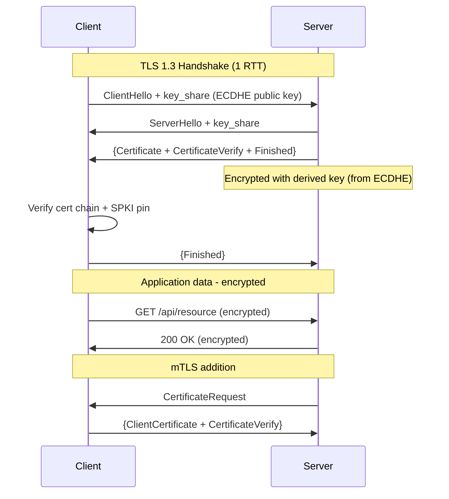

⚡ TL;DR - TLS 1.3 (the current standard) provides
encryption + server authentication via certificates;
key improvements over TLS 1.2: 1-RTT handshake (vs
2-RTT), 0-RTT session resumption (replay risk!), and
removal of weak ciphers (RC4, MD5, SHA-1); certificate
pinning binds a client to a specific certificate or
public key, preventing MITM even with a rogue CA;
mobile app pinning uses SPKI hash in the app binary -
BRITTLE: certificate rotation breaks pinned apps;
for server-to-server APIs: use mTLS (mutual TLS) where
both client and server present certificates; mTLS is
zero-trust (no shared secrets needed); HSTS enforces
HTTPS at the browser level; Certificate Transparency
(CT) logs detect unauthorized certificate issuance.

---

| #066 | Category: HTTP & APIs | Difficulty: ★★★★ |
|:---|:---|:---|
| **Depends on:** | HTTPS and TLS, JWT Security, OAuth Security, HTTP Keep-Alive | |
| **Used by:** | API Gateway at Scale, Service Mesh Trade-offs | |
| **Related:** | HTTPS/TLS, JWT Security, OAuth Security, API Gateway, Keep-Alive, Service Mesh | |

---

### 🔥 The Problem This Solves

**WORLD WITHOUT IT:**
A mobile banking app communicates with `https://api.bank.com`.
TLS is enabled - encrypted channel, certificate verified
against trusted CAs. An attacker on the same network
installs a corporate CA certificate on the victim's
device (possible via enterprise MDM or malware). Now
the attacker can present a fraudulent certificate for
`api.bank.com` signed by the rogue CA. The device
trusts it (the CA is in the trust store). Attacker
performs MITM: decrypts, reads, and modifies banking
API traffic. Standard TLS provides no protection
against a trusted-but-rogue CA.

**THE BREAKING POINT:**
DigiNotar breach (2011): a Dutch CA was compromised.
Attackers issued fraudulent SSL certificates for
`*.google.com`, `*.paypal.com`, and hundreds of other
domains. All browsers trusted DigiNotar. These
certificates were used to MITM thousands of users
in Iran. Standard TLS validation (chain to a trusted
CA) was broken because the trusted CA itself was
compromised. Result: browser vendors removed DigiNotar
from trust stores. Certificate Transparency (CT)
logs were introduced as a detection mechanism.

---

### 📘 Textbook Definition

**TLS 1.3 (RFC 8446):**
Current standard. Key changes from TLS 1.2: (1) 1-RTT
handshake (vs 2-RTT); (2) 0-RTT session resumption
with PSK (pre-shared key from previous session); (3)
forward secrecy mandatory (ECDHE only); (4) removed:
RSA key exchange, RC4, MD5/SHA-1 MACs, export ciphers.
TLS 1.2 still supported but deprecated for new systems.
TLS 1.0/1.1: should be disabled.

**Certificate chain validation:**
Server presents a certificate signed by an intermediate
CA, signed by a root CA. Client verifies: (1) server
cert has correct hostname (SAN - Subject Alternative
Name); (2) cert has not expired; (3) signature chain
leads to a trusted root CA in the system trust store;
(4) cert is not revoked (OCSP, CRL).

**Certificate pinning:**
Client hardcodes the expected certificate or public
key. Instead of "trust any cert signed by a trusted
CA," the client says "trust ONLY this specific cert
or public key." If the server presents a different
cert: connection rejected even if the cert is signed
by a trusted CA.

**SPKI pinning (Subject Public Key Info):**
Pin the public key hash (SHA-256 of the SubjectPublicKeyInfo
DER encoding), not the full certificate. Allows certificate
renewal without updating the app (same key pair =
same SPKI pin). The certificate changes but the key
pair stays the same.

**mTLS (Mutual TLS):**
Both client and server present certificates. Server
verifies client certificate. Provides mutual authentication
without shared secrets (API keys, passwords). Used in:
service meshes, zero-trust architectures, high-security
APIs (banking, payment processing).

**HSTS (HTTP Strict Transport Security):**
Server sends `Strict-Transport-Security: max-age=31536000;
includeSubDomains`. Browser refuses HTTP connections
to this domain for the max-age duration. Prevents
protocol downgrade attacks (attacker intercepts HTTP
before redirect to HTTPS).

---

### ⏱️ Understand It in 30 Seconds

**One line:**
TLS encrypts the channel and authenticates the server;
certificate pinning goes further by binding the client
to a specific certificate/key so even a rogue CA
cannot impersonate the server.

**One analogy:**
> Standard TLS is like verifying a stranger's passport:
> you trust the government (CA) that issued it. If a
> corrupt government issues a fake passport for an
> impostor: you accept it (rogue CA attack).
> Certificate pinning is like requiring a specific
> fingerprint in addition to the passport: you trust
> only the person whose fingerprint you previously
> recorded. A fake passport from any government
> (including trusted ones) fails the fingerprint check.
> mTLS is both parties checking each other's fingerprints.

**One insight:**
Certificate pinning is a double-edged sword. It provides
stronger security against MITM but creates an
operational risk: if the certificate/key is rotated
without updating the pinned value in clients, all
existing app versions break. WhatsApp's certificate
rotation incident (2018): pinned certificate expired,
app stopped working for hours for users with pinned
cert. The industry has mostly moved away from certificate
pinning for mobile apps and toward Certificate
Transparency (CT) monitoring (detect rogue certificate
issuance) as a less brittle alternative.

---

### 🔩 First Principles Explanation

**TLS 1.3 handshake (1-RTT):**

```
TLS 1.2 (2 RTTs):                TLS 1.3 (1 RTT):
ClientHello →                     ClientHello + key_share →
← ServerHello                     ← ServerHello + key_share
← Certificate                     ← {Certificate, Finished}
← ServerHelloDone                   (encrypted with derived key)
ClientKeyExchange →               {Finished} →
ChangeCipherSpec →
Finished →                        Application data immediately
← ChangeCipherSpec
← Finished
[Application data]                 0-RTT: ClientHello + data →
                                   (replay risk!)
```

**SPKI pin calculation:**

```python
import hashlib
import base64
import ssl

def calculate_spki_pin(hostname: str, port: int = 443) -> str:
    """Calculate SPKI pin for a server's certificate."""
    import socket
    ctx = ssl.create_default_context()
    conn = ctx.wrap_socket(
        socket.socket(), server_hostname=hostname
    )
    conn.connect((hostname, port))
    cert_der = conn.getpeercert(binary_form=True)
    conn.close()

    from cryptography import x509
    from cryptography.hazmat.primitives import serialization
    cert = x509.load_der_x509_certificate(cert_der)
    # Get DER-encoded SubjectPublicKeyInfo
    spki_der = cert.public_key().public_bytes(
        serialization.Encoding.DER,
        serialization.PublicFormat.SubjectPublicKeyInfo
    )
    # SHA-256 hash, base64-encoded
    pin = base64.b64encode(
        hashlib.sha256(spki_der).digest()
    ).decode()
    return f"sha256/{pin}"

# Example:
pin = calculate_spki_pin("api.example.com")
print(pin)  # sha256/abc123...
# This is the value to hardcode in your mobile app
```

**mTLS in Python:**

```python
import ssl
import httpx

def create_mtls_client(
    client_cert_path: str,
    client_key_path: str,
    ca_cert_path: str
) -> httpx.Client:
    """Create HTTP client with mTLS for service-to-service."""
    ctx = ssl.SSLContext(ssl.PROTOCOL_TLS_CLIENT)
    # Client presents its certificate (for server verification)
    ctx.load_cert_chain(
        certfile=client_cert_path,
        keyfile=client_key_path
    )
    # Client trusts only this CA (not system CAs)
    ctx.load_verify_locations(cafile=ca_cert_path)
    ctx.verify_mode = ssl.CERT_REQUIRED
    ctx.check_hostname = True

    return httpx.Client(
        verify=ctx,
        timeout=httpx.Timeout(10.0)
    )

# Usage in service mesh:
mtls_client = create_mtls_client(
    client_cert_path="/certs/service-a.crt",
    client_key_path="/certs/service-a.key",
    ca_cert_path="/certs/internal-ca.crt"
)
response = mtls_client.get("https://payment-svc/api/charge")
```

---

### 🧪 Thought Experiment

**SCENARIO: Which TLS configuration is secure?**

```
Config A: TLS 1.0 + 1.1 + 1.2 + 1.3, all cipher suites
  → VULNERABLE: TLS 1.0/1.1 have POODLE, BEAST vulnerabilities
  → VULNERABLE: weak ciphers (RC4, 3DES, export) negotiable

Config B: TLS 1.2 + 1.3, modern ciphers only
  → SECURE: TLS 1.2 with ECDHE key exchange + AEAD ciphers
  → SECURE: TLS 1.3 (only secure ciphers available)

Config C: TLS 1.3 only, 0-RTT enabled for all endpoints
  → PARTIAL: TLS 1.3 = excellent
  → VULNERABLE: 0-RTT enabled for POST endpoints
    (replay attack: same 0-RTT data replayed = duplicate POST)
  → FIX: 0-RTT only for idempotent GET/HEAD endpoints

Config D: TLS 1.3 + certificate pinning, single pin
  → SECURE: strongest MITM protection
  → BRITTLE: cert rotation without pin update = breakage
  → BETTER: pin current cert + pin backup cert (two pins)
    or pin the CA key instead of server key
```

---

### 🧠 Mental Model / Analogy

> TLS is like a sealed envelope: only the recipient
> can open it (encryption) and the return address is
> verified (server authentication). Certificate pinning
> is like adding a wax seal from a specific seal ring:
> even if someone forges the return address, the wax
> seal must match the exact ring you recorded.
> mTLS is like requiring both parties to use their
> own unique seal rings - no anonymous parties allowed
> (mutual authentication without shared secrets).

---

### 📶 Gradual Depth - Five Levels

**Level 1 - What it is (anyone can understand):**
TLS encrypts internet traffic so only the intended
recipient can read it. Certificate pinning is an extra
check: the app only trusts one specific server identity,
not any identity signed by a trusted authority.

**Level 2 - How to use it (junior developer):**
Enable TLS 1.2/1.3 only (disable 1.0/1.1). Enable
HSTS with 1-year max-age. For public APIs: no pinning
(too brittle). For internal service-to-service: mTLS
via service mesh (Istio handles it automatically).

**Level 3 - How it works (mid-level engineer):**
TLS handshake: ClientHello (cipher suites), ServerHello
(selected cipher + certificate), key exchange
(ECDHE: client and server each generate ephemeral
EC key pair, exchange public keys, derive shared
secret). Both sides derive same session key without
transmitting it. Forward secrecy: session key derived
fresh per handshake - past sessions safe even if
server long-term key is compromised.

**Level 4 - Why it was designed this way (senior/staff):**
TLS 1.3 removed RSA key exchange (no forward secrecy)
and all weak ciphers. The 0-RTT feature was controversial:
it allows data to be sent with the ClientHello (before
server responds) using a PSK from a previous session.
Replay attack: the 0-RTT data can be replayed by a
network attacker. RFC 8446 mandates: 0-RTT data must
be idempotent. APIs must not process non-idempotent
operations (POST, PUT, DELETE) with 0-RTT data.
HTTP 425 Too Early status code signals to the client
to retry on a regular TLS handshake.

**Level 5 - Mastery (distinguished engineer):**
Certificate Transparency (RFC 6962): all publicly-
trusted CAs must log every issued certificate in a
CT log (a public append-only Merkle tree). Browsers
require a Signed Certificate Timestamp (SCT) proving
the cert was logged. This means: any certificate issued
(even by a rogue or compromised CA) is publicly visible.
Organizations monitor CT logs for unauthorized certificates
for their domains (e.g., Facebook's Certificate
Transparency Monitor). This is a better long-term
solution than pinning: pinning prevents the attack;
CT detects it. For high-security APIs: both - CT
monitoring for unauthorized cert issuance detection,
mTLS for mutual authentication.

---

### ⚙️ How It Works (Mechanism)

**TLS configuration in Python (FastAPI/uvicorn):**

```python
# uvicorn TLS configuration
import ssl
import uvicorn

# Create SSL context
ssl_ctx = ssl.SSLContext(ssl.PROTOCOL_TLS_SERVER)

# Load certificate and key
ssl_ctx.load_cert_chain(
    certfile="/certs/server.crt",
    keyfile="/certs/server.key"
)

# TLS version: 1.2 and 1.3 only
ssl_ctx.minimum_version = ssl.TLSVersion.TLSv1_2
ssl_ctx.maximum_version = ssl.TLSVersion.TLSv1_3

# Cipher suites: AEAD only (no weak ciphers)
# Python's ssl module uses OpenSSL cipher string:
ssl_ctx.set_ciphers(
    "ECDHE+AESGCM:ECDHE+CHACHA20:!aNULL:!MD5:!RC4"
)

# OCSP stapling (certificate revocation check cached)
ssl_ctx.options |= ssl.OP_NO_COMPRESSION  # Disable CRIME

# For mTLS: require client certificate
ssl_ctx.verify_mode = ssl.CERT_REQUIRED
ssl_ctx.load_verify_locations(cafile="/certs/client-ca.crt")

# Run with SSL
if __name__ == "__main__":
    uvicorn.run(
        "main:app",
        host="0.0.0.0",
        port=8443,
        ssl_keyfile="/certs/server.key",
        ssl_certfile="/certs/server.crt",
        ssl_version=ssl.PROTOCOL_TLS,
        ssl_ciphers="ECDHE+AESGCM:ECDHE+CHACHA20",
    )
```

**Nginx TLS configuration:**

```nginx
server {
    listen 443 ssl http2;

    ssl_certificate     /certs/server.crt;
    ssl_certificate_key /certs/server.key;

    # TLS versions
    ssl_protocols TLSv1.2 TLSv1.3;

    # Cipher suites (TLS 1.2 - TLS 1.3 uses own defaults)
    ssl_ciphers 'ECDHE-ECDSA-AES256-GCM-SHA384:'
                'ECDHE-RSA-AES256-GCM-SHA384:'
                'ECDHE-ECDSA-CHACHA20-POLY1305:'
                '!aNULL:!eNULL:!EXPORT:!DES:!RC4:!MD5';
    ssl_prefer_server_ciphers off;  # TLS 1.3 ignores this

    # HSTS (1 year, include subdomains, preload list)
    add_header Strict-Transport-Security
               "max-age=31536000; includeSubDomains; preload"
               always;

    # OCSP stapling
    ssl_stapling on;
    ssl_stapling_verify on;
    resolver 8.8.8.8 8.8.4.4 valid=300s;

    # mTLS: verify client certificate
    ssl_client_certificate /certs/client-ca.crt;
    ssl_verify_client on;

    # Expose client cert info to backend
    proxy_set_header X-Client-CN
      $ssl_client_s_dn_cn;  # Client CN for app use
}
```



---

### 🔄 The Complete Picture - End-to-End Flow

**Certificate pinning in Python HTTP client:**

```python
import hashlib
import base64
import ssl
import httpx
from cryptography import x509
from cryptography.hazmat.primitives import serialization

# Hardcoded pins (calculate offline using the utility above)
PINNED_SPKI_HASHES = {
    "sha256/AAAAAAAAAAAAAAAAAAAAAAAAAAAAAAAAAAAAAAAAAAA=",  # Current
    "sha256/BBBBBBBBBBBBBBBBBBBBBBBBBBBBBBBBBBBBBBBBBBB=",  # Backup
}

class PinningSSLContext:
    """Custom SSL context that validates SPKI pins."""

    def verify_spki_pin(
        self, conn, cert, errnum, depth, ok
    ) -> bool:
        if not ok:
            return False
        if depth == 0:  # Only check leaf certificate
            cert_der = cert.to_cryptography().tbs_certificate_bytes
            # Get SPKI
            x509_cert = x509.load_der_x509_certificate(
                cert.to_cryptography().public_bytes(
                    serialization.Encoding.DER
                )
            )
            spki_der = x509_cert.public_key().public_bytes(
                serialization.Encoding.DER,
                serialization.PublicFormat.SubjectPublicKeyInfo
            )
            pin = "sha256/" + base64.b64encode(
                hashlib.sha256(spki_der).digest()
            ).decode()
            if pin not in PINNED_SPKI_HASHES:
                return False  # Reject: MITM detected
        return True
```

---

### 💻 Code Example

**Example 1 - BAD: Disabling TLS verification**

```python
# BAD: Disabling TLS certificate verification
# NEVER do this in production
import requests
response = requests.get(
    "https://api.example.com/data",
    verify=False  # DISABLES ALL TLS PROTECTION
)
# This is equivalent to HTTP - no security

# GOOD: Custom CA certificate (for internal CA scenarios)
response = requests.get(
    "https://api.internal.example.com/data",
    verify="/path/to/internal-ca.crt"  # Trust internal CA
)
# Verification is still enabled, just uses a different trust store
```

---

### ⚖️ Comparison Table

| Protection | Defense Against | Operational Cost | Best For |
|:---|:---|:---|:---|
| Standard TLS | Network eavesdropping | Low | All APIs |
| HSTS | Protocol downgrade | Low | All web-facing APIs |
| Certificate Pinning | Rogue CA MITM | High (rotation risk) | Mobile banking |
| mTLS | Unauthenticated client | Medium (cert management) | Service-to-service |
| Certificate Transparency | Unauthorized issuance | Low (monitoring only) | All public domains |

---

### ⚠️ Common Misconceptions

| Misconception | Reality |
|:---|:---|
| TLS means encrypted AND authenticated | TLS encrypts (confidentiality) and authenticates the SERVER identity (one-way authentication by default). It does not authenticate the CLIENT. For client authentication: use JWTs, API keys, or mTLS. Standard TLS only proves the server is who it says it is. |
| Certificate pinning is best practice for mobile apps | Certificate pinning was recommended for high-security mobile apps in 2015-2018. The industry has shifted: pinning causes operational failures (certificate rotation breaks apps), and CT logs provide alternative detection. Google Chrome removed its own pins in 2019. Current recommendation: pinning only for extremely high-security applications (banking apps, payment SDKs) with robust backup pin and update strategy. |
| Self-signed certificates are never acceptable | Self-signed certificates are acceptable for service-to-service communication within a controlled environment where both client and server are configured to trust the same internal CA. They are NOT acceptable for public-facing APIs (no user can verify the CA). The solution for internal APIs: create an internal CA and distribute its certificate to all internal services via secrets management. |
| HTTPS prevents all MITM attacks | HTTPS with standard TLS prevents eavesdropping on encrypted content. It does not prevent: (1) MITM with a rogue CA (certificate pinning addresses this); (2) application-level injection after TLS termination (if TLS terminates at a load balancer, the path from LB to service is unencrypted without end-to-end TLS). |

---

### 🚨 Failure Modes & Diagnosis

**Certificate expiry causing API outage**

**Symptom:** API suddenly returns SSL errors. All
clients fail to connect. Error: `certificate has
expired` or `SSL: CERTIFICATE_VERIFY_FAILED`.

**Diagnosis:**
```bash
# Check certificate expiry remotely
openssl s_client -connect api.example.com:443 \
  -servername api.example.com < /dev/null 2>/dev/null | \
  openssl x509 -noout -dates
# Not Before: Jan 1 00:00:00 2023 GMT
# Not After : Jan 1 00:00:00 2024 GMT  ← EXPIRED

# Check days remaining:
echo | openssl s_client -servername api.example.com \
  -connect api.example.com:443 2>/dev/null | \
  openssl x509 -noout -enddate | \
  awk -F= '{print $2}' | xargs -I{} date -d {} +%s | \
  awk '{print ($1-'$(date +%s)')/86400 " days remaining"}'
```

**Prevention:**
- Automated certificate renewal (Let's Encrypt + certbot,
  AWS ACM auto-renews)
- Alert at 30 days remaining
- Test certificate rotation in staging before production

---

**mTLS client certificate not being sent**

**Symptom:** Server returns 400 Bad Request or
`No required SSL certificate was sent`.

**Diagnosis:**
```bash
# Test mTLS with openssl
openssl s_client \
  -connect internal-svc:443 \
  -cert /certs/client.crt \
  -key /certs/client.key \
  -CAfile /certs/ca.crt \
  -verify_return_error
# If successful: see "Verify return code: 0 (ok)"
# If cert issue: "Verify return code: 21 (unable to verify)"

# Check if server requires client cert:
openssl s_client -connect internal-svc:443 < /dev/null \
  2>&1 | grep "server certificate"
```

---

### 🔗 Related Keywords

**Prerequisites (understand these first):**
- `HTTPS and TLS` - TLS fundamentals
- `HTTP Keep-Alive and Connection Reuse` - TLS session
  amortized over connections

**Builds On This (learn these next):**
- `API Gateway Rate Limiting and Auth at Scale` -
  TLS at gateway layer
- `Service Mesh vs API Gateway Trade-offs` - mTLS
  in service mesh

---

### 📌 Quick Reference Card

```
┌──────────────────────────────────────────────────────────┐
│ TLS versions │ Enable: TLS 1.2 + 1.3 only               │
│              │ Disable: TLS 1.0, 1.1                     │
├──────────────┼───────────────────────────────────────────┤
│ 0-RTT        │ Only for GET/HEAD (idempotent)            │
│              │ 425 Too Early for non-idempotent          │
├──────────────┼───────────────────────────────────────────┤
│ HSTS         │ max-age=31536000; includeSubDomains        │
│              │ Add to preload list for maximum protection │
├──────────────┼───────────────────────────────────────────┤
│ Pinning      │ SPKI pin (key hash, not cert hash)        │
│              │ Two pins: current + backup key             │
├──────────────┼───────────────────────────────────────────┤
│ mTLS         │ Both client and server present certs      │
│              │ Use for internal service-to-service        │
├──────────────┼───────────────────────────────────────────┤
│ ONE-LINER    │ "TLS = encrypted channel; pinning =       │
│              │  specific identity; mTLS = mutual identity"│
└──────────────────────────────────────────────────────────┘
```

**If you remember only 3 things:**
1. TLS 1.2 + 1.3 only. Never TLS 1.0/1.1. TLS 1.3's
   0-RTT has replay risk - only use for idempotent GET.
2. Certificate pinning is brittle (rotation breaks apps).
   Pin the SPKI (key hash), not cert hash. Always
   include a backup pin.
3. For server-to-server APIs: mTLS provides mutual
   authentication without shared secrets. Service
   meshes (Istio) handle mTLS automatically.

---

### 💎 Transferable Wisdom

**Reusable Engineering Principle:**
"Trust is layered: encrypt the channel, authenticate
the server, authenticate the client, then trust the
data." Standard TLS provides the first two layers.
mTLS adds the third. JWT/API keys in the application
layer add a fourth (application-level identity, not
transport-level). Security in depth: compromise one
layer does not compromise all. If the TLS channel is
compromised (rogue CA): application-level JWT still
provides identity verification. If the JWT is stolen:
mTLS still prevents use from a different client.
Layered security means an attacker must compromise
multiple independent systems, not just one.

**Where else this pattern applies:**
- VPN + application-level auth: VPN for network trust,
  application auth for user trust
- SSH: transport encryption + key-based authentication
  (analogous to mTLS)
- Database access: TLS for channel, certificate or
  password for authentication, row-level security for
  authorization

---

### 💡 The Surprising Truth

HTTPS does not mean the connection is end-to-end
encrypted in most enterprise deployments. When you
connect to `https://api.example.com` behind a CDN
(Cloudflare, Fastly): TLS terminates at the CDN edge.
The CDN decrypts your traffic (it has the certificate
and private key for example.com), reads/caches it,
and then re-encrypts it for the origin server. You
have two TLS sessions: (you → CDN) and (CDN → origin).
The CDN is a trusted MITM. This is unavoidable if
you use a CDN for DDoS protection, caching, or WAF.
The implication: (1) the CDN provider can read all
your API traffic; (2) the CDN must be included in
your threat model; (3) for high-sensitivity data:
end-to-end encryption at the application layer (not
transport layer) may be required (e.g., encrypt
sensitive fields in the JSON payload using the user's
public key - even the CDN cannot decrypt the payload).
For most APIs: CDN TLS termination is acceptable.
For medical records, financial data: consider payload-
level encryption in addition to transport-level TLS.

---

### ✅ Mastery Checklist

**You've mastered this when you can:**
1. **CONFIGURE** TLS 1.2/1.3 only in Nginx with proper
   cipher suites, HSTS, and OCSP stapling.
2. **CALCULATE** A server's SPKI pin hash and explain
   why you pin the key (not the cert).
3. **IMPLEMENT** mTLS in Python using ssl.SSLContext
   with client certificate loading and CA verification.
4. **EXPLAIN** TLS 1.3's 0-RTT replay attack and which
   HTTP methods are safe for 0-RTT.
5. **DIAGNOSE** Certificate expiry using openssl s_client
   and set up automated renewal monitoring.

---

### 🎯 Interview Deep-Dive

**Q1: What is certificate pinning and when should you
use it?**

*Why they ask:* Common mobile/API security question.

*Strong answer includes:*
- Certificate pinning: client hardcodes the expected
  server certificate (or its public key hash) and rejects
  any other certificate, even if signed by a trusted CA.
- Use case: prevents MITM even when the attacker has
  a certificate signed by a trusted (but compromised
  or rogue) CA. The attacker cannot get the EXACT pinned
  certificate/key even with a rogue CA.
- SPKI pinning (preferred over cert pinning): pin the
  SHA-256 hash of the server's public key DER encoding.
  Certificate can be renewed (same key pair = same pin).
  If you pin the full cert: renewal breaks the app.
- Risks: if the server key is compromised and must
  be rotated: all apps with the old pin stop working
  until they update. Mobile apps require an app store
  update (days/weeks). Always include a backup pin
  (backup key pair, pin pre-calculated) for seamless
  rotation.
- When to use: mobile banking apps, payment SDK, any
  client where the CA trust store cannot be controlled.
  When NOT to use: general-purpose APIs, APIs accessed
  by many different clients.
- Modern alternative: Certificate Transparency monitoring
  (detect unauthorized cert issuance) is less brittle.

**Q2: How does mTLS work and how does it differ from
API key authentication?**

*Why they ask:* Tests authentication depth knowledge.

*Strong answer includes:*
- mTLS: both client and server present X.509 certificates
  during the TLS handshake. Server verifies client cert
  is signed by a trusted client CA. Client verifies
  server cert. No additional credentials needed in the
  HTTP layer.
- API key authentication: client includes a secret
  (API key) in an HTTP header. Server validates against
  a stored key. The key is a shared secret - it can be
  stolen from logs, proxies, or code repositories.
- Key differences:
  (1) mTLS: identity at transport layer (no HTTP header);
      API key: identity at application layer (HTTP header).
  (2) mTLS: no shared secret (asymmetric crypto);
      API key: shared secret (stolen = compromised).
  (3) mTLS: requires certificate management (issuance,
      rotation); API key: simpler (generate random bytes).
  (4) mTLS: mutual (both parties authenticated);
      API key: one-way (client authenticated to server).
- Service mesh (Istio): automatically provisions and
  rotates mTLS certificates for all pods. Each pod
  gets a SPIFFE identity (workload identity based on
  Kubernetes service account). mTLS between services
  is configured once at the mesh level, not per-service.
- Use case: mTLS is the zero-trust authentication
  model for service meshes. API keys are for external
  third-party API access where clients cannot manage
  certificates.
