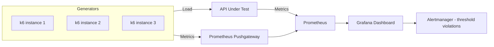

⚡ TL;DR - API load testing validates that your service
meets its SLO under expected and peak load; three test
types: (1) load test (expected traffic), (2) stress
test (2-5× expected, find the breaking point), (3)
soak test (steady load for 24h+, find memory leaks);
k6 is the modern choice: JavaScript-based scenarios,
outputs to Prometheus/Grafana, runs from CI/CD; key
metrics: P99 latency (not average), error rate, RPS
throughput; the load generator itself must not be the
bottleneck (use distributed k6 or k6 cloud for > 10k
VUs); always test with realistic data distribution
(not 100% cache hits), realistic think time, and
authorization headers matching production patterns.

---

| #067 | Category: HTTP & APIs | Difficulty: ★★★ |
|:---|:---|:---|
| **Depends on:** | API Observability, API Throttling and Quota Management | |
| **Used by:** | gRPC vs REST Performance at Scale | |
| **Related:** | API Observability, Rate Limiting, gRPC vs REST Performance, Real-World API Incidents | |

---

### 🔥 The Problem This Solves

**WORLD WITHOUT IT:**
Service is launched. First Black Friday: 10× normal
traffic. Service goes down in 15 minutes. Post-mortem:
database connection pool (max 20 connections) exhausted
at 50 concurrent requests. Service was tested manually
with 5 concurrent requests. No one tested beyond manual
capacity. Database pool is the bottleneck. This
bottleneck could have been found in 30 minutes of
load testing in staging.

**THE BREAKING POINT:**
Amazon Prime Day 2018: multiple third-party Amazon
sellers' systems went down due to unexpected traffic
spike from Amazon's promotion. Their APIs were not
tested for 10× traffic. Some had no timeout or
circuit breaker - cascading failure.

---

### 📘 Textbook Definition

**Load test types:**
- **Load test:** expected traffic levels for a sustained
  period (e.g., 500 RPS for 30 minutes). Validates
  that the service meets SLO under normal conditions.
- **Stress test:** beyond expected traffic (e.g., 500,
  1000, 2000, 5000 RPS). Find the breaking point and
  the failure mode (does it fail gracefully?).
- **Soak test (endurance):** sustained load over hours
  (24h+). Find memory leaks, connection pool leaks,
  cache growth, disk fills.
- **Spike test:** sudden burst (0 → 5000 RPS in 1
  second). Tests auto-scaling speed and burst handling.
- **Smoke test:** minimal load (1-5 VUs). Validates
  the test script runs correctly before load test.

**Key metrics to measure:**
- P50/P95/P99 latency (not average)
- Requests per second (throughput)
- Error rate (5xx and 4xx that should not appear)
- Active virtual users (VUs)
- Data received/sent (bandwidth)

**Tools:**
- **k6:** modern, JavaScript-based, excellent CLI,
  native Prometheus output, cloud mode. Best for new
  projects.
- **Gatling:** Scala DSL, detailed HTML reports, good
  for complex scenarios. Best for teams comfortable
  with JVM.
- **JMeter:** Java/GUI, extensive plugin ecosystem,
  heavy. Legacy choice; hard to version-control.
- **Locust:** Python, real Python for scenarios,
  distributed mode. Best for Python teams.

---

### ⏱️ Understand It in 30 Seconds

**One line:**
Load testing finds your API's breaking point in staging
before production traffic does it for you.

**One analogy:**
> Load testing is like a fire drill for your API.
> You simulate the emergency (high traffic) in a
> controlled environment (staging) to see where the
> cracks are. You find that the fire escape (rate
> limiter) is not big enough, the sprinklers (circuit
> breaker) fail too slowly, and one exit (database
> pool) gets jammed. You fix all three before the
> real fire. Without the drill: you find out during
> the real emergency.

**One insight:**
The most common load testing mistake is testing with
cached responses. A load test where 95% of requests
are cache hits does not represent production (which
may have 50% cache hits). Always test with realistic
data distribution: randomize user IDs, product IDs,
and search terms so the cache hit rate matches
production. A test with all requests hitting the same
product ID is testing your cache, not your API.

---

### 🔩 First Principles Explanation

**Virtual Users (VUs) vs RPS:**

```
VU (Virtual User): a simulated user that executes
the test script sequentially with think time.

RPS = VUs / (avg_response_time_sec + think_time_sec)

Example:
  Target: 1000 RPS
  Avg response time: 50ms = 0.05s
  Think time: 100ms = 0.1s
  Required VUs = 1000 × (0.05 + 0.1) = 150 VUs

If think time = 0 (no pause between requests):
  Required VUs = 1000 × 0.05 = 50 VUs
  But this is not realistic (real users have think time)

For APIs (no browser, pure API calls): think time = 0
is more realistic (automated API clients don't think)
```

**Capacity planning with load test results:**

```
Load test result at 500 RPS:
  P99 latency: 45ms (SLO: < 200ms) ✓
  Error rate: 0.01% ✓
  CPU: 65%
  DB pool: 75% utilized

Stress test at 2000 RPS:
  P99 latency: 850ms (SLO: < 200ms) ✗
  Error rate: 8% (5xx)
  CPU: 95%
  DB pool: 100% (pool exhausted - waiting)

Breaking point: ~1500 RPS
Headroom: (1500 - 500) / 500 = 200%
Action: current capacity OK, scale at 750 RPS (50% headroom)
```

---

### 🧪 Thought Experiment

**SCENARIO: Why is load test P99 higher than production P99?**

```
Load test P99: 800ms
Production P99: 120ms (with same VU count)

Possible causes:
1. Test environment: less CPU, less memory than production
   → Scale test environment to match production

2. Test data: all requests hit 10 test users (hot cache)
   → Randomize test data to match production cache hit rate

3. Test script: no authentication (real service has OAuth)
   → Add authentication to test script

4. Network: test generator in different data center
   from test service
   → Co-locate load generator and target service

5. Database: test DB has 1000 rows; production DB has
   10M rows (query plan different)
   → Pre-populate test DB with realistic data volume
```

---

### 🧠 Mental Model / Analogy

> Load testing is the X-ray before surgery. You see
> the internal structure under stress before you cut
> (deploy). Without it: you find the fractures during
> the operation. The load test reveals: which connection
> pools are too small (X-ray shows narrow bones), which
> services have memory leaks (see it growing under
> sustained load), which rate limits are too aggressive
> (see errors at expected load), and what the actual
> breaking point is vs what you assumed.

---

### 📶 Gradual Depth - Five Levels

**Level 1 - What it is (anyone can understand):**
Load testing sends many fake users to your API at
once to see how it handles the traffic. Like a practice
run before the big day.

**Level 2 - How to use it (junior developer):**
Write a k6 script, run `k6 run --vus 50 --duration 5m
script.js`. Check the output for P99 latency and error
rate. Start with smoke test (1 VU), then load test
(expected traffic), then stress test (2-5×).

**Level 3 - How it works (mid-level engineer):**
k6 creates virtual users (goroutines) each executing
the script in a loop. Each VU makes HTTP requests,
measures latency, counts errors. k6 aggregates metrics
across all VUs. Output: percentile distribution of
latency, RPS, error rate. For distributed testing:
k6 runs as multiple processes or uses k6 cloud.

**Level 4 - Why it was designed this way (senior/staff):**
k6 is written in Go with a JavaScript scripting engine
(goja). Go goroutines: one goroutine per VU, lightweight
(~8KB stack). Can run 10,000 VUs on a single machine.
JMeter: one Java thread per VU (~1MB stack). Maximum
500-1000 VUs per machine. k6's goroutine model enables
higher concurrency on cheaper hardware. This is the
key technical advantage of k6 over JMeter.

**Level 5 - Mastery (distinguished engineer):**
Distributed load testing strategy: a single k6 instance
can generate ~10k RPS on modern hardware. Above that:
k6-operator on Kubernetes (distributed k6 pods) or
k6 cloud. The load generator MUST be faster than
the system under test. If the load generator is
saturating its own CPU: results are invalid (the
generator, not the API, is the bottleneck). Monitor
load generator CPU during tests. Distributed load
generation: each generator instance writes to a shared
Prometheus pushgateway and Grafana aggregates.

---

### ⚙️ How It Works (Mechanism)

**k6 load test script:**

```javascript
// k6 load test for an authenticated REST API
import http from 'k6/http';
import { check, sleep } from 'k6';
import { Rate, Trend } from 'k6/metrics';

// Custom metrics
const errorRate = new Rate('error_rate');
const orderLatency = new Trend('order_api_latency');

export const options = {
  stages: [
    // Ramp up
    { duration: '2m', target: 100 },   // 0 → 100 VUs
    // Sustain load
    { duration: '5m', target: 100 },   // 100 VUs for 5min
    // Stress test
    { duration: '2m', target: 500 },   // 100 → 500 VUs
    // Find breaking point
    { duration: '3m', target: 1000 },  // 500 → 1000 VUs
    // Cool down
    { duration: '2m', target: 0 },     // Ramp down
  ],
  thresholds: {
    'http_req_duration{name:orders_get}': ['p(99)<200'],  // P99 < 200ms
    'error_rate': ['rate<0.01'],        // Error rate < 1%
    'http_req_failed': ['rate<0.01'],   // HTTP failures < 1%
  },
};

// Use k6 env vars for config (not hardcoded in script)
const BASE_URL = __ENV.BASE_URL || 'https://api.staging.example.com';
const API_TOKEN = __ENV.API_TOKEN;  // From CI secret

// Realistic test data (randomized)
const productIds = ['p001', 'p002', 'p003', 'p004', 'p005',
                    'p006', 'p007', 'p008', 'p009', 'p010'];
function randomProduct() {
  return productIds[Math.floor(Math.random() * productIds.length)];
}

// Virtual user scenario
export default function() {
  const headers = {
    'Authorization': `Bearer ${API_TOKEN}`,
    'Content-Type': 'application/json',
  };

  // --- Scenario: browse + order ---

  // 1. Get product (tagged for separate threshold)
  const productRes = http.get(
    `${BASE_URL}/products/${randomProduct()}`,
    { headers, tags: { name: 'products_get' } }
  );
  check(productRes, {
    'product status 200': (r) => r.status === 200,
    'product response time < 100ms': (r) => r.timings.duration < 100,
  });

  sleep(1);  // Think time: 1 second between actions

  // 2. Create order
  const start = Date.now();
  const orderRes = http.post(
    `${BASE_URL}/orders`,
    JSON.stringify({
      product_id: randomProduct(),
      quantity: Math.floor(Math.random() * 5) + 1,
    }),
    { headers, tags: { name: 'orders_create' } }
  );
  orderLatency.add(Date.now() - start);

  const orderOk = check(orderRes, {
    'order status 201': (r) => r.status === 201,
    'order has id': (r) => JSON.parse(r.body).order_id !== undefined,
  });
  errorRate.add(!orderOk);

  sleep(2);  // Think time
}
```

**Prometheus output and Grafana alerting:**

```bash
# Run k6 with Prometheus remote write
k6 run \
  --out experimental-prometheus-rw \
  -e K6_PROMETHEUS_RW_SERVER_URL=http://prometheus:9090 \
  -e BASE_URL=https://api.staging.example.com \
  -e API_TOKEN=test_token_here \
  script.js

# Or output to stdout for quick review
k6 run --vus 50 --duration 30s script.js
```



---

### 🔄 The Complete Picture - End-to-End Flow

**CI/CD integration:**

```yaml
# GitHub Actions load test job
name: Load Test

on:
  workflow_dispatch:
  schedule:
    - cron: '0 2 * * 1'  # Weekly Monday 2 AM

jobs:
  load-test:
    runs-on: ubuntu-latest
    steps:
      - uses: actions/checkout@v3

      - name: Run k6 smoke test
        uses: grafana/k6-action@v0.3.1
        with:
          filename: tests/load/script.js
          flags: --vus 1 --duration 30s
        env:
          BASE_URL: ${{ secrets.STAGING_URL }}
          API_TOKEN: ${{ secrets.TEST_TOKEN }}

      - name: Run load test
        uses: grafana/k6-action@v0.3.1
        with:
          filename: tests/load/script.js
          flags: --vus 100 --duration 5m
        env:
          BASE_URL: ${{ secrets.STAGING_URL }}
          API_TOKEN: ${{ secrets.TEST_TOKEN }}

      - name: Upload results
        if: always()
        uses: actions/upload-artifact@v3
        with:
          name: k6-results
          path: results.json
```

---

### 💻 Code Example

**Example 1 - BAD: Load test with unrealistic data**

```javascript
// BAD: Same user ID every request = all cache hits
// Doesn't represent production (cache miss scenarios)
export default function() {
  http.get(`${BASE_URL}/users/12345`);  // Always same user
  http.get(`${BASE_URL}/products/99`); // Always same product
  // This tests your cache, not your API or database
}

// GOOD: Randomized data to match production distribution
const userIds = Array.from({length: 1000}, (_, i) => i + 1);
const productIds = Array.from({length: 500}, (_, i) => i + 1);

export default function() {
  const userId = userIds[Math.floor(Math.random() * userIds.length)];
  const productId = productIds[Math.floor(Math.random() * productIds.length)];
  http.get(`${BASE_URL}/users/${userId}`);
  http.get(`${BASE_URL}/products/${productId}`);
  // Now cache hit rate matches production (500 unique products
  // → some repeated requests = realistic cache hits)
}
```

---

### ⚖️ Comparison Table

| Tool | Language | VUs per Machine | Best for | CI/CD |
|:---|:---|:---|:---|:---|
| k6 | JavaScript | 10,000+ | Modern APIs, microservices | Excellent |
| Gatling | Scala/Java | 1,000-2,000 | Complex scenarios | Good |
| JMeter | Java/GUI | 500-1,000 | Legacy teams, GUI users | Poor (XML configs) |
| Locust | Python | 1,000-3,000 | Python teams | Good |
| Artillery | JS/YAML | 3,000-5,000 | Simple scenarios | Good |

---

### ⚠️ Common Misconceptions

| Misconception | Reality |
|:---|:---|
| P50 latency passing SLO means the service is ready | P50 means 50% of users see that latency. P99 is what the worst 1% experience. If your SLO is < 200ms, P99 must be < 200ms, not P50. A service with P50=50ms and P99=5000ms fails 1% of users. Always test P99 against SLO. |
| Running load tests against production is acceptable | Load tests stress the system and can cause outages. Run against staging. Exception: chaos engineering in production (with careful blast radius control). Load tests belong in staging with production-like data volume and configuration. |
| The load test result is only valid on the day it was run | Load tests should be run regularly (weekly CI/CD job) and results tracked over time. A P99 that gradually increases from 45ms to 150ms over 4 weeks indicates a performance regression (memory leak, query degradation, cache size issue). Point-in-time tests miss trends. |
| 100% pass rate means no problems | 100% HTTP success rate during load test does not mean no problems: (1) very slow responses (P99=8s) can have 0% error rate; (2) some error types return 200 OK (application-level errors in JSON body); (3) degraded functionality (shorter results, cached stale data) not detectable by status code alone. Check both status codes AND response body validation. |

---

### 🚨 Failure Modes & Diagnosis

**Load generator is the bottleneck (invalid test)**

**Symptom:** During load test, target API reports
normal metrics (P99=45ms, CPU=30%). But k6 reports
P99=2000ms and errors. Load generator CPU is 100%.

**Root Cause:** k6 instance saturated. It cannot send
requests fast enough. The measured latency includes
queue time in the load generator (not the API).

**Diagnosis:**
```bash
# Check k6 machine CPU during test
top  # CPU usage of k6 process

# k6 metric: http_req_blocked (wait time before request sent)
# If http_req_blocked >> http_req_duration: generator bottleneck
k6 run script.js | grep "http_req_blocked"
```

**Fix:**
Scale k6 horizontally:
```bash
# k6 distributed run with k6-operator (Kubernetes)
# Or use k6 cloud:
k6 cloud script.js

# Or split VUs across multiple k6 instances:
# Instance 1: k6 run --vus 500 script.js
# Instance 2: k6 run --vus 500 script.js
# Prometheus aggregates from both
```

---

### 🔗 Related Keywords

**Prerequisites (understand these first):**
- `API Observability` - metrics to monitor during test
- `API Throttling and Quota Management` - test against
  rate limits intentionally

**Builds On This (learn these next):**
- `gRPC vs REST Performance at Scale` - use load tests
  to compare protocols empirically

---

### 📌 Quick Reference Card

```
┌──────────────────────────────────────────────────────────┐
│ Test types   │ Load (normal) → Stress (2-5×) → Soak (24h)│
│              │ Spike (burst) + Smoke (validate script)   │
├──────────────┼───────────────────────────────────────────┤
│ Key metrics  │ P99 latency (not average), error rate      │
│              │ RPS throughput, resource utilization       │
├──────────────┼───────────────────────────────────────────┤
│ k6 basics    │ --vus 100 --duration 5m                   │
│              │ stages: ramp-up + sustain + ramp-down     │
├──────────────┼───────────────────────────────────────────┤
│ Data         │ Randomize user/product IDs                │
│              │ Match production cache hit rate           │
├──────────────┼───────────────────────────────────────────┤
│ VU formula   │ VUs = RPS × (latency_sec + think_time)    │
├──────────────┼───────────────────────────────────────────┤
│ ONE-LINER    │ "Test P99 against SLO, not P50 against    │
│              │  best case; randomize data for realism"   │
└──────────────────────────────────────────────────────────┘
```

**If you remember only 3 things:**
1. Always measure P99, not average. Alert when P99
   exceeds SLO. Average latency hides tail latency.
2. Randomize test data (user IDs, product IDs) to
   match production cache hit rate. Uniform data tests
   your cache, not your API.
3. Monitor the load generator's CPU. If it hits 100%,
   your results are invalid - the generator is the
   bottleneck.

---

### 💎 Transferable Wisdom

**Reusable Engineering Principle:**
"Test at the boundary, not in the comfort zone."
Load testing at 50% of expected traffic tells you the
system works at 50%. It tells you nothing about what
happens at 100%, 150%, or 200%. Always test to the
breaking point (stress test) to know where the cliff
is. The safety margin is the distance between normal
operation and the breaking point. This principle:
test security controls with actual attack payloads
(not just valid inputs); test memory usage with maximum
realistic data volumes (not just 100 rows); test
disk usage with 6 months of logs pre-loaded (not empty
disk). Comfort zone testing gives comfort, not
confidence.

**Where else this pattern applies:**
- Database capacity: test with production-volume data
  before migrating, not with a 1000-row test dataset
- Network bandwidth: test with worst-case payload sizes
  (video streams, large exports) not average request size
- Chaos engineering: inject real failures (kill pods,
  lose network partitions) not just "reduce traffic 10%"

---

### 💡 The Surprising Truth

The most common load test failure mode is not found
by the load test itself - it is found afterward. Many
services handle 1000 RPS during a 30-minute load test
but start degrading at hour 6. The reason: slow memory
leaks, Hibernate session cache growth, thread local
objects not properly cleaned up, DNS cache not expiring,
JVM heap fragmentation. A 30-minute load test misses
all of these. The soak test (24+ hours of sustained
load) is the test that most teams skip (it is slow,
uses resources for a full day, and seems like overkill).
But it is precisely the test that catches the issues
that cause weekly 3 AM pages ("why does our service
need restarting every Sunday?"). If you can only run
one extra test beyond the standard load test: run a
4-hour soak at 80% of expected traffic. You will
find more production issues in those 4 hours than
in any other test type.

---

### ✅ Mastery Checklist

**You've mastered this when you can:**
1. **WRITE** A k6 script with stages (ramp-up, sustain,
   stress, cool-down), randomized test data, authentication,
   and P99 thresholds.
2. **CALCULATE** Required VU count from target RPS,
   expected latency, and think time.
3. **DIAGNOSE** Whether the load generator or the target
   API is the bottleneck using `http_req_blocked` metric.
4. **DESIGN** A soak test schedule and explain what
   failure modes only soak tests reveal.
5. **INTEGRATE** k6 into CI/CD with fail criteria on
   P99 latency threshold and error rate.

---

### 🎯 Interview Deep-Dive

**Q1: How do you load test a new API before launch?**

*Why they ask:* Tests systematic performance thinking.

*Strong answer includes:*
- Start with smoke test (1 VU, 30s): verify the test
  script works and the API responds correctly.
- Load test (expected traffic, 30min): run at 100%
  of expected production traffic. Verify P99 latency
  meets SLO. Verify error rate < 1%.
- Stress test (ramp to 500% of expected): find the
  breaking point. Find the first failure mode (DB pool?
  thread pool? memory?). Fix the first bottleneck,
  re-test.
- Soak test (80% of expected, 4 hours): find memory
  leaks, connection leaks, gradual performance
  degradation.
- Data: randomize IDs to match production cache hit
  rate. Pre-populate DB with production-volume data.
- Metrics: P99 latency (compare to SLO), error rate,
  RPS throughput, CPU/memory/DB pool utilization.
- Thresholds in k6: `'http_req_duration': ['p(99)<200']`.
  Test fails CI if thresholds are breached.

**Q2: What is the difference between a load test, stress
test, and soak test? When do you use each?**

*Why they ask:* Tests load testing taxonomy knowledge.

*Strong answer includes:*
- Load test: run at 100-120% of expected traffic for
  30-60 minutes. Goal: validate SLO compliance at normal
  load. Use: before every major release.
- Stress test: ramp up from 100% to 500%+ of expected
  traffic. Goal: find the breaking point and the failure
  mode. Use: quarterly or after major architecture changes.
  Find: what breaks first (DB pool, cache, CPU, network),
  does it fail gracefully (circuit breakers, rate limits
  kick in), what is the recovery time.
- Soak test: 70-100% of expected traffic for 4-48 hours.
  Goal: find time-dependent failures. Use: before
  launching a new long-running service; whenever memory
  metrics show a slow upward trend in production. Find:
  memory leaks, connection pool leaks, garbage collection
  pressure, disk space accumulation, cache size growth.
- Spike test: sudden 0 → 10× traffic in 10 seconds.
  Goal: test auto-scaling speed and burst handling.
  Find: how fast does auto-scaling add capacity; what
  happens in the 60 seconds before new instances are
  ready (queues fill? 429s? graceful degradation?).
